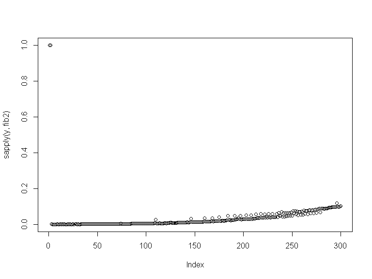

# GNBF5010-Assignment-5
Ping Chong Ho  
Saturday, November 29, 2014  

## Iterative Fibonacci

A iterative fibonacci function which print out the nth fibonacci number:


```r
fib2 <- function(n){
  start <- Sys.time()
  if(n==0||n==1){
    print(n)
    return(n)}
  if(n==2) return(1)
  f1 = f2 = 1
    print(f1)
  for(i in seq(1,n-1)){
    f=f1+f2
    print(f1)
    f2=f1
    f1=f
  }
  end <- Sys.time()
  print(end-start)
}
```


For example the 10th Fibonacci sequence

```r
fib2(10)
```

```
## [1] 1
## [1] 1
## [1] 2
## [1] 3
## [1] 5
## [1] 8
## [1] 13
## [1] 21
## [1] 34
## [1] 55
## Time difference of 0.0009999275 secs
```


## Plot 1 to 300 Fibonacci against time by iterative Fibonacci

```r
y <- 1:300
plot(sapply(y,fib2))
```

```
## [1] 1
## [1] 1
## [1] 1
## [1] 2
## Time difference of 0.001000166 secs
## [1] 1
## [1] 1
## [1] 2
## [1] 3
## Time difference of 0 secs
## [1] 1
## [1] 1
## [1] 2
## [1] 3
## [1] 5
## Time difference of 0 secs
## [1] 1
## [1] 1
## [1] 2
## [1] 3
## [1] 5
## [1] 8
## Time difference of 0 secs
## [1] 1
## [1] 1
## [1] 2
## [1] 3
## [1] 5
## [1] 8
## [1] 13
## Time difference of 0 secs
## [1] 1
## [1] 1
## [1] 2
## [1] 3
## [1] 5
## [1] 8
## [1] 13
## [1] 21
## Time difference of 0 secs
## [1] 1
## [1] 1
## [1] 2
## [1] 3
## [1] 5
## [1] 8
## [1] 13
## [1] 21
## [1] 34
## Time difference of 0.0009999275 secs
## [1] 1
## [1] 1
## [1] 2
## [1] 3
## [1] 5
## [1] 8
## [1] 13
## [1] 21
## [1] 34
## [1] 55
## Time difference of 0 secs
## [1] 1
## [1] 1
## [1] 2
## [1] 3
## [1] 5
## [1] 8
## [1] 13
## [1] 21
## [1] 34
## [1] 55
## [1] 89
## Time difference of 0 secs
## [1] 1
## [1] 1
## [1] 2
## [1] 3
## [1] 5
## [1] 8
## [1] 13
## [1] 21
## [1] 34
## [1] 55
## [1] 89
## [1] 144
## Time difference of 0.00100112 secs
## [1] 1
## [1] 1
## [1] 2
## [1] 3
## [1] 5
## [1] 8
## [1] 13
## [1] 21
## [1] 34
## [1] 55
## [1] 89
## [1] 144
## [1] 233
## Time difference of 0 secs
## [1] 1
## [1] 1
## [1] 2
## [1] 3
## [1] 5
## [1] 8
## [1] 13
## [1] 21
## [1] 34
## [1] 55
## [1] 89
## [1] 144
## [1] 233
## [1] 377
## Time difference of 0.0009999275 secs
## [1] 1
## [1] 1
## [1] 2
## [1] 3
## [1] 5
## [1] 8
## [1] 13
## [1] 21
## [1] 34
## [1] 55
## [1] 89
## [1] 144
## [1] 233
## [1] 377
## [1] 610
## Time difference of 0 secs
## [1] 1
## [1] 1
## [1] 2
## [1] 3
## [1] 5
## [1] 8
## [1] 13
## [1] 21
## [1] 34
## [1] 55
## [1] 89
## [1] 144
## [1] 233
## [1] 377
## [1] 610
## [1] 987
## Time difference of 0.0009999275 secs
## [1] 1
## [1] 1
## [1] 2
## [1] 3
## [1] 5
## [1] 8
## [1] 13
## [1] 21
## [1] 34
## [1] 55
## [1] 89
## [1] 144
## [1] 233
## [1] 377
## [1] 610
## [1] 987
## [1] 1597
## Time difference of 0 secs
## [1] 1
## [1] 1
## [1] 2
## [1] 3
## [1] 5
## [1] 8
## [1] 13
## [1] 21
## [1] 34
## [1] 55
## [1] 89
## [1] 144
## [1] 233
## [1] 377
## [1] 610
## [1] 987
## [1] 1597
## [1] 2584
## Time difference of 0 secs
## [1] 1
## [1] 1
## [1] 2
## [1] 3
## [1] 5
## [1] 8
## [1] 13
## [1] 21
## [1] 34
## [1] 55
## [1] 89
## [1] 144
## [1] 233
## [1] 377
## [1] 610
## [1] 987
## [1] 1597
## [1] 2584
## [1] 4181
## Time difference of 0 secs
## [1] 1
## [1] 1
## [1] 2
## [1] 3
## [1] 5
## [1] 8
## [1] 13
## [1] 21
## [1] 34
## [1] 55
## [1] 89
## [1] 144
## [1] 233
## [1] 377
## [1] 610
## [1] 987
## [1] 1597
## [1] 2584
## [1] 4181
## [1] 6765
## Time difference of 0.0009999275 secs
## [1] 1
## [1] 1
## [1] 2
## [1] 3
## [1] 5
## [1] 8
## [1] 13
## [1] 21
## [1] 34
## [1] 55
## [1] 89
## [1] 144
## [1] 233
## [1] 377
## [1] 610
## [1] 987
## [1] 1597
## [1] 2584
## [1] 4181
## [1] 6765
## [1] 10946
## Time difference of 0 secs
## [1] 1
## [1] 1
## [1] 2
## [1] 3
## [1] 5
## [1] 8
## [1] 13
## [1] 21
## [1] 34
## [1] 55
## [1] 89
## [1] 144
## [1] 233
## [1] 377
## [1] 610
## [1] 987
## [1] 1597
## [1] 2584
## [1] 4181
## [1] 6765
## [1] 10946
## [1] 17711
## Time difference of 0.001000166 secs
## [1] 1
## [1] 1
## [1] 2
## [1] 3
## [1] 5
## [1] 8
## [1] 13
## [1] 21
## [1] 34
## [1] 55
## [1] 89
## [1] 144
## [1] 233
## [1] 377
## [1] 610
## [1] 987
## [1] 1597
## [1] 2584
## [1] 4181
## [1] 6765
## [1] 10946
## [1] 17711
## [1] 28657
## Time difference of 0 secs
## [1] 1
## [1] 1
## [1] 2
## [1] 3
## [1] 5
## [1] 8
## [1] 13
## [1] 21
## [1] 34
## [1] 55
## [1] 89
## [1] 144
## [1] 233
## [1] 377
## [1] 610
## [1] 987
## [1] 1597
## [1] 2584
## [1] 4181
## [1] 6765
## [1] 10946
## [1] 17711
## [1] 28657
## [1] 46368
## Time difference of 0 secs
## [1] 1
## [1] 1
## [1] 2
## [1] 3
## [1] 5
## [1] 8
## [1] 13
## [1] 21
## [1] 34
## [1] 55
## [1] 89
## [1] 144
## [1] 233
## [1] 377
## [1] 610
## [1] 987
## [1] 1597
## [1] 2584
## [1] 4181
## [1] 6765
## [1] 10946
## [1] 17711
## [1] 28657
## [1] 46368
## [1] 75025
## Time difference of 0.0009999275 secs
## [1] 1
## [1] 1
## [1] 2
## [1] 3
## [1] 5
## [1] 8
## [1] 13
## [1] 21
## [1] 34
## [1] 55
## [1] 89
## [1] 144
## [1] 233
## [1] 377
## [1] 610
## [1] 987
## [1] 1597
## [1] 2584
## [1] 4181
## [1] 6765
## [1] 10946
## [1] 17711
## [1] 28657
## [1] 46368
## [1] 75025
## [1] 121393
## Time difference of 0 secs
## [1] 1
## [1] 1
## [1] 2
## [1] 3
## [1] 5
## [1] 8
## [1] 13
## [1] 21
## [1] 34
## [1] 55
## [1] 89
## [1] 144
## [1] 233
## [1] 377
## [1] 610
## [1] 987
## [1] 1597
## [1] 2584
## [1] 4181
## [1] 6765
## [1] 10946
## [1] 17711
## [1] 28657
## [1] 46368
## [1] 75025
## [1] 121393
## [1] 196418
## Time difference of 0 secs
## [1] 1
## [1] 1
## [1] 2
## [1] 3
## [1] 5
## [1] 8
## [1] 13
## [1] 21
## [1] 34
## [1] 55
## [1] 89
## [1] 144
## [1] 233
## [1] 377
## [1] 610
## [1] 987
## [1] 1597
## [1] 2584
## [1] 4181
## [1] 6765
## [1] 10946
## [1] 17711
## [1] 28657
## [1] 46368
## [1] 75025
## [1] 121393
## [1] 196418
## [1] 317811
## Time difference of 0.0009999275 secs
## [1] 1
## [1] 1
## [1] 2
## [1] 3
## [1] 5
## [1] 8
## [1] 13
## [1] 21
## [1] 34
## [1] 55
## [1] 89
## [1] 144
## [1] 233
## [1] 377
## [1] 610
## [1] 987
## [1] 1597
## [1] 2584
## [1] 4181
## [1] 6765
## [1] 10946
## [1] 17711
## [1] 28657
## [1] 46368
## [1] 75025
## [1] 121393
## [1] 196418
## [1] 317811
## [1] 514229
## Time difference of 0.0009999275 secs
## [1] 1
## [1] 1
## [1] 2
## [1] 3
## [1] 5
## [1] 8
## [1] 13
## [1] 21
## [1] 34
## [1] 55
## [1] 89
## [1] 144
## [1] 233
## [1] 377
## [1] 610
## [1] 987
## [1] 1597
## [1] 2584
## [1] 4181
## [1] 6765
## [1] 10946
## [1] 17711
## [1] 28657
## [1] 46368
## [1] 75025
## [1] 121393
## [1] 196418
## [1] 317811
## [1] 514229
## [1] 832040
## Time difference of 0 secs
## [1] 1
## [1] 1
## [1] 2
## [1] 3
## [1] 5
## [1] 8
## [1] 13
## [1] 21
## [1] 34
## [1] 55
## [1] 89
## [1] 144
## [1] 233
## [1] 377
## [1] 610
## [1] 987
## [1] 1597
## [1] 2584
## [1] 4181
## [1] 6765
## [1] 10946
## [1] 17711
## [1] 28657
## [1] 46368
## [1] 75025
## [1] 121393
## [1] 196418
## [1] 317811
## [1] 514229
## [1] 832040
## [1] 1346269
## Time difference of 0.0009999275 secs
## [1] 1
## [1] 1
## [1] 2
## [1] 3
## [1] 5
## [1] 8
## [1] 13
## [1] 21
## [1] 34
## [1] 55
## [1] 89
## [1] 144
## [1] 233
## [1] 377
## [1] 610
## [1] 987
## [1] 1597
## [1] 2584
## [1] 4181
## [1] 6765
## [1] 10946
## [1] 17711
## [1] 28657
## [1] 46368
## [1] 75025
## [1] 121393
## [1] 196418
## [1] 317811
## [1] 514229
## [1] 832040
## [1] 1346269
## [1] 2178309
## Time difference of 0.001000166 secs
## [1] 1
## [1] 1
## [1] 2
## [1] 3
## [1] 5
## [1] 8
## [1] 13
## [1] 21
## [1] 34
## [1] 55
## [1] 89
## [1] 144
## [1] 233
## [1] 377
## [1] 610
## [1] 987
## [1] 1597
## [1] 2584
## [1] 4181
## [1] 6765
## [1] 10946
## [1] 17711
## [1] 28657
## [1] 46368
## [1] 75025
## [1] 121393
## [1] 196418
## [1] 317811
## [1] 514229
## [1] 832040
## [1] 1346269
## [1] 2178309
## [1] 3524578
## Time difference of 0.0009999275 secs
## [1] 1
## [1] 1
## [1] 2
## [1] 3
## [1] 5
## [1] 8
## [1] 13
## [1] 21
## [1] 34
## [1] 55
## [1] 89
## [1] 144
## [1] 233
## [1] 377
## [1] 610
## [1] 987
## [1] 1597
## [1] 2584
## [1] 4181
## [1] 6765
## [1] 10946
## [1] 17711
## [1] 28657
## [1] 46368
## [1] 75025
## [1] 121393
## [1] 196418
## [1] 317811
## [1] 514229
## [1] 832040
## [1] 1346269
## [1] 2178309
## [1] 3524578
## [1] 5702887
## Time difference of 0.0009999275 secs
## [1] 1
## [1] 1
## [1] 2
## [1] 3
## [1] 5
## [1] 8
## [1] 13
## [1] 21
## [1] 34
## [1] 55
## [1] 89
## [1] 144
## [1] 233
## [1] 377
## [1] 610
## [1] 987
## [1] 1597
## [1] 2584
## [1] 4181
## [1] 6765
## [1] 10946
## [1] 17711
## [1] 28657
## [1] 46368
## [1] 75025
## [1] 121393
## [1] 196418
## [1] 317811
## [1] 514229
## [1] 832040
## [1] 1346269
## [1] 2178309
## [1] 3524578
## [1] 5702887
## [1] 9227465
## Time difference of 0 secs
## [1] 1
## [1] 1
## [1] 2
## [1] 3
## [1] 5
## [1] 8
## [1] 13
## [1] 21
## [1] 34
## [1] 55
## [1] 89
## [1] 144
## [1] 233
## [1] 377
## [1] 610
## [1] 987
## [1] 1597
## [1] 2584
## [1] 4181
## [1] 6765
## [1] 10946
## [1] 17711
## [1] 28657
## [1] 46368
## [1] 75025
## [1] 121393
## [1] 196418
## [1] 317811
## [1] 514229
## [1] 832040
## [1] 1346269
## [1] 2178309
## [1] 3524578
## [1] 5702887
## [1] 9227465
## [1] 14930352
## Time difference of 0 secs
## [1] 1
## [1] 1
## [1] 2
## [1] 3
## [1] 5
## [1] 8
## [1] 13
## [1] 21
## [1] 34
## [1] 55
## [1] 89
## [1] 144
## [1] 233
## [1] 377
## [1] 610
## [1] 987
## [1] 1597
## [1] 2584
## [1] 4181
## [1] 6765
## [1] 10946
## [1] 17711
## [1] 28657
## [1] 46368
## [1] 75025
## [1] 121393
## [1] 196418
## [1] 317811
## [1] 514229
## [1] 832040
## [1] 1346269
## [1] 2178309
## [1] 3524578
## [1] 5702887
## [1] 9227465
## [1] 14930352
## [1] 24157817
## Time difference of 0.0009999275 secs
## [1] 1
## [1] 1
## [1] 2
## [1] 3
## [1] 5
## [1] 8
## [1] 13
## [1] 21
## [1] 34
## [1] 55
## [1] 89
## [1] 144
## [1] 233
## [1] 377
## [1] 610
## [1] 987
## [1] 1597
## [1] 2584
## [1] 4181
## [1] 6765
## [1] 10946
## [1] 17711
## [1] 28657
## [1] 46368
## [1] 75025
## [1] 121393
## [1] 196418
## [1] 317811
## [1] 514229
## [1] 832040
## [1] 1346269
## [1] 2178309
## [1] 3524578
## [1] 5702887
## [1] 9227465
## [1] 14930352
## [1] 24157817
## [1] 39088169
## Time difference of 0.00100112 secs
## [1] 1
## [1] 1
## [1] 2
## [1] 3
## [1] 5
## [1] 8
## [1] 13
## [1] 21
## [1] 34
## [1] 55
## [1] 89
## [1] 144
## [1] 233
## [1] 377
## [1] 610
## [1] 987
## [1] 1597
## [1] 2584
## [1] 4181
## [1] 6765
## [1] 10946
## [1] 17711
## [1] 28657
## [1] 46368
## [1] 75025
## [1] 121393
## [1] 196418
## [1] 317811
## [1] 514229
## [1] 832040
## [1] 1346269
## [1] 2178309
## [1] 3524578
## [1] 5702887
## [1] 9227465
## [1] 14930352
## [1] 24157817
## [1] 39088169
## [1] 63245986
## Time difference of 0.0009999275 secs
## [1] 1
## [1] 1
## [1] 2
## [1] 3
## [1] 5
## [1] 8
## [1] 13
## [1] 21
## [1] 34
## [1] 55
## [1] 89
## [1] 144
## [1] 233
## [1] 377
## [1] 610
## [1] 987
## [1] 1597
## [1] 2584
## [1] 4181
## [1] 6765
## [1] 10946
## [1] 17711
## [1] 28657
## [1] 46368
## [1] 75025
## [1] 121393
## [1] 196418
## [1] 317811
## [1] 514229
## [1] 832040
## [1] 1346269
## [1] 2178309
## [1] 3524578
## [1] 5702887
## [1] 9227465
## [1] 14930352
## [1] 24157817
## [1] 39088169
## [1] 63245986
## [1] 102334155
## Time difference of 0.001999855 secs
## [1] 1
## [1] 1
## [1] 2
## [1] 3
## [1] 5
## [1] 8
## [1] 13
## [1] 21
## [1] 34
## [1] 55
## [1] 89
## [1] 144
## [1] 233
## [1] 377
## [1] 610
## [1] 987
## [1] 1597
## [1] 2584
## [1] 4181
## [1] 6765
## [1] 10946
## [1] 17711
## [1] 28657
## [1] 46368
## [1] 75025
## [1] 121393
## [1] 196418
## [1] 317811
## [1] 514229
## [1] 832040
## [1] 1346269
## [1] 2178309
## [1] 3524578
## [1] 5702887
## [1] 9227465
## [1] 14930352
## [1] 24157817
## [1] 39088169
## [1] 63245986
## [1] 102334155
## [1] 165580141
## Time difference of 0.001000166 secs
## [1] 1
## [1] 1
## [1] 2
## [1] 3
## [1] 5
## [1] 8
## [1] 13
## [1] 21
## [1] 34
## [1] 55
## [1] 89
## [1] 144
## [1] 233
## [1] 377
## [1] 610
## [1] 987
## [1] 1597
## [1] 2584
## [1] 4181
## [1] 6765
## [1] 10946
## [1] 17711
## [1] 28657
## [1] 46368
## [1] 75025
## [1] 121393
## [1] 196418
## [1] 317811
## [1] 514229
## [1] 832040
## [1] 1346269
## [1] 2178309
## [1] 3524578
## [1] 5702887
## [1] 9227465
## [1] 14930352
## [1] 24157817
## [1] 39088169
## [1] 63245986
## [1] 102334155
## [1] 165580141
## [1] 267914296
## Time difference of 0 secs
## [1] 1
## [1] 1
## [1] 2
## [1] 3
## [1] 5
## [1] 8
## [1] 13
## [1] 21
## [1] 34
## [1] 55
## [1] 89
## [1] 144
## [1] 233
## [1] 377
## [1] 610
## [1] 987
## [1] 1597
## [1] 2584
## [1] 4181
## [1] 6765
## [1] 10946
## [1] 17711
## [1] 28657
## [1] 46368
## [1] 75025
## [1] 121393
## [1] 196418
## [1] 317811
## [1] 514229
## [1] 832040
## [1] 1346269
## [1] 2178309
## [1] 3524578
## [1] 5702887
## [1] 9227465
## [1] 14930352
## [1] 24157817
## [1] 39088169
## [1] 63245986
## [1] 102334155
## [1] 165580141
## [1] 267914296
## [1] 433494437
## Time difference of 0.001000166 secs
## [1] 1
## [1] 1
## [1] 2
## [1] 3
## [1] 5
## [1] 8
## [1] 13
## [1] 21
## [1] 34
## [1] 55
## [1] 89
## [1] 144
## [1] 233
## [1] 377
## [1] 610
## [1] 987
## [1] 1597
## [1] 2584
## [1] 4181
## [1] 6765
## [1] 10946
## [1] 17711
## [1] 28657
## [1] 46368
## [1] 75025
## [1] 121393
## [1] 196418
## [1] 317811
## [1] 514229
## [1] 832040
## [1] 1346269
## [1] 2178309
## [1] 3524578
## [1] 5702887
## [1] 9227465
## [1] 14930352
## [1] 24157817
## [1] 39088169
## [1] 63245986
## [1] 102334155
## [1] 165580141
## [1] 267914296
## [1] 433494437
## [1] 701408733
## Time difference of 0.0009999275 secs
## [1] 1
## [1] 1
## [1] 2
## [1] 3
## [1] 5
## [1] 8
## [1] 13
## [1] 21
## [1] 34
## [1] 55
## [1] 89
## [1] 144
## [1] 233
## [1] 377
## [1] 610
## [1] 987
## [1] 1597
## [1] 2584
## [1] 4181
## [1] 6765
## [1] 10946
## [1] 17711
## [1] 28657
## [1] 46368
## [1] 75025
## [1] 121393
## [1] 196418
## [1] 317811
## [1] 514229
## [1] 832040
## [1] 1346269
## [1] 2178309
## [1] 3524578
## [1] 5702887
## [1] 9227465
## [1] 14930352
## [1] 24157817
## [1] 39088169
## [1] 63245986
## [1] 102334155
## [1] 165580141
## [1] 267914296
## [1] 433494437
## [1] 701408733
## [1] 1134903170
## Time difference of 0.0009999275 secs
## [1] 1
## [1] 1
## [1] 2
## [1] 3
## [1] 5
## [1] 8
## [1] 13
## [1] 21
## [1] 34
## [1] 55
## [1] 89
## [1] 144
## [1] 233
## [1] 377
## [1] 610
## [1] 987
## [1] 1597
## [1] 2584
## [1] 4181
## [1] 6765
## [1] 10946
## [1] 17711
## [1] 28657
## [1] 46368
## [1] 75025
## [1] 121393
## [1] 196418
## [1] 317811
## [1] 514229
## [1] 832040
## [1] 1346269
## [1] 2178309
## [1] 3524578
## [1] 5702887
## [1] 9227465
## [1] 14930352
## [1] 24157817
## [1] 39088169
## [1] 63245986
## [1] 102334155
## [1] 165580141
## [1] 267914296
## [1] 433494437
## [1] 701408733
## [1] 1134903170
## [1] 1836311903
## Time difference of 0.001000166 secs
## [1] 1
## [1] 1
## [1] 2
## [1] 3
## [1] 5
## [1] 8
## [1] 13
## [1] 21
## [1] 34
## [1] 55
## [1] 89
## [1] 144
## [1] 233
## [1] 377
## [1] 610
## [1] 987
## [1] 1597
## [1] 2584
## [1] 4181
## [1] 6765
## [1] 10946
## [1] 17711
## [1] 28657
## [1] 46368
## [1] 75025
## [1] 121393
## [1] 196418
## [1] 317811
## [1] 514229
## [1] 832040
## [1] 1346269
## [1] 2178309
## [1] 3524578
## [1] 5702887
## [1] 9227465
## [1] 14930352
## [1] 24157817
## [1] 39088169
## [1] 63245986
## [1] 102334155
## [1] 165580141
## [1] 267914296
## [1] 433494437
## [1] 701408733
## [1] 1134903170
## [1] 1836311903
## [1] 2971215073
## Time difference of 0.0009999275 secs
## [1] 1
## [1] 1
## [1] 2
## [1] 3
## [1] 5
## [1] 8
## [1] 13
## [1] 21
## [1] 34
## [1] 55
## [1] 89
## [1] 144
## [1] 233
## [1] 377
## [1] 610
## [1] 987
## [1] 1597
## [1] 2584
## [1] 4181
## [1] 6765
## [1] 10946
## [1] 17711
## [1] 28657
## [1] 46368
## [1] 75025
## [1] 121393
## [1] 196418
## [1] 317811
## [1] 514229
## [1] 832040
## [1] 1346269
## [1] 2178309
## [1] 3524578
## [1] 5702887
## [1] 9227465
## [1] 14930352
## [1] 24157817
## [1] 39088169
## [1] 63245986
## [1] 102334155
## [1] 165580141
## [1] 267914296
## [1] 433494437
## [1] 701408733
## [1] 1134903170
## [1] 1836311903
## [1] 2971215073
## [1] 4807526976
## Time difference of 0.0009999275 secs
## [1] 1
## [1] 1
## [1] 2
## [1] 3
## [1] 5
## [1] 8
## [1] 13
## [1] 21
## [1] 34
## [1] 55
## [1] 89
## [1] 144
## [1] 233
## [1] 377
## [1] 610
## [1] 987
## [1] 1597
## [1] 2584
## [1] 4181
## [1] 6765
## [1] 10946
## [1] 17711
## [1] 28657
## [1] 46368
## [1] 75025
## [1] 121393
## [1] 196418
## [1] 317811
## [1] 514229
## [1] 832040
## [1] 1346269
## [1] 2178309
## [1] 3524578
## [1] 5702887
## [1] 9227465
## [1] 14930352
## [1] 24157817
## [1] 39088169
## [1] 63245986
## [1] 102334155
## [1] 165580141
## [1] 267914296
## [1] 433494437
## [1] 701408733
## [1] 1134903170
## [1] 1836311903
## [1] 2971215073
## [1] 4807526976
## [1] 7778742049
## Time difference of 0.002000093 secs
## [1] 1
## [1] 1
## [1] 2
## [1] 3
## [1] 5
## [1] 8
## [1] 13
## [1] 21
## [1] 34
## [1] 55
## [1] 89
## [1] 144
## [1] 233
## [1] 377
## [1] 610
## [1] 987
## [1] 1597
## [1] 2584
## [1] 4181
## [1] 6765
## [1] 10946
## [1] 17711
## [1] 28657
## [1] 46368
## [1] 75025
## [1] 121393
## [1] 196418
## [1] 317811
## [1] 514229
## [1] 832040
## [1] 1346269
## [1] 2178309
## [1] 3524578
## [1] 5702887
## [1] 9227465
## [1] 14930352
## [1] 24157817
## [1] 39088169
## [1] 63245986
## [1] 102334155
## [1] 165580141
## [1] 267914296
## [1] 433494437
## [1] 701408733
## [1] 1134903170
## [1] 1836311903
## [1] 2971215073
## [1] 4807526976
## [1] 7778742049
## [1] 12586269025
## Time difference of 0.0009999275 secs
## [1] 1
## [1] 1
## [1] 2
## [1] 3
## [1] 5
## [1] 8
## [1] 13
## [1] 21
## [1] 34
## [1] 55
## [1] 89
## [1] 144
## [1] 233
## [1] 377
## [1] 610
## [1] 987
## [1] 1597
## [1] 2584
## [1] 4181
## [1] 6765
## [1] 10946
## [1] 17711
## [1] 28657
## [1] 46368
## [1] 75025
## [1] 121393
## [1] 196418
## [1] 317811
## [1] 514229
## [1] 832040
## [1] 1346269
## [1] 2178309
## [1] 3524578
## [1] 5702887
## [1] 9227465
## [1] 14930352
## [1] 24157817
## [1] 39088169
## [1] 63245986
## [1] 102334155
## [1] 165580141
## [1] 267914296
## [1] 433494437
## [1] 701408733
## [1] 1134903170
## [1] 1836311903
## [1] 2971215073
## [1] 4807526976
## [1] 7778742049
## [1] 12586269025
## [1] 20365011074
## Time difference of 0.00100112 secs
## [1] 1
## [1] 1
## [1] 2
## [1] 3
## [1] 5
## [1] 8
## [1] 13
## [1] 21
## [1] 34
## [1] 55
## [1] 89
## [1] 144
## [1] 233
## [1] 377
## [1] 610
## [1] 987
## [1] 1597
## [1] 2584
## [1] 4181
## [1] 6765
## [1] 10946
## [1] 17711
## [1] 28657
## [1] 46368
## [1] 75025
## [1] 121393
## [1] 196418
## [1] 317811
## [1] 514229
## [1] 832040
## [1] 1346269
## [1] 2178309
## [1] 3524578
## [1] 5702887
## [1] 9227465
## [1] 14930352
## [1] 24157817
## [1] 39088169
## [1] 63245986
## [1] 102334155
## [1] 165580141
## [1] 267914296
## [1] 433494437
## [1] 701408733
## [1] 1134903170
## [1] 1836311903
## [1] 2971215073
## [1] 4807526976
## [1] 7778742049
## [1] 12586269025
## [1] 20365011074
## [1] 32951280099
## Time difference of 0.001999855 secs
## [1] 1
## [1] 1
## [1] 2
## [1] 3
## [1] 5
## [1] 8
## [1] 13
## [1] 21
## [1] 34
## [1] 55
## [1] 89
## [1] 144
## [1] 233
## [1] 377
## [1] 610
## [1] 987
## [1] 1597
## [1] 2584
## [1] 4181
## [1] 6765
## [1] 10946
## [1] 17711
## [1] 28657
## [1] 46368
## [1] 75025
## [1] 121393
## [1] 196418
## [1] 317811
## [1] 514229
## [1] 832040
## [1] 1346269
## [1] 2178309
## [1] 3524578
## [1] 5702887
## [1] 9227465
## [1] 14930352
## [1] 24157817
## [1] 39088169
## [1] 63245986
## [1] 102334155
## [1] 165580141
## [1] 267914296
## [1] 433494437
## [1] 701408733
## [1] 1134903170
## [1] 1836311903
## [1] 2971215073
## [1] 4807526976
## [1] 7778742049
## [1] 12586269025
## [1] 20365011074
## [1] 32951280099
## [1] 53316291173
## Time difference of 0.001000166 secs
## [1] 1
## [1] 1
## [1] 2
## [1] 3
## [1] 5
## [1] 8
## [1] 13
## [1] 21
## [1] 34
## [1] 55
## [1] 89
## [1] 144
## [1] 233
## [1] 377
## [1] 610
## [1] 987
## [1] 1597
## [1] 2584
## [1] 4181
## [1] 6765
## [1] 10946
## [1] 17711
## [1] 28657
## [1] 46368
## [1] 75025
## [1] 121393
## [1] 196418
## [1] 317811
## [1] 514229
## [1] 832040
## [1] 1346269
## [1] 2178309
## [1] 3524578
## [1] 5702887
## [1] 9227465
## [1] 14930352
## [1] 24157817
## [1] 39088169
## [1] 63245986
## [1] 102334155
## [1] 165580141
## [1] 267914296
## [1] 433494437
## [1] 701408733
## [1] 1134903170
## [1] 1836311903
## [1] 2971215073
## [1] 4807526976
## [1] 7778742049
## [1] 12586269025
## [1] 20365011074
## [1] 32951280099
## [1] 53316291173
## [1] 86267571272
## Time difference of 0.001999855 secs
## [1] 1
## [1] 1
## [1] 2
## [1] 3
## [1] 5
## [1] 8
## [1] 13
## [1] 21
## [1] 34
## [1] 55
## [1] 89
## [1] 144
## [1] 233
## [1] 377
## [1] 610
## [1] 987
## [1] 1597
## [1] 2584
## [1] 4181
## [1] 6765
## [1] 10946
## [1] 17711
## [1] 28657
## [1] 46368
## [1] 75025
## [1] 121393
## [1] 196418
## [1] 317811
## [1] 514229
## [1] 832040
## [1] 1346269
## [1] 2178309
## [1] 3524578
## [1] 5702887
## [1] 9227465
## [1] 14930352
## [1] 24157817
## [1] 39088169
## [1] 63245986
## [1] 102334155
## [1] 165580141
## [1] 267914296
## [1] 433494437
## [1] 701408733
## [1] 1134903170
## [1] 1836311903
## [1] 2971215073
## [1] 4807526976
## [1] 7778742049
## [1] 12586269025
## [1] 20365011074
## [1] 32951280099
## [1] 53316291173
## [1] 86267571272
## [1] 139583862445
## Time difference of 0.0009999275 secs
## [1] 1
## [1] 1
## [1] 2
## [1] 3
## [1] 5
## [1] 8
## [1] 13
## [1] 21
## [1] 34
## [1] 55
## [1] 89
## [1] 144
## [1] 233
## [1] 377
## [1] 610
## [1] 987
## [1] 1597
## [1] 2584
## [1] 4181
## [1] 6765
## [1] 10946
## [1] 17711
## [1] 28657
## [1] 46368
## [1] 75025
## [1] 121393
## [1] 196418
## [1] 317811
## [1] 514229
## [1] 832040
## [1] 1346269
## [1] 2178309
## [1] 3524578
## [1] 5702887
## [1] 9227465
## [1] 14930352
## [1] 24157817
## [1] 39088169
## [1] 63245986
## [1] 102334155
## [1] 165580141
## [1] 267914296
## [1] 433494437
## [1] 701408733
## [1] 1134903170
## [1] 1836311903
## [1] 2971215073
## [1] 4807526976
## [1] 7778742049
## [1] 12586269025
## [1] 20365011074
## [1] 32951280099
## [1] 53316291173
## [1] 86267571272
## [1] 139583862445
## [1] 225851433717
## Time difference of 0.0009999275 secs
## [1] 1
## [1] 1
## [1] 2
## [1] 3
## [1] 5
## [1] 8
## [1] 13
## [1] 21
## [1] 34
## [1] 55
## [1] 89
## [1] 144
## [1] 233
## [1] 377
## [1] 610
## [1] 987
## [1] 1597
## [1] 2584
## [1] 4181
## [1] 6765
## [1] 10946
## [1] 17711
## [1] 28657
## [1] 46368
## [1] 75025
## [1] 121393
## [1] 196418
## [1] 317811
## [1] 514229
## [1] 832040
## [1] 1346269
## [1] 2178309
## [1] 3524578
## [1] 5702887
## [1] 9227465
## [1] 14930352
## [1] 24157817
## [1] 39088169
## [1] 63245986
## [1] 102334155
## [1] 165580141
## [1] 267914296
## [1] 433494437
## [1] 701408733
## [1] 1134903170
## [1] 1836311903
## [1] 2971215073
## [1] 4807526976
## [1] 7778742049
## [1] 12586269025
## [1] 20365011074
## [1] 32951280099
## [1] 53316291173
## [1] 86267571272
## [1] 139583862445
## [1] 225851433717
## [1] 365435296162
## Time difference of 0.0009999275 secs
## [1] 1
## [1] 1
## [1] 2
## [1] 3
## [1] 5
## [1] 8
## [1] 13
## [1] 21
## [1] 34
## [1] 55
## [1] 89
## [1] 144
## [1] 233
## [1] 377
## [1] 610
## [1] 987
## [1] 1597
## [1] 2584
## [1] 4181
## [1] 6765
## [1] 10946
## [1] 17711
## [1] 28657
## [1] 46368
## [1] 75025
## [1] 121393
## [1] 196418
## [1] 317811
## [1] 514229
## [1] 832040
## [1] 1346269
## [1] 2178309
## [1] 3524578
## [1] 5702887
## [1] 9227465
## [1] 14930352
## [1] 24157817
## [1] 39088169
## [1] 63245986
## [1] 102334155
## [1] 165580141
## [1] 267914296
## [1] 433494437
## [1] 701408733
## [1] 1134903170
## [1] 1836311903
## [1] 2971215073
## [1] 4807526976
## [1] 7778742049
## [1] 12586269025
## [1] 20365011074
## [1] 32951280099
## [1] 53316291173
## [1] 86267571272
## [1] 139583862445
## [1] 225851433717
## [1] 365435296162
## [1] 591286729879
## Time difference of 0.002000093 secs
## [1] 1
## [1] 1
## [1] 2
## [1] 3
## [1] 5
## [1] 8
## [1] 13
## [1] 21
## [1] 34
## [1] 55
## [1] 89
## [1] 144
## [1] 233
## [1] 377
## [1] 610
## [1] 987
## [1] 1597
## [1] 2584
## [1] 4181
## [1] 6765
## [1] 10946
## [1] 17711
## [1] 28657
## [1] 46368
## [1] 75025
## [1] 121393
## [1] 196418
## [1] 317811
## [1] 514229
## [1] 832040
## [1] 1346269
## [1] 2178309
## [1] 3524578
## [1] 5702887
## [1] 9227465
## [1] 14930352
## [1] 24157817
## [1] 39088169
## [1] 63245986
## [1] 102334155
## [1] 165580141
## [1] 267914296
## [1] 433494437
## [1] 701408733
## [1] 1134903170
## [1] 1836311903
## [1] 2971215073
## [1] 4807526976
## [1] 7778742049
## [1] 12586269025
## [1] 20365011074
## [1] 32951280099
## [1] 53316291173
## [1] 86267571272
## [1] 139583862445
## [1] 225851433717
## [1] 365435296162
## [1] 591286729879
## [1] 9.56722e+11
## Time difference of 0.001999855 secs
## [1] 1
## [1] 1
## [1] 2
## [1] 3
## [1] 5
## [1] 8
## [1] 13
## [1] 21
## [1] 34
## [1] 55
## [1] 89
## [1] 144
## [1] 233
## [1] 377
## [1] 610
## [1] 987
## [1] 1597
## [1] 2584
## [1] 4181
## [1] 6765
## [1] 10946
## [1] 17711
## [1] 28657
## [1] 46368
## [1] 75025
## [1] 121393
## [1] 196418
## [1] 317811
## [1] 514229
## [1] 832040
## [1] 1346269
## [1] 2178309
## [1] 3524578
## [1] 5702887
## [1] 9227465
## [1] 14930352
## [1] 24157817
## [1] 39088169
## [1] 63245986
## [1] 102334155
## [1] 165580141
## [1] 267914296
## [1] 433494437
## [1] 701408733
## [1] 1134903170
## [1] 1836311903
## [1] 2971215073
## [1] 4807526976
## [1] 7778742049
## [1] 12586269025
## [1] 20365011074
## [1] 32951280099
## [1] 53316291173
## [1] 86267571272
## [1] 139583862445
## [1] 225851433717
## [1] 365435296162
## [1] 591286729879
## [1] 9.56722e+11
## [1] 1.548009e+12
## Time difference of 0.002000093 secs
## [1] 1
## [1] 1
## [1] 2
## [1] 3
## [1] 5
## [1] 8
## [1] 13
## [1] 21
## [1] 34
## [1] 55
## [1] 89
## [1] 144
## [1] 233
## [1] 377
## [1] 610
## [1] 987
## [1] 1597
## [1] 2584
## [1] 4181
## [1] 6765
## [1] 10946
## [1] 17711
## [1] 28657
## [1] 46368
## [1] 75025
## [1] 121393
## [1] 196418
## [1] 317811
## [1] 514229
## [1] 832040
## [1] 1346269
## [1] 2178309
## [1] 3524578
## [1] 5702887
## [1] 9227465
## [1] 14930352
## [1] 24157817
## [1] 39088169
## [1] 63245986
## [1] 102334155
## [1] 165580141
## [1] 267914296
## [1] 433494437
## [1] 701408733
## [1] 1134903170
## [1] 1836311903
## [1] 2971215073
## [1] 4807526976
## [1] 7778742049
## [1] 12586269025
## [1] 20365011074
## [1] 32951280099
## [1] 53316291173
## [1] 86267571272
## [1] 139583862445
## [1] 225851433717
## [1] 365435296162
## [1] 591286729879
## [1] 9.56722e+11
## [1] 1.548009e+12
## [1] 2.504731e+12
## Time difference of 0.0009999275 secs
## [1] 1
## [1] 1
## [1] 2
## [1] 3
## [1] 5
## [1] 8
## [1] 13
## [1] 21
## [1] 34
## [1] 55
## [1] 89
## [1] 144
## [1] 233
## [1] 377
## [1] 610
## [1] 987
## [1] 1597
## [1] 2584
## [1] 4181
## [1] 6765
## [1] 10946
## [1] 17711
## [1] 28657
## [1] 46368
## [1] 75025
## [1] 121393
## [1] 196418
## [1] 317811
## [1] 514229
## [1] 832040
## [1] 1346269
## [1] 2178309
## [1] 3524578
## [1] 5702887
## [1] 9227465
## [1] 14930352
## [1] 24157817
## [1] 39088169
## [1] 63245986
## [1] 102334155
## [1] 165580141
## [1] 267914296
## [1] 433494437
## [1] 701408733
## [1] 1134903170
## [1] 1836311903
## [1] 2971215073
## [1] 4807526976
## [1] 7778742049
## [1] 12586269025
## [1] 20365011074
## [1] 32951280099
## [1] 53316291173
## [1] 86267571272
## [1] 139583862445
## [1] 225851433717
## [1] 365435296162
## [1] 591286729879
## [1] 9.56722e+11
## [1] 1.548009e+12
## [1] 2.504731e+12
## [1] 4.05274e+12
## Time difference of 0.001999855 secs
## [1] 1
## [1] 1
## [1] 2
## [1] 3
## [1] 5
## [1] 8
## [1] 13
## [1] 21
## [1] 34
## [1] 55
## [1] 89
## [1] 144
## [1] 233
## [1] 377
## [1] 610
## [1] 987
## [1] 1597
## [1] 2584
## [1] 4181
## [1] 6765
## [1] 10946
## [1] 17711
## [1] 28657
## [1] 46368
## [1] 75025
## [1] 121393
## [1] 196418
## [1] 317811
## [1] 514229
## [1] 832040
## [1] 1346269
## [1] 2178309
## [1] 3524578
## [1] 5702887
## [1] 9227465
## [1] 14930352
## [1] 24157817
## [1] 39088169
## [1] 63245986
## [1] 102334155
## [1] 165580141
## [1] 267914296
## [1] 433494437
## [1] 701408733
## [1] 1134903170
## [1] 1836311903
## [1] 2971215073
## [1] 4807526976
## [1] 7778742049
## [1] 12586269025
## [1] 20365011074
## [1] 32951280099
## [1] 53316291173
## [1] 86267571272
## [1] 139583862445
## [1] 225851433717
## [1] 365435296162
## [1] 591286729879
## [1] 9.56722e+11
## [1] 1.548009e+12
## [1] 2.504731e+12
## [1] 4.05274e+12
## [1] 6.55747e+12
## Time difference of 0.001000166 secs
## [1] 1
## [1] 1
## [1] 2
## [1] 3
## [1] 5
## [1] 8
## [1] 13
## [1] 21
## [1] 34
## [1] 55
## [1] 89
## [1] 144
## [1] 233
## [1] 377
## [1] 610
## [1] 987
## [1] 1597
## [1] 2584
## [1] 4181
## [1] 6765
## [1] 10946
## [1] 17711
## [1] 28657
## [1] 46368
## [1] 75025
## [1] 121393
## [1] 196418
## [1] 317811
## [1] 514229
## [1] 832040
## [1] 1346269
## [1] 2178309
## [1] 3524578
## [1] 5702887
## [1] 9227465
## [1] 14930352
## [1] 24157817
## [1] 39088169
## [1] 63245986
## [1] 102334155
## [1] 165580141
## [1] 267914296
## [1] 433494437
## [1] 701408733
## [1] 1134903170
## [1] 1836311903
## [1] 2971215073
## [1] 4807526976
## [1] 7778742049
## [1] 12586269025
## [1] 20365011074
## [1] 32951280099
## [1] 53316291173
## [1] 86267571272
## [1] 139583862445
## [1] 225851433717
## [1] 365435296162
## [1] 591286729879
## [1] 9.56722e+11
## [1] 1.548009e+12
## [1] 2.504731e+12
## [1] 4.05274e+12
## [1] 6.55747e+12
## [1] 1.061021e+13
## Time difference of 0.001999855 secs
## [1] 1
## [1] 1
## [1] 2
## [1] 3
## [1] 5
## [1] 8
## [1] 13
## [1] 21
## [1] 34
## [1] 55
## [1] 89
## [1] 144
## [1] 233
## [1] 377
## [1] 610
## [1] 987
## [1] 1597
## [1] 2584
## [1] 4181
## [1] 6765
## [1] 10946
## [1] 17711
## [1] 28657
## [1] 46368
## [1] 75025
## [1] 121393
## [1] 196418
## [1] 317811
## [1] 514229
## [1] 832040
## [1] 1346269
## [1] 2178309
## [1] 3524578
## [1] 5702887
## [1] 9227465
## [1] 14930352
## [1] 24157817
## [1] 39088169
## [1] 63245986
## [1] 102334155
## [1] 165580141
## [1] 267914296
## [1] 433494437
## [1] 701408733
## [1] 1134903170
## [1] 1836311903
## [1] 2971215073
## [1] 4807526976
## [1] 7778742049
## [1] 12586269025
## [1] 20365011074
## [1] 32951280099
## [1] 53316291173
## [1] 86267571272
## [1] 139583862445
## [1] 225851433717
## [1] 365435296162
## [1] 591286729879
## [1] 9.56722e+11
## [1] 1.548009e+12
## [1] 2.504731e+12
## [1] 4.05274e+12
## [1] 6.55747e+12
## [1] 1.061021e+13
## [1] 1.716768e+13
## Time difference of 0.003000021 secs
## [1] 1
## [1] 1
## [1] 2
## [1] 3
## [1] 5
## [1] 8
## [1] 13
## [1] 21
## [1] 34
## [1] 55
## [1] 89
## [1] 144
## [1] 233
## [1] 377
## [1] 610
## [1] 987
## [1] 1597
## [1] 2584
## [1] 4181
## [1] 6765
## [1] 10946
## [1] 17711
## [1] 28657
## [1] 46368
## [1] 75025
## [1] 121393
## [1] 196418
## [1] 317811
## [1] 514229
## [1] 832040
## [1] 1346269
## [1] 2178309
## [1] 3524578
## [1] 5702887
## [1] 9227465
## [1] 14930352
## [1] 24157817
## [1] 39088169
## [1] 63245986
## [1] 102334155
## [1] 165580141
## [1] 267914296
## [1] 433494437
## [1] 701408733
## [1] 1134903170
## [1] 1836311903
## [1] 2971215073
## [1] 4807526976
## [1] 7778742049
## [1] 12586269025
## [1] 20365011074
## [1] 32951280099
## [1] 53316291173
## [1] 86267571272
## [1] 139583862445
## [1] 225851433717
## [1] 365435296162
## [1] 591286729879
## [1] 9.56722e+11
## [1] 1.548009e+12
## [1] 2.504731e+12
## [1] 4.05274e+12
## [1] 6.55747e+12
## [1] 1.061021e+13
## [1] 1.716768e+13
## [1] 2.777789e+13
## Time difference of 0.002000093 secs
## [1] 1
## [1] 1
## [1] 2
## [1] 3
## [1] 5
## [1] 8
## [1] 13
## [1] 21
## [1] 34
## [1] 55
## [1] 89
## [1] 144
## [1] 233
## [1] 377
## [1] 610
## [1] 987
## [1] 1597
## [1] 2584
## [1] 4181
## [1] 6765
## [1] 10946
## [1] 17711
## [1] 28657
## [1] 46368
## [1] 75025
## [1] 121393
## [1] 196418
## [1] 317811
## [1] 514229
## [1] 832040
## [1] 1346269
## [1] 2178309
## [1] 3524578
## [1] 5702887
## [1] 9227465
## [1] 14930352
## [1] 24157817
## [1] 39088169
## [1] 63245986
## [1] 102334155
## [1] 165580141
## [1] 267914296
## [1] 433494437
## [1] 701408733
## [1] 1134903170
## [1] 1836311903
## [1] 2971215073
## [1] 4807526976
## [1] 7778742049
## [1] 12586269025
## [1] 20365011074
## [1] 32951280099
## [1] 53316291173
## [1] 86267571272
## [1] 139583862445
## [1] 225851433717
## [1] 365435296162
## [1] 591286729879
## [1] 9.56722e+11
## [1] 1.548009e+12
## [1] 2.504731e+12
## [1] 4.05274e+12
## [1] 6.55747e+12
## [1] 1.061021e+13
## [1] 1.716768e+13
## [1] 2.777789e+13
## [1] 4.494557e+13
## Time difference of 0.001999855 secs
## [1] 1
## [1] 1
## [1] 2
## [1] 3
## [1] 5
## [1] 8
## [1] 13
## [1] 21
## [1] 34
## [1] 55
## [1] 89
## [1] 144
## [1] 233
## [1] 377
## [1] 610
## [1] 987
## [1] 1597
## [1] 2584
## [1] 4181
## [1] 6765
## [1] 10946
## [1] 17711
## [1] 28657
## [1] 46368
## [1] 75025
## [1] 121393
## [1] 196418
## [1] 317811
## [1] 514229
## [1] 832040
## [1] 1346269
## [1] 2178309
## [1] 3524578
## [1] 5702887
## [1] 9227465
## [1] 14930352
## [1] 24157817
## [1] 39088169
## [1] 63245986
## [1] 102334155
## [1] 165580141
## [1] 267914296
## [1] 433494437
## [1] 701408733
## [1] 1134903170
## [1] 1836311903
## [1] 2971215073
## [1] 4807526976
## [1] 7778742049
## [1] 12586269025
## [1] 20365011074
## [1] 32951280099
## [1] 53316291173
## [1] 86267571272
## [1] 139583862445
## [1] 225851433717
## [1] 365435296162
## [1] 591286729879
## [1] 9.56722e+11
## [1] 1.548009e+12
## [1] 2.504731e+12
## [1] 4.05274e+12
## [1] 6.55747e+12
## [1] 1.061021e+13
## [1] 1.716768e+13
## [1] 2.777789e+13
## [1] 4.494557e+13
## [1] 7.272346e+13
## Time difference of 0.001999855 secs
## [1] 1
## [1] 1
## [1] 2
## [1] 3
## [1] 5
## [1] 8
## [1] 13
## [1] 21
## [1] 34
## [1] 55
## [1] 89
## [1] 144
## [1] 233
## [1] 377
## [1] 610
## [1] 987
## [1] 1597
## [1] 2584
## [1] 4181
## [1] 6765
## [1] 10946
## [1] 17711
## [1] 28657
## [1] 46368
## [1] 75025
## [1] 121393
## [1] 196418
## [1] 317811
## [1] 514229
## [1] 832040
## [1] 1346269
## [1] 2178309
## [1] 3524578
## [1] 5702887
## [1] 9227465
## [1] 14930352
## [1] 24157817
## [1] 39088169
## [1] 63245986
## [1] 102334155
## [1] 165580141
## [1] 267914296
## [1] 433494437
## [1] 701408733
## [1] 1134903170
## [1] 1836311903
## [1] 2971215073
## [1] 4807526976
## [1] 7778742049
## [1] 12586269025
## [1] 20365011074
## [1] 32951280099
## [1] 53316291173
## [1] 86267571272
## [1] 139583862445
## [1] 225851433717
## [1] 365435296162
## [1] 591286729879
## [1] 9.56722e+11
## [1] 1.548009e+12
## [1] 2.504731e+12
## [1] 4.05274e+12
## [1] 6.55747e+12
## [1] 1.061021e+13
## [1] 1.716768e+13
## [1] 2.777789e+13
## [1] 4.494557e+13
## [1] 7.272346e+13
## [1] 1.17669e+14
## Time difference of 0.002001047 secs
## [1] 1
## [1] 1
## [1] 2
## [1] 3
## [1] 5
## [1] 8
## [1] 13
## [1] 21
## [1] 34
## [1] 55
## [1] 89
## [1] 144
## [1] 233
## [1] 377
## [1] 610
## [1] 987
## [1] 1597
## [1] 2584
## [1] 4181
## [1] 6765
## [1] 10946
## [1] 17711
## [1] 28657
## [1] 46368
## [1] 75025
## [1] 121393
## [1] 196418
## [1] 317811
## [1] 514229
## [1] 832040
## [1] 1346269
## [1] 2178309
## [1] 3524578
## [1] 5702887
## [1] 9227465
## [1] 14930352
## [1] 24157817
## [1] 39088169
## [1] 63245986
## [1] 102334155
## [1] 165580141
## [1] 267914296
## [1] 433494437
## [1] 701408733
## [1] 1134903170
## [1] 1836311903
## [1] 2971215073
## [1] 4807526976
## [1] 7778742049
## [1] 12586269025
## [1] 20365011074
## [1] 32951280099
## [1] 53316291173
## [1] 86267571272
## [1] 139583862445
## [1] 225851433717
## [1] 365435296162
## [1] 591286729879
## [1] 9.56722e+11
## [1] 1.548009e+12
## [1] 2.504731e+12
## [1] 4.05274e+12
## [1] 6.55747e+12
## [1] 1.061021e+13
## [1] 1.716768e+13
## [1] 2.777789e+13
## [1] 4.494557e+13
## [1] 7.272346e+13
## [1] 1.17669e+14
## [1] 1.903925e+14
## Time difference of 0.003000021 secs
## [1] 1
## [1] 1
## [1] 2
## [1] 3
## [1] 5
## [1] 8
## [1] 13
## [1] 21
## [1] 34
## [1] 55
## [1] 89
## [1] 144
## [1] 233
## [1] 377
## [1] 610
## [1] 987
## [1] 1597
## [1] 2584
## [1] 4181
## [1] 6765
## [1] 10946
## [1] 17711
## [1] 28657
## [1] 46368
## [1] 75025
## [1] 121393
## [1] 196418
## [1] 317811
## [1] 514229
## [1] 832040
## [1] 1346269
## [1] 2178309
## [1] 3524578
## [1] 5702887
## [1] 9227465
## [1] 14930352
## [1] 24157817
## [1] 39088169
## [1] 63245986
## [1] 102334155
## [1] 165580141
## [1] 267914296
## [1] 433494437
## [1] 701408733
## [1] 1134903170
## [1] 1836311903
## [1] 2971215073
## [1] 4807526976
## [1] 7778742049
## [1] 12586269025
## [1] 20365011074
## [1] 32951280099
## [1] 53316291173
## [1] 86267571272
## [1] 139583862445
## [1] 225851433717
## [1] 365435296162
## [1] 591286729879
## [1] 9.56722e+11
## [1] 1.548009e+12
## [1] 2.504731e+12
## [1] 4.05274e+12
## [1] 6.55747e+12
## [1] 1.061021e+13
## [1] 1.716768e+13
## [1] 2.777789e+13
## [1] 4.494557e+13
## [1] 7.272346e+13
## [1] 1.17669e+14
## [1] 1.903925e+14
## [1] 3.080615e+14
## Time difference of 0.002000093 secs
## [1] 1
## [1] 1
## [1] 2
## [1] 3
## [1] 5
## [1] 8
## [1] 13
## [1] 21
## [1] 34
## [1] 55
## [1] 89
## [1] 144
## [1] 233
## [1] 377
## [1] 610
## [1] 987
## [1] 1597
## [1] 2584
## [1] 4181
## [1] 6765
## [1] 10946
## [1] 17711
## [1] 28657
## [1] 46368
## [1] 75025
## [1] 121393
## [1] 196418
## [1] 317811
## [1] 514229
## [1] 832040
## [1] 1346269
## [1] 2178309
## [1] 3524578
## [1] 5702887
## [1] 9227465
## [1] 14930352
## [1] 24157817
## [1] 39088169
## [1] 63245986
## [1] 102334155
## [1] 165580141
## [1] 267914296
## [1] 433494437
## [1] 701408733
## [1] 1134903170
## [1] 1836311903
## [1] 2971215073
## [1] 4807526976
## [1] 7778742049
## [1] 12586269025
## [1] 20365011074
## [1] 32951280099
## [1] 53316291173
## [1] 86267571272
## [1] 139583862445
## [1] 225851433717
## [1] 365435296162
## [1] 591286729879
## [1] 9.56722e+11
## [1] 1.548009e+12
## [1] 2.504731e+12
## [1] 4.05274e+12
## [1] 6.55747e+12
## [1] 1.061021e+13
## [1] 1.716768e+13
## [1] 2.777789e+13
## [1] 4.494557e+13
## [1] 7.272346e+13
## [1] 1.17669e+14
## [1] 1.903925e+14
## [1] 3.080615e+14
## [1] 4.98454e+14
## Time difference of 0.003000021 secs
## [1] 1
## [1] 1
## [1] 2
## [1] 3
## [1] 5
## [1] 8
## [1] 13
## [1] 21
## [1] 34
## [1] 55
## [1] 89
## [1] 144
## [1] 233
## [1] 377
## [1] 610
## [1] 987
## [1] 1597
## [1] 2584
## [1] 4181
## [1] 6765
## [1] 10946
## [1] 17711
## [1] 28657
## [1] 46368
## [1] 75025
## [1] 121393
## [1] 196418
## [1] 317811
## [1] 514229
## [1] 832040
## [1] 1346269
## [1] 2178309
## [1] 3524578
## [1] 5702887
## [1] 9227465
## [1] 14930352
## [1] 24157817
## [1] 39088169
## [1] 63245986
## [1] 102334155
## [1] 165580141
## [1] 267914296
## [1] 433494437
## [1] 701408733
## [1] 1134903170
## [1] 1836311903
## [1] 2971215073
## [1] 4807526976
## [1] 7778742049
## [1] 12586269025
## [1] 20365011074
## [1] 32951280099
## [1] 53316291173
## [1] 86267571272
## [1] 139583862445
## [1] 225851433717
## [1] 365435296162
## [1] 591286729879
## [1] 9.56722e+11
## [1] 1.548009e+12
## [1] 2.504731e+12
## [1] 4.05274e+12
## [1] 6.55747e+12
## [1] 1.061021e+13
## [1] 1.716768e+13
## [1] 2.777789e+13
## [1] 4.494557e+13
## [1] 7.272346e+13
## [1] 1.17669e+14
## [1] 1.903925e+14
## [1] 3.080615e+14
## [1] 4.98454e+14
## [1] 8.065155e+14
## Time difference of 0.001999855 secs
## [1] 1
## [1] 1
## [1] 2
## [1] 3
## [1] 5
## [1] 8
## [1] 13
## [1] 21
## [1] 34
## [1] 55
## [1] 89
## [1] 144
## [1] 233
## [1] 377
## [1] 610
## [1] 987
## [1] 1597
## [1] 2584
## [1] 4181
## [1] 6765
## [1] 10946
## [1] 17711
## [1] 28657
## [1] 46368
## [1] 75025
## [1] 121393
## [1] 196418
## [1] 317811
## [1] 514229
## [1] 832040
## [1] 1346269
## [1] 2178309
## [1] 3524578
## [1] 5702887
## [1] 9227465
## [1] 14930352
## [1] 24157817
## [1] 39088169
## [1] 63245986
## [1] 102334155
## [1] 165580141
## [1] 267914296
## [1] 433494437
## [1] 701408733
## [1] 1134903170
## [1] 1836311903
## [1] 2971215073
## [1] 4807526976
## [1] 7778742049
## [1] 12586269025
## [1] 20365011074
## [1] 32951280099
## [1] 53316291173
## [1] 86267571272
## [1] 139583862445
## [1] 225851433717
## [1] 365435296162
## [1] 591286729879
## [1] 9.56722e+11
## [1] 1.548009e+12
## [1] 2.504731e+12
## [1] 4.05274e+12
## [1] 6.55747e+12
## [1] 1.061021e+13
## [1] 1.716768e+13
## [1] 2.777789e+13
## [1] 4.494557e+13
## [1] 7.272346e+13
## [1] 1.17669e+14
## [1] 1.903925e+14
## [1] 3.080615e+14
## [1] 4.98454e+14
## [1] 8.065155e+14
## [1] 1.30497e+15
## Time difference of 0.007001162 secs
## [1] 1
## [1] 1
## [1] 2
## [1] 3
## [1] 5
## [1] 8
## [1] 13
## [1] 21
## [1] 34
## [1] 55
## [1] 89
## [1] 144
## [1] 233
## [1] 377
## [1] 610
## [1] 987
## [1] 1597
## [1] 2584
## [1] 4181
## [1] 6765
## [1] 10946
## [1] 17711
## [1] 28657
## [1] 46368
## [1] 75025
## [1] 121393
## [1] 196418
## [1] 317811
## [1] 514229
## [1] 832040
## [1] 1346269
## [1] 2178309
## [1] 3524578
## [1] 5702887
## [1] 9227465
## [1] 14930352
## [1] 24157817
## [1] 39088169
## [1] 63245986
## [1] 102334155
## [1] 165580141
## [1] 267914296
## [1] 433494437
## [1] 701408733
## [1] 1134903170
## [1] 1836311903
## [1] 2971215073
## [1] 4807526976
## [1] 7778742049
## [1] 12586269025
## [1] 20365011074
## [1] 32951280099
## [1] 53316291173
## [1] 86267571272
## [1] 139583862445
## [1] 225851433717
## [1] 365435296162
## [1] 591286729879
## [1] 9.56722e+11
## [1] 1.548009e+12
## [1] 2.504731e+12
## [1] 4.05274e+12
## [1] 6.55747e+12
## [1] 1.061021e+13
## [1] 1.716768e+13
## [1] 2.777789e+13
## [1] 4.494557e+13
## [1] 7.272346e+13
## [1] 1.17669e+14
## [1] 1.903925e+14
## [1] 3.080615e+14
## [1] 4.98454e+14
## [1] 8.065155e+14
## [1] 1.30497e+15
## [1] 2.111485e+15
## Time difference of 0.001999855 secs
## [1] 1
## [1] 1
## [1] 2
## [1] 3
## [1] 5
## [1] 8
## [1] 13
## [1] 21
## [1] 34
## [1] 55
## [1] 89
## [1] 144
## [1] 233
## [1] 377
## [1] 610
## [1] 987
## [1] 1597
## [1] 2584
## [1] 4181
## [1] 6765
## [1] 10946
## [1] 17711
## [1] 28657
## [1] 46368
## [1] 75025
## [1] 121393
## [1] 196418
## [1] 317811
## [1] 514229
## [1] 832040
## [1] 1346269
## [1] 2178309
## [1] 3524578
## [1] 5702887
## [1] 9227465
## [1] 14930352
## [1] 24157817
## [1] 39088169
## [1] 63245986
## [1] 102334155
## [1] 165580141
## [1] 267914296
## [1] 433494437
## [1] 701408733
## [1] 1134903170
## [1] 1836311903
## [1] 2971215073
## [1] 4807526976
## [1] 7778742049
## [1] 12586269025
## [1] 20365011074
## [1] 32951280099
## [1] 53316291173
## [1] 86267571272
## [1] 139583862445
## [1] 225851433717
## [1] 365435296162
## [1] 591286729879
## [1] 9.56722e+11
## [1] 1.548009e+12
## [1] 2.504731e+12
## [1] 4.05274e+12
## [1] 6.55747e+12
## [1] 1.061021e+13
## [1] 1.716768e+13
## [1] 2.777789e+13
## [1] 4.494557e+13
## [1] 7.272346e+13
## [1] 1.17669e+14
## [1] 1.903925e+14
## [1] 3.080615e+14
## [1] 4.98454e+14
## [1] 8.065155e+14
## [1] 1.30497e+15
## [1] 2.111485e+15
## [1] 3.416455e+15
## Time difference of 0.003000021 secs
## [1] 1
## [1] 1
## [1] 2
## [1] 3
## [1] 5
## [1] 8
## [1] 13
## [1] 21
## [1] 34
## [1] 55
## [1] 89
## [1] 144
## [1] 233
## [1] 377
## [1] 610
## [1] 987
## [1] 1597
## [1] 2584
## [1] 4181
## [1] 6765
## [1] 10946
## [1] 17711
## [1] 28657
## [1] 46368
## [1] 75025
## [1] 121393
## [1] 196418
## [1] 317811
## [1] 514229
## [1] 832040
## [1] 1346269
## [1] 2178309
## [1] 3524578
## [1] 5702887
## [1] 9227465
## [1] 14930352
## [1] 24157817
## [1] 39088169
## [1] 63245986
## [1] 102334155
## [1] 165580141
## [1] 267914296
## [1] 433494437
## [1] 701408733
## [1] 1134903170
## [1] 1836311903
## [1] 2971215073
## [1] 4807526976
## [1] 7778742049
## [1] 12586269025
## [1] 20365011074
## [1] 32951280099
## [1] 53316291173
## [1] 86267571272
## [1] 139583862445
## [1] 225851433717
## [1] 365435296162
## [1] 591286729879
## [1] 9.56722e+11
## [1] 1.548009e+12
## [1] 2.504731e+12
## [1] 4.05274e+12
## [1] 6.55747e+12
## [1] 1.061021e+13
## [1] 1.716768e+13
## [1] 2.777789e+13
## [1] 4.494557e+13
## [1] 7.272346e+13
## [1] 1.17669e+14
## [1] 1.903925e+14
## [1] 3.080615e+14
## [1] 4.98454e+14
## [1] 8.065155e+14
## [1] 1.30497e+15
## [1] 2.111485e+15
## [1] 3.416455e+15
## [1] 5.52794e+15
## Time difference of 0.003000021 secs
## [1] 1
## [1] 1
## [1] 2
## [1] 3
## [1] 5
## [1] 8
## [1] 13
## [1] 21
## [1] 34
## [1] 55
## [1] 89
## [1] 144
## [1] 233
## [1] 377
## [1] 610
## [1] 987
## [1] 1597
## [1] 2584
## [1] 4181
## [1] 6765
## [1] 10946
## [1] 17711
## [1] 28657
## [1] 46368
## [1] 75025
## [1] 121393
## [1] 196418
## [1] 317811
## [1] 514229
## [1] 832040
## [1] 1346269
## [1] 2178309
## [1] 3524578
## [1] 5702887
## [1] 9227465
## [1] 14930352
## [1] 24157817
## [1] 39088169
## [1] 63245986
## [1] 102334155
## [1] 165580141
## [1] 267914296
## [1] 433494437
## [1] 701408733
## [1] 1134903170
## [1] 1836311903
## [1] 2971215073
## [1] 4807526976
## [1] 7778742049
## [1] 12586269025
## [1] 20365011074
## [1] 32951280099
## [1] 53316291173
## [1] 86267571272
## [1] 139583862445
## [1] 225851433717
## [1] 365435296162
## [1] 591286729879
## [1] 9.56722e+11
## [1] 1.548009e+12
## [1] 2.504731e+12
## [1] 4.05274e+12
## [1] 6.55747e+12
## [1] 1.061021e+13
## [1] 1.716768e+13
## [1] 2.777789e+13
## [1] 4.494557e+13
## [1] 7.272346e+13
## [1] 1.17669e+14
## [1] 1.903925e+14
## [1] 3.080615e+14
## [1] 4.98454e+14
## [1] 8.065155e+14
## [1] 1.30497e+15
## [1] 2.111485e+15
## [1] 3.416455e+15
## [1] 5.52794e+15
## [1] 8.944394e+15
## Time difference of 0.002000093 secs
## [1] 1
## [1] 1
## [1] 2
## [1] 3
## [1] 5
## [1] 8
## [1] 13
## [1] 21
## [1] 34
## [1] 55
## [1] 89
## [1] 144
## [1] 233
## [1] 377
## [1] 610
## [1] 987
## [1] 1597
## [1] 2584
## [1] 4181
## [1] 6765
## [1] 10946
## [1] 17711
## [1] 28657
## [1] 46368
## [1] 75025
## [1] 121393
## [1] 196418
## [1] 317811
## [1] 514229
## [1] 832040
## [1] 1346269
## [1] 2178309
## [1] 3524578
## [1] 5702887
## [1] 9227465
## [1] 14930352
## [1] 24157817
## [1] 39088169
## [1] 63245986
## [1] 102334155
## [1] 165580141
## [1] 267914296
## [1] 433494437
## [1] 701408733
## [1] 1134903170
## [1] 1836311903
## [1] 2971215073
## [1] 4807526976
## [1] 7778742049
## [1] 12586269025
## [1] 20365011074
## [1] 32951280099
## [1] 53316291173
## [1] 86267571272
## [1] 139583862445
## [1] 225851433717
## [1] 365435296162
## [1] 591286729879
## [1] 9.56722e+11
## [1] 1.548009e+12
## [1] 2.504731e+12
## [1] 4.05274e+12
## [1] 6.55747e+12
## [1] 1.061021e+13
## [1] 1.716768e+13
## [1] 2.777789e+13
## [1] 4.494557e+13
## [1] 7.272346e+13
## [1] 1.17669e+14
## [1] 1.903925e+14
## [1] 3.080615e+14
## [1] 4.98454e+14
## [1] 8.065155e+14
## [1] 1.30497e+15
## [1] 2.111485e+15
## [1] 3.416455e+15
## [1] 5.52794e+15
## [1] 8.944394e+15
## [1] 1.447233e+16
## Time difference of 0.003999949 secs
## [1] 1
## [1] 1
## [1] 2
## [1] 3
## [1] 5
## [1] 8
## [1] 13
## [1] 21
## [1] 34
## [1] 55
## [1] 89
## [1] 144
## [1] 233
## [1] 377
## [1] 610
## [1] 987
## [1] 1597
## [1] 2584
## [1] 4181
## [1] 6765
## [1] 10946
## [1] 17711
## [1] 28657
## [1] 46368
## [1] 75025
## [1] 121393
## [1] 196418
## [1] 317811
## [1] 514229
## [1] 832040
## [1] 1346269
## [1] 2178309
## [1] 3524578
## [1] 5702887
## [1] 9227465
## [1] 14930352
## [1] 24157817
## [1] 39088169
## [1] 63245986
## [1] 102334155
## [1] 165580141
## [1] 267914296
## [1] 433494437
## [1] 701408733
## [1] 1134903170
## [1] 1836311903
## [1] 2971215073
## [1] 4807526976
## [1] 7778742049
## [1] 12586269025
## [1] 20365011074
## [1] 32951280099
## [1] 53316291173
## [1] 86267571272
## [1] 139583862445
## [1] 225851433717
## [1] 365435296162
## [1] 591286729879
## [1] 9.56722e+11
## [1] 1.548009e+12
## [1] 2.504731e+12
## [1] 4.05274e+12
## [1] 6.55747e+12
## [1] 1.061021e+13
## [1] 1.716768e+13
## [1] 2.777789e+13
## [1] 4.494557e+13
## [1] 7.272346e+13
## [1] 1.17669e+14
## [1] 1.903925e+14
## [1] 3.080615e+14
## [1] 4.98454e+14
## [1] 8.065155e+14
## [1] 1.30497e+15
## [1] 2.111485e+15
## [1] 3.416455e+15
## [1] 5.52794e+15
## [1] 8.944394e+15
## [1] 1.447233e+16
## [1] 2.341673e+16
## Time difference of 0.002001047 secs
## [1] 1
## [1] 1
## [1] 2
## [1] 3
## [1] 5
## [1] 8
## [1] 13
## [1] 21
## [1] 34
## [1] 55
## [1] 89
## [1] 144
## [1] 233
## [1] 377
## [1] 610
## [1] 987
## [1] 1597
## [1] 2584
## [1] 4181
## [1] 6765
## [1] 10946
## [1] 17711
## [1] 28657
## [1] 46368
## [1] 75025
## [1] 121393
## [1] 196418
## [1] 317811
## [1] 514229
## [1] 832040
## [1] 1346269
## [1] 2178309
## [1] 3524578
## [1] 5702887
## [1] 9227465
## [1] 14930352
## [1] 24157817
## [1] 39088169
## [1] 63245986
## [1] 102334155
## [1] 165580141
## [1] 267914296
## [1] 433494437
## [1] 701408733
## [1] 1134903170
## [1] 1836311903
## [1] 2971215073
## [1] 4807526976
## [1] 7778742049
## [1] 12586269025
## [1] 20365011074
## [1] 32951280099
## [1] 53316291173
## [1] 86267571272
## [1] 139583862445
## [1] 225851433717
## [1] 365435296162
## [1] 591286729879
## [1] 9.56722e+11
## [1] 1.548009e+12
## [1] 2.504731e+12
## [1] 4.05274e+12
## [1] 6.55747e+12
## [1] 1.061021e+13
## [1] 1.716768e+13
## [1] 2.777789e+13
## [1] 4.494557e+13
## [1] 7.272346e+13
## [1] 1.17669e+14
## [1] 1.903925e+14
## [1] 3.080615e+14
## [1] 4.98454e+14
## [1] 8.065155e+14
## [1] 1.30497e+15
## [1] 2.111485e+15
## [1] 3.416455e+15
## [1] 5.52794e+15
## [1] 8.944394e+15
## [1] 1.447233e+16
## [1] 2.341673e+16
## [1] 3.788906e+16
## Time difference of 0.003000021 secs
## [1] 1
## [1] 1
## [1] 2
## [1] 3
## [1] 5
## [1] 8
## [1] 13
## [1] 21
## [1] 34
## [1] 55
## [1] 89
## [1] 144
## [1] 233
## [1] 377
## [1] 610
## [1] 987
## [1] 1597
## [1] 2584
## [1] 4181
## [1] 6765
## [1] 10946
## [1] 17711
## [1] 28657
## [1] 46368
## [1] 75025
## [1] 121393
## [1] 196418
## [1] 317811
## [1] 514229
## [1] 832040
## [1] 1346269
## [1] 2178309
## [1] 3524578
## [1] 5702887
## [1] 9227465
## [1] 14930352
## [1] 24157817
## [1] 39088169
## [1] 63245986
## [1] 102334155
## [1] 165580141
## [1] 267914296
## [1] 433494437
## [1] 701408733
## [1] 1134903170
## [1] 1836311903
## [1] 2971215073
## [1] 4807526976
## [1] 7778742049
## [1] 12586269025
## [1] 20365011074
## [1] 32951280099
## [1] 53316291173
## [1] 86267571272
## [1] 139583862445
## [1] 225851433717
## [1] 365435296162
## [1] 591286729879
## [1] 9.56722e+11
## [1] 1.548009e+12
## [1] 2.504731e+12
## [1] 4.05274e+12
## [1] 6.55747e+12
## [1] 1.061021e+13
## [1] 1.716768e+13
## [1] 2.777789e+13
## [1] 4.494557e+13
## [1] 7.272346e+13
## [1] 1.17669e+14
## [1] 1.903925e+14
## [1] 3.080615e+14
## [1] 4.98454e+14
## [1] 8.065155e+14
## [1] 1.30497e+15
## [1] 2.111485e+15
## [1] 3.416455e+15
## [1] 5.52794e+15
## [1] 8.944394e+15
## [1] 1.447233e+16
## [1] 2.341673e+16
## [1] 3.788906e+16
## [1] 6.130579e+16
## Time difference of 0.003000021 secs
## [1] 1
## [1] 1
## [1] 2
## [1] 3
## [1] 5
## [1] 8
## [1] 13
## [1] 21
## [1] 34
## [1] 55
## [1] 89
## [1] 144
## [1] 233
## [1] 377
## [1] 610
## [1] 987
## [1] 1597
## [1] 2584
## [1] 4181
## [1] 6765
## [1] 10946
## [1] 17711
## [1] 28657
## [1] 46368
## [1] 75025
## [1] 121393
## [1] 196418
## [1] 317811
## [1] 514229
## [1] 832040
## [1] 1346269
## [1] 2178309
## [1] 3524578
## [1] 5702887
## [1] 9227465
## [1] 14930352
## [1] 24157817
## [1] 39088169
## [1] 63245986
## [1] 102334155
## [1] 165580141
## [1] 267914296
## [1] 433494437
## [1] 701408733
## [1] 1134903170
## [1] 1836311903
## [1] 2971215073
## [1] 4807526976
## [1] 7778742049
## [1] 12586269025
## [1] 20365011074
## [1] 32951280099
## [1] 53316291173
## [1] 86267571272
## [1] 139583862445
## [1] 225851433717
## [1] 365435296162
## [1] 591286729879
## [1] 9.56722e+11
## [1] 1.548009e+12
## [1] 2.504731e+12
## [1] 4.05274e+12
## [1] 6.55747e+12
## [1] 1.061021e+13
## [1] 1.716768e+13
## [1] 2.777789e+13
## [1] 4.494557e+13
## [1] 7.272346e+13
## [1] 1.17669e+14
## [1] 1.903925e+14
## [1] 3.080615e+14
## [1] 4.98454e+14
## [1] 8.065155e+14
## [1] 1.30497e+15
## [1] 2.111485e+15
## [1] 3.416455e+15
## [1] 5.52794e+15
## [1] 8.944394e+15
## [1] 1.447233e+16
## [1] 2.341673e+16
## [1] 3.788906e+16
## [1] 6.130579e+16
## [1] 9.919485e+16
## Time difference of 0.003999949 secs
## [1] 1
## [1] 1
## [1] 2
## [1] 3
## [1] 5
## [1] 8
## [1] 13
## [1] 21
## [1] 34
## [1] 55
## [1] 89
## [1] 144
## [1] 233
## [1] 377
## [1] 610
## [1] 987
## [1] 1597
## [1] 2584
## [1] 4181
## [1] 6765
## [1] 10946
## [1] 17711
## [1] 28657
## [1] 46368
## [1] 75025
## [1] 121393
## [1] 196418
## [1] 317811
## [1] 514229
## [1] 832040
## [1] 1346269
## [1] 2178309
## [1] 3524578
## [1] 5702887
## [1] 9227465
## [1] 14930352
## [1] 24157817
## [1] 39088169
## [1] 63245986
## [1] 102334155
## [1] 165580141
## [1] 267914296
## [1] 433494437
## [1] 701408733
## [1] 1134903170
## [1] 1836311903
## [1] 2971215073
## [1] 4807526976
## [1] 7778742049
## [1] 12586269025
## [1] 20365011074
## [1] 32951280099
## [1] 53316291173
## [1] 86267571272
## [1] 139583862445
## [1] 225851433717
## [1] 365435296162
## [1] 591286729879
## [1] 9.56722e+11
## [1] 1.548009e+12
## [1] 2.504731e+12
## [1] 4.05274e+12
## [1] 6.55747e+12
## [1] 1.061021e+13
## [1] 1.716768e+13
## [1] 2.777789e+13
## [1] 4.494557e+13
## [1] 7.272346e+13
## [1] 1.17669e+14
## [1] 1.903925e+14
## [1] 3.080615e+14
## [1] 4.98454e+14
## [1] 8.065155e+14
## [1] 1.30497e+15
## [1] 2.111485e+15
## [1] 3.416455e+15
## [1] 5.52794e+15
## [1] 8.944394e+15
## [1] 1.447233e+16
## [1] 2.341673e+16
## [1] 3.788906e+16
## [1] 6.130579e+16
## [1] 9.919485e+16
## [1] 1.605006e+17
## Time difference of 0.003000021 secs
## [1] 1
## [1] 1
## [1] 2
## [1] 3
## [1] 5
## [1] 8
## [1] 13
## [1] 21
## [1] 34
## [1] 55
## [1] 89
## [1] 144
## [1] 233
## [1] 377
## [1] 610
## [1] 987
## [1] 1597
## [1] 2584
## [1] 4181
## [1] 6765
## [1] 10946
## [1] 17711
## [1] 28657
## [1] 46368
## [1] 75025
## [1] 121393
## [1] 196418
## [1] 317811
## [1] 514229
## [1] 832040
## [1] 1346269
## [1] 2178309
## [1] 3524578
## [1] 5702887
## [1] 9227465
## [1] 14930352
## [1] 24157817
## [1] 39088169
## [1] 63245986
## [1] 102334155
## [1] 165580141
## [1] 267914296
## [1] 433494437
## [1] 701408733
## [1] 1134903170
## [1] 1836311903
## [1] 2971215073
## [1] 4807526976
## [1] 7778742049
## [1] 12586269025
## [1] 20365011074
## [1] 32951280099
## [1] 53316291173
## [1] 86267571272
## [1] 139583862445
## [1] 225851433717
## [1] 365435296162
## [1] 591286729879
## [1] 9.56722e+11
## [1] 1.548009e+12
## [1] 2.504731e+12
## [1] 4.05274e+12
## [1] 6.55747e+12
## [1] 1.061021e+13
## [1] 1.716768e+13
## [1] 2.777789e+13
## [1] 4.494557e+13
## [1] 7.272346e+13
## [1] 1.17669e+14
## [1] 1.903925e+14
## [1] 3.080615e+14
## [1] 4.98454e+14
## [1] 8.065155e+14
## [1] 1.30497e+15
## [1] 2.111485e+15
## [1] 3.416455e+15
## [1] 5.52794e+15
## [1] 8.944394e+15
## [1] 1.447233e+16
## [1] 2.341673e+16
## [1] 3.788906e+16
## [1] 6.130579e+16
## [1] 9.919485e+16
## [1] 1.605006e+17
## [1] 2.596955e+17
## Time difference of 0.004001141 secs
## [1] 1
## [1] 1
## [1] 2
## [1] 3
## [1] 5
## [1] 8
## [1] 13
## [1] 21
## [1] 34
## [1] 55
## [1] 89
## [1] 144
## [1] 233
## [1] 377
## [1] 610
## [1] 987
## [1] 1597
## [1] 2584
## [1] 4181
## [1] 6765
## [1] 10946
## [1] 17711
## [1] 28657
## [1] 46368
## [1] 75025
## [1] 121393
## [1] 196418
## [1] 317811
## [1] 514229
## [1] 832040
## [1] 1346269
## [1] 2178309
## [1] 3524578
## [1] 5702887
## [1] 9227465
## [1] 14930352
## [1] 24157817
## [1] 39088169
## [1] 63245986
## [1] 102334155
## [1] 165580141
## [1] 267914296
## [1] 433494437
## [1] 701408733
## [1] 1134903170
## [1] 1836311903
## [1] 2971215073
## [1] 4807526976
## [1] 7778742049
## [1] 12586269025
## [1] 20365011074
## [1] 32951280099
## [1] 53316291173
## [1] 86267571272
## [1] 139583862445
## [1] 225851433717
## [1] 365435296162
## [1] 591286729879
## [1] 9.56722e+11
## [1] 1.548009e+12
## [1] 2.504731e+12
## [1] 4.05274e+12
## [1] 6.55747e+12
## [1] 1.061021e+13
## [1] 1.716768e+13
## [1] 2.777789e+13
## [1] 4.494557e+13
## [1] 7.272346e+13
## [1] 1.17669e+14
## [1] 1.903925e+14
## [1] 3.080615e+14
## [1] 4.98454e+14
## [1] 8.065155e+14
## [1] 1.30497e+15
## [1] 2.111485e+15
## [1] 3.416455e+15
## [1] 5.52794e+15
## [1] 8.944394e+15
## [1] 1.447233e+16
## [1] 2.341673e+16
## [1] 3.788906e+16
## [1] 6.130579e+16
## [1] 9.919485e+16
## [1] 1.605006e+17
## [1] 2.596955e+17
## [1] 4.201961e+17
## Time difference of 0.003000021 secs
## [1] 1
## [1] 1
## [1] 2
## [1] 3
## [1] 5
## [1] 8
## [1] 13
## [1] 21
## [1] 34
## [1] 55
## [1] 89
## [1] 144
## [1] 233
## [1] 377
## [1] 610
## [1] 987
## [1] 1597
## [1] 2584
## [1] 4181
## [1] 6765
## [1] 10946
## [1] 17711
## [1] 28657
## [1] 46368
## [1] 75025
## [1] 121393
## [1] 196418
## [1] 317811
## [1] 514229
## [1] 832040
## [1] 1346269
## [1] 2178309
## [1] 3524578
## [1] 5702887
## [1] 9227465
## [1] 14930352
## [1] 24157817
## [1] 39088169
## [1] 63245986
## [1] 102334155
## [1] 165580141
## [1] 267914296
## [1] 433494437
## [1] 701408733
## [1] 1134903170
## [1] 1836311903
## [1] 2971215073
## [1] 4807526976
## [1] 7778742049
## [1] 12586269025
## [1] 20365011074
## [1] 32951280099
## [1] 53316291173
## [1] 86267571272
## [1] 139583862445
## [1] 225851433717
## [1] 365435296162
## [1] 591286729879
## [1] 9.56722e+11
## [1] 1.548009e+12
## [1] 2.504731e+12
## [1] 4.05274e+12
## [1] 6.55747e+12
## [1] 1.061021e+13
## [1] 1.716768e+13
## [1] 2.777789e+13
## [1] 4.494557e+13
## [1] 7.272346e+13
## [1] 1.17669e+14
## [1] 1.903925e+14
## [1] 3.080615e+14
## [1] 4.98454e+14
## [1] 8.065155e+14
## [1] 1.30497e+15
## [1] 2.111485e+15
## [1] 3.416455e+15
## [1] 5.52794e+15
## [1] 8.944394e+15
## [1] 1.447233e+16
## [1] 2.341673e+16
## [1] 3.788906e+16
## [1] 6.130579e+16
## [1] 9.919485e+16
## [1] 1.605006e+17
## [1] 2.596955e+17
## [1] 4.201961e+17
## [1] 6.798916e+17
## Time difference of 0.003000021 secs
## [1] 1
## [1] 1
## [1] 2
## [1] 3
## [1] 5
## [1] 8
## [1] 13
## [1] 21
## [1] 34
## [1] 55
## [1] 89
## [1] 144
## [1] 233
## [1] 377
## [1] 610
## [1] 987
## [1] 1597
## [1] 2584
## [1] 4181
## [1] 6765
## [1] 10946
## [1] 17711
## [1] 28657
## [1] 46368
## [1] 75025
## [1] 121393
## [1] 196418
## [1] 317811
## [1] 514229
## [1] 832040
## [1] 1346269
## [1] 2178309
## [1] 3524578
## [1] 5702887
## [1] 9227465
## [1] 14930352
## [1] 24157817
## [1] 39088169
## [1] 63245986
## [1] 102334155
## [1] 165580141
## [1] 267914296
## [1] 433494437
## [1] 701408733
## [1] 1134903170
## [1] 1836311903
## [1] 2971215073
## [1] 4807526976
## [1] 7778742049
## [1] 12586269025
## [1] 20365011074
## [1] 32951280099
## [1] 53316291173
## [1] 86267571272
## [1] 139583862445
## [1] 225851433717
## [1] 365435296162
## [1] 591286729879
## [1] 9.56722e+11
## [1] 1.548009e+12
## [1] 2.504731e+12
## [1] 4.05274e+12
## [1] 6.55747e+12
## [1] 1.061021e+13
## [1] 1.716768e+13
## [1] 2.777789e+13
## [1] 4.494557e+13
## [1] 7.272346e+13
## [1] 1.17669e+14
## [1] 1.903925e+14
## [1] 3.080615e+14
## [1] 4.98454e+14
## [1] 8.065155e+14
## [1] 1.30497e+15
## [1] 2.111485e+15
## [1] 3.416455e+15
## [1] 5.52794e+15
## [1] 8.944394e+15
## [1] 1.447233e+16
## [1] 2.341673e+16
## [1] 3.788906e+16
## [1] 6.130579e+16
## [1] 9.919485e+16
## [1] 1.605006e+17
## [1] 2.596955e+17
## [1] 4.201961e+17
## [1] 6.798916e+17
## [1] 1.100088e+18
## Time difference of 0.003999949 secs
## [1] 1
## [1] 1
## [1] 2
## [1] 3
## [1] 5
## [1] 8
## [1] 13
## [1] 21
## [1] 34
## [1] 55
## [1] 89
## [1] 144
## [1] 233
## [1] 377
## [1] 610
## [1] 987
## [1] 1597
## [1] 2584
## [1] 4181
## [1] 6765
## [1] 10946
## [1] 17711
## [1] 28657
## [1] 46368
## [1] 75025
## [1] 121393
## [1] 196418
## [1] 317811
## [1] 514229
## [1] 832040
## [1] 1346269
## [1] 2178309
## [1] 3524578
## [1] 5702887
## [1] 9227465
## [1] 14930352
## [1] 24157817
## [1] 39088169
## [1] 63245986
## [1] 102334155
## [1] 165580141
## [1] 267914296
## [1] 433494437
## [1] 701408733
## [1] 1134903170
## [1] 1836311903
## [1] 2971215073
## [1] 4807526976
## [1] 7778742049
## [1] 12586269025
## [1] 20365011074
## [1] 32951280099
## [1] 53316291173
## [1] 86267571272
## [1] 139583862445
## [1] 225851433717
## [1] 365435296162
## [1] 591286729879
## [1] 9.56722e+11
## [1] 1.548009e+12
## [1] 2.504731e+12
## [1] 4.05274e+12
## [1] 6.55747e+12
## [1] 1.061021e+13
## [1] 1.716768e+13
## [1] 2.777789e+13
## [1] 4.494557e+13
## [1] 7.272346e+13
## [1] 1.17669e+14
## [1] 1.903925e+14
## [1] 3.080615e+14
## [1] 4.98454e+14
## [1] 8.065155e+14
## [1] 1.30497e+15
## [1] 2.111485e+15
## [1] 3.416455e+15
## [1] 5.52794e+15
## [1] 8.944394e+15
## [1] 1.447233e+16
## [1] 2.341673e+16
## [1] 3.788906e+16
## [1] 6.130579e+16
## [1] 9.919485e+16
## [1] 1.605006e+17
## [1] 2.596955e+17
## [1] 4.201961e+17
## [1] 6.798916e+17
## [1] 1.100088e+18
## [1] 1.779979e+18
## Time difference of 0.003999949 secs
## [1] 1
## [1] 1
## [1] 2
## [1] 3
## [1] 5
## [1] 8
## [1] 13
## [1] 21
## [1] 34
## [1] 55
## [1] 89
## [1] 144
## [1] 233
## [1] 377
## [1] 610
## [1] 987
## [1] 1597
## [1] 2584
## [1] 4181
## [1] 6765
## [1] 10946
## [1] 17711
## [1] 28657
## [1] 46368
## [1] 75025
## [1] 121393
## [1] 196418
## [1] 317811
## [1] 514229
## [1] 832040
## [1] 1346269
## [1] 2178309
## [1] 3524578
## [1] 5702887
## [1] 9227465
## [1] 14930352
## [1] 24157817
## [1] 39088169
## [1] 63245986
## [1] 102334155
## [1] 165580141
## [1] 267914296
## [1] 433494437
## [1] 701408733
## [1] 1134903170
## [1] 1836311903
## [1] 2971215073
## [1] 4807526976
## [1] 7778742049
## [1] 12586269025
## [1] 20365011074
## [1] 32951280099
## [1] 53316291173
## [1] 86267571272
## [1] 139583862445
## [1] 225851433717
## [1] 365435296162
## [1] 591286729879
## [1] 9.56722e+11
## [1] 1.548009e+12
## [1] 2.504731e+12
## [1] 4.05274e+12
## [1] 6.55747e+12
## [1] 1.061021e+13
## [1] 1.716768e+13
## [1] 2.777789e+13
## [1] 4.494557e+13
## [1] 7.272346e+13
## [1] 1.17669e+14
## [1] 1.903925e+14
## [1] 3.080615e+14
## [1] 4.98454e+14
## [1] 8.065155e+14
## [1] 1.30497e+15
## [1] 2.111485e+15
## [1] 3.416455e+15
## [1] 5.52794e+15
## [1] 8.944394e+15
## [1] 1.447233e+16
## [1] 2.341673e+16
## [1] 3.788906e+16
## [1] 6.130579e+16
## [1] 9.919485e+16
## [1] 1.605006e+17
## [1] 2.596955e+17
## [1] 4.201961e+17
## [1] 6.798916e+17
## [1] 1.100088e+18
## [1] 1.779979e+18
## [1] 2.880067e+18
## Time difference of 0.004001141 secs
## [1] 1
## [1] 1
## [1] 2
## [1] 3
## [1] 5
## [1] 8
## [1] 13
## [1] 21
## [1] 34
## [1] 55
## [1] 89
## [1] 144
## [1] 233
## [1] 377
## [1] 610
## [1] 987
## [1] 1597
## [1] 2584
## [1] 4181
## [1] 6765
## [1] 10946
## [1] 17711
## [1] 28657
## [1] 46368
## [1] 75025
## [1] 121393
## [1] 196418
## [1] 317811
## [1] 514229
## [1] 832040
## [1] 1346269
## [1] 2178309
## [1] 3524578
## [1] 5702887
## [1] 9227465
## [1] 14930352
## [1] 24157817
## [1] 39088169
## [1] 63245986
## [1] 102334155
## [1] 165580141
## [1] 267914296
## [1] 433494437
## [1] 701408733
## [1] 1134903170
## [1] 1836311903
## [1] 2971215073
## [1] 4807526976
## [1] 7778742049
## [1] 12586269025
## [1] 20365011074
## [1] 32951280099
## [1] 53316291173
## [1] 86267571272
## [1] 139583862445
## [1] 225851433717
## [1] 365435296162
## [1] 591286729879
## [1] 9.56722e+11
## [1] 1.548009e+12
## [1] 2.504731e+12
## [1] 4.05274e+12
## [1] 6.55747e+12
## [1] 1.061021e+13
## [1] 1.716768e+13
## [1] 2.777789e+13
## [1] 4.494557e+13
## [1] 7.272346e+13
## [1] 1.17669e+14
## [1] 1.903925e+14
## [1] 3.080615e+14
## [1] 4.98454e+14
## [1] 8.065155e+14
## [1] 1.30497e+15
## [1] 2.111485e+15
## [1] 3.416455e+15
## [1] 5.52794e+15
## [1] 8.944394e+15
## [1] 1.447233e+16
## [1] 2.341673e+16
## [1] 3.788906e+16
## [1] 6.130579e+16
## [1] 9.919485e+16
## [1] 1.605006e+17
## [1] 2.596955e+17
## [1] 4.201961e+17
## [1] 6.798916e+17
## [1] 1.100088e+18
## [1] 1.779979e+18
## [1] 2.880067e+18
## [1] 4.660047e+18
## Time difference of 0.003999949 secs
## [1] 1
## [1] 1
## [1] 2
## [1] 3
## [1] 5
## [1] 8
## [1] 13
## [1] 21
## [1] 34
## [1] 55
## [1] 89
## [1] 144
## [1] 233
## [1] 377
## [1] 610
## [1] 987
## [1] 1597
## [1] 2584
## [1] 4181
## [1] 6765
## [1] 10946
## [1] 17711
## [1] 28657
## [1] 46368
## [1] 75025
## [1] 121393
## [1] 196418
## [1] 317811
## [1] 514229
## [1] 832040
## [1] 1346269
## [1] 2178309
## [1] 3524578
## [1] 5702887
## [1] 9227465
## [1] 14930352
## [1] 24157817
## [1] 39088169
## [1] 63245986
## [1] 102334155
## [1] 165580141
## [1] 267914296
## [1] 433494437
## [1] 701408733
## [1] 1134903170
## [1] 1836311903
## [1] 2971215073
## [1] 4807526976
## [1] 7778742049
## [1] 12586269025
## [1] 20365011074
## [1] 32951280099
## [1] 53316291173
## [1] 86267571272
## [1] 139583862445
## [1] 225851433717
## [1] 365435296162
## [1] 591286729879
## [1] 9.56722e+11
## [1] 1.548009e+12
## [1] 2.504731e+12
## [1] 4.05274e+12
## [1] 6.55747e+12
## [1] 1.061021e+13
## [1] 1.716768e+13
## [1] 2.777789e+13
## [1] 4.494557e+13
## [1] 7.272346e+13
## [1] 1.17669e+14
## [1] 1.903925e+14
## [1] 3.080615e+14
## [1] 4.98454e+14
## [1] 8.065155e+14
## [1] 1.30497e+15
## [1] 2.111485e+15
## [1] 3.416455e+15
## [1] 5.52794e+15
## [1] 8.944394e+15
## [1] 1.447233e+16
## [1] 2.341673e+16
## [1] 3.788906e+16
## [1] 6.130579e+16
## [1] 9.919485e+16
## [1] 1.605006e+17
## [1] 2.596955e+17
## [1] 4.201961e+17
## [1] 6.798916e+17
## [1] 1.100088e+18
## [1] 1.779979e+18
## [1] 2.880067e+18
## [1] 4.660047e+18
## [1] 7.540114e+18
## Time difference of 0.003999949 secs
## [1] 1
## [1] 1
## [1] 2
## [1] 3
## [1] 5
## [1] 8
## [1] 13
## [1] 21
## [1] 34
## [1] 55
## [1] 89
## [1] 144
## [1] 233
## [1] 377
## [1] 610
## [1] 987
## [1] 1597
## [1] 2584
## [1] 4181
## [1] 6765
## [1] 10946
## [1] 17711
## [1] 28657
## [1] 46368
## [1] 75025
## [1] 121393
## [1] 196418
## [1] 317811
## [1] 514229
## [1] 832040
## [1] 1346269
## [1] 2178309
## [1] 3524578
## [1] 5702887
## [1] 9227465
## [1] 14930352
## [1] 24157817
## [1] 39088169
## [1] 63245986
## [1] 102334155
## [1] 165580141
## [1] 267914296
## [1] 433494437
## [1] 701408733
## [1] 1134903170
## [1] 1836311903
## [1] 2971215073
## [1] 4807526976
## [1] 7778742049
## [1] 12586269025
## [1] 20365011074
## [1] 32951280099
## [1] 53316291173
## [1] 86267571272
## [1] 139583862445
## [1] 225851433717
## [1] 365435296162
## [1] 591286729879
## [1] 9.56722e+11
## [1] 1.548009e+12
## [1] 2.504731e+12
## [1] 4.05274e+12
## [1] 6.55747e+12
## [1] 1.061021e+13
## [1] 1.716768e+13
## [1] 2.777789e+13
## [1] 4.494557e+13
## [1] 7.272346e+13
## [1] 1.17669e+14
## [1] 1.903925e+14
## [1] 3.080615e+14
## [1] 4.98454e+14
## [1] 8.065155e+14
## [1] 1.30497e+15
## [1] 2.111485e+15
## [1] 3.416455e+15
## [1] 5.52794e+15
## [1] 8.944394e+15
## [1] 1.447233e+16
## [1] 2.341673e+16
## [1] 3.788906e+16
## [1] 6.130579e+16
## [1] 9.919485e+16
## [1] 1.605006e+17
## [1] 2.596955e+17
## [1] 4.201961e+17
## [1] 6.798916e+17
## [1] 1.100088e+18
## [1] 1.779979e+18
## [1] 2.880067e+18
## [1] 4.660047e+18
## [1] 7.540114e+18
## [1] 1.220016e+19
## Time difference of 0.003999949 secs
## [1] 1
## [1] 1
## [1] 2
## [1] 3
## [1] 5
## [1] 8
## [1] 13
## [1] 21
## [1] 34
## [1] 55
## [1] 89
## [1] 144
## [1] 233
## [1] 377
## [1] 610
## [1] 987
## [1] 1597
## [1] 2584
## [1] 4181
## [1] 6765
## [1] 10946
## [1] 17711
## [1] 28657
## [1] 46368
## [1] 75025
## [1] 121393
## [1] 196418
## [1] 317811
## [1] 514229
## [1] 832040
## [1] 1346269
## [1] 2178309
## [1] 3524578
## [1] 5702887
## [1] 9227465
## [1] 14930352
## [1] 24157817
## [1] 39088169
## [1] 63245986
## [1] 102334155
## [1] 165580141
## [1] 267914296
## [1] 433494437
## [1] 701408733
## [1] 1134903170
## [1] 1836311903
## [1] 2971215073
## [1] 4807526976
## [1] 7778742049
## [1] 12586269025
## [1] 20365011074
## [1] 32951280099
## [1] 53316291173
## [1] 86267571272
## [1] 139583862445
## [1] 225851433717
## [1] 365435296162
## [1] 591286729879
## [1] 9.56722e+11
## [1] 1.548009e+12
## [1] 2.504731e+12
## [1] 4.05274e+12
## [1] 6.55747e+12
## [1] 1.061021e+13
## [1] 1.716768e+13
## [1] 2.777789e+13
## [1] 4.494557e+13
## [1] 7.272346e+13
## [1] 1.17669e+14
## [1] 1.903925e+14
## [1] 3.080615e+14
## [1] 4.98454e+14
## [1] 8.065155e+14
## [1] 1.30497e+15
## [1] 2.111485e+15
## [1] 3.416455e+15
## [1] 5.52794e+15
## [1] 8.944394e+15
## [1] 1.447233e+16
## [1] 2.341673e+16
## [1] 3.788906e+16
## [1] 6.130579e+16
## [1] 9.919485e+16
## [1] 1.605006e+17
## [1] 2.596955e+17
## [1] 4.201961e+17
## [1] 6.798916e+17
## [1] 1.100088e+18
## [1] 1.779979e+18
## [1] 2.880067e+18
## [1] 4.660047e+18
## [1] 7.540114e+18
## [1] 1.220016e+19
## [1] 1.974027e+19
## Time difference of 0.004000902 secs
## [1] 1
## [1] 1
## [1] 2
## [1] 3
## [1] 5
## [1] 8
## [1] 13
## [1] 21
## [1] 34
## [1] 55
## [1] 89
## [1] 144
## [1] 233
## [1] 377
## [1] 610
## [1] 987
## [1] 1597
## [1] 2584
## [1] 4181
## [1] 6765
## [1] 10946
## [1] 17711
## [1] 28657
## [1] 46368
## [1] 75025
## [1] 121393
## [1] 196418
## [1] 317811
## [1] 514229
## [1] 832040
## [1] 1346269
## [1] 2178309
## [1] 3524578
## [1] 5702887
## [1] 9227465
## [1] 14930352
## [1] 24157817
## [1] 39088169
## [1] 63245986
## [1] 102334155
## [1] 165580141
## [1] 267914296
## [1] 433494437
## [1] 701408733
## [1] 1134903170
## [1] 1836311903
## [1] 2971215073
## [1] 4807526976
## [1] 7778742049
## [1] 12586269025
## [1] 20365011074
## [1] 32951280099
## [1] 53316291173
## [1] 86267571272
## [1] 139583862445
## [1] 225851433717
## [1] 365435296162
## [1] 591286729879
## [1] 9.56722e+11
## [1] 1.548009e+12
## [1] 2.504731e+12
## [1] 4.05274e+12
## [1] 6.55747e+12
## [1] 1.061021e+13
## [1] 1.716768e+13
## [1] 2.777789e+13
## [1] 4.494557e+13
## [1] 7.272346e+13
## [1] 1.17669e+14
## [1] 1.903925e+14
## [1] 3.080615e+14
## [1] 4.98454e+14
## [1] 8.065155e+14
## [1] 1.30497e+15
## [1] 2.111485e+15
## [1] 3.416455e+15
## [1] 5.52794e+15
## [1] 8.944394e+15
## [1] 1.447233e+16
## [1] 2.341673e+16
## [1] 3.788906e+16
## [1] 6.130579e+16
## [1] 9.919485e+16
## [1] 1.605006e+17
## [1] 2.596955e+17
## [1] 4.201961e+17
## [1] 6.798916e+17
## [1] 1.100088e+18
## [1] 1.779979e+18
## [1] 2.880067e+18
## [1] 4.660047e+18
## [1] 7.540114e+18
## [1] 1.220016e+19
## [1] 1.974027e+19
## [1] 3.194043e+19
## Time difference of 0.003999949 secs
## [1] 1
## [1] 1
## [1] 2
## [1] 3
## [1] 5
## [1] 8
## [1] 13
## [1] 21
## [1] 34
## [1] 55
## [1] 89
## [1] 144
## [1] 233
## [1] 377
## [1] 610
## [1] 987
## [1] 1597
## [1] 2584
## [1] 4181
## [1] 6765
## [1] 10946
## [1] 17711
## [1] 28657
## [1] 46368
## [1] 75025
## [1] 121393
## [1] 196418
## [1] 317811
## [1] 514229
## [1] 832040
## [1] 1346269
## [1] 2178309
## [1] 3524578
## [1] 5702887
## [1] 9227465
## [1] 14930352
## [1] 24157817
## [1] 39088169
## [1] 63245986
## [1] 102334155
## [1] 165580141
## [1] 267914296
## [1] 433494437
## [1] 701408733
## [1] 1134903170
## [1] 1836311903
## [1] 2971215073
## [1] 4807526976
## [1] 7778742049
## [1] 12586269025
## [1] 20365011074
## [1] 32951280099
## [1] 53316291173
## [1] 86267571272
## [1] 139583862445
## [1] 225851433717
## [1] 365435296162
## [1] 591286729879
## [1] 9.56722e+11
## [1] 1.548009e+12
## [1] 2.504731e+12
## [1] 4.05274e+12
## [1] 6.55747e+12
## [1] 1.061021e+13
## [1] 1.716768e+13
## [1] 2.777789e+13
## [1] 4.494557e+13
## [1] 7.272346e+13
## [1] 1.17669e+14
## [1] 1.903925e+14
## [1] 3.080615e+14
## [1] 4.98454e+14
## [1] 8.065155e+14
## [1] 1.30497e+15
## [1] 2.111485e+15
## [1] 3.416455e+15
## [1] 5.52794e+15
## [1] 8.944394e+15
## [1] 1.447233e+16
## [1] 2.341673e+16
## [1] 3.788906e+16
## [1] 6.130579e+16
## [1] 9.919485e+16
## [1] 1.605006e+17
## [1] 2.596955e+17
## [1] 4.201961e+17
## [1] 6.798916e+17
## [1] 1.100088e+18
## [1] 1.779979e+18
## [1] 2.880067e+18
## [1] 4.660047e+18
## [1] 7.540114e+18
## [1] 1.220016e+19
## [1] 1.974027e+19
## [1] 3.194043e+19
## [1] 5.168071e+19
## Time difference of 0.004000187 secs
## [1] 1
## [1] 1
## [1] 2
## [1] 3
## [1] 5
## [1] 8
## [1] 13
## [1] 21
## [1] 34
## [1] 55
## [1] 89
## [1] 144
## [1] 233
## [1] 377
## [1] 610
## [1] 987
## [1] 1597
## [1] 2584
## [1] 4181
## [1] 6765
## [1] 10946
## [1] 17711
## [1] 28657
## [1] 46368
## [1] 75025
## [1] 121393
## [1] 196418
## [1] 317811
## [1] 514229
## [1] 832040
## [1] 1346269
## [1] 2178309
## [1] 3524578
## [1] 5702887
## [1] 9227465
## [1] 14930352
## [1] 24157817
## [1] 39088169
## [1] 63245986
## [1] 102334155
## [1] 165580141
## [1] 267914296
## [1] 433494437
## [1] 701408733
## [1] 1134903170
## [1] 1836311903
## [1] 2971215073
## [1] 4807526976
## [1] 7778742049
## [1] 12586269025
## [1] 20365011074
## [1] 32951280099
## [1] 53316291173
## [1] 86267571272
## [1] 139583862445
## [1] 225851433717
## [1] 365435296162
## [1] 591286729879
## [1] 9.56722e+11
## [1] 1.548009e+12
## [1] 2.504731e+12
## [1] 4.05274e+12
## [1] 6.55747e+12
## [1] 1.061021e+13
## [1] 1.716768e+13
## [1] 2.777789e+13
## [1] 4.494557e+13
## [1] 7.272346e+13
## [1] 1.17669e+14
## [1] 1.903925e+14
## [1] 3.080615e+14
## [1] 4.98454e+14
## [1] 8.065155e+14
## [1] 1.30497e+15
## [1] 2.111485e+15
## [1] 3.416455e+15
## [1] 5.52794e+15
## [1] 8.944394e+15
## [1] 1.447233e+16
## [1] 2.341673e+16
## [1] 3.788906e+16
## [1] 6.130579e+16
## [1] 9.919485e+16
## [1] 1.605006e+17
## [1] 2.596955e+17
## [1] 4.201961e+17
## [1] 6.798916e+17
## [1] 1.100088e+18
## [1] 1.779979e+18
## [1] 2.880067e+18
## [1] 4.660047e+18
## [1] 7.540114e+18
## [1] 1.220016e+19
## [1] 1.974027e+19
## [1] 3.194043e+19
## [1] 5.168071e+19
## [1] 8.362114e+19
## Time difference of 0.004999876 secs
## [1] 1
## [1] 1
## [1] 2
## [1] 3
## [1] 5
## [1] 8
## [1] 13
## [1] 21
## [1] 34
## [1] 55
## [1] 89
## [1] 144
## [1] 233
## [1] 377
## [1] 610
## [1] 987
## [1] 1597
## [1] 2584
## [1] 4181
## [1] 6765
## [1] 10946
## [1] 17711
## [1] 28657
## [1] 46368
## [1] 75025
## [1] 121393
## [1] 196418
## [1] 317811
## [1] 514229
## [1] 832040
## [1] 1346269
## [1] 2178309
## [1] 3524578
## [1] 5702887
## [1] 9227465
## [1] 14930352
## [1] 24157817
## [1] 39088169
## [1] 63245986
## [1] 102334155
## [1] 165580141
## [1] 267914296
## [1] 433494437
## [1] 701408733
## [1] 1134903170
## [1] 1836311903
## [1] 2971215073
## [1] 4807526976
## [1] 7778742049
## [1] 12586269025
## [1] 20365011074
## [1] 32951280099
## [1] 53316291173
## [1] 86267571272
## [1] 139583862445
## [1] 225851433717
## [1] 365435296162
## [1] 591286729879
## [1] 9.56722e+11
## [1] 1.548009e+12
## [1] 2.504731e+12
## [1] 4.05274e+12
## [1] 6.55747e+12
## [1] 1.061021e+13
## [1] 1.716768e+13
## [1] 2.777789e+13
## [1] 4.494557e+13
## [1] 7.272346e+13
## [1] 1.17669e+14
## [1] 1.903925e+14
## [1] 3.080615e+14
## [1] 4.98454e+14
## [1] 8.065155e+14
## [1] 1.30497e+15
## [1] 2.111485e+15
## [1] 3.416455e+15
## [1] 5.52794e+15
## [1] 8.944394e+15
## [1] 1.447233e+16
## [1] 2.341673e+16
## [1] 3.788906e+16
## [1] 6.130579e+16
## [1] 9.919485e+16
## [1] 1.605006e+17
## [1] 2.596955e+17
## [1] 4.201961e+17
## [1] 6.798916e+17
## [1] 1.100088e+18
## [1] 1.779979e+18
## [1] 2.880067e+18
## [1] 4.660047e+18
## [1] 7.540114e+18
## [1] 1.220016e+19
## [1] 1.974027e+19
## [1] 3.194043e+19
## [1] 5.168071e+19
## [1] 8.362114e+19
## [1] 1.353019e+20
## Time difference of 0.004001141 secs
## [1] 1
## [1] 1
## [1] 2
## [1] 3
## [1] 5
## [1] 8
## [1] 13
## [1] 21
## [1] 34
## [1] 55
## [1] 89
## [1] 144
## [1] 233
## [1] 377
## [1] 610
## [1] 987
## [1] 1597
## [1] 2584
## [1] 4181
## [1] 6765
## [1] 10946
## [1] 17711
## [1] 28657
## [1] 46368
## [1] 75025
## [1] 121393
## [1] 196418
## [1] 317811
## [1] 514229
## [1] 832040
## [1] 1346269
## [1] 2178309
## [1] 3524578
## [1] 5702887
## [1] 9227465
## [1] 14930352
## [1] 24157817
## [1] 39088169
## [1] 63245986
## [1] 102334155
## [1] 165580141
## [1] 267914296
## [1] 433494437
## [1] 701408733
## [1] 1134903170
## [1] 1836311903
## [1] 2971215073
## [1] 4807526976
## [1] 7778742049
## [1] 12586269025
## [1] 20365011074
## [1] 32951280099
## [1] 53316291173
## [1] 86267571272
## [1] 139583862445
## [1] 225851433717
## [1] 365435296162
## [1] 591286729879
## [1] 9.56722e+11
## [1] 1.548009e+12
## [1] 2.504731e+12
## [1] 4.05274e+12
## [1] 6.55747e+12
## [1] 1.061021e+13
## [1] 1.716768e+13
## [1] 2.777789e+13
## [1] 4.494557e+13
## [1] 7.272346e+13
## [1] 1.17669e+14
## [1] 1.903925e+14
## [1] 3.080615e+14
## [1] 4.98454e+14
## [1] 8.065155e+14
## [1] 1.30497e+15
## [1] 2.111485e+15
## [1] 3.416455e+15
## [1] 5.52794e+15
## [1] 8.944394e+15
## [1] 1.447233e+16
## [1] 2.341673e+16
## [1] 3.788906e+16
## [1] 6.130579e+16
## [1] 9.919485e+16
## [1] 1.605006e+17
## [1] 2.596955e+17
## [1] 4.201961e+17
## [1] 6.798916e+17
## [1] 1.100088e+18
## [1] 1.779979e+18
## [1] 2.880067e+18
## [1] 4.660047e+18
## [1] 7.540114e+18
## [1] 1.220016e+19
## [1] 1.974027e+19
## [1] 3.194043e+19
## [1] 5.168071e+19
## [1] 8.362114e+19
## [1] 1.353019e+20
## [1] 2.18923e+20
## Time difference of 0.003999949 secs
## [1] 1
## [1] 1
## [1] 2
## [1] 3
## [1] 5
## [1] 8
## [1] 13
## [1] 21
## [1] 34
## [1] 55
## [1] 89
## [1] 144
## [1] 233
## [1] 377
## [1] 610
## [1] 987
## [1] 1597
## [1] 2584
## [1] 4181
## [1] 6765
## [1] 10946
## [1] 17711
## [1] 28657
## [1] 46368
## [1] 75025
## [1] 121393
## [1] 196418
## [1] 317811
## [1] 514229
## [1] 832040
## [1] 1346269
## [1] 2178309
## [1] 3524578
## [1] 5702887
## [1] 9227465
## [1] 14930352
## [1] 24157817
## [1] 39088169
## [1] 63245986
## [1] 102334155
## [1] 165580141
## [1] 267914296
## [1] 433494437
## [1] 701408733
## [1] 1134903170
## [1] 1836311903
## [1] 2971215073
## [1] 4807526976
## [1] 7778742049
## [1] 12586269025
## [1] 20365011074
## [1] 32951280099
## [1] 53316291173
## [1] 86267571272
## [1] 139583862445
## [1] 225851433717
## [1] 365435296162
## [1] 591286729879
## [1] 9.56722e+11
## [1] 1.548009e+12
## [1] 2.504731e+12
## [1] 4.05274e+12
## [1] 6.55747e+12
## [1] 1.061021e+13
## [1] 1.716768e+13
## [1] 2.777789e+13
## [1] 4.494557e+13
## [1] 7.272346e+13
## [1] 1.17669e+14
## [1] 1.903925e+14
## [1] 3.080615e+14
## [1] 4.98454e+14
## [1] 8.065155e+14
## [1] 1.30497e+15
## [1] 2.111485e+15
## [1] 3.416455e+15
## [1] 5.52794e+15
## [1] 8.944394e+15
## [1] 1.447233e+16
## [1] 2.341673e+16
## [1] 3.788906e+16
## [1] 6.130579e+16
## [1] 9.919485e+16
## [1] 1.605006e+17
## [1] 2.596955e+17
## [1] 4.201961e+17
## [1] 6.798916e+17
## [1] 1.100088e+18
## [1] 1.779979e+18
## [1] 2.880067e+18
## [1] 4.660047e+18
## [1] 7.540114e+18
## [1] 1.220016e+19
## [1] 1.974027e+19
## [1] 3.194043e+19
## [1] 5.168071e+19
## [1] 8.362114e+19
## [1] 1.353019e+20
## [1] 2.18923e+20
## [1] 3.542248e+20
## Time difference of 0.005000114 secs
## [1] 1
## [1] 1
## [1] 2
## [1] 3
## [1] 5
## [1] 8
## [1] 13
## [1] 21
## [1] 34
## [1] 55
## [1] 89
## [1] 144
## [1] 233
## [1] 377
## [1] 610
## [1] 987
## [1] 1597
## [1] 2584
## [1] 4181
## [1] 6765
## [1] 10946
## [1] 17711
## [1] 28657
## [1] 46368
## [1] 75025
## [1] 121393
## [1] 196418
## [1] 317811
## [1] 514229
## [1] 832040
## [1] 1346269
## [1] 2178309
## [1] 3524578
## [1] 5702887
## [1] 9227465
## [1] 14930352
## [1] 24157817
## [1] 39088169
## [1] 63245986
## [1] 102334155
## [1] 165580141
## [1] 267914296
## [1] 433494437
## [1] 701408733
## [1] 1134903170
## [1] 1836311903
## [1] 2971215073
## [1] 4807526976
## [1] 7778742049
## [1] 12586269025
## [1] 20365011074
## [1] 32951280099
## [1] 53316291173
## [1] 86267571272
## [1] 139583862445
## [1] 225851433717
## [1] 365435296162
## [1] 591286729879
## [1] 9.56722e+11
## [1] 1.548009e+12
## [1] 2.504731e+12
## [1] 4.05274e+12
## [1] 6.55747e+12
## [1] 1.061021e+13
## [1] 1.716768e+13
## [1] 2.777789e+13
## [1] 4.494557e+13
## [1] 7.272346e+13
## [1] 1.17669e+14
## [1] 1.903925e+14
## [1] 3.080615e+14
## [1] 4.98454e+14
## [1] 8.065155e+14
## [1] 1.30497e+15
## [1] 2.111485e+15
## [1] 3.416455e+15
## [1] 5.52794e+15
## [1] 8.944394e+15
## [1] 1.447233e+16
## [1] 2.341673e+16
## [1] 3.788906e+16
## [1] 6.130579e+16
## [1] 9.919485e+16
## [1] 1.605006e+17
## [1] 2.596955e+17
## [1] 4.201961e+17
## [1] 6.798916e+17
## [1] 1.100088e+18
## [1] 1.779979e+18
## [1] 2.880067e+18
## [1] 4.660047e+18
## [1] 7.540114e+18
## [1] 1.220016e+19
## [1] 1.974027e+19
## [1] 3.194043e+19
## [1] 5.168071e+19
## [1] 8.362114e+19
## [1] 1.353019e+20
## [1] 2.18923e+20
## [1] 3.542248e+20
## [1] 5.731478e+20
## Time difference of 0.004999876 secs
## [1] 1
## [1] 1
## [1] 2
## [1] 3
## [1] 5
## [1] 8
## [1] 13
## [1] 21
## [1] 34
## [1] 55
## [1] 89
## [1] 144
## [1] 233
## [1] 377
## [1] 610
## [1] 987
## [1] 1597
## [1] 2584
## [1] 4181
## [1] 6765
## [1] 10946
## [1] 17711
## [1] 28657
## [1] 46368
## [1] 75025
## [1] 121393
## [1] 196418
## [1] 317811
## [1] 514229
## [1] 832040
## [1] 1346269
## [1] 2178309
## [1] 3524578
## [1] 5702887
## [1] 9227465
## [1] 14930352
## [1] 24157817
## [1] 39088169
## [1] 63245986
## [1] 102334155
## [1] 165580141
## [1] 267914296
## [1] 433494437
## [1] 701408733
## [1] 1134903170
## [1] 1836311903
## [1] 2971215073
## [1] 4807526976
## [1] 7778742049
## [1] 12586269025
## [1] 20365011074
## [1] 32951280099
## [1] 53316291173
## [1] 86267571272
## [1] 139583862445
## [1] 225851433717
## [1] 365435296162
## [1] 591286729879
## [1] 9.56722e+11
## [1] 1.548009e+12
## [1] 2.504731e+12
## [1] 4.05274e+12
## [1] 6.55747e+12
## [1] 1.061021e+13
## [1] 1.716768e+13
## [1] 2.777789e+13
## [1] 4.494557e+13
## [1] 7.272346e+13
## [1] 1.17669e+14
## [1] 1.903925e+14
## [1] 3.080615e+14
## [1] 4.98454e+14
## [1] 8.065155e+14
## [1] 1.30497e+15
## [1] 2.111485e+15
## [1] 3.416455e+15
## [1] 5.52794e+15
## [1] 8.944394e+15
## [1] 1.447233e+16
## [1] 2.341673e+16
## [1] 3.788906e+16
## [1] 6.130579e+16
## [1] 9.919485e+16
## [1] 1.605006e+17
## [1] 2.596955e+17
## [1] 4.201961e+17
## [1] 6.798916e+17
## [1] 1.100088e+18
## [1] 1.779979e+18
## [1] 2.880067e+18
## [1] 4.660047e+18
## [1] 7.540114e+18
## [1] 1.220016e+19
## [1] 1.974027e+19
## [1] 3.194043e+19
## [1] 5.168071e+19
## [1] 8.362114e+19
## [1] 1.353019e+20
## [1] 2.18923e+20
## [1] 3.542248e+20
## [1] 5.731478e+20
## [1] 9.273727e+20
## Time difference of 0.005001068 secs
## [1] 1
## [1] 1
## [1] 2
## [1] 3
## [1] 5
## [1] 8
## [1] 13
## [1] 21
## [1] 34
## [1] 55
## [1] 89
## [1] 144
## [1] 233
## [1] 377
## [1] 610
## [1] 987
## [1] 1597
## [1] 2584
## [1] 4181
## [1] 6765
## [1] 10946
## [1] 17711
## [1] 28657
## [1] 46368
## [1] 75025
## [1] 121393
## [1] 196418
## [1] 317811
## [1] 514229
## [1] 832040
## [1] 1346269
## [1] 2178309
## [1] 3524578
## [1] 5702887
## [1] 9227465
## [1] 14930352
## [1] 24157817
## [1] 39088169
## [1] 63245986
## [1] 102334155
## [1] 165580141
## [1] 267914296
## [1] 433494437
## [1] 701408733
## [1] 1134903170
## [1] 1836311903
## [1] 2971215073
## [1] 4807526976
## [1] 7778742049
## [1] 12586269025
## [1] 20365011074
## [1] 32951280099
## [1] 53316291173
## [1] 86267571272
## [1] 139583862445
## [1] 225851433717
## [1] 365435296162
## [1] 591286729879
## [1] 9.56722e+11
## [1] 1.548009e+12
## [1] 2.504731e+12
## [1] 4.05274e+12
## [1] 6.55747e+12
## [1] 1.061021e+13
## [1] 1.716768e+13
## [1] 2.777789e+13
## [1] 4.494557e+13
## [1] 7.272346e+13
## [1] 1.17669e+14
## [1] 1.903925e+14
## [1] 3.080615e+14
## [1] 4.98454e+14
## [1] 8.065155e+14
## [1] 1.30497e+15
## [1] 2.111485e+15
## [1] 3.416455e+15
## [1] 5.52794e+15
## [1] 8.944394e+15
## [1] 1.447233e+16
## [1] 2.341673e+16
## [1] 3.788906e+16
## [1] 6.130579e+16
## [1] 9.919485e+16
## [1] 1.605006e+17
## [1] 2.596955e+17
## [1] 4.201961e+17
## [1] 6.798916e+17
## [1] 1.100088e+18
## [1] 1.779979e+18
## [1] 2.880067e+18
## [1] 4.660047e+18
## [1] 7.540114e+18
## [1] 1.220016e+19
## [1] 1.974027e+19
## [1] 3.194043e+19
## [1] 5.168071e+19
## [1] 8.362114e+19
## [1] 1.353019e+20
## [1] 2.18923e+20
## [1] 3.542248e+20
## [1] 5.731478e+20
## [1] 9.273727e+20
## [1] 1.500521e+21
## Time difference of 0.004999876 secs
## [1] 1
## [1] 1
## [1] 2
## [1] 3
## [1] 5
## [1] 8
## [1] 13
## [1] 21
## [1] 34
## [1] 55
## [1] 89
## [1] 144
## [1] 233
## [1] 377
## [1] 610
## [1] 987
## [1] 1597
## [1] 2584
## [1] 4181
## [1] 6765
## [1] 10946
## [1] 17711
## [1] 28657
## [1] 46368
## [1] 75025
## [1] 121393
## [1] 196418
## [1] 317811
## [1] 514229
## [1] 832040
## [1] 1346269
## [1] 2178309
## [1] 3524578
## [1] 5702887
## [1] 9227465
## [1] 14930352
## [1] 24157817
## [1] 39088169
## [1] 63245986
## [1] 102334155
## [1] 165580141
## [1] 267914296
## [1] 433494437
## [1] 701408733
## [1] 1134903170
## [1] 1836311903
## [1] 2971215073
## [1] 4807526976
## [1] 7778742049
## [1] 12586269025
## [1] 20365011074
## [1] 32951280099
## [1] 53316291173
## [1] 86267571272
## [1] 139583862445
## [1] 225851433717
## [1] 365435296162
## [1] 591286729879
## [1] 9.56722e+11
## [1] 1.548009e+12
## [1] 2.504731e+12
## [1] 4.05274e+12
## [1] 6.55747e+12
## [1] 1.061021e+13
## [1] 1.716768e+13
## [1] 2.777789e+13
## [1] 4.494557e+13
## [1] 7.272346e+13
## [1] 1.17669e+14
## [1] 1.903925e+14
## [1] 3.080615e+14
## [1] 4.98454e+14
## [1] 8.065155e+14
## [1] 1.30497e+15
## [1] 2.111485e+15
## [1] 3.416455e+15
## [1] 5.52794e+15
## [1] 8.944394e+15
## [1] 1.447233e+16
## [1] 2.341673e+16
## [1] 3.788906e+16
## [1] 6.130579e+16
## [1] 9.919485e+16
## [1] 1.605006e+17
## [1] 2.596955e+17
## [1] 4.201961e+17
## [1] 6.798916e+17
## [1] 1.100088e+18
## [1] 1.779979e+18
## [1] 2.880067e+18
## [1] 4.660047e+18
## [1] 7.540114e+18
## [1] 1.220016e+19
## [1] 1.974027e+19
## [1] 3.194043e+19
## [1] 5.168071e+19
## [1] 8.362114e+19
## [1] 1.353019e+20
## [1] 2.18923e+20
## [1] 3.542248e+20
## [1] 5.731478e+20
## [1] 9.273727e+20
## [1] 1.500521e+21
## [1] 2.427893e+21
## Time difference of 0.005000114 secs
## [1] 1
## [1] 1
## [1] 2
## [1] 3
## [1] 5
## [1] 8
## [1] 13
## [1] 21
## [1] 34
## [1] 55
## [1] 89
## [1] 144
## [1] 233
## [1] 377
## [1] 610
## [1] 987
## [1] 1597
## [1] 2584
## [1] 4181
## [1] 6765
## [1] 10946
## [1] 17711
## [1] 28657
## [1] 46368
## [1] 75025
## [1] 121393
## [1] 196418
## [1] 317811
## [1] 514229
## [1] 832040
## [1] 1346269
## [1] 2178309
## [1] 3524578
## [1] 5702887
## [1] 9227465
## [1] 14930352
## [1] 24157817
## [1] 39088169
## [1] 63245986
## [1] 102334155
## [1] 165580141
## [1] 267914296
## [1] 433494437
## [1] 701408733
## [1] 1134903170
## [1] 1836311903
## [1] 2971215073
## [1] 4807526976
## [1] 7778742049
## [1] 12586269025
## [1] 20365011074
## [1] 32951280099
## [1] 53316291173
## [1] 86267571272
## [1] 139583862445
## [1] 225851433717
## [1] 365435296162
## [1] 591286729879
## [1] 9.56722e+11
## [1] 1.548009e+12
## [1] 2.504731e+12
## [1] 4.05274e+12
## [1] 6.55747e+12
## [1] 1.061021e+13
## [1] 1.716768e+13
## [1] 2.777789e+13
## [1] 4.494557e+13
## [1] 7.272346e+13
## [1] 1.17669e+14
## [1] 1.903925e+14
## [1] 3.080615e+14
## [1] 4.98454e+14
## [1] 8.065155e+14
## [1] 1.30497e+15
## [1] 2.111485e+15
## [1] 3.416455e+15
## [1] 5.52794e+15
## [1] 8.944394e+15
## [1] 1.447233e+16
## [1] 2.341673e+16
## [1] 3.788906e+16
## [1] 6.130579e+16
## [1] 9.919485e+16
## [1] 1.605006e+17
## [1] 2.596955e+17
## [1] 4.201961e+17
## [1] 6.798916e+17
## [1] 1.100088e+18
## [1] 1.779979e+18
## [1] 2.880067e+18
## [1] 4.660047e+18
## [1] 7.540114e+18
## [1] 1.220016e+19
## [1] 1.974027e+19
## [1] 3.194043e+19
## [1] 5.168071e+19
## [1] 8.362114e+19
## [1] 1.353019e+20
## [1] 2.18923e+20
## [1] 3.542248e+20
## [1] 5.731478e+20
## [1] 9.273727e+20
## [1] 1.500521e+21
## [1] 2.427893e+21
## [1] 3.928414e+21
## Time difference of 0.006000996 secs
## [1] 1
## [1] 1
## [1] 2
## [1] 3
## [1] 5
## [1] 8
## [1] 13
## [1] 21
## [1] 34
## [1] 55
## [1] 89
## [1] 144
## [1] 233
## [1] 377
## [1] 610
## [1] 987
## [1] 1597
## [1] 2584
## [1] 4181
## [1] 6765
## [1] 10946
## [1] 17711
## [1] 28657
## [1] 46368
## [1] 75025
## [1] 121393
## [1] 196418
## [1] 317811
## [1] 514229
## [1] 832040
## [1] 1346269
## [1] 2178309
## [1] 3524578
## [1] 5702887
## [1] 9227465
## [1] 14930352
## [1] 24157817
## [1] 39088169
## [1] 63245986
## [1] 102334155
## [1] 165580141
## [1] 267914296
## [1] 433494437
## [1] 701408733
## [1] 1134903170
## [1] 1836311903
## [1] 2971215073
## [1] 4807526976
## [1] 7778742049
## [1] 12586269025
## [1] 20365011074
## [1] 32951280099
## [1] 53316291173
## [1] 86267571272
## [1] 139583862445
## [1] 225851433717
## [1] 365435296162
## [1] 591286729879
## [1] 9.56722e+11
## [1] 1.548009e+12
## [1] 2.504731e+12
## [1] 4.05274e+12
## [1] 6.55747e+12
## [1] 1.061021e+13
## [1] 1.716768e+13
## [1] 2.777789e+13
## [1] 4.494557e+13
## [1] 7.272346e+13
## [1] 1.17669e+14
## [1] 1.903925e+14
## [1] 3.080615e+14
## [1] 4.98454e+14
## [1] 8.065155e+14
## [1] 1.30497e+15
## [1] 2.111485e+15
## [1] 3.416455e+15
## [1] 5.52794e+15
## [1] 8.944394e+15
## [1] 1.447233e+16
## [1] 2.341673e+16
## [1] 3.788906e+16
## [1] 6.130579e+16
## [1] 9.919485e+16
## [1] 1.605006e+17
## [1] 2.596955e+17
## [1] 4.201961e+17
## [1] 6.798916e+17
## [1] 1.100088e+18
## [1] 1.779979e+18
## [1] 2.880067e+18
## [1] 4.660047e+18
## [1] 7.540114e+18
## [1] 1.220016e+19
## [1] 1.974027e+19
## [1] 3.194043e+19
## [1] 5.168071e+19
## [1] 8.362114e+19
## [1] 1.353019e+20
## [1] 2.18923e+20
## [1] 3.542248e+20
## [1] 5.731478e+20
## [1] 9.273727e+20
## [1] 1.500521e+21
## [1] 2.427893e+21
## [1] 3.928414e+21
## [1] 6.356307e+21
## Time difference of 0.004999876 secs
## [1] 1
## [1] 1
## [1] 2
## [1] 3
## [1] 5
## [1] 8
## [1] 13
## [1] 21
## [1] 34
## [1] 55
## [1] 89
## [1] 144
## [1] 233
## [1] 377
## [1] 610
## [1] 987
## [1] 1597
## [1] 2584
## [1] 4181
## [1] 6765
## [1] 10946
## [1] 17711
## [1] 28657
## [1] 46368
## [1] 75025
## [1] 121393
## [1] 196418
## [1] 317811
## [1] 514229
## [1] 832040
## [1] 1346269
## [1] 2178309
## [1] 3524578
## [1] 5702887
## [1] 9227465
## [1] 14930352
## [1] 24157817
## [1] 39088169
## [1] 63245986
## [1] 102334155
## [1] 165580141
## [1] 267914296
## [1] 433494437
## [1] 701408733
## [1] 1134903170
## [1] 1836311903
## [1] 2971215073
## [1] 4807526976
## [1] 7778742049
## [1] 12586269025
## [1] 20365011074
## [1] 32951280099
## [1] 53316291173
## [1] 86267571272
## [1] 139583862445
## [1] 225851433717
## [1] 365435296162
## [1] 591286729879
## [1] 9.56722e+11
## [1] 1.548009e+12
## [1] 2.504731e+12
## [1] 4.05274e+12
## [1] 6.55747e+12
## [1] 1.061021e+13
## [1] 1.716768e+13
## [1] 2.777789e+13
## [1] 4.494557e+13
## [1] 7.272346e+13
## [1] 1.17669e+14
## [1] 1.903925e+14
## [1] 3.080615e+14
## [1] 4.98454e+14
## [1] 8.065155e+14
## [1] 1.30497e+15
## [1] 2.111485e+15
## [1] 3.416455e+15
## [1] 5.52794e+15
## [1] 8.944394e+15
## [1] 1.447233e+16
## [1] 2.341673e+16
## [1] 3.788906e+16
## [1] 6.130579e+16
## [1] 9.919485e+16
## [1] 1.605006e+17
## [1] 2.596955e+17
## [1] 4.201961e+17
## [1] 6.798916e+17
## [1] 1.100088e+18
## [1] 1.779979e+18
## [1] 2.880067e+18
## [1] 4.660047e+18
## [1] 7.540114e+18
## [1] 1.220016e+19
## [1] 1.974027e+19
## [1] 3.194043e+19
## [1] 5.168071e+19
## [1] 8.362114e+19
## [1] 1.353019e+20
## [1] 2.18923e+20
## [1] 3.542248e+20
## [1] 5.731478e+20
## [1] 9.273727e+20
## [1] 1.500521e+21
## [1] 2.427893e+21
## [1] 3.928414e+21
## [1] 6.356307e+21
## [1] 1.028472e+22
## Time difference of 0.004999876 secs
## [1] 1
## [1] 1
## [1] 2
## [1] 3
## [1] 5
## [1] 8
## [1] 13
## [1] 21
## [1] 34
## [1] 55
## [1] 89
## [1] 144
## [1] 233
## [1] 377
## [1] 610
## [1] 987
## [1] 1597
## [1] 2584
## [1] 4181
## [1] 6765
## [1] 10946
## [1] 17711
## [1] 28657
## [1] 46368
## [1] 75025
## [1] 121393
## [1] 196418
## [1] 317811
## [1] 514229
## [1] 832040
## [1] 1346269
## [1] 2178309
## [1] 3524578
## [1] 5702887
## [1] 9227465
## [1] 14930352
## [1] 24157817
## [1] 39088169
## [1] 63245986
## [1] 102334155
## [1] 165580141
## [1] 267914296
## [1] 433494437
## [1] 701408733
## [1] 1134903170
## [1] 1836311903
## [1] 2971215073
## [1] 4807526976
## [1] 7778742049
## [1] 12586269025
## [1] 20365011074
## [1] 32951280099
## [1] 53316291173
## [1] 86267571272
## [1] 139583862445
## [1] 225851433717
## [1] 365435296162
## [1] 591286729879
## [1] 9.56722e+11
## [1] 1.548009e+12
## [1] 2.504731e+12
## [1] 4.05274e+12
## [1] 6.55747e+12
## [1] 1.061021e+13
## [1] 1.716768e+13
## [1] 2.777789e+13
## [1] 4.494557e+13
## [1] 7.272346e+13
## [1] 1.17669e+14
## [1] 1.903925e+14
## [1] 3.080615e+14
## [1] 4.98454e+14
## [1] 8.065155e+14
## [1] 1.30497e+15
## [1] 2.111485e+15
## [1] 3.416455e+15
## [1] 5.52794e+15
## [1] 8.944394e+15
## [1] 1.447233e+16
## [1] 2.341673e+16
## [1] 3.788906e+16
## [1] 6.130579e+16
## [1] 9.919485e+16
## [1] 1.605006e+17
## [1] 2.596955e+17
## [1] 4.201961e+17
## [1] 6.798916e+17
## [1] 1.100088e+18
## [1] 1.779979e+18
## [1] 2.880067e+18
## [1] 4.660047e+18
## [1] 7.540114e+18
## [1] 1.220016e+19
## [1] 1.974027e+19
## [1] 3.194043e+19
## [1] 5.168071e+19
## [1] 8.362114e+19
## [1] 1.353019e+20
## [1] 2.18923e+20
## [1] 3.542248e+20
## [1] 5.731478e+20
## [1] 9.273727e+20
## [1] 1.500521e+21
## [1] 2.427893e+21
## [1] 3.928414e+21
## [1] 6.356307e+21
## [1] 1.028472e+22
## [1] 1.664103e+22
## Time difference of 0.006000996 secs
## [1] 1
## [1] 1
## [1] 2
## [1] 3
## [1] 5
## [1] 8
## [1] 13
## [1] 21
## [1] 34
## [1] 55
## [1] 89
## [1] 144
## [1] 233
## [1] 377
## [1] 610
## [1] 987
## [1] 1597
## [1] 2584
## [1] 4181
## [1] 6765
## [1] 10946
## [1] 17711
## [1] 28657
## [1] 46368
## [1] 75025
## [1] 121393
## [1] 196418
## [1] 317811
## [1] 514229
## [1] 832040
## [1] 1346269
## [1] 2178309
## [1] 3524578
## [1] 5702887
## [1] 9227465
## [1] 14930352
## [1] 24157817
## [1] 39088169
## [1] 63245986
## [1] 102334155
## [1] 165580141
## [1] 267914296
## [1] 433494437
## [1] 701408733
## [1] 1134903170
## [1] 1836311903
## [1] 2971215073
## [1] 4807526976
## [1] 7778742049
## [1] 12586269025
## [1] 20365011074
## [1] 32951280099
## [1] 53316291173
## [1] 86267571272
## [1] 139583862445
## [1] 225851433717
## [1] 365435296162
## [1] 591286729879
## [1] 9.56722e+11
## [1] 1.548009e+12
## [1] 2.504731e+12
## [1] 4.05274e+12
## [1] 6.55747e+12
## [1] 1.061021e+13
## [1] 1.716768e+13
## [1] 2.777789e+13
## [1] 4.494557e+13
## [1] 7.272346e+13
## [1] 1.17669e+14
## [1] 1.903925e+14
## [1] 3.080615e+14
## [1] 4.98454e+14
## [1] 8.065155e+14
## [1] 1.30497e+15
## [1] 2.111485e+15
## [1] 3.416455e+15
## [1] 5.52794e+15
## [1] 8.944394e+15
## [1] 1.447233e+16
## [1] 2.341673e+16
## [1] 3.788906e+16
## [1] 6.130579e+16
## [1] 9.919485e+16
## [1] 1.605006e+17
## [1] 2.596955e+17
## [1] 4.201961e+17
## [1] 6.798916e+17
## [1] 1.100088e+18
## [1] 1.779979e+18
## [1] 2.880067e+18
## [1] 4.660047e+18
## [1] 7.540114e+18
## [1] 1.220016e+19
## [1] 1.974027e+19
## [1] 3.194043e+19
## [1] 5.168071e+19
## [1] 8.362114e+19
## [1] 1.353019e+20
## [1] 2.18923e+20
## [1] 3.542248e+20
## [1] 5.731478e+20
## [1] 9.273727e+20
## [1] 1.500521e+21
## [1] 2.427893e+21
## [1] 3.928414e+21
## [1] 6.356307e+21
## [1] 1.028472e+22
## [1] 1.664103e+22
## [1] 2.692575e+22
## Time difference of 0.006000042 secs
## [1] 1
## [1] 1
## [1] 2
## [1] 3
## [1] 5
## [1] 8
## [1] 13
## [1] 21
## [1] 34
## [1] 55
## [1] 89
## [1] 144
## [1] 233
## [1] 377
## [1] 610
## [1] 987
## [1] 1597
## [1] 2584
## [1] 4181
## [1] 6765
## [1] 10946
## [1] 17711
## [1] 28657
## [1] 46368
## [1] 75025
## [1] 121393
## [1] 196418
## [1] 317811
## [1] 514229
## [1] 832040
## [1] 1346269
## [1] 2178309
## [1] 3524578
## [1] 5702887
## [1] 9227465
## [1] 14930352
## [1] 24157817
## [1] 39088169
## [1] 63245986
## [1] 102334155
## [1] 165580141
## [1] 267914296
## [1] 433494437
## [1] 701408733
## [1] 1134903170
## [1] 1836311903
## [1] 2971215073
## [1] 4807526976
## [1] 7778742049
## [1] 12586269025
## [1] 20365011074
## [1] 32951280099
## [1] 53316291173
## [1] 86267571272
## [1] 139583862445
## [1] 225851433717
## [1] 365435296162
## [1] 591286729879
## [1] 9.56722e+11
## [1] 1.548009e+12
## [1] 2.504731e+12
## [1] 4.05274e+12
## [1] 6.55747e+12
## [1] 1.061021e+13
## [1] 1.716768e+13
## [1] 2.777789e+13
## [1] 4.494557e+13
## [1] 7.272346e+13
## [1] 1.17669e+14
## [1] 1.903925e+14
## [1] 3.080615e+14
## [1] 4.98454e+14
## [1] 8.065155e+14
## [1] 1.30497e+15
## [1] 2.111485e+15
## [1] 3.416455e+15
## [1] 5.52794e+15
## [1] 8.944394e+15
## [1] 1.447233e+16
## [1] 2.341673e+16
## [1] 3.788906e+16
## [1] 6.130579e+16
## [1] 9.919485e+16
## [1] 1.605006e+17
## [1] 2.596955e+17
## [1] 4.201961e+17
## [1] 6.798916e+17
## [1] 1.100088e+18
## [1] 1.779979e+18
## [1] 2.880067e+18
## [1] 4.660047e+18
## [1] 7.540114e+18
## [1] 1.220016e+19
## [1] 1.974027e+19
## [1] 3.194043e+19
## [1] 5.168071e+19
## [1] 8.362114e+19
## [1] 1.353019e+20
## [1] 2.18923e+20
## [1] 3.542248e+20
## [1] 5.731478e+20
## [1] 9.273727e+20
## [1] 1.500521e+21
## [1] 2.427893e+21
## [1] 3.928414e+21
## [1] 6.356307e+21
## [1] 1.028472e+22
## [1] 1.664103e+22
## [1] 2.692575e+22
## [1] 4.356678e+22
## Time difference of 0.02500105 secs
## [1] 1
## [1] 1
## [1] 2
## [1] 3
## [1] 5
## [1] 8
## [1] 13
## [1] 21
## [1] 34
## [1] 55
## [1] 89
## [1] 144
## [1] 233
## [1] 377
## [1] 610
## [1] 987
## [1] 1597
## [1] 2584
## [1] 4181
## [1] 6765
## [1] 10946
## [1] 17711
## [1] 28657
## [1] 46368
## [1] 75025
## [1] 121393
## [1] 196418
## [1] 317811
## [1] 514229
## [1] 832040
## [1] 1346269
## [1] 2178309
## [1] 3524578
## [1] 5702887
## [1] 9227465
## [1] 14930352
## [1] 24157817
## [1] 39088169
## [1] 63245986
## [1] 102334155
## [1] 165580141
## [1] 267914296
## [1] 433494437
## [1] 701408733
## [1] 1134903170
## [1] 1836311903
## [1] 2971215073
## [1] 4807526976
## [1] 7778742049
## [1] 12586269025
## [1] 20365011074
## [1] 32951280099
## [1] 53316291173
## [1] 86267571272
## [1] 139583862445
## [1] 225851433717
## [1] 365435296162
## [1] 591286729879
## [1] 9.56722e+11
## [1] 1.548009e+12
## [1] 2.504731e+12
## [1] 4.05274e+12
## [1] 6.55747e+12
## [1] 1.061021e+13
## [1] 1.716768e+13
## [1] 2.777789e+13
## [1] 4.494557e+13
## [1] 7.272346e+13
## [1] 1.17669e+14
## [1] 1.903925e+14
## [1] 3.080615e+14
## [1] 4.98454e+14
## [1] 8.065155e+14
## [1] 1.30497e+15
## [1] 2.111485e+15
## [1] 3.416455e+15
## [1] 5.52794e+15
## [1] 8.944394e+15
## [1] 1.447233e+16
## [1] 2.341673e+16
## [1] 3.788906e+16
## [1] 6.130579e+16
## [1] 9.919485e+16
## [1] 1.605006e+17
## [1] 2.596955e+17
## [1] 4.201961e+17
## [1] 6.798916e+17
## [1] 1.100088e+18
## [1] 1.779979e+18
## [1] 2.880067e+18
## [1] 4.660047e+18
## [1] 7.540114e+18
## [1] 1.220016e+19
## [1] 1.974027e+19
## [1] 3.194043e+19
## [1] 5.168071e+19
## [1] 8.362114e+19
## [1] 1.353019e+20
## [1] 2.18923e+20
## [1] 3.542248e+20
## [1] 5.731478e+20
## [1] 9.273727e+20
## [1] 1.500521e+21
## [1] 2.427893e+21
## [1] 3.928414e+21
## [1] 6.356307e+21
## [1] 1.028472e+22
## [1] 1.664103e+22
## [1] 2.692575e+22
## [1] 4.356678e+22
## [1] 7.049252e+22
## Time difference of 0.006000996 secs
## [1] 1
## [1] 1
## [1] 2
## [1] 3
## [1] 5
## [1] 8
## [1] 13
## [1] 21
## [1] 34
## [1] 55
## [1] 89
## [1] 144
## [1] 233
## [1] 377
## [1] 610
## [1] 987
## [1] 1597
## [1] 2584
## [1] 4181
## [1] 6765
## [1] 10946
## [1] 17711
## [1] 28657
## [1] 46368
## [1] 75025
## [1] 121393
## [1] 196418
## [1] 317811
## [1] 514229
## [1] 832040
## [1] 1346269
## [1] 2178309
## [1] 3524578
## [1] 5702887
## [1] 9227465
## [1] 14930352
## [1] 24157817
## [1] 39088169
## [1] 63245986
## [1] 102334155
## [1] 165580141
## [1] 267914296
## [1] 433494437
## [1] 701408733
## [1] 1134903170
## [1] 1836311903
## [1] 2971215073
## [1] 4807526976
## [1] 7778742049
## [1] 12586269025
## [1] 20365011074
## [1] 32951280099
## [1] 53316291173
## [1] 86267571272
## [1] 139583862445
## [1] 225851433717
## [1] 365435296162
## [1] 591286729879
## [1] 9.56722e+11
## [1] 1.548009e+12
## [1] 2.504731e+12
## [1] 4.05274e+12
## [1] 6.55747e+12
## [1] 1.061021e+13
## [1] 1.716768e+13
## [1] 2.777789e+13
## [1] 4.494557e+13
## [1] 7.272346e+13
## [1] 1.17669e+14
## [1] 1.903925e+14
## [1] 3.080615e+14
## [1] 4.98454e+14
## [1] 8.065155e+14
## [1] 1.30497e+15
## [1] 2.111485e+15
## [1] 3.416455e+15
## [1] 5.52794e+15
## [1] 8.944394e+15
## [1] 1.447233e+16
## [1] 2.341673e+16
## [1] 3.788906e+16
## [1] 6.130579e+16
## [1] 9.919485e+16
## [1] 1.605006e+17
## [1] 2.596955e+17
## [1] 4.201961e+17
## [1] 6.798916e+17
## [1] 1.100088e+18
## [1] 1.779979e+18
## [1] 2.880067e+18
## [1] 4.660047e+18
## [1] 7.540114e+18
## [1] 1.220016e+19
## [1] 1.974027e+19
## [1] 3.194043e+19
## [1] 5.168071e+19
## [1] 8.362114e+19
## [1] 1.353019e+20
## [1] 2.18923e+20
## [1] 3.542248e+20
## [1] 5.731478e+20
## [1] 9.273727e+20
## [1] 1.500521e+21
## [1] 2.427893e+21
## [1] 3.928414e+21
## [1] 6.356307e+21
## [1] 1.028472e+22
## [1] 1.664103e+22
## [1] 2.692575e+22
## [1] 4.356678e+22
## [1] 7.049252e+22
## [1] 1.140593e+23
## Time difference of 0.006000042 secs
## [1] 1
## [1] 1
## [1] 2
## [1] 3
## [1] 5
## [1] 8
## [1] 13
## [1] 21
## [1] 34
## [1] 55
## [1] 89
## [1] 144
## [1] 233
## [1] 377
## [1] 610
## [1] 987
## [1] 1597
## [1] 2584
## [1] 4181
## [1] 6765
## [1] 10946
## [1] 17711
## [1] 28657
## [1] 46368
## [1] 75025
## [1] 121393
## [1] 196418
## [1] 317811
## [1] 514229
## [1] 832040
## [1] 1346269
## [1] 2178309
## [1] 3524578
## [1] 5702887
## [1] 9227465
## [1] 14930352
## [1] 24157817
## [1] 39088169
## [1] 63245986
## [1] 102334155
## [1] 165580141
## [1] 267914296
## [1] 433494437
## [1] 701408733
## [1] 1134903170
## [1] 1836311903
## [1] 2971215073
## [1] 4807526976
## [1] 7778742049
## [1] 12586269025
## [1] 20365011074
## [1] 32951280099
## [1] 53316291173
## [1] 86267571272
## [1] 139583862445
## [1] 225851433717
## [1] 365435296162
## [1] 591286729879
## [1] 9.56722e+11
## [1] 1.548009e+12
## [1] 2.504731e+12
## [1] 4.05274e+12
## [1] 6.55747e+12
## [1] 1.061021e+13
## [1] 1.716768e+13
## [1] 2.777789e+13
## [1] 4.494557e+13
## [1] 7.272346e+13
## [1] 1.17669e+14
## [1] 1.903925e+14
## [1] 3.080615e+14
## [1] 4.98454e+14
## [1] 8.065155e+14
## [1] 1.30497e+15
## [1] 2.111485e+15
## [1] 3.416455e+15
## [1] 5.52794e+15
## [1] 8.944394e+15
## [1] 1.447233e+16
## [1] 2.341673e+16
## [1] 3.788906e+16
## [1] 6.130579e+16
## [1] 9.919485e+16
## [1] 1.605006e+17
## [1] 2.596955e+17
## [1] 4.201961e+17
## [1] 6.798916e+17
## [1] 1.100088e+18
## [1] 1.779979e+18
## [1] 2.880067e+18
## [1] 4.660047e+18
## [1] 7.540114e+18
## [1] 1.220016e+19
## [1] 1.974027e+19
## [1] 3.194043e+19
## [1] 5.168071e+19
## [1] 8.362114e+19
## [1] 1.353019e+20
## [1] 2.18923e+20
## [1] 3.542248e+20
## [1] 5.731478e+20
## [1] 9.273727e+20
## [1] 1.500521e+21
## [1] 2.427893e+21
## [1] 3.928414e+21
## [1] 6.356307e+21
## [1] 1.028472e+22
## [1] 1.664103e+22
## [1] 2.692575e+22
## [1] 4.356678e+22
## [1] 7.049252e+22
## [1] 1.140593e+23
## [1] 1.845518e+23
## Time difference of 0.006000042 secs
## [1] 1
## [1] 1
## [1] 2
## [1] 3
## [1] 5
## [1] 8
## [1] 13
## [1] 21
## [1] 34
## [1] 55
## [1] 89
## [1] 144
## [1] 233
## [1] 377
## [1] 610
## [1] 987
## [1] 1597
## [1] 2584
## [1] 4181
## [1] 6765
## [1] 10946
## [1] 17711
## [1] 28657
## [1] 46368
## [1] 75025
## [1] 121393
## [1] 196418
## [1] 317811
## [1] 514229
## [1] 832040
## [1] 1346269
## [1] 2178309
## [1] 3524578
## [1] 5702887
## [1] 9227465
## [1] 14930352
## [1] 24157817
## [1] 39088169
## [1] 63245986
## [1] 102334155
## [1] 165580141
## [1] 267914296
## [1] 433494437
## [1] 701408733
## [1] 1134903170
## [1] 1836311903
## [1] 2971215073
## [1] 4807526976
## [1] 7778742049
## [1] 12586269025
## [1] 20365011074
## [1] 32951280099
## [1] 53316291173
## [1] 86267571272
## [1] 139583862445
## [1] 225851433717
## [1] 365435296162
## [1] 591286729879
## [1] 9.56722e+11
## [1] 1.548009e+12
## [1] 2.504731e+12
## [1] 4.05274e+12
## [1] 6.55747e+12
## [1] 1.061021e+13
## [1] 1.716768e+13
## [1] 2.777789e+13
## [1] 4.494557e+13
## [1] 7.272346e+13
## [1] 1.17669e+14
## [1] 1.903925e+14
## [1] 3.080615e+14
## [1] 4.98454e+14
## [1] 8.065155e+14
## [1] 1.30497e+15
## [1] 2.111485e+15
## [1] 3.416455e+15
## [1] 5.52794e+15
## [1] 8.944394e+15
## [1] 1.447233e+16
## [1] 2.341673e+16
## [1] 3.788906e+16
## [1] 6.130579e+16
## [1] 9.919485e+16
## [1] 1.605006e+17
## [1] 2.596955e+17
## [1] 4.201961e+17
## [1] 6.798916e+17
## [1] 1.100088e+18
## [1] 1.779979e+18
## [1] 2.880067e+18
## [1] 4.660047e+18
## [1] 7.540114e+18
## [1] 1.220016e+19
## [1] 1.974027e+19
## [1] 3.194043e+19
## [1] 5.168071e+19
## [1] 8.362114e+19
## [1] 1.353019e+20
## [1] 2.18923e+20
## [1] 3.542248e+20
## [1] 5.731478e+20
## [1] 9.273727e+20
## [1] 1.500521e+21
## [1] 2.427893e+21
## [1] 3.928414e+21
## [1] 6.356307e+21
## [1] 1.028472e+22
## [1] 1.664103e+22
## [1] 2.692575e+22
## [1] 4.356678e+22
## [1] 7.049252e+22
## [1] 1.140593e+23
## [1] 1.845518e+23
## [1] 2.986111e+23
## Time difference of 0.006000042 secs
## [1] 1
## [1] 1
## [1] 2
## [1] 3
## [1] 5
## [1] 8
## [1] 13
## [1] 21
## [1] 34
## [1] 55
## [1] 89
## [1] 144
## [1] 233
## [1] 377
## [1] 610
## [1] 987
## [1] 1597
## [1] 2584
## [1] 4181
## [1] 6765
## [1] 10946
## [1] 17711
## [1] 28657
## [1] 46368
## [1] 75025
## [1] 121393
## [1] 196418
## [1] 317811
## [1] 514229
## [1] 832040
## [1] 1346269
## [1] 2178309
## [1] 3524578
## [1] 5702887
## [1] 9227465
## [1] 14930352
## [1] 24157817
## [1] 39088169
## [1] 63245986
## [1] 102334155
## [1] 165580141
## [1] 267914296
## [1] 433494437
## [1] 701408733
## [1] 1134903170
## [1] 1836311903
## [1] 2971215073
## [1] 4807526976
## [1] 7778742049
## [1] 12586269025
## [1] 20365011074
## [1] 32951280099
## [1] 53316291173
## [1] 86267571272
## [1] 139583862445
## [1] 225851433717
## [1] 365435296162
## [1] 591286729879
## [1] 9.56722e+11
## [1] 1.548009e+12
## [1] 2.504731e+12
## [1] 4.05274e+12
## [1] 6.55747e+12
## [1] 1.061021e+13
## [1] 1.716768e+13
## [1] 2.777789e+13
## [1] 4.494557e+13
## [1] 7.272346e+13
## [1] 1.17669e+14
## [1] 1.903925e+14
## [1] 3.080615e+14
## [1] 4.98454e+14
## [1] 8.065155e+14
## [1] 1.30497e+15
## [1] 2.111485e+15
## [1] 3.416455e+15
## [1] 5.52794e+15
## [1] 8.944394e+15
## [1] 1.447233e+16
## [1] 2.341673e+16
## [1] 3.788906e+16
## [1] 6.130579e+16
## [1] 9.919485e+16
## [1] 1.605006e+17
## [1] 2.596955e+17
## [1] 4.201961e+17
## [1] 6.798916e+17
## [1] 1.100088e+18
## [1] 1.779979e+18
## [1] 2.880067e+18
## [1] 4.660047e+18
## [1] 7.540114e+18
## [1] 1.220016e+19
## [1] 1.974027e+19
## [1] 3.194043e+19
## [1] 5.168071e+19
## [1] 8.362114e+19
## [1] 1.353019e+20
## [1] 2.18923e+20
## [1] 3.542248e+20
## [1] 5.731478e+20
## [1] 9.273727e+20
## [1] 1.500521e+21
## [1] 2.427893e+21
## [1] 3.928414e+21
## [1] 6.356307e+21
## [1] 1.028472e+22
## [1] 1.664103e+22
## [1] 2.692575e+22
## [1] 4.356678e+22
## [1] 7.049252e+22
## [1] 1.140593e+23
## [1] 1.845518e+23
## [1] 2.986111e+23
## [1] 4.83163e+23
## Time difference of 0.006000042 secs
## [1] 1
## [1] 1
## [1] 2
## [1] 3
## [1] 5
## [1] 8
## [1] 13
## [1] 21
## [1] 34
## [1] 55
## [1] 89
## [1] 144
## [1] 233
## [1] 377
## [1] 610
## [1] 987
## [1] 1597
## [1] 2584
## [1] 4181
## [1] 6765
## [1] 10946
## [1] 17711
## [1] 28657
## [1] 46368
## [1] 75025
## [1] 121393
## [1] 196418
## [1] 317811
## [1] 514229
## [1] 832040
## [1] 1346269
## [1] 2178309
## [1] 3524578
## [1] 5702887
## [1] 9227465
## [1] 14930352
## [1] 24157817
## [1] 39088169
## [1] 63245986
## [1] 102334155
## [1] 165580141
## [1] 267914296
## [1] 433494437
## [1] 701408733
## [1] 1134903170
## [1] 1836311903
## [1] 2971215073
## [1] 4807526976
## [1] 7778742049
## [1] 12586269025
## [1] 20365011074
## [1] 32951280099
## [1] 53316291173
## [1] 86267571272
## [1] 139583862445
## [1] 225851433717
## [1] 365435296162
## [1] 591286729879
## [1] 9.56722e+11
## [1] 1.548009e+12
## [1] 2.504731e+12
## [1] 4.05274e+12
## [1] 6.55747e+12
## [1] 1.061021e+13
## [1] 1.716768e+13
## [1] 2.777789e+13
## [1] 4.494557e+13
## [1] 7.272346e+13
## [1] 1.17669e+14
## [1] 1.903925e+14
## [1] 3.080615e+14
## [1] 4.98454e+14
## [1] 8.065155e+14
## [1] 1.30497e+15
## [1] 2.111485e+15
## [1] 3.416455e+15
## [1] 5.52794e+15
## [1] 8.944394e+15
## [1] 1.447233e+16
## [1] 2.341673e+16
## [1] 3.788906e+16
## [1] 6.130579e+16
## [1] 9.919485e+16
## [1] 1.605006e+17
## [1] 2.596955e+17
## [1] 4.201961e+17
## [1] 6.798916e+17
## [1] 1.100088e+18
## [1] 1.779979e+18
## [1] 2.880067e+18
## [1] 4.660047e+18
## [1] 7.540114e+18
## [1] 1.220016e+19
## [1] 1.974027e+19
## [1] 3.194043e+19
## [1] 5.168071e+19
## [1] 8.362114e+19
## [1] 1.353019e+20
## [1] 2.18923e+20
## [1] 3.542248e+20
## [1] 5.731478e+20
## [1] 9.273727e+20
## [1] 1.500521e+21
## [1] 2.427893e+21
## [1] 3.928414e+21
## [1] 6.356307e+21
## [1] 1.028472e+22
## [1] 1.664103e+22
## [1] 2.692575e+22
## [1] 4.356678e+22
## [1] 7.049252e+22
## [1] 1.140593e+23
## [1] 1.845518e+23
## [1] 2.986111e+23
## [1] 4.83163e+23
## [1] 7.817741e+23
## Time difference of 0.006000996 secs
## [1] 1
## [1] 1
## [1] 2
## [1] 3
## [1] 5
## [1] 8
## [1] 13
## [1] 21
## [1] 34
## [1] 55
## [1] 89
## [1] 144
## [1] 233
## [1] 377
## [1] 610
## [1] 987
## [1] 1597
## [1] 2584
## [1] 4181
## [1] 6765
## [1] 10946
## [1] 17711
## [1] 28657
## [1] 46368
## [1] 75025
## [1] 121393
## [1] 196418
## [1] 317811
## [1] 514229
## [1] 832040
## [1] 1346269
## [1] 2178309
## [1] 3524578
## [1] 5702887
## [1] 9227465
## [1] 14930352
## [1] 24157817
## [1] 39088169
## [1] 63245986
## [1] 102334155
## [1] 165580141
## [1] 267914296
## [1] 433494437
## [1] 701408733
## [1] 1134903170
## [1] 1836311903
## [1] 2971215073
## [1] 4807526976
## [1] 7778742049
## [1] 12586269025
## [1] 20365011074
## [1] 32951280099
## [1] 53316291173
## [1] 86267571272
## [1] 139583862445
## [1] 225851433717
## [1] 365435296162
## [1] 591286729879
## [1] 9.56722e+11
## [1] 1.548009e+12
## [1] 2.504731e+12
## [1] 4.05274e+12
## [1] 6.55747e+12
## [1] 1.061021e+13
## [1] 1.716768e+13
## [1] 2.777789e+13
## [1] 4.494557e+13
## [1] 7.272346e+13
## [1] 1.17669e+14
## [1] 1.903925e+14
## [1] 3.080615e+14
## [1] 4.98454e+14
## [1] 8.065155e+14
## [1] 1.30497e+15
## [1] 2.111485e+15
## [1] 3.416455e+15
## [1] 5.52794e+15
## [1] 8.944394e+15
## [1] 1.447233e+16
## [1] 2.341673e+16
## [1] 3.788906e+16
## [1] 6.130579e+16
## [1] 9.919485e+16
## [1] 1.605006e+17
## [1] 2.596955e+17
## [1] 4.201961e+17
## [1] 6.798916e+17
## [1] 1.100088e+18
## [1] 1.779979e+18
## [1] 2.880067e+18
## [1] 4.660047e+18
## [1] 7.540114e+18
## [1] 1.220016e+19
## [1] 1.974027e+19
## [1] 3.194043e+19
## [1] 5.168071e+19
## [1] 8.362114e+19
## [1] 1.353019e+20
## [1] 2.18923e+20
## [1] 3.542248e+20
## [1] 5.731478e+20
## [1] 9.273727e+20
## [1] 1.500521e+21
## [1] 2.427893e+21
## [1] 3.928414e+21
## [1] 6.356307e+21
## [1] 1.028472e+22
## [1] 1.664103e+22
## [1] 2.692575e+22
## [1] 4.356678e+22
## [1] 7.049252e+22
## [1] 1.140593e+23
## [1] 1.845518e+23
## [1] 2.986111e+23
## [1] 4.83163e+23
## [1] 7.817741e+23
## [1] 1.264937e+24
## Time difference of 0.006999969 secs
## [1] 1
## [1] 1
## [1] 2
## [1] 3
## [1] 5
## [1] 8
## [1] 13
## [1] 21
## [1] 34
## [1] 55
## [1] 89
## [1] 144
## [1] 233
## [1] 377
## [1] 610
## [1] 987
## [1] 1597
## [1] 2584
## [1] 4181
## [1] 6765
## [1] 10946
## [1] 17711
## [1] 28657
## [1] 46368
## [1] 75025
## [1] 121393
## [1] 196418
## [1] 317811
## [1] 514229
## [1] 832040
## [1] 1346269
## [1] 2178309
## [1] 3524578
## [1] 5702887
## [1] 9227465
## [1] 14930352
## [1] 24157817
## [1] 39088169
## [1] 63245986
## [1] 102334155
## [1] 165580141
## [1] 267914296
## [1] 433494437
## [1] 701408733
## [1] 1134903170
## [1] 1836311903
## [1] 2971215073
## [1] 4807526976
## [1] 7778742049
## [1] 12586269025
## [1] 20365011074
## [1] 32951280099
## [1] 53316291173
## [1] 86267571272
## [1] 139583862445
## [1] 225851433717
## [1] 365435296162
## [1] 591286729879
## [1] 9.56722e+11
## [1] 1.548009e+12
## [1] 2.504731e+12
## [1] 4.05274e+12
## [1] 6.55747e+12
## [1] 1.061021e+13
## [1] 1.716768e+13
## [1] 2.777789e+13
## [1] 4.494557e+13
## [1] 7.272346e+13
## [1] 1.17669e+14
## [1] 1.903925e+14
## [1] 3.080615e+14
## [1] 4.98454e+14
## [1] 8.065155e+14
## [1] 1.30497e+15
## [1] 2.111485e+15
## [1] 3.416455e+15
## [1] 5.52794e+15
## [1] 8.944394e+15
## [1] 1.447233e+16
## [1] 2.341673e+16
## [1] 3.788906e+16
## [1] 6.130579e+16
## [1] 9.919485e+16
## [1] 1.605006e+17
## [1] 2.596955e+17
## [1] 4.201961e+17
## [1] 6.798916e+17
## [1] 1.100088e+18
## [1] 1.779979e+18
## [1] 2.880067e+18
## [1] 4.660047e+18
## [1] 7.540114e+18
## [1] 1.220016e+19
## [1] 1.974027e+19
## [1] 3.194043e+19
## [1] 5.168071e+19
## [1] 8.362114e+19
## [1] 1.353019e+20
## [1] 2.18923e+20
## [1] 3.542248e+20
## [1] 5.731478e+20
## [1] 9.273727e+20
## [1] 1.500521e+21
## [1] 2.427893e+21
## [1] 3.928414e+21
## [1] 6.356307e+21
## [1] 1.028472e+22
## [1] 1.664103e+22
## [1] 2.692575e+22
## [1] 4.356678e+22
## [1] 7.049252e+22
## [1] 1.140593e+23
## [1] 1.845518e+23
## [1] 2.986111e+23
## [1] 4.83163e+23
## [1] 7.817741e+23
## [1] 1.264937e+24
## [1] 2.046711e+24
## Time difference of 0.006000042 secs
## [1] 1
## [1] 1
## [1] 2
## [1] 3
## [1] 5
## [1] 8
## [1] 13
## [1] 21
## [1] 34
## [1] 55
## [1] 89
## [1] 144
## [1] 233
## [1] 377
## [1] 610
## [1] 987
## [1] 1597
## [1] 2584
## [1] 4181
## [1] 6765
## [1] 10946
## [1] 17711
## [1] 28657
## [1] 46368
## [1] 75025
## [1] 121393
## [1] 196418
## [1] 317811
## [1] 514229
## [1] 832040
## [1] 1346269
## [1] 2178309
## [1] 3524578
## [1] 5702887
## [1] 9227465
## [1] 14930352
## [1] 24157817
## [1] 39088169
## [1] 63245986
## [1] 102334155
## [1] 165580141
## [1] 267914296
## [1] 433494437
## [1] 701408733
## [1] 1134903170
## [1] 1836311903
## [1] 2971215073
## [1] 4807526976
## [1] 7778742049
## [1] 12586269025
## [1] 20365011074
## [1] 32951280099
## [1] 53316291173
## [1] 86267571272
## [1] 139583862445
## [1] 225851433717
## [1] 365435296162
## [1] 591286729879
## [1] 9.56722e+11
## [1] 1.548009e+12
## [1] 2.504731e+12
## [1] 4.05274e+12
## [1] 6.55747e+12
## [1] 1.061021e+13
## [1] 1.716768e+13
## [1] 2.777789e+13
## [1] 4.494557e+13
## [1] 7.272346e+13
## [1] 1.17669e+14
## [1] 1.903925e+14
## [1] 3.080615e+14
## [1] 4.98454e+14
## [1] 8.065155e+14
## [1] 1.30497e+15
## [1] 2.111485e+15
## [1] 3.416455e+15
## [1] 5.52794e+15
## [1] 8.944394e+15
## [1] 1.447233e+16
## [1] 2.341673e+16
## [1] 3.788906e+16
## [1] 6.130579e+16
## [1] 9.919485e+16
## [1] 1.605006e+17
## [1] 2.596955e+17
## [1] 4.201961e+17
## [1] 6.798916e+17
## [1] 1.100088e+18
## [1] 1.779979e+18
## [1] 2.880067e+18
## [1] 4.660047e+18
## [1] 7.540114e+18
## [1] 1.220016e+19
## [1] 1.974027e+19
## [1] 3.194043e+19
## [1] 5.168071e+19
## [1] 8.362114e+19
## [1] 1.353019e+20
## [1] 2.18923e+20
## [1] 3.542248e+20
## [1] 5.731478e+20
## [1] 9.273727e+20
## [1] 1.500521e+21
## [1] 2.427893e+21
## [1] 3.928414e+21
## [1] 6.356307e+21
## [1] 1.028472e+22
## [1] 1.664103e+22
## [1] 2.692575e+22
## [1] 4.356678e+22
## [1] 7.049252e+22
## [1] 1.140593e+23
## [1] 1.845518e+23
## [1] 2.986111e+23
## [1] 4.83163e+23
## [1] 7.817741e+23
## [1] 1.264937e+24
## [1] 2.046711e+24
## [1] 3.311648e+24
## Time difference of 0.007000923 secs
## [1] 1
## [1] 1
## [1] 2
## [1] 3
## [1] 5
## [1] 8
## [1] 13
## [1] 21
## [1] 34
## [1] 55
## [1] 89
## [1] 144
## [1] 233
## [1] 377
## [1] 610
## [1] 987
## [1] 1597
## [1] 2584
## [1] 4181
## [1] 6765
## [1] 10946
## [1] 17711
## [1] 28657
## [1] 46368
## [1] 75025
## [1] 121393
## [1] 196418
## [1] 317811
## [1] 514229
## [1] 832040
## [1] 1346269
## [1] 2178309
## [1] 3524578
## [1] 5702887
## [1] 9227465
## [1] 14930352
## [1] 24157817
## [1] 39088169
## [1] 63245986
## [1] 102334155
## [1] 165580141
## [1] 267914296
## [1] 433494437
## [1] 701408733
## [1] 1134903170
## [1] 1836311903
## [1] 2971215073
## [1] 4807526976
## [1] 7778742049
## [1] 12586269025
## [1] 20365011074
## [1] 32951280099
## [1] 53316291173
## [1] 86267571272
## [1] 139583862445
## [1] 225851433717
## [1] 365435296162
## [1] 591286729879
## [1] 9.56722e+11
## [1] 1.548009e+12
## [1] 2.504731e+12
## [1] 4.05274e+12
## [1] 6.55747e+12
## [1] 1.061021e+13
## [1] 1.716768e+13
## [1] 2.777789e+13
## [1] 4.494557e+13
## [1] 7.272346e+13
## [1] 1.17669e+14
## [1] 1.903925e+14
## [1] 3.080615e+14
## [1] 4.98454e+14
## [1] 8.065155e+14
## [1] 1.30497e+15
## [1] 2.111485e+15
## [1] 3.416455e+15
## [1] 5.52794e+15
## [1] 8.944394e+15
## [1] 1.447233e+16
## [1] 2.341673e+16
## [1] 3.788906e+16
## [1] 6.130579e+16
## [1] 9.919485e+16
## [1] 1.605006e+17
## [1] 2.596955e+17
## [1] 4.201961e+17
## [1] 6.798916e+17
## [1] 1.100088e+18
## [1] 1.779979e+18
## [1] 2.880067e+18
## [1] 4.660047e+18
## [1] 7.540114e+18
## [1] 1.220016e+19
## [1] 1.974027e+19
## [1] 3.194043e+19
## [1] 5.168071e+19
## [1] 8.362114e+19
## [1] 1.353019e+20
## [1] 2.18923e+20
## [1] 3.542248e+20
## [1] 5.731478e+20
## [1] 9.273727e+20
## [1] 1.500521e+21
## [1] 2.427893e+21
## [1] 3.928414e+21
## [1] 6.356307e+21
## [1] 1.028472e+22
## [1] 1.664103e+22
## [1] 2.692575e+22
## [1] 4.356678e+22
## [1] 7.049252e+22
## [1] 1.140593e+23
## [1] 1.845518e+23
## [1] 2.986111e+23
## [1] 4.83163e+23
## [1] 7.817741e+23
## [1] 1.264937e+24
## [1] 2.046711e+24
## [1] 3.311648e+24
## [1] 5.358359e+24
## Time difference of 0.006999969 secs
## [1] 1
## [1] 1
## [1] 2
## [1] 3
## [1] 5
## [1] 8
## [1] 13
## [1] 21
## [1] 34
## [1] 55
## [1] 89
## [1] 144
## [1] 233
## [1] 377
## [1] 610
## [1] 987
## [1] 1597
## [1] 2584
## [1] 4181
## [1] 6765
## [1] 10946
## [1] 17711
## [1] 28657
## [1] 46368
## [1] 75025
## [1] 121393
## [1] 196418
## [1] 317811
## [1] 514229
## [1] 832040
## [1] 1346269
## [1] 2178309
## [1] 3524578
## [1] 5702887
## [1] 9227465
## [1] 14930352
## [1] 24157817
## [1] 39088169
## [1] 63245986
## [1] 102334155
## [1] 165580141
## [1] 267914296
## [1] 433494437
## [1] 701408733
## [1] 1134903170
## [1] 1836311903
## [1] 2971215073
## [1] 4807526976
## [1] 7778742049
## [1] 12586269025
## [1] 20365011074
## [1] 32951280099
## [1] 53316291173
## [1] 86267571272
## [1] 139583862445
## [1] 225851433717
## [1] 365435296162
## [1] 591286729879
## [1] 9.56722e+11
## [1] 1.548009e+12
## [1] 2.504731e+12
## [1] 4.05274e+12
## [1] 6.55747e+12
## [1] 1.061021e+13
## [1] 1.716768e+13
## [1] 2.777789e+13
## [1] 4.494557e+13
## [1] 7.272346e+13
## [1] 1.17669e+14
## [1] 1.903925e+14
## [1] 3.080615e+14
## [1] 4.98454e+14
## [1] 8.065155e+14
## [1] 1.30497e+15
## [1] 2.111485e+15
## [1] 3.416455e+15
## [1] 5.52794e+15
## [1] 8.944394e+15
## [1] 1.447233e+16
## [1] 2.341673e+16
## [1] 3.788906e+16
## [1] 6.130579e+16
## [1] 9.919485e+16
## [1] 1.605006e+17
## [1] 2.596955e+17
## [1] 4.201961e+17
## [1] 6.798916e+17
## [1] 1.100088e+18
## [1] 1.779979e+18
## [1] 2.880067e+18
## [1] 4.660047e+18
## [1] 7.540114e+18
## [1] 1.220016e+19
## [1] 1.974027e+19
## [1] 3.194043e+19
## [1] 5.168071e+19
## [1] 8.362114e+19
## [1] 1.353019e+20
## [1] 2.18923e+20
## [1] 3.542248e+20
## [1] 5.731478e+20
## [1] 9.273727e+20
## [1] 1.500521e+21
## [1] 2.427893e+21
## [1] 3.928414e+21
## [1] 6.356307e+21
## [1] 1.028472e+22
## [1] 1.664103e+22
## [1] 2.692575e+22
## [1] 4.356678e+22
## [1] 7.049252e+22
## [1] 1.140593e+23
## [1] 1.845518e+23
## [1] 2.986111e+23
## [1] 4.83163e+23
## [1] 7.817741e+23
## [1] 1.264937e+24
## [1] 2.046711e+24
## [1] 3.311648e+24
## [1] 5.358359e+24
## [1] 8.670007e+24
## Time difference of 0.007000923 secs
## [1] 1
## [1] 1
## [1] 2
## [1] 3
## [1] 5
## [1] 8
## [1] 13
## [1] 21
## [1] 34
## [1] 55
## [1] 89
## [1] 144
## [1] 233
## [1] 377
## [1] 610
## [1] 987
## [1] 1597
## [1] 2584
## [1] 4181
## [1] 6765
## [1] 10946
## [1] 17711
## [1] 28657
## [1] 46368
## [1] 75025
## [1] 121393
## [1] 196418
## [1] 317811
## [1] 514229
## [1] 832040
## [1] 1346269
## [1] 2178309
## [1] 3524578
## [1] 5702887
## [1] 9227465
## [1] 14930352
## [1] 24157817
## [1] 39088169
## [1] 63245986
## [1] 102334155
## [1] 165580141
## [1] 267914296
## [1] 433494437
## [1] 701408733
## [1] 1134903170
## [1] 1836311903
## [1] 2971215073
## [1] 4807526976
## [1] 7778742049
## [1] 12586269025
## [1] 20365011074
## [1] 32951280099
## [1] 53316291173
## [1] 86267571272
## [1] 139583862445
## [1] 225851433717
## [1] 365435296162
## [1] 591286729879
## [1] 9.56722e+11
## [1] 1.548009e+12
## [1] 2.504731e+12
## [1] 4.05274e+12
## [1] 6.55747e+12
## [1] 1.061021e+13
## [1] 1.716768e+13
## [1] 2.777789e+13
## [1] 4.494557e+13
## [1] 7.272346e+13
## [1] 1.17669e+14
## [1] 1.903925e+14
## [1] 3.080615e+14
## [1] 4.98454e+14
## [1] 8.065155e+14
## [1] 1.30497e+15
## [1] 2.111485e+15
## [1] 3.416455e+15
## [1] 5.52794e+15
## [1] 8.944394e+15
## [1] 1.447233e+16
## [1] 2.341673e+16
## [1] 3.788906e+16
## [1] 6.130579e+16
## [1] 9.919485e+16
## [1] 1.605006e+17
## [1] 2.596955e+17
## [1] 4.201961e+17
## [1] 6.798916e+17
## [1] 1.100088e+18
## [1] 1.779979e+18
## [1] 2.880067e+18
## [1] 4.660047e+18
## [1] 7.540114e+18
## [1] 1.220016e+19
## [1] 1.974027e+19
## [1] 3.194043e+19
## [1] 5.168071e+19
## [1] 8.362114e+19
## [1] 1.353019e+20
## [1] 2.18923e+20
## [1] 3.542248e+20
## [1] 5.731478e+20
## [1] 9.273727e+20
## [1] 1.500521e+21
## [1] 2.427893e+21
## [1] 3.928414e+21
## [1] 6.356307e+21
## [1] 1.028472e+22
## [1] 1.664103e+22
## [1] 2.692575e+22
## [1] 4.356678e+22
## [1] 7.049252e+22
## [1] 1.140593e+23
## [1] 1.845518e+23
## [1] 2.986111e+23
## [1] 4.83163e+23
## [1] 7.817741e+23
## [1] 1.264937e+24
## [1] 2.046711e+24
## [1] 3.311648e+24
## [1] 5.358359e+24
## [1] 8.670007e+24
## [1] 1.402837e+25
## Time difference of 0.006999969 secs
## [1] 1
## [1] 1
## [1] 2
## [1] 3
## [1] 5
## [1] 8
## [1] 13
## [1] 21
## [1] 34
## [1] 55
## [1] 89
## [1] 144
## [1] 233
## [1] 377
## [1] 610
## [1] 987
## [1] 1597
## [1] 2584
## [1] 4181
## [1] 6765
## [1] 10946
## [1] 17711
## [1] 28657
## [1] 46368
## [1] 75025
## [1] 121393
## [1] 196418
## [1] 317811
## [1] 514229
## [1] 832040
## [1] 1346269
## [1] 2178309
## [1] 3524578
## [1] 5702887
## [1] 9227465
## [1] 14930352
## [1] 24157817
## [1] 39088169
## [1] 63245986
## [1] 102334155
## [1] 165580141
## [1] 267914296
## [1] 433494437
## [1] 701408733
## [1] 1134903170
## [1] 1836311903
## [1] 2971215073
## [1] 4807526976
## [1] 7778742049
## [1] 12586269025
## [1] 20365011074
## [1] 32951280099
## [1] 53316291173
## [1] 86267571272
## [1] 139583862445
## [1] 225851433717
## [1] 365435296162
## [1] 591286729879
## [1] 9.56722e+11
## [1] 1.548009e+12
## [1] 2.504731e+12
## [1] 4.05274e+12
## [1] 6.55747e+12
## [1] 1.061021e+13
## [1] 1.716768e+13
## [1] 2.777789e+13
## [1] 4.494557e+13
## [1] 7.272346e+13
## [1] 1.17669e+14
## [1] 1.903925e+14
## [1] 3.080615e+14
## [1] 4.98454e+14
## [1] 8.065155e+14
## [1] 1.30497e+15
## [1] 2.111485e+15
## [1] 3.416455e+15
## [1] 5.52794e+15
## [1] 8.944394e+15
## [1] 1.447233e+16
## [1] 2.341673e+16
## [1] 3.788906e+16
## [1] 6.130579e+16
## [1] 9.919485e+16
## [1] 1.605006e+17
## [1] 2.596955e+17
## [1] 4.201961e+17
## [1] 6.798916e+17
## [1] 1.100088e+18
## [1] 1.779979e+18
## [1] 2.880067e+18
## [1] 4.660047e+18
## [1] 7.540114e+18
## [1] 1.220016e+19
## [1] 1.974027e+19
## [1] 3.194043e+19
## [1] 5.168071e+19
## [1] 8.362114e+19
## [1] 1.353019e+20
## [1] 2.18923e+20
## [1] 3.542248e+20
## [1] 5.731478e+20
## [1] 9.273727e+20
## [1] 1.500521e+21
## [1] 2.427893e+21
## [1] 3.928414e+21
## [1] 6.356307e+21
## [1] 1.028472e+22
## [1] 1.664103e+22
## [1] 2.692575e+22
## [1] 4.356678e+22
## [1] 7.049252e+22
## [1] 1.140593e+23
## [1] 1.845518e+23
## [1] 2.986111e+23
## [1] 4.83163e+23
## [1] 7.817741e+23
## [1] 1.264937e+24
## [1] 2.046711e+24
## [1] 3.311648e+24
## [1] 5.358359e+24
## [1] 8.670007e+24
## [1] 1.402837e+25
## [1] 2.269837e+25
## Time difference of 0.006999969 secs
## [1] 1
## [1] 1
## [1] 2
## [1] 3
## [1] 5
## [1] 8
## [1] 13
## [1] 21
## [1] 34
## [1] 55
## [1] 89
## [1] 144
## [1] 233
## [1] 377
## [1] 610
## [1] 987
## [1] 1597
## [1] 2584
## [1] 4181
## [1] 6765
## [1] 10946
## [1] 17711
## [1] 28657
## [1] 46368
## [1] 75025
## [1] 121393
## [1] 196418
## [1] 317811
## [1] 514229
## [1] 832040
## [1] 1346269
## [1] 2178309
## [1] 3524578
## [1] 5702887
## [1] 9227465
## [1] 14930352
## [1] 24157817
## [1] 39088169
## [1] 63245986
## [1] 102334155
## [1] 165580141
## [1] 267914296
## [1] 433494437
## [1] 701408733
## [1] 1134903170
## [1] 1836311903
## [1] 2971215073
## [1] 4807526976
## [1] 7778742049
## [1] 12586269025
## [1] 20365011074
## [1] 32951280099
## [1] 53316291173
## [1] 86267571272
## [1] 139583862445
## [1] 225851433717
## [1] 365435296162
## [1] 591286729879
## [1] 9.56722e+11
## [1] 1.548009e+12
## [1] 2.504731e+12
## [1] 4.05274e+12
## [1] 6.55747e+12
## [1] 1.061021e+13
## [1] 1.716768e+13
## [1] 2.777789e+13
## [1] 4.494557e+13
## [1] 7.272346e+13
## [1] 1.17669e+14
## [1] 1.903925e+14
## [1] 3.080615e+14
## [1] 4.98454e+14
## [1] 8.065155e+14
## [1] 1.30497e+15
## [1] 2.111485e+15
## [1] 3.416455e+15
## [1] 5.52794e+15
## [1] 8.944394e+15
## [1] 1.447233e+16
## [1] 2.341673e+16
## [1] 3.788906e+16
## [1] 6.130579e+16
## [1] 9.919485e+16
## [1] 1.605006e+17
## [1] 2.596955e+17
## [1] 4.201961e+17
## [1] 6.798916e+17
## [1] 1.100088e+18
## [1] 1.779979e+18
## [1] 2.880067e+18
## [1] 4.660047e+18
## [1] 7.540114e+18
## [1] 1.220016e+19
## [1] 1.974027e+19
## [1] 3.194043e+19
## [1] 5.168071e+19
## [1] 8.362114e+19
## [1] 1.353019e+20
## [1] 2.18923e+20
## [1] 3.542248e+20
## [1] 5.731478e+20
## [1] 9.273727e+20
## [1] 1.500521e+21
## [1] 2.427893e+21
## [1] 3.928414e+21
## [1] 6.356307e+21
## [1] 1.028472e+22
## [1] 1.664103e+22
## [1] 2.692575e+22
## [1] 4.356678e+22
## [1] 7.049252e+22
## [1] 1.140593e+23
## [1] 1.845518e+23
## [1] 2.986111e+23
## [1] 4.83163e+23
## [1] 7.817741e+23
## [1] 1.264937e+24
## [1] 2.046711e+24
## [1] 3.311648e+24
## [1] 5.358359e+24
## [1] 8.670007e+24
## [1] 1.402837e+25
## [1] 2.269837e+25
## [1] 3.672674e+25
## Time difference of 0.007000923 secs
## [1] 1
## [1] 1
## [1] 2
## [1] 3
## [1] 5
## [1] 8
## [1] 13
## [1] 21
## [1] 34
## [1] 55
## [1] 89
## [1] 144
## [1] 233
## [1] 377
## [1] 610
## [1] 987
## [1] 1597
## [1] 2584
## [1] 4181
## [1] 6765
## [1] 10946
## [1] 17711
## [1] 28657
## [1] 46368
## [1] 75025
## [1] 121393
## [1] 196418
## [1] 317811
## [1] 514229
## [1] 832040
## [1] 1346269
## [1] 2178309
## [1] 3524578
## [1] 5702887
## [1] 9227465
## [1] 14930352
## [1] 24157817
## [1] 39088169
## [1] 63245986
## [1] 102334155
## [1] 165580141
## [1] 267914296
## [1] 433494437
## [1] 701408733
## [1] 1134903170
## [1] 1836311903
## [1] 2971215073
## [1] 4807526976
## [1] 7778742049
## [1] 12586269025
## [1] 20365011074
## [1] 32951280099
## [1] 53316291173
## [1] 86267571272
## [1] 139583862445
## [1] 225851433717
## [1] 365435296162
## [1] 591286729879
## [1] 9.56722e+11
## [1] 1.548009e+12
## [1] 2.504731e+12
## [1] 4.05274e+12
## [1] 6.55747e+12
## [1] 1.061021e+13
## [1] 1.716768e+13
## [1] 2.777789e+13
## [1] 4.494557e+13
## [1] 7.272346e+13
## [1] 1.17669e+14
## [1] 1.903925e+14
## [1] 3.080615e+14
## [1] 4.98454e+14
## [1] 8.065155e+14
## [1] 1.30497e+15
## [1] 2.111485e+15
## [1] 3.416455e+15
## [1] 5.52794e+15
## [1] 8.944394e+15
## [1] 1.447233e+16
## [1] 2.341673e+16
## [1] 3.788906e+16
## [1] 6.130579e+16
## [1] 9.919485e+16
## [1] 1.605006e+17
## [1] 2.596955e+17
## [1] 4.201961e+17
## [1] 6.798916e+17
## [1] 1.100088e+18
## [1] 1.779979e+18
## [1] 2.880067e+18
## [1] 4.660047e+18
## [1] 7.540114e+18
## [1] 1.220016e+19
## [1] 1.974027e+19
## [1] 3.194043e+19
## [1] 5.168071e+19
## [1] 8.362114e+19
## [1] 1.353019e+20
## [1] 2.18923e+20
## [1] 3.542248e+20
## [1] 5.731478e+20
## [1] 9.273727e+20
## [1] 1.500521e+21
## [1] 2.427893e+21
## [1] 3.928414e+21
## [1] 6.356307e+21
## [1] 1.028472e+22
## [1] 1.664103e+22
## [1] 2.692575e+22
## [1] 4.356678e+22
## [1] 7.049252e+22
## [1] 1.140593e+23
## [1] 1.845518e+23
## [1] 2.986111e+23
## [1] 4.83163e+23
## [1] 7.817741e+23
## [1] 1.264937e+24
## [1] 2.046711e+24
## [1] 3.311648e+24
## [1] 5.358359e+24
## [1] 8.670007e+24
## [1] 1.402837e+25
## [1] 2.269837e+25
## [1] 3.672674e+25
## [1] 5.942511e+25
## Time difference of 0.007999897 secs
## [1] 1
## [1] 1
## [1] 2
## [1] 3
## [1] 5
## [1] 8
## [1] 13
## [1] 21
## [1] 34
## [1] 55
## [1] 89
## [1] 144
## [1] 233
## [1] 377
## [1] 610
## [1] 987
## [1] 1597
## [1] 2584
## [1] 4181
## [1] 6765
## [1] 10946
## [1] 17711
## [1] 28657
## [1] 46368
## [1] 75025
## [1] 121393
## [1] 196418
## [1] 317811
## [1] 514229
## [1] 832040
## [1] 1346269
## [1] 2178309
## [1] 3524578
## [1] 5702887
## [1] 9227465
## [1] 14930352
## [1] 24157817
## [1] 39088169
## [1] 63245986
## [1] 102334155
## [1] 165580141
## [1] 267914296
## [1] 433494437
## [1] 701408733
## [1] 1134903170
## [1] 1836311903
## [1] 2971215073
## [1] 4807526976
## [1] 7778742049
## [1] 12586269025
## [1] 20365011074
## [1] 32951280099
## [1] 53316291173
## [1] 86267571272
## [1] 139583862445
## [1] 225851433717
## [1] 365435296162
## [1] 591286729879
## [1] 9.56722e+11
## [1] 1.548009e+12
## [1] 2.504731e+12
## [1] 4.05274e+12
## [1] 6.55747e+12
## [1] 1.061021e+13
## [1] 1.716768e+13
## [1] 2.777789e+13
## [1] 4.494557e+13
## [1] 7.272346e+13
## [1] 1.17669e+14
## [1] 1.903925e+14
## [1] 3.080615e+14
## [1] 4.98454e+14
## [1] 8.065155e+14
## [1] 1.30497e+15
## [1] 2.111485e+15
## [1] 3.416455e+15
## [1] 5.52794e+15
## [1] 8.944394e+15
## [1] 1.447233e+16
## [1] 2.341673e+16
## [1] 3.788906e+16
## [1] 6.130579e+16
## [1] 9.919485e+16
## [1] 1.605006e+17
## [1] 2.596955e+17
## [1] 4.201961e+17
## [1] 6.798916e+17
## [1] 1.100088e+18
## [1] 1.779979e+18
## [1] 2.880067e+18
## [1] 4.660047e+18
## [1] 7.540114e+18
## [1] 1.220016e+19
## [1] 1.974027e+19
## [1] 3.194043e+19
## [1] 5.168071e+19
## [1] 8.362114e+19
## [1] 1.353019e+20
## [1] 2.18923e+20
## [1] 3.542248e+20
## [1] 5.731478e+20
## [1] 9.273727e+20
## [1] 1.500521e+21
## [1] 2.427893e+21
## [1] 3.928414e+21
## [1] 6.356307e+21
## [1] 1.028472e+22
## [1] 1.664103e+22
## [1] 2.692575e+22
## [1] 4.356678e+22
## [1] 7.049252e+22
## [1] 1.140593e+23
## [1] 1.845518e+23
## [1] 2.986111e+23
## [1] 4.83163e+23
## [1] 7.817741e+23
## [1] 1.264937e+24
## [1] 2.046711e+24
## [1] 3.311648e+24
## [1] 5.358359e+24
## [1] 8.670007e+24
## [1] 1.402837e+25
## [1] 2.269837e+25
## [1] 3.672674e+25
## [1] 5.942511e+25
## [1] 9.615186e+25
## Time difference of 0.008001089 secs
## [1] 1
## [1] 1
## [1] 2
## [1] 3
## [1] 5
## [1] 8
## [1] 13
## [1] 21
## [1] 34
## [1] 55
## [1] 89
## [1] 144
## [1] 233
## [1] 377
## [1] 610
## [1] 987
## [1] 1597
## [1] 2584
## [1] 4181
## [1] 6765
## [1] 10946
## [1] 17711
## [1] 28657
## [1] 46368
## [1] 75025
## [1] 121393
## [1] 196418
## [1] 317811
## [1] 514229
## [1] 832040
## [1] 1346269
## [1] 2178309
## [1] 3524578
## [1] 5702887
## [1] 9227465
## [1] 14930352
## [1] 24157817
## [1] 39088169
## [1] 63245986
## [1] 102334155
## [1] 165580141
## [1] 267914296
## [1] 433494437
## [1] 701408733
## [1] 1134903170
## [1] 1836311903
## [1] 2971215073
## [1] 4807526976
## [1] 7778742049
## [1] 12586269025
## [1] 20365011074
## [1] 32951280099
## [1] 53316291173
## [1] 86267571272
## [1] 139583862445
## [1] 225851433717
## [1] 365435296162
## [1] 591286729879
## [1] 9.56722e+11
## [1] 1.548009e+12
## [1] 2.504731e+12
## [1] 4.05274e+12
## [1] 6.55747e+12
## [1] 1.061021e+13
## [1] 1.716768e+13
## [1] 2.777789e+13
## [1] 4.494557e+13
## [1] 7.272346e+13
## [1] 1.17669e+14
## [1] 1.903925e+14
## [1] 3.080615e+14
## [1] 4.98454e+14
## [1] 8.065155e+14
## [1] 1.30497e+15
## [1] 2.111485e+15
## [1] 3.416455e+15
## [1] 5.52794e+15
## [1] 8.944394e+15
## [1] 1.447233e+16
## [1] 2.341673e+16
## [1] 3.788906e+16
## [1] 6.130579e+16
## [1] 9.919485e+16
## [1] 1.605006e+17
## [1] 2.596955e+17
## [1] 4.201961e+17
## [1] 6.798916e+17
## [1] 1.100088e+18
## [1] 1.779979e+18
## [1] 2.880067e+18
## [1] 4.660047e+18
## [1] 7.540114e+18
## [1] 1.220016e+19
## [1] 1.974027e+19
## [1] 3.194043e+19
## [1] 5.168071e+19
## [1] 8.362114e+19
## [1] 1.353019e+20
## [1] 2.18923e+20
## [1] 3.542248e+20
## [1] 5.731478e+20
## [1] 9.273727e+20
## [1] 1.500521e+21
## [1] 2.427893e+21
## [1] 3.928414e+21
## [1] 6.356307e+21
## [1] 1.028472e+22
## [1] 1.664103e+22
## [1] 2.692575e+22
## [1] 4.356678e+22
## [1] 7.049252e+22
## [1] 1.140593e+23
## [1] 1.845518e+23
## [1] 2.986111e+23
## [1] 4.83163e+23
## [1] 7.817741e+23
## [1] 1.264937e+24
## [1] 2.046711e+24
## [1] 3.311648e+24
## [1] 5.358359e+24
## [1] 8.670007e+24
## [1] 1.402837e+25
## [1] 2.269837e+25
## [1] 3.672674e+25
## [1] 5.942511e+25
## [1] 9.615186e+25
## [1] 1.55577e+26
## Time difference of 0.008000135 secs
## [1] 1
## [1] 1
## [1] 2
## [1] 3
## [1] 5
## [1] 8
## [1] 13
## [1] 21
## [1] 34
## [1] 55
## [1] 89
## [1] 144
## [1] 233
## [1] 377
## [1] 610
## [1] 987
## [1] 1597
## [1] 2584
## [1] 4181
## [1] 6765
## [1] 10946
## [1] 17711
## [1] 28657
## [1] 46368
## [1] 75025
## [1] 121393
## [1] 196418
## [1] 317811
## [1] 514229
## [1] 832040
## [1] 1346269
## [1] 2178309
## [1] 3524578
## [1] 5702887
## [1] 9227465
## [1] 14930352
## [1] 24157817
## [1] 39088169
## [1] 63245986
## [1] 102334155
## [1] 165580141
## [1] 267914296
## [1] 433494437
## [1] 701408733
## [1] 1134903170
## [1] 1836311903
## [1] 2971215073
## [1] 4807526976
## [1] 7778742049
## [1] 12586269025
## [1] 20365011074
## [1] 32951280099
## [1] 53316291173
## [1] 86267571272
## [1] 139583862445
## [1] 225851433717
## [1] 365435296162
## [1] 591286729879
## [1] 9.56722e+11
## [1] 1.548009e+12
## [1] 2.504731e+12
## [1] 4.05274e+12
## [1] 6.55747e+12
## [1] 1.061021e+13
## [1] 1.716768e+13
## [1] 2.777789e+13
## [1] 4.494557e+13
## [1] 7.272346e+13
## [1] 1.17669e+14
## [1] 1.903925e+14
## [1] 3.080615e+14
## [1] 4.98454e+14
## [1] 8.065155e+14
## [1] 1.30497e+15
## [1] 2.111485e+15
## [1] 3.416455e+15
## [1] 5.52794e+15
## [1] 8.944394e+15
## [1] 1.447233e+16
## [1] 2.341673e+16
## [1] 3.788906e+16
## [1] 6.130579e+16
## [1] 9.919485e+16
## [1] 1.605006e+17
## [1] 2.596955e+17
## [1] 4.201961e+17
## [1] 6.798916e+17
## [1] 1.100088e+18
## [1] 1.779979e+18
## [1] 2.880067e+18
## [1] 4.660047e+18
## [1] 7.540114e+18
## [1] 1.220016e+19
## [1] 1.974027e+19
## [1] 3.194043e+19
## [1] 5.168071e+19
## [1] 8.362114e+19
## [1] 1.353019e+20
## [1] 2.18923e+20
## [1] 3.542248e+20
## [1] 5.731478e+20
## [1] 9.273727e+20
## [1] 1.500521e+21
## [1] 2.427893e+21
## [1] 3.928414e+21
## [1] 6.356307e+21
## [1] 1.028472e+22
## [1] 1.664103e+22
## [1] 2.692575e+22
## [1] 4.356678e+22
## [1] 7.049252e+22
## [1] 1.140593e+23
## [1] 1.845518e+23
## [1] 2.986111e+23
## [1] 4.83163e+23
## [1] 7.817741e+23
## [1] 1.264937e+24
## [1] 2.046711e+24
## [1] 3.311648e+24
## [1] 5.358359e+24
## [1] 8.670007e+24
## [1] 1.402837e+25
## [1] 2.269837e+25
## [1] 3.672674e+25
## [1] 5.942511e+25
## [1] 9.615186e+25
## [1] 1.55577e+26
## [1] 2.517288e+26
## Time difference of 0.008000851 secs
## [1] 1
## [1] 1
## [1] 2
## [1] 3
## [1] 5
## [1] 8
## [1] 13
## [1] 21
## [1] 34
## [1] 55
## [1] 89
## [1] 144
## [1] 233
## [1] 377
## [1] 610
## [1] 987
## [1] 1597
## [1] 2584
## [1] 4181
## [1] 6765
## [1] 10946
## [1] 17711
## [1] 28657
## [1] 46368
## [1] 75025
## [1] 121393
## [1] 196418
## [1] 317811
## [1] 514229
## [1] 832040
## [1] 1346269
## [1] 2178309
## [1] 3524578
## [1] 5702887
## [1] 9227465
## [1] 14930352
## [1] 24157817
## [1] 39088169
## [1] 63245986
## [1] 102334155
## [1] 165580141
## [1] 267914296
## [1] 433494437
## [1] 701408733
## [1] 1134903170
## [1] 1836311903
## [1] 2971215073
## [1] 4807526976
## [1] 7778742049
## [1] 12586269025
## [1] 20365011074
## [1] 32951280099
## [1] 53316291173
## [1] 86267571272
## [1] 139583862445
## [1] 225851433717
## [1] 365435296162
## [1] 591286729879
## [1] 9.56722e+11
## [1] 1.548009e+12
## [1] 2.504731e+12
## [1] 4.05274e+12
## [1] 6.55747e+12
## [1] 1.061021e+13
## [1] 1.716768e+13
## [1] 2.777789e+13
## [1] 4.494557e+13
## [1] 7.272346e+13
## [1] 1.17669e+14
## [1] 1.903925e+14
## [1] 3.080615e+14
## [1] 4.98454e+14
## [1] 8.065155e+14
## [1] 1.30497e+15
## [1] 2.111485e+15
## [1] 3.416455e+15
## [1] 5.52794e+15
## [1] 8.944394e+15
## [1] 1.447233e+16
## [1] 2.341673e+16
## [1] 3.788906e+16
## [1] 6.130579e+16
## [1] 9.919485e+16
## [1] 1.605006e+17
## [1] 2.596955e+17
## [1] 4.201961e+17
## [1] 6.798916e+17
## [1] 1.100088e+18
## [1] 1.779979e+18
## [1] 2.880067e+18
## [1] 4.660047e+18
## [1] 7.540114e+18
## [1] 1.220016e+19
## [1] 1.974027e+19
## [1] 3.194043e+19
## [1] 5.168071e+19
## [1] 8.362114e+19
## [1] 1.353019e+20
## [1] 2.18923e+20
## [1] 3.542248e+20
## [1] 5.731478e+20
## [1] 9.273727e+20
## [1] 1.500521e+21
## [1] 2.427893e+21
## [1] 3.928414e+21
## [1] 6.356307e+21
## [1] 1.028472e+22
## [1] 1.664103e+22
## [1] 2.692575e+22
## [1] 4.356678e+22
## [1] 7.049252e+22
## [1] 1.140593e+23
## [1] 1.845518e+23
## [1] 2.986111e+23
## [1] 4.83163e+23
## [1] 7.817741e+23
## [1] 1.264937e+24
## [1] 2.046711e+24
## [1] 3.311648e+24
## [1] 5.358359e+24
## [1] 8.670007e+24
## [1] 1.402837e+25
## [1] 2.269837e+25
## [1] 3.672674e+25
## [1] 5.942511e+25
## [1] 9.615186e+25
## [1] 1.55577e+26
## [1] 2.517288e+26
## [1] 4.073058e+26
## Time difference of 0.009000063 secs
## [1] 1
## [1] 1
## [1] 2
## [1] 3
## [1] 5
## [1] 8
## [1] 13
## [1] 21
## [1] 34
## [1] 55
## [1] 89
## [1] 144
## [1] 233
## [1] 377
## [1] 610
## [1] 987
## [1] 1597
## [1] 2584
## [1] 4181
## [1] 6765
## [1] 10946
## [1] 17711
## [1] 28657
## [1] 46368
## [1] 75025
## [1] 121393
## [1] 196418
## [1] 317811
## [1] 514229
## [1] 832040
## [1] 1346269
## [1] 2178309
## [1] 3524578
## [1] 5702887
## [1] 9227465
## [1] 14930352
## [1] 24157817
## [1] 39088169
## [1] 63245986
## [1] 102334155
## [1] 165580141
## [1] 267914296
## [1] 433494437
## [1] 701408733
## [1] 1134903170
## [1] 1836311903
## [1] 2971215073
## [1] 4807526976
## [1] 7778742049
## [1] 12586269025
## [1] 20365011074
## [1] 32951280099
## [1] 53316291173
## [1] 86267571272
## [1] 139583862445
## [1] 225851433717
## [1] 365435296162
## [1] 591286729879
## [1] 9.56722e+11
## [1] 1.548009e+12
## [1] 2.504731e+12
## [1] 4.05274e+12
## [1] 6.55747e+12
## [1] 1.061021e+13
## [1] 1.716768e+13
## [1] 2.777789e+13
## [1] 4.494557e+13
## [1] 7.272346e+13
## [1] 1.17669e+14
## [1] 1.903925e+14
## [1] 3.080615e+14
## [1] 4.98454e+14
## [1] 8.065155e+14
## [1] 1.30497e+15
## [1] 2.111485e+15
## [1] 3.416455e+15
## [1] 5.52794e+15
## [1] 8.944394e+15
## [1] 1.447233e+16
## [1] 2.341673e+16
## [1] 3.788906e+16
## [1] 6.130579e+16
## [1] 9.919485e+16
## [1] 1.605006e+17
## [1] 2.596955e+17
## [1] 4.201961e+17
## [1] 6.798916e+17
## [1] 1.100088e+18
## [1] 1.779979e+18
## [1] 2.880067e+18
## [1] 4.660047e+18
## [1] 7.540114e+18
## [1] 1.220016e+19
## [1] 1.974027e+19
## [1] 3.194043e+19
## [1] 5.168071e+19
## [1] 8.362114e+19
## [1] 1.353019e+20
## [1] 2.18923e+20
## [1] 3.542248e+20
## [1] 5.731478e+20
## [1] 9.273727e+20
## [1] 1.500521e+21
## [1] 2.427893e+21
## [1] 3.928414e+21
## [1] 6.356307e+21
## [1] 1.028472e+22
## [1] 1.664103e+22
## [1] 2.692575e+22
## [1] 4.356678e+22
## [1] 7.049252e+22
## [1] 1.140593e+23
## [1] 1.845518e+23
## [1] 2.986111e+23
## [1] 4.83163e+23
## [1] 7.817741e+23
## [1] 1.264937e+24
## [1] 2.046711e+24
## [1] 3.311648e+24
## [1] 5.358359e+24
## [1] 8.670007e+24
## [1] 1.402837e+25
## [1] 2.269837e+25
## [1] 3.672674e+25
## [1] 5.942511e+25
## [1] 9.615186e+25
## [1] 1.55577e+26
## [1] 2.517288e+26
## [1] 4.073058e+26
## [1] 6.590346e+26
## Time difference of 0.009001017 secs
## [1] 1
## [1] 1
## [1] 2
## [1] 3
## [1] 5
## [1] 8
## [1] 13
## [1] 21
## [1] 34
## [1] 55
## [1] 89
## [1] 144
## [1] 233
## [1] 377
## [1] 610
## [1] 987
## [1] 1597
## [1] 2584
## [1] 4181
## [1] 6765
## [1] 10946
## [1] 17711
## [1] 28657
## [1] 46368
## [1] 75025
## [1] 121393
## [1] 196418
## [1] 317811
## [1] 514229
## [1] 832040
## [1] 1346269
## [1] 2178309
## [1] 3524578
## [1] 5702887
## [1] 9227465
## [1] 14930352
## [1] 24157817
## [1] 39088169
## [1] 63245986
## [1] 102334155
## [1] 165580141
## [1] 267914296
## [1] 433494437
## [1] 701408733
## [1] 1134903170
## [1] 1836311903
## [1] 2971215073
## [1] 4807526976
## [1] 7778742049
## [1] 12586269025
## [1] 20365011074
## [1] 32951280099
## [1] 53316291173
## [1] 86267571272
## [1] 139583862445
## [1] 225851433717
## [1] 365435296162
## [1] 591286729879
## [1] 9.56722e+11
## [1] 1.548009e+12
## [1] 2.504731e+12
## [1] 4.05274e+12
## [1] 6.55747e+12
## [1] 1.061021e+13
## [1] 1.716768e+13
## [1] 2.777789e+13
## [1] 4.494557e+13
## [1] 7.272346e+13
## [1] 1.17669e+14
## [1] 1.903925e+14
## [1] 3.080615e+14
## [1] 4.98454e+14
## [1] 8.065155e+14
## [1] 1.30497e+15
## [1] 2.111485e+15
## [1] 3.416455e+15
## [1] 5.52794e+15
## [1] 8.944394e+15
## [1] 1.447233e+16
## [1] 2.341673e+16
## [1] 3.788906e+16
## [1] 6.130579e+16
## [1] 9.919485e+16
## [1] 1.605006e+17
## [1] 2.596955e+17
## [1] 4.201961e+17
## [1] 6.798916e+17
## [1] 1.100088e+18
## [1] 1.779979e+18
## [1] 2.880067e+18
## [1] 4.660047e+18
## [1] 7.540114e+18
## [1] 1.220016e+19
## [1] 1.974027e+19
## [1] 3.194043e+19
## [1] 5.168071e+19
## [1] 8.362114e+19
## [1] 1.353019e+20
## [1] 2.18923e+20
## [1] 3.542248e+20
## [1] 5.731478e+20
## [1] 9.273727e+20
## [1] 1.500521e+21
## [1] 2.427893e+21
## [1] 3.928414e+21
## [1] 6.356307e+21
## [1] 1.028472e+22
## [1] 1.664103e+22
## [1] 2.692575e+22
## [1] 4.356678e+22
## [1] 7.049252e+22
## [1] 1.140593e+23
## [1] 1.845518e+23
## [1] 2.986111e+23
## [1] 4.83163e+23
## [1] 7.817741e+23
## [1] 1.264937e+24
## [1] 2.046711e+24
## [1] 3.311648e+24
## [1] 5.358359e+24
## [1] 8.670007e+24
## [1] 1.402837e+25
## [1] 2.269837e+25
## [1] 3.672674e+25
## [1] 5.942511e+25
## [1] 9.615186e+25
## [1] 1.55577e+26
## [1] 2.517288e+26
## [1] 4.073058e+26
## [1] 6.590346e+26
## [1] 1.06634e+27
## Time difference of 0.009000063 secs
## [1] 1
## [1] 1
## [1] 2
## [1] 3
## [1] 5
## [1] 8
## [1] 13
## [1] 21
## [1] 34
## [1] 55
## [1] 89
## [1] 144
## [1] 233
## [1] 377
## [1] 610
## [1] 987
## [1] 1597
## [1] 2584
## [1] 4181
## [1] 6765
## [1] 10946
## [1] 17711
## [1] 28657
## [1] 46368
## [1] 75025
## [1] 121393
## [1] 196418
## [1] 317811
## [1] 514229
## [1] 832040
## [1] 1346269
## [1] 2178309
## [1] 3524578
## [1] 5702887
## [1] 9227465
## [1] 14930352
## [1] 24157817
## [1] 39088169
## [1] 63245986
## [1] 102334155
## [1] 165580141
## [1] 267914296
## [1] 433494437
## [1] 701408733
## [1] 1134903170
## [1] 1836311903
## [1] 2971215073
## [1] 4807526976
## [1] 7778742049
## [1] 12586269025
## [1] 20365011074
## [1] 32951280099
## [1] 53316291173
## [1] 86267571272
## [1] 139583862445
## [1] 225851433717
## [1] 365435296162
## [1] 591286729879
## [1] 9.56722e+11
## [1] 1.548009e+12
## [1] 2.504731e+12
## [1] 4.05274e+12
## [1] 6.55747e+12
## [1] 1.061021e+13
## [1] 1.716768e+13
## [1] 2.777789e+13
## [1] 4.494557e+13
## [1] 7.272346e+13
## [1] 1.17669e+14
## [1] 1.903925e+14
## [1] 3.080615e+14
## [1] 4.98454e+14
## [1] 8.065155e+14
## [1] 1.30497e+15
## [1] 2.111485e+15
## [1] 3.416455e+15
## [1] 5.52794e+15
## [1] 8.944394e+15
## [1] 1.447233e+16
## [1] 2.341673e+16
## [1] 3.788906e+16
## [1] 6.130579e+16
## [1] 9.919485e+16
## [1] 1.605006e+17
## [1] 2.596955e+17
## [1] 4.201961e+17
## [1] 6.798916e+17
## [1] 1.100088e+18
## [1] 1.779979e+18
## [1] 2.880067e+18
## [1] 4.660047e+18
## [1] 7.540114e+18
## [1] 1.220016e+19
## [1] 1.974027e+19
## [1] 3.194043e+19
## [1] 5.168071e+19
## [1] 8.362114e+19
## [1] 1.353019e+20
## [1] 2.18923e+20
## [1] 3.542248e+20
## [1] 5.731478e+20
## [1] 9.273727e+20
## [1] 1.500521e+21
## [1] 2.427893e+21
## [1] 3.928414e+21
## [1] 6.356307e+21
## [1] 1.028472e+22
## [1] 1.664103e+22
## [1] 2.692575e+22
## [1] 4.356678e+22
## [1] 7.049252e+22
## [1] 1.140593e+23
## [1] 1.845518e+23
## [1] 2.986111e+23
## [1] 4.83163e+23
## [1] 7.817741e+23
## [1] 1.264937e+24
## [1] 2.046711e+24
## [1] 3.311648e+24
## [1] 5.358359e+24
## [1] 8.670007e+24
## [1] 1.402837e+25
## [1] 2.269837e+25
## [1] 3.672674e+25
## [1] 5.942511e+25
## [1] 9.615186e+25
## [1] 1.55577e+26
## [1] 2.517288e+26
## [1] 4.073058e+26
## [1] 6.590346e+26
## [1] 1.06634e+27
## [1] 1.725375e+27
## Time difference of 0.009001017 secs
## [1] 1
## [1] 1
## [1] 2
## [1] 3
## [1] 5
## [1] 8
## [1] 13
## [1] 21
## [1] 34
## [1] 55
## [1] 89
## [1] 144
## [1] 233
## [1] 377
## [1] 610
## [1] 987
## [1] 1597
## [1] 2584
## [1] 4181
## [1] 6765
## [1] 10946
## [1] 17711
## [1] 28657
## [1] 46368
## [1] 75025
## [1] 121393
## [1] 196418
## [1] 317811
## [1] 514229
## [1] 832040
## [1] 1346269
## [1] 2178309
## [1] 3524578
## [1] 5702887
## [1] 9227465
## [1] 14930352
## [1] 24157817
## [1] 39088169
## [1] 63245986
## [1] 102334155
## [1] 165580141
## [1] 267914296
## [1] 433494437
## [1] 701408733
## [1] 1134903170
## [1] 1836311903
## [1] 2971215073
## [1] 4807526976
## [1] 7778742049
## [1] 12586269025
## [1] 20365011074
## [1] 32951280099
## [1] 53316291173
## [1] 86267571272
## [1] 139583862445
## [1] 225851433717
## [1] 365435296162
## [1] 591286729879
## [1] 9.56722e+11
## [1] 1.548009e+12
## [1] 2.504731e+12
## [1] 4.05274e+12
## [1] 6.55747e+12
## [1] 1.061021e+13
## [1] 1.716768e+13
## [1] 2.777789e+13
## [1] 4.494557e+13
## [1] 7.272346e+13
## [1] 1.17669e+14
## [1] 1.903925e+14
## [1] 3.080615e+14
## [1] 4.98454e+14
## [1] 8.065155e+14
## [1] 1.30497e+15
## [1] 2.111485e+15
## [1] 3.416455e+15
## [1] 5.52794e+15
## [1] 8.944394e+15
## [1] 1.447233e+16
## [1] 2.341673e+16
## [1] 3.788906e+16
## [1] 6.130579e+16
## [1] 9.919485e+16
## [1] 1.605006e+17
## [1] 2.596955e+17
## [1] 4.201961e+17
## [1] 6.798916e+17
## [1] 1.100088e+18
## [1] 1.779979e+18
## [1] 2.880067e+18
## [1] 4.660047e+18
## [1] 7.540114e+18
## [1] 1.220016e+19
## [1] 1.974027e+19
## [1] 3.194043e+19
## [1] 5.168071e+19
## [1] 8.362114e+19
## [1] 1.353019e+20
## [1] 2.18923e+20
## [1] 3.542248e+20
## [1] 5.731478e+20
## [1] 9.273727e+20
## [1] 1.500521e+21
## [1] 2.427893e+21
## [1] 3.928414e+21
## [1] 6.356307e+21
## [1] 1.028472e+22
## [1] 1.664103e+22
## [1] 2.692575e+22
## [1] 4.356678e+22
## [1] 7.049252e+22
## [1] 1.140593e+23
## [1] 1.845518e+23
## [1] 2.986111e+23
## [1] 4.83163e+23
## [1] 7.817741e+23
## [1] 1.264937e+24
## [1] 2.046711e+24
## [1] 3.311648e+24
## [1] 5.358359e+24
## [1] 8.670007e+24
## [1] 1.402837e+25
## [1] 2.269837e+25
## [1] 3.672674e+25
## [1] 5.942511e+25
## [1] 9.615186e+25
## [1] 1.55577e+26
## [1] 2.517288e+26
## [1] 4.073058e+26
## [1] 6.590346e+26
## [1] 1.06634e+27
## [1] 1.725375e+27
## [1] 2.791715e+27
## Time difference of 0.008999825 secs
## [1] 1
## [1] 1
## [1] 2
## [1] 3
## [1] 5
## [1] 8
## [1] 13
## [1] 21
## [1] 34
## [1] 55
## [1] 89
## [1] 144
## [1] 233
## [1] 377
## [1] 610
## [1] 987
## [1] 1597
## [1] 2584
## [1] 4181
## [1] 6765
## [1] 10946
## [1] 17711
## [1] 28657
## [1] 46368
## [1] 75025
## [1] 121393
## [1] 196418
## [1] 317811
## [1] 514229
## [1] 832040
## [1] 1346269
## [1] 2178309
## [1] 3524578
## [1] 5702887
## [1] 9227465
## [1] 14930352
## [1] 24157817
## [1] 39088169
## [1] 63245986
## [1] 102334155
## [1] 165580141
## [1] 267914296
## [1] 433494437
## [1] 701408733
## [1] 1134903170
## [1] 1836311903
## [1] 2971215073
## [1] 4807526976
## [1] 7778742049
## [1] 12586269025
## [1] 20365011074
## [1] 32951280099
## [1] 53316291173
## [1] 86267571272
## [1] 139583862445
## [1] 225851433717
## [1] 365435296162
## [1] 591286729879
## [1] 9.56722e+11
## [1] 1.548009e+12
## [1] 2.504731e+12
## [1] 4.05274e+12
## [1] 6.55747e+12
## [1] 1.061021e+13
## [1] 1.716768e+13
## [1] 2.777789e+13
## [1] 4.494557e+13
## [1] 7.272346e+13
## [1] 1.17669e+14
## [1] 1.903925e+14
## [1] 3.080615e+14
## [1] 4.98454e+14
## [1] 8.065155e+14
## [1] 1.30497e+15
## [1] 2.111485e+15
## [1] 3.416455e+15
## [1] 5.52794e+15
## [1] 8.944394e+15
## [1] 1.447233e+16
## [1] 2.341673e+16
## [1] 3.788906e+16
## [1] 6.130579e+16
## [1] 9.919485e+16
## [1] 1.605006e+17
## [1] 2.596955e+17
## [1] 4.201961e+17
## [1] 6.798916e+17
## [1] 1.100088e+18
## [1] 1.779979e+18
## [1] 2.880067e+18
## [1] 4.660047e+18
## [1] 7.540114e+18
## [1] 1.220016e+19
## [1] 1.974027e+19
## [1] 3.194043e+19
## [1] 5.168071e+19
## [1] 8.362114e+19
## [1] 1.353019e+20
## [1] 2.18923e+20
## [1] 3.542248e+20
## [1] 5.731478e+20
## [1] 9.273727e+20
## [1] 1.500521e+21
## [1] 2.427893e+21
## [1] 3.928414e+21
## [1] 6.356307e+21
## [1] 1.028472e+22
## [1] 1.664103e+22
## [1] 2.692575e+22
## [1] 4.356678e+22
## [1] 7.049252e+22
## [1] 1.140593e+23
## [1] 1.845518e+23
## [1] 2.986111e+23
## [1] 4.83163e+23
## [1] 7.817741e+23
## [1] 1.264937e+24
## [1] 2.046711e+24
## [1] 3.311648e+24
## [1] 5.358359e+24
## [1] 8.670007e+24
## [1] 1.402837e+25
## [1] 2.269837e+25
## [1] 3.672674e+25
## [1] 5.942511e+25
## [1] 9.615186e+25
## [1] 1.55577e+26
## [1] 2.517288e+26
## [1] 4.073058e+26
## [1] 6.590346e+26
## [1] 1.06634e+27
## [1] 1.725375e+27
## [1] 2.791715e+27
## [1] 4.51709e+27
## Time difference of 0.008000851 secs
## [1] 1
## [1] 1
## [1] 2
## [1] 3
## [1] 5
## [1] 8
## [1] 13
## [1] 21
## [1] 34
## [1] 55
## [1] 89
## [1] 144
## [1] 233
## [1] 377
## [1] 610
## [1] 987
## [1] 1597
## [1] 2584
## [1] 4181
## [1] 6765
## [1] 10946
## [1] 17711
## [1] 28657
## [1] 46368
## [1] 75025
## [1] 121393
## [1] 196418
## [1] 317811
## [1] 514229
## [1] 832040
## [1] 1346269
## [1] 2178309
## [1] 3524578
## [1] 5702887
## [1] 9227465
## [1] 14930352
## [1] 24157817
## [1] 39088169
## [1] 63245986
## [1] 102334155
## [1] 165580141
## [1] 267914296
## [1] 433494437
## [1] 701408733
## [1] 1134903170
## [1] 1836311903
## [1] 2971215073
## [1] 4807526976
## [1] 7778742049
## [1] 12586269025
## [1] 20365011074
## [1] 32951280099
## [1] 53316291173
## [1] 86267571272
## [1] 139583862445
## [1] 225851433717
## [1] 365435296162
## [1] 591286729879
## [1] 9.56722e+11
## [1] 1.548009e+12
## [1] 2.504731e+12
## [1] 4.05274e+12
## [1] 6.55747e+12
## [1] 1.061021e+13
## [1] 1.716768e+13
## [1] 2.777789e+13
## [1] 4.494557e+13
## [1] 7.272346e+13
## [1] 1.17669e+14
## [1] 1.903925e+14
## [1] 3.080615e+14
## [1] 4.98454e+14
## [1] 8.065155e+14
## [1] 1.30497e+15
## [1] 2.111485e+15
## [1] 3.416455e+15
## [1] 5.52794e+15
## [1] 8.944394e+15
## [1] 1.447233e+16
## [1] 2.341673e+16
## [1] 3.788906e+16
## [1] 6.130579e+16
## [1] 9.919485e+16
## [1] 1.605006e+17
## [1] 2.596955e+17
## [1] 4.201961e+17
## [1] 6.798916e+17
## [1] 1.100088e+18
## [1] 1.779979e+18
## [1] 2.880067e+18
## [1] 4.660047e+18
## [1] 7.540114e+18
## [1] 1.220016e+19
## [1] 1.974027e+19
## [1] 3.194043e+19
## [1] 5.168071e+19
## [1] 8.362114e+19
## [1] 1.353019e+20
## [1] 2.18923e+20
## [1] 3.542248e+20
## [1] 5.731478e+20
## [1] 9.273727e+20
## [1] 1.500521e+21
## [1] 2.427893e+21
## [1] 3.928414e+21
## [1] 6.356307e+21
## [1] 1.028472e+22
## [1] 1.664103e+22
## [1] 2.692575e+22
## [1] 4.356678e+22
## [1] 7.049252e+22
## [1] 1.140593e+23
## [1] 1.845518e+23
## [1] 2.986111e+23
## [1] 4.83163e+23
## [1] 7.817741e+23
## [1] 1.264937e+24
## [1] 2.046711e+24
## [1] 3.311648e+24
## [1] 5.358359e+24
## [1] 8.670007e+24
## [1] 1.402837e+25
## [1] 2.269837e+25
## [1] 3.672674e+25
## [1] 5.942511e+25
## [1] 9.615186e+25
## [1] 1.55577e+26
## [1] 2.517288e+26
## [1] 4.073058e+26
## [1] 6.590346e+26
## [1] 1.06634e+27
## [1] 1.725375e+27
## [1] 2.791715e+27
## [1] 4.51709e+27
## [1] 7.308806e+27
## Time difference of 0.00999999 secs
## [1] 1
## [1] 1
## [1] 2
## [1] 3
## [1] 5
## [1] 8
## [1] 13
## [1] 21
## [1] 34
## [1] 55
## [1] 89
## [1] 144
## [1] 233
## [1] 377
## [1] 610
## [1] 987
## [1] 1597
## [1] 2584
## [1] 4181
## [1] 6765
## [1] 10946
## [1] 17711
## [1] 28657
## [1] 46368
## [1] 75025
## [1] 121393
## [1] 196418
## [1] 317811
## [1] 514229
## [1] 832040
## [1] 1346269
## [1] 2178309
## [1] 3524578
## [1] 5702887
## [1] 9227465
## [1] 14930352
## [1] 24157817
## [1] 39088169
## [1] 63245986
## [1] 102334155
## [1] 165580141
## [1] 267914296
## [1] 433494437
## [1] 701408733
## [1] 1134903170
## [1] 1836311903
## [1] 2971215073
## [1] 4807526976
## [1] 7778742049
## [1] 12586269025
## [1] 20365011074
## [1] 32951280099
## [1] 53316291173
## [1] 86267571272
## [1] 139583862445
## [1] 225851433717
## [1] 365435296162
## [1] 591286729879
## [1] 9.56722e+11
## [1] 1.548009e+12
## [1] 2.504731e+12
## [1] 4.05274e+12
## [1] 6.55747e+12
## [1] 1.061021e+13
## [1] 1.716768e+13
## [1] 2.777789e+13
## [1] 4.494557e+13
## [1] 7.272346e+13
## [1] 1.17669e+14
## [1] 1.903925e+14
## [1] 3.080615e+14
## [1] 4.98454e+14
## [1] 8.065155e+14
## [1] 1.30497e+15
## [1] 2.111485e+15
## [1] 3.416455e+15
## [1] 5.52794e+15
## [1] 8.944394e+15
## [1] 1.447233e+16
## [1] 2.341673e+16
## [1] 3.788906e+16
## [1] 6.130579e+16
## [1] 9.919485e+16
## [1] 1.605006e+17
## [1] 2.596955e+17
## [1] 4.201961e+17
## [1] 6.798916e+17
## [1] 1.100088e+18
## [1] 1.779979e+18
## [1] 2.880067e+18
## [1] 4.660047e+18
## [1] 7.540114e+18
## [1] 1.220016e+19
## [1] 1.974027e+19
## [1] 3.194043e+19
## [1] 5.168071e+19
## [1] 8.362114e+19
## [1] 1.353019e+20
## [1] 2.18923e+20
## [1] 3.542248e+20
## [1] 5.731478e+20
## [1] 9.273727e+20
## [1] 1.500521e+21
## [1] 2.427893e+21
## [1] 3.928414e+21
## [1] 6.356307e+21
## [1] 1.028472e+22
## [1] 1.664103e+22
## [1] 2.692575e+22
## [1] 4.356678e+22
## [1] 7.049252e+22
## [1] 1.140593e+23
## [1] 1.845518e+23
## [1] 2.986111e+23
## [1] 4.83163e+23
## [1] 7.817741e+23
## [1] 1.264937e+24
## [1] 2.046711e+24
## [1] 3.311648e+24
## [1] 5.358359e+24
## [1] 8.670007e+24
## [1] 1.402837e+25
## [1] 2.269837e+25
## [1] 3.672674e+25
## [1] 5.942511e+25
## [1] 9.615186e+25
## [1] 1.55577e+26
## [1] 2.517288e+26
## [1] 4.073058e+26
## [1] 6.590346e+26
## [1] 1.06634e+27
## [1] 1.725375e+27
## [1] 2.791715e+27
## [1] 4.51709e+27
## [1] 7.308806e+27
## [1] 1.18259e+28
## Time difference of 0.009001017 secs
## [1] 1
## [1] 1
## [1] 2
## [1] 3
## [1] 5
## [1] 8
## [1] 13
## [1] 21
## [1] 34
## [1] 55
## [1] 89
## [1] 144
## [1] 233
## [1] 377
## [1] 610
## [1] 987
## [1] 1597
## [1] 2584
## [1] 4181
## [1] 6765
## [1] 10946
## [1] 17711
## [1] 28657
## [1] 46368
## [1] 75025
## [1] 121393
## [1] 196418
## [1] 317811
## [1] 514229
## [1] 832040
## [1] 1346269
## [1] 2178309
## [1] 3524578
## [1] 5702887
## [1] 9227465
## [1] 14930352
## [1] 24157817
## [1] 39088169
## [1] 63245986
## [1] 102334155
## [1] 165580141
## [1] 267914296
## [1] 433494437
## [1] 701408733
## [1] 1134903170
## [1] 1836311903
## [1] 2971215073
## [1] 4807526976
## [1] 7778742049
## [1] 12586269025
## [1] 20365011074
## [1] 32951280099
## [1] 53316291173
## [1] 86267571272
## [1] 139583862445
## [1] 225851433717
## [1] 365435296162
## [1] 591286729879
## [1] 9.56722e+11
## [1] 1.548009e+12
## [1] 2.504731e+12
## [1] 4.05274e+12
## [1] 6.55747e+12
## [1] 1.061021e+13
## [1] 1.716768e+13
## [1] 2.777789e+13
## [1] 4.494557e+13
## [1] 7.272346e+13
## [1] 1.17669e+14
## [1] 1.903925e+14
## [1] 3.080615e+14
## [1] 4.98454e+14
## [1] 8.065155e+14
## [1] 1.30497e+15
## [1] 2.111485e+15
## [1] 3.416455e+15
## [1] 5.52794e+15
## [1] 8.944394e+15
## [1] 1.447233e+16
## [1] 2.341673e+16
## [1] 3.788906e+16
## [1] 6.130579e+16
## [1] 9.919485e+16
## [1] 1.605006e+17
## [1] 2.596955e+17
## [1] 4.201961e+17
## [1] 6.798916e+17
## [1] 1.100088e+18
## [1] 1.779979e+18
## [1] 2.880067e+18
## [1] 4.660047e+18
## [1] 7.540114e+18
## [1] 1.220016e+19
## [1] 1.974027e+19
## [1] 3.194043e+19
## [1] 5.168071e+19
## [1] 8.362114e+19
## [1] 1.353019e+20
## [1] 2.18923e+20
## [1] 3.542248e+20
## [1] 5.731478e+20
## [1] 9.273727e+20
## [1] 1.500521e+21
## [1] 2.427893e+21
## [1] 3.928414e+21
## [1] 6.356307e+21
## [1] 1.028472e+22
## [1] 1.664103e+22
## [1] 2.692575e+22
## [1] 4.356678e+22
## [1] 7.049252e+22
## [1] 1.140593e+23
## [1] 1.845518e+23
## [1] 2.986111e+23
## [1] 4.83163e+23
## [1] 7.817741e+23
## [1] 1.264937e+24
## [1] 2.046711e+24
## [1] 3.311648e+24
## [1] 5.358359e+24
## [1] 8.670007e+24
## [1] 1.402837e+25
## [1] 2.269837e+25
## [1] 3.672674e+25
## [1] 5.942511e+25
## [1] 9.615186e+25
## [1] 1.55577e+26
## [1] 2.517288e+26
## [1] 4.073058e+26
## [1] 6.590346e+26
## [1] 1.06634e+27
## [1] 1.725375e+27
## [1] 2.791715e+27
## [1] 4.51709e+27
## [1] 7.308806e+27
## [1] 1.18259e+28
## [1] 1.91347e+28
## Time difference of 0.01000094 secs
## [1] 1
## [1] 1
## [1] 2
## [1] 3
## [1] 5
## [1] 8
## [1] 13
## [1] 21
## [1] 34
## [1] 55
## [1] 89
## [1] 144
## [1] 233
## [1] 377
## [1] 610
## [1] 987
## [1] 1597
## [1] 2584
## [1] 4181
## [1] 6765
## [1] 10946
## [1] 17711
## [1] 28657
## [1] 46368
## [1] 75025
## [1] 121393
## [1] 196418
## [1] 317811
## [1] 514229
## [1] 832040
## [1] 1346269
## [1] 2178309
## [1] 3524578
## [1] 5702887
## [1] 9227465
## [1] 14930352
## [1] 24157817
## [1] 39088169
## [1] 63245986
## [1] 102334155
## [1] 165580141
## [1] 267914296
## [1] 433494437
## [1] 701408733
## [1] 1134903170
## [1] 1836311903
## [1] 2971215073
## [1] 4807526976
## [1] 7778742049
## [1] 12586269025
## [1] 20365011074
## [1] 32951280099
## [1] 53316291173
## [1] 86267571272
## [1] 139583862445
## [1] 225851433717
## [1] 365435296162
## [1] 591286729879
## [1] 9.56722e+11
## [1] 1.548009e+12
## [1] 2.504731e+12
## [1] 4.05274e+12
## [1] 6.55747e+12
## [1] 1.061021e+13
## [1] 1.716768e+13
## [1] 2.777789e+13
## [1] 4.494557e+13
## [1] 7.272346e+13
## [1] 1.17669e+14
## [1] 1.903925e+14
## [1] 3.080615e+14
## [1] 4.98454e+14
## [1] 8.065155e+14
## [1] 1.30497e+15
## [1] 2.111485e+15
## [1] 3.416455e+15
## [1] 5.52794e+15
## [1] 8.944394e+15
## [1] 1.447233e+16
## [1] 2.341673e+16
## [1] 3.788906e+16
## [1] 6.130579e+16
## [1] 9.919485e+16
## [1] 1.605006e+17
## [1] 2.596955e+17
## [1] 4.201961e+17
## [1] 6.798916e+17
## [1] 1.100088e+18
## [1] 1.779979e+18
## [1] 2.880067e+18
## [1] 4.660047e+18
## [1] 7.540114e+18
## [1] 1.220016e+19
## [1] 1.974027e+19
## [1] 3.194043e+19
## [1] 5.168071e+19
## [1] 8.362114e+19
## [1] 1.353019e+20
## [1] 2.18923e+20
## [1] 3.542248e+20
## [1] 5.731478e+20
## [1] 9.273727e+20
## [1] 1.500521e+21
## [1] 2.427893e+21
## [1] 3.928414e+21
## [1] 6.356307e+21
## [1] 1.028472e+22
## [1] 1.664103e+22
## [1] 2.692575e+22
## [1] 4.356678e+22
## [1] 7.049252e+22
## [1] 1.140593e+23
## [1] 1.845518e+23
## [1] 2.986111e+23
## [1] 4.83163e+23
## [1] 7.817741e+23
## [1] 1.264937e+24
## [1] 2.046711e+24
## [1] 3.311648e+24
## [1] 5.358359e+24
## [1] 8.670007e+24
## [1] 1.402837e+25
## [1] 2.269837e+25
## [1] 3.672674e+25
## [1] 5.942511e+25
## [1] 9.615186e+25
## [1] 1.55577e+26
## [1] 2.517288e+26
## [1] 4.073058e+26
## [1] 6.590346e+26
## [1] 1.06634e+27
## [1] 1.725375e+27
## [1] 2.791715e+27
## [1] 4.51709e+27
## [1] 7.308806e+27
## [1] 1.18259e+28
## [1] 1.91347e+28
## [1] 3.09606e+28
## Time difference of 0.00999999 secs
## [1] 1
## [1] 1
## [1] 2
## [1] 3
## [1] 5
## [1] 8
## [1] 13
## [1] 21
## [1] 34
## [1] 55
## [1] 89
## [1] 144
## [1] 233
## [1] 377
## [1] 610
## [1] 987
## [1] 1597
## [1] 2584
## [1] 4181
## [1] 6765
## [1] 10946
## [1] 17711
## [1] 28657
## [1] 46368
## [1] 75025
## [1] 121393
## [1] 196418
## [1] 317811
## [1] 514229
## [1] 832040
## [1] 1346269
## [1] 2178309
## [1] 3524578
## [1] 5702887
## [1] 9227465
## [1] 14930352
## [1] 24157817
## [1] 39088169
## [1] 63245986
## [1] 102334155
## [1] 165580141
## [1] 267914296
## [1] 433494437
## [1] 701408733
## [1] 1134903170
## [1] 1836311903
## [1] 2971215073
## [1] 4807526976
## [1] 7778742049
## [1] 12586269025
## [1] 20365011074
## [1] 32951280099
## [1] 53316291173
## [1] 86267571272
## [1] 139583862445
## [1] 225851433717
## [1] 365435296162
## [1] 591286729879
## [1] 9.56722e+11
## [1] 1.548009e+12
## [1] 2.504731e+12
## [1] 4.05274e+12
## [1] 6.55747e+12
## [1] 1.061021e+13
## [1] 1.716768e+13
## [1] 2.777789e+13
## [1] 4.494557e+13
## [1] 7.272346e+13
## [1] 1.17669e+14
## [1] 1.903925e+14
## [1] 3.080615e+14
## [1] 4.98454e+14
## [1] 8.065155e+14
## [1] 1.30497e+15
## [1] 2.111485e+15
## [1] 3.416455e+15
## [1] 5.52794e+15
## [1] 8.944394e+15
## [1] 1.447233e+16
## [1] 2.341673e+16
## [1] 3.788906e+16
## [1] 6.130579e+16
## [1] 9.919485e+16
## [1] 1.605006e+17
## [1] 2.596955e+17
## [1] 4.201961e+17
## [1] 6.798916e+17
## [1] 1.100088e+18
## [1] 1.779979e+18
## [1] 2.880067e+18
## [1] 4.660047e+18
## [1] 7.540114e+18
## [1] 1.220016e+19
## [1] 1.974027e+19
## [1] 3.194043e+19
## [1] 5.168071e+19
## [1] 8.362114e+19
## [1] 1.353019e+20
## [1] 2.18923e+20
## [1] 3.542248e+20
## [1] 5.731478e+20
## [1] 9.273727e+20
## [1] 1.500521e+21
## [1] 2.427893e+21
## [1] 3.928414e+21
## [1] 6.356307e+21
## [1] 1.028472e+22
## [1] 1.664103e+22
## [1] 2.692575e+22
## [1] 4.356678e+22
## [1] 7.049252e+22
## [1] 1.140593e+23
## [1] 1.845518e+23
## [1] 2.986111e+23
## [1] 4.83163e+23
## [1] 7.817741e+23
## [1] 1.264937e+24
## [1] 2.046711e+24
## [1] 3.311648e+24
## [1] 5.358359e+24
## [1] 8.670007e+24
## [1] 1.402837e+25
## [1] 2.269837e+25
## [1] 3.672674e+25
## [1] 5.942511e+25
## [1] 9.615186e+25
## [1] 1.55577e+26
## [1] 2.517288e+26
## [1] 4.073058e+26
## [1] 6.590346e+26
## [1] 1.06634e+27
## [1] 1.725375e+27
## [1] 2.791715e+27
## [1] 4.51709e+27
## [1] 7.308806e+27
## [1] 1.18259e+28
## [1] 1.91347e+28
## [1] 3.09606e+28
## [1] 5.00953e+28
## Time difference of 0.009001017 secs
## [1] 1
## [1] 1
## [1] 2
## [1] 3
## [1] 5
## [1] 8
## [1] 13
## [1] 21
## [1] 34
## [1] 55
## [1] 89
## [1] 144
## [1] 233
## [1] 377
## [1] 610
## [1] 987
## [1] 1597
## [1] 2584
## [1] 4181
## [1] 6765
## [1] 10946
## [1] 17711
## [1] 28657
## [1] 46368
## [1] 75025
## [1] 121393
## [1] 196418
## [1] 317811
## [1] 514229
## [1] 832040
## [1] 1346269
## [1] 2178309
## [1] 3524578
## [1] 5702887
## [1] 9227465
## [1] 14930352
## [1] 24157817
## [1] 39088169
## [1] 63245986
## [1] 102334155
## [1] 165580141
## [1] 267914296
## [1] 433494437
## [1] 701408733
## [1] 1134903170
## [1] 1836311903
## [1] 2971215073
## [1] 4807526976
## [1] 7778742049
## [1] 12586269025
## [1] 20365011074
## [1] 32951280099
## [1] 53316291173
## [1] 86267571272
## [1] 139583862445
## [1] 225851433717
## [1] 365435296162
## [1] 591286729879
## [1] 9.56722e+11
## [1] 1.548009e+12
## [1] 2.504731e+12
## [1] 4.05274e+12
## [1] 6.55747e+12
## [1] 1.061021e+13
## [1] 1.716768e+13
## [1] 2.777789e+13
## [1] 4.494557e+13
## [1] 7.272346e+13
## [1] 1.17669e+14
## [1] 1.903925e+14
## [1] 3.080615e+14
## [1] 4.98454e+14
## [1] 8.065155e+14
## [1] 1.30497e+15
## [1] 2.111485e+15
## [1] 3.416455e+15
## [1] 5.52794e+15
## [1] 8.944394e+15
## [1] 1.447233e+16
## [1] 2.341673e+16
## [1] 3.788906e+16
## [1] 6.130579e+16
## [1] 9.919485e+16
## [1] 1.605006e+17
## [1] 2.596955e+17
## [1] 4.201961e+17
## [1] 6.798916e+17
## [1] 1.100088e+18
## [1] 1.779979e+18
## [1] 2.880067e+18
## [1] 4.660047e+18
## [1] 7.540114e+18
## [1] 1.220016e+19
## [1] 1.974027e+19
## [1] 3.194043e+19
## [1] 5.168071e+19
## [1] 8.362114e+19
## [1] 1.353019e+20
## [1] 2.18923e+20
## [1] 3.542248e+20
## [1] 5.731478e+20
## [1] 9.273727e+20
## [1] 1.500521e+21
## [1] 2.427893e+21
## [1] 3.928414e+21
## [1] 6.356307e+21
## [1] 1.028472e+22
## [1] 1.664103e+22
## [1] 2.692575e+22
## [1] 4.356678e+22
## [1] 7.049252e+22
## [1] 1.140593e+23
## [1] 1.845518e+23
## [1] 2.986111e+23
## [1] 4.83163e+23
## [1] 7.817741e+23
## [1] 1.264937e+24
## [1] 2.046711e+24
## [1] 3.311648e+24
## [1] 5.358359e+24
## [1] 8.670007e+24
## [1] 1.402837e+25
## [1] 2.269837e+25
## [1] 3.672674e+25
## [1] 5.942511e+25
## [1] 9.615186e+25
## [1] 1.55577e+26
## [1] 2.517288e+26
## [1] 4.073058e+26
## [1] 6.590346e+26
## [1] 1.06634e+27
## [1] 1.725375e+27
## [1] 2.791715e+27
## [1] 4.51709e+27
## [1] 7.308806e+27
## [1] 1.18259e+28
## [1] 1.91347e+28
## [1] 3.09606e+28
## [1] 5.00953e+28
## [1] 8.10559e+28
## Time difference of 0.00999999 secs
## [1] 1
## [1] 1
## [1] 2
## [1] 3
## [1] 5
## [1] 8
## [1] 13
## [1] 21
## [1] 34
## [1] 55
## [1] 89
## [1] 144
## [1] 233
## [1] 377
## [1] 610
## [1] 987
## [1] 1597
## [1] 2584
## [1] 4181
## [1] 6765
## [1] 10946
## [1] 17711
## [1] 28657
## [1] 46368
## [1] 75025
## [1] 121393
## [1] 196418
## [1] 317811
## [1] 514229
## [1] 832040
## [1] 1346269
## [1] 2178309
## [1] 3524578
## [1] 5702887
## [1] 9227465
## [1] 14930352
## [1] 24157817
## [1] 39088169
## [1] 63245986
## [1] 102334155
## [1] 165580141
## [1] 267914296
## [1] 433494437
## [1] 701408733
## [1] 1134903170
## [1] 1836311903
## [1] 2971215073
## [1] 4807526976
## [1] 7778742049
## [1] 12586269025
## [1] 20365011074
## [1] 32951280099
## [1] 53316291173
## [1] 86267571272
## [1] 139583862445
## [1] 225851433717
## [1] 365435296162
## [1] 591286729879
## [1] 9.56722e+11
## [1] 1.548009e+12
## [1] 2.504731e+12
## [1] 4.05274e+12
## [1] 6.55747e+12
## [1] 1.061021e+13
## [1] 1.716768e+13
## [1] 2.777789e+13
## [1] 4.494557e+13
## [1] 7.272346e+13
## [1] 1.17669e+14
## [1] 1.903925e+14
## [1] 3.080615e+14
## [1] 4.98454e+14
## [1] 8.065155e+14
## [1] 1.30497e+15
## [1] 2.111485e+15
## [1] 3.416455e+15
## [1] 5.52794e+15
## [1] 8.944394e+15
## [1] 1.447233e+16
## [1] 2.341673e+16
## [1] 3.788906e+16
## [1] 6.130579e+16
## [1] 9.919485e+16
## [1] 1.605006e+17
## [1] 2.596955e+17
## [1] 4.201961e+17
## [1] 6.798916e+17
## [1] 1.100088e+18
## [1] 1.779979e+18
## [1] 2.880067e+18
## [1] 4.660047e+18
## [1] 7.540114e+18
## [1] 1.220016e+19
## [1] 1.974027e+19
## [1] 3.194043e+19
## [1] 5.168071e+19
## [1] 8.362114e+19
## [1] 1.353019e+20
## [1] 2.18923e+20
## [1] 3.542248e+20
## [1] 5.731478e+20
## [1] 9.273727e+20
## [1] 1.500521e+21
## [1] 2.427893e+21
## [1] 3.928414e+21
## [1] 6.356307e+21
## [1] 1.028472e+22
## [1] 1.664103e+22
## [1] 2.692575e+22
## [1] 4.356678e+22
## [1] 7.049252e+22
## [1] 1.140593e+23
## [1] 1.845518e+23
## [1] 2.986111e+23
## [1] 4.83163e+23
## [1] 7.817741e+23
## [1] 1.264937e+24
## [1] 2.046711e+24
## [1] 3.311648e+24
## [1] 5.358359e+24
## [1] 8.670007e+24
## [1] 1.402837e+25
## [1] 2.269837e+25
## [1] 3.672674e+25
## [1] 5.942511e+25
## [1] 9.615186e+25
## [1] 1.55577e+26
## [1] 2.517288e+26
## [1] 4.073058e+26
## [1] 6.590346e+26
## [1] 1.06634e+27
## [1] 1.725375e+27
## [1] 2.791715e+27
## [1] 4.51709e+27
## [1] 7.308806e+27
## [1] 1.18259e+28
## [1] 1.91347e+28
## [1] 3.09606e+28
## [1] 5.00953e+28
## [1] 8.10559e+28
## [1] 1.311512e+29
## Time difference of 0.01100111 secs
## [1] 1
## [1] 1
## [1] 2
## [1] 3
## [1] 5
## [1] 8
## [1] 13
## [1] 21
## [1] 34
## [1] 55
## [1] 89
## [1] 144
## [1] 233
## [1] 377
## [1] 610
## [1] 987
## [1] 1597
## [1] 2584
## [1] 4181
## [1] 6765
## [1] 10946
## [1] 17711
## [1] 28657
## [1] 46368
## [1] 75025
## [1] 121393
## [1] 196418
## [1] 317811
## [1] 514229
## [1] 832040
## [1] 1346269
## [1] 2178309
## [1] 3524578
## [1] 5702887
## [1] 9227465
## [1] 14930352
## [1] 24157817
## [1] 39088169
## [1] 63245986
## [1] 102334155
## [1] 165580141
## [1] 267914296
## [1] 433494437
## [1] 701408733
## [1] 1134903170
## [1] 1836311903
## [1] 2971215073
## [1] 4807526976
## [1] 7778742049
## [1] 12586269025
## [1] 20365011074
## [1] 32951280099
## [1] 53316291173
## [1] 86267571272
## [1] 139583862445
## [1] 225851433717
## [1] 365435296162
## [1] 591286729879
## [1] 9.56722e+11
## [1] 1.548009e+12
## [1] 2.504731e+12
## [1] 4.05274e+12
## [1] 6.55747e+12
## [1] 1.061021e+13
## [1] 1.716768e+13
## [1] 2.777789e+13
## [1] 4.494557e+13
## [1] 7.272346e+13
## [1] 1.17669e+14
## [1] 1.903925e+14
## [1] 3.080615e+14
## [1] 4.98454e+14
## [1] 8.065155e+14
## [1] 1.30497e+15
## [1] 2.111485e+15
## [1] 3.416455e+15
## [1] 5.52794e+15
## [1] 8.944394e+15
## [1] 1.447233e+16
## [1] 2.341673e+16
## [1] 3.788906e+16
## [1] 6.130579e+16
## [1] 9.919485e+16
## [1] 1.605006e+17
## [1] 2.596955e+17
## [1] 4.201961e+17
## [1] 6.798916e+17
## [1] 1.100088e+18
## [1] 1.779979e+18
## [1] 2.880067e+18
## [1] 4.660047e+18
## [1] 7.540114e+18
## [1] 1.220016e+19
## [1] 1.974027e+19
## [1] 3.194043e+19
## [1] 5.168071e+19
## [1] 8.362114e+19
## [1] 1.353019e+20
## [1] 2.18923e+20
## [1] 3.542248e+20
## [1] 5.731478e+20
## [1] 9.273727e+20
## [1] 1.500521e+21
## [1] 2.427893e+21
## [1] 3.928414e+21
## [1] 6.356307e+21
## [1] 1.028472e+22
## [1] 1.664103e+22
## [1] 2.692575e+22
## [1] 4.356678e+22
## [1] 7.049252e+22
## [1] 1.140593e+23
## [1] 1.845518e+23
## [1] 2.986111e+23
## [1] 4.83163e+23
## [1] 7.817741e+23
## [1] 1.264937e+24
## [1] 2.046711e+24
## [1] 3.311648e+24
## [1] 5.358359e+24
## [1] 8.670007e+24
## [1] 1.402837e+25
## [1] 2.269837e+25
## [1] 3.672674e+25
## [1] 5.942511e+25
## [1] 9.615186e+25
## [1] 1.55577e+26
## [1] 2.517288e+26
## [1] 4.073058e+26
## [1] 6.590346e+26
## [1] 1.06634e+27
## [1] 1.725375e+27
## [1] 2.791715e+27
## [1] 4.51709e+27
## [1] 7.308806e+27
## [1] 1.18259e+28
## [1] 1.91347e+28
## [1] 3.09606e+28
## [1] 5.00953e+28
## [1] 8.10559e+28
## [1] 1.311512e+29
## [1] 2.122071e+29
## Time difference of 0.01100111 secs
## [1] 1
## [1] 1
## [1] 2
## [1] 3
## [1] 5
## [1] 8
## [1] 13
## [1] 21
## [1] 34
## [1] 55
## [1] 89
## [1] 144
## [1] 233
## [1] 377
## [1] 610
## [1] 987
## [1] 1597
## [1] 2584
## [1] 4181
## [1] 6765
## [1] 10946
## [1] 17711
## [1] 28657
## [1] 46368
## [1] 75025
## [1] 121393
## [1] 196418
## [1] 317811
## [1] 514229
## [1] 832040
## [1] 1346269
## [1] 2178309
## [1] 3524578
## [1] 5702887
## [1] 9227465
## [1] 14930352
## [1] 24157817
## [1] 39088169
## [1] 63245986
## [1] 102334155
## [1] 165580141
## [1] 267914296
## [1] 433494437
## [1] 701408733
## [1] 1134903170
## [1] 1836311903
## [1] 2971215073
## [1] 4807526976
## [1] 7778742049
## [1] 12586269025
## [1] 20365011074
## [1] 32951280099
## [1] 53316291173
## [1] 86267571272
## [1] 139583862445
## [1] 225851433717
## [1] 365435296162
## [1] 591286729879
## [1] 9.56722e+11
## [1] 1.548009e+12
## [1] 2.504731e+12
## [1] 4.05274e+12
## [1] 6.55747e+12
## [1] 1.061021e+13
## [1] 1.716768e+13
## [1] 2.777789e+13
## [1] 4.494557e+13
## [1] 7.272346e+13
## [1] 1.17669e+14
## [1] 1.903925e+14
## [1] 3.080615e+14
## [1] 4.98454e+14
## [1] 8.065155e+14
## [1] 1.30497e+15
## [1] 2.111485e+15
## [1] 3.416455e+15
## [1] 5.52794e+15
## [1] 8.944394e+15
## [1] 1.447233e+16
## [1] 2.341673e+16
## [1] 3.788906e+16
## [1] 6.130579e+16
## [1] 9.919485e+16
## [1] 1.605006e+17
## [1] 2.596955e+17
## [1] 4.201961e+17
## [1] 6.798916e+17
## [1] 1.100088e+18
## [1] 1.779979e+18
## [1] 2.880067e+18
## [1] 4.660047e+18
## [1] 7.540114e+18
## [1] 1.220016e+19
## [1] 1.974027e+19
## [1] 3.194043e+19
## [1] 5.168071e+19
## [1] 8.362114e+19
## [1] 1.353019e+20
## [1] 2.18923e+20
## [1] 3.542248e+20
## [1] 5.731478e+20
## [1] 9.273727e+20
## [1] 1.500521e+21
## [1] 2.427893e+21
## [1] 3.928414e+21
## [1] 6.356307e+21
## [1] 1.028472e+22
## [1] 1.664103e+22
## [1] 2.692575e+22
## [1] 4.356678e+22
## [1] 7.049252e+22
## [1] 1.140593e+23
## [1] 1.845518e+23
## [1] 2.986111e+23
## [1] 4.83163e+23
## [1] 7.817741e+23
## [1] 1.264937e+24
## [1] 2.046711e+24
## [1] 3.311648e+24
## [1] 5.358359e+24
## [1] 8.670007e+24
## [1] 1.402837e+25
## [1] 2.269837e+25
## [1] 3.672674e+25
## [1] 5.942511e+25
## [1] 9.615186e+25
## [1] 1.55577e+26
## [1] 2.517288e+26
## [1] 4.073058e+26
## [1] 6.590346e+26
## [1] 1.06634e+27
## [1] 1.725375e+27
## [1] 2.791715e+27
## [1] 4.51709e+27
## [1] 7.308806e+27
## [1] 1.18259e+28
## [1] 1.91347e+28
## [1] 3.09606e+28
## [1] 5.00953e+28
## [1] 8.10559e+28
## [1] 1.311512e+29
## [1] 2.122071e+29
## [1] 3.433583e+29
## Time difference of 0.00999999 secs
## [1] 1
## [1] 1
## [1] 2
## [1] 3
## [1] 5
## [1] 8
## [1] 13
## [1] 21
## [1] 34
## [1] 55
## [1] 89
## [1] 144
## [1] 233
## [1] 377
## [1] 610
## [1] 987
## [1] 1597
## [1] 2584
## [1] 4181
## [1] 6765
## [1] 10946
## [1] 17711
## [1] 28657
## [1] 46368
## [1] 75025
## [1] 121393
## [1] 196418
## [1] 317811
## [1] 514229
## [1] 832040
## [1] 1346269
## [1] 2178309
## [1] 3524578
## [1] 5702887
## [1] 9227465
## [1] 14930352
## [1] 24157817
## [1] 39088169
## [1] 63245986
## [1] 102334155
## [1] 165580141
## [1] 267914296
## [1] 433494437
## [1] 701408733
## [1] 1134903170
## [1] 1836311903
## [1] 2971215073
## [1] 4807526976
## [1] 7778742049
## [1] 12586269025
## [1] 20365011074
## [1] 32951280099
## [1] 53316291173
## [1] 86267571272
## [1] 139583862445
## [1] 225851433717
## [1] 365435296162
## [1] 591286729879
## [1] 9.56722e+11
## [1] 1.548009e+12
## [1] 2.504731e+12
## [1] 4.05274e+12
## [1] 6.55747e+12
## [1] 1.061021e+13
## [1] 1.716768e+13
## [1] 2.777789e+13
## [1] 4.494557e+13
## [1] 7.272346e+13
## [1] 1.17669e+14
## [1] 1.903925e+14
## [1] 3.080615e+14
## [1] 4.98454e+14
## [1] 8.065155e+14
## [1] 1.30497e+15
## [1] 2.111485e+15
## [1] 3.416455e+15
## [1] 5.52794e+15
## [1] 8.944394e+15
## [1] 1.447233e+16
## [1] 2.341673e+16
## [1] 3.788906e+16
## [1] 6.130579e+16
## [1] 9.919485e+16
## [1] 1.605006e+17
## [1] 2.596955e+17
## [1] 4.201961e+17
## [1] 6.798916e+17
## [1] 1.100088e+18
## [1] 1.779979e+18
## [1] 2.880067e+18
## [1] 4.660047e+18
## [1] 7.540114e+18
## [1] 1.220016e+19
## [1] 1.974027e+19
## [1] 3.194043e+19
## [1] 5.168071e+19
## [1] 8.362114e+19
## [1] 1.353019e+20
## [1] 2.18923e+20
## [1] 3.542248e+20
## [1] 5.731478e+20
## [1] 9.273727e+20
## [1] 1.500521e+21
## [1] 2.427893e+21
## [1] 3.928414e+21
## [1] 6.356307e+21
## [1] 1.028472e+22
## [1] 1.664103e+22
## [1] 2.692575e+22
## [1] 4.356678e+22
## [1] 7.049252e+22
## [1] 1.140593e+23
## [1] 1.845518e+23
## [1] 2.986111e+23
## [1] 4.83163e+23
## [1] 7.817741e+23
## [1] 1.264937e+24
## [1] 2.046711e+24
## [1] 3.311648e+24
## [1] 5.358359e+24
## [1] 8.670007e+24
## [1] 1.402837e+25
## [1] 2.269837e+25
## [1] 3.672674e+25
## [1] 5.942511e+25
## [1] 9.615186e+25
## [1] 1.55577e+26
## [1] 2.517288e+26
## [1] 4.073058e+26
## [1] 6.590346e+26
## [1] 1.06634e+27
## [1] 1.725375e+27
## [1] 2.791715e+27
## [1] 4.51709e+27
## [1] 7.308806e+27
## [1] 1.18259e+28
## [1] 1.91347e+28
## [1] 3.09606e+28
## [1] 5.00953e+28
## [1] 8.10559e+28
## [1] 1.311512e+29
## [1] 2.122071e+29
## [1] 3.433583e+29
## [1] 5.555654e+29
## Time difference of 0.01000094 secs
## [1] 1
## [1] 1
## [1] 2
## [1] 3
## [1] 5
## [1] 8
## [1] 13
## [1] 21
## [1] 34
## [1] 55
## [1] 89
## [1] 144
## [1] 233
## [1] 377
## [1] 610
## [1] 987
## [1] 1597
## [1] 2584
## [1] 4181
## [1] 6765
## [1] 10946
## [1] 17711
## [1] 28657
## [1] 46368
## [1] 75025
## [1] 121393
## [1] 196418
## [1] 317811
## [1] 514229
## [1] 832040
## [1] 1346269
## [1] 2178309
## [1] 3524578
## [1] 5702887
## [1] 9227465
## [1] 14930352
## [1] 24157817
## [1] 39088169
## [1] 63245986
## [1] 102334155
## [1] 165580141
## [1] 267914296
## [1] 433494437
## [1] 701408733
## [1] 1134903170
## [1] 1836311903
## [1] 2971215073
## [1] 4807526976
## [1] 7778742049
## [1] 12586269025
## [1] 20365011074
## [1] 32951280099
## [1] 53316291173
## [1] 86267571272
## [1] 139583862445
## [1] 225851433717
## [1] 365435296162
## [1] 591286729879
## [1] 9.56722e+11
## [1] 1.548009e+12
## [1] 2.504731e+12
## [1] 4.05274e+12
## [1] 6.55747e+12
## [1] 1.061021e+13
## [1] 1.716768e+13
## [1] 2.777789e+13
## [1] 4.494557e+13
## [1] 7.272346e+13
## [1] 1.17669e+14
## [1] 1.903925e+14
## [1] 3.080615e+14
## [1] 4.98454e+14
## [1] 8.065155e+14
## [1] 1.30497e+15
## [1] 2.111485e+15
## [1] 3.416455e+15
## [1] 5.52794e+15
## [1] 8.944394e+15
## [1] 1.447233e+16
## [1] 2.341673e+16
## [1] 3.788906e+16
## [1] 6.130579e+16
## [1] 9.919485e+16
## [1] 1.605006e+17
## [1] 2.596955e+17
## [1] 4.201961e+17
## [1] 6.798916e+17
## [1] 1.100088e+18
## [1] 1.779979e+18
## [1] 2.880067e+18
## [1] 4.660047e+18
## [1] 7.540114e+18
## [1] 1.220016e+19
## [1] 1.974027e+19
## [1] 3.194043e+19
## [1] 5.168071e+19
## [1] 8.362114e+19
## [1] 1.353019e+20
## [1] 2.18923e+20
## [1] 3.542248e+20
## [1] 5.731478e+20
## [1] 9.273727e+20
## [1] 1.500521e+21
## [1] 2.427893e+21
## [1] 3.928414e+21
## [1] 6.356307e+21
## [1] 1.028472e+22
## [1] 1.664103e+22
## [1] 2.692575e+22
## [1] 4.356678e+22
## [1] 7.049252e+22
## [1] 1.140593e+23
## [1] 1.845518e+23
## [1] 2.986111e+23
## [1] 4.83163e+23
## [1] 7.817741e+23
## [1] 1.264937e+24
## [1] 2.046711e+24
## [1] 3.311648e+24
## [1] 5.358359e+24
## [1] 8.670007e+24
## [1] 1.402837e+25
## [1] 2.269837e+25
## [1] 3.672674e+25
## [1] 5.942511e+25
## [1] 9.615186e+25
## [1] 1.55577e+26
## [1] 2.517288e+26
## [1] 4.073058e+26
## [1] 6.590346e+26
## [1] 1.06634e+27
## [1] 1.725375e+27
## [1] 2.791715e+27
## [1] 4.51709e+27
## [1] 7.308806e+27
## [1] 1.18259e+28
## [1] 1.91347e+28
## [1] 3.09606e+28
## [1] 5.00953e+28
## [1] 8.10559e+28
## [1] 1.311512e+29
## [1] 2.122071e+29
## [1] 3.433583e+29
## [1] 5.555654e+29
## [1] 8.989237e+29
## Time difference of 0.01100016 secs
## [1] 1
## [1] 1
## [1] 2
## [1] 3
## [1] 5
## [1] 8
## [1] 13
## [1] 21
## [1] 34
## [1] 55
## [1] 89
## [1] 144
## [1] 233
## [1] 377
## [1] 610
## [1] 987
## [1] 1597
## [1] 2584
## [1] 4181
## [1] 6765
## [1] 10946
## [1] 17711
## [1] 28657
## [1] 46368
## [1] 75025
## [1] 121393
## [1] 196418
## [1] 317811
## [1] 514229
## [1] 832040
## [1] 1346269
## [1] 2178309
## [1] 3524578
## [1] 5702887
## [1] 9227465
## [1] 14930352
## [1] 24157817
## [1] 39088169
## [1] 63245986
## [1] 102334155
## [1] 165580141
## [1] 267914296
## [1] 433494437
## [1] 701408733
## [1] 1134903170
## [1] 1836311903
## [1] 2971215073
## [1] 4807526976
## [1] 7778742049
## [1] 12586269025
## [1] 20365011074
## [1] 32951280099
## [1] 53316291173
## [1] 86267571272
## [1] 139583862445
## [1] 225851433717
## [1] 365435296162
## [1] 591286729879
## [1] 9.56722e+11
## [1] 1.548009e+12
## [1] 2.504731e+12
## [1] 4.05274e+12
## [1] 6.55747e+12
## [1] 1.061021e+13
## [1] 1.716768e+13
## [1] 2.777789e+13
## [1] 4.494557e+13
## [1] 7.272346e+13
## [1] 1.17669e+14
## [1] 1.903925e+14
## [1] 3.080615e+14
## [1] 4.98454e+14
## [1] 8.065155e+14
## [1] 1.30497e+15
## [1] 2.111485e+15
## [1] 3.416455e+15
## [1] 5.52794e+15
## [1] 8.944394e+15
## [1] 1.447233e+16
## [1] 2.341673e+16
## [1] 3.788906e+16
## [1] 6.130579e+16
## [1] 9.919485e+16
## [1] 1.605006e+17
## [1] 2.596955e+17
## [1] 4.201961e+17
## [1] 6.798916e+17
## [1] 1.100088e+18
## [1] 1.779979e+18
## [1] 2.880067e+18
## [1] 4.660047e+18
## [1] 7.540114e+18
## [1] 1.220016e+19
## [1] 1.974027e+19
## [1] 3.194043e+19
## [1] 5.168071e+19
## [1] 8.362114e+19
## [1] 1.353019e+20
## [1] 2.18923e+20
## [1] 3.542248e+20
## [1] 5.731478e+20
## [1] 9.273727e+20
## [1] 1.500521e+21
## [1] 2.427893e+21
## [1] 3.928414e+21
## [1] 6.356307e+21
## [1] 1.028472e+22
## [1] 1.664103e+22
## [1] 2.692575e+22
## [1] 4.356678e+22
## [1] 7.049252e+22
## [1] 1.140593e+23
## [1] 1.845518e+23
## [1] 2.986111e+23
## [1] 4.83163e+23
## [1] 7.817741e+23
## [1] 1.264937e+24
## [1] 2.046711e+24
## [1] 3.311648e+24
## [1] 5.358359e+24
## [1] 8.670007e+24
## [1] 1.402837e+25
## [1] 2.269837e+25
## [1] 3.672674e+25
## [1] 5.942511e+25
## [1] 9.615186e+25
## [1] 1.55577e+26
## [1] 2.517288e+26
## [1] 4.073058e+26
## [1] 6.590346e+26
## [1] 1.06634e+27
## [1] 1.725375e+27
## [1] 2.791715e+27
## [1] 4.51709e+27
## [1] 7.308806e+27
## [1] 1.18259e+28
## [1] 1.91347e+28
## [1] 3.09606e+28
## [1] 5.00953e+28
## [1] 8.10559e+28
## [1] 1.311512e+29
## [1] 2.122071e+29
## [1] 3.433583e+29
## [1] 5.555654e+29
## [1] 8.989237e+29
## [1] 1.454489e+30
## Time difference of 0.03100204 secs
## [1] 1
## [1] 1
## [1] 2
## [1] 3
## [1] 5
## [1] 8
## [1] 13
## [1] 21
## [1] 34
## [1] 55
## [1] 89
## [1] 144
## [1] 233
## [1] 377
## [1] 610
## [1] 987
## [1] 1597
## [1] 2584
## [1] 4181
## [1] 6765
## [1] 10946
## [1] 17711
## [1] 28657
## [1] 46368
## [1] 75025
## [1] 121393
## [1] 196418
## [1] 317811
## [1] 514229
## [1] 832040
## [1] 1346269
## [1] 2178309
## [1] 3524578
## [1] 5702887
## [1] 9227465
## [1] 14930352
## [1] 24157817
## [1] 39088169
## [1] 63245986
## [1] 102334155
## [1] 165580141
## [1] 267914296
## [1] 433494437
## [1] 701408733
## [1] 1134903170
## [1] 1836311903
## [1] 2971215073
## [1] 4807526976
## [1] 7778742049
## [1] 12586269025
## [1] 20365011074
## [1] 32951280099
## [1] 53316291173
## [1] 86267571272
## [1] 139583862445
## [1] 225851433717
## [1] 365435296162
## [1] 591286729879
## [1] 9.56722e+11
## [1] 1.548009e+12
## [1] 2.504731e+12
## [1] 4.05274e+12
## [1] 6.55747e+12
## [1] 1.061021e+13
## [1] 1.716768e+13
## [1] 2.777789e+13
## [1] 4.494557e+13
## [1] 7.272346e+13
## [1] 1.17669e+14
## [1] 1.903925e+14
## [1] 3.080615e+14
## [1] 4.98454e+14
## [1] 8.065155e+14
## [1] 1.30497e+15
## [1] 2.111485e+15
## [1] 3.416455e+15
## [1] 5.52794e+15
## [1] 8.944394e+15
## [1] 1.447233e+16
## [1] 2.341673e+16
## [1] 3.788906e+16
## [1] 6.130579e+16
## [1] 9.919485e+16
## [1] 1.605006e+17
## [1] 2.596955e+17
## [1] 4.201961e+17
## [1] 6.798916e+17
## [1] 1.100088e+18
## [1] 1.779979e+18
## [1] 2.880067e+18
## [1] 4.660047e+18
## [1] 7.540114e+18
## [1] 1.220016e+19
## [1] 1.974027e+19
## [1] 3.194043e+19
## [1] 5.168071e+19
## [1] 8.362114e+19
## [1] 1.353019e+20
## [1] 2.18923e+20
## [1] 3.542248e+20
## [1] 5.731478e+20
## [1] 9.273727e+20
## [1] 1.500521e+21
## [1] 2.427893e+21
## [1] 3.928414e+21
## [1] 6.356307e+21
## [1] 1.028472e+22
## [1] 1.664103e+22
## [1] 2.692575e+22
## [1] 4.356678e+22
## [1] 7.049252e+22
## [1] 1.140593e+23
## [1] 1.845518e+23
## [1] 2.986111e+23
## [1] 4.83163e+23
## [1] 7.817741e+23
## [1] 1.264937e+24
## [1] 2.046711e+24
## [1] 3.311648e+24
## [1] 5.358359e+24
## [1] 8.670007e+24
## [1] 1.402837e+25
## [1] 2.269837e+25
## [1] 3.672674e+25
## [1] 5.942511e+25
## [1] 9.615186e+25
## [1] 1.55577e+26
## [1] 2.517288e+26
## [1] 4.073058e+26
## [1] 6.590346e+26
## [1] 1.06634e+27
## [1] 1.725375e+27
## [1] 2.791715e+27
## [1] 4.51709e+27
## [1] 7.308806e+27
## [1] 1.18259e+28
## [1] 1.91347e+28
## [1] 3.09606e+28
## [1] 5.00953e+28
## [1] 8.10559e+28
## [1] 1.311512e+29
## [1] 2.122071e+29
## [1] 3.433583e+29
## [1] 5.555654e+29
## [1] 8.989237e+29
## [1] 1.454489e+30
## [1] 2.353413e+30
## Time difference of 0.0120008 secs
## [1] 1
## [1] 1
## [1] 2
## [1] 3
## [1] 5
## [1] 8
## [1] 13
## [1] 21
## [1] 34
## [1] 55
## [1] 89
## [1] 144
## [1] 233
## [1] 377
## [1] 610
## [1] 987
## [1] 1597
## [1] 2584
## [1] 4181
## [1] 6765
## [1] 10946
## [1] 17711
## [1] 28657
## [1] 46368
## [1] 75025
## [1] 121393
## [1] 196418
## [1] 317811
## [1] 514229
## [1] 832040
## [1] 1346269
## [1] 2178309
## [1] 3524578
## [1] 5702887
## [1] 9227465
## [1] 14930352
## [1] 24157817
## [1] 39088169
## [1] 63245986
## [1] 102334155
## [1] 165580141
## [1] 267914296
## [1] 433494437
## [1] 701408733
## [1] 1134903170
## [1] 1836311903
## [1] 2971215073
## [1] 4807526976
## [1] 7778742049
## [1] 12586269025
## [1] 20365011074
## [1] 32951280099
## [1] 53316291173
## [1] 86267571272
## [1] 139583862445
## [1] 225851433717
## [1] 365435296162
## [1] 591286729879
## [1] 9.56722e+11
## [1] 1.548009e+12
## [1] 2.504731e+12
## [1] 4.05274e+12
## [1] 6.55747e+12
## [1] 1.061021e+13
## [1] 1.716768e+13
## [1] 2.777789e+13
## [1] 4.494557e+13
## [1] 7.272346e+13
## [1] 1.17669e+14
## [1] 1.903925e+14
## [1] 3.080615e+14
## [1] 4.98454e+14
## [1] 8.065155e+14
## [1] 1.30497e+15
## [1] 2.111485e+15
## [1] 3.416455e+15
## [1] 5.52794e+15
## [1] 8.944394e+15
## [1] 1.447233e+16
## [1] 2.341673e+16
## [1] 3.788906e+16
## [1] 6.130579e+16
## [1] 9.919485e+16
## [1] 1.605006e+17
## [1] 2.596955e+17
## [1] 4.201961e+17
## [1] 6.798916e+17
## [1] 1.100088e+18
## [1] 1.779979e+18
## [1] 2.880067e+18
## [1] 4.660047e+18
## [1] 7.540114e+18
## [1] 1.220016e+19
## [1] 1.974027e+19
## [1] 3.194043e+19
## [1] 5.168071e+19
## [1] 8.362114e+19
## [1] 1.353019e+20
## [1] 2.18923e+20
## [1] 3.542248e+20
## [1] 5.731478e+20
## [1] 9.273727e+20
## [1] 1.500521e+21
## [1] 2.427893e+21
## [1] 3.928414e+21
## [1] 6.356307e+21
## [1] 1.028472e+22
## [1] 1.664103e+22
## [1] 2.692575e+22
## [1] 4.356678e+22
## [1] 7.049252e+22
## [1] 1.140593e+23
## [1] 1.845518e+23
## [1] 2.986111e+23
## [1] 4.83163e+23
## [1] 7.817741e+23
## [1] 1.264937e+24
## [1] 2.046711e+24
## [1] 3.311648e+24
## [1] 5.358359e+24
## [1] 8.670007e+24
## [1] 1.402837e+25
## [1] 2.269837e+25
## [1] 3.672674e+25
## [1] 5.942511e+25
## [1] 9.615186e+25
## [1] 1.55577e+26
## [1] 2.517288e+26
## [1] 4.073058e+26
## [1] 6.590346e+26
## [1] 1.06634e+27
## [1] 1.725375e+27
## [1] 2.791715e+27
## [1] 4.51709e+27
## [1] 7.308806e+27
## [1] 1.18259e+28
## [1] 1.91347e+28
## [1] 3.09606e+28
## [1] 5.00953e+28
## [1] 8.10559e+28
## [1] 1.311512e+29
## [1] 2.122071e+29
## [1] 3.433583e+29
## [1] 5.555654e+29
## [1] 8.989237e+29
## [1] 1.454489e+30
## [1] 2.353413e+30
## [1] 3.807902e+30
## Time difference of 0.01100087 secs
## [1] 1
## [1] 1
## [1] 2
## [1] 3
## [1] 5
## [1] 8
## [1] 13
## [1] 21
## [1] 34
## [1] 55
## [1] 89
## [1] 144
## [1] 233
## [1] 377
## [1] 610
## [1] 987
## [1] 1597
## [1] 2584
## [1] 4181
## [1] 6765
## [1] 10946
## [1] 17711
## [1] 28657
## [1] 46368
## [1] 75025
## [1] 121393
## [1] 196418
## [1] 317811
## [1] 514229
## [1] 832040
## [1] 1346269
## [1] 2178309
## [1] 3524578
## [1] 5702887
## [1] 9227465
## [1] 14930352
## [1] 24157817
## [1] 39088169
## [1] 63245986
## [1] 102334155
## [1] 165580141
## [1] 267914296
## [1] 433494437
## [1] 701408733
## [1] 1134903170
## [1] 1836311903
## [1] 2971215073
## [1] 4807526976
## [1] 7778742049
## [1] 12586269025
## [1] 20365011074
## [1] 32951280099
## [1] 53316291173
## [1] 86267571272
## [1] 139583862445
## [1] 225851433717
## [1] 365435296162
## [1] 591286729879
## [1] 9.56722e+11
## [1] 1.548009e+12
## [1] 2.504731e+12
## [1] 4.05274e+12
## [1] 6.55747e+12
## [1] 1.061021e+13
## [1] 1.716768e+13
## [1] 2.777789e+13
## [1] 4.494557e+13
## [1] 7.272346e+13
## [1] 1.17669e+14
## [1] 1.903925e+14
## [1] 3.080615e+14
## [1] 4.98454e+14
## [1] 8.065155e+14
## [1] 1.30497e+15
## [1] 2.111485e+15
## [1] 3.416455e+15
## [1] 5.52794e+15
## [1] 8.944394e+15
## [1] 1.447233e+16
## [1] 2.341673e+16
## [1] 3.788906e+16
## [1] 6.130579e+16
## [1] 9.919485e+16
## [1] 1.605006e+17
## [1] 2.596955e+17
## [1] 4.201961e+17
## [1] 6.798916e+17
## [1] 1.100088e+18
## [1] 1.779979e+18
## [1] 2.880067e+18
## [1] 4.660047e+18
## [1] 7.540114e+18
## [1] 1.220016e+19
## [1] 1.974027e+19
## [1] 3.194043e+19
## [1] 5.168071e+19
## [1] 8.362114e+19
## [1] 1.353019e+20
## [1] 2.18923e+20
## [1] 3.542248e+20
## [1] 5.731478e+20
## [1] 9.273727e+20
## [1] 1.500521e+21
## [1] 2.427893e+21
## [1] 3.928414e+21
## [1] 6.356307e+21
## [1] 1.028472e+22
## [1] 1.664103e+22
## [1] 2.692575e+22
## [1] 4.356678e+22
## [1] 7.049252e+22
## [1] 1.140593e+23
## [1] 1.845518e+23
## [1] 2.986111e+23
## [1] 4.83163e+23
## [1] 7.817741e+23
## [1] 1.264937e+24
## [1] 2.046711e+24
## [1] 3.311648e+24
## [1] 5.358359e+24
## [1] 8.670007e+24
## [1] 1.402837e+25
## [1] 2.269837e+25
## [1] 3.672674e+25
## [1] 5.942511e+25
## [1] 9.615186e+25
## [1] 1.55577e+26
## [1] 2.517288e+26
## [1] 4.073058e+26
## [1] 6.590346e+26
## [1] 1.06634e+27
## [1] 1.725375e+27
## [1] 2.791715e+27
## [1] 4.51709e+27
## [1] 7.308806e+27
## [1] 1.18259e+28
## [1] 1.91347e+28
## [1] 3.09606e+28
## [1] 5.00953e+28
## [1] 8.10559e+28
## [1] 1.311512e+29
## [1] 2.122071e+29
## [1] 3.433583e+29
## [1] 5.555654e+29
## [1] 8.989237e+29
## [1] 1.454489e+30
## [1] 2.353413e+30
## [1] 3.807902e+30
## [1] 6.161315e+30
## Time difference of 0.01200008 secs
## [1] 1
## [1] 1
## [1] 2
## [1] 3
## [1] 5
## [1] 8
## [1] 13
## [1] 21
## [1] 34
## [1] 55
## [1] 89
## [1] 144
## [1] 233
## [1] 377
## [1] 610
## [1] 987
## [1] 1597
## [1] 2584
## [1] 4181
## [1] 6765
## [1] 10946
## [1] 17711
## [1] 28657
## [1] 46368
## [1] 75025
## [1] 121393
## [1] 196418
## [1] 317811
## [1] 514229
## [1] 832040
## [1] 1346269
## [1] 2178309
## [1] 3524578
## [1] 5702887
## [1] 9227465
## [1] 14930352
## [1] 24157817
## [1] 39088169
## [1] 63245986
## [1] 102334155
## [1] 165580141
## [1] 267914296
## [1] 433494437
## [1] 701408733
## [1] 1134903170
## [1] 1836311903
## [1] 2971215073
## [1] 4807526976
## [1] 7778742049
## [1] 12586269025
## [1] 20365011074
## [1] 32951280099
## [1] 53316291173
## [1] 86267571272
## [1] 139583862445
## [1] 225851433717
## [1] 365435296162
## [1] 591286729879
## [1] 9.56722e+11
## [1] 1.548009e+12
## [1] 2.504731e+12
## [1] 4.05274e+12
## [1] 6.55747e+12
## [1] 1.061021e+13
## [1] 1.716768e+13
## [1] 2.777789e+13
## [1] 4.494557e+13
## [1] 7.272346e+13
## [1] 1.17669e+14
## [1] 1.903925e+14
## [1] 3.080615e+14
## [1] 4.98454e+14
## [1] 8.065155e+14
## [1] 1.30497e+15
## [1] 2.111485e+15
## [1] 3.416455e+15
## [1] 5.52794e+15
## [1] 8.944394e+15
## [1] 1.447233e+16
## [1] 2.341673e+16
## [1] 3.788906e+16
## [1] 6.130579e+16
## [1] 9.919485e+16
## [1] 1.605006e+17
## [1] 2.596955e+17
## [1] 4.201961e+17
## [1] 6.798916e+17
## [1] 1.100088e+18
## [1] 1.779979e+18
## [1] 2.880067e+18
## [1] 4.660047e+18
## [1] 7.540114e+18
## [1] 1.220016e+19
## [1] 1.974027e+19
## [1] 3.194043e+19
## [1] 5.168071e+19
## [1] 8.362114e+19
## [1] 1.353019e+20
## [1] 2.18923e+20
## [1] 3.542248e+20
## [1] 5.731478e+20
## [1] 9.273727e+20
## [1] 1.500521e+21
## [1] 2.427893e+21
## [1] 3.928414e+21
## [1] 6.356307e+21
## [1] 1.028472e+22
## [1] 1.664103e+22
## [1] 2.692575e+22
## [1] 4.356678e+22
## [1] 7.049252e+22
## [1] 1.140593e+23
## [1] 1.845518e+23
## [1] 2.986111e+23
## [1] 4.83163e+23
## [1] 7.817741e+23
## [1] 1.264937e+24
## [1] 2.046711e+24
## [1] 3.311648e+24
## [1] 5.358359e+24
## [1] 8.670007e+24
## [1] 1.402837e+25
## [1] 2.269837e+25
## [1] 3.672674e+25
## [1] 5.942511e+25
## [1] 9.615186e+25
## [1] 1.55577e+26
## [1] 2.517288e+26
## [1] 4.073058e+26
## [1] 6.590346e+26
## [1] 1.06634e+27
## [1] 1.725375e+27
## [1] 2.791715e+27
## [1] 4.51709e+27
## [1] 7.308806e+27
## [1] 1.18259e+28
## [1] 1.91347e+28
## [1] 3.09606e+28
## [1] 5.00953e+28
## [1] 8.10559e+28
## [1] 1.311512e+29
## [1] 2.122071e+29
## [1] 3.433583e+29
## [1] 5.555654e+29
## [1] 8.989237e+29
## [1] 1.454489e+30
## [1] 2.353413e+30
## [1] 3.807902e+30
## [1] 6.161315e+30
## [1] 9.969217e+30
## Time difference of 0.01300097 secs
## [1] 1
## [1] 1
## [1] 2
## [1] 3
## [1] 5
## [1] 8
## [1] 13
## [1] 21
## [1] 34
## [1] 55
## [1] 89
## [1] 144
## [1] 233
## [1] 377
## [1] 610
## [1] 987
## [1] 1597
## [1] 2584
## [1] 4181
## [1] 6765
## [1] 10946
## [1] 17711
## [1] 28657
## [1] 46368
## [1] 75025
## [1] 121393
## [1] 196418
## [1] 317811
## [1] 514229
## [1] 832040
## [1] 1346269
## [1] 2178309
## [1] 3524578
## [1] 5702887
## [1] 9227465
## [1] 14930352
## [1] 24157817
## [1] 39088169
## [1] 63245986
## [1] 102334155
## [1] 165580141
## [1] 267914296
## [1] 433494437
## [1] 701408733
## [1] 1134903170
## [1] 1836311903
## [1] 2971215073
## [1] 4807526976
## [1] 7778742049
## [1] 12586269025
## [1] 20365011074
## [1] 32951280099
## [1] 53316291173
## [1] 86267571272
## [1] 139583862445
## [1] 225851433717
## [1] 365435296162
## [1] 591286729879
## [1] 9.56722e+11
## [1] 1.548009e+12
## [1] 2.504731e+12
## [1] 4.05274e+12
## [1] 6.55747e+12
## [1] 1.061021e+13
## [1] 1.716768e+13
## [1] 2.777789e+13
## [1] 4.494557e+13
## [1] 7.272346e+13
## [1] 1.17669e+14
## [1] 1.903925e+14
## [1] 3.080615e+14
## [1] 4.98454e+14
## [1] 8.065155e+14
## [1] 1.30497e+15
## [1] 2.111485e+15
## [1] 3.416455e+15
## [1] 5.52794e+15
## [1] 8.944394e+15
## [1] 1.447233e+16
## [1] 2.341673e+16
## [1] 3.788906e+16
## [1] 6.130579e+16
## [1] 9.919485e+16
## [1] 1.605006e+17
## [1] 2.596955e+17
## [1] 4.201961e+17
## [1] 6.798916e+17
## [1] 1.100088e+18
## [1] 1.779979e+18
## [1] 2.880067e+18
## [1] 4.660047e+18
## [1] 7.540114e+18
## [1] 1.220016e+19
## [1] 1.974027e+19
## [1] 3.194043e+19
## [1] 5.168071e+19
## [1] 8.362114e+19
## [1] 1.353019e+20
## [1] 2.18923e+20
## [1] 3.542248e+20
## [1] 5.731478e+20
## [1] 9.273727e+20
## [1] 1.500521e+21
## [1] 2.427893e+21
## [1] 3.928414e+21
## [1] 6.356307e+21
## [1] 1.028472e+22
## [1] 1.664103e+22
## [1] 2.692575e+22
## [1] 4.356678e+22
## [1] 7.049252e+22
## [1] 1.140593e+23
## [1] 1.845518e+23
## [1] 2.986111e+23
## [1] 4.83163e+23
## [1] 7.817741e+23
## [1] 1.264937e+24
## [1] 2.046711e+24
## [1] 3.311648e+24
## [1] 5.358359e+24
## [1] 8.670007e+24
## [1] 1.402837e+25
## [1] 2.269837e+25
## [1] 3.672674e+25
## [1] 5.942511e+25
## [1] 9.615186e+25
## [1] 1.55577e+26
## [1] 2.517288e+26
## [1] 4.073058e+26
## [1] 6.590346e+26
## [1] 1.06634e+27
## [1] 1.725375e+27
## [1] 2.791715e+27
## [1] 4.51709e+27
## [1] 7.308806e+27
## [1] 1.18259e+28
## [1] 1.91347e+28
## [1] 3.09606e+28
## [1] 5.00953e+28
## [1] 8.10559e+28
## [1] 1.311512e+29
## [1] 2.122071e+29
## [1] 3.433583e+29
## [1] 5.555654e+29
## [1] 8.989237e+29
## [1] 1.454489e+30
## [1] 2.353413e+30
## [1] 3.807902e+30
## [1] 6.161315e+30
## [1] 9.969217e+30
## [1] 1.613053e+31
## Time difference of 0.01200104 secs
## [1] 1
## [1] 1
## [1] 2
## [1] 3
## [1] 5
## [1] 8
## [1] 13
## [1] 21
## [1] 34
## [1] 55
## [1] 89
## [1] 144
## [1] 233
## [1] 377
## [1] 610
## [1] 987
## [1] 1597
## [1] 2584
## [1] 4181
## [1] 6765
## [1] 10946
## [1] 17711
## [1] 28657
## [1] 46368
## [1] 75025
## [1] 121393
## [1] 196418
## [1] 317811
## [1] 514229
## [1] 832040
## [1] 1346269
## [1] 2178309
## [1] 3524578
## [1] 5702887
## [1] 9227465
## [1] 14930352
## [1] 24157817
## [1] 39088169
## [1] 63245986
## [1] 102334155
## [1] 165580141
## [1] 267914296
## [1] 433494437
## [1] 701408733
## [1] 1134903170
## [1] 1836311903
## [1] 2971215073
## [1] 4807526976
## [1] 7778742049
## [1] 12586269025
## [1] 20365011074
## [1] 32951280099
## [1] 53316291173
## [1] 86267571272
## [1] 139583862445
## [1] 225851433717
## [1] 365435296162
## [1] 591286729879
## [1] 9.56722e+11
## [1] 1.548009e+12
## [1] 2.504731e+12
## [1] 4.05274e+12
## [1] 6.55747e+12
## [1] 1.061021e+13
## [1] 1.716768e+13
## [1] 2.777789e+13
## [1] 4.494557e+13
## [1] 7.272346e+13
## [1] 1.17669e+14
## [1] 1.903925e+14
## [1] 3.080615e+14
## [1] 4.98454e+14
## [1] 8.065155e+14
## [1] 1.30497e+15
## [1] 2.111485e+15
## [1] 3.416455e+15
## [1] 5.52794e+15
## [1] 8.944394e+15
## [1] 1.447233e+16
## [1] 2.341673e+16
## [1] 3.788906e+16
## [1] 6.130579e+16
## [1] 9.919485e+16
## [1] 1.605006e+17
## [1] 2.596955e+17
## [1] 4.201961e+17
## [1] 6.798916e+17
## [1] 1.100088e+18
## [1] 1.779979e+18
## [1] 2.880067e+18
## [1] 4.660047e+18
## [1] 7.540114e+18
## [1] 1.220016e+19
## [1] 1.974027e+19
## [1] 3.194043e+19
## [1] 5.168071e+19
## [1] 8.362114e+19
## [1] 1.353019e+20
## [1] 2.18923e+20
## [1] 3.542248e+20
## [1] 5.731478e+20
## [1] 9.273727e+20
## [1] 1.500521e+21
## [1] 2.427893e+21
## [1] 3.928414e+21
## [1] 6.356307e+21
## [1] 1.028472e+22
## [1] 1.664103e+22
## [1] 2.692575e+22
## [1] 4.356678e+22
## [1] 7.049252e+22
## [1] 1.140593e+23
## [1] 1.845518e+23
## [1] 2.986111e+23
## [1] 4.83163e+23
## [1] 7.817741e+23
## [1] 1.264937e+24
## [1] 2.046711e+24
## [1] 3.311648e+24
## [1] 5.358359e+24
## [1] 8.670007e+24
## [1] 1.402837e+25
## [1] 2.269837e+25
## [1] 3.672674e+25
## [1] 5.942511e+25
## [1] 9.615186e+25
## [1] 1.55577e+26
## [1] 2.517288e+26
## [1] 4.073058e+26
## [1] 6.590346e+26
## [1] 1.06634e+27
## [1] 1.725375e+27
## [1] 2.791715e+27
## [1] 4.51709e+27
## [1] 7.308806e+27
## [1] 1.18259e+28
## [1] 1.91347e+28
## [1] 3.09606e+28
## [1] 5.00953e+28
## [1] 8.10559e+28
## [1] 1.311512e+29
## [1] 2.122071e+29
## [1] 3.433583e+29
## [1] 5.555654e+29
## [1] 8.989237e+29
## [1] 1.454489e+30
## [1] 2.353413e+30
## [1] 3.807902e+30
## [1] 6.161315e+30
## [1] 9.969217e+30
## [1] 1.613053e+31
## [1] 2.609975e+31
## Time difference of 0.01300001 secs
## [1] 1
## [1] 1
## [1] 2
## [1] 3
## [1] 5
## [1] 8
## [1] 13
## [1] 21
## [1] 34
## [1] 55
## [1] 89
## [1] 144
## [1] 233
## [1] 377
## [1] 610
## [1] 987
## [1] 1597
## [1] 2584
## [1] 4181
## [1] 6765
## [1] 10946
## [1] 17711
## [1] 28657
## [1] 46368
## [1] 75025
## [1] 121393
## [1] 196418
## [1] 317811
## [1] 514229
## [1] 832040
## [1] 1346269
## [1] 2178309
## [1] 3524578
## [1] 5702887
## [1] 9227465
## [1] 14930352
## [1] 24157817
## [1] 39088169
## [1] 63245986
## [1] 102334155
## [1] 165580141
## [1] 267914296
## [1] 433494437
## [1] 701408733
## [1] 1134903170
## [1] 1836311903
## [1] 2971215073
## [1] 4807526976
## [1] 7778742049
## [1] 12586269025
## [1] 20365011074
## [1] 32951280099
## [1] 53316291173
## [1] 86267571272
## [1] 139583862445
## [1] 225851433717
## [1] 365435296162
## [1] 591286729879
## [1] 9.56722e+11
## [1] 1.548009e+12
## [1] 2.504731e+12
## [1] 4.05274e+12
## [1] 6.55747e+12
## [1] 1.061021e+13
## [1] 1.716768e+13
## [1] 2.777789e+13
## [1] 4.494557e+13
## [1] 7.272346e+13
## [1] 1.17669e+14
## [1] 1.903925e+14
## [1] 3.080615e+14
## [1] 4.98454e+14
## [1] 8.065155e+14
## [1] 1.30497e+15
## [1] 2.111485e+15
## [1] 3.416455e+15
## [1] 5.52794e+15
## [1] 8.944394e+15
## [1] 1.447233e+16
## [1] 2.341673e+16
## [1] 3.788906e+16
## [1] 6.130579e+16
## [1] 9.919485e+16
## [1] 1.605006e+17
## [1] 2.596955e+17
## [1] 4.201961e+17
## [1] 6.798916e+17
## [1] 1.100088e+18
## [1] 1.779979e+18
## [1] 2.880067e+18
## [1] 4.660047e+18
## [1] 7.540114e+18
## [1] 1.220016e+19
## [1] 1.974027e+19
## [1] 3.194043e+19
## [1] 5.168071e+19
## [1] 8.362114e+19
## [1] 1.353019e+20
## [1] 2.18923e+20
## [1] 3.542248e+20
## [1] 5.731478e+20
## [1] 9.273727e+20
## [1] 1.500521e+21
## [1] 2.427893e+21
## [1] 3.928414e+21
## [1] 6.356307e+21
## [1] 1.028472e+22
## [1] 1.664103e+22
## [1] 2.692575e+22
## [1] 4.356678e+22
## [1] 7.049252e+22
## [1] 1.140593e+23
## [1] 1.845518e+23
## [1] 2.986111e+23
## [1] 4.83163e+23
## [1] 7.817741e+23
## [1] 1.264937e+24
## [1] 2.046711e+24
## [1] 3.311648e+24
## [1] 5.358359e+24
## [1] 8.670007e+24
## [1] 1.402837e+25
## [1] 2.269837e+25
## [1] 3.672674e+25
## [1] 5.942511e+25
## [1] 9.615186e+25
## [1] 1.55577e+26
## [1] 2.517288e+26
## [1] 4.073058e+26
## [1] 6.590346e+26
## [1] 1.06634e+27
## [1] 1.725375e+27
## [1] 2.791715e+27
## [1] 4.51709e+27
## [1] 7.308806e+27
## [1] 1.18259e+28
## [1] 1.91347e+28
## [1] 3.09606e+28
## [1] 5.00953e+28
## [1] 8.10559e+28
## [1] 1.311512e+29
## [1] 2.122071e+29
## [1] 3.433583e+29
## [1] 5.555654e+29
## [1] 8.989237e+29
## [1] 1.454489e+30
## [1] 2.353413e+30
## [1] 3.807902e+30
## [1] 6.161315e+30
## [1] 9.969217e+30
## [1] 1.613053e+31
## [1] 2.609975e+31
## [1] 4.223028e+31
## Time difference of 0.01400089 secs
## [1] 1
## [1] 1
## [1] 2
## [1] 3
## [1] 5
## [1] 8
## [1] 13
## [1] 21
## [1] 34
## [1] 55
## [1] 89
## [1] 144
## [1] 233
## [1] 377
## [1] 610
## [1] 987
## [1] 1597
## [1] 2584
## [1] 4181
## [1] 6765
## [1] 10946
## [1] 17711
## [1] 28657
## [1] 46368
## [1] 75025
## [1] 121393
## [1] 196418
## [1] 317811
## [1] 514229
## [1] 832040
## [1] 1346269
## [1] 2178309
## [1] 3524578
## [1] 5702887
## [1] 9227465
## [1] 14930352
## [1] 24157817
## [1] 39088169
## [1] 63245986
## [1] 102334155
## [1] 165580141
## [1] 267914296
## [1] 433494437
## [1] 701408733
## [1] 1134903170
## [1] 1836311903
## [1] 2971215073
## [1] 4807526976
## [1] 7778742049
## [1] 12586269025
## [1] 20365011074
## [1] 32951280099
## [1] 53316291173
## [1] 86267571272
## [1] 139583862445
## [1] 225851433717
## [1] 365435296162
## [1] 591286729879
## [1] 9.56722e+11
## [1] 1.548009e+12
## [1] 2.504731e+12
## [1] 4.05274e+12
## [1] 6.55747e+12
## [1] 1.061021e+13
## [1] 1.716768e+13
## [1] 2.777789e+13
## [1] 4.494557e+13
## [1] 7.272346e+13
## [1] 1.17669e+14
## [1] 1.903925e+14
## [1] 3.080615e+14
## [1] 4.98454e+14
## [1] 8.065155e+14
## [1] 1.30497e+15
## [1] 2.111485e+15
## [1] 3.416455e+15
## [1] 5.52794e+15
## [1] 8.944394e+15
## [1] 1.447233e+16
## [1] 2.341673e+16
## [1] 3.788906e+16
## [1] 6.130579e+16
## [1] 9.919485e+16
## [1] 1.605006e+17
## [1] 2.596955e+17
## [1] 4.201961e+17
## [1] 6.798916e+17
## [1] 1.100088e+18
## [1] 1.779979e+18
## [1] 2.880067e+18
## [1] 4.660047e+18
## [1] 7.540114e+18
## [1] 1.220016e+19
## [1] 1.974027e+19
## [1] 3.194043e+19
## [1] 5.168071e+19
## [1] 8.362114e+19
## [1] 1.353019e+20
## [1] 2.18923e+20
## [1] 3.542248e+20
## [1] 5.731478e+20
## [1] 9.273727e+20
## [1] 1.500521e+21
## [1] 2.427893e+21
## [1] 3.928414e+21
## [1] 6.356307e+21
## [1] 1.028472e+22
## [1] 1.664103e+22
## [1] 2.692575e+22
## [1] 4.356678e+22
## [1] 7.049252e+22
## [1] 1.140593e+23
## [1] 1.845518e+23
## [1] 2.986111e+23
## [1] 4.83163e+23
## [1] 7.817741e+23
## [1] 1.264937e+24
## [1] 2.046711e+24
## [1] 3.311648e+24
## [1] 5.358359e+24
## [1] 8.670007e+24
## [1] 1.402837e+25
## [1] 2.269837e+25
## [1] 3.672674e+25
## [1] 5.942511e+25
## [1] 9.615186e+25
## [1] 1.55577e+26
## [1] 2.517288e+26
## [1] 4.073058e+26
## [1] 6.590346e+26
## [1] 1.06634e+27
## [1] 1.725375e+27
## [1] 2.791715e+27
## [1] 4.51709e+27
## [1] 7.308806e+27
## [1] 1.18259e+28
## [1] 1.91347e+28
## [1] 3.09606e+28
## [1] 5.00953e+28
## [1] 8.10559e+28
## [1] 1.311512e+29
## [1] 2.122071e+29
## [1] 3.433583e+29
## [1] 5.555654e+29
## [1] 8.989237e+29
## [1] 1.454489e+30
## [1] 2.353413e+30
## [1] 3.807902e+30
## [1] 6.161315e+30
## [1] 9.969217e+30
## [1] 1.613053e+31
## [1] 2.609975e+31
## [1] 4.223028e+31
## [1] 6.833003e+31
## Time difference of 0.01300097 secs
## [1] 1
## [1] 1
## [1] 2
## [1] 3
## [1] 5
## [1] 8
## [1] 13
## [1] 21
## [1] 34
## [1] 55
## [1] 89
## [1] 144
## [1] 233
## [1] 377
## [1] 610
## [1] 987
## [1] 1597
## [1] 2584
## [1] 4181
## [1] 6765
## [1] 10946
## [1] 17711
## [1] 28657
## [1] 46368
## [1] 75025
## [1] 121393
## [1] 196418
## [1] 317811
## [1] 514229
## [1] 832040
## [1] 1346269
## [1] 2178309
## [1] 3524578
## [1] 5702887
## [1] 9227465
## [1] 14930352
## [1] 24157817
## [1] 39088169
## [1] 63245986
## [1] 102334155
## [1] 165580141
## [1] 267914296
## [1] 433494437
## [1] 701408733
## [1] 1134903170
## [1] 1836311903
## [1] 2971215073
## [1] 4807526976
## [1] 7778742049
## [1] 12586269025
## [1] 20365011074
## [1] 32951280099
## [1] 53316291173
## [1] 86267571272
## [1] 139583862445
## [1] 225851433717
## [1] 365435296162
## [1] 591286729879
## [1] 9.56722e+11
## [1] 1.548009e+12
## [1] 2.504731e+12
## [1] 4.05274e+12
## [1] 6.55747e+12
## [1] 1.061021e+13
## [1] 1.716768e+13
## [1] 2.777789e+13
## [1] 4.494557e+13
## [1] 7.272346e+13
## [1] 1.17669e+14
## [1] 1.903925e+14
## [1] 3.080615e+14
## [1] 4.98454e+14
## [1] 8.065155e+14
## [1] 1.30497e+15
## [1] 2.111485e+15
## [1] 3.416455e+15
## [1] 5.52794e+15
## [1] 8.944394e+15
## [1] 1.447233e+16
## [1] 2.341673e+16
## [1] 3.788906e+16
## [1] 6.130579e+16
## [1] 9.919485e+16
## [1] 1.605006e+17
## [1] 2.596955e+17
## [1] 4.201961e+17
## [1] 6.798916e+17
## [1] 1.100088e+18
## [1] 1.779979e+18
## [1] 2.880067e+18
## [1] 4.660047e+18
## [1] 7.540114e+18
## [1] 1.220016e+19
## [1] 1.974027e+19
## [1] 3.194043e+19
## [1] 5.168071e+19
## [1] 8.362114e+19
## [1] 1.353019e+20
## [1] 2.18923e+20
## [1] 3.542248e+20
## [1] 5.731478e+20
## [1] 9.273727e+20
## [1] 1.500521e+21
## [1] 2.427893e+21
## [1] 3.928414e+21
## [1] 6.356307e+21
## [1] 1.028472e+22
## [1] 1.664103e+22
## [1] 2.692575e+22
## [1] 4.356678e+22
## [1] 7.049252e+22
## [1] 1.140593e+23
## [1] 1.845518e+23
## [1] 2.986111e+23
## [1] 4.83163e+23
## [1] 7.817741e+23
## [1] 1.264937e+24
## [1] 2.046711e+24
## [1] 3.311648e+24
## [1] 5.358359e+24
## [1] 8.670007e+24
## [1] 1.402837e+25
## [1] 2.269837e+25
## [1] 3.672674e+25
## [1] 5.942511e+25
## [1] 9.615186e+25
## [1] 1.55577e+26
## [1] 2.517288e+26
## [1] 4.073058e+26
## [1] 6.590346e+26
## [1] 1.06634e+27
## [1] 1.725375e+27
## [1] 2.791715e+27
## [1] 4.51709e+27
## [1] 7.308806e+27
## [1] 1.18259e+28
## [1] 1.91347e+28
## [1] 3.09606e+28
## [1] 5.00953e+28
## [1] 8.10559e+28
## [1] 1.311512e+29
## [1] 2.122071e+29
## [1] 3.433583e+29
## [1] 5.555654e+29
## [1] 8.989237e+29
## [1] 1.454489e+30
## [1] 2.353413e+30
## [1] 3.807902e+30
## [1] 6.161315e+30
## [1] 9.969217e+30
## [1] 1.613053e+31
## [1] 2.609975e+31
## [1] 4.223028e+31
## [1] 6.833003e+31
## [1] 1.105603e+32
## Time difference of 0.0130012 secs
## [1] 1
## [1] 1
## [1] 2
## [1] 3
## [1] 5
## [1] 8
## [1] 13
## [1] 21
## [1] 34
## [1] 55
## [1] 89
## [1] 144
## [1] 233
## [1] 377
## [1] 610
## [1] 987
## [1] 1597
## [1] 2584
## [1] 4181
## [1] 6765
## [1] 10946
## [1] 17711
## [1] 28657
## [1] 46368
## [1] 75025
## [1] 121393
## [1] 196418
## [1] 317811
## [1] 514229
## [1] 832040
## [1] 1346269
## [1] 2178309
## [1] 3524578
## [1] 5702887
## [1] 9227465
## [1] 14930352
## [1] 24157817
## [1] 39088169
## [1] 63245986
## [1] 102334155
## [1] 165580141
## [1] 267914296
## [1] 433494437
## [1] 701408733
## [1] 1134903170
## [1] 1836311903
## [1] 2971215073
## [1] 4807526976
## [1] 7778742049
## [1] 12586269025
## [1] 20365011074
## [1] 32951280099
## [1] 53316291173
## [1] 86267571272
## [1] 139583862445
## [1] 225851433717
## [1] 365435296162
## [1] 591286729879
## [1] 9.56722e+11
## [1] 1.548009e+12
## [1] 2.504731e+12
## [1] 4.05274e+12
## [1] 6.55747e+12
## [1] 1.061021e+13
## [1] 1.716768e+13
## [1] 2.777789e+13
## [1] 4.494557e+13
## [1] 7.272346e+13
## [1] 1.17669e+14
## [1] 1.903925e+14
## [1] 3.080615e+14
## [1] 4.98454e+14
## [1] 8.065155e+14
## [1] 1.30497e+15
## [1] 2.111485e+15
## [1] 3.416455e+15
## [1] 5.52794e+15
## [1] 8.944394e+15
## [1] 1.447233e+16
## [1] 2.341673e+16
## [1] 3.788906e+16
## [1] 6.130579e+16
## [1] 9.919485e+16
## [1] 1.605006e+17
## [1] 2.596955e+17
## [1] 4.201961e+17
## [1] 6.798916e+17
## [1] 1.100088e+18
## [1] 1.779979e+18
## [1] 2.880067e+18
## [1] 4.660047e+18
## [1] 7.540114e+18
## [1] 1.220016e+19
## [1] 1.974027e+19
## [1] 3.194043e+19
## [1] 5.168071e+19
## [1] 8.362114e+19
## [1] 1.353019e+20
## [1] 2.18923e+20
## [1] 3.542248e+20
## [1] 5.731478e+20
## [1] 9.273727e+20
## [1] 1.500521e+21
## [1] 2.427893e+21
## [1] 3.928414e+21
## [1] 6.356307e+21
## [1] 1.028472e+22
## [1] 1.664103e+22
## [1] 2.692575e+22
## [1] 4.356678e+22
## [1] 7.049252e+22
## [1] 1.140593e+23
## [1] 1.845518e+23
## [1] 2.986111e+23
## [1] 4.83163e+23
## [1] 7.817741e+23
## [1] 1.264937e+24
## [1] 2.046711e+24
## [1] 3.311648e+24
## [1] 5.358359e+24
## [1] 8.670007e+24
## [1] 1.402837e+25
## [1] 2.269837e+25
## [1] 3.672674e+25
## [1] 5.942511e+25
## [1] 9.615186e+25
## [1] 1.55577e+26
## [1] 2.517288e+26
## [1] 4.073058e+26
## [1] 6.590346e+26
## [1] 1.06634e+27
## [1] 1.725375e+27
## [1] 2.791715e+27
## [1] 4.51709e+27
## [1] 7.308806e+27
## [1] 1.18259e+28
## [1] 1.91347e+28
## [1] 3.09606e+28
## [1] 5.00953e+28
## [1] 8.10559e+28
## [1] 1.311512e+29
## [1] 2.122071e+29
## [1] 3.433583e+29
## [1] 5.555654e+29
## [1] 8.989237e+29
## [1] 1.454489e+30
## [1] 2.353413e+30
## [1] 3.807902e+30
## [1] 6.161315e+30
## [1] 9.969217e+30
## [1] 1.613053e+31
## [1] 2.609975e+31
## [1] 4.223028e+31
## [1] 6.833003e+31
## [1] 1.105603e+32
## [1] 1.788903e+32
## Time difference of 0.01400089 secs
## [1] 1
## [1] 1
## [1] 2
## [1] 3
## [1] 5
## [1] 8
## [1] 13
## [1] 21
## [1] 34
## [1] 55
## [1] 89
## [1] 144
## [1] 233
## [1] 377
## [1] 610
## [1] 987
## [1] 1597
## [1] 2584
## [1] 4181
## [1] 6765
## [1] 10946
## [1] 17711
## [1] 28657
## [1] 46368
## [1] 75025
## [1] 121393
## [1] 196418
## [1] 317811
## [1] 514229
## [1] 832040
## [1] 1346269
## [1] 2178309
## [1] 3524578
## [1] 5702887
## [1] 9227465
## [1] 14930352
## [1] 24157817
## [1] 39088169
## [1] 63245986
## [1] 102334155
## [1] 165580141
## [1] 267914296
## [1] 433494437
## [1] 701408733
## [1] 1134903170
## [1] 1836311903
## [1] 2971215073
## [1] 4807526976
## [1] 7778742049
## [1] 12586269025
## [1] 20365011074
## [1] 32951280099
## [1] 53316291173
## [1] 86267571272
## [1] 139583862445
## [1] 225851433717
## [1] 365435296162
## [1] 591286729879
## [1] 9.56722e+11
## [1] 1.548009e+12
## [1] 2.504731e+12
## [1] 4.05274e+12
## [1] 6.55747e+12
## [1] 1.061021e+13
## [1] 1.716768e+13
## [1] 2.777789e+13
## [1] 4.494557e+13
## [1] 7.272346e+13
## [1] 1.17669e+14
## [1] 1.903925e+14
## [1] 3.080615e+14
## [1] 4.98454e+14
## [1] 8.065155e+14
## [1] 1.30497e+15
## [1] 2.111485e+15
## [1] 3.416455e+15
## [1] 5.52794e+15
## [1] 8.944394e+15
## [1] 1.447233e+16
## [1] 2.341673e+16
## [1] 3.788906e+16
## [1] 6.130579e+16
## [1] 9.919485e+16
## [1] 1.605006e+17
## [1] 2.596955e+17
## [1] 4.201961e+17
## [1] 6.798916e+17
## [1] 1.100088e+18
## [1] 1.779979e+18
## [1] 2.880067e+18
## [1] 4.660047e+18
## [1] 7.540114e+18
## [1] 1.220016e+19
## [1] 1.974027e+19
## [1] 3.194043e+19
## [1] 5.168071e+19
## [1] 8.362114e+19
## [1] 1.353019e+20
## [1] 2.18923e+20
## [1] 3.542248e+20
## [1] 5.731478e+20
## [1] 9.273727e+20
## [1] 1.500521e+21
## [1] 2.427893e+21
## [1] 3.928414e+21
## [1] 6.356307e+21
## [1] 1.028472e+22
## [1] 1.664103e+22
## [1] 2.692575e+22
## [1] 4.356678e+22
## [1] 7.049252e+22
## [1] 1.140593e+23
## [1] 1.845518e+23
## [1] 2.986111e+23
## [1] 4.83163e+23
## [1] 7.817741e+23
## [1] 1.264937e+24
## [1] 2.046711e+24
## [1] 3.311648e+24
## [1] 5.358359e+24
## [1] 8.670007e+24
## [1] 1.402837e+25
## [1] 2.269837e+25
## [1] 3.672674e+25
## [1] 5.942511e+25
## [1] 9.615186e+25
## [1] 1.55577e+26
## [1] 2.517288e+26
## [1] 4.073058e+26
## [1] 6.590346e+26
## [1] 1.06634e+27
## [1] 1.725375e+27
## [1] 2.791715e+27
## [1] 4.51709e+27
## [1] 7.308806e+27
## [1] 1.18259e+28
## [1] 1.91347e+28
## [1] 3.09606e+28
## [1] 5.00953e+28
## [1] 8.10559e+28
## [1] 1.311512e+29
## [1] 2.122071e+29
## [1] 3.433583e+29
## [1] 5.555654e+29
## [1] 8.989237e+29
## [1] 1.454489e+30
## [1] 2.353413e+30
## [1] 3.807902e+30
## [1] 6.161315e+30
## [1] 9.969217e+30
## [1] 1.613053e+31
## [1] 2.609975e+31
## [1] 4.223028e+31
## [1] 6.833003e+31
## [1] 1.105603e+32
## [1] 1.788903e+32
## [1] 2.894506e+32
## Time difference of 0.0150001 secs
## [1] 1
## [1] 1
## [1] 2
## [1] 3
## [1] 5
## [1] 8
## [1] 13
## [1] 21
## [1] 34
## [1] 55
## [1] 89
## [1] 144
## [1] 233
## [1] 377
## [1] 610
## [1] 987
## [1] 1597
## [1] 2584
## [1] 4181
## [1] 6765
## [1] 10946
## [1] 17711
## [1] 28657
## [1] 46368
## [1] 75025
## [1] 121393
## [1] 196418
## [1] 317811
## [1] 514229
## [1] 832040
## [1] 1346269
## [1] 2178309
## [1] 3524578
## [1] 5702887
## [1] 9227465
## [1] 14930352
## [1] 24157817
## [1] 39088169
## [1] 63245986
## [1] 102334155
## [1] 165580141
## [1] 267914296
## [1] 433494437
## [1] 701408733
## [1] 1134903170
## [1] 1836311903
## [1] 2971215073
## [1] 4807526976
## [1] 7778742049
## [1] 12586269025
## [1] 20365011074
## [1] 32951280099
## [1] 53316291173
## [1] 86267571272
## [1] 139583862445
## [1] 225851433717
## [1] 365435296162
## [1] 591286729879
## [1] 9.56722e+11
## [1] 1.548009e+12
## [1] 2.504731e+12
## [1] 4.05274e+12
## [1] 6.55747e+12
## [1] 1.061021e+13
## [1] 1.716768e+13
## [1] 2.777789e+13
## [1] 4.494557e+13
## [1] 7.272346e+13
## [1] 1.17669e+14
## [1] 1.903925e+14
## [1] 3.080615e+14
## [1] 4.98454e+14
## [1] 8.065155e+14
## [1] 1.30497e+15
## [1] 2.111485e+15
## [1] 3.416455e+15
## [1] 5.52794e+15
## [1] 8.944394e+15
## [1] 1.447233e+16
## [1] 2.341673e+16
## [1] 3.788906e+16
## [1] 6.130579e+16
## [1] 9.919485e+16
## [1] 1.605006e+17
## [1] 2.596955e+17
## [1] 4.201961e+17
## [1] 6.798916e+17
## [1] 1.100088e+18
## [1] 1.779979e+18
## [1] 2.880067e+18
## [1] 4.660047e+18
## [1] 7.540114e+18
## [1] 1.220016e+19
## [1] 1.974027e+19
## [1] 3.194043e+19
## [1] 5.168071e+19
## [1] 8.362114e+19
## [1] 1.353019e+20
## [1] 2.18923e+20
## [1] 3.542248e+20
## [1] 5.731478e+20
## [1] 9.273727e+20
## [1] 1.500521e+21
## [1] 2.427893e+21
## [1] 3.928414e+21
## [1] 6.356307e+21
## [1] 1.028472e+22
## [1] 1.664103e+22
## [1] 2.692575e+22
## [1] 4.356678e+22
## [1] 7.049252e+22
## [1] 1.140593e+23
## [1] 1.845518e+23
## [1] 2.986111e+23
## [1] 4.83163e+23
## [1] 7.817741e+23
## [1] 1.264937e+24
## [1] 2.046711e+24
## [1] 3.311648e+24
## [1] 5.358359e+24
## [1] 8.670007e+24
## [1] 1.402837e+25
## [1] 2.269837e+25
## [1] 3.672674e+25
## [1] 5.942511e+25
## [1] 9.615186e+25
## [1] 1.55577e+26
## [1] 2.517288e+26
## [1] 4.073058e+26
## [1] 6.590346e+26
## [1] 1.06634e+27
## [1] 1.725375e+27
## [1] 2.791715e+27
## [1] 4.51709e+27
## [1] 7.308806e+27
## [1] 1.18259e+28
## [1] 1.91347e+28
## [1] 3.09606e+28
## [1] 5.00953e+28
## [1] 8.10559e+28
## [1] 1.311512e+29
## [1] 2.122071e+29
## [1] 3.433583e+29
## [1] 5.555654e+29
## [1] 8.989237e+29
## [1] 1.454489e+30
## [1] 2.353413e+30
## [1] 3.807902e+30
## [1] 6.161315e+30
## [1] 9.969217e+30
## [1] 1.613053e+31
## [1] 2.609975e+31
## [1] 4.223028e+31
## [1] 6.833003e+31
## [1] 1.105603e+32
## [1] 1.788903e+32
## [1] 2.894506e+32
## [1] 4.68341e+32
## Time difference of 0.01500106 secs
## [1] 1
## [1] 1
## [1] 2
## [1] 3
## [1] 5
## [1] 8
## [1] 13
## [1] 21
## [1] 34
## [1] 55
## [1] 89
## [1] 144
## [1] 233
## [1] 377
## [1] 610
## [1] 987
## [1] 1597
## [1] 2584
## [1] 4181
## [1] 6765
## [1] 10946
## [1] 17711
## [1] 28657
## [1] 46368
## [1] 75025
## [1] 121393
## [1] 196418
## [1] 317811
## [1] 514229
## [1] 832040
## [1] 1346269
## [1] 2178309
## [1] 3524578
## [1] 5702887
## [1] 9227465
## [1] 14930352
## [1] 24157817
## [1] 39088169
## [1] 63245986
## [1] 102334155
## [1] 165580141
## [1] 267914296
## [1] 433494437
## [1] 701408733
## [1] 1134903170
## [1] 1836311903
## [1] 2971215073
## [1] 4807526976
## [1] 7778742049
## [1] 12586269025
## [1] 20365011074
## [1] 32951280099
## [1] 53316291173
## [1] 86267571272
## [1] 139583862445
## [1] 225851433717
## [1] 365435296162
## [1] 591286729879
## [1] 9.56722e+11
## [1] 1.548009e+12
## [1] 2.504731e+12
## [1] 4.05274e+12
## [1] 6.55747e+12
## [1] 1.061021e+13
## [1] 1.716768e+13
## [1] 2.777789e+13
## [1] 4.494557e+13
## [1] 7.272346e+13
## [1] 1.17669e+14
## [1] 1.903925e+14
## [1] 3.080615e+14
## [1] 4.98454e+14
## [1] 8.065155e+14
## [1] 1.30497e+15
## [1] 2.111485e+15
## [1] 3.416455e+15
## [1] 5.52794e+15
## [1] 8.944394e+15
## [1] 1.447233e+16
## [1] 2.341673e+16
## [1] 3.788906e+16
## [1] 6.130579e+16
## [1] 9.919485e+16
## [1] 1.605006e+17
## [1] 2.596955e+17
## [1] 4.201961e+17
## [1] 6.798916e+17
## [1] 1.100088e+18
## [1] 1.779979e+18
## [1] 2.880067e+18
## [1] 4.660047e+18
## [1] 7.540114e+18
## [1] 1.220016e+19
## [1] 1.974027e+19
## [1] 3.194043e+19
## [1] 5.168071e+19
## [1] 8.362114e+19
## [1] 1.353019e+20
## [1] 2.18923e+20
## [1] 3.542248e+20
## [1] 5.731478e+20
## [1] 9.273727e+20
## [1] 1.500521e+21
## [1] 2.427893e+21
## [1] 3.928414e+21
## [1] 6.356307e+21
## [1] 1.028472e+22
## [1] 1.664103e+22
## [1] 2.692575e+22
## [1] 4.356678e+22
## [1] 7.049252e+22
## [1] 1.140593e+23
## [1] 1.845518e+23
## [1] 2.986111e+23
## [1] 4.83163e+23
## [1] 7.817741e+23
## [1] 1.264937e+24
## [1] 2.046711e+24
## [1] 3.311648e+24
## [1] 5.358359e+24
## [1] 8.670007e+24
## [1] 1.402837e+25
## [1] 2.269837e+25
## [1] 3.672674e+25
## [1] 5.942511e+25
## [1] 9.615186e+25
## [1] 1.55577e+26
## [1] 2.517288e+26
## [1] 4.073058e+26
## [1] 6.590346e+26
## [1] 1.06634e+27
## [1] 1.725375e+27
## [1] 2.791715e+27
## [1] 4.51709e+27
## [1] 7.308806e+27
## [1] 1.18259e+28
## [1] 1.91347e+28
## [1] 3.09606e+28
## [1] 5.00953e+28
## [1] 8.10559e+28
## [1] 1.311512e+29
## [1] 2.122071e+29
## [1] 3.433583e+29
## [1] 5.555654e+29
## [1] 8.989237e+29
## [1] 1.454489e+30
## [1] 2.353413e+30
## [1] 3.807902e+30
## [1] 6.161315e+30
## [1] 9.969217e+30
## [1] 1.613053e+31
## [1] 2.609975e+31
## [1] 4.223028e+31
## [1] 6.833003e+31
## [1] 1.105603e+32
## [1] 1.788903e+32
## [1] 2.894506e+32
## [1] 4.68341e+32
## [1] 7.577916e+32
## Time difference of 0.01500106 secs
## [1] 1
## [1] 1
## [1] 2
## [1] 3
## [1] 5
## [1] 8
## [1] 13
## [1] 21
## [1] 34
## [1] 55
## [1] 89
## [1] 144
## [1] 233
## [1] 377
## [1] 610
## [1] 987
## [1] 1597
## [1] 2584
## [1] 4181
## [1] 6765
## [1] 10946
## [1] 17711
## [1] 28657
## [1] 46368
## [1] 75025
## [1] 121393
## [1] 196418
## [1] 317811
## [1] 514229
## [1] 832040
## [1] 1346269
## [1] 2178309
## [1] 3524578
## [1] 5702887
## [1] 9227465
## [1] 14930352
## [1] 24157817
## [1] 39088169
## [1] 63245986
## [1] 102334155
## [1] 165580141
## [1] 267914296
## [1] 433494437
## [1] 701408733
## [1] 1134903170
## [1] 1836311903
## [1] 2971215073
## [1] 4807526976
## [1] 7778742049
## [1] 12586269025
## [1] 20365011074
## [1] 32951280099
## [1] 53316291173
## [1] 86267571272
## [1] 139583862445
## [1] 225851433717
## [1] 365435296162
## [1] 591286729879
## [1] 9.56722e+11
## [1] 1.548009e+12
## [1] 2.504731e+12
## [1] 4.05274e+12
## [1] 6.55747e+12
## [1] 1.061021e+13
## [1] 1.716768e+13
## [1] 2.777789e+13
## [1] 4.494557e+13
## [1] 7.272346e+13
## [1] 1.17669e+14
## [1] 1.903925e+14
## [1] 3.080615e+14
## [1] 4.98454e+14
## [1] 8.065155e+14
## [1] 1.30497e+15
## [1] 2.111485e+15
## [1] 3.416455e+15
## [1] 5.52794e+15
## [1] 8.944394e+15
## [1] 1.447233e+16
## [1] 2.341673e+16
## [1] 3.788906e+16
## [1] 6.130579e+16
## [1] 9.919485e+16
## [1] 1.605006e+17
## [1] 2.596955e+17
## [1] 4.201961e+17
## [1] 6.798916e+17
## [1] 1.100088e+18
## [1] 1.779979e+18
## [1] 2.880067e+18
## [1] 4.660047e+18
## [1] 7.540114e+18
## [1] 1.220016e+19
## [1] 1.974027e+19
## [1] 3.194043e+19
## [1] 5.168071e+19
## [1] 8.362114e+19
## [1] 1.353019e+20
## [1] 2.18923e+20
## [1] 3.542248e+20
## [1] 5.731478e+20
## [1] 9.273727e+20
## [1] 1.500521e+21
## [1] 2.427893e+21
## [1] 3.928414e+21
## [1] 6.356307e+21
## [1] 1.028472e+22
## [1] 1.664103e+22
## [1] 2.692575e+22
## [1] 4.356678e+22
## [1] 7.049252e+22
## [1] 1.140593e+23
## [1] 1.845518e+23
## [1] 2.986111e+23
## [1] 4.83163e+23
## [1] 7.817741e+23
## [1] 1.264937e+24
## [1] 2.046711e+24
## [1] 3.311648e+24
## [1] 5.358359e+24
## [1] 8.670007e+24
## [1] 1.402837e+25
## [1] 2.269837e+25
## [1] 3.672674e+25
## [1] 5.942511e+25
## [1] 9.615186e+25
## [1] 1.55577e+26
## [1] 2.517288e+26
## [1] 4.073058e+26
## [1] 6.590346e+26
## [1] 1.06634e+27
## [1] 1.725375e+27
## [1] 2.791715e+27
## [1] 4.51709e+27
## [1] 7.308806e+27
## [1] 1.18259e+28
## [1] 1.91347e+28
## [1] 3.09606e+28
## [1] 5.00953e+28
## [1] 8.10559e+28
## [1] 1.311512e+29
## [1] 2.122071e+29
## [1] 3.433583e+29
## [1] 5.555654e+29
## [1] 8.989237e+29
## [1] 1.454489e+30
## [1] 2.353413e+30
## [1] 3.807902e+30
## [1] 6.161315e+30
## [1] 9.969217e+30
## [1] 1.613053e+31
## [1] 2.609975e+31
## [1] 4.223028e+31
## [1] 6.833003e+31
## [1] 1.105603e+32
## [1] 1.788903e+32
## [1] 2.894506e+32
## [1] 4.68341e+32
## [1] 7.577916e+32
## [1] 1.226133e+33
## Time difference of 0.03500199 secs
## [1] 1
## [1] 1
## [1] 2
## [1] 3
## [1] 5
## [1] 8
## [1] 13
## [1] 21
## [1] 34
## [1] 55
## [1] 89
## [1] 144
## [1] 233
## [1] 377
## [1] 610
## [1] 987
## [1] 1597
## [1] 2584
## [1] 4181
## [1] 6765
## [1] 10946
## [1] 17711
## [1] 28657
## [1] 46368
## [1] 75025
## [1] 121393
## [1] 196418
## [1] 317811
## [1] 514229
## [1] 832040
## [1] 1346269
## [1] 2178309
## [1] 3524578
## [1] 5702887
## [1] 9227465
## [1] 14930352
## [1] 24157817
## [1] 39088169
## [1] 63245986
## [1] 102334155
## [1] 165580141
## [1] 267914296
## [1] 433494437
## [1] 701408733
## [1] 1134903170
## [1] 1836311903
## [1] 2971215073
## [1] 4807526976
## [1] 7778742049
## [1] 12586269025
## [1] 20365011074
## [1] 32951280099
## [1] 53316291173
## [1] 86267571272
## [1] 139583862445
## [1] 225851433717
## [1] 365435296162
## [1] 591286729879
## [1] 9.56722e+11
## [1] 1.548009e+12
## [1] 2.504731e+12
## [1] 4.05274e+12
## [1] 6.55747e+12
## [1] 1.061021e+13
## [1] 1.716768e+13
## [1] 2.777789e+13
## [1] 4.494557e+13
## [1] 7.272346e+13
## [1] 1.17669e+14
## [1] 1.903925e+14
## [1] 3.080615e+14
## [1] 4.98454e+14
## [1] 8.065155e+14
## [1] 1.30497e+15
## [1] 2.111485e+15
## [1] 3.416455e+15
## [1] 5.52794e+15
## [1] 8.944394e+15
## [1] 1.447233e+16
## [1] 2.341673e+16
## [1] 3.788906e+16
## [1] 6.130579e+16
## [1] 9.919485e+16
## [1] 1.605006e+17
## [1] 2.596955e+17
## [1] 4.201961e+17
## [1] 6.798916e+17
## [1] 1.100088e+18
## [1] 1.779979e+18
## [1] 2.880067e+18
## [1] 4.660047e+18
## [1] 7.540114e+18
## [1] 1.220016e+19
## [1] 1.974027e+19
## [1] 3.194043e+19
## [1] 5.168071e+19
## [1] 8.362114e+19
## [1] 1.353019e+20
## [1] 2.18923e+20
## [1] 3.542248e+20
## [1] 5.731478e+20
## [1] 9.273727e+20
## [1] 1.500521e+21
## [1] 2.427893e+21
## [1] 3.928414e+21
## [1] 6.356307e+21
## [1] 1.028472e+22
## [1] 1.664103e+22
## [1] 2.692575e+22
## [1] 4.356678e+22
## [1] 7.049252e+22
## [1] 1.140593e+23
## [1] 1.845518e+23
## [1] 2.986111e+23
## [1] 4.83163e+23
## [1] 7.817741e+23
## [1] 1.264937e+24
## [1] 2.046711e+24
## [1] 3.311648e+24
## [1] 5.358359e+24
## [1] 8.670007e+24
## [1] 1.402837e+25
## [1] 2.269837e+25
## [1] 3.672674e+25
## [1] 5.942511e+25
## [1] 9.615186e+25
## [1] 1.55577e+26
## [1] 2.517288e+26
## [1] 4.073058e+26
## [1] 6.590346e+26
## [1] 1.06634e+27
## [1] 1.725375e+27
## [1] 2.791715e+27
## [1] 4.51709e+27
## [1] 7.308806e+27
## [1] 1.18259e+28
## [1] 1.91347e+28
## [1] 3.09606e+28
## [1] 5.00953e+28
## [1] 8.10559e+28
## [1] 1.311512e+29
## [1] 2.122071e+29
## [1] 3.433583e+29
## [1] 5.555654e+29
## [1] 8.989237e+29
## [1] 1.454489e+30
## [1] 2.353413e+30
## [1] 3.807902e+30
## [1] 6.161315e+30
## [1] 9.969217e+30
## [1] 1.613053e+31
## [1] 2.609975e+31
## [1] 4.223028e+31
## [1] 6.833003e+31
## [1] 1.105603e+32
## [1] 1.788903e+32
## [1] 2.894506e+32
## [1] 4.68341e+32
## [1] 7.577916e+32
## [1] 1.226133e+33
## [1] 1.983924e+33
## Time difference of 0.01500106 secs
## [1] 1
## [1] 1
## [1] 2
## [1] 3
## [1] 5
## [1] 8
## [1] 13
## [1] 21
## [1] 34
## [1] 55
## [1] 89
## [1] 144
## [1] 233
## [1] 377
## [1] 610
## [1] 987
## [1] 1597
## [1] 2584
## [1] 4181
## [1] 6765
## [1] 10946
## [1] 17711
## [1] 28657
## [1] 46368
## [1] 75025
## [1] 121393
## [1] 196418
## [1] 317811
## [1] 514229
## [1] 832040
## [1] 1346269
## [1] 2178309
## [1] 3524578
## [1] 5702887
## [1] 9227465
## [1] 14930352
## [1] 24157817
## [1] 39088169
## [1] 63245986
## [1] 102334155
## [1] 165580141
## [1] 267914296
## [1] 433494437
## [1] 701408733
## [1] 1134903170
## [1] 1836311903
## [1] 2971215073
## [1] 4807526976
## [1] 7778742049
## [1] 12586269025
## [1] 20365011074
## [1] 32951280099
## [1] 53316291173
## [1] 86267571272
## [1] 139583862445
## [1] 225851433717
## [1] 365435296162
## [1] 591286729879
## [1] 9.56722e+11
## [1] 1.548009e+12
## [1] 2.504731e+12
## [1] 4.05274e+12
## [1] 6.55747e+12
## [1] 1.061021e+13
## [1] 1.716768e+13
## [1] 2.777789e+13
## [1] 4.494557e+13
## [1] 7.272346e+13
## [1] 1.17669e+14
## [1] 1.903925e+14
## [1] 3.080615e+14
## [1] 4.98454e+14
## [1] 8.065155e+14
## [1] 1.30497e+15
## [1] 2.111485e+15
## [1] 3.416455e+15
## [1] 5.52794e+15
## [1] 8.944394e+15
## [1] 1.447233e+16
## [1] 2.341673e+16
## [1] 3.788906e+16
## [1] 6.130579e+16
## [1] 9.919485e+16
## [1] 1.605006e+17
## [1] 2.596955e+17
## [1] 4.201961e+17
## [1] 6.798916e+17
## [1] 1.100088e+18
## [1] 1.779979e+18
## [1] 2.880067e+18
## [1] 4.660047e+18
## [1] 7.540114e+18
## [1] 1.220016e+19
## [1] 1.974027e+19
## [1] 3.194043e+19
## [1] 5.168071e+19
## [1] 8.362114e+19
## [1] 1.353019e+20
## [1] 2.18923e+20
## [1] 3.542248e+20
## [1] 5.731478e+20
## [1] 9.273727e+20
## [1] 1.500521e+21
## [1] 2.427893e+21
## [1] 3.928414e+21
## [1] 6.356307e+21
## [1] 1.028472e+22
## [1] 1.664103e+22
## [1] 2.692575e+22
## [1] 4.356678e+22
## [1] 7.049252e+22
## [1] 1.140593e+23
## [1] 1.845518e+23
## [1] 2.986111e+23
## [1] 4.83163e+23
## [1] 7.817741e+23
## [1] 1.264937e+24
## [1] 2.046711e+24
## [1] 3.311648e+24
## [1] 5.358359e+24
## [1] 8.670007e+24
## [1] 1.402837e+25
## [1] 2.269837e+25
## [1] 3.672674e+25
## [1] 5.942511e+25
## [1] 9.615186e+25
## [1] 1.55577e+26
## [1] 2.517288e+26
## [1] 4.073058e+26
## [1] 6.590346e+26
## [1] 1.06634e+27
## [1] 1.725375e+27
## [1] 2.791715e+27
## [1] 4.51709e+27
## [1] 7.308806e+27
## [1] 1.18259e+28
## [1] 1.91347e+28
## [1] 3.09606e+28
## [1] 5.00953e+28
## [1] 8.10559e+28
## [1] 1.311512e+29
## [1] 2.122071e+29
## [1] 3.433583e+29
## [1] 5.555654e+29
## [1] 8.989237e+29
## [1] 1.454489e+30
## [1] 2.353413e+30
## [1] 3.807902e+30
## [1] 6.161315e+30
## [1] 9.969217e+30
## [1] 1.613053e+31
## [1] 2.609975e+31
## [1] 4.223028e+31
## [1] 6.833003e+31
## [1] 1.105603e+32
## [1] 1.788903e+32
## [1] 2.894506e+32
## [1] 4.68341e+32
## [1] 7.577916e+32
## [1] 1.226133e+33
## [1] 1.983924e+33
## [1] 3.210057e+33
## Time difference of 0.01600099 secs
## [1] 1
## [1] 1
## [1] 2
## [1] 3
## [1] 5
## [1] 8
## [1] 13
## [1] 21
## [1] 34
## [1] 55
## [1] 89
## [1] 144
## [1] 233
## [1] 377
## [1] 610
## [1] 987
## [1] 1597
## [1] 2584
## [1] 4181
## [1] 6765
## [1] 10946
## [1] 17711
## [1] 28657
## [1] 46368
## [1] 75025
## [1] 121393
## [1] 196418
## [1] 317811
## [1] 514229
## [1] 832040
## [1] 1346269
## [1] 2178309
## [1] 3524578
## [1] 5702887
## [1] 9227465
## [1] 14930352
## [1] 24157817
## [1] 39088169
## [1] 63245986
## [1] 102334155
## [1] 165580141
## [1] 267914296
## [1] 433494437
## [1] 701408733
## [1] 1134903170
## [1] 1836311903
## [1] 2971215073
## [1] 4807526976
## [1] 7778742049
## [1] 12586269025
## [1] 20365011074
## [1] 32951280099
## [1] 53316291173
## [1] 86267571272
## [1] 139583862445
## [1] 225851433717
## [1] 365435296162
## [1] 591286729879
## [1] 9.56722e+11
## [1] 1.548009e+12
## [1] 2.504731e+12
## [1] 4.05274e+12
## [1] 6.55747e+12
## [1] 1.061021e+13
## [1] 1.716768e+13
## [1] 2.777789e+13
## [1] 4.494557e+13
## [1] 7.272346e+13
## [1] 1.17669e+14
## [1] 1.903925e+14
## [1] 3.080615e+14
## [1] 4.98454e+14
## [1] 8.065155e+14
## [1] 1.30497e+15
## [1] 2.111485e+15
## [1] 3.416455e+15
## [1] 5.52794e+15
## [1] 8.944394e+15
## [1] 1.447233e+16
## [1] 2.341673e+16
## [1] 3.788906e+16
## [1] 6.130579e+16
## [1] 9.919485e+16
## [1] 1.605006e+17
## [1] 2.596955e+17
## [1] 4.201961e+17
## [1] 6.798916e+17
## [1] 1.100088e+18
## [1] 1.779979e+18
## [1] 2.880067e+18
## [1] 4.660047e+18
## [1] 7.540114e+18
## [1] 1.220016e+19
## [1] 1.974027e+19
## [1] 3.194043e+19
## [1] 5.168071e+19
## [1] 8.362114e+19
## [1] 1.353019e+20
## [1] 2.18923e+20
## [1] 3.542248e+20
## [1] 5.731478e+20
## [1] 9.273727e+20
## [1] 1.500521e+21
## [1] 2.427893e+21
## [1] 3.928414e+21
## [1] 6.356307e+21
## [1] 1.028472e+22
## [1] 1.664103e+22
## [1] 2.692575e+22
## [1] 4.356678e+22
## [1] 7.049252e+22
## [1] 1.140593e+23
## [1] 1.845518e+23
## [1] 2.986111e+23
## [1] 4.83163e+23
## [1] 7.817741e+23
## [1] 1.264937e+24
## [1] 2.046711e+24
## [1] 3.311648e+24
## [1] 5.358359e+24
## [1] 8.670007e+24
## [1] 1.402837e+25
## [1] 2.269837e+25
## [1] 3.672674e+25
## [1] 5.942511e+25
## [1] 9.615186e+25
## [1] 1.55577e+26
## [1] 2.517288e+26
## [1] 4.073058e+26
## [1] 6.590346e+26
## [1] 1.06634e+27
## [1] 1.725375e+27
## [1] 2.791715e+27
## [1] 4.51709e+27
## [1] 7.308806e+27
## [1] 1.18259e+28
## [1] 1.91347e+28
## [1] 3.09606e+28
## [1] 5.00953e+28
## [1] 8.10559e+28
## [1] 1.311512e+29
## [1] 2.122071e+29
## [1] 3.433583e+29
## [1] 5.555654e+29
## [1] 8.989237e+29
## [1] 1.454489e+30
## [1] 2.353413e+30
## [1] 3.807902e+30
## [1] 6.161315e+30
## [1] 9.969217e+30
## [1] 1.613053e+31
## [1] 2.609975e+31
## [1] 4.223028e+31
## [1] 6.833003e+31
## [1] 1.105603e+32
## [1] 1.788903e+32
## [1] 2.894506e+32
## [1] 4.68341e+32
## [1] 7.577916e+32
## [1] 1.226133e+33
## [1] 1.983924e+33
## [1] 3.210057e+33
## [1] 5.193981e+33
## Time difference of 0.01500106 secs
## [1] 1
## [1] 1
## [1] 2
## [1] 3
## [1] 5
## [1] 8
## [1] 13
## [1] 21
## [1] 34
## [1] 55
## [1] 89
## [1] 144
## [1] 233
## [1] 377
## [1] 610
## [1] 987
## [1] 1597
## [1] 2584
## [1] 4181
## [1] 6765
## [1] 10946
## [1] 17711
## [1] 28657
## [1] 46368
## [1] 75025
## [1] 121393
## [1] 196418
## [1] 317811
## [1] 514229
## [1] 832040
## [1] 1346269
## [1] 2178309
## [1] 3524578
## [1] 5702887
## [1] 9227465
## [1] 14930352
## [1] 24157817
## [1] 39088169
## [1] 63245986
## [1] 102334155
## [1] 165580141
## [1] 267914296
## [1] 433494437
## [1] 701408733
## [1] 1134903170
## [1] 1836311903
## [1] 2971215073
## [1] 4807526976
## [1] 7778742049
## [1] 12586269025
## [1] 20365011074
## [1] 32951280099
## [1] 53316291173
## [1] 86267571272
## [1] 139583862445
## [1] 225851433717
## [1] 365435296162
## [1] 591286729879
## [1] 9.56722e+11
## [1] 1.548009e+12
## [1] 2.504731e+12
## [1] 4.05274e+12
## [1] 6.55747e+12
## [1] 1.061021e+13
## [1] 1.716768e+13
## [1] 2.777789e+13
## [1] 4.494557e+13
## [1] 7.272346e+13
## [1] 1.17669e+14
## [1] 1.903925e+14
## [1] 3.080615e+14
## [1] 4.98454e+14
## [1] 8.065155e+14
## [1] 1.30497e+15
## [1] 2.111485e+15
## [1] 3.416455e+15
## [1] 5.52794e+15
## [1] 8.944394e+15
## [1] 1.447233e+16
## [1] 2.341673e+16
## [1] 3.788906e+16
## [1] 6.130579e+16
## [1] 9.919485e+16
## [1] 1.605006e+17
## [1] 2.596955e+17
## [1] 4.201961e+17
## [1] 6.798916e+17
## [1] 1.100088e+18
## [1] 1.779979e+18
## [1] 2.880067e+18
## [1] 4.660047e+18
## [1] 7.540114e+18
## [1] 1.220016e+19
## [1] 1.974027e+19
## [1] 3.194043e+19
## [1] 5.168071e+19
## [1] 8.362114e+19
## [1] 1.353019e+20
## [1] 2.18923e+20
## [1] 3.542248e+20
## [1] 5.731478e+20
## [1] 9.273727e+20
## [1] 1.500521e+21
## [1] 2.427893e+21
## [1] 3.928414e+21
## [1] 6.356307e+21
## [1] 1.028472e+22
## [1] 1.664103e+22
## [1] 2.692575e+22
## [1] 4.356678e+22
## [1] 7.049252e+22
## [1] 1.140593e+23
## [1] 1.845518e+23
## [1] 2.986111e+23
## [1] 4.83163e+23
## [1] 7.817741e+23
## [1] 1.264937e+24
## [1] 2.046711e+24
## [1] 3.311648e+24
## [1] 5.358359e+24
## [1] 8.670007e+24
## [1] 1.402837e+25
## [1] 2.269837e+25
## [1] 3.672674e+25
## [1] 5.942511e+25
## [1] 9.615186e+25
## [1] 1.55577e+26
## [1] 2.517288e+26
## [1] 4.073058e+26
## [1] 6.590346e+26
## [1] 1.06634e+27
## [1] 1.725375e+27
## [1] 2.791715e+27
## [1] 4.51709e+27
## [1] 7.308806e+27
## [1] 1.18259e+28
## [1] 1.91347e+28
## [1] 3.09606e+28
## [1] 5.00953e+28
## [1] 8.10559e+28
## [1] 1.311512e+29
## [1] 2.122071e+29
## [1] 3.433583e+29
## [1] 5.555654e+29
## [1] 8.989237e+29
## [1] 1.454489e+30
## [1] 2.353413e+30
## [1] 3.807902e+30
## [1] 6.161315e+30
## [1] 9.969217e+30
## [1] 1.613053e+31
## [1] 2.609975e+31
## [1] 4.223028e+31
## [1] 6.833003e+31
## [1] 1.105603e+32
## [1] 1.788903e+32
## [1] 2.894506e+32
## [1] 4.68341e+32
## [1] 7.577916e+32
## [1] 1.226133e+33
## [1] 1.983924e+33
## [1] 3.210057e+33
## [1] 5.193981e+33
## [1] 8.404038e+33
## Time difference of 0.01500106 secs
## [1] 1
## [1] 1
## [1] 2
## [1] 3
## [1] 5
## [1] 8
## [1] 13
## [1] 21
## [1] 34
## [1] 55
## [1] 89
## [1] 144
## [1] 233
## [1] 377
## [1] 610
## [1] 987
## [1] 1597
## [1] 2584
## [1] 4181
## [1] 6765
## [1] 10946
## [1] 17711
## [1] 28657
## [1] 46368
## [1] 75025
## [1] 121393
## [1] 196418
## [1] 317811
## [1] 514229
## [1] 832040
## [1] 1346269
## [1] 2178309
## [1] 3524578
## [1] 5702887
## [1] 9227465
## [1] 14930352
## [1] 24157817
## [1] 39088169
## [1] 63245986
## [1] 102334155
## [1] 165580141
## [1] 267914296
## [1] 433494437
## [1] 701408733
## [1] 1134903170
## [1] 1836311903
## [1] 2971215073
## [1] 4807526976
## [1] 7778742049
## [1] 12586269025
## [1] 20365011074
## [1] 32951280099
## [1] 53316291173
## [1] 86267571272
## [1] 139583862445
## [1] 225851433717
## [1] 365435296162
## [1] 591286729879
## [1] 9.56722e+11
## [1] 1.548009e+12
## [1] 2.504731e+12
## [1] 4.05274e+12
## [1] 6.55747e+12
## [1] 1.061021e+13
## [1] 1.716768e+13
## [1] 2.777789e+13
## [1] 4.494557e+13
## [1] 7.272346e+13
## [1] 1.17669e+14
## [1] 1.903925e+14
## [1] 3.080615e+14
## [1] 4.98454e+14
## [1] 8.065155e+14
## [1] 1.30497e+15
## [1] 2.111485e+15
## [1] 3.416455e+15
## [1] 5.52794e+15
## [1] 8.944394e+15
## [1] 1.447233e+16
## [1] 2.341673e+16
## [1] 3.788906e+16
## [1] 6.130579e+16
## [1] 9.919485e+16
## [1] 1.605006e+17
## [1] 2.596955e+17
## [1] 4.201961e+17
## [1] 6.798916e+17
## [1] 1.100088e+18
## [1] 1.779979e+18
## [1] 2.880067e+18
## [1] 4.660047e+18
## [1] 7.540114e+18
## [1] 1.220016e+19
## [1] 1.974027e+19
## [1] 3.194043e+19
## [1] 5.168071e+19
## [1] 8.362114e+19
## [1] 1.353019e+20
## [1] 2.18923e+20
## [1] 3.542248e+20
## [1] 5.731478e+20
## [1] 9.273727e+20
## [1] 1.500521e+21
## [1] 2.427893e+21
## [1] 3.928414e+21
## [1] 6.356307e+21
## [1] 1.028472e+22
## [1] 1.664103e+22
## [1] 2.692575e+22
## [1] 4.356678e+22
## [1] 7.049252e+22
## [1] 1.140593e+23
## [1] 1.845518e+23
## [1] 2.986111e+23
## [1] 4.83163e+23
## [1] 7.817741e+23
## [1] 1.264937e+24
## [1] 2.046711e+24
## [1] 3.311648e+24
## [1] 5.358359e+24
## [1] 8.670007e+24
## [1] 1.402837e+25
## [1] 2.269837e+25
## [1] 3.672674e+25
## [1] 5.942511e+25
## [1] 9.615186e+25
## [1] 1.55577e+26
## [1] 2.517288e+26
## [1] 4.073058e+26
## [1] 6.590346e+26
## [1] 1.06634e+27
## [1] 1.725375e+27
## [1] 2.791715e+27
## [1] 4.51709e+27
## [1] 7.308806e+27
## [1] 1.18259e+28
## [1] 1.91347e+28
## [1] 3.09606e+28
## [1] 5.00953e+28
## [1] 8.10559e+28
## [1] 1.311512e+29
## [1] 2.122071e+29
## [1] 3.433583e+29
## [1] 5.555654e+29
## [1] 8.989237e+29
## [1] 1.454489e+30
## [1] 2.353413e+30
## [1] 3.807902e+30
## [1] 6.161315e+30
## [1] 9.969217e+30
## [1] 1.613053e+31
## [1] 2.609975e+31
## [1] 4.223028e+31
## [1] 6.833003e+31
## [1] 1.105603e+32
## [1] 1.788903e+32
## [1] 2.894506e+32
## [1] 4.68341e+32
## [1] 7.577916e+32
## [1] 1.226133e+33
## [1] 1.983924e+33
## [1] 3.210057e+33
## [1] 5.193981e+33
## [1] 8.404038e+33
## [1] 1.359802e+34
## Time difference of 0.01700091 secs
## [1] 1
## [1] 1
## [1] 2
## [1] 3
## [1] 5
## [1] 8
## [1] 13
## [1] 21
## [1] 34
## [1] 55
## [1] 89
## [1] 144
## [1] 233
## [1] 377
## [1] 610
## [1] 987
## [1] 1597
## [1] 2584
## [1] 4181
## [1] 6765
## [1] 10946
## [1] 17711
## [1] 28657
## [1] 46368
## [1] 75025
## [1] 121393
## [1] 196418
## [1] 317811
## [1] 514229
## [1] 832040
## [1] 1346269
## [1] 2178309
## [1] 3524578
## [1] 5702887
## [1] 9227465
## [1] 14930352
## [1] 24157817
## [1] 39088169
## [1] 63245986
## [1] 102334155
## [1] 165580141
## [1] 267914296
## [1] 433494437
## [1] 701408733
## [1] 1134903170
## [1] 1836311903
## [1] 2971215073
## [1] 4807526976
## [1] 7778742049
## [1] 12586269025
## [1] 20365011074
## [1] 32951280099
## [1] 53316291173
## [1] 86267571272
## [1] 139583862445
## [1] 225851433717
## [1] 365435296162
## [1] 591286729879
## [1] 9.56722e+11
## [1] 1.548009e+12
## [1] 2.504731e+12
## [1] 4.05274e+12
## [1] 6.55747e+12
## [1] 1.061021e+13
## [1] 1.716768e+13
## [1] 2.777789e+13
## [1] 4.494557e+13
## [1] 7.272346e+13
## [1] 1.17669e+14
## [1] 1.903925e+14
## [1] 3.080615e+14
## [1] 4.98454e+14
## [1] 8.065155e+14
## [1] 1.30497e+15
## [1] 2.111485e+15
## [1] 3.416455e+15
## [1] 5.52794e+15
## [1] 8.944394e+15
## [1] 1.447233e+16
## [1] 2.341673e+16
## [1] 3.788906e+16
## [1] 6.130579e+16
## [1] 9.919485e+16
## [1] 1.605006e+17
## [1] 2.596955e+17
## [1] 4.201961e+17
## [1] 6.798916e+17
## [1] 1.100088e+18
## [1] 1.779979e+18
## [1] 2.880067e+18
## [1] 4.660047e+18
## [1] 7.540114e+18
## [1] 1.220016e+19
## [1] 1.974027e+19
## [1] 3.194043e+19
## [1] 5.168071e+19
## [1] 8.362114e+19
## [1] 1.353019e+20
## [1] 2.18923e+20
## [1] 3.542248e+20
## [1] 5.731478e+20
## [1] 9.273727e+20
## [1] 1.500521e+21
## [1] 2.427893e+21
## [1] 3.928414e+21
## [1] 6.356307e+21
## [1] 1.028472e+22
## [1] 1.664103e+22
## [1] 2.692575e+22
## [1] 4.356678e+22
## [1] 7.049252e+22
## [1] 1.140593e+23
## [1] 1.845518e+23
## [1] 2.986111e+23
## [1] 4.83163e+23
## [1] 7.817741e+23
## [1] 1.264937e+24
## [1] 2.046711e+24
## [1] 3.311648e+24
## [1] 5.358359e+24
## [1] 8.670007e+24
## [1] 1.402837e+25
## [1] 2.269837e+25
## [1] 3.672674e+25
## [1] 5.942511e+25
## [1] 9.615186e+25
## [1] 1.55577e+26
## [1] 2.517288e+26
## [1] 4.073058e+26
## [1] 6.590346e+26
## [1] 1.06634e+27
## [1] 1.725375e+27
## [1] 2.791715e+27
## [1] 4.51709e+27
## [1] 7.308806e+27
## [1] 1.18259e+28
## [1] 1.91347e+28
## [1] 3.09606e+28
## [1] 5.00953e+28
## [1] 8.10559e+28
## [1] 1.311512e+29
## [1] 2.122071e+29
## [1] 3.433583e+29
## [1] 5.555654e+29
## [1] 8.989237e+29
## [1] 1.454489e+30
## [1] 2.353413e+30
## [1] 3.807902e+30
## [1] 6.161315e+30
## [1] 9.969217e+30
## [1] 1.613053e+31
## [1] 2.609975e+31
## [1] 4.223028e+31
## [1] 6.833003e+31
## [1] 1.105603e+32
## [1] 1.788903e+32
## [1] 2.894506e+32
## [1] 4.68341e+32
## [1] 7.577916e+32
## [1] 1.226133e+33
## [1] 1.983924e+33
## [1] 3.210057e+33
## [1] 5.193981e+33
## [1] 8.404038e+33
## [1] 1.359802e+34
## [1] 2.200206e+34
## Time difference of 0.01500106 secs
## [1] 1
## [1] 1
## [1] 2
## [1] 3
## [1] 5
## [1] 8
## [1] 13
## [1] 21
## [1] 34
## [1] 55
## [1] 89
## [1] 144
## [1] 233
## [1] 377
## [1] 610
## [1] 987
## [1] 1597
## [1] 2584
## [1] 4181
## [1] 6765
## [1] 10946
## [1] 17711
## [1] 28657
## [1] 46368
## [1] 75025
## [1] 121393
## [1] 196418
## [1] 317811
## [1] 514229
## [1] 832040
## [1] 1346269
## [1] 2178309
## [1] 3524578
## [1] 5702887
## [1] 9227465
## [1] 14930352
## [1] 24157817
## [1] 39088169
## [1] 63245986
## [1] 102334155
## [1] 165580141
## [1] 267914296
## [1] 433494437
## [1] 701408733
## [1] 1134903170
## [1] 1836311903
## [1] 2971215073
## [1] 4807526976
## [1] 7778742049
## [1] 12586269025
## [1] 20365011074
## [1] 32951280099
## [1] 53316291173
## [1] 86267571272
## [1] 139583862445
## [1] 225851433717
## [1] 365435296162
## [1] 591286729879
## [1] 9.56722e+11
## [1] 1.548009e+12
## [1] 2.504731e+12
## [1] 4.05274e+12
## [1] 6.55747e+12
## [1] 1.061021e+13
## [1] 1.716768e+13
## [1] 2.777789e+13
## [1] 4.494557e+13
## [1] 7.272346e+13
## [1] 1.17669e+14
## [1] 1.903925e+14
## [1] 3.080615e+14
## [1] 4.98454e+14
## [1] 8.065155e+14
## [1] 1.30497e+15
## [1] 2.111485e+15
## [1] 3.416455e+15
## [1] 5.52794e+15
## [1] 8.944394e+15
## [1] 1.447233e+16
## [1] 2.341673e+16
## [1] 3.788906e+16
## [1] 6.130579e+16
## [1] 9.919485e+16
## [1] 1.605006e+17
## [1] 2.596955e+17
## [1] 4.201961e+17
## [1] 6.798916e+17
## [1] 1.100088e+18
## [1] 1.779979e+18
## [1] 2.880067e+18
## [1] 4.660047e+18
## [1] 7.540114e+18
## [1] 1.220016e+19
## [1] 1.974027e+19
## [1] 3.194043e+19
## [1] 5.168071e+19
## [1] 8.362114e+19
## [1] 1.353019e+20
## [1] 2.18923e+20
## [1] 3.542248e+20
## [1] 5.731478e+20
## [1] 9.273727e+20
## [1] 1.500521e+21
## [1] 2.427893e+21
## [1] 3.928414e+21
## [1] 6.356307e+21
## [1] 1.028472e+22
## [1] 1.664103e+22
## [1] 2.692575e+22
## [1] 4.356678e+22
## [1] 7.049252e+22
## [1] 1.140593e+23
## [1] 1.845518e+23
## [1] 2.986111e+23
## [1] 4.83163e+23
## [1] 7.817741e+23
## [1] 1.264937e+24
## [1] 2.046711e+24
## [1] 3.311648e+24
## [1] 5.358359e+24
## [1] 8.670007e+24
## [1] 1.402837e+25
## [1] 2.269837e+25
## [1] 3.672674e+25
## [1] 5.942511e+25
## [1] 9.615186e+25
## [1] 1.55577e+26
## [1] 2.517288e+26
## [1] 4.073058e+26
## [1] 6.590346e+26
## [1] 1.06634e+27
## [1] 1.725375e+27
## [1] 2.791715e+27
## [1] 4.51709e+27
## [1] 7.308806e+27
## [1] 1.18259e+28
## [1] 1.91347e+28
## [1] 3.09606e+28
## [1] 5.00953e+28
## [1] 8.10559e+28
## [1] 1.311512e+29
## [1] 2.122071e+29
## [1] 3.433583e+29
## [1] 5.555654e+29
## [1] 8.989237e+29
## [1] 1.454489e+30
## [1] 2.353413e+30
## [1] 3.807902e+30
## [1] 6.161315e+30
## [1] 9.969217e+30
## [1] 1.613053e+31
## [1] 2.609975e+31
## [1] 4.223028e+31
## [1] 6.833003e+31
## [1] 1.105603e+32
## [1] 1.788903e+32
## [1] 2.894506e+32
## [1] 4.68341e+32
## [1] 7.577916e+32
## [1] 1.226133e+33
## [1] 1.983924e+33
## [1] 3.210057e+33
## [1] 5.193981e+33
## [1] 8.404038e+33
## [1] 1.359802e+34
## [1] 2.200206e+34
## [1] 3.560008e+34
## Time difference of 0.01700091 secs
## [1] 1
## [1] 1
## [1] 2
## [1] 3
## [1] 5
## [1] 8
## [1] 13
## [1] 21
## [1] 34
## [1] 55
## [1] 89
## [1] 144
## [1] 233
## [1] 377
## [1] 610
## [1] 987
## [1] 1597
## [1] 2584
## [1] 4181
## [1] 6765
## [1] 10946
## [1] 17711
## [1] 28657
## [1] 46368
## [1] 75025
## [1] 121393
## [1] 196418
## [1] 317811
## [1] 514229
## [1] 832040
## [1] 1346269
## [1] 2178309
## [1] 3524578
## [1] 5702887
## [1] 9227465
## [1] 14930352
## [1] 24157817
## [1] 39088169
## [1] 63245986
## [1] 102334155
## [1] 165580141
## [1] 267914296
## [1] 433494437
## [1] 701408733
## [1] 1134903170
## [1] 1836311903
## [1] 2971215073
## [1] 4807526976
## [1] 7778742049
## [1] 12586269025
## [1] 20365011074
## [1] 32951280099
## [1] 53316291173
## [1] 86267571272
## [1] 139583862445
## [1] 225851433717
## [1] 365435296162
## [1] 591286729879
## [1] 9.56722e+11
## [1] 1.548009e+12
## [1] 2.504731e+12
## [1] 4.05274e+12
## [1] 6.55747e+12
## [1] 1.061021e+13
## [1] 1.716768e+13
## [1] 2.777789e+13
## [1] 4.494557e+13
## [1] 7.272346e+13
## [1] 1.17669e+14
## [1] 1.903925e+14
## [1] 3.080615e+14
## [1] 4.98454e+14
## [1] 8.065155e+14
## [1] 1.30497e+15
## [1] 2.111485e+15
## [1] 3.416455e+15
## [1] 5.52794e+15
## [1] 8.944394e+15
## [1] 1.447233e+16
## [1] 2.341673e+16
## [1] 3.788906e+16
## [1] 6.130579e+16
## [1] 9.919485e+16
## [1] 1.605006e+17
## [1] 2.596955e+17
## [1] 4.201961e+17
## [1] 6.798916e+17
## [1] 1.100088e+18
## [1] 1.779979e+18
## [1] 2.880067e+18
## [1] 4.660047e+18
## [1] 7.540114e+18
## [1] 1.220016e+19
## [1] 1.974027e+19
## [1] 3.194043e+19
## [1] 5.168071e+19
## [1] 8.362114e+19
## [1] 1.353019e+20
## [1] 2.18923e+20
## [1] 3.542248e+20
## [1] 5.731478e+20
## [1] 9.273727e+20
## [1] 1.500521e+21
## [1] 2.427893e+21
## [1] 3.928414e+21
## [1] 6.356307e+21
## [1] 1.028472e+22
## [1] 1.664103e+22
## [1] 2.692575e+22
## [1] 4.356678e+22
## [1] 7.049252e+22
## [1] 1.140593e+23
## [1] 1.845518e+23
## [1] 2.986111e+23
## [1] 4.83163e+23
## [1] 7.817741e+23
## [1] 1.264937e+24
## [1] 2.046711e+24
## [1] 3.311648e+24
## [1] 5.358359e+24
## [1] 8.670007e+24
## [1] 1.402837e+25
## [1] 2.269837e+25
## [1] 3.672674e+25
## [1] 5.942511e+25
## [1] 9.615186e+25
## [1] 1.55577e+26
## [1] 2.517288e+26
## [1] 4.073058e+26
## [1] 6.590346e+26
## [1] 1.06634e+27
## [1] 1.725375e+27
## [1] 2.791715e+27
## [1] 4.51709e+27
## [1] 7.308806e+27
## [1] 1.18259e+28
## [1] 1.91347e+28
## [1] 3.09606e+28
## [1] 5.00953e+28
## [1] 8.10559e+28
## [1] 1.311512e+29
## [1] 2.122071e+29
## [1] 3.433583e+29
## [1] 5.555654e+29
## [1] 8.989237e+29
## [1] 1.454489e+30
## [1] 2.353413e+30
## [1] 3.807902e+30
## [1] 6.161315e+30
## [1] 9.969217e+30
## [1] 1.613053e+31
## [1] 2.609975e+31
## [1] 4.223028e+31
## [1] 6.833003e+31
## [1] 1.105603e+32
## [1] 1.788903e+32
## [1] 2.894506e+32
## [1] 4.68341e+32
## [1] 7.577916e+32
## [1] 1.226133e+33
## [1] 1.983924e+33
## [1] 3.210057e+33
## [1] 5.193981e+33
## [1] 8.404038e+33
## [1] 1.359802e+34
## [1] 2.200206e+34
## [1] 3.560008e+34
## [1] 5.760213e+34
## Time difference of 0.03500223 secs
## [1] 1
## [1] 1
## [1] 2
## [1] 3
## [1] 5
## [1] 8
## [1] 13
## [1] 21
## [1] 34
## [1] 55
## [1] 89
## [1] 144
## [1] 233
## [1] 377
## [1] 610
## [1] 987
## [1] 1597
## [1] 2584
## [1] 4181
## [1] 6765
## [1] 10946
## [1] 17711
## [1] 28657
## [1] 46368
## [1] 75025
## [1] 121393
## [1] 196418
## [1] 317811
## [1] 514229
## [1] 832040
## [1] 1346269
## [1] 2178309
## [1] 3524578
## [1] 5702887
## [1] 9227465
## [1] 14930352
## [1] 24157817
## [1] 39088169
## [1] 63245986
## [1] 102334155
## [1] 165580141
## [1] 267914296
## [1] 433494437
## [1] 701408733
## [1] 1134903170
## [1] 1836311903
## [1] 2971215073
## [1] 4807526976
## [1] 7778742049
## [1] 12586269025
## [1] 20365011074
## [1] 32951280099
## [1] 53316291173
## [1] 86267571272
## [1] 139583862445
## [1] 225851433717
## [1] 365435296162
## [1] 591286729879
## [1] 9.56722e+11
## [1] 1.548009e+12
## [1] 2.504731e+12
## [1] 4.05274e+12
## [1] 6.55747e+12
## [1] 1.061021e+13
## [1] 1.716768e+13
## [1] 2.777789e+13
## [1] 4.494557e+13
## [1] 7.272346e+13
## [1] 1.17669e+14
## [1] 1.903925e+14
## [1] 3.080615e+14
## [1] 4.98454e+14
## [1] 8.065155e+14
## [1] 1.30497e+15
## [1] 2.111485e+15
## [1] 3.416455e+15
## [1] 5.52794e+15
## [1] 8.944394e+15
## [1] 1.447233e+16
## [1] 2.341673e+16
## [1] 3.788906e+16
## [1] 6.130579e+16
## [1] 9.919485e+16
## [1] 1.605006e+17
## [1] 2.596955e+17
## [1] 4.201961e+17
## [1] 6.798916e+17
## [1] 1.100088e+18
## [1] 1.779979e+18
## [1] 2.880067e+18
## [1] 4.660047e+18
## [1] 7.540114e+18
## [1] 1.220016e+19
## [1] 1.974027e+19
## [1] 3.194043e+19
## [1] 5.168071e+19
## [1] 8.362114e+19
## [1] 1.353019e+20
## [1] 2.18923e+20
## [1] 3.542248e+20
## [1] 5.731478e+20
## [1] 9.273727e+20
## [1] 1.500521e+21
## [1] 2.427893e+21
## [1] 3.928414e+21
## [1] 6.356307e+21
## [1] 1.028472e+22
## [1] 1.664103e+22
## [1] 2.692575e+22
## [1] 4.356678e+22
## [1] 7.049252e+22
## [1] 1.140593e+23
## [1] 1.845518e+23
## [1] 2.986111e+23
## [1] 4.83163e+23
## [1] 7.817741e+23
## [1] 1.264937e+24
## [1] 2.046711e+24
## [1] 3.311648e+24
## [1] 5.358359e+24
## [1] 8.670007e+24
## [1] 1.402837e+25
## [1] 2.269837e+25
## [1] 3.672674e+25
## [1] 5.942511e+25
## [1] 9.615186e+25
## [1] 1.55577e+26
## [1] 2.517288e+26
## [1] 4.073058e+26
## [1] 6.590346e+26
## [1] 1.06634e+27
## [1] 1.725375e+27
## [1] 2.791715e+27
## [1] 4.51709e+27
## [1] 7.308806e+27
## [1] 1.18259e+28
## [1] 1.91347e+28
## [1] 3.09606e+28
## [1] 5.00953e+28
## [1] 8.10559e+28
## [1] 1.311512e+29
## [1] 2.122071e+29
## [1] 3.433583e+29
## [1] 5.555654e+29
## [1] 8.989237e+29
## [1] 1.454489e+30
## [1] 2.353413e+30
## [1] 3.807902e+30
## [1] 6.161315e+30
## [1] 9.969217e+30
## [1] 1.613053e+31
## [1] 2.609975e+31
## [1] 4.223028e+31
## [1] 6.833003e+31
## [1] 1.105603e+32
## [1] 1.788903e+32
## [1] 2.894506e+32
## [1] 4.68341e+32
## [1] 7.577916e+32
## [1] 1.226133e+33
## [1] 1.983924e+33
## [1] 3.210057e+33
## [1] 5.193981e+33
## [1] 8.404038e+33
## [1] 1.359802e+34
## [1] 2.200206e+34
## [1] 3.560008e+34
## [1] 5.760213e+34
## [1] 9.320221e+34
## Time difference of 0.01600099 secs
## [1] 1
## [1] 1
## [1] 2
## [1] 3
## [1] 5
## [1] 8
## [1] 13
## [1] 21
## [1] 34
## [1] 55
## [1] 89
## [1] 144
## [1] 233
## [1] 377
## [1] 610
## [1] 987
## [1] 1597
## [1] 2584
## [1] 4181
## [1] 6765
## [1] 10946
## [1] 17711
## [1] 28657
## [1] 46368
## [1] 75025
## [1] 121393
## [1] 196418
## [1] 317811
## [1] 514229
## [1] 832040
## [1] 1346269
## [1] 2178309
## [1] 3524578
## [1] 5702887
## [1] 9227465
## [1] 14930352
## [1] 24157817
## [1] 39088169
## [1] 63245986
## [1] 102334155
## [1] 165580141
## [1] 267914296
## [1] 433494437
## [1] 701408733
## [1] 1134903170
## [1] 1836311903
## [1] 2971215073
## [1] 4807526976
## [1] 7778742049
## [1] 12586269025
## [1] 20365011074
## [1] 32951280099
## [1] 53316291173
## [1] 86267571272
## [1] 139583862445
## [1] 225851433717
## [1] 365435296162
## [1] 591286729879
## [1] 9.56722e+11
## [1] 1.548009e+12
## [1] 2.504731e+12
## [1] 4.05274e+12
## [1] 6.55747e+12
## [1] 1.061021e+13
## [1] 1.716768e+13
## [1] 2.777789e+13
## [1] 4.494557e+13
## [1] 7.272346e+13
## [1] 1.17669e+14
## [1] 1.903925e+14
## [1] 3.080615e+14
## [1] 4.98454e+14
## [1] 8.065155e+14
## [1] 1.30497e+15
## [1] 2.111485e+15
## [1] 3.416455e+15
## [1] 5.52794e+15
## [1] 8.944394e+15
## [1] 1.447233e+16
## [1] 2.341673e+16
## [1] 3.788906e+16
## [1] 6.130579e+16
## [1] 9.919485e+16
## [1] 1.605006e+17
## [1] 2.596955e+17
## [1] 4.201961e+17
## [1] 6.798916e+17
## [1] 1.100088e+18
## [1] 1.779979e+18
## [1] 2.880067e+18
## [1] 4.660047e+18
## [1] 7.540114e+18
## [1] 1.220016e+19
## [1] 1.974027e+19
## [1] 3.194043e+19
## [1] 5.168071e+19
## [1] 8.362114e+19
## [1] 1.353019e+20
## [1] 2.18923e+20
## [1] 3.542248e+20
## [1] 5.731478e+20
## [1] 9.273727e+20
## [1] 1.500521e+21
## [1] 2.427893e+21
## [1] 3.928414e+21
## [1] 6.356307e+21
## [1] 1.028472e+22
## [1] 1.664103e+22
## [1] 2.692575e+22
## [1] 4.356678e+22
## [1] 7.049252e+22
## [1] 1.140593e+23
## [1] 1.845518e+23
## [1] 2.986111e+23
## [1] 4.83163e+23
## [1] 7.817741e+23
## [1] 1.264937e+24
## [1] 2.046711e+24
## [1] 3.311648e+24
## [1] 5.358359e+24
## [1] 8.670007e+24
## [1] 1.402837e+25
## [1] 2.269837e+25
## [1] 3.672674e+25
## [1] 5.942511e+25
## [1] 9.615186e+25
## [1] 1.55577e+26
## [1] 2.517288e+26
## [1] 4.073058e+26
## [1] 6.590346e+26
## [1] 1.06634e+27
## [1] 1.725375e+27
## [1] 2.791715e+27
## [1] 4.51709e+27
## [1] 7.308806e+27
## [1] 1.18259e+28
## [1] 1.91347e+28
## [1] 3.09606e+28
## [1] 5.00953e+28
## [1] 8.10559e+28
## [1] 1.311512e+29
## [1] 2.122071e+29
## [1] 3.433583e+29
## [1] 5.555654e+29
## [1] 8.989237e+29
## [1] 1.454489e+30
## [1] 2.353413e+30
## [1] 3.807902e+30
## [1] 6.161315e+30
## [1] 9.969217e+30
## [1] 1.613053e+31
## [1] 2.609975e+31
## [1] 4.223028e+31
## [1] 6.833003e+31
## [1] 1.105603e+32
## [1] 1.788903e+32
## [1] 2.894506e+32
## [1] 4.68341e+32
## [1] 7.577916e+32
## [1] 1.226133e+33
## [1] 1.983924e+33
## [1] 3.210057e+33
## [1] 5.193981e+33
## [1] 8.404038e+33
## [1] 1.359802e+34
## [1] 2.200206e+34
## [1] 3.560008e+34
## [1] 5.760213e+34
## [1] 9.320221e+34
## [1] 1.508043e+35
## Time difference of 0.01900101 secs
## [1] 1
## [1] 1
## [1] 2
## [1] 3
## [1] 5
## [1] 8
## [1] 13
## [1] 21
## [1] 34
## [1] 55
## [1] 89
## [1] 144
## [1] 233
## [1] 377
## [1] 610
## [1] 987
## [1] 1597
## [1] 2584
## [1] 4181
## [1] 6765
## [1] 10946
## [1] 17711
## [1] 28657
## [1] 46368
## [1] 75025
## [1] 121393
## [1] 196418
## [1] 317811
## [1] 514229
## [1] 832040
## [1] 1346269
## [1] 2178309
## [1] 3524578
## [1] 5702887
## [1] 9227465
## [1] 14930352
## [1] 24157817
## [1] 39088169
## [1] 63245986
## [1] 102334155
## [1] 165580141
## [1] 267914296
## [1] 433494437
## [1] 701408733
## [1] 1134903170
## [1] 1836311903
## [1] 2971215073
## [1] 4807526976
## [1] 7778742049
## [1] 12586269025
## [1] 20365011074
## [1] 32951280099
## [1] 53316291173
## [1] 86267571272
## [1] 139583862445
## [1] 225851433717
## [1] 365435296162
## [1] 591286729879
## [1] 9.56722e+11
## [1] 1.548009e+12
## [1] 2.504731e+12
## [1] 4.05274e+12
## [1] 6.55747e+12
## [1] 1.061021e+13
## [1] 1.716768e+13
## [1] 2.777789e+13
## [1] 4.494557e+13
## [1] 7.272346e+13
## [1] 1.17669e+14
## [1] 1.903925e+14
## [1] 3.080615e+14
## [1] 4.98454e+14
## [1] 8.065155e+14
## [1] 1.30497e+15
## [1] 2.111485e+15
## [1] 3.416455e+15
## [1] 5.52794e+15
## [1] 8.944394e+15
## [1] 1.447233e+16
## [1] 2.341673e+16
## [1] 3.788906e+16
## [1] 6.130579e+16
## [1] 9.919485e+16
## [1] 1.605006e+17
## [1] 2.596955e+17
## [1] 4.201961e+17
## [1] 6.798916e+17
## [1] 1.100088e+18
## [1] 1.779979e+18
## [1] 2.880067e+18
## [1] 4.660047e+18
## [1] 7.540114e+18
## [1] 1.220016e+19
## [1] 1.974027e+19
## [1] 3.194043e+19
## [1] 5.168071e+19
## [1] 8.362114e+19
## [1] 1.353019e+20
## [1] 2.18923e+20
## [1] 3.542248e+20
## [1] 5.731478e+20
## [1] 9.273727e+20
## [1] 1.500521e+21
## [1] 2.427893e+21
## [1] 3.928414e+21
## [1] 6.356307e+21
## [1] 1.028472e+22
## [1] 1.664103e+22
## [1] 2.692575e+22
## [1] 4.356678e+22
## [1] 7.049252e+22
## [1] 1.140593e+23
## [1] 1.845518e+23
## [1] 2.986111e+23
## [1] 4.83163e+23
## [1] 7.817741e+23
## [1] 1.264937e+24
## [1] 2.046711e+24
## [1] 3.311648e+24
## [1] 5.358359e+24
## [1] 8.670007e+24
## [1] 1.402837e+25
## [1] 2.269837e+25
## [1] 3.672674e+25
## [1] 5.942511e+25
## [1] 9.615186e+25
## [1] 1.55577e+26
## [1] 2.517288e+26
## [1] 4.073058e+26
## [1] 6.590346e+26
## [1] 1.06634e+27
## [1] 1.725375e+27
## [1] 2.791715e+27
## [1] 4.51709e+27
## [1] 7.308806e+27
## [1] 1.18259e+28
## [1] 1.91347e+28
## [1] 3.09606e+28
## [1] 5.00953e+28
## [1] 8.10559e+28
## [1] 1.311512e+29
## [1] 2.122071e+29
## [1] 3.433583e+29
## [1] 5.555654e+29
## [1] 8.989237e+29
## [1] 1.454489e+30
## [1] 2.353413e+30
## [1] 3.807902e+30
## [1] 6.161315e+30
## [1] 9.969217e+30
## [1] 1.613053e+31
## [1] 2.609975e+31
## [1] 4.223028e+31
## [1] 6.833003e+31
## [1] 1.105603e+32
## [1] 1.788903e+32
## [1] 2.894506e+32
## [1] 4.68341e+32
## [1] 7.577916e+32
## [1] 1.226133e+33
## [1] 1.983924e+33
## [1] 3.210057e+33
## [1] 5.193981e+33
## [1] 8.404038e+33
## [1] 1.359802e+34
## [1] 2.200206e+34
## [1] 3.560008e+34
## [1] 5.760213e+34
## [1] 9.320221e+34
## [1] 1.508043e+35
## [1] 2.440065e+35
## Time difference of 0.01700091 secs
## [1] 1
## [1] 1
## [1] 2
## [1] 3
## [1] 5
## [1] 8
## [1] 13
## [1] 21
## [1] 34
## [1] 55
## [1] 89
## [1] 144
## [1] 233
## [1] 377
## [1] 610
## [1] 987
## [1] 1597
## [1] 2584
## [1] 4181
## [1] 6765
## [1] 10946
## [1] 17711
## [1] 28657
## [1] 46368
## [1] 75025
## [1] 121393
## [1] 196418
## [1] 317811
## [1] 514229
## [1] 832040
## [1] 1346269
## [1] 2178309
## [1] 3524578
## [1] 5702887
## [1] 9227465
## [1] 14930352
## [1] 24157817
## [1] 39088169
## [1] 63245986
## [1] 102334155
## [1] 165580141
## [1] 267914296
## [1] 433494437
## [1] 701408733
## [1] 1134903170
## [1] 1836311903
## [1] 2971215073
## [1] 4807526976
## [1] 7778742049
## [1] 12586269025
## [1] 20365011074
## [1] 32951280099
## [1] 53316291173
## [1] 86267571272
## [1] 139583862445
## [1] 225851433717
## [1] 365435296162
## [1] 591286729879
## [1] 9.56722e+11
## [1] 1.548009e+12
## [1] 2.504731e+12
## [1] 4.05274e+12
## [1] 6.55747e+12
## [1] 1.061021e+13
## [1] 1.716768e+13
## [1] 2.777789e+13
## [1] 4.494557e+13
## [1] 7.272346e+13
## [1] 1.17669e+14
## [1] 1.903925e+14
## [1] 3.080615e+14
## [1] 4.98454e+14
## [1] 8.065155e+14
## [1] 1.30497e+15
## [1] 2.111485e+15
## [1] 3.416455e+15
## [1] 5.52794e+15
## [1] 8.944394e+15
## [1] 1.447233e+16
## [1] 2.341673e+16
## [1] 3.788906e+16
## [1] 6.130579e+16
## [1] 9.919485e+16
## [1] 1.605006e+17
## [1] 2.596955e+17
## [1] 4.201961e+17
## [1] 6.798916e+17
## [1] 1.100088e+18
## [1] 1.779979e+18
## [1] 2.880067e+18
## [1] 4.660047e+18
## [1] 7.540114e+18
## [1] 1.220016e+19
## [1] 1.974027e+19
## [1] 3.194043e+19
## [1] 5.168071e+19
## [1] 8.362114e+19
## [1] 1.353019e+20
## [1] 2.18923e+20
## [1] 3.542248e+20
## [1] 5.731478e+20
## [1] 9.273727e+20
## [1] 1.500521e+21
## [1] 2.427893e+21
## [1] 3.928414e+21
## [1] 6.356307e+21
## [1] 1.028472e+22
## [1] 1.664103e+22
## [1] 2.692575e+22
## [1] 4.356678e+22
## [1] 7.049252e+22
## [1] 1.140593e+23
## [1] 1.845518e+23
## [1] 2.986111e+23
## [1] 4.83163e+23
## [1] 7.817741e+23
## [1] 1.264937e+24
## [1] 2.046711e+24
## [1] 3.311648e+24
## [1] 5.358359e+24
## [1] 8.670007e+24
## [1] 1.402837e+25
## [1] 2.269837e+25
## [1] 3.672674e+25
## [1] 5.942511e+25
## [1] 9.615186e+25
## [1] 1.55577e+26
## [1] 2.517288e+26
## [1] 4.073058e+26
## [1] 6.590346e+26
## [1] 1.06634e+27
## [1] 1.725375e+27
## [1] 2.791715e+27
## [1] 4.51709e+27
## [1] 7.308806e+27
## [1] 1.18259e+28
## [1] 1.91347e+28
## [1] 3.09606e+28
## [1] 5.00953e+28
## [1] 8.10559e+28
## [1] 1.311512e+29
## [1] 2.122071e+29
## [1] 3.433583e+29
## [1] 5.555654e+29
## [1] 8.989237e+29
## [1] 1.454489e+30
## [1] 2.353413e+30
## [1] 3.807902e+30
## [1] 6.161315e+30
## [1] 9.969217e+30
## [1] 1.613053e+31
## [1] 2.609975e+31
## [1] 4.223028e+31
## [1] 6.833003e+31
## [1] 1.105603e+32
## [1] 1.788903e+32
## [1] 2.894506e+32
## [1] 4.68341e+32
## [1] 7.577916e+32
## [1] 1.226133e+33
## [1] 1.983924e+33
## [1] 3.210057e+33
## [1] 5.193981e+33
## [1] 8.404038e+33
## [1] 1.359802e+34
## [1] 2.200206e+34
## [1] 3.560008e+34
## [1] 5.760213e+34
## [1] 9.320221e+34
## [1] 1.508043e+35
## [1] 2.440065e+35
## [1] 3.948109e+35
## Time difference of 0.01700091 secs
## [1] 1
## [1] 1
## [1] 2
## [1] 3
## [1] 5
## [1] 8
## [1] 13
## [1] 21
## [1] 34
## [1] 55
## [1] 89
## [1] 144
## [1] 233
## [1] 377
## [1] 610
## [1] 987
## [1] 1597
## [1] 2584
## [1] 4181
## [1] 6765
## [1] 10946
## [1] 17711
## [1] 28657
## [1] 46368
## [1] 75025
## [1] 121393
## [1] 196418
## [1] 317811
## [1] 514229
## [1] 832040
## [1] 1346269
## [1] 2178309
## [1] 3524578
## [1] 5702887
## [1] 9227465
## [1] 14930352
## [1] 24157817
## [1] 39088169
## [1] 63245986
## [1] 102334155
## [1] 165580141
## [1] 267914296
## [1] 433494437
## [1] 701408733
## [1] 1134903170
## [1] 1836311903
## [1] 2971215073
## [1] 4807526976
## [1] 7778742049
## [1] 12586269025
## [1] 20365011074
## [1] 32951280099
## [1] 53316291173
## [1] 86267571272
## [1] 139583862445
## [1] 225851433717
## [1] 365435296162
## [1] 591286729879
## [1] 9.56722e+11
## [1] 1.548009e+12
## [1] 2.504731e+12
## [1] 4.05274e+12
## [1] 6.55747e+12
## [1] 1.061021e+13
## [1] 1.716768e+13
## [1] 2.777789e+13
## [1] 4.494557e+13
## [1] 7.272346e+13
## [1] 1.17669e+14
## [1] 1.903925e+14
## [1] 3.080615e+14
## [1] 4.98454e+14
## [1] 8.065155e+14
## [1] 1.30497e+15
## [1] 2.111485e+15
## [1] 3.416455e+15
## [1] 5.52794e+15
## [1] 8.944394e+15
## [1] 1.447233e+16
## [1] 2.341673e+16
## [1] 3.788906e+16
## [1] 6.130579e+16
## [1] 9.919485e+16
## [1] 1.605006e+17
## [1] 2.596955e+17
## [1] 4.201961e+17
## [1] 6.798916e+17
## [1] 1.100088e+18
## [1] 1.779979e+18
## [1] 2.880067e+18
## [1] 4.660047e+18
## [1] 7.540114e+18
## [1] 1.220016e+19
## [1] 1.974027e+19
## [1] 3.194043e+19
## [1] 5.168071e+19
## [1] 8.362114e+19
## [1] 1.353019e+20
## [1] 2.18923e+20
## [1] 3.542248e+20
## [1] 5.731478e+20
## [1] 9.273727e+20
## [1] 1.500521e+21
## [1] 2.427893e+21
## [1] 3.928414e+21
## [1] 6.356307e+21
## [1] 1.028472e+22
## [1] 1.664103e+22
## [1] 2.692575e+22
## [1] 4.356678e+22
## [1] 7.049252e+22
## [1] 1.140593e+23
## [1] 1.845518e+23
## [1] 2.986111e+23
## [1] 4.83163e+23
## [1] 7.817741e+23
## [1] 1.264937e+24
## [1] 2.046711e+24
## [1] 3.311648e+24
## [1] 5.358359e+24
## [1] 8.670007e+24
## [1] 1.402837e+25
## [1] 2.269837e+25
## [1] 3.672674e+25
## [1] 5.942511e+25
## [1] 9.615186e+25
## [1] 1.55577e+26
## [1] 2.517288e+26
## [1] 4.073058e+26
## [1] 6.590346e+26
## [1] 1.06634e+27
## [1] 1.725375e+27
## [1] 2.791715e+27
## [1] 4.51709e+27
## [1] 7.308806e+27
## [1] 1.18259e+28
## [1] 1.91347e+28
## [1] 3.09606e+28
## [1] 5.00953e+28
## [1] 8.10559e+28
## [1] 1.311512e+29
## [1] 2.122071e+29
## [1] 3.433583e+29
## [1] 5.555654e+29
## [1] 8.989237e+29
## [1] 1.454489e+30
## [1] 2.353413e+30
## [1] 3.807902e+30
## [1] 6.161315e+30
## [1] 9.969217e+30
## [1] 1.613053e+31
## [1] 2.609975e+31
## [1] 4.223028e+31
## [1] 6.833003e+31
## [1] 1.105603e+32
## [1] 1.788903e+32
## [1] 2.894506e+32
## [1] 4.68341e+32
## [1] 7.577916e+32
## [1] 1.226133e+33
## [1] 1.983924e+33
## [1] 3.210057e+33
## [1] 5.193981e+33
## [1] 8.404038e+33
## [1] 1.359802e+34
## [1] 2.200206e+34
## [1] 3.560008e+34
## [1] 5.760213e+34
## [1] 9.320221e+34
## [1] 1.508043e+35
## [1] 2.440065e+35
## [1] 3.948109e+35
## [1] 6.388174e+35
## Time difference of 0.01800108 secs
## [1] 1
## [1] 1
## [1] 2
## [1] 3
## [1] 5
## [1] 8
## [1] 13
## [1] 21
## [1] 34
## [1] 55
## [1] 89
## [1] 144
## [1] 233
## [1] 377
## [1] 610
## [1] 987
## [1] 1597
## [1] 2584
## [1] 4181
## [1] 6765
## [1] 10946
## [1] 17711
## [1] 28657
## [1] 46368
## [1] 75025
## [1] 121393
## [1] 196418
## [1] 317811
## [1] 514229
## [1] 832040
## [1] 1346269
## [1] 2178309
## [1] 3524578
## [1] 5702887
## [1] 9227465
## [1] 14930352
## [1] 24157817
## [1] 39088169
## [1] 63245986
## [1] 102334155
## [1] 165580141
## [1] 267914296
## [1] 433494437
## [1] 701408733
## [1] 1134903170
## [1] 1836311903
## [1] 2971215073
## [1] 4807526976
## [1] 7778742049
## [1] 12586269025
## [1] 20365011074
## [1] 32951280099
## [1] 53316291173
## [1] 86267571272
## [1] 139583862445
## [1] 225851433717
## [1] 365435296162
## [1] 591286729879
## [1] 9.56722e+11
## [1] 1.548009e+12
## [1] 2.504731e+12
## [1] 4.05274e+12
## [1] 6.55747e+12
## [1] 1.061021e+13
## [1] 1.716768e+13
## [1] 2.777789e+13
## [1] 4.494557e+13
## [1] 7.272346e+13
## [1] 1.17669e+14
## [1] 1.903925e+14
## [1] 3.080615e+14
## [1] 4.98454e+14
## [1] 8.065155e+14
## [1] 1.30497e+15
## [1] 2.111485e+15
## [1] 3.416455e+15
## [1] 5.52794e+15
## [1] 8.944394e+15
## [1] 1.447233e+16
## [1] 2.341673e+16
## [1] 3.788906e+16
## [1] 6.130579e+16
## [1] 9.919485e+16
## [1] 1.605006e+17
## [1] 2.596955e+17
## [1] 4.201961e+17
## [1] 6.798916e+17
## [1] 1.100088e+18
## [1] 1.779979e+18
## [1] 2.880067e+18
## [1] 4.660047e+18
## [1] 7.540114e+18
## [1] 1.220016e+19
## [1] 1.974027e+19
## [1] 3.194043e+19
## [1] 5.168071e+19
## [1] 8.362114e+19
## [1] 1.353019e+20
## [1] 2.18923e+20
## [1] 3.542248e+20
## [1] 5.731478e+20
## [1] 9.273727e+20
## [1] 1.500521e+21
## [1] 2.427893e+21
## [1] 3.928414e+21
## [1] 6.356307e+21
## [1] 1.028472e+22
## [1] 1.664103e+22
## [1] 2.692575e+22
## [1] 4.356678e+22
## [1] 7.049252e+22
## [1] 1.140593e+23
## [1] 1.845518e+23
## [1] 2.986111e+23
## [1] 4.83163e+23
## [1] 7.817741e+23
## [1] 1.264937e+24
## [1] 2.046711e+24
## [1] 3.311648e+24
## [1] 5.358359e+24
## [1] 8.670007e+24
## [1] 1.402837e+25
## [1] 2.269837e+25
## [1] 3.672674e+25
## [1] 5.942511e+25
## [1] 9.615186e+25
## [1] 1.55577e+26
## [1] 2.517288e+26
## [1] 4.073058e+26
## [1] 6.590346e+26
## [1] 1.06634e+27
## [1] 1.725375e+27
## [1] 2.791715e+27
## [1] 4.51709e+27
## [1] 7.308806e+27
## [1] 1.18259e+28
## [1] 1.91347e+28
## [1] 3.09606e+28
## [1] 5.00953e+28
## [1] 8.10559e+28
## [1] 1.311512e+29
## [1] 2.122071e+29
## [1] 3.433583e+29
## [1] 5.555654e+29
## [1] 8.989237e+29
## [1] 1.454489e+30
## [1] 2.353413e+30
## [1] 3.807902e+30
## [1] 6.161315e+30
## [1] 9.969217e+30
## [1] 1.613053e+31
## [1] 2.609975e+31
## [1] 4.223028e+31
## [1] 6.833003e+31
## [1] 1.105603e+32
## [1] 1.788903e+32
## [1] 2.894506e+32
## [1] 4.68341e+32
## [1] 7.577916e+32
## [1] 1.226133e+33
## [1] 1.983924e+33
## [1] 3.210057e+33
## [1] 5.193981e+33
## [1] 8.404038e+33
## [1] 1.359802e+34
## [1] 2.200206e+34
## [1] 3.560008e+34
## [1] 5.760213e+34
## [1] 9.320221e+34
## [1] 1.508043e+35
## [1] 2.440065e+35
## [1] 3.948109e+35
## [1] 6.388174e+35
## [1] 1.033628e+36
## Time difference of 0.01800108 secs
## [1] 1
## [1] 1
## [1] 2
## [1] 3
## [1] 5
## [1] 8
## [1] 13
## [1] 21
## [1] 34
## [1] 55
## [1] 89
## [1] 144
## [1] 233
## [1] 377
## [1] 610
## [1] 987
## [1] 1597
## [1] 2584
## [1] 4181
## [1] 6765
## [1] 10946
## [1] 17711
## [1] 28657
## [1] 46368
## [1] 75025
## [1] 121393
## [1] 196418
## [1] 317811
## [1] 514229
## [1] 832040
## [1] 1346269
## [1] 2178309
## [1] 3524578
## [1] 5702887
## [1] 9227465
## [1] 14930352
## [1] 24157817
## [1] 39088169
## [1] 63245986
## [1] 102334155
## [1] 165580141
## [1] 267914296
## [1] 433494437
## [1] 701408733
## [1] 1134903170
## [1] 1836311903
## [1] 2971215073
## [1] 4807526976
## [1] 7778742049
## [1] 12586269025
## [1] 20365011074
## [1] 32951280099
## [1] 53316291173
## [1] 86267571272
## [1] 139583862445
## [1] 225851433717
## [1] 365435296162
## [1] 591286729879
## [1] 9.56722e+11
## [1] 1.548009e+12
## [1] 2.504731e+12
## [1] 4.05274e+12
## [1] 6.55747e+12
## [1] 1.061021e+13
## [1] 1.716768e+13
## [1] 2.777789e+13
## [1] 4.494557e+13
## [1] 7.272346e+13
## [1] 1.17669e+14
## [1] 1.903925e+14
## [1] 3.080615e+14
## [1] 4.98454e+14
## [1] 8.065155e+14
## [1] 1.30497e+15
## [1] 2.111485e+15
## [1] 3.416455e+15
## [1] 5.52794e+15
## [1] 8.944394e+15
## [1] 1.447233e+16
## [1] 2.341673e+16
## [1] 3.788906e+16
## [1] 6.130579e+16
## [1] 9.919485e+16
## [1] 1.605006e+17
## [1] 2.596955e+17
## [1] 4.201961e+17
## [1] 6.798916e+17
## [1] 1.100088e+18
## [1] 1.779979e+18
## [1] 2.880067e+18
## [1] 4.660047e+18
## [1] 7.540114e+18
## [1] 1.220016e+19
## [1] 1.974027e+19
## [1] 3.194043e+19
## [1] 5.168071e+19
## [1] 8.362114e+19
## [1] 1.353019e+20
## [1] 2.18923e+20
## [1] 3.542248e+20
## [1] 5.731478e+20
## [1] 9.273727e+20
## [1] 1.500521e+21
## [1] 2.427893e+21
## [1] 3.928414e+21
## [1] 6.356307e+21
## [1] 1.028472e+22
## [1] 1.664103e+22
## [1] 2.692575e+22
## [1] 4.356678e+22
## [1] 7.049252e+22
## [1] 1.140593e+23
## [1] 1.845518e+23
## [1] 2.986111e+23
## [1] 4.83163e+23
## [1] 7.817741e+23
## [1] 1.264937e+24
## [1] 2.046711e+24
## [1] 3.311648e+24
## [1] 5.358359e+24
## [1] 8.670007e+24
## [1] 1.402837e+25
## [1] 2.269837e+25
## [1] 3.672674e+25
## [1] 5.942511e+25
## [1] 9.615186e+25
## [1] 1.55577e+26
## [1] 2.517288e+26
## [1] 4.073058e+26
## [1] 6.590346e+26
## [1] 1.06634e+27
## [1] 1.725375e+27
## [1] 2.791715e+27
## [1] 4.51709e+27
## [1] 7.308806e+27
## [1] 1.18259e+28
## [1] 1.91347e+28
## [1] 3.09606e+28
## [1] 5.00953e+28
## [1] 8.10559e+28
## [1] 1.311512e+29
## [1] 2.122071e+29
## [1] 3.433583e+29
## [1] 5.555654e+29
## [1] 8.989237e+29
## [1] 1.454489e+30
## [1] 2.353413e+30
## [1] 3.807902e+30
## [1] 6.161315e+30
## [1] 9.969217e+30
## [1] 1.613053e+31
## [1] 2.609975e+31
## [1] 4.223028e+31
## [1] 6.833003e+31
## [1] 1.105603e+32
## [1] 1.788903e+32
## [1] 2.894506e+32
## [1] 4.68341e+32
## [1] 7.577916e+32
## [1] 1.226133e+33
## [1] 1.983924e+33
## [1] 3.210057e+33
## [1] 5.193981e+33
## [1] 8.404038e+33
## [1] 1.359802e+34
## [1] 2.200206e+34
## [1] 3.560008e+34
## [1] 5.760213e+34
## [1] 9.320221e+34
## [1] 1.508043e+35
## [1] 2.440065e+35
## [1] 3.948109e+35
## [1] 6.388174e+35
## [1] 1.033628e+36
## [1] 1.672446e+36
## Time difference of 0.03900194 secs
## [1] 1
## [1] 1
## [1] 2
## [1] 3
## [1] 5
## [1] 8
## [1] 13
## [1] 21
## [1] 34
## [1] 55
## [1] 89
## [1] 144
## [1] 233
## [1] 377
## [1] 610
## [1] 987
## [1] 1597
## [1] 2584
## [1] 4181
## [1] 6765
## [1] 10946
## [1] 17711
## [1] 28657
## [1] 46368
## [1] 75025
## [1] 121393
## [1] 196418
## [1] 317811
## [1] 514229
## [1] 832040
## [1] 1346269
## [1] 2178309
## [1] 3524578
## [1] 5702887
## [1] 9227465
## [1] 14930352
## [1] 24157817
## [1] 39088169
## [1] 63245986
## [1] 102334155
## [1] 165580141
## [1] 267914296
## [1] 433494437
## [1] 701408733
## [1] 1134903170
## [1] 1836311903
## [1] 2971215073
## [1] 4807526976
## [1] 7778742049
## [1] 12586269025
## [1] 20365011074
## [1] 32951280099
## [1] 53316291173
## [1] 86267571272
## [1] 139583862445
## [1] 225851433717
## [1] 365435296162
## [1] 591286729879
## [1] 9.56722e+11
## [1] 1.548009e+12
## [1] 2.504731e+12
## [1] 4.05274e+12
## [1] 6.55747e+12
## [1] 1.061021e+13
## [1] 1.716768e+13
## [1] 2.777789e+13
## [1] 4.494557e+13
## [1] 7.272346e+13
## [1] 1.17669e+14
## [1] 1.903925e+14
## [1] 3.080615e+14
## [1] 4.98454e+14
## [1] 8.065155e+14
## [1] 1.30497e+15
## [1] 2.111485e+15
## [1] 3.416455e+15
## [1] 5.52794e+15
## [1] 8.944394e+15
## [1] 1.447233e+16
## [1] 2.341673e+16
## [1] 3.788906e+16
## [1] 6.130579e+16
## [1] 9.919485e+16
## [1] 1.605006e+17
## [1] 2.596955e+17
## [1] 4.201961e+17
## [1] 6.798916e+17
## [1] 1.100088e+18
## [1] 1.779979e+18
## [1] 2.880067e+18
## [1] 4.660047e+18
## [1] 7.540114e+18
## [1] 1.220016e+19
## [1] 1.974027e+19
## [1] 3.194043e+19
## [1] 5.168071e+19
## [1] 8.362114e+19
## [1] 1.353019e+20
## [1] 2.18923e+20
## [1] 3.542248e+20
## [1] 5.731478e+20
## [1] 9.273727e+20
## [1] 1.500521e+21
## [1] 2.427893e+21
## [1] 3.928414e+21
## [1] 6.356307e+21
## [1] 1.028472e+22
## [1] 1.664103e+22
## [1] 2.692575e+22
## [1] 4.356678e+22
## [1] 7.049252e+22
## [1] 1.140593e+23
## [1] 1.845518e+23
## [1] 2.986111e+23
## [1] 4.83163e+23
## [1] 7.817741e+23
## [1] 1.264937e+24
## [1] 2.046711e+24
## [1] 3.311648e+24
## [1] 5.358359e+24
## [1] 8.670007e+24
## [1] 1.402837e+25
## [1] 2.269837e+25
## [1] 3.672674e+25
## [1] 5.942511e+25
## [1] 9.615186e+25
## [1] 1.55577e+26
## [1] 2.517288e+26
## [1] 4.073058e+26
## [1] 6.590346e+26
## [1] 1.06634e+27
## [1] 1.725375e+27
## [1] 2.791715e+27
## [1] 4.51709e+27
## [1] 7.308806e+27
## [1] 1.18259e+28
## [1] 1.91347e+28
## [1] 3.09606e+28
## [1] 5.00953e+28
## [1] 8.10559e+28
## [1] 1.311512e+29
## [1] 2.122071e+29
## [1] 3.433583e+29
## [1] 5.555654e+29
## [1] 8.989237e+29
## [1] 1.454489e+30
## [1] 2.353413e+30
## [1] 3.807902e+30
## [1] 6.161315e+30
## [1] 9.969217e+30
## [1] 1.613053e+31
## [1] 2.609975e+31
## [1] 4.223028e+31
## [1] 6.833003e+31
## [1] 1.105603e+32
## [1] 1.788903e+32
## [1] 2.894506e+32
## [1] 4.68341e+32
## [1] 7.577916e+32
## [1] 1.226133e+33
## [1] 1.983924e+33
## [1] 3.210057e+33
## [1] 5.193981e+33
## [1] 8.404038e+33
## [1] 1.359802e+34
## [1] 2.200206e+34
## [1] 3.560008e+34
## [1] 5.760213e+34
## [1] 9.320221e+34
## [1] 1.508043e+35
## [1] 2.440065e+35
## [1] 3.948109e+35
## [1] 6.388174e+35
## [1] 1.033628e+36
## [1] 1.672446e+36
## [1] 2.706074e+36
## Time difference of 0.01800108 secs
## [1] 1
## [1] 1
## [1] 2
## [1] 3
## [1] 5
## [1] 8
## [1] 13
## [1] 21
## [1] 34
## [1] 55
## [1] 89
## [1] 144
## [1] 233
## [1] 377
## [1] 610
## [1] 987
## [1] 1597
## [1] 2584
## [1] 4181
## [1] 6765
## [1] 10946
## [1] 17711
## [1] 28657
## [1] 46368
## [1] 75025
## [1] 121393
## [1] 196418
## [1] 317811
## [1] 514229
## [1] 832040
## [1] 1346269
## [1] 2178309
## [1] 3524578
## [1] 5702887
## [1] 9227465
## [1] 14930352
## [1] 24157817
## [1] 39088169
## [1] 63245986
## [1] 102334155
## [1] 165580141
## [1] 267914296
## [1] 433494437
## [1] 701408733
## [1] 1134903170
## [1] 1836311903
## [1] 2971215073
## [1] 4807526976
## [1] 7778742049
## [1] 12586269025
## [1] 20365011074
## [1] 32951280099
## [1] 53316291173
## [1] 86267571272
## [1] 139583862445
## [1] 225851433717
## [1] 365435296162
## [1] 591286729879
## [1] 9.56722e+11
## [1] 1.548009e+12
## [1] 2.504731e+12
## [1] 4.05274e+12
## [1] 6.55747e+12
## [1] 1.061021e+13
## [1] 1.716768e+13
## [1] 2.777789e+13
## [1] 4.494557e+13
## [1] 7.272346e+13
## [1] 1.17669e+14
## [1] 1.903925e+14
## [1] 3.080615e+14
## [1] 4.98454e+14
## [1] 8.065155e+14
## [1] 1.30497e+15
## [1] 2.111485e+15
## [1] 3.416455e+15
## [1] 5.52794e+15
## [1] 8.944394e+15
## [1] 1.447233e+16
## [1] 2.341673e+16
## [1] 3.788906e+16
## [1] 6.130579e+16
## [1] 9.919485e+16
## [1] 1.605006e+17
## [1] 2.596955e+17
## [1] 4.201961e+17
## [1] 6.798916e+17
## [1] 1.100088e+18
## [1] 1.779979e+18
## [1] 2.880067e+18
## [1] 4.660047e+18
## [1] 7.540114e+18
## [1] 1.220016e+19
## [1] 1.974027e+19
## [1] 3.194043e+19
## [1] 5.168071e+19
## [1] 8.362114e+19
## [1] 1.353019e+20
## [1] 2.18923e+20
## [1] 3.542248e+20
## [1] 5.731478e+20
## [1] 9.273727e+20
## [1] 1.500521e+21
## [1] 2.427893e+21
## [1] 3.928414e+21
## [1] 6.356307e+21
## [1] 1.028472e+22
## [1] 1.664103e+22
## [1] 2.692575e+22
## [1] 4.356678e+22
## [1] 7.049252e+22
## [1] 1.140593e+23
## [1] 1.845518e+23
## [1] 2.986111e+23
## [1] 4.83163e+23
## [1] 7.817741e+23
## [1] 1.264937e+24
## [1] 2.046711e+24
## [1] 3.311648e+24
## [1] 5.358359e+24
## [1] 8.670007e+24
## [1] 1.402837e+25
## [1] 2.269837e+25
## [1] 3.672674e+25
## [1] 5.942511e+25
## [1] 9.615186e+25
## [1] 1.55577e+26
## [1] 2.517288e+26
## [1] 4.073058e+26
## [1] 6.590346e+26
## [1] 1.06634e+27
## [1] 1.725375e+27
## [1] 2.791715e+27
## [1] 4.51709e+27
## [1] 7.308806e+27
## [1] 1.18259e+28
## [1] 1.91347e+28
## [1] 3.09606e+28
## [1] 5.00953e+28
## [1] 8.10559e+28
## [1] 1.311512e+29
## [1] 2.122071e+29
## [1] 3.433583e+29
## [1] 5.555654e+29
## [1] 8.989237e+29
## [1] 1.454489e+30
## [1] 2.353413e+30
## [1] 3.807902e+30
## [1] 6.161315e+30
## [1] 9.969217e+30
## [1] 1.613053e+31
## [1] 2.609975e+31
## [1] 4.223028e+31
## [1] 6.833003e+31
## [1] 1.105603e+32
## [1] 1.788903e+32
## [1] 2.894506e+32
## [1] 4.68341e+32
## [1] 7.577916e+32
## [1] 1.226133e+33
## [1] 1.983924e+33
## [1] 3.210057e+33
## [1] 5.193981e+33
## [1] 8.404038e+33
## [1] 1.359802e+34
## [1] 2.200206e+34
## [1] 3.560008e+34
## [1] 5.760213e+34
## [1] 9.320221e+34
## [1] 1.508043e+35
## [1] 2.440065e+35
## [1] 3.948109e+35
## [1] 6.388174e+35
## [1] 1.033628e+36
## [1] 1.672446e+36
## [1] 2.706074e+36
## [1] 4.37852e+36
## Time difference of 0.01800084 secs
## [1] 1
## [1] 1
## [1] 2
## [1] 3
## [1] 5
## [1] 8
## [1] 13
## [1] 21
## [1] 34
## [1] 55
## [1] 89
## [1] 144
## [1] 233
## [1] 377
## [1] 610
## [1] 987
## [1] 1597
## [1] 2584
## [1] 4181
## [1] 6765
## [1] 10946
## [1] 17711
## [1] 28657
## [1] 46368
## [1] 75025
## [1] 121393
## [1] 196418
## [1] 317811
## [1] 514229
## [1] 832040
## [1] 1346269
## [1] 2178309
## [1] 3524578
## [1] 5702887
## [1] 9227465
## [1] 14930352
## [1] 24157817
## [1] 39088169
## [1] 63245986
## [1] 102334155
## [1] 165580141
## [1] 267914296
## [1] 433494437
## [1] 701408733
## [1] 1134903170
## [1] 1836311903
## [1] 2971215073
## [1] 4807526976
## [1] 7778742049
## [1] 12586269025
## [1] 20365011074
## [1] 32951280099
## [1] 53316291173
## [1] 86267571272
## [1] 139583862445
## [1] 225851433717
## [1] 365435296162
## [1] 591286729879
## [1] 9.56722e+11
## [1] 1.548009e+12
## [1] 2.504731e+12
## [1] 4.05274e+12
## [1] 6.55747e+12
## [1] 1.061021e+13
## [1] 1.716768e+13
## [1] 2.777789e+13
## [1] 4.494557e+13
## [1] 7.272346e+13
## [1] 1.17669e+14
## [1] 1.903925e+14
## [1] 3.080615e+14
## [1] 4.98454e+14
## [1] 8.065155e+14
## [1] 1.30497e+15
## [1] 2.111485e+15
## [1] 3.416455e+15
## [1] 5.52794e+15
## [1] 8.944394e+15
## [1] 1.447233e+16
## [1] 2.341673e+16
## [1] 3.788906e+16
## [1] 6.130579e+16
## [1] 9.919485e+16
## [1] 1.605006e+17
## [1] 2.596955e+17
## [1] 4.201961e+17
## [1] 6.798916e+17
## [1] 1.100088e+18
## [1] 1.779979e+18
## [1] 2.880067e+18
## [1] 4.660047e+18
## [1] 7.540114e+18
## [1] 1.220016e+19
## [1] 1.974027e+19
## [1] 3.194043e+19
## [1] 5.168071e+19
## [1] 8.362114e+19
## [1] 1.353019e+20
## [1] 2.18923e+20
## [1] 3.542248e+20
## [1] 5.731478e+20
## [1] 9.273727e+20
## [1] 1.500521e+21
## [1] 2.427893e+21
## [1] 3.928414e+21
## [1] 6.356307e+21
## [1] 1.028472e+22
## [1] 1.664103e+22
## [1] 2.692575e+22
## [1] 4.356678e+22
## [1] 7.049252e+22
## [1] 1.140593e+23
## [1] 1.845518e+23
## [1] 2.986111e+23
## [1] 4.83163e+23
## [1] 7.817741e+23
## [1] 1.264937e+24
## [1] 2.046711e+24
## [1] 3.311648e+24
## [1] 5.358359e+24
## [1] 8.670007e+24
## [1] 1.402837e+25
## [1] 2.269837e+25
## [1] 3.672674e+25
## [1] 5.942511e+25
## [1] 9.615186e+25
## [1] 1.55577e+26
## [1] 2.517288e+26
## [1] 4.073058e+26
## [1] 6.590346e+26
## [1] 1.06634e+27
## [1] 1.725375e+27
## [1] 2.791715e+27
## [1] 4.51709e+27
## [1] 7.308806e+27
## [1] 1.18259e+28
## [1] 1.91347e+28
## [1] 3.09606e+28
## [1] 5.00953e+28
## [1] 8.10559e+28
## [1] 1.311512e+29
## [1] 2.122071e+29
## [1] 3.433583e+29
## [1] 5.555654e+29
## [1] 8.989237e+29
## [1] 1.454489e+30
## [1] 2.353413e+30
## [1] 3.807902e+30
## [1] 6.161315e+30
## [1] 9.969217e+30
## [1] 1.613053e+31
## [1] 2.609975e+31
## [1] 4.223028e+31
## [1] 6.833003e+31
## [1] 1.105603e+32
## [1] 1.788903e+32
## [1] 2.894506e+32
## [1] 4.68341e+32
## [1] 7.577916e+32
## [1] 1.226133e+33
## [1] 1.983924e+33
## [1] 3.210057e+33
## [1] 5.193981e+33
## [1] 8.404038e+33
## [1] 1.359802e+34
## [1] 2.200206e+34
## [1] 3.560008e+34
## [1] 5.760213e+34
## [1] 9.320221e+34
## [1] 1.508043e+35
## [1] 2.440065e+35
## [1] 3.948109e+35
## [1] 6.388174e+35
## [1] 1.033628e+36
## [1] 1.672446e+36
## [1] 2.706074e+36
## [1] 4.37852e+36
## [1] 7.084594e+36
## Time difference of 0.02000117 secs
## [1] 1
## [1] 1
## [1] 2
## [1] 3
## [1] 5
## [1] 8
## [1] 13
## [1] 21
## [1] 34
## [1] 55
## [1] 89
## [1] 144
## [1] 233
## [1] 377
## [1] 610
## [1] 987
## [1] 1597
## [1] 2584
## [1] 4181
## [1] 6765
## [1] 10946
## [1] 17711
## [1] 28657
## [1] 46368
## [1] 75025
## [1] 121393
## [1] 196418
## [1] 317811
## [1] 514229
## [1] 832040
## [1] 1346269
## [1] 2178309
## [1] 3524578
## [1] 5702887
## [1] 9227465
## [1] 14930352
## [1] 24157817
## [1] 39088169
## [1] 63245986
## [1] 102334155
## [1] 165580141
## [1] 267914296
## [1] 433494437
## [1] 701408733
## [1] 1134903170
## [1] 1836311903
## [1] 2971215073
## [1] 4807526976
## [1] 7778742049
## [1] 12586269025
## [1] 20365011074
## [1] 32951280099
## [1] 53316291173
## [1] 86267571272
## [1] 139583862445
## [1] 225851433717
## [1] 365435296162
## [1] 591286729879
## [1] 9.56722e+11
## [1] 1.548009e+12
## [1] 2.504731e+12
## [1] 4.05274e+12
## [1] 6.55747e+12
## [1] 1.061021e+13
## [1] 1.716768e+13
## [1] 2.777789e+13
## [1] 4.494557e+13
## [1] 7.272346e+13
## [1] 1.17669e+14
## [1] 1.903925e+14
## [1] 3.080615e+14
## [1] 4.98454e+14
## [1] 8.065155e+14
## [1] 1.30497e+15
## [1] 2.111485e+15
## [1] 3.416455e+15
## [1] 5.52794e+15
## [1] 8.944394e+15
## [1] 1.447233e+16
## [1] 2.341673e+16
## [1] 3.788906e+16
## [1] 6.130579e+16
## [1] 9.919485e+16
## [1] 1.605006e+17
## [1] 2.596955e+17
## [1] 4.201961e+17
## [1] 6.798916e+17
## [1] 1.100088e+18
## [1] 1.779979e+18
## [1] 2.880067e+18
## [1] 4.660047e+18
## [1] 7.540114e+18
## [1] 1.220016e+19
## [1] 1.974027e+19
## [1] 3.194043e+19
## [1] 5.168071e+19
## [1] 8.362114e+19
## [1] 1.353019e+20
## [1] 2.18923e+20
## [1] 3.542248e+20
## [1] 5.731478e+20
## [1] 9.273727e+20
## [1] 1.500521e+21
## [1] 2.427893e+21
## [1] 3.928414e+21
## [1] 6.356307e+21
## [1] 1.028472e+22
## [1] 1.664103e+22
## [1] 2.692575e+22
## [1] 4.356678e+22
## [1] 7.049252e+22
## [1] 1.140593e+23
## [1] 1.845518e+23
## [1] 2.986111e+23
## [1] 4.83163e+23
## [1] 7.817741e+23
## [1] 1.264937e+24
## [1] 2.046711e+24
## [1] 3.311648e+24
## [1] 5.358359e+24
## [1] 8.670007e+24
## [1] 1.402837e+25
## [1] 2.269837e+25
## [1] 3.672674e+25
## [1] 5.942511e+25
## [1] 9.615186e+25
## [1] 1.55577e+26
## [1] 2.517288e+26
## [1] 4.073058e+26
## [1] 6.590346e+26
## [1] 1.06634e+27
## [1] 1.725375e+27
## [1] 2.791715e+27
## [1] 4.51709e+27
## [1] 7.308806e+27
## [1] 1.18259e+28
## [1] 1.91347e+28
## [1] 3.09606e+28
## [1] 5.00953e+28
## [1] 8.10559e+28
## [1] 1.311512e+29
## [1] 2.122071e+29
## [1] 3.433583e+29
## [1] 5.555654e+29
## [1] 8.989237e+29
## [1] 1.454489e+30
## [1] 2.353413e+30
## [1] 3.807902e+30
## [1] 6.161315e+30
## [1] 9.969217e+30
## [1] 1.613053e+31
## [1] 2.609975e+31
## [1] 4.223028e+31
## [1] 6.833003e+31
## [1] 1.105603e+32
## [1] 1.788903e+32
## [1] 2.894506e+32
## [1] 4.68341e+32
## [1] 7.577916e+32
## [1] 1.226133e+33
## [1] 1.983924e+33
## [1] 3.210057e+33
## [1] 5.193981e+33
## [1] 8.404038e+33
## [1] 1.359802e+34
## [1] 2.200206e+34
## [1] 3.560008e+34
## [1] 5.760213e+34
## [1] 9.320221e+34
## [1] 1.508043e+35
## [1] 2.440065e+35
## [1] 3.948109e+35
## [1] 6.388174e+35
## [1] 1.033628e+36
## [1] 1.672446e+36
## [1] 2.706074e+36
## [1] 4.37852e+36
## [1] 7.084594e+36
## [1] 1.146311e+37
## Time difference of 0.01800108 secs
## [1] 1
## [1] 1
## [1] 2
## [1] 3
## [1] 5
## [1] 8
## [1] 13
## [1] 21
## [1] 34
## [1] 55
## [1] 89
## [1] 144
## [1] 233
## [1] 377
## [1] 610
## [1] 987
## [1] 1597
## [1] 2584
## [1] 4181
## [1] 6765
## [1] 10946
## [1] 17711
## [1] 28657
## [1] 46368
## [1] 75025
## [1] 121393
## [1] 196418
## [1] 317811
## [1] 514229
## [1] 832040
## [1] 1346269
## [1] 2178309
## [1] 3524578
## [1] 5702887
## [1] 9227465
## [1] 14930352
## [1] 24157817
## [1] 39088169
## [1] 63245986
## [1] 102334155
## [1] 165580141
## [1] 267914296
## [1] 433494437
## [1] 701408733
## [1] 1134903170
## [1] 1836311903
## [1] 2971215073
## [1] 4807526976
## [1] 7778742049
## [1] 12586269025
## [1] 20365011074
## [1] 32951280099
## [1] 53316291173
## [1] 86267571272
## [1] 139583862445
## [1] 225851433717
## [1] 365435296162
## [1] 591286729879
## [1] 9.56722e+11
## [1] 1.548009e+12
## [1] 2.504731e+12
## [1] 4.05274e+12
## [1] 6.55747e+12
## [1] 1.061021e+13
## [1] 1.716768e+13
## [1] 2.777789e+13
## [1] 4.494557e+13
## [1] 7.272346e+13
## [1] 1.17669e+14
## [1] 1.903925e+14
## [1] 3.080615e+14
## [1] 4.98454e+14
## [1] 8.065155e+14
## [1] 1.30497e+15
## [1] 2.111485e+15
## [1] 3.416455e+15
## [1] 5.52794e+15
## [1] 8.944394e+15
## [1] 1.447233e+16
## [1] 2.341673e+16
## [1] 3.788906e+16
## [1] 6.130579e+16
## [1] 9.919485e+16
## [1] 1.605006e+17
## [1] 2.596955e+17
## [1] 4.201961e+17
## [1] 6.798916e+17
## [1] 1.100088e+18
## [1] 1.779979e+18
## [1] 2.880067e+18
## [1] 4.660047e+18
## [1] 7.540114e+18
## [1] 1.220016e+19
## [1] 1.974027e+19
## [1] 3.194043e+19
## [1] 5.168071e+19
## [1] 8.362114e+19
## [1] 1.353019e+20
## [1] 2.18923e+20
## [1] 3.542248e+20
## [1] 5.731478e+20
## [1] 9.273727e+20
## [1] 1.500521e+21
## [1] 2.427893e+21
## [1] 3.928414e+21
## [1] 6.356307e+21
## [1] 1.028472e+22
## [1] 1.664103e+22
## [1] 2.692575e+22
## [1] 4.356678e+22
## [1] 7.049252e+22
## [1] 1.140593e+23
## [1] 1.845518e+23
## [1] 2.986111e+23
## [1] 4.83163e+23
## [1] 7.817741e+23
## [1] 1.264937e+24
## [1] 2.046711e+24
## [1] 3.311648e+24
## [1] 5.358359e+24
## [1] 8.670007e+24
## [1] 1.402837e+25
## [1] 2.269837e+25
## [1] 3.672674e+25
## [1] 5.942511e+25
## [1] 9.615186e+25
## [1] 1.55577e+26
## [1] 2.517288e+26
## [1] 4.073058e+26
## [1] 6.590346e+26
## [1] 1.06634e+27
## [1] 1.725375e+27
## [1] 2.791715e+27
## [1] 4.51709e+27
## [1] 7.308806e+27
## [1] 1.18259e+28
## [1] 1.91347e+28
## [1] 3.09606e+28
## [1] 5.00953e+28
## [1] 8.10559e+28
## [1] 1.311512e+29
## [1] 2.122071e+29
## [1] 3.433583e+29
## [1] 5.555654e+29
## [1] 8.989237e+29
## [1] 1.454489e+30
## [1] 2.353413e+30
## [1] 3.807902e+30
## [1] 6.161315e+30
## [1] 9.969217e+30
## [1] 1.613053e+31
## [1] 2.609975e+31
## [1] 4.223028e+31
## [1] 6.833003e+31
## [1] 1.105603e+32
## [1] 1.788903e+32
## [1] 2.894506e+32
## [1] 4.68341e+32
## [1] 7.577916e+32
## [1] 1.226133e+33
## [1] 1.983924e+33
## [1] 3.210057e+33
## [1] 5.193981e+33
## [1] 8.404038e+33
## [1] 1.359802e+34
## [1] 2.200206e+34
## [1] 3.560008e+34
## [1] 5.760213e+34
## [1] 9.320221e+34
## [1] 1.508043e+35
## [1] 2.440065e+35
## [1] 3.948109e+35
## [1] 6.388174e+35
## [1] 1.033628e+36
## [1] 1.672446e+36
## [1] 2.706074e+36
## [1] 4.37852e+36
## [1] 7.084594e+36
## [1] 1.146311e+37
## [1] 1.854771e+37
## Time difference of 0.01800108 secs
## [1] 1
## [1] 1
## [1] 2
## [1] 3
## [1] 5
## [1] 8
## [1] 13
## [1] 21
## [1] 34
## [1] 55
## [1] 89
## [1] 144
## [1] 233
## [1] 377
## [1] 610
## [1] 987
## [1] 1597
## [1] 2584
## [1] 4181
## [1] 6765
## [1] 10946
## [1] 17711
## [1] 28657
## [1] 46368
## [1] 75025
## [1] 121393
## [1] 196418
## [1] 317811
## [1] 514229
## [1] 832040
## [1] 1346269
## [1] 2178309
## [1] 3524578
## [1] 5702887
## [1] 9227465
## [1] 14930352
## [1] 24157817
## [1] 39088169
## [1] 63245986
## [1] 102334155
## [1] 165580141
## [1] 267914296
## [1] 433494437
## [1] 701408733
## [1] 1134903170
## [1] 1836311903
## [1] 2971215073
## [1] 4807526976
## [1] 7778742049
## [1] 12586269025
## [1] 20365011074
## [1] 32951280099
## [1] 53316291173
## [1] 86267571272
## [1] 139583862445
## [1] 225851433717
## [1] 365435296162
## [1] 591286729879
## [1] 9.56722e+11
## [1] 1.548009e+12
## [1] 2.504731e+12
## [1] 4.05274e+12
## [1] 6.55747e+12
## [1] 1.061021e+13
## [1] 1.716768e+13
## [1] 2.777789e+13
## [1] 4.494557e+13
## [1] 7.272346e+13
## [1] 1.17669e+14
## [1] 1.903925e+14
## [1] 3.080615e+14
## [1] 4.98454e+14
## [1] 8.065155e+14
## [1] 1.30497e+15
## [1] 2.111485e+15
## [1] 3.416455e+15
## [1] 5.52794e+15
## [1] 8.944394e+15
## [1] 1.447233e+16
## [1] 2.341673e+16
## [1] 3.788906e+16
## [1] 6.130579e+16
## [1] 9.919485e+16
## [1] 1.605006e+17
## [1] 2.596955e+17
## [1] 4.201961e+17
## [1] 6.798916e+17
## [1] 1.100088e+18
## [1] 1.779979e+18
## [1] 2.880067e+18
## [1] 4.660047e+18
## [1] 7.540114e+18
## [1] 1.220016e+19
## [1] 1.974027e+19
## [1] 3.194043e+19
## [1] 5.168071e+19
## [1] 8.362114e+19
## [1] 1.353019e+20
## [1] 2.18923e+20
## [1] 3.542248e+20
## [1] 5.731478e+20
## [1] 9.273727e+20
## [1] 1.500521e+21
## [1] 2.427893e+21
## [1] 3.928414e+21
## [1] 6.356307e+21
## [1] 1.028472e+22
## [1] 1.664103e+22
## [1] 2.692575e+22
## [1] 4.356678e+22
## [1] 7.049252e+22
## [1] 1.140593e+23
## [1] 1.845518e+23
## [1] 2.986111e+23
## [1] 4.83163e+23
## [1] 7.817741e+23
## [1] 1.264937e+24
## [1] 2.046711e+24
## [1] 3.311648e+24
## [1] 5.358359e+24
## [1] 8.670007e+24
## [1] 1.402837e+25
## [1] 2.269837e+25
## [1] 3.672674e+25
## [1] 5.942511e+25
## [1] 9.615186e+25
## [1] 1.55577e+26
## [1] 2.517288e+26
## [1] 4.073058e+26
## [1] 6.590346e+26
## [1] 1.06634e+27
## [1] 1.725375e+27
## [1] 2.791715e+27
## [1] 4.51709e+27
## [1] 7.308806e+27
## [1] 1.18259e+28
## [1] 1.91347e+28
## [1] 3.09606e+28
## [1] 5.00953e+28
## [1] 8.10559e+28
## [1] 1.311512e+29
## [1] 2.122071e+29
## [1] 3.433583e+29
## [1] 5.555654e+29
## [1] 8.989237e+29
## [1] 1.454489e+30
## [1] 2.353413e+30
## [1] 3.807902e+30
## [1] 6.161315e+30
## [1] 9.969217e+30
## [1] 1.613053e+31
## [1] 2.609975e+31
## [1] 4.223028e+31
## [1] 6.833003e+31
## [1] 1.105603e+32
## [1] 1.788903e+32
## [1] 2.894506e+32
## [1] 4.68341e+32
## [1] 7.577916e+32
## [1] 1.226133e+33
## [1] 1.983924e+33
## [1] 3.210057e+33
## [1] 5.193981e+33
## [1] 8.404038e+33
## [1] 1.359802e+34
## [1] 2.200206e+34
## [1] 3.560008e+34
## [1] 5.760213e+34
## [1] 9.320221e+34
## [1] 1.508043e+35
## [1] 2.440065e+35
## [1] 3.948109e+35
## [1] 6.388174e+35
## [1] 1.033628e+36
## [1] 1.672446e+36
## [1] 2.706074e+36
## [1] 4.37852e+36
## [1] 7.084594e+36
## [1] 1.146311e+37
## [1] 1.854771e+37
## [1] 3.001082e+37
## Time difference of 0.0210011 secs
## [1] 1
## [1] 1
## [1] 2
## [1] 3
## [1] 5
## [1] 8
## [1] 13
## [1] 21
## [1] 34
## [1] 55
## [1] 89
## [1] 144
## [1] 233
## [1] 377
## [1] 610
## [1] 987
## [1] 1597
## [1] 2584
## [1] 4181
## [1] 6765
## [1] 10946
## [1] 17711
## [1] 28657
## [1] 46368
## [1] 75025
## [1] 121393
## [1] 196418
## [1] 317811
## [1] 514229
## [1] 832040
## [1] 1346269
## [1] 2178309
## [1] 3524578
## [1] 5702887
## [1] 9227465
## [1] 14930352
## [1] 24157817
## [1] 39088169
## [1] 63245986
## [1] 102334155
## [1] 165580141
## [1] 267914296
## [1] 433494437
## [1] 701408733
## [1] 1134903170
## [1] 1836311903
## [1] 2971215073
## [1] 4807526976
## [1] 7778742049
## [1] 12586269025
## [1] 20365011074
## [1] 32951280099
## [1] 53316291173
## [1] 86267571272
## [1] 139583862445
## [1] 225851433717
## [1] 365435296162
## [1] 591286729879
## [1] 9.56722e+11
## [1] 1.548009e+12
## [1] 2.504731e+12
## [1] 4.05274e+12
## [1] 6.55747e+12
## [1] 1.061021e+13
## [1] 1.716768e+13
## [1] 2.777789e+13
## [1] 4.494557e+13
## [1] 7.272346e+13
## [1] 1.17669e+14
## [1] 1.903925e+14
## [1] 3.080615e+14
## [1] 4.98454e+14
## [1] 8.065155e+14
## [1] 1.30497e+15
## [1] 2.111485e+15
## [1] 3.416455e+15
## [1] 5.52794e+15
## [1] 8.944394e+15
## [1] 1.447233e+16
## [1] 2.341673e+16
## [1] 3.788906e+16
## [1] 6.130579e+16
## [1] 9.919485e+16
## [1] 1.605006e+17
## [1] 2.596955e+17
## [1] 4.201961e+17
## [1] 6.798916e+17
## [1] 1.100088e+18
## [1] 1.779979e+18
## [1] 2.880067e+18
## [1] 4.660047e+18
## [1] 7.540114e+18
## [1] 1.220016e+19
## [1] 1.974027e+19
## [1] 3.194043e+19
## [1] 5.168071e+19
## [1] 8.362114e+19
## [1] 1.353019e+20
## [1] 2.18923e+20
## [1] 3.542248e+20
## [1] 5.731478e+20
## [1] 9.273727e+20
## [1] 1.500521e+21
## [1] 2.427893e+21
## [1] 3.928414e+21
## [1] 6.356307e+21
## [1] 1.028472e+22
## [1] 1.664103e+22
## [1] 2.692575e+22
## [1] 4.356678e+22
## [1] 7.049252e+22
## [1] 1.140593e+23
## [1] 1.845518e+23
## [1] 2.986111e+23
## [1] 4.83163e+23
## [1] 7.817741e+23
## [1] 1.264937e+24
## [1] 2.046711e+24
## [1] 3.311648e+24
## [1] 5.358359e+24
## [1] 8.670007e+24
## [1] 1.402837e+25
## [1] 2.269837e+25
## [1] 3.672674e+25
## [1] 5.942511e+25
## [1] 9.615186e+25
## [1] 1.55577e+26
## [1] 2.517288e+26
## [1] 4.073058e+26
## [1] 6.590346e+26
## [1] 1.06634e+27
## [1] 1.725375e+27
## [1] 2.791715e+27
## [1] 4.51709e+27
## [1] 7.308806e+27
## [1] 1.18259e+28
## [1] 1.91347e+28
## [1] 3.09606e+28
## [1] 5.00953e+28
## [1] 8.10559e+28
## [1] 1.311512e+29
## [1] 2.122071e+29
## [1] 3.433583e+29
## [1] 5.555654e+29
## [1] 8.989237e+29
## [1] 1.454489e+30
## [1] 2.353413e+30
## [1] 3.807902e+30
## [1] 6.161315e+30
## [1] 9.969217e+30
## [1] 1.613053e+31
## [1] 2.609975e+31
## [1] 4.223028e+31
## [1] 6.833003e+31
## [1] 1.105603e+32
## [1] 1.788903e+32
## [1] 2.894506e+32
## [1] 4.68341e+32
## [1] 7.577916e+32
## [1] 1.226133e+33
## [1] 1.983924e+33
## [1] 3.210057e+33
## [1] 5.193981e+33
## [1] 8.404038e+33
## [1] 1.359802e+34
## [1] 2.200206e+34
## [1] 3.560008e+34
## [1] 5.760213e+34
## [1] 9.320221e+34
## [1] 1.508043e+35
## [1] 2.440065e+35
## [1] 3.948109e+35
## [1] 6.388174e+35
## [1] 1.033628e+36
## [1] 1.672446e+36
## [1] 2.706074e+36
## [1] 4.37852e+36
## [1] 7.084594e+36
## [1] 1.146311e+37
## [1] 1.854771e+37
## [1] 3.001082e+37
## [1] 4.855853e+37
## Time difference of 0.02000093 secs
## [1] 1
## [1] 1
## [1] 2
## [1] 3
## [1] 5
## [1] 8
## [1] 13
## [1] 21
## [1] 34
## [1] 55
## [1] 89
## [1] 144
## [1] 233
## [1] 377
## [1] 610
## [1] 987
## [1] 1597
## [1] 2584
## [1] 4181
## [1] 6765
## [1] 10946
## [1] 17711
## [1] 28657
## [1] 46368
## [1] 75025
## [1] 121393
## [1] 196418
## [1] 317811
## [1] 514229
## [1] 832040
## [1] 1346269
## [1] 2178309
## [1] 3524578
## [1] 5702887
## [1] 9227465
## [1] 14930352
## [1] 24157817
## [1] 39088169
## [1] 63245986
## [1] 102334155
## [1] 165580141
## [1] 267914296
## [1] 433494437
## [1] 701408733
## [1] 1134903170
## [1] 1836311903
## [1] 2971215073
## [1] 4807526976
## [1] 7778742049
## [1] 12586269025
## [1] 20365011074
## [1] 32951280099
## [1] 53316291173
## [1] 86267571272
## [1] 139583862445
## [1] 225851433717
## [1] 365435296162
## [1] 591286729879
## [1] 9.56722e+11
## [1] 1.548009e+12
## [1] 2.504731e+12
## [1] 4.05274e+12
## [1] 6.55747e+12
## [1] 1.061021e+13
## [1] 1.716768e+13
## [1] 2.777789e+13
## [1] 4.494557e+13
## [1] 7.272346e+13
## [1] 1.17669e+14
## [1] 1.903925e+14
## [1] 3.080615e+14
## [1] 4.98454e+14
## [1] 8.065155e+14
## [1] 1.30497e+15
## [1] 2.111485e+15
## [1] 3.416455e+15
## [1] 5.52794e+15
## [1] 8.944394e+15
## [1] 1.447233e+16
## [1] 2.341673e+16
## [1] 3.788906e+16
## [1] 6.130579e+16
## [1] 9.919485e+16
## [1] 1.605006e+17
## [1] 2.596955e+17
## [1] 4.201961e+17
## [1] 6.798916e+17
## [1] 1.100088e+18
## [1] 1.779979e+18
## [1] 2.880067e+18
## [1] 4.660047e+18
## [1] 7.540114e+18
## [1] 1.220016e+19
## [1] 1.974027e+19
## [1] 3.194043e+19
## [1] 5.168071e+19
## [1] 8.362114e+19
## [1] 1.353019e+20
## [1] 2.18923e+20
## [1] 3.542248e+20
## [1] 5.731478e+20
## [1] 9.273727e+20
## [1] 1.500521e+21
## [1] 2.427893e+21
## [1] 3.928414e+21
## [1] 6.356307e+21
## [1] 1.028472e+22
## [1] 1.664103e+22
## [1] 2.692575e+22
## [1] 4.356678e+22
## [1] 7.049252e+22
## [1] 1.140593e+23
## [1] 1.845518e+23
## [1] 2.986111e+23
## [1] 4.83163e+23
## [1] 7.817741e+23
## [1] 1.264937e+24
## [1] 2.046711e+24
## [1] 3.311648e+24
## [1] 5.358359e+24
## [1] 8.670007e+24
## [1] 1.402837e+25
## [1] 2.269837e+25
## [1] 3.672674e+25
## [1] 5.942511e+25
## [1] 9.615186e+25
## [1] 1.55577e+26
## [1] 2.517288e+26
## [1] 4.073058e+26
## [1] 6.590346e+26
## [1] 1.06634e+27
## [1] 1.725375e+27
## [1] 2.791715e+27
## [1] 4.51709e+27
## [1] 7.308806e+27
## [1] 1.18259e+28
## [1] 1.91347e+28
## [1] 3.09606e+28
## [1] 5.00953e+28
## [1] 8.10559e+28
## [1] 1.311512e+29
## [1] 2.122071e+29
## [1] 3.433583e+29
## [1] 5.555654e+29
## [1] 8.989237e+29
## [1] 1.454489e+30
## [1] 2.353413e+30
## [1] 3.807902e+30
## [1] 6.161315e+30
## [1] 9.969217e+30
## [1] 1.613053e+31
## [1] 2.609975e+31
## [1] 4.223028e+31
## [1] 6.833003e+31
## [1] 1.105603e+32
## [1] 1.788903e+32
## [1] 2.894506e+32
## [1] 4.68341e+32
## [1] 7.577916e+32
## [1] 1.226133e+33
## [1] 1.983924e+33
## [1] 3.210057e+33
## [1] 5.193981e+33
## [1] 8.404038e+33
## [1] 1.359802e+34
## [1] 2.200206e+34
## [1] 3.560008e+34
## [1] 5.760213e+34
## [1] 9.320221e+34
## [1] 1.508043e+35
## [1] 2.440065e+35
## [1] 3.948109e+35
## [1] 6.388174e+35
## [1] 1.033628e+36
## [1] 1.672446e+36
## [1] 2.706074e+36
## [1] 4.37852e+36
## [1] 7.084594e+36
## [1] 1.146311e+37
## [1] 1.854771e+37
## [1] 3.001082e+37
## [1] 4.855853e+37
## [1] 7.856935e+37
## Time difference of 0.0210011 secs
## [1] 1
## [1] 1
## [1] 2
## [1] 3
## [1] 5
## [1] 8
## [1] 13
## [1] 21
## [1] 34
## [1] 55
## [1] 89
## [1] 144
## [1] 233
## [1] 377
## [1] 610
## [1] 987
## [1] 1597
## [1] 2584
## [1] 4181
## [1] 6765
## [1] 10946
## [1] 17711
## [1] 28657
## [1] 46368
## [1] 75025
## [1] 121393
## [1] 196418
## [1] 317811
## [1] 514229
## [1] 832040
## [1] 1346269
## [1] 2178309
## [1] 3524578
## [1] 5702887
## [1] 9227465
## [1] 14930352
## [1] 24157817
## [1] 39088169
## [1] 63245986
## [1] 102334155
## [1] 165580141
## [1] 267914296
## [1] 433494437
## [1] 701408733
## [1] 1134903170
## [1] 1836311903
## [1] 2971215073
## [1] 4807526976
## [1] 7778742049
## [1] 12586269025
## [1] 20365011074
## [1] 32951280099
## [1] 53316291173
## [1] 86267571272
## [1] 139583862445
## [1] 225851433717
## [1] 365435296162
## [1] 591286729879
## [1] 9.56722e+11
## [1] 1.548009e+12
## [1] 2.504731e+12
## [1] 4.05274e+12
## [1] 6.55747e+12
## [1] 1.061021e+13
## [1] 1.716768e+13
## [1] 2.777789e+13
## [1] 4.494557e+13
## [1] 7.272346e+13
## [1] 1.17669e+14
## [1] 1.903925e+14
## [1] 3.080615e+14
## [1] 4.98454e+14
## [1] 8.065155e+14
## [1] 1.30497e+15
## [1] 2.111485e+15
## [1] 3.416455e+15
## [1] 5.52794e+15
## [1] 8.944394e+15
## [1] 1.447233e+16
## [1] 2.341673e+16
## [1] 3.788906e+16
## [1] 6.130579e+16
## [1] 9.919485e+16
## [1] 1.605006e+17
## [1] 2.596955e+17
## [1] 4.201961e+17
## [1] 6.798916e+17
## [1] 1.100088e+18
## [1] 1.779979e+18
## [1] 2.880067e+18
## [1] 4.660047e+18
## [1] 7.540114e+18
## [1] 1.220016e+19
## [1] 1.974027e+19
## [1] 3.194043e+19
## [1] 5.168071e+19
## [1] 8.362114e+19
## [1] 1.353019e+20
## [1] 2.18923e+20
## [1] 3.542248e+20
## [1] 5.731478e+20
## [1] 9.273727e+20
## [1] 1.500521e+21
## [1] 2.427893e+21
## [1] 3.928414e+21
## [1] 6.356307e+21
## [1] 1.028472e+22
## [1] 1.664103e+22
## [1] 2.692575e+22
## [1] 4.356678e+22
## [1] 7.049252e+22
## [1] 1.140593e+23
## [1] 1.845518e+23
## [1] 2.986111e+23
## [1] 4.83163e+23
## [1] 7.817741e+23
## [1] 1.264937e+24
## [1] 2.046711e+24
## [1] 3.311648e+24
## [1] 5.358359e+24
## [1] 8.670007e+24
## [1] 1.402837e+25
## [1] 2.269837e+25
## [1] 3.672674e+25
## [1] 5.942511e+25
## [1] 9.615186e+25
## [1] 1.55577e+26
## [1] 2.517288e+26
## [1] 4.073058e+26
## [1] 6.590346e+26
## [1] 1.06634e+27
## [1] 1.725375e+27
## [1] 2.791715e+27
## [1] 4.51709e+27
## [1] 7.308806e+27
## [1] 1.18259e+28
## [1] 1.91347e+28
## [1] 3.09606e+28
## [1] 5.00953e+28
## [1] 8.10559e+28
## [1] 1.311512e+29
## [1] 2.122071e+29
## [1] 3.433583e+29
## [1] 5.555654e+29
## [1] 8.989237e+29
## [1] 1.454489e+30
## [1] 2.353413e+30
## [1] 3.807902e+30
## [1] 6.161315e+30
## [1] 9.969217e+30
## [1] 1.613053e+31
## [1] 2.609975e+31
## [1] 4.223028e+31
## [1] 6.833003e+31
## [1] 1.105603e+32
## [1] 1.788903e+32
## [1] 2.894506e+32
## [1] 4.68341e+32
## [1] 7.577916e+32
## [1] 1.226133e+33
## [1] 1.983924e+33
## [1] 3.210057e+33
## [1] 5.193981e+33
## [1] 8.404038e+33
## [1] 1.359802e+34
## [1] 2.200206e+34
## [1] 3.560008e+34
## [1] 5.760213e+34
## [1] 9.320221e+34
## [1] 1.508043e+35
## [1] 2.440065e+35
## [1] 3.948109e+35
## [1] 6.388174e+35
## [1] 1.033628e+36
## [1] 1.672446e+36
## [1] 2.706074e+36
## [1] 4.37852e+36
## [1] 7.084594e+36
## [1] 1.146311e+37
## [1] 1.854771e+37
## [1] 3.001082e+37
## [1] 4.855853e+37
## [1] 7.856935e+37
## [1] 1.271279e+38
## Time difference of 0.04100299 secs
## [1] 1
## [1] 1
## [1] 2
## [1] 3
## [1] 5
## [1] 8
## [1] 13
## [1] 21
## [1] 34
## [1] 55
## [1] 89
## [1] 144
## [1] 233
## [1] 377
## [1] 610
## [1] 987
## [1] 1597
## [1] 2584
## [1] 4181
## [1] 6765
## [1] 10946
## [1] 17711
## [1] 28657
## [1] 46368
## [1] 75025
## [1] 121393
## [1] 196418
## [1] 317811
## [1] 514229
## [1] 832040
## [1] 1346269
## [1] 2178309
## [1] 3524578
## [1] 5702887
## [1] 9227465
## [1] 14930352
## [1] 24157817
## [1] 39088169
## [1] 63245986
## [1] 102334155
## [1] 165580141
## [1] 267914296
## [1] 433494437
## [1] 701408733
## [1] 1134903170
## [1] 1836311903
## [1] 2971215073
## [1] 4807526976
## [1] 7778742049
## [1] 12586269025
## [1] 20365011074
## [1] 32951280099
## [1] 53316291173
## [1] 86267571272
## [1] 139583862445
## [1] 225851433717
## [1] 365435296162
## [1] 591286729879
## [1] 9.56722e+11
## [1] 1.548009e+12
## [1] 2.504731e+12
## [1] 4.05274e+12
## [1] 6.55747e+12
## [1] 1.061021e+13
## [1] 1.716768e+13
## [1] 2.777789e+13
## [1] 4.494557e+13
## [1] 7.272346e+13
## [1] 1.17669e+14
## [1] 1.903925e+14
## [1] 3.080615e+14
## [1] 4.98454e+14
## [1] 8.065155e+14
## [1] 1.30497e+15
## [1] 2.111485e+15
## [1] 3.416455e+15
## [1] 5.52794e+15
## [1] 8.944394e+15
## [1] 1.447233e+16
## [1] 2.341673e+16
## [1] 3.788906e+16
## [1] 6.130579e+16
## [1] 9.919485e+16
## [1] 1.605006e+17
## [1] 2.596955e+17
## [1] 4.201961e+17
## [1] 6.798916e+17
## [1] 1.100088e+18
## [1] 1.779979e+18
## [1] 2.880067e+18
## [1] 4.660047e+18
## [1] 7.540114e+18
## [1] 1.220016e+19
## [1] 1.974027e+19
## [1] 3.194043e+19
## [1] 5.168071e+19
## [1] 8.362114e+19
## [1] 1.353019e+20
## [1] 2.18923e+20
## [1] 3.542248e+20
## [1] 5.731478e+20
## [1] 9.273727e+20
## [1] 1.500521e+21
## [1] 2.427893e+21
## [1] 3.928414e+21
## [1] 6.356307e+21
## [1] 1.028472e+22
## [1] 1.664103e+22
## [1] 2.692575e+22
## [1] 4.356678e+22
## [1] 7.049252e+22
## [1] 1.140593e+23
## [1] 1.845518e+23
## [1] 2.986111e+23
## [1] 4.83163e+23
## [1] 7.817741e+23
## [1] 1.264937e+24
## [1] 2.046711e+24
## [1] 3.311648e+24
## [1] 5.358359e+24
## [1] 8.670007e+24
## [1] 1.402837e+25
## [1] 2.269837e+25
## [1] 3.672674e+25
## [1] 5.942511e+25
## [1] 9.615186e+25
## [1] 1.55577e+26
## [1] 2.517288e+26
## [1] 4.073058e+26
## [1] 6.590346e+26
## [1] 1.06634e+27
## [1] 1.725375e+27
## [1] 2.791715e+27
## [1] 4.51709e+27
## [1] 7.308806e+27
## [1] 1.18259e+28
## [1] 1.91347e+28
## [1] 3.09606e+28
## [1] 5.00953e+28
## [1] 8.10559e+28
## [1] 1.311512e+29
## [1] 2.122071e+29
## [1] 3.433583e+29
## [1] 5.555654e+29
## [1] 8.989237e+29
## [1] 1.454489e+30
## [1] 2.353413e+30
## [1] 3.807902e+30
## [1] 6.161315e+30
## [1] 9.969217e+30
## [1] 1.613053e+31
## [1] 2.609975e+31
## [1] 4.223028e+31
## [1] 6.833003e+31
## [1] 1.105603e+32
## [1] 1.788903e+32
## [1] 2.894506e+32
## [1] 4.68341e+32
## [1] 7.577916e+32
## [1] 1.226133e+33
## [1] 1.983924e+33
## [1] 3.210057e+33
## [1] 5.193981e+33
## [1] 8.404038e+33
## [1] 1.359802e+34
## [1] 2.200206e+34
## [1] 3.560008e+34
## [1] 5.760213e+34
## [1] 9.320221e+34
## [1] 1.508043e+35
## [1] 2.440065e+35
## [1] 3.948109e+35
## [1] 6.388174e+35
## [1] 1.033628e+36
## [1] 1.672446e+36
## [1] 2.706074e+36
## [1] 4.37852e+36
## [1] 7.084594e+36
## [1] 1.146311e+37
## [1] 1.854771e+37
## [1] 3.001082e+37
## [1] 4.855853e+37
## [1] 7.856935e+37
## [1] 1.271279e+38
## [1] 2.056972e+38
## Time difference of 0.02100086 secs
## [1] 1
## [1] 1
## [1] 2
## [1] 3
## [1] 5
## [1] 8
## [1] 13
## [1] 21
## [1] 34
## [1] 55
## [1] 89
## [1] 144
## [1] 233
## [1] 377
## [1] 610
## [1] 987
## [1] 1597
## [1] 2584
## [1] 4181
## [1] 6765
## [1] 10946
## [1] 17711
## [1] 28657
## [1] 46368
## [1] 75025
## [1] 121393
## [1] 196418
## [1] 317811
## [1] 514229
## [1] 832040
## [1] 1346269
## [1] 2178309
## [1] 3524578
## [1] 5702887
## [1] 9227465
## [1] 14930352
## [1] 24157817
## [1] 39088169
## [1] 63245986
## [1] 102334155
## [1] 165580141
## [1] 267914296
## [1] 433494437
## [1] 701408733
## [1] 1134903170
## [1] 1836311903
## [1] 2971215073
## [1] 4807526976
## [1] 7778742049
## [1] 12586269025
## [1] 20365011074
## [1] 32951280099
## [1] 53316291173
## [1] 86267571272
## [1] 139583862445
## [1] 225851433717
## [1] 365435296162
## [1] 591286729879
## [1] 9.56722e+11
## [1] 1.548009e+12
## [1] 2.504731e+12
## [1] 4.05274e+12
## [1] 6.55747e+12
## [1] 1.061021e+13
## [1] 1.716768e+13
## [1] 2.777789e+13
## [1] 4.494557e+13
## [1] 7.272346e+13
## [1] 1.17669e+14
## [1] 1.903925e+14
## [1] 3.080615e+14
## [1] 4.98454e+14
## [1] 8.065155e+14
## [1] 1.30497e+15
## [1] 2.111485e+15
## [1] 3.416455e+15
## [1] 5.52794e+15
## [1] 8.944394e+15
## [1] 1.447233e+16
## [1] 2.341673e+16
## [1] 3.788906e+16
## [1] 6.130579e+16
## [1] 9.919485e+16
## [1] 1.605006e+17
## [1] 2.596955e+17
## [1] 4.201961e+17
## [1] 6.798916e+17
## [1] 1.100088e+18
## [1] 1.779979e+18
## [1] 2.880067e+18
## [1] 4.660047e+18
## [1] 7.540114e+18
## [1] 1.220016e+19
## [1] 1.974027e+19
## [1] 3.194043e+19
## [1] 5.168071e+19
## [1] 8.362114e+19
## [1] 1.353019e+20
## [1] 2.18923e+20
## [1] 3.542248e+20
## [1] 5.731478e+20
## [1] 9.273727e+20
## [1] 1.500521e+21
## [1] 2.427893e+21
## [1] 3.928414e+21
## [1] 6.356307e+21
## [1] 1.028472e+22
## [1] 1.664103e+22
## [1] 2.692575e+22
## [1] 4.356678e+22
## [1] 7.049252e+22
## [1] 1.140593e+23
## [1] 1.845518e+23
## [1] 2.986111e+23
## [1] 4.83163e+23
## [1] 7.817741e+23
## [1] 1.264937e+24
## [1] 2.046711e+24
## [1] 3.311648e+24
## [1] 5.358359e+24
## [1] 8.670007e+24
## [1] 1.402837e+25
## [1] 2.269837e+25
## [1] 3.672674e+25
## [1] 5.942511e+25
## [1] 9.615186e+25
## [1] 1.55577e+26
## [1] 2.517288e+26
## [1] 4.073058e+26
## [1] 6.590346e+26
## [1] 1.06634e+27
## [1] 1.725375e+27
## [1] 2.791715e+27
## [1] 4.51709e+27
## [1] 7.308806e+27
## [1] 1.18259e+28
## [1] 1.91347e+28
## [1] 3.09606e+28
## [1] 5.00953e+28
## [1] 8.10559e+28
## [1] 1.311512e+29
## [1] 2.122071e+29
## [1] 3.433583e+29
## [1] 5.555654e+29
## [1] 8.989237e+29
## [1] 1.454489e+30
## [1] 2.353413e+30
## [1] 3.807902e+30
## [1] 6.161315e+30
## [1] 9.969217e+30
## [1] 1.613053e+31
## [1] 2.609975e+31
## [1] 4.223028e+31
## [1] 6.833003e+31
## [1] 1.105603e+32
## [1] 1.788903e+32
## [1] 2.894506e+32
## [1] 4.68341e+32
## [1] 7.577916e+32
## [1] 1.226133e+33
## [1] 1.983924e+33
## [1] 3.210057e+33
## [1] 5.193981e+33
## [1] 8.404038e+33
## [1] 1.359802e+34
## [1] 2.200206e+34
## [1] 3.560008e+34
## [1] 5.760213e+34
## [1] 9.320221e+34
## [1] 1.508043e+35
## [1] 2.440065e+35
## [1] 3.948109e+35
## [1] 6.388174e+35
## [1] 1.033628e+36
## [1] 1.672446e+36
## [1] 2.706074e+36
## [1] 4.37852e+36
## [1] 7.084594e+36
## [1] 1.146311e+37
## [1] 1.854771e+37
## [1] 3.001082e+37
## [1] 4.855853e+37
## [1] 7.856935e+37
## [1] 1.271279e+38
## [1] 2.056972e+38
## [1] 3.328251e+38
## Time difference of 0.02300096 secs
## [1] 1
## [1] 1
## [1] 2
## [1] 3
## [1] 5
## [1] 8
## [1] 13
## [1] 21
## [1] 34
## [1] 55
## [1] 89
## [1] 144
## [1] 233
## [1] 377
## [1] 610
## [1] 987
## [1] 1597
## [1] 2584
## [1] 4181
## [1] 6765
## [1] 10946
## [1] 17711
## [1] 28657
## [1] 46368
## [1] 75025
## [1] 121393
## [1] 196418
## [1] 317811
## [1] 514229
## [1] 832040
## [1] 1346269
## [1] 2178309
## [1] 3524578
## [1] 5702887
## [1] 9227465
## [1] 14930352
## [1] 24157817
## [1] 39088169
## [1] 63245986
## [1] 102334155
## [1] 165580141
## [1] 267914296
## [1] 433494437
## [1] 701408733
## [1] 1134903170
## [1] 1836311903
## [1] 2971215073
## [1] 4807526976
## [1] 7778742049
## [1] 12586269025
## [1] 20365011074
## [1] 32951280099
## [1] 53316291173
## [1] 86267571272
## [1] 139583862445
## [1] 225851433717
## [1] 365435296162
## [1] 591286729879
## [1] 9.56722e+11
## [1] 1.548009e+12
## [1] 2.504731e+12
## [1] 4.05274e+12
## [1] 6.55747e+12
## [1] 1.061021e+13
## [1] 1.716768e+13
## [1] 2.777789e+13
## [1] 4.494557e+13
## [1] 7.272346e+13
## [1] 1.17669e+14
## [1] 1.903925e+14
## [1] 3.080615e+14
## [1] 4.98454e+14
## [1] 8.065155e+14
## [1] 1.30497e+15
## [1] 2.111485e+15
## [1] 3.416455e+15
## [1] 5.52794e+15
## [1] 8.944394e+15
## [1] 1.447233e+16
## [1] 2.341673e+16
## [1] 3.788906e+16
## [1] 6.130579e+16
## [1] 9.919485e+16
## [1] 1.605006e+17
## [1] 2.596955e+17
## [1] 4.201961e+17
## [1] 6.798916e+17
## [1] 1.100088e+18
## [1] 1.779979e+18
## [1] 2.880067e+18
## [1] 4.660047e+18
## [1] 7.540114e+18
## [1] 1.220016e+19
## [1] 1.974027e+19
## [1] 3.194043e+19
## [1] 5.168071e+19
## [1] 8.362114e+19
## [1] 1.353019e+20
## [1] 2.18923e+20
## [1] 3.542248e+20
## [1] 5.731478e+20
## [1] 9.273727e+20
## [1] 1.500521e+21
## [1] 2.427893e+21
## [1] 3.928414e+21
## [1] 6.356307e+21
## [1] 1.028472e+22
## [1] 1.664103e+22
## [1] 2.692575e+22
## [1] 4.356678e+22
## [1] 7.049252e+22
## [1] 1.140593e+23
## [1] 1.845518e+23
## [1] 2.986111e+23
## [1] 4.83163e+23
## [1] 7.817741e+23
## [1] 1.264937e+24
## [1] 2.046711e+24
## [1] 3.311648e+24
## [1] 5.358359e+24
## [1] 8.670007e+24
## [1] 1.402837e+25
## [1] 2.269837e+25
## [1] 3.672674e+25
## [1] 5.942511e+25
## [1] 9.615186e+25
## [1] 1.55577e+26
## [1] 2.517288e+26
## [1] 4.073058e+26
## [1] 6.590346e+26
## [1] 1.06634e+27
## [1] 1.725375e+27
## [1] 2.791715e+27
## [1] 4.51709e+27
## [1] 7.308806e+27
## [1] 1.18259e+28
## [1] 1.91347e+28
## [1] 3.09606e+28
## [1] 5.00953e+28
## [1] 8.10559e+28
## [1] 1.311512e+29
## [1] 2.122071e+29
## [1] 3.433583e+29
## [1] 5.555654e+29
## [1] 8.989237e+29
## [1] 1.454489e+30
## [1] 2.353413e+30
## [1] 3.807902e+30
## [1] 6.161315e+30
## [1] 9.969217e+30
## [1] 1.613053e+31
## [1] 2.609975e+31
## [1] 4.223028e+31
## [1] 6.833003e+31
## [1] 1.105603e+32
## [1] 1.788903e+32
## [1] 2.894506e+32
## [1] 4.68341e+32
## [1] 7.577916e+32
## [1] 1.226133e+33
## [1] 1.983924e+33
## [1] 3.210057e+33
## [1] 5.193981e+33
## [1] 8.404038e+33
## [1] 1.359802e+34
## [1] 2.200206e+34
## [1] 3.560008e+34
## [1] 5.760213e+34
## [1] 9.320221e+34
## [1] 1.508043e+35
## [1] 2.440065e+35
## [1] 3.948109e+35
## [1] 6.388174e+35
## [1] 1.033628e+36
## [1] 1.672446e+36
## [1] 2.706074e+36
## [1] 4.37852e+36
## [1] 7.084594e+36
## [1] 1.146311e+37
## [1] 1.854771e+37
## [1] 3.001082e+37
## [1] 4.855853e+37
## [1] 7.856935e+37
## [1] 1.271279e+38
## [1] 2.056972e+38
## [1] 3.328251e+38
## [1] 5.385223e+38
## Time difference of 0.0210011 secs
## [1] 1
## [1] 1
## [1] 2
## [1] 3
## [1] 5
## [1] 8
## [1] 13
## [1] 21
## [1] 34
## [1] 55
## [1] 89
## [1] 144
## [1] 233
## [1] 377
## [1] 610
## [1] 987
## [1] 1597
## [1] 2584
## [1] 4181
## [1] 6765
## [1] 10946
## [1] 17711
## [1] 28657
## [1] 46368
## [1] 75025
## [1] 121393
## [1] 196418
## [1] 317811
## [1] 514229
## [1] 832040
## [1] 1346269
## [1] 2178309
## [1] 3524578
## [1] 5702887
## [1] 9227465
## [1] 14930352
## [1] 24157817
## [1] 39088169
## [1] 63245986
## [1] 102334155
## [1] 165580141
## [1] 267914296
## [1] 433494437
## [1] 701408733
## [1] 1134903170
## [1] 1836311903
## [1] 2971215073
## [1] 4807526976
## [1] 7778742049
## [1] 12586269025
## [1] 20365011074
## [1] 32951280099
## [1] 53316291173
## [1] 86267571272
## [1] 139583862445
## [1] 225851433717
## [1] 365435296162
## [1] 591286729879
## [1] 9.56722e+11
## [1] 1.548009e+12
## [1] 2.504731e+12
## [1] 4.05274e+12
## [1] 6.55747e+12
## [1] 1.061021e+13
## [1] 1.716768e+13
## [1] 2.777789e+13
## [1] 4.494557e+13
## [1] 7.272346e+13
## [1] 1.17669e+14
## [1] 1.903925e+14
## [1] 3.080615e+14
## [1] 4.98454e+14
## [1] 8.065155e+14
## [1] 1.30497e+15
## [1] 2.111485e+15
## [1] 3.416455e+15
## [1] 5.52794e+15
## [1] 8.944394e+15
## [1] 1.447233e+16
## [1] 2.341673e+16
## [1] 3.788906e+16
## [1] 6.130579e+16
## [1] 9.919485e+16
## [1] 1.605006e+17
## [1] 2.596955e+17
## [1] 4.201961e+17
## [1] 6.798916e+17
## [1] 1.100088e+18
## [1] 1.779979e+18
## [1] 2.880067e+18
## [1] 4.660047e+18
## [1] 7.540114e+18
## [1] 1.220016e+19
## [1] 1.974027e+19
## [1] 3.194043e+19
## [1] 5.168071e+19
## [1] 8.362114e+19
## [1] 1.353019e+20
## [1] 2.18923e+20
## [1] 3.542248e+20
## [1] 5.731478e+20
## [1] 9.273727e+20
## [1] 1.500521e+21
## [1] 2.427893e+21
## [1] 3.928414e+21
## [1] 6.356307e+21
## [1] 1.028472e+22
## [1] 1.664103e+22
## [1] 2.692575e+22
## [1] 4.356678e+22
## [1] 7.049252e+22
## [1] 1.140593e+23
## [1] 1.845518e+23
## [1] 2.986111e+23
## [1] 4.83163e+23
## [1] 7.817741e+23
## [1] 1.264937e+24
## [1] 2.046711e+24
## [1] 3.311648e+24
## [1] 5.358359e+24
## [1] 8.670007e+24
## [1] 1.402837e+25
## [1] 2.269837e+25
## [1] 3.672674e+25
## [1] 5.942511e+25
## [1] 9.615186e+25
## [1] 1.55577e+26
## [1] 2.517288e+26
## [1] 4.073058e+26
## [1] 6.590346e+26
## [1] 1.06634e+27
## [1] 1.725375e+27
## [1] 2.791715e+27
## [1] 4.51709e+27
## [1] 7.308806e+27
## [1] 1.18259e+28
## [1] 1.91347e+28
## [1] 3.09606e+28
## [1] 5.00953e+28
## [1] 8.10559e+28
## [1] 1.311512e+29
## [1] 2.122071e+29
## [1] 3.433583e+29
## [1] 5.555654e+29
## [1] 8.989237e+29
## [1] 1.454489e+30
## [1] 2.353413e+30
## [1] 3.807902e+30
## [1] 6.161315e+30
## [1] 9.969217e+30
## [1] 1.613053e+31
## [1] 2.609975e+31
## [1] 4.223028e+31
## [1] 6.833003e+31
## [1] 1.105603e+32
## [1] 1.788903e+32
## [1] 2.894506e+32
## [1] 4.68341e+32
## [1] 7.577916e+32
## [1] 1.226133e+33
## [1] 1.983924e+33
## [1] 3.210057e+33
## [1] 5.193981e+33
## [1] 8.404038e+33
## [1] 1.359802e+34
## [1] 2.200206e+34
## [1] 3.560008e+34
## [1] 5.760213e+34
## [1] 9.320221e+34
## [1] 1.508043e+35
## [1] 2.440065e+35
## [1] 3.948109e+35
## [1] 6.388174e+35
## [1] 1.033628e+36
## [1] 1.672446e+36
## [1] 2.706074e+36
## [1] 4.37852e+36
## [1] 7.084594e+36
## [1] 1.146311e+37
## [1] 1.854771e+37
## [1] 3.001082e+37
## [1] 4.855853e+37
## [1] 7.856935e+37
## [1] 1.271279e+38
## [1] 2.056972e+38
## [1] 3.328251e+38
## [1] 5.385223e+38
## [1] 8.713475e+38
## Time difference of 0.02300191 secs
## [1] 1
## [1] 1
## [1] 2
## [1] 3
## [1] 5
## [1] 8
## [1] 13
## [1] 21
## [1] 34
## [1] 55
## [1] 89
## [1] 144
## [1] 233
## [1] 377
## [1] 610
## [1] 987
## [1] 1597
## [1] 2584
## [1] 4181
## [1] 6765
## [1] 10946
## [1] 17711
## [1] 28657
## [1] 46368
## [1] 75025
## [1] 121393
## [1] 196418
## [1] 317811
## [1] 514229
## [1] 832040
## [1] 1346269
## [1] 2178309
## [1] 3524578
## [1] 5702887
## [1] 9227465
## [1] 14930352
## [1] 24157817
## [1] 39088169
## [1] 63245986
## [1] 102334155
## [1] 165580141
## [1] 267914296
## [1] 433494437
## [1] 701408733
## [1] 1134903170
## [1] 1836311903
## [1] 2971215073
## [1] 4807526976
## [1] 7778742049
## [1] 12586269025
## [1] 20365011074
## [1] 32951280099
## [1] 53316291173
## [1] 86267571272
## [1] 139583862445
## [1] 225851433717
## [1] 365435296162
## [1] 591286729879
## [1] 9.56722e+11
## [1] 1.548009e+12
## [1] 2.504731e+12
## [1] 4.05274e+12
## [1] 6.55747e+12
## [1] 1.061021e+13
## [1] 1.716768e+13
## [1] 2.777789e+13
## [1] 4.494557e+13
## [1] 7.272346e+13
## [1] 1.17669e+14
## [1] 1.903925e+14
## [1] 3.080615e+14
## [1] 4.98454e+14
## [1] 8.065155e+14
## [1] 1.30497e+15
## [1] 2.111485e+15
## [1] 3.416455e+15
## [1] 5.52794e+15
## [1] 8.944394e+15
## [1] 1.447233e+16
## [1] 2.341673e+16
## [1] 3.788906e+16
## [1] 6.130579e+16
## [1] 9.919485e+16
## [1] 1.605006e+17
## [1] 2.596955e+17
## [1] 4.201961e+17
## [1] 6.798916e+17
## [1] 1.100088e+18
## [1] 1.779979e+18
## [1] 2.880067e+18
## [1] 4.660047e+18
## [1] 7.540114e+18
## [1] 1.220016e+19
## [1] 1.974027e+19
## [1] 3.194043e+19
## [1] 5.168071e+19
## [1] 8.362114e+19
## [1] 1.353019e+20
## [1] 2.18923e+20
## [1] 3.542248e+20
## [1] 5.731478e+20
## [1] 9.273727e+20
## [1] 1.500521e+21
## [1] 2.427893e+21
## [1] 3.928414e+21
## [1] 6.356307e+21
## [1] 1.028472e+22
## [1] 1.664103e+22
## [1] 2.692575e+22
## [1] 4.356678e+22
## [1] 7.049252e+22
## [1] 1.140593e+23
## [1] 1.845518e+23
## [1] 2.986111e+23
## [1] 4.83163e+23
## [1] 7.817741e+23
## [1] 1.264937e+24
## [1] 2.046711e+24
## [1] 3.311648e+24
## [1] 5.358359e+24
## [1] 8.670007e+24
## [1] 1.402837e+25
## [1] 2.269837e+25
## [1] 3.672674e+25
## [1] 5.942511e+25
## [1] 9.615186e+25
## [1] 1.55577e+26
## [1] 2.517288e+26
## [1] 4.073058e+26
## [1] 6.590346e+26
## [1] 1.06634e+27
## [1] 1.725375e+27
## [1] 2.791715e+27
## [1] 4.51709e+27
## [1] 7.308806e+27
## [1] 1.18259e+28
## [1] 1.91347e+28
## [1] 3.09606e+28
## [1] 5.00953e+28
## [1] 8.10559e+28
## [1] 1.311512e+29
## [1] 2.122071e+29
## [1] 3.433583e+29
## [1] 5.555654e+29
## [1] 8.989237e+29
## [1] 1.454489e+30
## [1] 2.353413e+30
## [1] 3.807902e+30
## [1] 6.161315e+30
## [1] 9.969217e+30
## [1] 1.613053e+31
## [1] 2.609975e+31
## [1] 4.223028e+31
## [1] 6.833003e+31
## [1] 1.105603e+32
## [1] 1.788903e+32
## [1] 2.894506e+32
## [1] 4.68341e+32
## [1] 7.577916e+32
## [1] 1.226133e+33
## [1] 1.983924e+33
## [1] 3.210057e+33
## [1] 5.193981e+33
## [1] 8.404038e+33
## [1] 1.359802e+34
## [1] 2.200206e+34
## [1] 3.560008e+34
## [1] 5.760213e+34
## [1] 9.320221e+34
## [1] 1.508043e+35
## [1] 2.440065e+35
## [1] 3.948109e+35
## [1] 6.388174e+35
## [1] 1.033628e+36
## [1] 1.672446e+36
## [1] 2.706074e+36
## [1] 4.37852e+36
## [1] 7.084594e+36
## [1] 1.146311e+37
## [1] 1.854771e+37
## [1] 3.001082e+37
## [1] 4.855853e+37
## [1] 7.856935e+37
## [1] 1.271279e+38
## [1] 2.056972e+38
## [1] 3.328251e+38
## [1] 5.385223e+38
## [1] 8.713475e+38
## [1] 1.40987e+39
## Time difference of 0.02300119 secs
## [1] 1
## [1] 1
## [1] 2
## [1] 3
## [1] 5
## [1] 8
## [1] 13
## [1] 21
## [1] 34
## [1] 55
## [1] 89
## [1] 144
## [1] 233
## [1] 377
## [1] 610
## [1] 987
## [1] 1597
## [1] 2584
## [1] 4181
## [1] 6765
## [1] 10946
## [1] 17711
## [1] 28657
## [1] 46368
## [1] 75025
## [1] 121393
## [1] 196418
## [1] 317811
## [1] 514229
## [1] 832040
## [1] 1346269
## [1] 2178309
## [1] 3524578
## [1] 5702887
## [1] 9227465
## [1] 14930352
## [1] 24157817
## [1] 39088169
## [1] 63245986
## [1] 102334155
## [1] 165580141
## [1] 267914296
## [1] 433494437
## [1] 701408733
## [1] 1134903170
## [1] 1836311903
## [1] 2971215073
## [1] 4807526976
## [1] 7778742049
## [1] 12586269025
## [1] 20365011074
## [1] 32951280099
## [1] 53316291173
## [1] 86267571272
## [1] 139583862445
## [1] 225851433717
## [1] 365435296162
## [1] 591286729879
## [1] 9.56722e+11
## [1] 1.548009e+12
## [1] 2.504731e+12
## [1] 4.05274e+12
## [1] 6.55747e+12
## [1] 1.061021e+13
## [1] 1.716768e+13
## [1] 2.777789e+13
## [1] 4.494557e+13
## [1] 7.272346e+13
## [1] 1.17669e+14
## [1] 1.903925e+14
## [1] 3.080615e+14
## [1] 4.98454e+14
## [1] 8.065155e+14
## [1] 1.30497e+15
## [1] 2.111485e+15
## [1] 3.416455e+15
## [1] 5.52794e+15
## [1] 8.944394e+15
## [1] 1.447233e+16
## [1] 2.341673e+16
## [1] 3.788906e+16
## [1] 6.130579e+16
## [1] 9.919485e+16
## [1] 1.605006e+17
## [1] 2.596955e+17
## [1] 4.201961e+17
## [1] 6.798916e+17
## [1] 1.100088e+18
## [1] 1.779979e+18
## [1] 2.880067e+18
## [1] 4.660047e+18
## [1] 7.540114e+18
## [1] 1.220016e+19
## [1] 1.974027e+19
## [1] 3.194043e+19
## [1] 5.168071e+19
## [1] 8.362114e+19
## [1] 1.353019e+20
## [1] 2.18923e+20
## [1] 3.542248e+20
## [1] 5.731478e+20
## [1] 9.273727e+20
## [1] 1.500521e+21
## [1] 2.427893e+21
## [1] 3.928414e+21
## [1] 6.356307e+21
## [1] 1.028472e+22
## [1] 1.664103e+22
## [1] 2.692575e+22
## [1] 4.356678e+22
## [1] 7.049252e+22
## [1] 1.140593e+23
## [1] 1.845518e+23
## [1] 2.986111e+23
## [1] 4.83163e+23
## [1] 7.817741e+23
## [1] 1.264937e+24
## [1] 2.046711e+24
## [1] 3.311648e+24
## [1] 5.358359e+24
## [1] 8.670007e+24
## [1] 1.402837e+25
## [1] 2.269837e+25
## [1] 3.672674e+25
## [1] 5.942511e+25
## [1] 9.615186e+25
## [1] 1.55577e+26
## [1] 2.517288e+26
## [1] 4.073058e+26
## [1] 6.590346e+26
## [1] 1.06634e+27
## [1] 1.725375e+27
## [1] 2.791715e+27
## [1] 4.51709e+27
## [1] 7.308806e+27
## [1] 1.18259e+28
## [1] 1.91347e+28
## [1] 3.09606e+28
## [1] 5.00953e+28
## [1] 8.10559e+28
## [1] 1.311512e+29
## [1] 2.122071e+29
## [1] 3.433583e+29
## [1] 5.555654e+29
## [1] 8.989237e+29
## [1] 1.454489e+30
## [1] 2.353413e+30
## [1] 3.807902e+30
## [1] 6.161315e+30
## [1] 9.969217e+30
## [1] 1.613053e+31
## [1] 2.609975e+31
## [1] 4.223028e+31
## [1] 6.833003e+31
## [1] 1.105603e+32
## [1] 1.788903e+32
## [1] 2.894506e+32
## [1] 4.68341e+32
## [1] 7.577916e+32
## [1] 1.226133e+33
## [1] 1.983924e+33
## [1] 3.210057e+33
## [1] 5.193981e+33
## [1] 8.404038e+33
## [1] 1.359802e+34
## [1] 2.200206e+34
## [1] 3.560008e+34
## [1] 5.760213e+34
## [1] 9.320221e+34
## [1] 1.508043e+35
## [1] 2.440065e+35
## [1] 3.948109e+35
## [1] 6.388174e+35
## [1] 1.033628e+36
## [1] 1.672446e+36
## [1] 2.706074e+36
## [1] 4.37852e+36
## [1] 7.084594e+36
## [1] 1.146311e+37
## [1] 1.854771e+37
## [1] 3.001082e+37
## [1] 4.855853e+37
## [1] 7.856935e+37
## [1] 1.271279e+38
## [1] 2.056972e+38
## [1] 3.328251e+38
## [1] 5.385223e+38
## [1] 8.713475e+38
## [1] 1.40987e+39
## [1] 2.281217e+39
## Time difference of 0.02300096 secs
## [1] 1
## [1] 1
## [1] 2
## [1] 3
## [1] 5
## [1] 8
## [1] 13
## [1] 21
## [1] 34
## [1] 55
## [1] 89
## [1] 144
## [1] 233
## [1] 377
## [1] 610
## [1] 987
## [1] 1597
## [1] 2584
## [1] 4181
## [1] 6765
## [1] 10946
## [1] 17711
## [1] 28657
## [1] 46368
## [1] 75025
## [1] 121393
## [1] 196418
## [1] 317811
## [1] 514229
## [1] 832040
## [1] 1346269
## [1] 2178309
## [1] 3524578
## [1] 5702887
## [1] 9227465
## [1] 14930352
## [1] 24157817
## [1] 39088169
## [1] 63245986
## [1] 102334155
## [1] 165580141
## [1] 267914296
## [1] 433494437
## [1] 701408733
## [1] 1134903170
## [1] 1836311903
## [1] 2971215073
## [1] 4807526976
## [1] 7778742049
## [1] 12586269025
## [1] 20365011074
## [1] 32951280099
## [1] 53316291173
## [1] 86267571272
## [1] 139583862445
## [1] 225851433717
## [1] 365435296162
## [1] 591286729879
## [1] 9.56722e+11
## [1] 1.548009e+12
## [1] 2.504731e+12
## [1] 4.05274e+12
## [1] 6.55747e+12
## [1] 1.061021e+13
## [1] 1.716768e+13
## [1] 2.777789e+13
## [1] 4.494557e+13
## [1] 7.272346e+13
## [1] 1.17669e+14
## [1] 1.903925e+14
## [1] 3.080615e+14
## [1] 4.98454e+14
## [1] 8.065155e+14
## [1] 1.30497e+15
## [1] 2.111485e+15
## [1] 3.416455e+15
## [1] 5.52794e+15
## [1] 8.944394e+15
## [1] 1.447233e+16
## [1] 2.341673e+16
## [1] 3.788906e+16
## [1] 6.130579e+16
## [1] 9.919485e+16
## [1] 1.605006e+17
## [1] 2.596955e+17
## [1] 4.201961e+17
## [1] 6.798916e+17
## [1] 1.100088e+18
## [1] 1.779979e+18
## [1] 2.880067e+18
## [1] 4.660047e+18
## [1] 7.540114e+18
## [1] 1.220016e+19
## [1] 1.974027e+19
## [1] 3.194043e+19
## [1] 5.168071e+19
## [1] 8.362114e+19
## [1] 1.353019e+20
## [1] 2.18923e+20
## [1] 3.542248e+20
## [1] 5.731478e+20
## [1] 9.273727e+20
## [1] 1.500521e+21
## [1] 2.427893e+21
## [1] 3.928414e+21
## [1] 6.356307e+21
## [1] 1.028472e+22
## [1] 1.664103e+22
## [1] 2.692575e+22
## [1] 4.356678e+22
## [1] 7.049252e+22
## [1] 1.140593e+23
## [1] 1.845518e+23
## [1] 2.986111e+23
## [1] 4.83163e+23
## [1] 7.817741e+23
## [1] 1.264937e+24
## [1] 2.046711e+24
## [1] 3.311648e+24
## [1] 5.358359e+24
## [1] 8.670007e+24
## [1] 1.402837e+25
## [1] 2.269837e+25
## [1] 3.672674e+25
## [1] 5.942511e+25
## [1] 9.615186e+25
## [1] 1.55577e+26
## [1] 2.517288e+26
## [1] 4.073058e+26
## [1] 6.590346e+26
## [1] 1.06634e+27
## [1] 1.725375e+27
## [1] 2.791715e+27
## [1] 4.51709e+27
## [1] 7.308806e+27
## [1] 1.18259e+28
## [1] 1.91347e+28
## [1] 3.09606e+28
## [1] 5.00953e+28
## [1] 8.10559e+28
## [1] 1.311512e+29
## [1] 2.122071e+29
## [1] 3.433583e+29
## [1] 5.555654e+29
## [1] 8.989237e+29
## [1] 1.454489e+30
## [1] 2.353413e+30
## [1] 3.807902e+30
## [1] 6.161315e+30
## [1] 9.969217e+30
## [1] 1.613053e+31
## [1] 2.609975e+31
## [1] 4.223028e+31
## [1] 6.833003e+31
## [1] 1.105603e+32
## [1] 1.788903e+32
## [1] 2.894506e+32
## [1] 4.68341e+32
## [1] 7.577916e+32
## [1] 1.226133e+33
## [1] 1.983924e+33
## [1] 3.210057e+33
## [1] 5.193981e+33
## [1] 8.404038e+33
## [1] 1.359802e+34
## [1] 2.200206e+34
## [1] 3.560008e+34
## [1] 5.760213e+34
## [1] 9.320221e+34
## [1] 1.508043e+35
## [1] 2.440065e+35
## [1] 3.948109e+35
## [1] 6.388174e+35
## [1] 1.033628e+36
## [1] 1.672446e+36
## [1] 2.706074e+36
## [1] 4.37852e+36
## [1] 7.084594e+36
## [1] 1.146311e+37
## [1] 1.854771e+37
## [1] 3.001082e+37
## [1] 4.855853e+37
## [1] 7.856935e+37
## [1] 1.271279e+38
## [1] 2.056972e+38
## [1] 3.328251e+38
## [1] 5.385223e+38
## [1] 8.713475e+38
## [1] 1.40987e+39
## [1] 2.281217e+39
## [1] 3.691087e+39
## Time difference of 0.04300284 secs
## [1] 1
## [1] 1
## [1] 2
## [1] 3
## [1] 5
## [1] 8
## [1] 13
## [1] 21
## [1] 34
## [1] 55
## [1] 89
## [1] 144
## [1] 233
## [1] 377
## [1] 610
## [1] 987
## [1] 1597
## [1] 2584
## [1] 4181
## [1] 6765
## [1] 10946
## [1] 17711
## [1] 28657
## [1] 46368
## [1] 75025
## [1] 121393
## [1] 196418
## [1] 317811
## [1] 514229
## [1] 832040
## [1] 1346269
## [1] 2178309
## [1] 3524578
## [1] 5702887
## [1] 9227465
## [1] 14930352
## [1] 24157817
## [1] 39088169
## [1] 63245986
## [1] 102334155
## [1] 165580141
## [1] 267914296
## [1] 433494437
## [1] 701408733
## [1] 1134903170
## [1] 1836311903
## [1] 2971215073
## [1] 4807526976
## [1] 7778742049
## [1] 12586269025
## [1] 20365011074
## [1] 32951280099
## [1] 53316291173
## [1] 86267571272
## [1] 139583862445
## [1] 225851433717
## [1] 365435296162
## [1] 591286729879
## [1] 9.56722e+11
## [1] 1.548009e+12
## [1] 2.504731e+12
## [1] 4.05274e+12
## [1] 6.55747e+12
## [1] 1.061021e+13
## [1] 1.716768e+13
## [1] 2.777789e+13
## [1] 4.494557e+13
## [1] 7.272346e+13
## [1] 1.17669e+14
## [1] 1.903925e+14
## [1] 3.080615e+14
## [1] 4.98454e+14
## [1] 8.065155e+14
## [1] 1.30497e+15
## [1] 2.111485e+15
## [1] 3.416455e+15
## [1] 5.52794e+15
## [1] 8.944394e+15
## [1] 1.447233e+16
## [1] 2.341673e+16
## [1] 3.788906e+16
## [1] 6.130579e+16
## [1] 9.919485e+16
## [1] 1.605006e+17
## [1] 2.596955e+17
## [1] 4.201961e+17
## [1] 6.798916e+17
## [1] 1.100088e+18
## [1] 1.779979e+18
## [1] 2.880067e+18
## [1] 4.660047e+18
## [1] 7.540114e+18
## [1] 1.220016e+19
## [1] 1.974027e+19
## [1] 3.194043e+19
## [1] 5.168071e+19
## [1] 8.362114e+19
## [1] 1.353019e+20
## [1] 2.18923e+20
## [1] 3.542248e+20
## [1] 5.731478e+20
## [1] 9.273727e+20
## [1] 1.500521e+21
## [1] 2.427893e+21
## [1] 3.928414e+21
## [1] 6.356307e+21
## [1] 1.028472e+22
## [1] 1.664103e+22
## [1] 2.692575e+22
## [1] 4.356678e+22
## [1] 7.049252e+22
## [1] 1.140593e+23
## [1] 1.845518e+23
## [1] 2.986111e+23
## [1] 4.83163e+23
## [1] 7.817741e+23
## [1] 1.264937e+24
## [1] 2.046711e+24
## [1] 3.311648e+24
## [1] 5.358359e+24
## [1] 8.670007e+24
## [1] 1.402837e+25
## [1] 2.269837e+25
## [1] 3.672674e+25
## [1] 5.942511e+25
## [1] 9.615186e+25
## [1] 1.55577e+26
## [1] 2.517288e+26
## [1] 4.073058e+26
## [1] 6.590346e+26
## [1] 1.06634e+27
## [1] 1.725375e+27
## [1] 2.791715e+27
## [1] 4.51709e+27
## [1] 7.308806e+27
## [1] 1.18259e+28
## [1] 1.91347e+28
## [1] 3.09606e+28
## [1] 5.00953e+28
## [1] 8.10559e+28
## [1] 1.311512e+29
## [1] 2.122071e+29
## [1] 3.433583e+29
## [1] 5.555654e+29
## [1] 8.989237e+29
## [1] 1.454489e+30
## [1] 2.353413e+30
## [1] 3.807902e+30
## [1] 6.161315e+30
## [1] 9.969217e+30
## [1] 1.613053e+31
## [1] 2.609975e+31
## [1] 4.223028e+31
## [1] 6.833003e+31
## [1] 1.105603e+32
## [1] 1.788903e+32
## [1] 2.894506e+32
## [1] 4.68341e+32
## [1] 7.577916e+32
## [1] 1.226133e+33
## [1] 1.983924e+33
## [1] 3.210057e+33
## [1] 5.193981e+33
## [1] 8.404038e+33
## [1] 1.359802e+34
## [1] 2.200206e+34
## [1] 3.560008e+34
## [1] 5.760213e+34
## [1] 9.320221e+34
## [1] 1.508043e+35
## [1] 2.440065e+35
## [1] 3.948109e+35
## [1] 6.388174e+35
## [1] 1.033628e+36
## [1] 1.672446e+36
## [1] 2.706074e+36
## [1] 4.37852e+36
## [1] 7.084594e+36
## [1] 1.146311e+37
## [1] 1.854771e+37
## [1] 3.001082e+37
## [1] 4.855853e+37
## [1] 7.856935e+37
## [1] 1.271279e+38
## [1] 2.056972e+38
## [1] 3.328251e+38
## [1] 5.385223e+38
## [1] 8.713475e+38
## [1] 1.40987e+39
## [1] 2.281217e+39
## [1] 3.691087e+39
## [1] 5.972304e+39
## Time difference of 0.02300119 secs
## [1] 1
## [1] 1
## [1] 2
## [1] 3
## [1] 5
## [1] 8
## [1] 13
## [1] 21
## [1] 34
## [1] 55
## [1] 89
## [1] 144
## [1] 233
## [1] 377
## [1] 610
## [1] 987
## [1] 1597
## [1] 2584
## [1] 4181
## [1] 6765
## [1] 10946
## [1] 17711
## [1] 28657
## [1] 46368
## [1] 75025
## [1] 121393
## [1] 196418
## [1] 317811
## [1] 514229
## [1] 832040
## [1] 1346269
## [1] 2178309
## [1] 3524578
## [1] 5702887
## [1] 9227465
## [1] 14930352
## [1] 24157817
## [1] 39088169
## [1] 63245986
## [1] 102334155
## [1] 165580141
## [1] 267914296
## [1] 433494437
## [1] 701408733
## [1] 1134903170
## [1] 1836311903
## [1] 2971215073
## [1] 4807526976
## [1] 7778742049
## [1] 12586269025
## [1] 20365011074
## [1] 32951280099
## [1] 53316291173
## [1] 86267571272
## [1] 139583862445
## [1] 225851433717
## [1] 365435296162
## [1] 591286729879
## [1] 9.56722e+11
## [1] 1.548009e+12
## [1] 2.504731e+12
## [1] 4.05274e+12
## [1] 6.55747e+12
## [1] 1.061021e+13
## [1] 1.716768e+13
## [1] 2.777789e+13
## [1] 4.494557e+13
## [1] 7.272346e+13
## [1] 1.17669e+14
## [1] 1.903925e+14
## [1] 3.080615e+14
## [1] 4.98454e+14
## [1] 8.065155e+14
## [1] 1.30497e+15
## [1] 2.111485e+15
## [1] 3.416455e+15
## [1] 5.52794e+15
## [1] 8.944394e+15
## [1] 1.447233e+16
## [1] 2.341673e+16
## [1] 3.788906e+16
## [1] 6.130579e+16
## [1] 9.919485e+16
## [1] 1.605006e+17
## [1] 2.596955e+17
## [1] 4.201961e+17
## [1] 6.798916e+17
## [1] 1.100088e+18
## [1] 1.779979e+18
## [1] 2.880067e+18
## [1] 4.660047e+18
## [1] 7.540114e+18
## [1] 1.220016e+19
## [1] 1.974027e+19
## [1] 3.194043e+19
## [1] 5.168071e+19
## [1] 8.362114e+19
## [1] 1.353019e+20
## [1] 2.18923e+20
## [1] 3.542248e+20
## [1] 5.731478e+20
## [1] 9.273727e+20
## [1] 1.500521e+21
## [1] 2.427893e+21
## [1] 3.928414e+21
## [1] 6.356307e+21
## [1] 1.028472e+22
## [1] 1.664103e+22
## [1] 2.692575e+22
## [1] 4.356678e+22
## [1] 7.049252e+22
## [1] 1.140593e+23
## [1] 1.845518e+23
## [1] 2.986111e+23
## [1] 4.83163e+23
## [1] 7.817741e+23
## [1] 1.264937e+24
## [1] 2.046711e+24
## [1] 3.311648e+24
## [1] 5.358359e+24
## [1] 8.670007e+24
## [1] 1.402837e+25
## [1] 2.269837e+25
## [1] 3.672674e+25
## [1] 5.942511e+25
## [1] 9.615186e+25
## [1] 1.55577e+26
## [1] 2.517288e+26
## [1] 4.073058e+26
## [1] 6.590346e+26
## [1] 1.06634e+27
## [1] 1.725375e+27
## [1] 2.791715e+27
## [1] 4.51709e+27
## [1] 7.308806e+27
## [1] 1.18259e+28
## [1] 1.91347e+28
## [1] 3.09606e+28
## [1] 5.00953e+28
## [1] 8.10559e+28
## [1] 1.311512e+29
## [1] 2.122071e+29
## [1] 3.433583e+29
## [1] 5.555654e+29
## [1] 8.989237e+29
## [1] 1.454489e+30
## [1] 2.353413e+30
## [1] 3.807902e+30
## [1] 6.161315e+30
## [1] 9.969217e+30
## [1] 1.613053e+31
## [1] 2.609975e+31
## [1] 4.223028e+31
## [1] 6.833003e+31
## [1] 1.105603e+32
## [1] 1.788903e+32
## [1] 2.894506e+32
## [1] 4.68341e+32
## [1] 7.577916e+32
## [1] 1.226133e+33
## [1] 1.983924e+33
## [1] 3.210057e+33
## [1] 5.193981e+33
## [1] 8.404038e+33
## [1] 1.359802e+34
## [1] 2.200206e+34
## [1] 3.560008e+34
## [1] 5.760213e+34
## [1] 9.320221e+34
## [1] 1.508043e+35
## [1] 2.440065e+35
## [1] 3.948109e+35
## [1] 6.388174e+35
## [1] 1.033628e+36
## [1] 1.672446e+36
## [1] 2.706074e+36
## [1] 4.37852e+36
## [1] 7.084594e+36
## [1] 1.146311e+37
## [1] 1.854771e+37
## [1] 3.001082e+37
## [1] 4.855853e+37
## [1] 7.856935e+37
## [1] 1.271279e+38
## [1] 2.056972e+38
## [1] 3.328251e+38
## [1] 5.385223e+38
## [1] 8.713475e+38
## [1] 1.40987e+39
## [1] 2.281217e+39
## [1] 3.691087e+39
## [1] 5.972304e+39
## [1] 9.663391e+39
## Time difference of 0.02400088 secs
## [1] 1
## [1] 1
## [1] 2
## [1] 3
## [1] 5
## [1] 8
## [1] 13
## [1] 21
## [1] 34
## [1] 55
## [1] 89
## [1] 144
## [1] 233
## [1] 377
## [1] 610
## [1] 987
## [1] 1597
## [1] 2584
## [1] 4181
## [1] 6765
## [1] 10946
## [1] 17711
## [1] 28657
## [1] 46368
## [1] 75025
## [1] 121393
## [1] 196418
## [1] 317811
## [1] 514229
## [1] 832040
## [1] 1346269
## [1] 2178309
## [1] 3524578
## [1] 5702887
## [1] 9227465
## [1] 14930352
## [1] 24157817
## [1] 39088169
## [1] 63245986
## [1] 102334155
## [1] 165580141
## [1] 267914296
## [1] 433494437
## [1] 701408733
## [1] 1134903170
## [1] 1836311903
## [1] 2971215073
## [1] 4807526976
## [1] 7778742049
## [1] 12586269025
## [1] 20365011074
## [1] 32951280099
## [1] 53316291173
## [1] 86267571272
## [1] 139583862445
## [1] 225851433717
## [1] 365435296162
## [1] 591286729879
## [1] 9.56722e+11
## [1] 1.548009e+12
## [1] 2.504731e+12
## [1] 4.05274e+12
## [1] 6.55747e+12
## [1] 1.061021e+13
## [1] 1.716768e+13
## [1] 2.777789e+13
## [1] 4.494557e+13
## [1] 7.272346e+13
## [1] 1.17669e+14
## [1] 1.903925e+14
## [1] 3.080615e+14
## [1] 4.98454e+14
## [1] 8.065155e+14
## [1] 1.30497e+15
## [1] 2.111485e+15
## [1] 3.416455e+15
## [1] 5.52794e+15
## [1] 8.944394e+15
## [1] 1.447233e+16
## [1] 2.341673e+16
## [1] 3.788906e+16
## [1] 6.130579e+16
## [1] 9.919485e+16
## [1] 1.605006e+17
## [1] 2.596955e+17
## [1] 4.201961e+17
## [1] 6.798916e+17
## [1] 1.100088e+18
## [1] 1.779979e+18
## [1] 2.880067e+18
## [1] 4.660047e+18
## [1] 7.540114e+18
## [1] 1.220016e+19
## [1] 1.974027e+19
## [1] 3.194043e+19
## [1] 5.168071e+19
## [1] 8.362114e+19
## [1] 1.353019e+20
## [1] 2.18923e+20
## [1] 3.542248e+20
## [1] 5.731478e+20
## [1] 9.273727e+20
## [1] 1.500521e+21
## [1] 2.427893e+21
## [1] 3.928414e+21
## [1] 6.356307e+21
## [1] 1.028472e+22
## [1] 1.664103e+22
## [1] 2.692575e+22
## [1] 4.356678e+22
## [1] 7.049252e+22
## [1] 1.140593e+23
## [1] 1.845518e+23
## [1] 2.986111e+23
## [1] 4.83163e+23
## [1] 7.817741e+23
## [1] 1.264937e+24
## [1] 2.046711e+24
## [1] 3.311648e+24
## [1] 5.358359e+24
## [1] 8.670007e+24
## [1] 1.402837e+25
## [1] 2.269837e+25
## [1] 3.672674e+25
## [1] 5.942511e+25
## [1] 9.615186e+25
## [1] 1.55577e+26
## [1] 2.517288e+26
## [1] 4.073058e+26
## [1] 6.590346e+26
## [1] 1.06634e+27
## [1] 1.725375e+27
## [1] 2.791715e+27
## [1] 4.51709e+27
## [1] 7.308806e+27
## [1] 1.18259e+28
## [1] 1.91347e+28
## [1] 3.09606e+28
## [1] 5.00953e+28
## [1] 8.10559e+28
## [1] 1.311512e+29
## [1] 2.122071e+29
## [1] 3.433583e+29
## [1] 5.555654e+29
## [1] 8.989237e+29
## [1] 1.454489e+30
## [1] 2.353413e+30
## [1] 3.807902e+30
## [1] 6.161315e+30
## [1] 9.969217e+30
## [1] 1.613053e+31
## [1] 2.609975e+31
## [1] 4.223028e+31
## [1] 6.833003e+31
## [1] 1.105603e+32
## [1] 1.788903e+32
## [1] 2.894506e+32
## [1] 4.68341e+32
## [1] 7.577916e+32
## [1] 1.226133e+33
## [1] 1.983924e+33
## [1] 3.210057e+33
## [1] 5.193981e+33
## [1] 8.404038e+33
## [1] 1.359802e+34
## [1] 2.200206e+34
## [1] 3.560008e+34
## [1] 5.760213e+34
## [1] 9.320221e+34
## [1] 1.508043e+35
## [1] 2.440065e+35
## [1] 3.948109e+35
## [1] 6.388174e+35
## [1] 1.033628e+36
## [1] 1.672446e+36
## [1] 2.706074e+36
## [1] 4.37852e+36
## [1] 7.084594e+36
## [1] 1.146311e+37
## [1] 1.854771e+37
## [1] 3.001082e+37
## [1] 4.855853e+37
## [1] 7.856935e+37
## [1] 1.271279e+38
## [1] 2.056972e+38
## [1] 3.328251e+38
## [1] 5.385223e+38
## [1] 8.713475e+38
## [1] 1.40987e+39
## [1] 2.281217e+39
## [1] 3.691087e+39
## [1] 5.972304e+39
## [1] 9.663391e+39
## [1] 1.56357e+40
## Time difference of 0.02400208 secs
## [1] 1
## [1] 1
## [1] 2
## [1] 3
## [1] 5
## [1] 8
## [1] 13
## [1] 21
## [1] 34
## [1] 55
## [1] 89
## [1] 144
## [1] 233
## [1] 377
## [1] 610
## [1] 987
## [1] 1597
## [1] 2584
## [1] 4181
## [1] 6765
## [1] 10946
## [1] 17711
## [1] 28657
## [1] 46368
## [1] 75025
## [1] 121393
## [1] 196418
## [1] 317811
## [1] 514229
## [1] 832040
## [1] 1346269
## [1] 2178309
## [1] 3524578
## [1] 5702887
## [1] 9227465
## [1] 14930352
## [1] 24157817
## [1] 39088169
## [1] 63245986
## [1] 102334155
## [1] 165580141
## [1] 267914296
## [1] 433494437
## [1] 701408733
## [1] 1134903170
## [1] 1836311903
## [1] 2971215073
## [1] 4807526976
## [1] 7778742049
## [1] 12586269025
## [1] 20365011074
## [1] 32951280099
## [1] 53316291173
## [1] 86267571272
## [1] 139583862445
## [1] 225851433717
## [1] 365435296162
## [1] 591286729879
## [1] 9.56722e+11
## [1] 1.548009e+12
## [1] 2.504731e+12
## [1] 4.05274e+12
## [1] 6.55747e+12
## [1] 1.061021e+13
## [1] 1.716768e+13
## [1] 2.777789e+13
## [1] 4.494557e+13
## [1] 7.272346e+13
## [1] 1.17669e+14
## [1] 1.903925e+14
## [1] 3.080615e+14
## [1] 4.98454e+14
## [1] 8.065155e+14
## [1] 1.30497e+15
## [1] 2.111485e+15
## [1] 3.416455e+15
## [1] 5.52794e+15
## [1] 8.944394e+15
## [1] 1.447233e+16
## [1] 2.341673e+16
## [1] 3.788906e+16
## [1] 6.130579e+16
## [1] 9.919485e+16
## [1] 1.605006e+17
## [1] 2.596955e+17
## [1] 4.201961e+17
## [1] 6.798916e+17
## [1] 1.100088e+18
## [1] 1.779979e+18
## [1] 2.880067e+18
## [1] 4.660047e+18
## [1] 7.540114e+18
## [1] 1.220016e+19
## [1] 1.974027e+19
## [1] 3.194043e+19
## [1] 5.168071e+19
## [1] 8.362114e+19
## [1] 1.353019e+20
## [1] 2.18923e+20
## [1] 3.542248e+20
## [1] 5.731478e+20
## [1] 9.273727e+20
## [1] 1.500521e+21
## [1] 2.427893e+21
## [1] 3.928414e+21
## [1] 6.356307e+21
## [1] 1.028472e+22
## [1] 1.664103e+22
## [1] 2.692575e+22
## [1] 4.356678e+22
## [1] 7.049252e+22
## [1] 1.140593e+23
## [1] 1.845518e+23
## [1] 2.986111e+23
## [1] 4.83163e+23
## [1] 7.817741e+23
## [1] 1.264937e+24
## [1] 2.046711e+24
## [1] 3.311648e+24
## [1] 5.358359e+24
## [1] 8.670007e+24
## [1] 1.402837e+25
## [1] 2.269837e+25
## [1] 3.672674e+25
## [1] 5.942511e+25
## [1] 9.615186e+25
## [1] 1.55577e+26
## [1] 2.517288e+26
## [1] 4.073058e+26
## [1] 6.590346e+26
## [1] 1.06634e+27
## [1] 1.725375e+27
## [1] 2.791715e+27
## [1] 4.51709e+27
## [1] 7.308806e+27
## [1] 1.18259e+28
## [1] 1.91347e+28
## [1] 3.09606e+28
## [1] 5.00953e+28
## [1] 8.10559e+28
## [1] 1.311512e+29
## [1] 2.122071e+29
## [1] 3.433583e+29
## [1] 5.555654e+29
## [1] 8.989237e+29
## [1] 1.454489e+30
## [1] 2.353413e+30
## [1] 3.807902e+30
## [1] 6.161315e+30
## [1] 9.969217e+30
## [1] 1.613053e+31
## [1] 2.609975e+31
## [1] 4.223028e+31
## [1] 6.833003e+31
## [1] 1.105603e+32
## [1] 1.788903e+32
## [1] 2.894506e+32
## [1] 4.68341e+32
## [1] 7.577916e+32
## [1] 1.226133e+33
## [1] 1.983924e+33
## [1] 3.210057e+33
## [1] 5.193981e+33
## [1] 8.404038e+33
## [1] 1.359802e+34
## [1] 2.200206e+34
## [1] 3.560008e+34
## [1] 5.760213e+34
## [1] 9.320221e+34
## [1] 1.508043e+35
## [1] 2.440065e+35
## [1] 3.948109e+35
## [1] 6.388174e+35
## [1] 1.033628e+36
## [1] 1.672446e+36
## [1] 2.706074e+36
## [1] 4.37852e+36
## [1] 7.084594e+36
## [1] 1.146311e+37
## [1] 1.854771e+37
## [1] 3.001082e+37
## [1] 4.855853e+37
## [1] 7.856935e+37
## [1] 1.271279e+38
## [1] 2.056972e+38
## [1] 3.328251e+38
## [1] 5.385223e+38
## [1] 8.713475e+38
## [1] 1.40987e+39
## [1] 2.281217e+39
## [1] 3.691087e+39
## [1] 5.972304e+39
## [1] 9.663391e+39
## [1] 1.56357e+40
## [1] 2.529909e+40
## Time difference of 0.02400088 secs
## [1] 1
## [1] 1
## [1] 2
## [1] 3
## [1] 5
## [1] 8
## [1] 13
## [1] 21
## [1] 34
## [1] 55
## [1] 89
## [1] 144
## [1] 233
## [1] 377
## [1] 610
## [1] 987
## [1] 1597
## [1] 2584
## [1] 4181
## [1] 6765
## [1] 10946
## [1] 17711
## [1] 28657
## [1] 46368
## [1] 75025
## [1] 121393
## [1] 196418
## [1] 317811
## [1] 514229
## [1] 832040
## [1] 1346269
## [1] 2178309
## [1] 3524578
## [1] 5702887
## [1] 9227465
## [1] 14930352
## [1] 24157817
## [1] 39088169
## [1] 63245986
## [1] 102334155
## [1] 165580141
## [1] 267914296
## [1] 433494437
## [1] 701408733
## [1] 1134903170
## [1] 1836311903
## [1] 2971215073
## [1] 4807526976
## [1] 7778742049
## [1] 12586269025
## [1] 20365011074
## [1] 32951280099
## [1] 53316291173
## [1] 86267571272
## [1] 139583862445
## [1] 225851433717
## [1] 365435296162
## [1] 591286729879
## [1] 9.56722e+11
## [1] 1.548009e+12
## [1] 2.504731e+12
## [1] 4.05274e+12
## [1] 6.55747e+12
## [1] 1.061021e+13
## [1] 1.716768e+13
## [1] 2.777789e+13
## [1] 4.494557e+13
## [1] 7.272346e+13
## [1] 1.17669e+14
## [1] 1.903925e+14
## [1] 3.080615e+14
## [1] 4.98454e+14
## [1] 8.065155e+14
## [1] 1.30497e+15
## [1] 2.111485e+15
## [1] 3.416455e+15
## [1] 5.52794e+15
## [1] 8.944394e+15
## [1] 1.447233e+16
## [1] 2.341673e+16
## [1] 3.788906e+16
## [1] 6.130579e+16
## [1] 9.919485e+16
## [1] 1.605006e+17
## [1] 2.596955e+17
## [1] 4.201961e+17
## [1] 6.798916e+17
## [1] 1.100088e+18
## [1] 1.779979e+18
## [1] 2.880067e+18
## [1] 4.660047e+18
## [1] 7.540114e+18
## [1] 1.220016e+19
## [1] 1.974027e+19
## [1] 3.194043e+19
## [1] 5.168071e+19
## [1] 8.362114e+19
## [1] 1.353019e+20
## [1] 2.18923e+20
## [1] 3.542248e+20
## [1] 5.731478e+20
## [1] 9.273727e+20
## [1] 1.500521e+21
## [1] 2.427893e+21
## [1] 3.928414e+21
## [1] 6.356307e+21
## [1] 1.028472e+22
## [1] 1.664103e+22
## [1] 2.692575e+22
## [1] 4.356678e+22
## [1] 7.049252e+22
## [1] 1.140593e+23
## [1] 1.845518e+23
## [1] 2.986111e+23
## [1] 4.83163e+23
## [1] 7.817741e+23
## [1] 1.264937e+24
## [1] 2.046711e+24
## [1] 3.311648e+24
## [1] 5.358359e+24
## [1] 8.670007e+24
## [1] 1.402837e+25
## [1] 2.269837e+25
## [1] 3.672674e+25
## [1] 5.942511e+25
## [1] 9.615186e+25
## [1] 1.55577e+26
## [1] 2.517288e+26
## [1] 4.073058e+26
## [1] 6.590346e+26
## [1] 1.06634e+27
## [1] 1.725375e+27
## [1] 2.791715e+27
## [1] 4.51709e+27
## [1] 7.308806e+27
## [1] 1.18259e+28
## [1] 1.91347e+28
## [1] 3.09606e+28
## [1] 5.00953e+28
## [1] 8.10559e+28
## [1] 1.311512e+29
## [1] 2.122071e+29
## [1] 3.433583e+29
## [1] 5.555654e+29
## [1] 8.989237e+29
## [1] 1.454489e+30
## [1] 2.353413e+30
## [1] 3.807902e+30
## [1] 6.161315e+30
## [1] 9.969217e+30
## [1] 1.613053e+31
## [1] 2.609975e+31
## [1] 4.223028e+31
## [1] 6.833003e+31
## [1] 1.105603e+32
## [1] 1.788903e+32
## [1] 2.894506e+32
## [1] 4.68341e+32
## [1] 7.577916e+32
## [1] 1.226133e+33
## [1] 1.983924e+33
## [1] 3.210057e+33
## [1] 5.193981e+33
## [1] 8.404038e+33
## [1] 1.359802e+34
## [1] 2.200206e+34
## [1] 3.560008e+34
## [1] 5.760213e+34
## [1] 9.320221e+34
## [1] 1.508043e+35
## [1] 2.440065e+35
## [1] 3.948109e+35
## [1] 6.388174e+35
## [1] 1.033628e+36
## [1] 1.672446e+36
## [1] 2.706074e+36
## [1] 4.37852e+36
## [1] 7.084594e+36
## [1] 1.146311e+37
## [1] 1.854771e+37
## [1] 3.001082e+37
## [1] 4.855853e+37
## [1] 7.856935e+37
## [1] 1.271279e+38
## [1] 2.056972e+38
## [1] 3.328251e+38
## [1] 5.385223e+38
## [1] 8.713475e+38
## [1] 1.40987e+39
## [1] 2.281217e+39
## [1] 3.691087e+39
## [1] 5.972304e+39
## [1] 9.663391e+39
## [1] 1.56357e+40
## [1] 2.529909e+40
## [1] 4.093478e+40
## Time difference of 0.025002 secs
## [1] 1
## [1] 1
## [1] 2
## [1] 3
## [1] 5
## [1] 8
## [1] 13
## [1] 21
## [1] 34
## [1] 55
## [1] 89
## [1] 144
## [1] 233
## [1] 377
## [1] 610
## [1] 987
## [1] 1597
## [1] 2584
## [1] 4181
## [1] 6765
## [1] 10946
## [1] 17711
## [1] 28657
## [1] 46368
## [1] 75025
## [1] 121393
## [1] 196418
## [1] 317811
## [1] 514229
## [1] 832040
## [1] 1346269
## [1] 2178309
## [1] 3524578
## [1] 5702887
## [1] 9227465
## [1] 14930352
## [1] 24157817
## [1] 39088169
## [1] 63245986
## [1] 102334155
## [1] 165580141
## [1] 267914296
## [1] 433494437
## [1] 701408733
## [1] 1134903170
## [1] 1836311903
## [1] 2971215073
## [1] 4807526976
## [1] 7778742049
## [1] 12586269025
## [1] 20365011074
## [1] 32951280099
## [1] 53316291173
## [1] 86267571272
## [1] 139583862445
## [1] 225851433717
## [1] 365435296162
## [1] 591286729879
## [1] 9.56722e+11
## [1] 1.548009e+12
## [1] 2.504731e+12
## [1] 4.05274e+12
## [1] 6.55747e+12
## [1] 1.061021e+13
## [1] 1.716768e+13
## [1] 2.777789e+13
## [1] 4.494557e+13
## [1] 7.272346e+13
## [1] 1.17669e+14
## [1] 1.903925e+14
## [1] 3.080615e+14
## [1] 4.98454e+14
## [1] 8.065155e+14
## [1] 1.30497e+15
## [1] 2.111485e+15
## [1] 3.416455e+15
## [1] 5.52794e+15
## [1] 8.944394e+15
## [1] 1.447233e+16
## [1] 2.341673e+16
## [1] 3.788906e+16
## [1] 6.130579e+16
## [1] 9.919485e+16
## [1] 1.605006e+17
## [1] 2.596955e+17
## [1] 4.201961e+17
## [1] 6.798916e+17
## [1] 1.100088e+18
## [1] 1.779979e+18
## [1] 2.880067e+18
## [1] 4.660047e+18
## [1] 7.540114e+18
## [1] 1.220016e+19
## [1] 1.974027e+19
## [1] 3.194043e+19
## [1] 5.168071e+19
## [1] 8.362114e+19
## [1] 1.353019e+20
## [1] 2.18923e+20
## [1] 3.542248e+20
## [1] 5.731478e+20
## [1] 9.273727e+20
## [1] 1.500521e+21
## [1] 2.427893e+21
## [1] 3.928414e+21
## [1] 6.356307e+21
## [1] 1.028472e+22
## [1] 1.664103e+22
## [1] 2.692575e+22
## [1] 4.356678e+22
## [1] 7.049252e+22
## [1] 1.140593e+23
## [1] 1.845518e+23
## [1] 2.986111e+23
## [1] 4.83163e+23
## [1] 7.817741e+23
## [1] 1.264937e+24
## [1] 2.046711e+24
## [1] 3.311648e+24
## [1] 5.358359e+24
## [1] 8.670007e+24
## [1] 1.402837e+25
## [1] 2.269837e+25
## [1] 3.672674e+25
## [1] 5.942511e+25
## [1] 9.615186e+25
## [1] 1.55577e+26
## [1] 2.517288e+26
## [1] 4.073058e+26
## [1] 6.590346e+26
## [1] 1.06634e+27
## [1] 1.725375e+27
## [1] 2.791715e+27
## [1] 4.51709e+27
## [1] 7.308806e+27
## [1] 1.18259e+28
## [1] 1.91347e+28
## [1] 3.09606e+28
## [1] 5.00953e+28
## [1] 8.10559e+28
## [1] 1.311512e+29
## [1] 2.122071e+29
## [1] 3.433583e+29
## [1] 5.555654e+29
## [1] 8.989237e+29
## [1] 1.454489e+30
## [1] 2.353413e+30
## [1] 3.807902e+30
## [1] 6.161315e+30
## [1] 9.969217e+30
## [1] 1.613053e+31
## [1] 2.609975e+31
## [1] 4.223028e+31
## [1] 6.833003e+31
## [1] 1.105603e+32
## [1] 1.788903e+32
## [1] 2.894506e+32
## [1] 4.68341e+32
## [1] 7.577916e+32
## [1] 1.226133e+33
## [1] 1.983924e+33
## [1] 3.210057e+33
## [1] 5.193981e+33
## [1] 8.404038e+33
## [1] 1.359802e+34
## [1] 2.200206e+34
## [1] 3.560008e+34
## [1] 5.760213e+34
## [1] 9.320221e+34
## [1] 1.508043e+35
## [1] 2.440065e+35
## [1] 3.948109e+35
## [1] 6.388174e+35
## [1] 1.033628e+36
## [1] 1.672446e+36
## [1] 2.706074e+36
## [1] 4.37852e+36
## [1] 7.084594e+36
## [1] 1.146311e+37
## [1] 1.854771e+37
## [1] 3.001082e+37
## [1] 4.855853e+37
## [1] 7.856935e+37
## [1] 1.271279e+38
## [1] 2.056972e+38
## [1] 3.328251e+38
## [1] 5.385223e+38
## [1] 8.713475e+38
## [1] 1.40987e+39
## [1] 2.281217e+39
## [1] 3.691087e+39
## [1] 5.972304e+39
## [1] 9.663391e+39
## [1] 1.56357e+40
## [1] 2.529909e+40
## [1] 4.093478e+40
## [1] 6.623387e+40
## Time difference of 0.04500198 secs
## [1] 1
## [1] 1
## [1] 2
## [1] 3
## [1] 5
## [1] 8
## [1] 13
## [1] 21
## [1] 34
## [1] 55
## [1] 89
## [1] 144
## [1] 233
## [1] 377
## [1] 610
## [1] 987
## [1] 1597
## [1] 2584
## [1] 4181
## [1] 6765
## [1] 10946
## [1] 17711
## [1] 28657
## [1] 46368
## [1] 75025
## [1] 121393
## [1] 196418
## [1] 317811
## [1] 514229
## [1] 832040
## [1] 1346269
## [1] 2178309
## [1] 3524578
## [1] 5702887
## [1] 9227465
## [1] 14930352
## [1] 24157817
## [1] 39088169
## [1] 63245986
## [1] 102334155
## [1] 165580141
## [1] 267914296
## [1] 433494437
## [1] 701408733
## [1] 1134903170
## [1] 1836311903
## [1] 2971215073
## [1] 4807526976
## [1] 7778742049
## [1] 12586269025
## [1] 20365011074
## [1] 32951280099
## [1] 53316291173
## [1] 86267571272
## [1] 139583862445
## [1] 225851433717
## [1] 365435296162
## [1] 591286729879
## [1] 9.56722e+11
## [1] 1.548009e+12
## [1] 2.504731e+12
## [1] 4.05274e+12
## [1] 6.55747e+12
## [1] 1.061021e+13
## [1] 1.716768e+13
## [1] 2.777789e+13
## [1] 4.494557e+13
## [1] 7.272346e+13
## [1] 1.17669e+14
## [1] 1.903925e+14
## [1] 3.080615e+14
## [1] 4.98454e+14
## [1] 8.065155e+14
## [1] 1.30497e+15
## [1] 2.111485e+15
## [1] 3.416455e+15
## [1] 5.52794e+15
## [1] 8.944394e+15
## [1] 1.447233e+16
## [1] 2.341673e+16
## [1] 3.788906e+16
## [1] 6.130579e+16
## [1] 9.919485e+16
## [1] 1.605006e+17
## [1] 2.596955e+17
## [1] 4.201961e+17
## [1] 6.798916e+17
## [1] 1.100088e+18
## [1] 1.779979e+18
## [1] 2.880067e+18
## [1] 4.660047e+18
## [1] 7.540114e+18
## [1] 1.220016e+19
## [1] 1.974027e+19
## [1] 3.194043e+19
## [1] 5.168071e+19
## [1] 8.362114e+19
## [1] 1.353019e+20
## [1] 2.18923e+20
## [1] 3.542248e+20
## [1] 5.731478e+20
## [1] 9.273727e+20
## [1] 1.500521e+21
## [1] 2.427893e+21
## [1] 3.928414e+21
## [1] 6.356307e+21
## [1] 1.028472e+22
## [1] 1.664103e+22
## [1] 2.692575e+22
## [1] 4.356678e+22
## [1] 7.049252e+22
## [1] 1.140593e+23
## [1] 1.845518e+23
## [1] 2.986111e+23
## [1] 4.83163e+23
## [1] 7.817741e+23
## [1] 1.264937e+24
## [1] 2.046711e+24
## [1] 3.311648e+24
## [1] 5.358359e+24
## [1] 8.670007e+24
## [1] 1.402837e+25
## [1] 2.269837e+25
## [1] 3.672674e+25
## [1] 5.942511e+25
## [1] 9.615186e+25
## [1] 1.55577e+26
## [1] 2.517288e+26
## [1] 4.073058e+26
## [1] 6.590346e+26
## [1] 1.06634e+27
## [1] 1.725375e+27
## [1] 2.791715e+27
## [1] 4.51709e+27
## [1] 7.308806e+27
## [1] 1.18259e+28
## [1] 1.91347e+28
## [1] 3.09606e+28
## [1] 5.00953e+28
## [1] 8.10559e+28
## [1] 1.311512e+29
## [1] 2.122071e+29
## [1] 3.433583e+29
## [1] 5.555654e+29
## [1] 8.989237e+29
## [1] 1.454489e+30
## [1] 2.353413e+30
## [1] 3.807902e+30
## [1] 6.161315e+30
## [1] 9.969217e+30
## [1] 1.613053e+31
## [1] 2.609975e+31
## [1] 4.223028e+31
## [1] 6.833003e+31
## [1] 1.105603e+32
## [1] 1.788903e+32
## [1] 2.894506e+32
## [1] 4.68341e+32
## [1] 7.577916e+32
## [1] 1.226133e+33
## [1] 1.983924e+33
## [1] 3.210057e+33
## [1] 5.193981e+33
## [1] 8.404038e+33
## [1] 1.359802e+34
## [1] 2.200206e+34
## [1] 3.560008e+34
## [1] 5.760213e+34
## [1] 9.320221e+34
## [1] 1.508043e+35
## [1] 2.440065e+35
## [1] 3.948109e+35
## [1] 6.388174e+35
## [1] 1.033628e+36
## [1] 1.672446e+36
## [1] 2.706074e+36
## [1] 4.37852e+36
## [1] 7.084594e+36
## [1] 1.146311e+37
## [1] 1.854771e+37
## [1] 3.001082e+37
## [1] 4.855853e+37
## [1] 7.856935e+37
## [1] 1.271279e+38
## [1] 2.056972e+38
## [1] 3.328251e+38
## [1] 5.385223e+38
## [1] 8.713475e+38
## [1] 1.40987e+39
## [1] 2.281217e+39
## [1] 3.691087e+39
## [1] 5.972304e+39
## [1] 9.663391e+39
## [1] 1.56357e+40
## [1] 2.529909e+40
## [1] 4.093478e+40
## [1] 6.623387e+40
## [1] 1.071687e+41
## Time difference of 0.025002 secs
## [1] 1
## [1] 1
## [1] 2
## [1] 3
## [1] 5
## [1] 8
## [1] 13
## [1] 21
## [1] 34
## [1] 55
## [1] 89
## [1] 144
## [1] 233
## [1] 377
## [1] 610
## [1] 987
## [1] 1597
## [1] 2584
## [1] 4181
## [1] 6765
## [1] 10946
## [1] 17711
## [1] 28657
## [1] 46368
## [1] 75025
## [1] 121393
## [1] 196418
## [1] 317811
## [1] 514229
## [1] 832040
## [1] 1346269
## [1] 2178309
## [1] 3524578
## [1] 5702887
## [1] 9227465
## [1] 14930352
## [1] 24157817
## [1] 39088169
## [1] 63245986
## [1] 102334155
## [1] 165580141
## [1] 267914296
## [1] 433494437
## [1] 701408733
## [1] 1134903170
## [1] 1836311903
## [1] 2971215073
## [1] 4807526976
## [1] 7778742049
## [1] 12586269025
## [1] 20365011074
## [1] 32951280099
## [1] 53316291173
## [1] 86267571272
## [1] 139583862445
## [1] 225851433717
## [1] 365435296162
## [1] 591286729879
## [1] 9.56722e+11
## [1] 1.548009e+12
## [1] 2.504731e+12
## [1] 4.05274e+12
## [1] 6.55747e+12
## [1] 1.061021e+13
## [1] 1.716768e+13
## [1] 2.777789e+13
## [1] 4.494557e+13
## [1] 7.272346e+13
## [1] 1.17669e+14
## [1] 1.903925e+14
## [1] 3.080615e+14
## [1] 4.98454e+14
## [1] 8.065155e+14
## [1] 1.30497e+15
## [1] 2.111485e+15
## [1] 3.416455e+15
## [1] 5.52794e+15
## [1] 8.944394e+15
## [1] 1.447233e+16
## [1] 2.341673e+16
## [1] 3.788906e+16
## [1] 6.130579e+16
## [1] 9.919485e+16
## [1] 1.605006e+17
## [1] 2.596955e+17
## [1] 4.201961e+17
## [1] 6.798916e+17
## [1] 1.100088e+18
## [1] 1.779979e+18
## [1] 2.880067e+18
## [1] 4.660047e+18
## [1] 7.540114e+18
## [1] 1.220016e+19
## [1] 1.974027e+19
## [1] 3.194043e+19
## [1] 5.168071e+19
## [1] 8.362114e+19
## [1] 1.353019e+20
## [1] 2.18923e+20
## [1] 3.542248e+20
## [1] 5.731478e+20
## [1] 9.273727e+20
## [1] 1.500521e+21
## [1] 2.427893e+21
## [1] 3.928414e+21
## [1] 6.356307e+21
## [1] 1.028472e+22
## [1] 1.664103e+22
## [1] 2.692575e+22
## [1] 4.356678e+22
## [1] 7.049252e+22
## [1] 1.140593e+23
## [1] 1.845518e+23
## [1] 2.986111e+23
## [1] 4.83163e+23
## [1] 7.817741e+23
## [1] 1.264937e+24
## [1] 2.046711e+24
## [1] 3.311648e+24
## [1] 5.358359e+24
## [1] 8.670007e+24
## [1] 1.402837e+25
## [1] 2.269837e+25
## [1] 3.672674e+25
## [1] 5.942511e+25
## [1] 9.615186e+25
## [1] 1.55577e+26
## [1] 2.517288e+26
## [1] 4.073058e+26
## [1] 6.590346e+26
## [1] 1.06634e+27
## [1] 1.725375e+27
## [1] 2.791715e+27
## [1] 4.51709e+27
## [1] 7.308806e+27
## [1] 1.18259e+28
## [1] 1.91347e+28
## [1] 3.09606e+28
## [1] 5.00953e+28
## [1] 8.10559e+28
## [1] 1.311512e+29
## [1] 2.122071e+29
## [1] 3.433583e+29
## [1] 5.555654e+29
## [1] 8.989237e+29
## [1] 1.454489e+30
## [1] 2.353413e+30
## [1] 3.807902e+30
## [1] 6.161315e+30
## [1] 9.969217e+30
## [1] 1.613053e+31
## [1] 2.609975e+31
## [1] 4.223028e+31
## [1] 6.833003e+31
## [1] 1.105603e+32
## [1] 1.788903e+32
## [1] 2.894506e+32
## [1] 4.68341e+32
## [1] 7.577916e+32
## [1] 1.226133e+33
## [1] 1.983924e+33
## [1] 3.210057e+33
## [1] 5.193981e+33
## [1] 8.404038e+33
## [1] 1.359802e+34
## [1] 2.200206e+34
## [1] 3.560008e+34
## [1] 5.760213e+34
## [1] 9.320221e+34
## [1] 1.508043e+35
## [1] 2.440065e+35
## [1] 3.948109e+35
## [1] 6.388174e+35
## [1] 1.033628e+36
## [1] 1.672446e+36
## [1] 2.706074e+36
## [1] 4.37852e+36
## [1] 7.084594e+36
## [1] 1.146311e+37
## [1] 1.854771e+37
## [1] 3.001082e+37
## [1] 4.855853e+37
## [1] 7.856935e+37
## [1] 1.271279e+38
## [1] 2.056972e+38
## [1] 3.328251e+38
## [1] 5.385223e+38
## [1] 8.713475e+38
## [1] 1.40987e+39
## [1] 2.281217e+39
## [1] 3.691087e+39
## [1] 5.972304e+39
## [1] 9.663391e+39
## [1] 1.56357e+40
## [1] 2.529909e+40
## [1] 4.093478e+40
## [1] 6.623387e+40
## [1] 1.071687e+41
## [1] 1.734025e+41
## Time difference of 0.02600098 secs
## [1] 1
## [1] 1
## [1] 2
## [1] 3
## [1] 5
## [1] 8
## [1] 13
## [1] 21
## [1] 34
## [1] 55
## [1] 89
## [1] 144
## [1] 233
## [1] 377
## [1] 610
## [1] 987
## [1] 1597
## [1] 2584
## [1] 4181
## [1] 6765
## [1] 10946
## [1] 17711
## [1] 28657
## [1] 46368
## [1] 75025
## [1] 121393
## [1] 196418
## [1] 317811
## [1] 514229
## [1] 832040
## [1] 1346269
## [1] 2178309
## [1] 3524578
## [1] 5702887
## [1] 9227465
## [1] 14930352
## [1] 24157817
## [1] 39088169
## [1] 63245986
## [1] 102334155
## [1] 165580141
## [1] 267914296
## [1] 433494437
## [1] 701408733
## [1] 1134903170
## [1] 1836311903
## [1] 2971215073
## [1] 4807526976
## [1] 7778742049
## [1] 12586269025
## [1] 20365011074
## [1] 32951280099
## [1] 53316291173
## [1] 86267571272
## [1] 139583862445
## [1] 225851433717
## [1] 365435296162
## [1] 591286729879
## [1] 9.56722e+11
## [1] 1.548009e+12
## [1] 2.504731e+12
## [1] 4.05274e+12
## [1] 6.55747e+12
## [1] 1.061021e+13
## [1] 1.716768e+13
## [1] 2.777789e+13
## [1] 4.494557e+13
## [1] 7.272346e+13
## [1] 1.17669e+14
## [1] 1.903925e+14
## [1] 3.080615e+14
## [1] 4.98454e+14
## [1] 8.065155e+14
## [1] 1.30497e+15
## [1] 2.111485e+15
## [1] 3.416455e+15
## [1] 5.52794e+15
## [1] 8.944394e+15
## [1] 1.447233e+16
## [1] 2.341673e+16
## [1] 3.788906e+16
## [1] 6.130579e+16
## [1] 9.919485e+16
## [1] 1.605006e+17
## [1] 2.596955e+17
## [1] 4.201961e+17
## [1] 6.798916e+17
## [1] 1.100088e+18
## [1] 1.779979e+18
## [1] 2.880067e+18
## [1] 4.660047e+18
## [1] 7.540114e+18
## [1] 1.220016e+19
## [1] 1.974027e+19
## [1] 3.194043e+19
## [1] 5.168071e+19
## [1] 8.362114e+19
## [1] 1.353019e+20
## [1] 2.18923e+20
## [1] 3.542248e+20
## [1] 5.731478e+20
## [1] 9.273727e+20
## [1] 1.500521e+21
## [1] 2.427893e+21
## [1] 3.928414e+21
## [1] 6.356307e+21
## [1] 1.028472e+22
## [1] 1.664103e+22
## [1] 2.692575e+22
## [1] 4.356678e+22
## [1] 7.049252e+22
## [1] 1.140593e+23
## [1] 1.845518e+23
## [1] 2.986111e+23
## [1] 4.83163e+23
## [1] 7.817741e+23
## [1] 1.264937e+24
## [1] 2.046711e+24
## [1] 3.311648e+24
## [1] 5.358359e+24
## [1] 8.670007e+24
## [1] 1.402837e+25
## [1] 2.269837e+25
## [1] 3.672674e+25
## [1] 5.942511e+25
## [1] 9.615186e+25
## [1] 1.55577e+26
## [1] 2.517288e+26
## [1] 4.073058e+26
## [1] 6.590346e+26
## [1] 1.06634e+27
## [1] 1.725375e+27
## [1] 2.791715e+27
## [1] 4.51709e+27
## [1] 7.308806e+27
## [1] 1.18259e+28
## [1] 1.91347e+28
## [1] 3.09606e+28
## [1] 5.00953e+28
## [1] 8.10559e+28
## [1] 1.311512e+29
## [1] 2.122071e+29
## [1] 3.433583e+29
## [1] 5.555654e+29
## [1] 8.989237e+29
## [1] 1.454489e+30
## [1] 2.353413e+30
## [1] 3.807902e+30
## [1] 6.161315e+30
## [1] 9.969217e+30
## [1] 1.613053e+31
## [1] 2.609975e+31
## [1] 4.223028e+31
## [1] 6.833003e+31
## [1] 1.105603e+32
## [1] 1.788903e+32
## [1] 2.894506e+32
## [1] 4.68341e+32
## [1] 7.577916e+32
## [1] 1.226133e+33
## [1] 1.983924e+33
## [1] 3.210057e+33
## [1] 5.193981e+33
## [1] 8.404038e+33
## [1] 1.359802e+34
## [1] 2.200206e+34
## [1] 3.560008e+34
## [1] 5.760213e+34
## [1] 9.320221e+34
## [1] 1.508043e+35
## [1] 2.440065e+35
## [1] 3.948109e+35
## [1] 6.388174e+35
## [1] 1.033628e+36
## [1] 1.672446e+36
## [1] 2.706074e+36
## [1] 4.37852e+36
## [1] 7.084594e+36
## [1] 1.146311e+37
## [1] 1.854771e+37
## [1] 3.001082e+37
## [1] 4.855853e+37
## [1] 7.856935e+37
## [1] 1.271279e+38
## [1] 2.056972e+38
## [1] 3.328251e+38
## [1] 5.385223e+38
## [1] 8.713475e+38
## [1] 1.40987e+39
## [1] 2.281217e+39
## [1] 3.691087e+39
## [1] 5.972304e+39
## [1] 9.663391e+39
## [1] 1.56357e+40
## [1] 2.529909e+40
## [1] 4.093478e+40
## [1] 6.623387e+40
## [1] 1.071687e+41
## [1] 1.734025e+41
## [1] 2.805712e+41
## Time difference of 0.02600193 secs
## [1] 1
## [1] 1
## [1] 2
## [1] 3
## [1] 5
## [1] 8
## [1] 13
## [1] 21
## [1] 34
## [1] 55
## [1] 89
## [1] 144
## [1] 233
## [1] 377
## [1] 610
## [1] 987
## [1] 1597
## [1] 2584
## [1] 4181
## [1] 6765
## [1] 10946
## [1] 17711
## [1] 28657
## [1] 46368
## [1] 75025
## [1] 121393
## [1] 196418
## [1] 317811
## [1] 514229
## [1] 832040
## [1] 1346269
## [1] 2178309
## [1] 3524578
## [1] 5702887
## [1] 9227465
## [1] 14930352
## [1] 24157817
## [1] 39088169
## [1] 63245986
## [1] 102334155
## [1] 165580141
## [1] 267914296
## [1] 433494437
## [1] 701408733
## [1] 1134903170
## [1] 1836311903
## [1] 2971215073
## [1] 4807526976
## [1] 7778742049
## [1] 12586269025
## [1] 20365011074
## [1] 32951280099
## [1] 53316291173
## [1] 86267571272
## [1] 139583862445
## [1] 225851433717
## [1] 365435296162
## [1] 591286729879
## [1] 9.56722e+11
## [1] 1.548009e+12
## [1] 2.504731e+12
## [1] 4.05274e+12
## [1] 6.55747e+12
## [1] 1.061021e+13
## [1] 1.716768e+13
## [1] 2.777789e+13
## [1] 4.494557e+13
## [1] 7.272346e+13
## [1] 1.17669e+14
## [1] 1.903925e+14
## [1] 3.080615e+14
## [1] 4.98454e+14
## [1] 8.065155e+14
## [1] 1.30497e+15
## [1] 2.111485e+15
## [1] 3.416455e+15
## [1] 5.52794e+15
## [1] 8.944394e+15
## [1] 1.447233e+16
## [1] 2.341673e+16
## [1] 3.788906e+16
## [1] 6.130579e+16
## [1] 9.919485e+16
## [1] 1.605006e+17
## [1] 2.596955e+17
## [1] 4.201961e+17
## [1] 6.798916e+17
## [1] 1.100088e+18
## [1] 1.779979e+18
## [1] 2.880067e+18
## [1] 4.660047e+18
## [1] 7.540114e+18
## [1] 1.220016e+19
## [1] 1.974027e+19
## [1] 3.194043e+19
## [1] 5.168071e+19
## [1] 8.362114e+19
## [1] 1.353019e+20
## [1] 2.18923e+20
## [1] 3.542248e+20
## [1] 5.731478e+20
## [1] 9.273727e+20
## [1] 1.500521e+21
## [1] 2.427893e+21
## [1] 3.928414e+21
## [1] 6.356307e+21
## [1] 1.028472e+22
## [1] 1.664103e+22
## [1] 2.692575e+22
## [1] 4.356678e+22
## [1] 7.049252e+22
## [1] 1.140593e+23
## [1] 1.845518e+23
## [1] 2.986111e+23
## [1] 4.83163e+23
## [1] 7.817741e+23
## [1] 1.264937e+24
## [1] 2.046711e+24
## [1] 3.311648e+24
## [1] 5.358359e+24
## [1] 8.670007e+24
## [1] 1.402837e+25
## [1] 2.269837e+25
## [1] 3.672674e+25
## [1] 5.942511e+25
## [1] 9.615186e+25
## [1] 1.55577e+26
## [1] 2.517288e+26
## [1] 4.073058e+26
## [1] 6.590346e+26
## [1] 1.06634e+27
## [1] 1.725375e+27
## [1] 2.791715e+27
## [1] 4.51709e+27
## [1] 7.308806e+27
## [1] 1.18259e+28
## [1] 1.91347e+28
## [1] 3.09606e+28
## [1] 5.00953e+28
## [1] 8.10559e+28
## [1] 1.311512e+29
## [1] 2.122071e+29
## [1] 3.433583e+29
## [1] 5.555654e+29
## [1] 8.989237e+29
## [1] 1.454489e+30
## [1] 2.353413e+30
## [1] 3.807902e+30
## [1] 6.161315e+30
## [1] 9.969217e+30
## [1] 1.613053e+31
## [1] 2.609975e+31
## [1] 4.223028e+31
## [1] 6.833003e+31
## [1] 1.105603e+32
## [1] 1.788903e+32
## [1] 2.894506e+32
## [1] 4.68341e+32
## [1] 7.577916e+32
## [1] 1.226133e+33
## [1] 1.983924e+33
## [1] 3.210057e+33
## [1] 5.193981e+33
## [1] 8.404038e+33
## [1] 1.359802e+34
## [1] 2.200206e+34
## [1] 3.560008e+34
## [1] 5.760213e+34
## [1] 9.320221e+34
## [1] 1.508043e+35
## [1] 2.440065e+35
## [1] 3.948109e+35
## [1] 6.388174e+35
## [1] 1.033628e+36
## [1] 1.672446e+36
## [1] 2.706074e+36
## [1] 4.37852e+36
## [1] 7.084594e+36
## [1] 1.146311e+37
## [1] 1.854771e+37
## [1] 3.001082e+37
## [1] 4.855853e+37
## [1] 7.856935e+37
## [1] 1.271279e+38
## [1] 2.056972e+38
## [1] 3.328251e+38
## [1] 5.385223e+38
## [1] 8.713475e+38
## [1] 1.40987e+39
## [1] 2.281217e+39
## [1] 3.691087e+39
## [1] 5.972304e+39
## [1] 9.663391e+39
## [1] 1.56357e+40
## [1] 2.529909e+40
## [1] 4.093478e+40
## [1] 6.623387e+40
## [1] 1.071687e+41
## [1] 1.734025e+41
## [1] 2.805712e+41
## [1] 4.539737e+41
## Time difference of 0.02700114 secs
## [1] 1
## [1] 1
## [1] 2
## [1] 3
## [1] 5
## [1] 8
## [1] 13
## [1] 21
## [1] 34
## [1] 55
## [1] 89
## [1] 144
## [1] 233
## [1] 377
## [1] 610
## [1] 987
## [1] 1597
## [1] 2584
## [1] 4181
## [1] 6765
## [1] 10946
## [1] 17711
## [1] 28657
## [1] 46368
## [1] 75025
## [1] 121393
## [1] 196418
## [1] 317811
## [1] 514229
## [1] 832040
## [1] 1346269
## [1] 2178309
## [1] 3524578
## [1] 5702887
## [1] 9227465
## [1] 14930352
## [1] 24157817
## [1] 39088169
## [1] 63245986
## [1] 102334155
## [1] 165580141
## [1] 267914296
## [1] 433494437
## [1] 701408733
## [1] 1134903170
## [1] 1836311903
## [1] 2971215073
## [1] 4807526976
## [1] 7778742049
## [1] 12586269025
## [1] 20365011074
## [1] 32951280099
## [1] 53316291173
## [1] 86267571272
## [1] 139583862445
## [1] 225851433717
## [1] 365435296162
## [1] 591286729879
## [1] 9.56722e+11
## [1] 1.548009e+12
## [1] 2.504731e+12
## [1] 4.05274e+12
## [1] 6.55747e+12
## [1] 1.061021e+13
## [1] 1.716768e+13
## [1] 2.777789e+13
## [1] 4.494557e+13
## [1] 7.272346e+13
## [1] 1.17669e+14
## [1] 1.903925e+14
## [1] 3.080615e+14
## [1] 4.98454e+14
## [1] 8.065155e+14
## [1] 1.30497e+15
## [1] 2.111485e+15
## [1] 3.416455e+15
## [1] 5.52794e+15
## [1] 8.944394e+15
## [1] 1.447233e+16
## [1] 2.341673e+16
## [1] 3.788906e+16
## [1] 6.130579e+16
## [1] 9.919485e+16
## [1] 1.605006e+17
## [1] 2.596955e+17
## [1] 4.201961e+17
## [1] 6.798916e+17
## [1] 1.100088e+18
## [1] 1.779979e+18
## [1] 2.880067e+18
## [1] 4.660047e+18
## [1] 7.540114e+18
## [1] 1.220016e+19
## [1] 1.974027e+19
## [1] 3.194043e+19
## [1] 5.168071e+19
## [1] 8.362114e+19
## [1] 1.353019e+20
## [1] 2.18923e+20
## [1] 3.542248e+20
## [1] 5.731478e+20
## [1] 9.273727e+20
## [1] 1.500521e+21
## [1] 2.427893e+21
## [1] 3.928414e+21
## [1] 6.356307e+21
## [1] 1.028472e+22
## [1] 1.664103e+22
## [1] 2.692575e+22
## [1] 4.356678e+22
## [1] 7.049252e+22
## [1] 1.140593e+23
## [1] 1.845518e+23
## [1] 2.986111e+23
## [1] 4.83163e+23
## [1] 7.817741e+23
## [1] 1.264937e+24
## [1] 2.046711e+24
## [1] 3.311648e+24
## [1] 5.358359e+24
## [1] 8.670007e+24
## [1] 1.402837e+25
## [1] 2.269837e+25
## [1] 3.672674e+25
## [1] 5.942511e+25
## [1] 9.615186e+25
## [1] 1.55577e+26
## [1] 2.517288e+26
## [1] 4.073058e+26
## [1] 6.590346e+26
## [1] 1.06634e+27
## [1] 1.725375e+27
## [1] 2.791715e+27
## [1] 4.51709e+27
## [1] 7.308806e+27
## [1] 1.18259e+28
## [1] 1.91347e+28
## [1] 3.09606e+28
## [1] 5.00953e+28
## [1] 8.10559e+28
## [1] 1.311512e+29
## [1] 2.122071e+29
## [1] 3.433583e+29
## [1] 5.555654e+29
## [1] 8.989237e+29
## [1] 1.454489e+30
## [1] 2.353413e+30
## [1] 3.807902e+30
## [1] 6.161315e+30
## [1] 9.969217e+30
## [1] 1.613053e+31
## [1] 2.609975e+31
## [1] 4.223028e+31
## [1] 6.833003e+31
## [1] 1.105603e+32
## [1] 1.788903e+32
## [1] 2.894506e+32
## [1] 4.68341e+32
## [1] 7.577916e+32
## [1] 1.226133e+33
## [1] 1.983924e+33
## [1] 3.210057e+33
## [1] 5.193981e+33
## [1] 8.404038e+33
## [1] 1.359802e+34
## [1] 2.200206e+34
## [1] 3.560008e+34
## [1] 5.760213e+34
## [1] 9.320221e+34
## [1] 1.508043e+35
## [1] 2.440065e+35
## [1] 3.948109e+35
## [1] 6.388174e+35
## [1] 1.033628e+36
## [1] 1.672446e+36
## [1] 2.706074e+36
## [1] 4.37852e+36
## [1] 7.084594e+36
## [1] 1.146311e+37
## [1] 1.854771e+37
## [1] 3.001082e+37
## [1] 4.855853e+37
## [1] 7.856935e+37
## [1] 1.271279e+38
## [1] 2.056972e+38
## [1] 3.328251e+38
## [1] 5.385223e+38
## [1] 8.713475e+38
## [1] 1.40987e+39
## [1] 2.281217e+39
## [1] 3.691087e+39
## [1] 5.972304e+39
## [1] 9.663391e+39
## [1] 1.56357e+40
## [1] 2.529909e+40
## [1] 4.093478e+40
## [1] 6.623387e+40
## [1] 1.071687e+41
## [1] 1.734025e+41
## [1] 2.805712e+41
## [1] 4.539737e+41
## [1] 7.345449e+41
## Time difference of 0.02600193 secs
## [1] 1
## [1] 1
## [1] 2
## [1] 3
## [1] 5
## [1] 8
## [1] 13
## [1] 21
## [1] 34
## [1] 55
## [1] 89
## [1] 144
## [1] 233
## [1] 377
## [1] 610
## [1] 987
## [1] 1597
## [1] 2584
## [1] 4181
## [1] 6765
## [1] 10946
## [1] 17711
## [1] 28657
## [1] 46368
## [1] 75025
## [1] 121393
## [1] 196418
## [1] 317811
## [1] 514229
## [1] 832040
## [1] 1346269
## [1] 2178309
## [1] 3524578
## [1] 5702887
## [1] 9227465
## [1] 14930352
## [1] 24157817
## [1] 39088169
## [1] 63245986
## [1] 102334155
## [1] 165580141
## [1] 267914296
## [1] 433494437
## [1] 701408733
## [1] 1134903170
## [1] 1836311903
## [1] 2971215073
## [1] 4807526976
## [1] 7778742049
## [1] 12586269025
## [1] 20365011074
## [1] 32951280099
## [1] 53316291173
## [1] 86267571272
## [1] 139583862445
## [1] 225851433717
## [1] 365435296162
## [1] 591286729879
## [1] 9.56722e+11
## [1] 1.548009e+12
## [1] 2.504731e+12
## [1] 4.05274e+12
## [1] 6.55747e+12
## [1] 1.061021e+13
## [1] 1.716768e+13
## [1] 2.777789e+13
## [1] 4.494557e+13
## [1] 7.272346e+13
## [1] 1.17669e+14
## [1] 1.903925e+14
## [1] 3.080615e+14
## [1] 4.98454e+14
## [1] 8.065155e+14
## [1] 1.30497e+15
## [1] 2.111485e+15
## [1] 3.416455e+15
## [1] 5.52794e+15
## [1] 8.944394e+15
## [1] 1.447233e+16
## [1] 2.341673e+16
## [1] 3.788906e+16
## [1] 6.130579e+16
## [1] 9.919485e+16
## [1] 1.605006e+17
## [1] 2.596955e+17
## [1] 4.201961e+17
## [1] 6.798916e+17
## [1] 1.100088e+18
## [1] 1.779979e+18
## [1] 2.880067e+18
## [1] 4.660047e+18
## [1] 7.540114e+18
## [1] 1.220016e+19
## [1] 1.974027e+19
## [1] 3.194043e+19
## [1] 5.168071e+19
## [1] 8.362114e+19
## [1] 1.353019e+20
## [1] 2.18923e+20
## [1] 3.542248e+20
## [1] 5.731478e+20
## [1] 9.273727e+20
## [1] 1.500521e+21
## [1] 2.427893e+21
## [1] 3.928414e+21
## [1] 6.356307e+21
## [1] 1.028472e+22
## [1] 1.664103e+22
## [1] 2.692575e+22
## [1] 4.356678e+22
## [1] 7.049252e+22
## [1] 1.140593e+23
## [1] 1.845518e+23
## [1] 2.986111e+23
## [1] 4.83163e+23
## [1] 7.817741e+23
## [1] 1.264937e+24
## [1] 2.046711e+24
## [1] 3.311648e+24
## [1] 5.358359e+24
## [1] 8.670007e+24
## [1] 1.402837e+25
## [1] 2.269837e+25
## [1] 3.672674e+25
## [1] 5.942511e+25
## [1] 9.615186e+25
## [1] 1.55577e+26
## [1] 2.517288e+26
## [1] 4.073058e+26
## [1] 6.590346e+26
## [1] 1.06634e+27
## [1] 1.725375e+27
## [1] 2.791715e+27
## [1] 4.51709e+27
## [1] 7.308806e+27
## [1] 1.18259e+28
## [1] 1.91347e+28
## [1] 3.09606e+28
## [1] 5.00953e+28
## [1] 8.10559e+28
## [1] 1.311512e+29
## [1] 2.122071e+29
## [1] 3.433583e+29
## [1] 5.555654e+29
## [1] 8.989237e+29
## [1] 1.454489e+30
## [1] 2.353413e+30
## [1] 3.807902e+30
## [1] 6.161315e+30
## [1] 9.969217e+30
## [1] 1.613053e+31
## [1] 2.609975e+31
## [1] 4.223028e+31
## [1] 6.833003e+31
## [1] 1.105603e+32
## [1] 1.788903e+32
## [1] 2.894506e+32
## [1] 4.68341e+32
## [1] 7.577916e+32
## [1] 1.226133e+33
## [1] 1.983924e+33
## [1] 3.210057e+33
## [1] 5.193981e+33
## [1] 8.404038e+33
## [1] 1.359802e+34
## [1] 2.200206e+34
## [1] 3.560008e+34
## [1] 5.760213e+34
## [1] 9.320221e+34
## [1] 1.508043e+35
## [1] 2.440065e+35
## [1] 3.948109e+35
## [1] 6.388174e+35
## [1] 1.033628e+36
## [1] 1.672446e+36
## [1] 2.706074e+36
## [1] 4.37852e+36
## [1] 7.084594e+36
## [1] 1.146311e+37
## [1] 1.854771e+37
## [1] 3.001082e+37
## [1] 4.855853e+37
## [1] 7.856935e+37
## [1] 1.271279e+38
## [1] 2.056972e+38
## [1] 3.328251e+38
## [1] 5.385223e+38
## [1] 8.713475e+38
## [1] 1.40987e+39
## [1] 2.281217e+39
## [1] 3.691087e+39
## [1] 5.972304e+39
## [1] 9.663391e+39
## [1] 1.56357e+40
## [1] 2.529909e+40
## [1] 4.093478e+40
## [1] 6.623387e+40
## [1] 1.071687e+41
## [1] 1.734025e+41
## [1] 2.805712e+41
## [1] 4.539737e+41
## [1] 7.345449e+41
## [1] 1.188519e+42
## Time difference of 0.04700208 secs
## [1] 1
## [1] 1
## [1] 2
## [1] 3
## [1] 5
## [1] 8
## [1] 13
## [1] 21
## [1] 34
## [1] 55
## [1] 89
## [1] 144
## [1] 233
## [1] 377
## [1] 610
## [1] 987
## [1] 1597
## [1] 2584
## [1] 4181
## [1] 6765
## [1] 10946
## [1] 17711
## [1] 28657
## [1] 46368
## [1] 75025
## [1] 121393
## [1] 196418
## [1] 317811
## [1] 514229
## [1] 832040
## [1] 1346269
## [1] 2178309
## [1] 3524578
## [1] 5702887
## [1] 9227465
## [1] 14930352
## [1] 24157817
## [1] 39088169
## [1] 63245986
## [1] 102334155
## [1] 165580141
## [1] 267914296
## [1] 433494437
## [1] 701408733
## [1] 1134903170
## [1] 1836311903
## [1] 2971215073
## [1] 4807526976
## [1] 7778742049
## [1] 12586269025
## [1] 20365011074
## [1] 32951280099
## [1] 53316291173
## [1] 86267571272
## [1] 139583862445
## [1] 225851433717
## [1] 365435296162
## [1] 591286729879
## [1] 9.56722e+11
## [1] 1.548009e+12
## [1] 2.504731e+12
## [1] 4.05274e+12
## [1] 6.55747e+12
## [1] 1.061021e+13
## [1] 1.716768e+13
## [1] 2.777789e+13
## [1] 4.494557e+13
## [1] 7.272346e+13
## [1] 1.17669e+14
## [1] 1.903925e+14
## [1] 3.080615e+14
## [1] 4.98454e+14
## [1] 8.065155e+14
## [1] 1.30497e+15
## [1] 2.111485e+15
## [1] 3.416455e+15
## [1] 5.52794e+15
## [1] 8.944394e+15
## [1] 1.447233e+16
## [1] 2.341673e+16
## [1] 3.788906e+16
## [1] 6.130579e+16
## [1] 9.919485e+16
## [1] 1.605006e+17
## [1] 2.596955e+17
## [1] 4.201961e+17
## [1] 6.798916e+17
## [1] 1.100088e+18
## [1] 1.779979e+18
## [1] 2.880067e+18
## [1] 4.660047e+18
## [1] 7.540114e+18
## [1] 1.220016e+19
## [1] 1.974027e+19
## [1] 3.194043e+19
## [1] 5.168071e+19
## [1] 8.362114e+19
## [1] 1.353019e+20
## [1] 2.18923e+20
## [1] 3.542248e+20
## [1] 5.731478e+20
## [1] 9.273727e+20
## [1] 1.500521e+21
## [1] 2.427893e+21
## [1] 3.928414e+21
## [1] 6.356307e+21
## [1] 1.028472e+22
## [1] 1.664103e+22
## [1] 2.692575e+22
## [1] 4.356678e+22
## [1] 7.049252e+22
## [1] 1.140593e+23
## [1] 1.845518e+23
## [1] 2.986111e+23
## [1] 4.83163e+23
## [1] 7.817741e+23
## [1] 1.264937e+24
## [1] 2.046711e+24
## [1] 3.311648e+24
## [1] 5.358359e+24
## [1] 8.670007e+24
## [1] 1.402837e+25
## [1] 2.269837e+25
## [1] 3.672674e+25
## [1] 5.942511e+25
## [1] 9.615186e+25
## [1] 1.55577e+26
## [1] 2.517288e+26
## [1] 4.073058e+26
## [1] 6.590346e+26
## [1] 1.06634e+27
## [1] 1.725375e+27
## [1] 2.791715e+27
## [1] 4.51709e+27
## [1] 7.308806e+27
## [1] 1.18259e+28
## [1] 1.91347e+28
## [1] 3.09606e+28
## [1] 5.00953e+28
## [1] 8.10559e+28
## [1] 1.311512e+29
## [1] 2.122071e+29
## [1] 3.433583e+29
## [1] 5.555654e+29
## [1] 8.989237e+29
## [1] 1.454489e+30
## [1] 2.353413e+30
## [1] 3.807902e+30
## [1] 6.161315e+30
## [1] 9.969217e+30
## [1] 1.613053e+31
## [1] 2.609975e+31
## [1] 4.223028e+31
## [1] 6.833003e+31
## [1] 1.105603e+32
## [1] 1.788903e+32
## [1] 2.894506e+32
## [1] 4.68341e+32
## [1] 7.577916e+32
## [1] 1.226133e+33
## [1] 1.983924e+33
## [1] 3.210057e+33
## [1] 5.193981e+33
## [1] 8.404038e+33
## [1] 1.359802e+34
## [1] 2.200206e+34
## [1] 3.560008e+34
## [1] 5.760213e+34
## [1] 9.320221e+34
## [1] 1.508043e+35
## [1] 2.440065e+35
## [1] 3.948109e+35
## [1] 6.388174e+35
## [1] 1.033628e+36
## [1] 1.672446e+36
## [1] 2.706074e+36
## [1] 4.37852e+36
## [1] 7.084594e+36
## [1] 1.146311e+37
## [1] 1.854771e+37
## [1] 3.001082e+37
## [1] 4.855853e+37
## [1] 7.856935e+37
## [1] 1.271279e+38
## [1] 2.056972e+38
## [1] 3.328251e+38
## [1] 5.385223e+38
## [1] 8.713475e+38
## [1] 1.40987e+39
## [1] 2.281217e+39
## [1] 3.691087e+39
## [1] 5.972304e+39
## [1] 9.663391e+39
## [1] 1.56357e+40
## [1] 2.529909e+40
## [1] 4.093478e+40
## [1] 6.623387e+40
## [1] 1.071687e+41
## [1] 1.734025e+41
## [1] 2.805712e+41
## [1] 4.539737e+41
## [1] 7.345449e+41
## [1] 1.188519e+42
## [1] 1.923063e+42
## Time difference of 0.0270021 secs
## [1] 1
## [1] 1
## [1] 2
## [1] 3
## [1] 5
## [1] 8
## [1] 13
## [1] 21
## [1] 34
## [1] 55
## [1] 89
## [1] 144
## [1] 233
## [1] 377
## [1] 610
## [1] 987
## [1] 1597
## [1] 2584
## [1] 4181
## [1] 6765
## [1] 10946
## [1] 17711
## [1] 28657
## [1] 46368
## [1] 75025
## [1] 121393
## [1] 196418
## [1] 317811
## [1] 514229
## [1] 832040
## [1] 1346269
## [1] 2178309
## [1] 3524578
## [1] 5702887
## [1] 9227465
## [1] 14930352
## [1] 24157817
## [1] 39088169
## [1] 63245986
## [1] 102334155
## [1] 165580141
## [1] 267914296
## [1] 433494437
## [1] 701408733
## [1] 1134903170
## [1] 1836311903
## [1] 2971215073
## [1] 4807526976
## [1] 7778742049
## [1] 12586269025
## [1] 20365011074
## [1] 32951280099
## [1] 53316291173
## [1] 86267571272
## [1] 139583862445
## [1] 225851433717
## [1] 365435296162
## [1] 591286729879
## [1] 9.56722e+11
## [1] 1.548009e+12
## [1] 2.504731e+12
## [1] 4.05274e+12
## [1] 6.55747e+12
## [1] 1.061021e+13
## [1] 1.716768e+13
## [1] 2.777789e+13
## [1] 4.494557e+13
## [1] 7.272346e+13
## [1] 1.17669e+14
## [1] 1.903925e+14
## [1] 3.080615e+14
## [1] 4.98454e+14
## [1] 8.065155e+14
## [1] 1.30497e+15
## [1] 2.111485e+15
## [1] 3.416455e+15
## [1] 5.52794e+15
## [1] 8.944394e+15
## [1] 1.447233e+16
## [1] 2.341673e+16
## [1] 3.788906e+16
## [1] 6.130579e+16
## [1] 9.919485e+16
## [1] 1.605006e+17
## [1] 2.596955e+17
## [1] 4.201961e+17
## [1] 6.798916e+17
## [1] 1.100088e+18
## [1] 1.779979e+18
## [1] 2.880067e+18
## [1] 4.660047e+18
## [1] 7.540114e+18
## [1] 1.220016e+19
## [1] 1.974027e+19
## [1] 3.194043e+19
## [1] 5.168071e+19
## [1] 8.362114e+19
## [1] 1.353019e+20
## [1] 2.18923e+20
## [1] 3.542248e+20
## [1] 5.731478e+20
## [1] 9.273727e+20
## [1] 1.500521e+21
## [1] 2.427893e+21
## [1] 3.928414e+21
## [1] 6.356307e+21
## [1] 1.028472e+22
## [1] 1.664103e+22
## [1] 2.692575e+22
## [1] 4.356678e+22
## [1] 7.049252e+22
## [1] 1.140593e+23
## [1] 1.845518e+23
## [1] 2.986111e+23
## [1] 4.83163e+23
## [1] 7.817741e+23
## [1] 1.264937e+24
## [1] 2.046711e+24
## [1] 3.311648e+24
## [1] 5.358359e+24
## [1] 8.670007e+24
## [1] 1.402837e+25
## [1] 2.269837e+25
## [1] 3.672674e+25
## [1] 5.942511e+25
## [1] 9.615186e+25
## [1] 1.55577e+26
## [1] 2.517288e+26
## [1] 4.073058e+26
## [1] 6.590346e+26
## [1] 1.06634e+27
## [1] 1.725375e+27
## [1] 2.791715e+27
## [1] 4.51709e+27
## [1] 7.308806e+27
## [1] 1.18259e+28
## [1] 1.91347e+28
## [1] 3.09606e+28
## [1] 5.00953e+28
## [1] 8.10559e+28
## [1] 1.311512e+29
## [1] 2.122071e+29
## [1] 3.433583e+29
## [1] 5.555654e+29
## [1] 8.989237e+29
## [1] 1.454489e+30
## [1] 2.353413e+30
## [1] 3.807902e+30
## [1] 6.161315e+30
## [1] 9.969217e+30
## [1] 1.613053e+31
## [1] 2.609975e+31
## [1] 4.223028e+31
## [1] 6.833003e+31
## [1] 1.105603e+32
## [1] 1.788903e+32
## [1] 2.894506e+32
## [1] 4.68341e+32
## [1] 7.577916e+32
## [1] 1.226133e+33
## [1] 1.983924e+33
## [1] 3.210057e+33
## [1] 5.193981e+33
## [1] 8.404038e+33
## [1] 1.359802e+34
## [1] 2.200206e+34
## [1] 3.560008e+34
## [1] 5.760213e+34
## [1] 9.320221e+34
## [1] 1.508043e+35
## [1] 2.440065e+35
## [1] 3.948109e+35
## [1] 6.388174e+35
## [1] 1.033628e+36
## [1] 1.672446e+36
## [1] 2.706074e+36
## [1] 4.37852e+36
## [1] 7.084594e+36
## [1] 1.146311e+37
## [1] 1.854771e+37
## [1] 3.001082e+37
## [1] 4.855853e+37
## [1] 7.856935e+37
## [1] 1.271279e+38
## [1] 2.056972e+38
## [1] 3.328251e+38
## [1] 5.385223e+38
## [1] 8.713475e+38
## [1] 1.40987e+39
## [1] 2.281217e+39
## [1] 3.691087e+39
## [1] 5.972304e+39
## [1] 9.663391e+39
## [1] 1.56357e+40
## [1] 2.529909e+40
## [1] 4.093478e+40
## [1] 6.623387e+40
## [1] 1.071687e+41
## [1] 1.734025e+41
## [1] 2.805712e+41
## [1] 4.539737e+41
## [1] 7.345449e+41
## [1] 1.188519e+42
## [1] 1.923063e+42
## [1] 3.111582e+42
## Time difference of 0.02800179 secs
## [1] 1
## [1] 1
## [1] 2
## [1] 3
## [1] 5
## [1] 8
## [1] 13
## [1] 21
## [1] 34
## [1] 55
## [1] 89
## [1] 144
## [1] 233
## [1] 377
## [1] 610
## [1] 987
## [1] 1597
## [1] 2584
## [1] 4181
## [1] 6765
## [1] 10946
## [1] 17711
## [1] 28657
## [1] 46368
## [1] 75025
## [1] 121393
## [1] 196418
## [1] 317811
## [1] 514229
## [1] 832040
## [1] 1346269
## [1] 2178309
## [1] 3524578
## [1] 5702887
## [1] 9227465
## [1] 14930352
## [1] 24157817
## [1] 39088169
## [1] 63245986
## [1] 102334155
## [1] 165580141
## [1] 267914296
## [1] 433494437
## [1] 701408733
## [1] 1134903170
## [1] 1836311903
## [1] 2971215073
## [1] 4807526976
## [1] 7778742049
## [1] 12586269025
## [1] 20365011074
## [1] 32951280099
## [1] 53316291173
## [1] 86267571272
## [1] 139583862445
## [1] 225851433717
## [1] 365435296162
## [1] 591286729879
## [1] 9.56722e+11
## [1] 1.548009e+12
## [1] 2.504731e+12
## [1] 4.05274e+12
## [1] 6.55747e+12
## [1] 1.061021e+13
## [1] 1.716768e+13
## [1] 2.777789e+13
## [1] 4.494557e+13
## [1] 7.272346e+13
## [1] 1.17669e+14
## [1] 1.903925e+14
## [1] 3.080615e+14
## [1] 4.98454e+14
## [1] 8.065155e+14
## [1] 1.30497e+15
## [1] 2.111485e+15
## [1] 3.416455e+15
## [1] 5.52794e+15
## [1] 8.944394e+15
## [1] 1.447233e+16
## [1] 2.341673e+16
## [1] 3.788906e+16
## [1] 6.130579e+16
## [1] 9.919485e+16
## [1] 1.605006e+17
## [1] 2.596955e+17
## [1] 4.201961e+17
## [1] 6.798916e+17
## [1] 1.100088e+18
## [1] 1.779979e+18
## [1] 2.880067e+18
## [1] 4.660047e+18
## [1] 7.540114e+18
## [1] 1.220016e+19
## [1] 1.974027e+19
## [1] 3.194043e+19
## [1] 5.168071e+19
## [1] 8.362114e+19
## [1] 1.353019e+20
## [1] 2.18923e+20
## [1] 3.542248e+20
## [1] 5.731478e+20
## [1] 9.273727e+20
## [1] 1.500521e+21
## [1] 2.427893e+21
## [1] 3.928414e+21
## [1] 6.356307e+21
## [1] 1.028472e+22
## [1] 1.664103e+22
## [1] 2.692575e+22
## [1] 4.356678e+22
## [1] 7.049252e+22
## [1] 1.140593e+23
## [1] 1.845518e+23
## [1] 2.986111e+23
## [1] 4.83163e+23
## [1] 7.817741e+23
## [1] 1.264937e+24
## [1] 2.046711e+24
## [1] 3.311648e+24
## [1] 5.358359e+24
## [1] 8.670007e+24
## [1] 1.402837e+25
## [1] 2.269837e+25
## [1] 3.672674e+25
## [1] 5.942511e+25
## [1] 9.615186e+25
## [1] 1.55577e+26
## [1] 2.517288e+26
## [1] 4.073058e+26
## [1] 6.590346e+26
## [1] 1.06634e+27
## [1] 1.725375e+27
## [1] 2.791715e+27
## [1] 4.51709e+27
## [1] 7.308806e+27
## [1] 1.18259e+28
## [1] 1.91347e+28
## [1] 3.09606e+28
## [1] 5.00953e+28
## [1] 8.10559e+28
## [1] 1.311512e+29
## [1] 2.122071e+29
## [1] 3.433583e+29
## [1] 5.555654e+29
## [1] 8.989237e+29
## [1] 1.454489e+30
## [1] 2.353413e+30
## [1] 3.807902e+30
## [1] 6.161315e+30
## [1] 9.969217e+30
## [1] 1.613053e+31
## [1] 2.609975e+31
## [1] 4.223028e+31
## [1] 6.833003e+31
## [1] 1.105603e+32
## [1] 1.788903e+32
## [1] 2.894506e+32
## [1] 4.68341e+32
## [1] 7.577916e+32
## [1] 1.226133e+33
## [1] 1.983924e+33
## [1] 3.210057e+33
## [1] 5.193981e+33
## [1] 8.404038e+33
## [1] 1.359802e+34
## [1] 2.200206e+34
## [1] 3.560008e+34
## [1] 5.760213e+34
## [1] 9.320221e+34
## [1] 1.508043e+35
## [1] 2.440065e+35
## [1] 3.948109e+35
## [1] 6.388174e+35
## [1] 1.033628e+36
## [1] 1.672446e+36
## [1] 2.706074e+36
## [1] 4.37852e+36
## [1] 7.084594e+36
## [1] 1.146311e+37
## [1] 1.854771e+37
## [1] 3.001082e+37
## [1] 4.855853e+37
## [1] 7.856935e+37
## [1] 1.271279e+38
## [1] 2.056972e+38
## [1] 3.328251e+38
## [1] 5.385223e+38
## [1] 8.713475e+38
## [1] 1.40987e+39
## [1] 2.281217e+39
## [1] 3.691087e+39
## [1] 5.972304e+39
## [1] 9.663391e+39
## [1] 1.56357e+40
## [1] 2.529909e+40
## [1] 4.093478e+40
## [1] 6.623387e+40
## [1] 1.071687e+41
## [1] 1.734025e+41
## [1] 2.805712e+41
## [1] 4.539737e+41
## [1] 7.345449e+41
## [1] 1.188519e+42
## [1] 1.923063e+42
## [1] 3.111582e+42
## [1] 5.034645e+42
## Time difference of 0.02800083 secs
## [1] 1
## [1] 1
## [1] 2
## [1] 3
## [1] 5
## [1] 8
## [1] 13
## [1] 21
## [1] 34
## [1] 55
## [1] 89
## [1] 144
## [1] 233
## [1] 377
## [1] 610
## [1] 987
## [1] 1597
## [1] 2584
## [1] 4181
## [1] 6765
## [1] 10946
## [1] 17711
## [1] 28657
## [1] 46368
## [1] 75025
## [1] 121393
## [1] 196418
## [1] 317811
## [1] 514229
## [1] 832040
## [1] 1346269
## [1] 2178309
## [1] 3524578
## [1] 5702887
## [1] 9227465
## [1] 14930352
## [1] 24157817
## [1] 39088169
## [1] 63245986
## [1] 102334155
## [1] 165580141
## [1] 267914296
## [1] 433494437
## [1] 701408733
## [1] 1134903170
## [1] 1836311903
## [1] 2971215073
## [1] 4807526976
## [1] 7778742049
## [1] 12586269025
## [1] 20365011074
## [1] 32951280099
## [1] 53316291173
## [1] 86267571272
## [1] 139583862445
## [1] 225851433717
## [1] 365435296162
## [1] 591286729879
## [1] 9.56722e+11
## [1] 1.548009e+12
## [1] 2.504731e+12
## [1] 4.05274e+12
## [1] 6.55747e+12
## [1] 1.061021e+13
## [1] 1.716768e+13
## [1] 2.777789e+13
## [1] 4.494557e+13
## [1] 7.272346e+13
## [1] 1.17669e+14
## [1] 1.903925e+14
## [1] 3.080615e+14
## [1] 4.98454e+14
## [1] 8.065155e+14
## [1] 1.30497e+15
## [1] 2.111485e+15
## [1] 3.416455e+15
## [1] 5.52794e+15
## [1] 8.944394e+15
## [1] 1.447233e+16
## [1] 2.341673e+16
## [1] 3.788906e+16
## [1] 6.130579e+16
## [1] 9.919485e+16
## [1] 1.605006e+17
## [1] 2.596955e+17
## [1] 4.201961e+17
## [1] 6.798916e+17
## [1] 1.100088e+18
## [1] 1.779979e+18
## [1] 2.880067e+18
## [1] 4.660047e+18
## [1] 7.540114e+18
## [1] 1.220016e+19
## [1] 1.974027e+19
## [1] 3.194043e+19
## [1] 5.168071e+19
## [1] 8.362114e+19
## [1] 1.353019e+20
## [1] 2.18923e+20
## [1] 3.542248e+20
## [1] 5.731478e+20
## [1] 9.273727e+20
## [1] 1.500521e+21
## [1] 2.427893e+21
## [1] 3.928414e+21
## [1] 6.356307e+21
## [1] 1.028472e+22
## [1] 1.664103e+22
## [1] 2.692575e+22
## [1] 4.356678e+22
## [1] 7.049252e+22
## [1] 1.140593e+23
## [1] 1.845518e+23
## [1] 2.986111e+23
## [1] 4.83163e+23
## [1] 7.817741e+23
## [1] 1.264937e+24
## [1] 2.046711e+24
## [1] 3.311648e+24
## [1] 5.358359e+24
## [1] 8.670007e+24
## [1] 1.402837e+25
## [1] 2.269837e+25
## [1] 3.672674e+25
## [1] 5.942511e+25
## [1] 9.615186e+25
## [1] 1.55577e+26
## [1] 2.517288e+26
## [1] 4.073058e+26
## [1] 6.590346e+26
## [1] 1.06634e+27
## [1] 1.725375e+27
## [1] 2.791715e+27
## [1] 4.51709e+27
## [1] 7.308806e+27
## [1] 1.18259e+28
## [1] 1.91347e+28
## [1] 3.09606e+28
## [1] 5.00953e+28
## [1] 8.10559e+28
## [1] 1.311512e+29
## [1] 2.122071e+29
## [1] 3.433583e+29
## [1] 5.555654e+29
## [1] 8.989237e+29
## [1] 1.454489e+30
## [1] 2.353413e+30
## [1] 3.807902e+30
## [1] 6.161315e+30
## [1] 9.969217e+30
## [1] 1.613053e+31
## [1] 2.609975e+31
## [1] 4.223028e+31
## [1] 6.833003e+31
## [1] 1.105603e+32
## [1] 1.788903e+32
## [1] 2.894506e+32
## [1] 4.68341e+32
## [1] 7.577916e+32
## [1] 1.226133e+33
## [1] 1.983924e+33
## [1] 3.210057e+33
## [1] 5.193981e+33
## [1] 8.404038e+33
## [1] 1.359802e+34
## [1] 2.200206e+34
## [1] 3.560008e+34
## [1] 5.760213e+34
## [1] 9.320221e+34
## [1] 1.508043e+35
## [1] 2.440065e+35
## [1] 3.948109e+35
## [1] 6.388174e+35
## [1] 1.033628e+36
## [1] 1.672446e+36
## [1] 2.706074e+36
## [1] 4.37852e+36
## [1] 7.084594e+36
## [1] 1.146311e+37
## [1] 1.854771e+37
## [1] 3.001082e+37
## [1] 4.855853e+37
## [1] 7.856935e+37
## [1] 1.271279e+38
## [1] 2.056972e+38
## [1] 3.328251e+38
## [1] 5.385223e+38
## [1] 8.713475e+38
## [1] 1.40987e+39
## [1] 2.281217e+39
## [1] 3.691087e+39
## [1] 5.972304e+39
## [1] 9.663391e+39
## [1] 1.56357e+40
## [1] 2.529909e+40
## [1] 4.093478e+40
## [1] 6.623387e+40
## [1] 1.071687e+41
## [1] 1.734025e+41
## [1] 2.805712e+41
## [1] 4.539737e+41
## [1] 7.345449e+41
## [1] 1.188519e+42
## [1] 1.923063e+42
## [1] 3.111582e+42
## [1] 5.034645e+42
## [1] 8.146227e+42
## Time difference of 0.02800202 secs
## [1] 1
## [1] 1
## [1] 2
## [1] 3
## [1] 5
## [1] 8
## [1] 13
## [1] 21
## [1] 34
## [1] 55
## [1] 89
## [1] 144
## [1] 233
## [1] 377
## [1] 610
## [1] 987
## [1] 1597
## [1] 2584
## [1] 4181
## [1] 6765
## [1] 10946
## [1] 17711
## [1] 28657
## [1] 46368
## [1] 75025
## [1] 121393
## [1] 196418
## [1] 317811
## [1] 514229
## [1] 832040
## [1] 1346269
## [1] 2178309
## [1] 3524578
## [1] 5702887
## [1] 9227465
## [1] 14930352
## [1] 24157817
## [1] 39088169
## [1] 63245986
## [1] 102334155
## [1] 165580141
## [1] 267914296
## [1] 433494437
## [1] 701408733
## [1] 1134903170
## [1] 1836311903
## [1] 2971215073
## [1] 4807526976
## [1] 7778742049
## [1] 12586269025
## [1] 20365011074
## [1] 32951280099
## [1] 53316291173
## [1] 86267571272
## [1] 139583862445
## [1] 225851433717
## [1] 365435296162
## [1] 591286729879
## [1] 9.56722e+11
## [1] 1.548009e+12
## [1] 2.504731e+12
## [1] 4.05274e+12
## [1] 6.55747e+12
## [1] 1.061021e+13
## [1] 1.716768e+13
## [1] 2.777789e+13
## [1] 4.494557e+13
## [1] 7.272346e+13
## [1] 1.17669e+14
## [1] 1.903925e+14
## [1] 3.080615e+14
## [1] 4.98454e+14
## [1] 8.065155e+14
## [1] 1.30497e+15
## [1] 2.111485e+15
## [1] 3.416455e+15
## [1] 5.52794e+15
## [1] 8.944394e+15
## [1] 1.447233e+16
## [1] 2.341673e+16
## [1] 3.788906e+16
## [1] 6.130579e+16
## [1] 9.919485e+16
## [1] 1.605006e+17
## [1] 2.596955e+17
## [1] 4.201961e+17
## [1] 6.798916e+17
## [1] 1.100088e+18
## [1] 1.779979e+18
## [1] 2.880067e+18
## [1] 4.660047e+18
## [1] 7.540114e+18
## [1] 1.220016e+19
## [1] 1.974027e+19
## [1] 3.194043e+19
## [1] 5.168071e+19
## [1] 8.362114e+19
## [1] 1.353019e+20
## [1] 2.18923e+20
## [1] 3.542248e+20
## [1] 5.731478e+20
## [1] 9.273727e+20
## [1] 1.500521e+21
## [1] 2.427893e+21
## [1] 3.928414e+21
## [1] 6.356307e+21
## [1] 1.028472e+22
## [1] 1.664103e+22
## [1] 2.692575e+22
## [1] 4.356678e+22
## [1] 7.049252e+22
## [1] 1.140593e+23
## [1] 1.845518e+23
## [1] 2.986111e+23
## [1] 4.83163e+23
## [1] 7.817741e+23
## [1] 1.264937e+24
## [1] 2.046711e+24
## [1] 3.311648e+24
## [1] 5.358359e+24
## [1] 8.670007e+24
## [1] 1.402837e+25
## [1] 2.269837e+25
## [1] 3.672674e+25
## [1] 5.942511e+25
## [1] 9.615186e+25
## [1] 1.55577e+26
## [1] 2.517288e+26
## [1] 4.073058e+26
## [1] 6.590346e+26
## [1] 1.06634e+27
## [1] 1.725375e+27
## [1] 2.791715e+27
## [1] 4.51709e+27
## [1] 7.308806e+27
## [1] 1.18259e+28
## [1] 1.91347e+28
## [1] 3.09606e+28
## [1] 5.00953e+28
## [1] 8.10559e+28
## [1] 1.311512e+29
## [1] 2.122071e+29
## [1] 3.433583e+29
## [1] 5.555654e+29
## [1] 8.989237e+29
## [1] 1.454489e+30
## [1] 2.353413e+30
## [1] 3.807902e+30
## [1] 6.161315e+30
## [1] 9.969217e+30
## [1] 1.613053e+31
## [1] 2.609975e+31
## [1] 4.223028e+31
## [1] 6.833003e+31
## [1] 1.105603e+32
## [1] 1.788903e+32
## [1] 2.894506e+32
## [1] 4.68341e+32
## [1] 7.577916e+32
## [1] 1.226133e+33
## [1] 1.983924e+33
## [1] 3.210057e+33
## [1] 5.193981e+33
## [1] 8.404038e+33
## [1] 1.359802e+34
## [1] 2.200206e+34
## [1] 3.560008e+34
## [1] 5.760213e+34
## [1] 9.320221e+34
## [1] 1.508043e+35
## [1] 2.440065e+35
## [1] 3.948109e+35
## [1] 6.388174e+35
## [1] 1.033628e+36
## [1] 1.672446e+36
## [1] 2.706074e+36
## [1] 4.37852e+36
## [1] 7.084594e+36
## [1] 1.146311e+37
## [1] 1.854771e+37
## [1] 3.001082e+37
## [1] 4.855853e+37
## [1] 7.856935e+37
## [1] 1.271279e+38
## [1] 2.056972e+38
## [1] 3.328251e+38
## [1] 5.385223e+38
## [1] 8.713475e+38
## [1] 1.40987e+39
## [1] 2.281217e+39
## [1] 3.691087e+39
## [1] 5.972304e+39
## [1] 9.663391e+39
## [1] 1.56357e+40
## [1] 2.529909e+40
## [1] 4.093478e+40
## [1] 6.623387e+40
## [1] 1.071687e+41
## [1] 1.734025e+41
## [1] 2.805712e+41
## [1] 4.539737e+41
## [1] 7.345449e+41
## [1] 1.188519e+42
## [1] 1.923063e+42
## [1] 3.111582e+42
## [1] 5.034645e+42
## [1] 8.146227e+42
## [1] 1.318087e+43
## Time difference of 0.04900312 secs
## [1] 1
## [1] 1
## [1] 2
## [1] 3
## [1] 5
## [1] 8
## [1] 13
## [1] 21
## [1] 34
## [1] 55
## [1] 89
## [1] 144
## [1] 233
## [1] 377
## [1] 610
## [1] 987
## [1] 1597
## [1] 2584
## [1] 4181
## [1] 6765
## [1] 10946
## [1] 17711
## [1] 28657
## [1] 46368
## [1] 75025
## [1] 121393
## [1] 196418
## [1] 317811
## [1] 514229
## [1] 832040
## [1] 1346269
## [1] 2178309
## [1] 3524578
## [1] 5702887
## [1] 9227465
## [1] 14930352
## [1] 24157817
## [1] 39088169
## [1] 63245986
## [1] 102334155
## [1] 165580141
## [1] 267914296
## [1] 433494437
## [1] 701408733
## [1] 1134903170
## [1] 1836311903
## [1] 2971215073
## [1] 4807526976
## [1] 7778742049
## [1] 12586269025
## [1] 20365011074
## [1] 32951280099
## [1] 53316291173
## [1] 86267571272
## [1] 139583862445
## [1] 225851433717
## [1] 365435296162
## [1] 591286729879
## [1] 9.56722e+11
## [1] 1.548009e+12
## [1] 2.504731e+12
## [1] 4.05274e+12
## [1] 6.55747e+12
## [1] 1.061021e+13
## [1] 1.716768e+13
## [1] 2.777789e+13
## [1] 4.494557e+13
## [1] 7.272346e+13
## [1] 1.17669e+14
## [1] 1.903925e+14
## [1] 3.080615e+14
## [1] 4.98454e+14
## [1] 8.065155e+14
## [1] 1.30497e+15
## [1] 2.111485e+15
## [1] 3.416455e+15
## [1] 5.52794e+15
## [1] 8.944394e+15
## [1] 1.447233e+16
## [1] 2.341673e+16
## [1] 3.788906e+16
## [1] 6.130579e+16
## [1] 9.919485e+16
## [1] 1.605006e+17
## [1] 2.596955e+17
## [1] 4.201961e+17
## [1] 6.798916e+17
## [1] 1.100088e+18
## [1] 1.779979e+18
## [1] 2.880067e+18
## [1] 4.660047e+18
## [1] 7.540114e+18
## [1] 1.220016e+19
## [1] 1.974027e+19
## [1] 3.194043e+19
## [1] 5.168071e+19
## [1] 8.362114e+19
## [1] 1.353019e+20
## [1] 2.18923e+20
## [1] 3.542248e+20
## [1] 5.731478e+20
## [1] 9.273727e+20
## [1] 1.500521e+21
## [1] 2.427893e+21
## [1] 3.928414e+21
## [1] 6.356307e+21
## [1] 1.028472e+22
## [1] 1.664103e+22
## [1] 2.692575e+22
## [1] 4.356678e+22
## [1] 7.049252e+22
## [1] 1.140593e+23
## [1] 1.845518e+23
## [1] 2.986111e+23
## [1] 4.83163e+23
## [1] 7.817741e+23
## [1] 1.264937e+24
## [1] 2.046711e+24
## [1] 3.311648e+24
## [1] 5.358359e+24
## [1] 8.670007e+24
## [1] 1.402837e+25
## [1] 2.269837e+25
## [1] 3.672674e+25
## [1] 5.942511e+25
## [1] 9.615186e+25
## [1] 1.55577e+26
## [1] 2.517288e+26
## [1] 4.073058e+26
## [1] 6.590346e+26
## [1] 1.06634e+27
## [1] 1.725375e+27
## [1] 2.791715e+27
## [1] 4.51709e+27
## [1] 7.308806e+27
## [1] 1.18259e+28
## [1] 1.91347e+28
## [1] 3.09606e+28
## [1] 5.00953e+28
## [1] 8.10559e+28
## [1] 1.311512e+29
## [1] 2.122071e+29
## [1] 3.433583e+29
## [1] 5.555654e+29
## [1] 8.989237e+29
## [1] 1.454489e+30
## [1] 2.353413e+30
## [1] 3.807902e+30
## [1] 6.161315e+30
## [1] 9.969217e+30
## [1] 1.613053e+31
## [1] 2.609975e+31
## [1] 4.223028e+31
## [1] 6.833003e+31
## [1] 1.105603e+32
## [1] 1.788903e+32
## [1] 2.894506e+32
## [1] 4.68341e+32
## [1] 7.577916e+32
## [1] 1.226133e+33
## [1] 1.983924e+33
## [1] 3.210057e+33
## [1] 5.193981e+33
## [1] 8.404038e+33
## [1] 1.359802e+34
## [1] 2.200206e+34
## [1] 3.560008e+34
## [1] 5.760213e+34
## [1] 9.320221e+34
## [1] 1.508043e+35
## [1] 2.440065e+35
## [1] 3.948109e+35
## [1] 6.388174e+35
## [1] 1.033628e+36
## [1] 1.672446e+36
## [1] 2.706074e+36
## [1] 4.37852e+36
## [1] 7.084594e+36
## [1] 1.146311e+37
## [1] 1.854771e+37
## [1] 3.001082e+37
## [1] 4.855853e+37
## [1] 7.856935e+37
## [1] 1.271279e+38
## [1] 2.056972e+38
## [1] 3.328251e+38
## [1] 5.385223e+38
## [1] 8.713475e+38
## [1] 1.40987e+39
## [1] 2.281217e+39
## [1] 3.691087e+39
## [1] 5.972304e+39
## [1] 9.663391e+39
## [1] 1.56357e+40
## [1] 2.529909e+40
## [1] 4.093478e+40
## [1] 6.623387e+40
## [1] 1.071687e+41
## [1] 1.734025e+41
## [1] 2.805712e+41
## [1] 4.539737e+41
## [1] 7.345449e+41
## [1] 1.188519e+42
## [1] 1.923063e+42
## [1] 3.111582e+42
## [1] 5.034645e+42
## [1] 8.146227e+42
## [1] 1.318087e+43
## [1] 2.13271e+43
## Time difference of 0.02800107 secs
## [1] 1
## [1] 1
## [1] 2
## [1] 3
## [1] 5
## [1] 8
## [1] 13
## [1] 21
## [1] 34
## [1] 55
## [1] 89
## [1] 144
## [1] 233
## [1] 377
## [1] 610
## [1] 987
## [1] 1597
## [1] 2584
## [1] 4181
## [1] 6765
## [1] 10946
## [1] 17711
## [1] 28657
## [1] 46368
## [1] 75025
## [1] 121393
## [1] 196418
## [1] 317811
## [1] 514229
## [1] 832040
## [1] 1346269
## [1] 2178309
## [1] 3524578
## [1] 5702887
## [1] 9227465
## [1] 14930352
## [1] 24157817
## [1] 39088169
## [1] 63245986
## [1] 102334155
## [1] 165580141
## [1] 267914296
## [1] 433494437
## [1] 701408733
## [1] 1134903170
## [1] 1836311903
## [1] 2971215073
## [1] 4807526976
## [1] 7778742049
## [1] 12586269025
## [1] 20365011074
## [1] 32951280099
## [1] 53316291173
## [1] 86267571272
## [1] 139583862445
## [1] 225851433717
## [1] 365435296162
## [1] 591286729879
## [1] 9.56722e+11
## [1] 1.548009e+12
## [1] 2.504731e+12
## [1] 4.05274e+12
## [1] 6.55747e+12
## [1] 1.061021e+13
## [1] 1.716768e+13
## [1] 2.777789e+13
## [1] 4.494557e+13
## [1] 7.272346e+13
## [1] 1.17669e+14
## [1] 1.903925e+14
## [1] 3.080615e+14
## [1] 4.98454e+14
## [1] 8.065155e+14
## [1] 1.30497e+15
## [1] 2.111485e+15
## [1] 3.416455e+15
## [1] 5.52794e+15
## [1] 8.944394e+15
## [1] 1.447233e+16
## [1] 2.341673e+16
## [1] 3.788906e+16
## [1] 6.130579e+16
## [1] 9.919485e+16
## [1] 1.605006e+17
## [1] 2.596955e+17
## [1] 4.201961e+17
## [1] 6.798916e+17
## [1] 1.100088e+18
## [1] 1.779979e+18
## [1] 2.880067e+18
## [1] 4.660047e+18
## [1] 7.540114e+18
## [1] 1.220016e+19
## [1] 1.974027e+19
## [1] 3.194043e+19
## [1] 5.168071e+19
## [1] 8.362114e+19
## [1] 1.353019e+20
## [1] 2.18923e+20
## [1] 3.542248e+20
## [1] 5.731478e+20
## [1] 9.273727e+20
## [1] 1.500521e+21
## [1] 2.427893e+21
## [1] 3.928414e+21
## [1] 6.356307e+21
## [1] 1.028472e+22
## [1] 1.664103e+22
## [1] 2.692575e+22
## [1] 4.356678e+22
## [1] 7.049252e+22
## [1] 1.140593e+23
## [1] 1.845518e+23
## [1] 2.986111e+23
## [1] 4.83163e+23
## [1] 7.817741e+23
## [1] 1.264937e+24
## [1] 2.046711e+24
## [1] 3.311648e+24
## [1] 5.358359e+24
## [1] 8.670007e+24
## [1] 1.402837e+25
## [1] 2.269837e+25
## [1] 3.672674e+25
## [1] 5.942511e+25
## [1] 9.615186e+25
## [1] 1.55577e+26
## [1] 2.517288e+26
## [1] 4.073058e+26
## [1] 6.590346e+26
## [1] 1.06634e+27
## [1] 1.725375e+27
## [1] 2.791715e+27
## [1] 4.51709e+27
## [1] 7.308806e+27
## [1] 1.18259e+28
## [1] 1.91347e+28
## [1] 3.09606e+28
## [1] 5.00953e+28
## [1] 8.10559e+28
## [1] 1.311512e+29
## [1] 2.122071e+29
## [1] 3.433583e+29
## [1] 5.555654e+29
## [1] 8.989237e+29
## [1] 1.454489e+30
## [1] 2.353413e+30
## [1] 3.807902e+30
## [1] 6.161315e+30
## [1] 9.969217e+30
## [1] 1.613053e+31
## [1] 2.609975e+31
## [1] 4.223028e+31
## [1] 6.833003e+31
## [1] 1.105603e+32
## [1] 1.788903e+32
## [1] 2.894506e+32
## [1] 4.68341e+32
## [1] 7.577916e+32
## [1] 1.226133e+33
## [1] 1.983924e+33
## [1] 3.210057e+33
## [1] 5.193981e+33
## [1] 8.404038e+33
## [1] 1.359802e+34
## [1] 2.200206e+34
## [1] 3.560008e+34
## [1] 5.760213e+34
## [1] 9.320221e+34
## [1] 1.508043e+35
## [1] 2.440065e+35
## [1] 3.948109e+35
## [1] 6.388174e+35
## [1] 1.033628e+36
## [1] 1.672446e+36
## [1] 2.706074e+36
## [1] 4.37852e+36
## [1] 7.084594e+36
## [1] 1.146311e+37
## [1] 1.854771e+37
## [1] 3.001082e+37
## [1] 4.855853e+37
## [1] 7.856935e+37
## [1] 1.271279e+38
## [1] 2.056972e+38
## [1] 3.328251e+38
## [1] 5.385223e+38
## [1] 8.713475e+38
## [1] 1.40987e+39
## [1] 2.281217e+39
## [1] 3.691087e+39
## [1] 5.972304e+39
## [1] 9.663391e+39
## [1] 1.56357e+40
## [1] 2.529909e+40
## [1] 4.093478e+40
## [1] 6.623387e+40
## [1] 1.071687e+41
## [1] 1.734025e+41
## [1] 2.805712e+41
## [1] 4.539737e+41
## [1] 7.345449e+41
## [1] 1.188519e+42
## [1] 1.923063e+42
## [1] 3.111582e+42
## [1] 5.034645e+42
## [1] 8.146227e+42
## [1] 1.318087e+43
## [1] 2.13271e+43
## [1] 3.450797e+43
## Time difference of 0.02900195 secs
## [1] 1
## [1] 1
## [1] 2
## [1] 3
## [1] 5
## [1] 8
## [1] 13
## [1] 21
## [1] 34
## [1] 55
## [1] 89
## [1] 144
## [1] 233
## [1] 377
## [1] 610
## [1] 987
## [1] 1597
## [1] 2584
## [1] 4181
## [1] 6765
## [1] 10946
## [1] 17711
## [1] 28657
## [1] 46368
## [1] 75025
## [1] 121393
## [1] 196418
## [1] 317811
## [1] 514229
## [1] 832040
## [1] 1346269
## [1] 2178309
## [1] 3524578
## [1] 5702887
## [1] 9227465
## [1] 14930352
## [1] 24157817
## [1] 39088169
## [1] 63245986
## [1] 102334155
## [1] 165580141
## [1] 267914296
## [1] 433494437
## [1] 701408733
## [1] 1134903170
## [1] 1836311903
## [1] 2971215073
## [1] 4807526976
## [1] 7778742049
## [1] 12586269025
## [1] 20365011074
## [1] 32951280099
## [1] 53316291173
## [1] 86267571272
## [1] 139583862445
## [1] 225851433717
## [1] 365435296162
## [1] 591286729879
## [1] 9.56722e+11
## [1] 1.548009e+12
## [1] 2.504731e+12
## [1] 4.05274e+12
## [1] 6.55747e+12
## [1] 1.061021e+13
## [1] 1.716768e+13
## [1] 2.777789e+13
## [1] 4.494557e+13
## [1] 7.272346e+13
## [1] 1.17669e+14
## [1] 1.903925e+14
## [1] 3.080615e+14
## [1] 4.98454e+14
## [1] 8.065155e+14
## [1] 1.30497e+15
## [1] 2.111485e+15
## [1] 3.416455e+15
## [1] 5.52794e+15
## [1] 8.944394e+15
## [1] 1.447233e+16
## [1] 2.341673e+16
## [1] 3.788906e+16
## [1] 6.130579e+16
## [1] 9.919485e+16
## [1] 1.605006e+17
## [1] 2.596955e+17
## [1] 4.201961e+17
## [1] 6.798916e+17
## [1] 1.100088e+18
## [1] 1.779979e+18
## [1] 2.880067e+18
## [1] 4.660047e+18
## [1] 7.540114e+18
## [1] 1.220016e+19
## [1] 1.974027e+19
## [1] 3.194043e+19
## [1] 5.168071e+19
## [1] 8.362114e+19
## [1] 1.353019e+20
## [1] 2.18923e+20
## [1] 3.542248e+20
## [1] 5.731478e+20
## [1] 9.273727e+20
## [1] 1.500521e+21
## [1] 2.427893e+21
## [1] 3.928414e+21
## [1] 6.356307e+21
## [1] 1.028472e+22
## [1] 1.664103e+22
## [1] 2.692575e+22
## [1] 4.356678e+22
## [1] 7.049252e+22
## [1] 1.140593e+23
## [1] 1.845518e+23
## [1] 2.986111e+23
## [1] 4.83163e+23
## [1] 7.817741e+23
## [1] 1.264937e+24
## [1] 2.046711e+24
## [1] 3.311648e+24
## [1] 5.358359e+24
## [1] 8.670007e+24
## [1] 1.402837e+25
## [1] 2.269837e+25
## [1] 3.672674e+25
## [1] 5.942511e+25
## [1] 9.615186e+25
## [1] 1.55577e+26
## [1] 2.517288e+26
## [1] 4.073058e+26
## [1] 6.590346e+26
## [1] 1.06634e+27
## [1] 1.725375e+27
## [1] 2.791715e+27
## [1] 4.51709e+27
## [1] 7.308806e+27
## [1] 1.18259e+28
## [1] 1.91347e+28
## [1] 3.09606e+28
## [1] 5.00953e+28
## [1] 8.10559e+28
## [1] 1.311512e+29
## [1] 2.122071e+29
## [1] 3.433583e+29
## [1] 5.555654e+29
## [1] 8.989237e+29
## [1] 1.454489e+30
## [1] 2.353413e+30
## [1] 3.807902e+30
## [1] 6.161315e+30
## [1] 9.969217e+30
## [1] 1.613053e+31
## [1] 2.609975e+31
## [1] 4.223028e+31
## [1] 6.833003e+31
## [1] 1.105603e+32
## [1] 1.788903e+32
## [1] 2.894506e+32
## [1] 4.68341e+32
## [1] 7.577916e+32
## [1] 1.226133e+33
## [1] 1.983924e+33
## [1] 3.210057e+33
## [1] 5.193981e+33
## [1] 8.404038e+33
## [1] 1.359802e+34
## [1] 2.200206e+34
## [1] 3.560008e+34
## [1] 5.760213e+34
## [1] 9.320221e+34
## [1] 1.508043e+35
## [1] 2.440065e+35
## [1] 3.948109e+35
## [1] 6.388174e+35
## [1] 1.033628e+36
## [1] 1.672446e+36
## [1] 2.706074e+36
## [1] 4.37852e+36
## [1] 7.084594e+36
## [1] 1.146311e+37
## [1] 1.854771e+37
## [1] 3.001082e+37
## [1] 4.855853e+37
## [1] 7.856935e+37
## [1] 1.271279e+38
## [1] 2.056972e+38
## [1] 3.328251e+38
## [1] 5.385223e+38
## [1] 8.713475e+38
## [1] 1.40987e+39
## [1] 2.281217e+39
## [1] 3.691087e+39
## [1] 5.972304e+39
## [1] 9.663391e+39
## [1] 1.56357e+40
## [1] 2.529909e+40
## [1] 4.093478e+40
## [1] 6.623387e+40
## [1] 1.071687e+41
## [1] 1.734025e+41
## [1] 2.805712e+41
## [1] 4.539737e+41
## [1] 7.345449e+41
## [1] 1.188519e+42
## [1] 1.923063e+42
## [1] 3.111582e+42
## [1] 5.034645e+42
## [1] 8.146227e+42
## [1] 1.318087e+43
## [1] 2.13271e+43
## [1] 3.450797e+43
## [1] 5.583507e+43
## Time difference of 0.03000212 secs
## [1] 1
## [1] 1
## [1] 2
## [1] 3
## [1] 5
## [1] 8
## [1] 13
## [1] 21
## [1] 34
## [1] 55
## [1] 89
## [1] 144
## [1] 233
## [1] 377
## [1] 610
## [1] 987
## [1] 1597
## [1] 2584
## [1] 4181
## [1] 6765
## [1] 10946
## [1] 17711
## [1] 28657
## [1] 46368
## [1] 75025
## [1] 121393
## [1] 196418
## [1] 317811
## [1] 514229
## [1] 832040
## [1] 1346269
## [1] 2178309
## [1] 3524578
## [1] 5702887
## [1] 9227465
## [1] 14930352
## [1] 24157817
## [1] 39088169
## [1] 63245986
## [1] 102334155
## [1] 165580141
## [1] 267914296
## [1] 433494437
## [1] 701408733
## [1] 1134903170
## [1] 1836311903
## [1] 2971215073
## [1] 4807526976
## [1] 7778742049
## [1] 12586269025
## [1] 20365011074
## [1] 32951280099
## [1] 53316291173
## [1] 86267571272
## [1] 139583862445
## [1] 225851433717
## [1] 365435296162
## [1] 591286729879
## [1] 9.56722e+11
## [1] 1.548009e+12
## [1] 2.504731e+12
## [1] 4.05274e+12
## [1] 6.55747e+12
## [1] 1.061021e+13
## [1] 1.716768e+13
## [1] 2.777789e+13
## [1] 4.494557e+13
## [1] 7.272346e+13
## [1] 1.17669e+14
## [1] 1.903925e+14
## [1] 3.080615e+14
## [1] 4.98454e+14
## [1] 8.065155e+14
## [1] 1.30497e+15
## [1] 2.111485e+15
## [1] 3.416455e+15
## [1] 5.52794e+15
## [1] 8.944394e+15
## [1] 1.447233e+16
## [1] 2.341673e+16
## [1] 3.788906e+16
## [1] 6.130579e+16
## [1] 9.919485e+16
## [1] 1.605006e+17
## [1] 2.596955e+17
## [1] 4.201961e+17
## [1] 6.798916e+17
## [1] 1.100088e+18
## [1] 1.779979e+18
## [1] 2.880067e+18
## [1] 4.660047e+18
## [1] 7.540114e+18
## [1] 1.220016e+19
## [1] 1.974027e+19
## [1] 3.194043e+19
## [1] 5.168071e+19
## [1] 8.362114e+19
## [1] 1.353019e+20
## [1] 2.18923e+20
## [1] 3.542248e+20
## [1] 5.731478e+20
## [1] 9.273727e+20
## [1] 1.500521e+21
## [1] 2.427893e+21
## [1] 3.928414e+21
## [1] 6.356307e+21
## [1] 1.028472e+22
## [1] 1.664103e+22
## [1] 2.692575e+22
## [1] 4.356678e+22
## [1] 7.049252e+22
## [1] 1.140593e+23
## [1] 1.845518e+23
## [1] 2.986111e+23
## [1] 4.83163e+23
## [1] 7.817741e+23
## [1] 1.264937e+24
## [1] 2.046711e+24
## [1] 3.311648e+24
## [1] 5.358359e+24
## [1] 8.670007e+24
## [1] 1.402837e+25
## [1] 2.269837e+25
## [1] 3.672674e+25
## [1] 5.942511e+25
## [1] 9.615186e+25
## [1] 1.55577e+26
## [1] 2.517288e+26
## [1] 4.073058e+26
## [1] 6.590346e+26
## [1] 1.06634e+27
## [1] 1.725375e+27
## [1] 2.791715e+27
## [1] 4.51709e+27
## [1] 7.308806e+27
## [1] 1.18259e+28
## [1] 1.91347e+28
## [1] 3.09606e+28
## [1] 5.00953e+28
## [1] 8.10559e+28
## [1] 1.311512e+29
## [1] 2.122071e+29
## [1] 3.433583e+29
## [1] 5.555654e+29
## [1] 8.989237e+29
## [1] 1.454489e+30
## [1] 2.353413e+30
## [1] 3.807902e+30
## [1] 6.161315e+30
## [1] 9.969217e+30
## [1] 1.613053e+31
## [1] 2.609975e+31
## [1] 4.223028e+31
## [1] 6.833003e+31
## [1] 1.105603e+32
## [1] 1.788903e+32
## [1] 2.894506e+32
## [1] 4.68341e+32
## [1] 7.577916e+32
## [1] 1.226133e+33
## [1] 1.983924e+33
## [1] 3.210057e+33
## [1] 5.193981e+33
## [1] 8.404038e+33
## [1] 1.359802e+34
## [1] 2.200206e+34
## [1] 3.560008e+34
## [1] 5.760213e+34
## [1] 9.320221e+34
## [1] 1.508043e+35
## [1] 2.440065e+35
## [1] 3.948109e+35
## [1] 6.388174e+35
## [1] 1.033628e+36
## [1] 1.672446e+36
## [1] 2.706074e+36
## [1] 4.37852e+36
## [1] 7.084594e+36
## [1] 1.146311e+37
## [1] 1.854771e+37
## [1] 3.001082e+37
## [1] 4.855853e+37
## [1] 7.856935e+37
## [1] 1.271279e+38
## [1] 2.056972e+38
## [1] 3.328251e+38
## [1] 5.385223e+38
## [1] 8.713475e+38
## [1] 1.40987e+39
## [1] 2.281217e+39
## [1] 3.691087e+39
## [1] 5.972304e+39
## [1] 9.663391e+39
## [1] 1.56357e+40
## [1] 2.529909e+40
## [1] 4.093478e+40
## [1] 6.623387e+40
## [1] 1.071687e+41
## [1] 1.734025e+41
## [1] 2.805712e+41
## [1] 4.539737e+41
## [1] 7.345449e+41
## [1] 1.188519e+42
## [1] 1.923063e+42
## [1] 3.111582e+42
## [1] 5.034645e+42
## [1] 8.146227e+42
## [1] 1.318087e+43
## [1] 2.13271e+43
## [1] 3.450797e+43
## [1] 5.583507e+43
## [1] 9.034305e+43
## Time difference of 0.03000093 secs
## [1] 1
## [1] 1
## [1] 2
## [1] 3
## [1] 5
## [1] 8
## [1] 13
## [1] 21
## [1] 34
## [1] 55
## [1] 89
## [1] 144
## [1] 233
## [1] 377
## [1] 610
## [1] 987
## [1] 1597
## [1] 2584
## [1] 4181
## [1] 6765
## [1] 10946
## [1] 17711
## [1] 28657
## [1] 46368
## [1] 75025
## [1] 121393
## [1] 196418
## [1] 317811
## [1] 514229
## [1] 832040
## [1] 1346269
## [1] 2178309
## [1] 3524578
## [1] 5702887
## [1] 9227465
## [1] 14930352
## [1] 24157817
## [1] 39088169
## [1] 63245986
## [1] 102334155
## [1] 165580141
## [1] 267914296
## [1] 433494437
## [1] 701408733
## [1] 1134903170
## [1] 1836311903
## [1] 2971215073
## [1] 4807526976
## [1] 7778742049
## [1] 12586269025
## [1] 20365011074
## [1] 32951280099
## [1] 53316291173
## [1] 86267571272
## [1] 139583862445
## [1] 225851433717
## [1] 365435296162
## [1] 591286729879
## [1] 9.56722e+11
## [1] 1.548009e+12
## [1] 2.504731e+12
## [1] 4.05274e+12
## [1] 6.55747e+12
## [1] 1.061021e+13
## [1] 1.716768e+13
## [1] 2.777789e+13
## [1] 4.494557e+13
## [1] 7.272346e+13
## [1] 1.17669e+14
## [1] 1.903925e+14
## [1] 3.080615e+14
## [1] 4.98454e+14
## [1] 8.065155e+14
## [1] 1.30497e+15
## [1] 2.111485e+15
## [1] 3.416455e+15
## [1] 5.52794e+15
## [1] 8.944394e+15
## [1] 1.447233e+16
## [1] 2.341673e+16
## [1] 3.788906e+16
## [1] 6.130579e+16
## [1] 9.919485e+16
## [1] 1.605006e+17
## [1] 2.596955e+17
## [1] 4.201961e+17
## [1] 6.798916e+17
## [1] 1.100088e+18
## [1] 1.779979e+18
## [1] 2.880067e+18
## [1] 4.660047e+18
## [1] 7.540114e+18
## [1] 1.220016e+19
## [1] 1.974027e+19
## [1] 3.194043e+19
## [1] 5.168071e+19
## [1] 8.362114e+19
## [1] 1.353019e+20
## [1] 2.18923e+20
## [1] 3.542248e+20
## [1] 5.731478e+20
## [1] 9.273727e+20
## [1] 1.500521e+21
## [1] 2.427893e+21
## [1] 3.928414e+21
## [1] 6.356307e+21
## [1] 1.028472e+22
## [1] 1.664103e+22
## [1] 2.692575e+22
## [1] 4.356678e+22
## [1] 7.049252e+22
## [1] 1.140593e+23
## [1] 1.845518e+23
## [1] 2.986111e+23
## [1] 4.83163e+23
## [1] 7.817741e+23
## [1] 1.264937e+24
## [1] 2.046711e+24
## [1] 3.311648e+24
## [1] 5.358359e+24
## [1] 8.670007e+24
## [1] 1.402837e+25
## [1] 2.269837e+25
## [1] 3.672674e+25
## [1] 5.942511e+25
## [1] 9.615186e+25
## [1] 1.55577e+26
## [1] 2.517288e+26
## [1] 4.073058e+26
## [1] 6.590346e+26
## [1] 1.06634e+27
## [1] 1.725375e+27
## [1] 2.791715e+27
## [1] 4.51709e+27
## [1] 7.308806e+27
## [1] 1.18259e+28
## [1] 1.91347e+28
## [1] 3.09606e+28
## [1] 5.00953e+28
## [1] 8.10559e+28
## [1] 1.311512e+29
## [1] 2.122071e+29
## [1] 3.433583e+29
## [1] 5.555654e+29
## [1] 8.989237e+29
## [1] 1.454489e+30
## [1] 2.353413e+30
## [1] 3.807902e+30
## [1] 6.161315e+30
## [1] 9.969217e+30
## [1] 1.613053e+31
## [1] 2.609975e+31
## [1] 4.223028e+31
## [1] 6.833003e+31
## [1] 1.105603e+32
## [1] 1.788903e+32
## [1] 2.894506e+32
## [1] 4.68341e+32
## [1] 7.577916e+32
## [1] 1.226133e+33
## [1] 1.983924e+33
## [1] 3.210057e+33
## [1] 5.193981e+33
## [1] 8.404038e+33
## [1] 1.359802e+34
## [1] 2.200206e+34
## [1] 3.560008e+34
## [1] 5.760213e+34
## [1] 9.320221e+34
## [1] 1.508043e+35
## [1] 2.440065e+35
## [1] 3.948109e+35
## [1] 6.388174e+35
## [1] 1.033628e+36
## [1] 1.672446e+36
## [1] 2.706074e+36
## [1] 4.37852e+36
## [1] 7.084594e+36
## [1] 1.146311e+37
## [1] 1.854771e+37
## [1] 3.001082e+37
## [1] 4.855853e+37
## [1] 7.856935e+37
## [1] 1.271279e+38
## [1] 2.056972e+38
## [1] 3.328251e+38
## [1] 5.385223e+38
## [1] 8.713475e+38
## [1] 1.40987e+39
## [1] 2.281217e+39
## [1] 3.691087e+39
## [1] 5.972304e+39
## [1] 9.663391e+39
## [1] 1.56357e+40
## [1] 2.529909e+40
## [1] 4.093478e+40
## [1] 6.623387e+40
## [1] 1.071687e+41
## [1] 1.734025e+41
## [1] 2.805712e+41
## [1] 4.539737e+41
## [1] 7.345449e+41
## [1] 1.188519e+42
## [1] 1.923063e+42
## [1] 3.111582e+42
## [1] 5.034645e+42
## [1] 8.146227e+42
## [1] 1.318087e+43
## [1] 2.13271e+43
## [1] 3.450797e+43
## [1] 5.583507e+43
## [1] 9.034305e+43
## [1] 1.461781e+44
## Time difference of 0.05100298 secs
## [1] 1
## [1] 1
## [1] 2
## [1] 3
## [1] 5
## [1] 8
## [1] 13
## [1] 21
## [1] 34
## [1] 55
## [1] 89
## [1] 144
## [1] 233
## [1] 377
## [1] 610
## [1] 987
## [1] 1597
## [1] 2584
## [1] 4181
## [1] 6765
## [1] 10946
## [1] 17711
## [1] 28657
## [1] 46368
## [1] 75025
## [1] 121393
## [1] 196418
## [1] 317811
## [1] 514229
## [1] 832040
## [1] 1346269
## [1] 2178309
## [1] 3524578
## [1] 5702887
## [1] 9227465
## [1] 14930352
## [1] 24157817
## [1] 39088169
## [1] 63245986
## [1] 102334155
## [1] 165580141
## [1] 267914296
## [1] 433494437
## [1] 701408733
## [1] 1134903170
## [1] 1836311903
## [1] 2971215073
## [1] 4807526976
## [1] 7778742049
## [1] 12586269025
## [1] 20365011074
## [1] 32951280099
## [1] 53316291173
## [1] 86267571272
## [1] 139583862445
## [1] 225851433717
## [1] 365435296162
## [1] 591286729879
## [1] 9.56722e+11
## [1] 1.548009e+12
## [1] 2.504731e+12
## [1] 4.05274e+12
## [1] 6.55747e+12
## [1] 1.061021e+13
## [1] 1.716768e+13
## [1] 2.777789e+13
## [1] 4.494557e+13
## [1] 7.272346e+13
## [1] 1.17669e+14
## [1] 1.903925e+14
## [1] 3.080615e+14
## [1] 4.98454e+14
## [1] 8.065155e+14
## [1] 1.30497e+15
## [1] 2.111485e+15
## [1] 3.416455e+15
## [1] 5.52794e+15
## [1] 8.944394e+15
## [1] 1.447233e+16
## [1] 2.341673e+16
## [1] 3.788906e+16
## [1] 6.130579e+16
## [1] 9.919485e+16
## [1] 1.605006e+17
## [1] 2.596955e+17
## [1] 4.201961e+17
## [1] 6.798916e+17
## [1] 1.100088e+18
## [1] 1.779979e+18
## [1] 2.880067e+18
## [1] 4.660047e+18
## [1] 7.540114e+18
## [1] 1.220016e+19
## [1] 1.974027e+19
## [1] 3.194043e+19
## [1] 5.168071e+19
## [1] 8.362114e+19
## [1] 1.353019e+20
## [1] 2.18923e+20
## [1] 3.542248e+20
## [1] 5.731478e+20
## [1] 9.273727e+20
## [1] 1.500521e+21
## [1] 2.427893e+21
## [1] 3.928414e+21
## [1] 6.356307e+21
## [1] 1.028472e+22
## [1] 1.664103e+22
## [1] 2.692575e+22
## [1] 4.356678e+22
## [1] 7.049252e+22
## [1] 1.140593e+23
## [1] 1.845518e+23
## [1] 2.986111e+23
## [1] 4.83163e+23
## [1] 7.817741e+23
## [1] 1.264937e+24
## [1] 2.046711e+24
## [1] 3.311648e+24
## [1] 5.358359e+24
## [1] 8.670007e+24
## [1] 1.402837e+25
## [1] 2.269837e+25
## [1] 3.672674e+25
## [1] 5.942511e+25
## [1] 9.615186e+25
## [1] 1.55577e+26
## [1] 2.517288e+26
## [1] 4.073058e+26
## [1] 6.590346e+26
## [1] 1.06634e+27
## [1] 1.725375e+27
## [1] 2.791715e+27
## [1] 4.51709e+27
## [1] 7.308806e+27
## [1] 1.18259e+28
## [1] 1.91347e+28
## [1] 3.09606e+28
## [1] 5.00953e+28
## [1] 8.10559e+28
## [1] 1.311512e+29
## [1] 2.122071e+29
## [1] 3.433583e+29
## [1] 5.555654e+29
## [1] 8.989237e+29
## [1] 1.454489e+30
## [1] 2.353413e+30
## [1] 3.807902e+30
## [1] 6.161315e+30
## [1] 9.969217e+30
## [1] 1.613053e+31
## [1] 2.609975e+31
## [1] 4.223028e+31
## [1] 6.833003e+31
## [1] 1.105603e+32
## [1] 1.788903e+32
## [1] 2.894506e+32
## [1] 4.68341e+32
## [1] 7.577916e+32
## [1] 1.226133e+33
## [1] 1.983924e+33
## [1] 3.210057e+33
## [1] 5.193981e+33
## [1] 8.404038e+33
## [1] 1.359802e+34
## [1] 2.200206e+34
## [1] 3.560008e+34
## [1] 5.760213e+34
## [1] 9.320221e+34
## [1] 1.508043e+35
## [1] 2.440065e+35
## [1] 3.948109e+35
## [1] 6.388174e+35
## [1] 1.033628e+36
## [1] 1.672446e+36
## [1] 2.706074e+36
## [1] 4.37852e+36
## [1] 7.084594e+36
## [1] 1.146311e+37
## [1] 1.854771e+37
## [1] 3.001082e+37
## [1] 4.855853e+37
## [1] 7.856935e+37
## [1] 1.271279e+38
## [1] 2.056972e+38
## [1] 3.328251e+38
## [1] 5.385223e+38
## [1] 8.713475e+38
## [1] 1.40987e+39
## [1] 2.281217e+39
## [1] 3.691087e+39
## [1] 5.972304e+39
## [1] 9.663391e+39
## [1] 1.56357e+40
## [1] 2.529909e+40
## [1] 4.093478e+40
## [1] 6.623387e+40
## [1] 1.071687e+41
## [1] 1.734025e+41
## [1] 2.805712e+41
## [1] 4.539737e+41
## [1] 7.345449e+41
## [1] 1.188519e+42
## [1] 1.923063e+42
## [1] 3.111582e+42
## [1] 5.034645e+42
## [1] 8.146227e+42
## [1] 1.318087e+43
## [1] 2.13271e+43
## [1] 3.450797e+43
## [1] 5.583507e+43
## [1] 9.034305e+43
## [1] 1.461781e+44
## [1] 2.365212e+44
## Time difference of 0.03100204 secs
## [1] 1
## [1] 1
## [1] 2
## [1] 3
## [1] 5
## [1] 8
## [1] 13
## [1] 21
## [1] 34
## [1] 55
## [1] 89
## [1] 144
## [1] 233
## [1] 377
## [1] 610
## [1] 987
## [1] 1597
## [1] 2584
## [1] 4181
## [1] 6765
## [1] 10946
## [1] 17711
## [1] 28657
## [1] 46368
## [1] 75025
## [1] 121393
## [1] 196418
## [1] 317811
## [1] 514229
## [1] 832040
## [1] 1346269
## [1] 2178309
## [1] 3524578
## [1] 5702887
## [1] 9227465
## [1] 14930352
## [1] 24157817
## [1] 39088169
## [1] 63245986
## [1] 102334155
## [1] 165580141
## [1] 267914296
## [1] 433494437
## [1] 701408733
## [1] 1134903170
## [1] 1836311903
## [1] 2971215073
## [1] 4807526976
## [1] 7778742049
## [1] 12586269025
## [1] 20365011074
## [1] 32951280099
## [1] 53316291173
## [1] 86267571272
## [1] 139583862445
## [1] 225851433717
## [1] 365435296162
## [1] 591286729879
## [1] 9.56722e+11
## [1] 1.548009e+12
## [1] 2.504731e+12
## [1] 4.05274e+12
## [1] 6.55747e+12
## [1] 1.061021e+13
## [1] 1.716768e+13
## [1] 2.777789e+13
## [1] 4.494557e+13
## [1] 7.272346e+13
## [1] 1.17669e+14
## [1] 1.903925e+14
## [1] 3.080615e+14
## [1] 4.98454e+14
## [1] 8.065155e+14
## [1] 1.30497e+15
## [1] 2.111485e+15
## [1] 3.416455e+15
## [1] 5.52794e+15
## [1] 8.944394e+15
## [1] 1.447233e+16
## [1] 2.341673e+16
## [1] 3.788906e+16
## [1] 6.130579e+16
## [1] 9.919485e+16
## [1] 1.605006e+17
## [1] 2.596955e+17
## [1] 4.201961e+17
## [1] 6.798916e+17
## [1] 1.100088e+18
## [1] 1.779979e+18
## [1] 2.880067e+18
## [1] 4.660047e+18
## [1] 7.540114e+18
## [1] 1.220016e+19
## [1] 1.974027e+19
## [1] 3.194043e+19
## [1] 5.168071e+19
## [1] 8.362114e+19
## [1] 1.353019e+20
## [1] 2.18923e+20
## [1] 3.542248e+20
## [1] 5.731478e+20
## [1] 9.273727e+20
## [1] 1.500521e+21
## [1] 2.427893e+21
## [1] 3.928414e+21
## [1] 6.356307e+21
## [1] 1.028472e+22
## [1] 1.664103e+22
## [1] 2.692575e+22
## [1] 4.356678e+22
## [1] 7.049252e+22
## [1] 1.140593e+23
## [1] 1.845518e+23
## [1] 2.986111e+23
## [1] 4.83163e+23
## [1] 7.817741e+23
## [1] 1.264937e+24
## [1] 2.046711e+24
## [1] 3.311648e+24
## [1] 5.358359e+24
## [1] 8.670007e+24
## [1] 1.402837e+25
## [1] 2.269837e+25
## [1] 3.672674e+25
## [1] 5.942511e+25
## [1] 9.615186e+25
## [1] 1.55577e+26
## [1] 2.517288e+26
## [1] 4.073058e+26
## [1] 6.590346e+26
## [1] 1.06634e+27
## [1] 1.725375e+27
## [1] 2.791715e+27
## [1] 4.51709e+27
## [1] 7.308806e+27
## [1] 1.18259e+28
## [1] 1.91347e+28
## [1] 3.09606e+28
## [1] 5.00953e+28
## [1] 8.10559e+28
## [1] 1.311512e+29
## [1] 2.122071e+29
## [1] 3.433583e+29
## [1] 5.555654e+29
## [1] 8.989237e+29
## [1] 1.454489e+30
## [1] 2.353413e+30
## [1] 3.807902e+30
## [1] 6.161315e+30
## [1] 9.969217e+30
## [1] 1.613053e+31
## [1] 2.609975e+31
## [1] 4.223028e+31
## [1] 6.833003e+31
## [1] 1.105603e+32
## [1] 1.788903e+32
## [1] 2.894506e+32
## [1] 4.68341e+32
## [1] 7.577916e+32
## [1] 1.226133e+33
## [1] 1.983924e+33
## [1] 3.210057e+33
## [1] 5.193981e+33
## [1] 8.404038e+33
## [1] 1.359802e+34
## [1] 2.200206e+34
## [1] 3.560008e+34
## [1] 5.760213e+34
## [1] 9.320221e+34
## [1] 1.508043e+35
## [1] 2.440065e+35
## [1] 3.948109e+35
## [1] 6.388174e+35
## [1] 1.033628e+36
## [1] 1.672446e+36
## [1] 2.706074e+36
## [1] 4.37852e+36
## [1] 7.084594e+36
## [1] 1.146311e+37
## [1] 1.854771e+37
## [1] 3.001082e+37
## [1] 4.855853e+37
## [1] 7.856935e+37
## [1] 1.271279e+38
## [1] 2.056972e+38
## [1] 3.328251e+38
## [1] 5.385223e+38
## [1] 8.713475e+38
## [1] 1.40987e+39
## [1] 2.281217e+39
## [1] 3.691087e+39
## [1] 5.972304e+39
## [1] 9.663391e+39
## [1] 1.56357e+40
## [1] 2.529909e+40
## [1] 4.093478e+40
## [1] 6.623387e+40
## [1] 1.071687e+41
## [1] 1.734025e+41
## [1] 2.805712e+41
## [1] 4.539737e+41
## [1] 7.345449e+41
## [1] 1.188519e+42
## [1] 1.923063e+42
## [1] 3.111582e+42
## [1] 5.034645e+42
## [1] 8.146227e+42
## [1] 1.318087e+43
## [1] 2.13271e+43
## [1] 3.450797e+43
## [1] 5.583507e+43
## [1] 9.034305e+43
## [1] 1.461781e+44
## [1] 2.365212e+44
## [1] 3.826993e+44
## Time difference of 0.03200197 secs
## [1] 1
## [1] 1
## [1] 2
## [1] 3
## [1] 5
## [1] 8
## [1] 13
## [1] 21
## [1] 34
## [1] 55
## [1] 89
## [1] 144
## [1] 233
## [1] 377
## [1] 610
## [1] 987
## [1] 1597
## [1] 2584
## [1] 4181
## [1] 6765
## [1] 10946
## [1] 17711
## [1] 28657
## [1] 46368
## [1] 75025
## [1] 121393
## [1] 196418
## [1] 317811
## [1] 514229
## [1] 832040
## [1] 1346269
## [1] 2178309
## [1] 3524578
## [1] 5702887
## [1] 9227465
## [1] 14930352
## [1] 24157817
## [1] 39088169
## [1] 63245986
## [1] 102334155
## [1] 165580141
## [1] 267914296
## [1] 433494437
## [1] 701408733
## [1] 1134903170
## [1] 1836311903
## [1] 2971215073
## [1] 4807526976
## [1] 7778742049
## [1] 12586269025
## [1] 20365011074
## [1] 32951280099
## [1] 53316291173
## [1] 86267571272
## [1] 139583862445
## [1] 225851433717
## [1] 365435296162
## [1] 591286729879
## [1] 9.56722e+11
## [1] 1.548009e+12
## [1] 2.504731e+12
## [1] 4.05274e+12
## [1] 6.55747e+12
## [1] 1.061021e+13
## [1] 1.716768e+13
## [1] 2.777789e+13
## [1] 4.494557e+13
## [1] 7.272346e+13
## [1] 1.17669e+14
## [1] 1.903925e+14
## [1] 3.080615e+14
## [1] 4.98454e+14
## [1] 8.065155e+14
## [1] 1.30497e+15
## [1] 2.111485e+15
## [1] 3.416455e+15
## [1] 5.52794e+15
## [1] 8.944394e+15
## [1] 1.447233e+16
## [1] 2.341673e+16
## [1] 3.788906e+16
## [1] 6.130579e+16
## [1] 9.919485e+16
## [1] 1.605006e+17
## [1] 2.596955e+17
## [1] 4.201961e+17
## [1] 6.798916e+17
## [1] 1.100088e+18
## [1] 1.779979e+18
## [1] 2.880067e+18
## [1] 4.660047e+18
## [1] 7.540114e+18
## [1] 1.220016e+19
## [1] 1.974027e+19
## [1] 3.194043e+19
## [1] 5.168071e+19
## [1] 8.362114e+19
## [1] 1.353019e+20
## [1] 2.18923e+20
## [1] 3.542248e+20
## [1] 5.731478e+20
## [1] 9.273727e+20
## [1] 1.500521e+21
## [1] 2.427893e+21
## [1] 3.928414e+21
## [1] 6.356307e+21
## [1] 1.028472e+22
## [1] 1.664103e+22
## [1] 2.692575e+22
## [1] 4.356678e+22
## [1] 7.049252e+22
## [1] 1.140593e+23
## [1] 1.845518e+23
## [1] 2.986111e+23
## [1] 4.83163e+23
## [1] 7.817741e+23
## [1] 1.264937e+24
## [1] 2.046711e+24
## [1] 3.311648e+24
## [1] 5.358359e+24
## [1] 8.670007e+24
## [1] 1.402837e+25
## [1] 2.269837e+25
## [1] 3.672674e+25
## [1] 5.942511e+25
## [1] 9.615186e+25
## [1] 1.55577e+26
## [1] 2.517288e+26
## [1] 4.073058e+26
## [1] 6.590346e+26
## [1] 1.06634e+27
## [1] 1.725375e+27
## [1] 2.791715e+27
## [1] 4.51709e+27
## [1] 7.308806e+27
## [1] 1.18259e+28
## [1] 1.91347e+28
## [1] 3.09606e+28
## [1] 5.00953e+28
## [1] 8.10559e+28
## [1] 1.311512e+29
## [1] 2.122071e+29
## [1] 3.433583e+29
## [1] 5.555654e+29
## [1] 8.989237e+29
## [1] 1.454489e+30
## [1] 2.353413e+30
## [1] 3.807902e+30
## [1] 6.161315e+30
## [1] 9.969217e+30
## [1] 1.613053e+31
## [1] 2.609975e+31
## [1] 4.223028e+31
## [1] 6.833003e+31
## [1] 1.105603e+32
## [1] 1.788903e+32
## [1] 2.894506e+32
## [1] 4.68341e+32
## [1] 7.577916e+32
## [1] 1.226133e+33
## [1] 1.983924e+33
## [1] 3.210057e+33
## [1] 5.193981e+33
## [1] 8.404038e+33
## [1] 1.359802e+34
## [1] 2.200206e+34
## [1] 3.560008e+34
## [1] 5.760213e+34
## [1] 9.320221e+34
## [1] 1.508043e+35
## [1] 2.440065e+35
## [1] 3.948109e+35
## [1] 6.388174e+35
## [1] 1.033628e+36
## [1] 1.672446e+36
## [1] 2.706074e+36
## [1] 4.37852e+36
## [1] 7.084594e+36
## [1] 1.146311e+37
## [1] 1.854771e+37
## [1] 3.001082e+37
## [1] 4.855853e+37
## [1] 7.856935e+37
## [1] 1.271279e+38
## [1] 2.056972e+38
## [1] 3.328251e+38
## [1] 5.385223e+38
## [1] 8.713475e+38
## [1] 1.40987e+39
## [1] 2.281217e+39
## [1] 3.691087e+39
## [1] 5.972304e+39
## [1] 9.663391e+39
## [1] 1.56357e+40
## [1] 2.529909e+40
## [1] 4.093478e+40
## [1] 6.623387e+40
## [1] 1.071687e+41
## [1] 1.734025e+41
## [1] 2.805712e+41
## [1] 4.539737e+41
## [1] 7.345449e+41
## [1] 1.188519e+42
## [1] 1.923063e+42
## [1] 3.111582e+42
## [1] 5.034645e+42
## [1] 8.146227e+42
## [1] 1.318087e+43
## [1] 2.13271e+43
## [1] 3.450797e+43
## [1] 5.583507e+43
## [1] 9.034305e+43
## [1] 1.461781e+44
## [1] 2.365212e+44
## [1] 3.826993e+44
## [1] 6.192205e+44
## Time difference of 0.0330019 secs
## [1] 1
## [1] 1
## [1] 2
## [1] 3
## [1] 5
## [1] 8
## [1] 13
## [1] 21
## [1] 34
## [1] 55
## [1] 89
## [1] 144
## [1] 233
## [1] 377
## [1] 610
## [1] 987
## [1] 1597
## [1] 2584
## [1] 4181
## [1] 6765
## [1] 10946
## [1] 17711
## [1] 28657
## [1] 46368
## [1] 75025
## [1] 121393
## [1] 196418
## [1] 317811
## [1] 514229
## [1] 832040
## [1] 1346269
## [1] 2178309
## [1] 3524578
## [1] 5702887
## [1] 9227465
## [1] 14930352
## [1] 24157817
## [1] 39088169
## [1] 63245986
## [1] 102334155
## [1] 165580141
## [1] 267914296
## [1] 433494437
## [1] 701408733
## [1] 1134903170
## [1] 1836311903
## [1] 2971215073
## [1] 4807526976
## [1] 7778742049
## [1] 12586269025
## [1] 20365011074
## [1] 32951280099
## [1] 53316291173
## [1] 86267571272
## [1] 139583862445
## [1] 225851433717
## [1] 365435296162
## [1] 591286729879
## [1] 9.56722e+11
## [1] 1.548009e+12
## [1] 2.504731e+12
## [1] 4.05274e+12
## [1] 6.55747e+12
## [1] 1.061021e+13
## [1] 1.716768e+13
## [1] 2.777789e+13
## [1] 4.494557e+13
## [1] 7.272346e+13
## [1] 1.17669e+14
## [1] 1.903925e+14
## [1] 3.080615e+14
## [1] 4.98454e+14
## [1] 8.065155e+14
## [1] 1.30497e+15
## [1] 2.111485e+15
## [1] 3.416455e+15
## [1] 5.52794e+15
## [1] 8.944394e+15
## [1] 1.447233e+16
## [1] 2.341673e+16
## [1] 3.788906e+16
## [1] 6.130579e+16
## [1] 9.919485e+16
## [1] 1.605006e+17
## [1] 2.596955e+17
## [1] 4.201961e+17
## [1] 6.798916e+17
## [1] 1.100088e+18
## [1] 1.779979e+18
## [1] 2.880067e+18
## [1] 4.660047e+18
## [1] 7.540114e+18
## [1] 1.220016e+19
## [1] 1.974027e+19
## [1] 3.194043e+19
## [1] 5.168071e+19
## [1] 8.362114e+19
## [1] 1.353019e+20
## [1] 2.18923e+20
## [1] 3.542248e+20
## [1] 5.731478e+20
## [1] 9.273727e+20
## [1] 1.500521e+21
## [1] 2.427893e+21
## [1] 3.928414e+21
## [1] 6.356307e+21
## [1] 1.028472e+22
## [1] 1.664103e+22
## [1] 2.692575e+22
## [1] 4.356678e+22
## [1] 7.049252e+22
## [1] 1.140593e+23
## [1] 1.845518e+23
## [1] 2.986111e+23
## [1] 4.83163e+23
## [1] 7.817741e+23
## [1] 1.264937e+24
## [1] 2.046711e+24
## [1] 3.311648e+24
## [1] 5.358359e+24
## [1] 8.670007e+24
## [1] 1.402837e+25
## [1] 2.269837e+25
## [1] 3.672674e+25
## [1] 5.942511e+25
## [1] 9.615186e+25
## [1] 1.55577e+26
## [1] 2.517288e+26
## [1] 4.073058e+26
## [1] 6.590346e+26
## [1] 1.06634e+27
## [1] 1.725375e+27
## [1] 2.791715e+27
## [1] 4.51709e+27
## [1] 7.308806e+27
## [1] 1.18259e+28
## [1] 1.91347e+28
## [1] 3.09606e+28
## [1] 5.00953e+28
## [1] 8.10559e+28
## [1] 1.311512e+29
## [1] 2.122071e+29
## [1] 3.433583e+29
## [1] 5.555654e+29
## [1] 8.989237e+29
## [1] 1.454489e+30
## [1] 2.353413e+30
## [1] 3.807902e+30
## [1] 6.161315e+30
## [1] 9.969217e+30
## [1] 1.613053e+31
## [1] 2.609975e+31
## [1] 4.223028e+31
## [1] 6.833003e+31
## [1] 1.105603e+32
## [1] 1.788903e+32
## [1] 2.894506e+32
## [1] 4.68341e+32
## [1] 7.577916e+32
## [1] 1.226133e+33
## [1] 1.983924e+33
## [1] 3.210057e+33
## [1] 5.193981e+33
## [1] 8.404038e+33
## [1] 1.359802e+34
## [1] 2.200206e+34
## [1] 3.560008e+34
## [1] 5.760213e+34
## [1] 9.320221e+34
## [1] 1.508043e+35
## [1] 2.440065e+35
## [1] 3.948109e+35
## [1] 6.388174e+35
## [1] 1.033628e+36
## [1] 1.672446e+36
## [1] 2.706074e+36
## [1] 4.37852e+36
## [1] 7.084594e+36
## [1] 1.146311e+37
## [1] 1.854771e+37
## [1] 3.001082e+37
## [1] 4.855853e+37
## [1] 7.856935e+37
## [1] 1.271279e+38
## [1] 2.056972e+38
## [1] 3.328251e+38
## [1] 5.385223e+38
## [1] 8.713475e+38
## [1] 1.40987e+39
## [1] 2.281217e+39
## [1] 3.691087e+39
## [1] 5.972304e+39
## [1] 9.663391e+39
## [1] 1.56357e+40
## [1] 2.529909e+40
## [1] 4.093478e+40
## [1] 6.623387e+40
## [1] 1.071687e+41
## [1] 1.734025e+41
## [1] 2.805712e+41
## [1] 4.539737e+41
## [1] 7.345449e+41
## [1] 1.188519e+42
## [1] 1.923063e+42
## [1] 3.111582e+42
## [1] 5.034645e+42
## [1] 8.146227e+42
## [1] 1.318087e+43
## [1] 2.13271e+43
## [1] 3.450797e+43
## [1] 5.583507e+43
## [1] 9.034305e+43
## [1] 1.461781e+44
## [1] 2.365212e+44
## [1] 3.826993e+44
## [1] 6.192205e+44
## [1] 1.00192e+45
## Time difference of 0.03200197 secs
## [1] 1
## [1] 1
## [1] 2
## [1] 3
## [1] 5
## [1] 8
## [1] 13
## [1] 21
## [1] 34
## [1] 55
## [1] 89
## [1] 144
## [1] 233
## [1] 377
## [1] 610
## [1] 987
## [1] 1597
## [1] 2584
## [1] 4181
## [1] 6765
## [1] 10946
## [1] 17711
## [1] 28657
## [1] 46368
## [1] 75025
## [1] 121393
## [1] 196418
## [1] 317811
## [1] 514229
## [1] 832040
## [1] 1346269
## [1] 2178309
## [1] 3524578
## [1] 5702887
## [1] 9227465
## [1] 14930352
## [1] 24157817
## [1] 39088169
## [1] 63245986
## [1] 102334155
## [1] 165580141
## [1] 267914296
## [1] 433494437
## [1] 701408733
## [1] 1134903170
## [1] 1836311903
## [1] 2971215073
## [1] 4807526976
## [1] 7778742049
## [1] 12586269025
## [1] 20365011074
## [1] 32951280099
## [1] 53316291173
## [1] 86267571272
## [1] 139583862445
## [1] 225851433717
## [1] 365435296162
## [1] 591286729879
## [1] 9.56722e+11
## [1] 1.548009e+12
## [1] 2.504731e+12
## [1] 4.05274e+12
## [1] 6.55747e+12
## [1] 1.061021e+13
## [1] 1.716768e+13
## [1] 2.777789e+13
## [1] 4.494557e+13
## [1] 7.272346e+13
## [1] 1.17669e+14
## [1] 1.903925e+14
## [1] 3.080615e+14
## [1] 4.98454e+14
## [1] 8.065155e+14
## [1] 1.30497e+15
## [1] 2.111485e+15
## [1] 3.416455e+15
## [1] 5.52794e+15
## [1] 8.944394e+15
## [1] 1.447233e+16
## [1] 2.341673e+16
## [1] 3.788906e+16
## [1] 6.130579e+16
## [1] 9.919485e+16
## [1] 1.605006e+17
## [1] 2.596955e+17
## [1] 4.201961e+17
## [1] 6.798916e+17
## [1] 1.100088e+18
## [1] 1.779979e+18
## [1] 2.880067e+18
## [1] 4.660047e+18
## [1] 7.540114e+18
## [1] 1.220016e+19
## [1] 1.974027e+19
## [1] 3.194043e+19
## [1] 5.168071e+19
## [1] 8.362114e+19
## [1] 1.353019e+20
## [1] 2.18923e+20
## [1] 3.542248e+20
## [1] 5.731478e+20
## [1] 9.273727e+20
## [1] 1.500521e+21
## [1] 2.427893e+21
## [1] 3.928414e+21
## [1] 6.356307e+21
## [1] 1.028472e+22
## [1] 1.664103e+22
## [1] 2.692575e+22
## [1] 4.356678e+22
## [1] 7.049252e+22
## [1] 1.140593e+23
## [1] 1.845518e+23
## [1] 2.986111e+23
## [1] 4.83163e+23
## [1] 7.817741e+23
## [1] 1.264937e+24
## [1] 2.046711e+24
## [1] 3.311648e+24
## [1] 5.358359e+24
## [1] 8.670007e+24
## [1] 1.402837e+25
## [1] 2.269837e+25
## [1] 3.672674e+25
## [1] 5.942511e+25
## [1] 9.615186e+25
## [1] 1.55577e+26
## [1] 2.517288e+26
## [1] 4.073058e+26
## [1] 6.590346e+26
## [1] 1.06634e+27
## [1] 1.725375e+27
## [1] 2.791715e+27
## [1] 4.51709e+27
## [1] 7.308806e+27
## [1] 1.18259e+28
## [1] 1.91347e+28
## [1] 3.09606e+28
## [1] 5.00953e+28
## [1] 8.10559e+28
## [1] 1.311512e+29
## [1] 2.122071e+29
## [1] 3.433583e+29
## [1] 5.555654e+29
## [1] 8.989237e+29
## [1] 1.454489e+30
## [1] 2.353413e+30
## [1] 3.807902e+30
## [1] 6.161315e+30
## [1] 9.969217e+30
## [1] 1.613053e+31
## [1] 2.609975e+31
## [1] 4.223028e+31
## [1] 6.833003e+31
## [1] 1.105603e+32
## [1] 1.788903e+32
## [1] 2.894506e+32
## [1] 4.68341e+32
## [1] 7.577916e+32
## [1] 1.226133e+33
## [1] 1.983924e+33
## [1] 3.210057e+33
## [1] 5.193981e+33
## [1] 8.404038e+33
## [1] 1.359802e+34
## [1] 2.200206e+34
## [1] 3.560008e+34
## [1] 5.760213e+34
## [1] 9.320221e+34
## [1] 1.508043e+35
## [1] 2.440065e+35
## [1] 3.948109e+35
## [1] 6.388174e+35
## [1] 1.033628e+36
## [1] 1.672446e+36
## [1] 2.706074e+36
## [1] 4.37852e+36
## [1] 7.084594e+36
## [1] 1.146311e+37
## [1] 1.854771e+37
## [1] 3.001082e+37
## [1] 4.855853e+37
## [1] 7.856935e+37
## [1] 1.271279e+38
## [1] 2.056972e+38
## [1] 3.328251e+38
## [1] 5.385223e+38
## [1] 8.713475e+38
## [1] 1.40987e+39
## [1] 2.281217e+39
## [1] 3.691087e+39
## [1] 5.972304e+39
## [1] 9.663391e+39
## [1] 1.56357e+40
## [1] 2.529909e+40
## [1] 4.093478e+40
## [1] 6.623387e+40
## [1] 1.071687e+41
## [1] 1.734025e+41
## [1] 2.805712e+41
## [1] 4.539737e+41
## [1] 7.345449e+41
## [1] 1.188519e+42
## [1] 1.923063e+42
## [1] 3.111582e+42
## [1] 5.034645e+42
## [1] 8.146227e+42
## [1] 1.318087e+43
## [1] 2.13271e+43
## [1] 3.450797e+43
## [1] 5.583507e+43
## [1] 9.034305e+43
## [1] 1.461781e+44
## [1] 2.365212e+44
## [1] 3.826993e+44
## [1] 6.192205e+44
## [1] 1.00192e+45
## [1] 1.62114e+45
## Time difference of 0.05100298 secs
## [1] 1
## [1] 1
## [1] 2
## [1] 3
## [1] 5
## [1] 8
## [1] 13
## [1] 21
## [1] 34
## [1] 55
## [1] 89
## [1] 144
## [1] 233
## [1] 377
## [1] 610
## [1] 987
## [1] 1597
## [1] 2584
## [1] 4181
## [1] 6765
## [1] 10946
## [1] 17711
## [1] 28657
## [1] 46368
## [1] 75025
## [1] 121393
## [1] 196418
## [1] 317811
## [1] 514229
## [1] 832040
## [1] 1346269
## [1] 2178309
## [1] 3524578
## [1] 5702887
## [1] 9227465
## [1] 14930352
## [1] 24157817
## [1] 39088169
## [1] 63245986
## [1] 102334155
## [1] 165580141
## [1] 267914296
## [1] 433494437
## [1] 701408733
## [1] 1134903170
## [1] 1836311903
## [1] 2971215073
## [1] 4807526976
## [1] 7778742049
## [1] 12586269025
## [1] 20365011074
## [1] 32951280099
## [1] 53316291173
## [1] 86267571272
## [1] 139583862445
## [1] 225851433717
## [1] 365435296162
## [1] 591286729879
## [1] 9.56722e+11
## [1] 1.548009e+12
## [1] 2.504731e+12
## [1] 4.05274e+12
## [1] 6.55747e+12
## [1] 1.061021e+13
## [1] 1.716768e+13
## [1] 2.777789e+13
## [1] 4.494557e+13
## [1] 7.272346e+13
## [1] 1.17669e+14
## [1] 1.903925e+14
## [1] 3.080615e+14
## [1] 4.98454e+14
## [1] 8.065155e+14
## [1] 1.30497e+15
## [1] 2.111485e+15
## [1] 3.416455e+15
## [1] 5.52794e+15
## [1] 8.944394e+15
## [1] 1.447233e+16
## [1] 2.341673e+16
## [1] 3.788906e+16
## [1] 6.130579e+16
## [1] 9.919485e+16
## [1] 1.605006e+17
## [1] 2.596955e+17
## [1] 4.201961e+17
## [1] 6.798916e+17
## [1] 1.100088e+18
## [1] 1.779979e+18
## [1] 2.880067e+18
## [1] 4.660047e+18
## [1] 7.540114e+18
## [1] 1.220016e+19
## [1] 1.974027e+19
## [1] 3.194043e+19
## [1] 5.168071e+19
## [1] 8.362114e+19
## [1] 1.353019e+20
## [1] 2.18923e+20
## [1] 3.542248e+20
## [1] 5.731478e+20
## [1] 9.273727e+20
## [1] 1.500521e+21
## [1] 2.427893e+21
## [1] 3.928414e+21
## [1] 6.356307e+21
## [1] 1.028472e+22
## [1] 1.664103e+22
## [1] 2.692575e+22
## [1] 4.356678e+22
## [1] 7.049252e+22
## [1] 1.140593e+23
## [1] 1.845518e+23
## [1] 2.986111e+23
## [1] 4.83163e+23
## [1] 7.817741e+23
## [1] 1.264937e+24
## [1] 2.046711e+24
## [1] 3.311648e+24
## [1] 5.358359e+24
## [1] 8.670007e+24
## [1] 1.402837e+25
## [1] 2.269837e+25
## [1] 3.672674e+25
## [1] 5.942511e+25
## [1] 9.615186e+25
## [1] 1.55577e+26
## [1] 2.517288e+26
## [1] 4.073058e+26
## [1] 6.590346e+26
## [1] 1.06634e+27
## [1] 1.725375e+27
## [1] 2.791715e+27
## [1] 4.51709e+27
## [1] 7.308806e+27
## [1] 1.18259e+28
## [1] 1.91347e+28
## [1] 3.09606e+28
## [1] 5.00953e+28
## [1] 8.10559e+28
## [1] 1.311512e+29
## [1] 2.122071e+29
## [1] 3.433583e+29
## [1] 5.555654e+29
## [1] 8.989237e+29
## [1] 1.454489e+30
## [1] 2.353413e+30
## [1] 3.807902e+30
## [1] 6.161315e+30
## [1] 9.969217e+30
## [1] 1.613053e+31
## [1] 2.609975e+31
## [1] 4.223028e+31
## [1] 6.833003e+31
## [1] 1.105603e+32
## [1] 1.788903e+32
## [1] 2.894506e+32
## [1] 4.68341e+32
## [1] 7.577916e+32
## [1] 1.226133e+33
## [1] 1.983924e+33
## [1] 3.210057e+33
## [1] 5.193981e+33
## [1] 8.404038e+33
## [1] 1.359802e+34
## [1] 2.200206e+34
## [1] 3.560008e+34
## [1] 5.760213e+34
## [1] 9.320221e+34
## [1] 1.508043e+35
## [1] 2.440065e+35
## [1] 3.948109e+35
## [1] 6.388174e+35
## [1] 1.033628e+36
## [1] 1.672446e+36
## [1] 2.706074e+36
## [1] 4.37852e+36
## [1] 7.084594e+36
## [1] 1.146311e+37
## [1] 1.854771e+37
## [1] 3.001082e+37
## [1] 4.855853e+37
## [1] 7.856935e+37
## [1] 1.271279e+38
## [1] 2.056972e+38
## [1] 3.328251e+38
## [1] 5.385223e+38
## [1] 8.713475e+38
## [1] 1.40987e+39
## [1] 2.281217e+39
## [1] 3.691087e+39
## [1] 5.972304e+39
## [1] 9.663391e+39
## [1] 1.56357e+40
## [1] 2.529909e+40
## [1] 4.093478e+40
## [1] 6.623387e+40
## [1] 1.071687e+41
## [1] 1.734025e+41
## [1] 2.805712e+41
## [1] 4.539737e+41
## [1] 7.345449e+41
## [1] 1.188519e+42
## [1] 1.923063e+42
## [1] 3.111582e+42
## [1] 5.034645e+42
## [1] 8.146227e+42
## [1] 1.318087e+43
## [1] 2.13271e+43
## [1] 3.450797e+43
## [1] 5.583507e+43
## [1] 9.034305e+43
## [1] 1.461781e+44
## [1] 2.365212e+44
## [1] 3.826993e+44
## [1] 6.192205e+44
## [1] 1.00192e+45
## [1] 1.62114e+45
## [1] 2.62306e+45
## Time difference of 0.03300095 secs
## [1] 1
## [1] 1
## [1] 2
## [1] 3
## [1] 5
## [1] 8
## [1] 13
## [1] 21
## [1] 34
## [1] 55
## [1] 89
## [1] 144
## [1] 233
## [1] 377
## [1] 610
## [1] 987
## [1] 1597
## [1] 2584
## [1] 4181
## [1] 6765
## [1] 10946
## [1] 17711
## [1] 28657
## [1] 46368
## [1] 75025
## [1] 121393
## [1] 196418
## [1] 317811
## [1] 514229
## [1] 832040
## [1] 1346269
## [1] 2178309
## [1] 3524578
## [1] 5702887
## [1] 9227465
## [1] 14930352
## [1] 24157817
## [1] 39088169
## [1] 63245986
## [1] 102334155
## [1] 165580141
## [1] 267914296
## [1] 433494437
## [1] 701408733
## [1] 1134903170
## [1] 1836311903
## [1] 2971215073
## [1] 4807526976
## [1] 7778742049
## [1] 12586269025
## [1] 20365011074
## [1] 32951280099
## [1] 53316291173
## [1] 86267571272
## [1] 139583862445
## [1] 225851433717
## [1] 365435296162
## [1] 591286729879
## [1] 9.56722e+11
## [1] 1.548009e+12
## [1] 2.504731e+12
## [1] 4.05274e+12
## [1] 6.55747e+12
## [1] 1.061021e+13
## [1] 1.716768e+13
## [1] 2.777789e+13
## [1] 4.494557e+13
## [1] 7.272346e+13
## [1] 1.17669e+14
## [1] 1.903925e+14
## [1] 3.080615e+14
## [1] 4.98454e+14
## [1] 8.065155e+14
## [1] 1.30497e+15
## [1] 2.111485e+15
## [1] 3.416455e+15
## [1] 5.52794e+15
## [1] 8.944394e+15
## [1] 1.447233e+16
## [1] 2.341673e+16
## [1] 3.788906e+16
## [1] 6.130579e+16
## [1] 9.919485e+16
## [1] 1.605006e+17
## [1] 2.596955e+17
## [1] 4.201961e+17
## [1] 6.798916e+17
## [1] 1.100088e+18
## [1] 1.779979e+18
## [1] 2.880067e+18
## [1] 4.660047e+18
## [1] 7.540114e+18
## [1] 1.220016e+19
## [1] 1.974027e+19
## [1] 3.194043e+19
## [1] 5.168071e+19
## [1] 8.362114e+19
## [1] 1.353019e+20
## [1] 2.18923e+20
## [1] 3.542248e+20
## [1] 5.731478e+20
## [1] 9.273727e+20
## [1] 1.500521e+21
## [1] 2.427893e+21
## [1] 3.928414e+21
## [1] 6.356307e+21
## [1] 1.028472e+22
## [1] 1.664103e+22
## [1] 2.692575e+22
## [1] 4.356678e+22
## [1] 7.049252e+22
## [1] 1.140593e+23
## [1] 1.845518e+23
## [1] 2.986111e+23
## [1] 4.83163e+23
## [1] 7.817741e+23
## [1] 1.264937e+24
## [1] 2.046711e+24
## [1] 3.311648e+24
## [1] 5.358359e+24
## [1] 8.670007e+24
## [1] 1.402837e+25
## [1] 2.269837e+25
## [1] 3.672674e+25
## [1] 5.942511e+25
## [1] 9.615186e+25
## [1] 1.55577e+26
## [1] 2.517288e+26
## [1] 4.073058e+26
## [1] 6.590346e+26
## [1] 1.06634e+27
## [1] 1.725375e+27
## [1] 2.791715e+27
## [1] 4.51709e+27
## [1] 7.308806e+27
## [1] 1.18259e+28
## [1] 1.91347e+28
## [1] 3.09606e+28
## [1] 5.00953e+28
## [1] 8.10559e+28
## [1] 1.311512e+29
## [1] 2.122071e+29
## [1] 3.433583e+29
## [1] 5.555654e+29
## [1] 8.989237e+29
## [1] 1.454489e+30
## [1] 2.353413e+30
## [1] 3.807902e+30
## [1] 6.161315e+30
## [1] 9.969217e+30
## [1] 1.613053e+31
## [1] 2.609975e+31
## [1] 4.223028e+31
## [1] 6.833003e+31
## [1] 1.105603e+32
## [1] 1.788903e+32
## [1] 2.894506e+32
## [1] 4.68341e+32
## [1] 7.577916e+32
## [1] 1.226133e+33
## [1] 1.983924e+33
## [1] 3.210057e+33
## [1] 5.193981e+33
## [1] 8.404038e+33
## [1] 1.359802e+34
## [1] 2.200206e+34
## [1] 3.560008e+34
## [1] 5.760213e+34
## [1] 9.320221e+34
## [1] 1.508043e+35
## [1] 2.440065e+35
## [1] 3.948109e+35
## [1] 6.388174e+35
## [1] 1.033628e+36
## [1] 1.672446e+36
## [1] 2.706074e+36
## [1] 4.37852e+36
## [1] 7.084594e+36
## [1] 1.146311e+37
## [1] 1.854771e+37
## [1] 3.001082e+37
## [1] 4.855853e+37
## [1] 7.856935e+37
## [1] 1.271279e+38
## [1] 2.056972e+38
## [1] 3.328251e+38
## [1] 5.385223e+38
## [1] 8.713475e+38
## [1] 1.40987e+39
## [1] 2.281217e+39
## [1] 3.691087e+39
## [1] 5.972304e+39
## [1] 9.663391e+39
## [1] 1.56357e+40
## [1] 2.529909e+40
## [1] 4.093478e+40
## [1] 6.623387e+40
## [1] 1.071687e+41
## [1] 1.734025e+41
## [1] 2.805712e+41
## [1] 4.539737e+41
## [1] 7.345449e+41
## [1] 1.188519e+42
## [1] 1.923063e+42
## [1] 3.111582e+42
## [1] 5.034645e+42
## [1] 8.146227e+42
## [1] 1.318087e+43
## [1] 2.13271e+43
## [1] 3.450797e+43
## [1] 5.583507e+43
## [1] 9.034305e+43
## [1] 1.461781e+44
## [1] 2.365212e+44
## [1] 3.826993e+44
## [1] 6.192205e+44
## [1] 1.00192e+45
## [1] 1.62114e+45
## [1] 2.62306e+45
## [1] 4.2442e+45
## Time difference of 0.03300095 secs
## [1] 1
## [1] 1
## [1] 2
## [1] 3
## [1] 5
## [1] 8
## [1] 13
## [1] 21
## [1] 34
## [1] 55
## [1] 89
## [1] 144
## [1] 233
## [1] 377
## [1] 610
## [1] 987
## [1] 1597
## [1] 2584
## [1] 4181
## [1] 6765
## [1] 10946
## [1] 17711
## [1] 28657
## [1] 46368
## [1] 75025
## [1] 121393
## [1] 196418
## [1] 317811
## [1] 514229
## [1] 832040
## [1] 1346269
## [1] 2178309
## [1] 3524578
## [1] 5702887
## [1] 9227465
## [1] 14930352
## [1] 24157817
## [1] 39088169
## [1] 63245986
## [1] 102334155
## [1] 165580141
## [1] 267914296
## [1] 433494437
## [1] 701408733
## [1] 1134903170
## [1] 1836311903
## [1] 2971215073
## [1] 4807526976
## [1] 7778742049
## [1] 12586269025
## [1] 20365011074
## [1] 32951280099
## [1] 53316291173
## [1] 86267571272
## [1] 139583862445
## [1] 225851433717
## [1] 365435296162
## [1] 591286729879
## [1] 9.56722e+11
## [1] 1.548009e+12
## [1] 2.504731e+12
## [1] 4.05274e+12
## [1] 6.55747e+12
## [1] 1.061021e+13
## [1] 1.716768e+13
## [1] 2.777789e+13
## [1] 4.494557e+13
## [1] 7.272346e+13
## [1] 1.17669e+14
## [1] 1.903925e+14
## [1] 3.080615e+14
## [1] 4.98454e+14
## [1] 8.065155e+14
## [1] 1.30497e+15
## [1] 2.111485e+15
## [1] 3.416455e+15
## [1] 5.52794e+15
## [1] 8.944394e+15
## [1] 1.447233e+16
## [1] 2.341673e+16
## [1] 3.788906e+16
## [1] 6.130579e+16
## [1] 9.919485e+16
## [1] 1.605006e+17
## [1] 2.596955e+17
## [1] 4.201961e+17
## [1] 6.798916e+17
## [1] 1.100088e+18
## [1] 1.779979e+18
## [1] 2.880067e+18
## [1] 4.660047e+18
## [1] 7.540114e+18
## [1] 1.220016e+19
## [1] 1.974027e+19
## [1] 3.194043e+19
## [1] 5.168071e+19
## [1] 8.362114e+19
## [1] 1.353019e+20
## [1] 2.18923e+20
## [1] 3.542248e+20
## [1] 5.731478e+20
## [1] 9.273727e+20
## [1] 1.500521e+21
## [1] 2.427893e+21
## [1] 3.928414e+21
## [1] 6.356307e+21
## [1] 1.028472e+22
## [1] 1.664103e+22
## [1] 2.692575e+22
## [1] 4.356678e+22
## [1] 7.049252e+22
## [1] 1.140593e+23
## [1] 1.845518e+23
## [1] 2.986111e+23
## [1] 4.83163e+23
## [1] 7.817741e+23
## [1] 1.264937e+24
## [1] 2.046711e+24
## [1] 3.311648e+24
## [1] 5.358359e+24
## [1] 8.670007e+24
## [1] 1.402837e+25
## [1] 2.269837e+25
## [1] 3.672674e+25
## [1] 5.942511e+25
## [1] 9.615186e+25
## [1] 1.55577e+26
## [1] 2.517288e+26
## [1] 4.073058e+26
## [1] 6.590346e+26
## [1] 1.06634e+27
## [1] 1.725375e+27
## [1] 2.791715e+27
## [1] 4.51709e+27
## [1] 7.308806e+27
## [1] 1.18259e+28
## [1] 1.91347e+28
## [1] 3.09606e+28
## [1] 5.00953e+28
## [1] 8.10559e+28
## [1] 1.311512e+29
## [1] 2.122071e+29
## [1] 3.433583e+29
## [1] 5.555654e+29
## [1] 8.989237e+29
## [1] 1.454489e+30
## [1] 2.353413e+30
## [1] 3.807902e+30
## [1] 6.161315e+30
## [1] 9.969217e+30
## [1] 1.613053e+31
## [1] 2.609975e+31
## [1] 4.223028e+31
## [1] 6.833003e+31
## [1] 1.105603e+32
## [1] 1.788903e+32
## [1] 2.894506e+32
## [1] 4.68341e+32
## [1] 7.577916e+32
## [1] 1.226133e+33
## [1] 1.983924e+33
## [1] 3.210057e+33
## [1] 5.193981e+33
## [1] 8.404038e+33
## [1] 1.359802e+34
## [1] 2.200206e+34
## [1] 3.560008e+34
## [1] 5.760213e+34
## [1] 9.320221e+34
## [1] 1.508043e+35
## [1] 2.440065e+35
## [1] 3.948109e+35
## [1] 6.388174e+35
## [1] 1.033628e+36
## [1] 1.672446e+36
## [1] 2.706074e+36
## [1] 4.37852e+36
## [1] 7.084594e+36
## [1] 1.146311e+37
## [1] 1.854771e+37
## [1] 3.001082e+37
## [1] 4.855853e+37
## [1] 7.856935e+37
## [1] 1.271279e+38
## [1] 2.056972e+38
## [1] 3.328251e+38
## [1] 5.385223e+38
## [1] 8.713475e+38
## [1] 1.40987e+39
## [1] 2.281217e+39
## [1] 3.691087e+39
## [1] 5.972304e+39
## [1] 9.663391e+39
## [1] 1.56357e+40
## [1] 2.529909e+40
## [1] 4.093478e+40
## [1] 6.623387e+40
## [1] 1.071687e+41
## [1] 1.734025e+41
## [1] 2.805712e+41
## [1] 4.539737e+41
## [1] 7.345449e+41
## [1] 1.188519e+42
## [1] 1.923063e+42
## [1] 3.111582e+42
## [1] 5.034645e+42
## [1] 8.146227e+42
## [1] 1.318087e+43
## [1] 2.13271e+43
## [1] 3.450797e+43
## [1] 5.583507e+43
## [1] 9.034305e+43
## [1] 1.461781e+44
## [1] 2.365212e+44
## [1] 3.826993e+44
## [1] 6.192205e+44
## [1] 1.00192e+45
## [1] 1.62114e+45
## [1] 2.62306e+45
## [1] 4.2442e+45
## [1] 6.86726e+45
## Time difference of 0.03500199 secs
## [1] 1
## [1] 1
## [1] 2
## [1] 3
## [1] 5
## [1] 8
## [1] 13
## [1] 21
## [1] 34
## [1] 55
## [1] 89
## [1] 144
## [1] 233
## [1] 377
## [1] 610
## [1] 987
## [1] 1597
## [1] 2584
## [1] 4181
## [1] 6765
## [1] 10946
## [1] 17711
## [1] 28657
## [1] 46368
## [1] 75025
## [1] 121393
## [1] 196418
## [1] 317811
## [1] 514229
## [1] 832040
## [1] 1346269
## [1] 2178309
## [1] 3524578
## [1] 5702887
## [1] 9227465
## [1] 14930352
## [1] 24157817
## [1] 39088169
## [1] 63245986
## [1] 102334155
## [1] 165580141
## [1] 267914296
## [1] 433494437
## [1] 701408733
## [1] 1134903170
## [1] 1836311903
## [1] 2971215073
## [1] 4807526976
## [1] 7778742049
## [1] 12586269025
## [1] 20365011074
## [1] 32951280099
## [1] 53316291173
## [1] 86267571272
## [1] 139583862445
## [1] 225851433717
## [1] 365435296162
## [1] 591286729879
## [1] 9.56722e+11
## [1] 1.548009e+12
## [1] 2.504731e+12
## [1] 4.05274e+12
## [1] 6.55747e+12
## [1] 1.061021e+13
## [1] 1.716768e+13
## [1] 2.777789e+13
## [1] 4.494557e+13
## [1] 7.272346e+13
## [1] 1.17669e+14
## [1] 1.903925e+14
## [1] 3.080615e+14
## [1] 4.98454e+14
## [1] 8.065155e+14
## [1] 1.30497e+15
## [1] 2.111485e+15
## [1] 3.416455e+15
## [1] 5.52794e+15
## [1] 8.944394e+15
## [1] 1.447233e+16
## [1] 2.341673e+16
## [1] 3.788906e+16
## [1] 6.130579e+16
## [1] 9.919485e+16
## [1] 1.605006e+17
## [1] 2.596955e+17
## [1] 4.201961e+17
## [1] 6.798916e+17
## [1] 1.100088e+18
## [1] 1.779979e+18
## [1] 2.880067e+18
## [1] 4.660047e+18
## [1] 7.540114e+18
## [1] 1.220016e+19
## [1] 1.974027e+19
## [1] 3.194043e+19
## [1] 5.168071e+19
## [1] 8.362114e+19
## [1] 1.353019e+20
## [1] 2.18923e+20
## [1] 3.542248e+20
## [1] 5.731478e+20
## [1] 9.273727e+20
## [1] 1.500521e+21
## [1] 2.427893e+21
## [1] 3.928414e+21
## [1] 6.356307e+21
## [1] 1.028472e+22
## [1] 1.664103e+22
## [1] 2.692575e+22
## [1] 4.356678e+22
## [1] 7.049252e+22
## [1] 1.140593e+23
## [1] 1.845518e+23
## [1] 2.986111e+23
## [1] 4.83163e+23
## [1] 7.817741e+23
## [1] 1.264937e+24
## [1] 2.046711e+24
## [1] 3.311648e+24
## [1] 5.358359e+24
## [1] 8.670007e+24
## [1] 1.402837e+25
## [1] 2.269837e+25
## [1] 3.672674e+25
## [1] 5.942511e+25
## [1] 9.615186e+25
## [1] 1.55577e+26
## [1] 2.517288e+26
## [1] 4.073058e+26
## [1] 6.590346e+26
## [1] 1.06634e+27
## [1] 1.725375e+27
## [1] 2.791715e+27
## [1] 4.51709e+27
## [1] 7.308806e+27
## [1] 1.18259e+28
## [1] 1.91347e+28
## [1] 3.09606e+28
## [1] 5.00953e+28
## [1] 8.10559e+28
## [1] 1.311512e+29
## [1] 2.122071e+29
## [1] 3.433583e+29
## [1] 5.555654e+29
## [1] 8.989237e+29
## [1] 1.454489e+30
## [1] 2.353413e+30
## [1] 3.807902e+30
## [1] 6.161315e+30
## [1] 9.969217e+30
## [1] 1.613053e+31
## [1] 2.609975e+31
## [1] 4.223028e+31
## [1] 6.833003e+31
## [1] 1.105603e+32
## [1] 1.788903e+32
## [1] 2.894506e+32
## [1] 4.68341e+32
## [1] 7.577916e+32
## [1] 1.226133e+33
## [1] 1.983924e+33
## [1] 3.210057e+33
## [1] 5.193981e+33
## [1] 8.404038e+33
## [1] 1.359802e+34
## [1] 2.200206e+34
## [1] 3.560008e+34
## [1] 5.760213e+34
## [1] 9.320221e+34
## [1] 1.508043e+35
## [1] 2.440065e+35
## [1] 3.948109e+35
## [1] 6.388174e+35
## [1] 1.033628e+36
## [1] 1.672446e+36
## [1] 2.706074e+36
## [1] 4.37852e+36
## [1] 7.084594e+36
## [1] 1.146311e+37
## [1] 1.854771e+37
## [1] 3.001082e+37
## [1] 4.855853e+37
## [1] 7.856935e+37
## [1] 1.271279e+38
## [1] 2.056972e+38
## [1] 3.328251e+38
## [1] 5.385223e+38
## [1] 8.713475e+38
## [1] 1.40987e+39
## [1] 2.281217e+39
## [1] 3.691087e+39
## [1] 5.972304e+39
## [1] 9.663391e+39
## [1] 1.56357e+40
## [1] 2.529909e+40
## [1] 4.093478e+40
## [1] 6.623387e+40
## [1] 1.071687e+41
## [1] 1.734025e+41
## [1] 2.805712e+41
## [1] 4.539737e+41
## [1] 7.345449e+41
## [1] 1.188519e+42
## [1] 1.923063e+42
## [1] 3.111582e+42
## [1] 5.034645e+42
## [1] 8.146227e+42
## [1] 1.318087e+43
## [1] 2.13271e+43
## [1] 3.450797e+43
## [1] 5.583507e+43
## [1] 9.034305e+43
## [1] 1.461781e+44
## [1] 2.365212e+44
## [1] 3.826993e+44
## [1] 6.192205e+44
## [1] 1.00192e+45
## [1] 1.62114e+45
## [1] 2.62306e+45
## [1] 4.2442e+45
## [1] 6.86726e+45
## [1] 1.111146e+46
## Time difference of 0.05300307 secs
## [1] 1
## [1] 1
## [1] 2
## [1] 3
## [1] 5
## [1] 8
## [1] 13
## [1] 21
## [1] 34
## [1] 55
## [1] 89
## [1] 144
## [1] 233
## [1] 377
## [1] 610
## [1] 987
## [1] 1597
## [1] 2584
## [1] 4181
## [1] 6765
## [1] 10946
## [1] 17711
## [1] 28657
## [1] 46368
## [1] 75025
## [1] 121393
## [1] 196418
## [1] 317811
## [1] 514229
## [1] 832040
## [1] 1346269
## [1] 2178309
## [1] 3524578
## [1] 5702887
## [1] 9227465
## [1] 14930352
## [1] 24157817
## [1] 39088169
## [1] 63245986
## [1] 102334155
## [1] 165580141
## [1] 267914296
## [1] 433494437
## [1] 701408733
## [1] 1134903170
## [1] 1836311903
## [1] 2971215073
## [1] 4807526976
## [1] 7778742049
## [1] 12586269025
## [1] 20365011074
## [1] 32951280099
## [1] 53316291173
## [1] 86267571272
## [1] 139583862445
## [1] 225851433717
## [1] 365435296162
## [1] 591286729879
## [1] 9.56722e+11
## [1] 1.548009e+12
## [1] 2.504731e+12
## [1] 4.05274e+12
## [1] 6.55747e+12
## [1] 1.061021e+13
## [1] 1.716768e+13
## [1] 2.777789e+13
## [1] 4.494557e+13
## [1] 7.272346e+13
## [1] 1.17669e+14
## [1] 1.903925e+14
## [1] 3.080615e+14
## [1] 4.98454e+14
## [1] 8.065155e+14
## [1] 1.30497e+15
## [1] 2.111485e+15
## [1] 3.416455e+15
## [1] 5.52794e+15
## [1] 8.944394e+15
## [1] 1.447233e+16
## [1] 2.341673e+16
## [1] 3.788906e+16
## [1] 6.130579e+16
## [1] 9.919485e+16
## [1] 1.605006e+17
## [1] 2.596955e+17
## [1] 4.201961e+17
## [1] 6.798916e+17
## [1] 1.100088e+18
## [1] 1.779979e+18
## [1] 2.880067e+18
## [1] 4.660047e+18
## [1] 7.540114e+18
## [1] 1.220016e+19
## [1] 1.974027e+19
## [1] 3.194043e+19
## [1] 5.168071e+19
## [1] 8.362114e+19
## [1] 1.353019e+20
## [1] 2.18923e+20
## [1] 3.542248e+20
## [1] 5.731478e+20
## [1] 9.273727e+20
## [1] 1.500521e+21
## [1] 2.427893e+21
## [1] 3.928414e+21
## [1] 6.356307e+21
## [1] 1.028472e+22
## [1] 1.664103e+22
## [1] 2.692575e+22
## [1] 4.356678e+22
## [1] 7.049252e+22
## [1] 1.140593e+23
## [1] 1.845518e+23
## [1] 2.986111e+23
## [1] 4.83163e+23
## [1] 7.817741e+23
## [1] 1.264937e+24
## [1] 2.046711e+24
## [1] 3.311648e+24
## [1] 5.358359e+24
## [1] 8.670007e+24
## [1] 1.402837e+25
## [1] 2.269837e+25
## [1] 3.672674e+25
## [1] 5.942511e+25
## [1] 9.615186e+25
## [1] 1.55577e+26
## [1] 2.517288e+26
## [1] 4.073058e+26
## [1] 6.590346e+26
## [1] 1.06634e+27
## [1] 1.725375e+27
## [1] 2.791715e+27
## [1] 4.51709e+27
## [1] 7.308806e+27
## [1] 1.18259e+28
## [1] 1.91347e+28
## [1] 3.09606e+28
## [1] 5.00953e+28
## [1] 8.10559e+28
## [1] 1.311512e+29
## [1] 2.122071e+29
## [1] 3.433583e+29
## [1] 5.555654e+29
## [1] 8.989237e+29
## [1] 1.454489e+30
## [1] 2.353413e+30
## [1] 3.807902e+30
## [1] 6.161315e+30
## [1] 9.969217e+30
## [1] 1.613053e+31
## [1] 2.609975e+31
## [1] 4.223028e+31
## [1] 6.833003e+31
## [1] 1.105603e+32
## [1] 1.788903e+32
## [1] 2.894506e+32
## [1] 4.68341e+32
## [1] 7.577916e+32
## [1] 1.226133e+33
## [1] 1.983924e+33
## [1] 3.210057e+33
## [1] 5.193981e+33
## [1] 8.404038e+33
## [1] 1.359802e+34
## [1] 2.200206e+34
## [1] 3.560008e+34
## [1] 5.760213e+34
## [1] 9.320221e+34
## [1] 1.508043e+35
## [1] 2.440065e+35
## [1] 3.948109e+35
## [1] 6.388174e+35
## [1] 1.033628e+36
## [1] 1.672446e+36
## [1] 2.706074e+36
## [1] 4.37852e+36
## [1] 7.084594e+36
## [1] 1.146311e+37
## [1] 1.854771e+37
## [1] 3.001082e+37
## [1] 4.855853e+37
## [1] 7.856935e+37
## [1] 1.271279e+38
## [1] 2.056972e+38
## [1] 3.328251e+38
## [1] 5.385223e+38
## [1] 8.713475e+38
## [1] 1.40987e+39
## [1] 2.281217e+39
## [1] 3.691087e+39
## [1] 5.972304e+39
## [1] 9.663391e+39
## [1] 1.56357e+40
## [1] 2.529909e+40
## [1] 4.093478e+40
## [1] 6.623387e+40
## [1] 1.071687e+41
## [1] 1.734025e+41
## [1] 2.805712e+41
## [1] 4.539737e+41
## [1] 7.345449e+41
## [1] 1.188519e+42
## [1] 1.923063e+42
## [1] 3.111582e+42
## [1] 5.034645e+42
## [1] 8.146227e+42
## [1] 1.318087e+43
## [1] 2.13271e+43
## [1] 3.450797e+43
## [1] 5.583507e+43
## [1] 9.034305e+43
## [1] 1.461781e+44
## [1] 2.365212e+44
## [1] 3.826993e+44
## [1] 6.192205e+44
## [1] 1.00192e+45
## [1] 1.62114e+45
## [1] 2.62306e+45
## [1] 4.2442e+45
## [1] 6.86726e+45
## [1] 1.111146e+46
## [1] 1.797872e+46
## Time difference of 0.03500199 secs
## [1] 1
## [1] 1
## [1] 2
## [1] 3
## [1] 5
## [1] 8
## [1] 13
## [1] 21
## [1] 34
## [1] 55
## [1] 89
## [1] 144
## [1] 233
## [1] 377
## [1] 610
## [1] 987
## [1] 1597
## [1] 2584
## [1] 4181
## [1] 6765
## [1] 10946
## [1] 17711
## [1] 28657
## [1] 46368
## [1] 75025
## [1] 121393
## [1] 196418
## [1] 317811
## [1] 514229
## [1] 832040
## [1] 1346269
## [1] 2178309
## [1] 3524578
## [1] 5702887
## [1] 9227465
## [1] 14930352
## [1] 24157817
## [1] 39088169
## [1] 63245986
## [1] 102334155
## [1] 165580141
## [1] 267914296
## [1] 433494437
## [1] 701408733
## [1] 1134903170
## [1] 1836311903
## [1] 2971215073
## [1] 4807526976
## [1] 7778742049
## [1] 12586269025
## [1] 20365011074
## [1] 32951280099
## [1] 53316291173
## [1] 86267571272
## [1] 139583862445
## [1] 225851433717
## [1] 365435296162
## [1] 591286729879
## [1] 9.56722e+11
## [1] 1.548009e+12
## [1] 2.504731e+12
## [1] 4.05274e+12
## [1] 6.55747e+12
## [1] 1.061021e+13
## [1] 1.716768e+13
## [1] 2.777789e+13
## [1] 4.494557e+13
## [1] 7.272346e+13
## [1] 1.17669e+14
## [1] 1.903925e+14
## [1] 3.080615e+14
## [1] 4.98454e+14
## [1] 8.065155e+14
## [1] 1.30497e+15
## [1] 2.111485e+15
## [1] 3.416455e+15
## [1] 5.52794e+15
## [1] 8.944394e+15
## [1] 1.447233e+16
## [1] 2.341673e+16
## [1] 3.788906e+16
## [1] 6.130579e+16
## [1] 9.919485e+16
## [1] 1.605006e+17
## [1] 2.596955e+17
## [1] 4.201961e+17
## [1] 6.798916e+17
## [1] 1.100088e+18
## [1] 1.779979e+18
## [1] 2.880067e+18
## [1] 4.660047e+18
## [1] 7.540114e+18
## [1] 1.220016e+19
## [1] 1.974027e+19
## [1] 3.194043e+19
## [1] 5.168071e+19
## [1] 8.362114e+19
## [1] 1.353019e+20
## [1] 2.18923e+20
## [1] 3.542248e+20
## [1] 5.731478e+20
## [1] 9.273727e+20
## [1] 1.500521e+21
## [1] 2.427893e+21
## [1] 3.928414e+21
## [1] 6.356307e+21
## [1] 1.028472e+22
## [1] 1.664103e+22
## [1] 2.692575e+22
## [1] 4.356678e+22
## [1] 7.049252e+22
## [1] 1.140593e+23
## [1] 1.845518e+23
## [1] 2.986111e+23
## [1] 4.83163e+23
## [1] 7.817741e+23
## [1] 1.264937e+24
## [1] 2.046711e+24
## [1] 3.311648e+24
## [1] 5.358359e+24
## [1] 8.670007e+24
## [1] 1.402837e+25
## [1] 2.269837e+25
## [1] 3.672674e+25
## [1] 5.942511e+25
## [1] 9.615186e+25
## [1] 1.55577e+26
## [1] 2.517288e+26
## [1] 4.073058e+26
## [1] 6.590346e+26
## [1] 1.06634e+27
## [1] 1.725375e+27
## [1] 2.791715e+27
## [1] 4.51709e+27
## [1] 7.308806e+27
## [1] 1.18259e+28
## [1] 1.91347e+28
## [1] 3.09606e+28
## [1] 5.00953e+28
## [1] 8.10559e+28
## [1] 1.311512e+29
## [1] 2.122071e+29
## [1] 3.433583e+29
## [1] 5.555654e+29
## [1] 8.989237e+29
## [1] 1.454489e+30
## [1] 2.353413e+30
## [1] 3.807902e+30
## [1] 6.161315e+30
## [1] 9.969217e+30
## [1] 1.613053e+31
## [1] 2.609975e+31
## [1] 4.223028e+31
## [1] 6.833003e+31
## [1] 1.105603e+32
## [1] 1.788903e+32
## [1] 2.894506e+32
## [1] 4.68341e+32
## [1] 7.577916e+32
## [1] 1.226133e+33
## [1] 1.983924e+33
## [1] 3.210057e+33
## [1] 5.193981e+33
## [1] 8.404038e+33
## [1] 1.359802e+34
## [1] 2.200206e+34
## [1] 3.560008e+34
## [1] 5.760213e+34
## [1] 9.320221e+34
## [1] 1.508043e+35
## [1] 2.440065e+35
## [1] 3.948109e+35
## [1] 6.388174e+35
## [1] 1.033628e+36
## [1] 1.672446e+36
## [1] 2.706074e+36
## [1] 4.37852e+36
## [1] 7.084594e+36
## [1] 1.146311e+37
## [1] 1.854771e+37
## [1] 3.001082e+37
## [1] 4.855853e+37
## [1] 7.856935e+37
## [1] 1.271279e+38
## [1] 2.056972e+38
## [1] 3.328251e+38
## [1] 5.385223e+38
## [1] 8.713475e+38
## [1] 1.40987e+39
## [1] 2.281217e+39
## [1] 3.691087e+39
## [1] 5.972304e+39
## [1] 9.663391e+39
## [1] 1.56357e+40
## [1] 2.529909e+40
## [1] 4.093478e+40
## [1] 6.623387e+40
## [1] 1.071687e+41
## [1] 1.734025e+41
## [1] 2.805712e+41
## [1] 4.539737e+41
## [1] 7.345449e+41
## [1] 1.188519e+42
## [1] 1.923063e+42
## [1] 3.111582e+42
## [1] 5.034645e+42
## [1] 8.146227e+42
## [1] 1.318087e+43
## [1] 2.13271e+43
## [1] 3.450797e+43
## [1] 5.583507e+43
## [1] 9.034305e+43
## [1] 1.461781e+44
## [1] 2.365212e+44
## [1] 3.826993e+44
## [1] 6.192205e+44
## [1] 1.00192e+45
## [1] 1.62114e+45
## [1] 2.62306e+45
## [1] 4.2442e+45
## [1] 6.86726e+45
## [1] 1.111146e+46
## [1] 1.797872e+46
## [1] 2.909018e+46
## Time difference of 0.03500199 secs
## [1] 1
## [1] 1
## [1] 2
## [1] 3
## [1] 5
## [1] 8
## [1] 13
## [1] 21
## [1] 34
## [1] 55
## [1] 89
## [1] 144
## [1] 233
## [1] 377
## [1] 610
## [1] 987
## [1] 1597
## [1] 2584
## [1] 4181
## [1] 6765
## [1] 10946
## [1] 17711
## [1] 28657
## [1] 46368
## [1] 75025
## [1] 121393
## [1] 196418
## [1] 317811
## [1] 514229
## [1] 832040
## [1] 1346269
## [1] 2178309
## [1] 3524578
## [1] 5702887
## [1] 9227465
## [1] 14930352
## [1] 24157817
## [1] 39088169
## [1] 63245986
## [1] 102334155
## [1] 165580141
## [1] 267914296
## [1] 433494437
## [1] 701408733
## [1] 1134903170
## [1] 1836311903
## [1] 2971215073
## [1] 4807526976
## [1] 7778742049
## [1] 12586269025
## [1] 20365011074
## [1] 32951280099
## [1] 53316291173
## [1] 86267571272
## [1] 139583862445
## [1] 225851433717
## [1] 365435296162
## [1] 591286729879
## [1] 9.56722e+11
## [1] 1.548009e+12
## [1] 2.504731e+12
## [1] 4.05274e+12
## [1] 6.55747e+12
## [1] 1.061021e+13
## [1] 1.716768e+13
## [1] 2.777789e+13
## [1] 4.494557e+13
## [1] 7.272346e+13
## [1] 1.17669e+14
## [1] 1.903925e+14
## [1] 3.080615e+14
## [1] 4.98454e+14
## [1] 8.065155e+14
## [1] 1.30497e+15
## [1] 2.111485e+15
## [1] 3.416455e+15
## [1] 5.52794e+15
## [1] 8.944394e+15
## [1] 1.447233e+16
## [1] 2.341673e+16
## [1] 3.788906e+16
## [1] 6.130579e+16
## [1] 9.919485e+16
## [1] 1.605006e+17
## [1] 2.596955e+17
## [1] 4.201961e+17
## [1] 6.798916e+17
## [1] 1.100088e+18
## [1] 1.779979e+18
## [1] 2.880067e+18
## [1] 4.660047e+18
## [1] 7.540114e+18
## [1] 1.220016e+19
## [1] 1.974027e+19
## [1] 3.194043e+19
## [1] 5.168071e+19
## [1] 8.362114e+19
## [1] 1.353019e+20
## [1] 2.18923e+20
## [1] 3.542248e+20
## [1] 5.731478e+20
## [1] 9.273727e+20
## [1] 1.500521e+21
## [1] 2.427893e+21
## [1] 3.928414e+21
## [1] 6.356307e+21
## [1] 1.028472e+22
## [1] 1.664103e+22
## [1] 2.692575e+22
## [1] 4.356678e+22
## [1] 7.049252e+22
## [1] 1.140593e+23
## [1] 1.845518e+23
## [1] 2.986111e+23
## [1] 4.83163e+23
## [1] 7.817741e+23
## [1] 1.264937e+24
## [1] 2.046711e+24
## [1] 3.311648e+24
## [1] 5.358359e+24
## [1] 8.670007e+24
## [1] 1.402837e+25
## [1] 2.269837e+25
## [1] 3.672674e+25
## [1] 5.942511e+25
## [1] 9.615186e+25
## [1] 1.55577e+26
## [1] 2.517288e+26
## [1] 4.073058e+26
## [1] 6.590346e+26
## [1] 1.06634e+27
## [1] 1.725375e+27
## [1] 2.791715e+27
## [1] 4.51709e+27
## [1] 7.308806e+27
## [1] 1.18259e+28
## [1] 1.91347e+28
## [1] 3.09606e+28
## [1] 5.00953e+28
## [1] 8.10559e+28
## [1] 1.311512e+29
## [1] 2.122071e+29
## [1] 3.433583e+29
## [1] 5.555654e+29
## [1] 8.989237e+29
## [1] 1.454489e+30
## [1] 2.353413e+30
## [1] 3.807902e+30
## [1] 6.161315e+30
## [1] 9.969217e+30
## [1] 1.613053e+31
## [1] 2.609975e+31
## [1] 4.223028e+31
## [1] 6.833003e+31
## [1] 1.105603e+32
## [1] 1.788903e+32
## [1] 2.894506e+32
## [1] 4.68341e+32
## [1] 7.577916e+32
## [1] 1.226133e+33
## [1] 1.983924e+33
## [1] 3.210057e+33
## [1] 5.193981e+33
## [1] 8.404038e+33
## [1] 1.359802e+34
## [1] 2.200206e+34
## [1] 3.560008e+34
## [1] 5.760213e+34
## [1] 9.320221e+34
## [1] 1.508043e+35
## [1] 2.440065e+35
## [1] 3.948109e+35
## [1] 6.388174e+35
## [1] 1.033628e+36
## [1] 1.672446e+36
## [1] 2.706074e+36
## [1] 4.37852e+36
## [1] 7.084594e+36
## [1] 1.146311e+37
## [1] 1.854771e+37
## [1] 3.001082e+37
## [1] 4.855853e+37
## [1] 7.856935e+37
## [1] 1.271279e+38
## [1] 2.056972e+38
## [1] 3.328251e+38
## [1] 5.385223e+38
## [1] 8.713475e+38
## [1] 1.40987e+39
## [1] 2.281217e+39
## [1] 3.691087e+39
## [1] 5.972304e+39
## [1] 9.663391e+39
## [1] 1.56357e+40
## [1] 2.529909e+40
## [1] 4.093478e+40
## [1] 6.623387e+40
## [1] 1.071687e+41
## [1] 1.734025e+41
## [1] 2.805712e+41
## [1] 4.539737e+41
## [1] 7.345449e+41
## [1] 1.188519e+42
## [1] 1.923063e+42
## [1] 3.111582e+42
## [1] 5.034645e+42
## [1] 8.146227e+42
## [1] 1.318087e+43
## [1] 2.13271e+43
## [1] 3.450797e+43
## [1] 5.583507e+43
## [1] 9.034305e+43
## [1] 1.461781e+44
## [1] 2.365212e+44
## [1] 3.826993e+44
## [1] 6.192205e+44
## [1] 1.00192e+45
## [1] 1.62114e+45
## [1] 2.62306e+45
## [1] 4.2442e+45
## [1] 6.86726e+45
## [1] 1.111146e+46
## [1] 1.797872e+46
## [1] 2.909018e+46
## [1] 4.70689e+46
## Time difference of 0.03600216 secs
## [1] 1
## [1] 1
## [1] 2
## [1] 3
## [1] 5
## [1] 8
## [1] 13
## [1] 21
## [1] 34
## [1] 55
## [1] 89
## [1] 144
## [1] 233
## [1] 377
## [1] 610
## [1] 987
## [1] 1597
## [1] 2584
## [1] 4181
## [1] 6765
## [1] 10946
## [1] 17711
## [1] 28657
## [1] 46368
## [1] 75025
## [1] 121393
## [1] 196418
## [1] 317811
## [1] 514229
## [1] 832040
## [1] 1346269
## [1] 2178309
## [1] 3524578
## [1] 5702887
## [1] 9227465
## [1] 14930352
## [1] 24157817
## [1] 39088169
## [1] 63245986
## [1] 102334155
## [1] 165580141
## [1] 267914296
## [1] 433494437
## [1] 701408733
## [1] 1134903170
## [1] 1836311903
## [1] 2971215073
## [1] 4807526976
## [1] 7778742049
## [1] 12586269025
## [1] 20365011074
## [1] 32951280099
## [1] 53316291173
## [1] 86267571272
## [1] 139583862445
## [1] 225851433717
## [1] 365435296162
## [1] 591286729879
## [1] 9.56722e+11
## [1] 1.548009e+12
## [1] 2.504731e+12
## [1] 4.05274e+12
## [1] 6.55747e+12
## [1] 1.061021e+13
## [1] 1.716768e+13
## [1] 2.777789e+13
## [1] 4.494557e+13
## [1] 7.272346e+13
## [1] 1.17669e+14
## [1] 1.903925e+14
## [1] 3.080615e+14
## [1] 4.98454e+14
## [1] 8.065155e+14
## [1] 1.30497e+15
## [1] 2.111485e+15
## [1] 3.416455e+15
## [1] 5.52794e+15
## [1] 8.944394e+15
## [1] 1.447233e+16
## [1] 2.341673e+16
## [1] 3.788906e+16
## [1] 6.130579e+16
## [1] 9.919485e+16
## [1] 1.605006e+17
## [1] 2.596955e+17
## [1] 4.201961e+17
## [1] 6.798916e+17
## [1] 1.100088e+18
## [1] 1.779979e+18
## [1] 2.880067e+18
## [1] 4.660047e+18
## [1] 7.540114e+18
## [1] 1.220016e+19
## [1] 1.974027e+19
## [1] 3.194043e+19
## [1] 5.168071e+19
## [1] 8.362114e+19
## [1] 1.353019e+20
## [1] 2.18923e+20
## [1] 3.542248e+20
## [1] 5.731478e+20
## [1] 9.273727e+20
## [1] 1.500521e+21
## [1] 2.427893e+21
## [1] 3.928414e+21
## [1] 6.356307e+21
## [1] 1.028472e+22
## [1] 1.664103e+22
## [1] 2.692575e+22
## [1] 4.356678e+22
## [1] 7.049252e+22
## [1] 1.140593e+23
## [1] 1.845518e+23
## [1] 2.986111e+23
## [1] 4.83163e+23
## [1] 7.817741e+23
## [1] 1.264937e+24
## [1] 2.046711e+24
## [1] 3.311648e+24
## [1] 5.358359e+24
## [1] 8.670007e+24
## [1] 1.402837e+25
## [1] 2.269837e+25
## [1] 3.672674e+25
## [1] 5.942511e+25
## [1] 9.615186e+25
## [1] 1.55577e+26
## [1] 2.517288e+26
## [1] 4.073058e+26
## [1] 6.590346e+26
## [1] 1.06634e+27
## [1] 1.725375e+27
## [1] 2.791715e+27
## [1] 4.51709e+27
## [1] 7.308806e+27
## [1] 1.18259e+28
## [1] 1.91347e+28
## [1] 3.09606e+28
## [1] 5.00953e+28
## [1] 8.10559e+28
## [1] 1.311512e+29
## [1] 2.122071e+29
## [1] 3.433583e+29
## [1] 5.555654e+29
## [1] 8.989237e+29
## [1] 1.454489e+30
## [1] 2.353413e+30
## [1] 3.807902e+30
## [1] 6.161315e+30
## [1] 9.969217e+30
## [1] 1.613053e+31
## [1] 2.609975e+31
## [1] 4.223028e+31
## [1] 6.833003e+31
## [1] 1.105603e+32
## [1] 1.788903e+32
## [1] 2.894506e+32
## [1] 4.68341e+32
## [1] 7.577916e+32
## [1] 1.226133e+33
## [1] 1.983924e+33
## [1] 3.210057e+33
## [1] 5.193981e+33
## [1] 8.404038e+33
## [1] 1.359802e+34
## [1] 2.200206e+34
## [1] 3.560008e+34
## [1] 5.760213e+34
## [1] 9.320221e+34
## [1] 1.508043e+35
## [1] 2.440065e+35
## [1] 3.948109e+35
## [1] 6.388174e+35
## [1] 1.033628e+36
## [1] 1.672446e+36
## [1] 2.706074e+36
## [1] 4.37852e+36
## [1] 7.084594e+36
## [1] 1.146311e+37
## [1] 1.854771e+37
## [1] 3.001082e+37
## [1] 4.855853e+37
## [1] 7.856935e+37
## [1] 1.271279e+38
## [1] 2.056972e+38
## [1] 3.328251e+38
## [1] 5.385223e+38
## [1] 8.713475e+38
## [1] 1.40987e+39
## [1] 2.281217e+39
## [1] 3.691087e+39
## [1] 5.972304e+39
## [1] 9.663391e+39
## [1] 1.56357e+40
## [1] 2.529909e+40
## [1] 4.093478e+40
## [1] 6.623387e+40
## [1] 1.071687e+41
## [1] 1.734025e+41
## [1] 2.805712e+41
## [1] 4.539737e+41
## [1] 7.345449e+41
## [1] 1.188519e+42
## [1] 1.923063e+42
## [1] 3.111582e+42
## [1] 5.034645e+42
## [1] 8.146227e+42
## [1] 1.318087e+43
## [1] 2.13271e+43
## [1] 3.450797e+43
## [1] 5.583507e+43
## [1] 9.034305e+43
## [1] 1.461781e+44
## [1] 2.365212e+44
## [1] 3.826993e+44
## [1] 6.192205e+44
## [1] 1.00192e+45
## [1] 1.62114e+45
## [1] 2.62306e+45
## [1] 4.2442e+45
## [1] 6.86726e+45
## [1] 1.111146e+46
## [1] 1.797872e+46
## [1] 2.909018e+46
## [1] 4.70689e+46
## [1] 7.615908e+46
## Time difference of 0.05700302 secs
## [1] 1
## [1] 1
## [1] 2
## [1] 3
## [1] 5
## [1] 8
## [1] 13
## [1] 21
## [1] 34
## [1] 55
## [1] 89
## [1] 144
## [1] 233
## [1] 377
## [1] 610
## [1] 987
## [1] 1597
## [1] 2584
## [1] 4181
## [1] 6765
## [1] 10946
## [1] 17711
## [1] 28657
## [1] 46368
## [1] 75025
## [1] 121393
## [1] 196418
## [1] 317811
## [1] 514229
## [1] 832040
## [1] 1346269
## [1] 2178309
## [1] 3524578
## [1] 5702887
## [1] 9227465
## [1] 14930352
## [1] 24157817
## [1] 39088169
## [1] 63245986
## [1] 102334155
## [1] 165580141
## [1] 267914296
## [1] 433494437
## [1] 701408733
## [1] 1134903170
## [1] 1836311903
## [1] 2971215073
## [1] 4807526976
## [1] 7778742049
## [1] 12586269025
## [1] 20365011074
## [1] 32951280099
## [1] 53316291173
## [1] 86267571272
## [1] 139583862445
## [1] 225851433717
## [1] 365435296162
## [1] 591286729879
## [1] 9.56722e+11
## [1] 1.548009e+12
## [1] 2.504731e+12
## [1] 4.05274e+12
## [1] 6.55747e+12
## [1] 1.061021e+13
## [1] 1.716768e+13
## [1] 2.777789e+13
## [1] 4.494557e+13
## [1] 7.272346e+13
## [1] 1.17669e+14
## [1] 1.903925e+14
## [1] 3.080615e+14
## [1] 4.98454e+14
## [1] 8.065155e+14
## [1] 1.30497e+15
## [1] 2.111485e+15
## [1] 3.416455e+15
## [1] 5.52794e+15
## [1] 8.944394e+15
## [1] 1.447233e+16
## [1] 2.341673e+16
## [1] 3.788906e+16
## [1] 6.130579e+16
## [1] 9.919485e+16
## [1] 1.605006e+17
## [1] 2.596955e+17
## [1] 4.201961e+17
## [1] 6.798916e+17
## [1] 1.100088e+18
## [1] 1.779979e+18
## [1] 2.880067e+18
## [1] 4.660047e+18
## [1] 7.540114e+18
## [1] 1.220016e+19
## [1] 1.974027e+19
## [1] 3.194043e+19
## [1] 5.168071e+19
## [1] 8.362114e+19
## [1] 1.353019e+20
## [1] 2.18923e+20
## [1] 3.542248e+20
## [1] 5.731478e+20
## [1] 9.273727e+20
## [1] 1.500521e+21
## [1] 2.427893e+21
## [1] 3.928414e+21
## [1] 6.356307e+21
## [1] 1.028472e+22
## [1] 1.664103e+22
## [1] 2.692575e+22
## [1] 4.356678e+22
## [1] 7.049252e+22
## [1] 1.140593e+23
## [1] 1.845518e+23
## [1] 2.986111e+23
## [1] 4.83163e+23
## [1] 7.817741e+23
## [1] 1.264937e+24
## [1] 2.046711e+24
## [1] 3.311648e+24
## [1] 5.358359e+24
## [1] 8.670007e+24
## [1] 1.402837e+25
## [1] 2.269837e+25
## [1] 3.672674e+25
## [1] 5.942511e+25
## [1] 9.615186e+25
## [1] 1.55577e+26
## [1] 2.517288e+26
## [1] 4.073058e+26
## [1] 6.590346e+26
## [1] 1.06634e+27
## [1] 1.725375e+27
## [1] 2.791715e+27
## [1] 4.51709e+27
## [1] 7.308806e+27
## [1] 1.18259e+28
## [1] 1.91347e+28
## [1] 3.09606e+28
## [1] 5.00953e+28
## [1] 8.10559e+28
## [1] 1.311512e+29
## [1] 2.122071e+29
## [1] 3.433583e+29
## [1] 5.555654e+29
## [1] 8.989237e+29
## [1] 1.454489e+30
## [1] 2.353413e+30
## [1] 3.807902e+30
## [1] 6.161315e+30
## [1] 9.969217e+30
## [1] 1.613053e+31
## [1] 2.609975e+31
## [1] 4.223028e+31
## [1] 6.833003e+31
## [1] 1.105603e+32
## [1] 1.788903e+32
## [1] 2.894506e+32
## [1] 4.68341e+32
## [1] 7.577916e+32
## [1] 1.226133e+33
## [1] 1.983924e+33
## [1] 3.210057e+33
## [1] 5.193981e+33
## [1] 8.404038e+33
## [1] 1.359802e+34
## [1] 2.200206e+34
## [1] 3.560008e+34
## [1] 5.760213e+34
## [1] 9.320221e+34
## [1] 1.508043e+35
## [1] 2.440065e+35
## [1] 3.948109e+35
## [1] 6.388174e+35
## [1] 1.033628e+36
## [1] 1.672446e+36
## [1] 2.706074e+36
## [1] 4.37852e+36
## [1] 7.084594e+36
## [1] 1.146311e+37
## [1] 1.854771e+37
## [1] 3.001082e+37
## [1] 4.855853e+37
## [1] 7.856935e+37
## [1] 1.271279e+38
## [1] 2.056972e+38
## [1] 3.328251e+38
## [1] 5.385223e+38
## [1] 8.713475e+38
## [1] 1.40987e+39
## [1] 2.281217e+39
## [1] 3.691087e+39
## [1] 5.972304e+39
## [1] 9.663391e+39
## [1] 1.56357e+40
## [1] 2.529909e+40
## [1] 4.093478e+40
## [1] 6.623387e+40
## [1] 1.071687e+41
## [1] 1.734025e+41
## [1] 2.805712e+41
## [1] 4.539737e+41
## [1] 7.345449e+41
## [1] 1.188519e+42
## [1] 1.923063e+42
## [1] 3.111582e+42
## [1] 5.034645e+42
## [1] 8.146227e+42
## [1] 1.318087e+43
## [1] 2.13271e+43
## [1] 3.450797e+43
## [1] 5.583507e+43
## [1] 9.034305e+43
## [1] 1.461781e+44
## [1] 2.365212e+44
## [1] 3.826993e+44
## [1] 6.192205e+44
## [1] 1.00192e+45
## [1] 1.62114e+45
## [1] 2.62306e+45
## [1] 4.2442e+45
## [1] 6.86726e+45
## [1] 1.111146e+46
## [1] 1.797872e+46
## [1] 2.909018e+46
## [1] 4.70689e+46
## [1] 7.615908e+46
## [1] 1.23228e+47
## Time difference of 0.03700185 secs
## [1] 1
## [1] 1
## [1] 2
## [1] 3
## [1] 5
## [1] 8
## [1] 13
## [1] 21
## [1] 34
## [1] 55
## [1] 89
## [1] 144
## [1] 233
## [1] 377
## [1] 610
## [1] 987
## [1] 1597
## [1] 2584
## [1] 4181
## [1] 6765
## [1] 10946
## [1] 17711
## [1] 28657
## [1] 46368
## [1] 75025
## [1] 121393
## [1] 196418
## [1] 317811
## [1] 514229
## [1] 832040
## [1] 1346269
## [1] 2178309
## [1] 3524578
## [1] 5702887
## [1] 9227465
## [1] 14930352
## [1] 24157817
## [1] 39088169
## [1] 63245986
## [1] 102334155
## [1] 165580141
## [1] 267914296
## [1] 433494437
## [1] 701408733
## [1] 1134903170
## [1] 1836311903
## [1] 2971215073
## [1] 4807526976
## [1] 7778742049
## [1] 12586269025
## [1] 20365011074
## [1] 32951280099
## [1] 53316291173
## [1] 86267571272
## [1] 139583862445
## [1] 225851433717
## [1] 365435296162
## [1] 591286729879
## [1] 9.56722e+11
## [1] 1.548009e+12
## [1] 2.504731e+12
## [1] 4.05274e+12
## [1] 6.55747e+12
## [1] 1.061021e+13
## [1] 1.716768e+13
## [1] 2.777789e+13
## [1] 4.494557e+13
## [1] 7.272346e+13
## [1] 1.17669e+14
## [1] 1.903925e+14
## [1] 3.080615e+14
## [1] 4.98454e+14
## [1] 8.065155e+14
## [1] 1.30497e+15
## [1] 2.111485e+15
## [1] 3.416455e+15
## [1] 5.52794e+15
## [1] 8.944394e+15
## [1] 1.447233e+16
## [1] 2.341673e+16
## [1] 3.788906e+16
## [1] 6.130579e+16
## [1] 9.919485e+16
## [1] 1.605006e+17
## [1] 2.596955e+17
## [1] 4.201961e+17
## [1] 6.798916e+17
## [1] 1.100088e+18
## [1] 1.779979e+18
## [1] 2.880067e+18
## [1] 4.660047e+18
## [1] 7.540114e+18
## [1] 1.220016e+19
## [1] 1.974027e+19
## [1] 3.194043e+19
## [1] 5.168071e+19
## [1] 8.362114e+19
## [1] 1.353019e+20
## [1] 2.18923e+20
## [1] 3.542248e+20
## [1] 5.731478e+20
## [1] 9.273727e+20
## [1] 1.500521e+21
## [1] 2.427893e+21
## [1] 3.928414e+21
## [1] 6.356307e+21
## [1] 1.028472e+22
## [1] 1.664103e+22
## [1] 2.692575e+22
## [1] 4.356678e+22
## [1] 7.049252e+22
## [1] 1.140593e+23
## [1] 1.845518e+23
## [1] 2.986111e+23
## [1] 4.83163e+23
## [1] 7.817741e+23
## [1] 1.264937e+24
## [1] 2.046711e+24
## [1] 3.311648e+24
## [1] 5.358359e+24
## [1] 8.670007e+24
## [1] 1.402837e+25
## [1] 2.269837e+25
## [1] 3.672674e+25
## [1] 5.942511e+25
## [1] 9.615186e+25
## [1] 1.55577e+26
## [1] 2.517288e+26
## [1] 4.073058e+26
## [1] 6.590346e+26
## [1] 1.06634e+27
## [1] 1.725375e+27
## [1] 2.791715e+27
## [1] 4.51709e+27
## [1] 7.308806e+27
## [1] 1.18259e+28
## [1] 1.91347e+28
## [1] 3.09606e+28
## [1] 5.00953e+28
## [1] 8.10559e+28
## [1] 1.311512e+29
## [1] 2.122071e+29
## [1] 3.433583e+29
## [1] 5.555654e+29
## [1] 8.989237e+29
## [1] 1.454489e+30
## [1] 2.353413e+30
## [1] 3.807902e+30
## [1] 6.161315e+30
## [1] 9.969217e+30
## [1] 1.613053e+31
## [1] 2.609975e+31
## [1] 4.223028e+31
## [1] 6.833003e+31
## [1] 1.105603e+32
## [1] 1.788903e+32
## [1] 2.894506e+32
## [1] 4.68341e+32
## [1] 7.577916e+32
## [1] 1.226133e+33
## [1] 1.983924e+33
## [1] 3.210057e+33
## [1] 5.193981e+33
## [1] 8.404038e+33
## [1] 1.359802e+34
## [1] 2.200206e+34
## [1] 3.560008e+34
## [1] 5.760213e+34
## [1] 9.320221e+34
## [1] 1.508043e+35
## [1] 2.440065e+35
## [1] 3.948109e+35
## [1] 6.388174e+35
## [1] 1.033628e+36
## [1] 1.672446e+36
## [1] 2.706074e+36
## [1] 4.37852e+36
## [1] 7.084594e+36
## [1] 1.146311e+37
## [1] 1.854771e+37
## [1] 3.001082e+37
## [1] 4.855853e+37
## [1] 7.856935e+37
## [1] 1.271279e+38
## [1] 2.056972e+38
## [1] 3.328251e+38
## [1] 5.385223e+38
## [1] 8.713475e+38
## [1] 1.40987e+39
## [1] 2.281217e+39
## [1] 3.691087e+39
## [1] 5.972304e+39
## [1] 9.663391e+39
## [1] 1.56357e+40
## [1] 2.529909e+40
## [1] 4.093478e+40
## [1] 6.623387e+40
## [1] 1.071687e+41
## [1] 1.734025e+41
## [1] 2.805712e+41
## [1] 4.539737e+41
## [1] 7.345449e+41
## [1] 1.188519e+42
## [1] 1.923063e+42
## [1] 3.111582e+42
## [1] 5.034645e+42
## [1] 8.146227e+42
## [1] 1.318087e+43
## [1] 2.13271e+43
## [1] 3.450797e+43
## [1] 5.583507e+43
## [1] 9.034305e+43
## [1] 1.461781e+44
## [1] 2.365212e+44
## [1] 3.826993e+44
## [1] 6.192205e+44
## [1] 1.00192e+45
## [1] 1.62114e+45
## [1] 2.62306e+45
## [1] 4.2442e+45
## [1] 6.86726e+45
## [1] 1.111146e+46
## [1] 1.797872e+46
## [1] 2.909018e+46
## [1] 4.70689e+46
## [1] 7.615908e+46
## [1] 1.23228e+47
## [1] 1.993871e+47
## Time difference of 0.03600192 secs
## [1] 1
## [1] 1
## [1] 2
## [1] 3
## [1] 5
## [1] 8
## [1] 13
## [1] 21
## [1] 34
## [1] 55
## [1] 89
## [1] 144
## [1] 233
## [1] 377
## [1] 610
## [1] 987
## [1] 1597
## [1] 2584
## [1] 4181
## [1] 6765
## [1] 10946
## [1] 17711
## [1] 28657
## [1] 46368
## [1] 75025
## [1] 121393
## [1] 196418
## [1] 317811
## [1] 514229
## [1] 832040
## [1] 1346269
## [1] 2178309
## [1] 3524578
## [1] 5702887
## [1] 9227465
## [1] 14930352
## [1] 24157817
## [1] 39088169
## [1] 63245986
## [1] 102334155
## [1] 165580141
## [1] 267914296
## [1] 433494437
## [1] 701408733
## [1] 1134903170
## [1] 1836311903
## [1] 2971215073
## [1] 4807526976
## [1] 7778742049
## [1] 12586269025
## [1] 20365011074
## [1] 32951280099
## [1] 53316291173
## [1] 86267571272
## [1] 139583862445
## [1] 225851433717
## [1] 365435296162
## [1] 591286729879
## [1] 9.56722e+11
## [1] 1.548009e+12
## [1] 2.504731e+12
## [1] 4.05274e+12
## [1] 6.55747e+12
## [1] 1.061021e+13
## [1] 1.716768e+13
## [1] 2.777789e+13
## [1] 4.494557e+13
## [1] 7.272346e+13
## [1] 1.17669e+14
## [1] 1.903925e+14
## [1] 3.080615e+14
## [1] 4.98454e+14
## [1] 8.065155e+14
## [1] 1.30497e+15
## [1] 2.111485e+15
## [1] 3.416455e+15
## [1] 5.52794e+15
## [1] 8.944394e+15
## [1] 1.447233e+16
## [1] 2.341673e+16
## [1] 3.788906e+16
## [1] 6.130579e+16
## [1] 9.919485e+16
## [1] 1.605006e+17
## [1] 2.596955e+17
## [1] 4.201961e+17
## [1] 6.798916e+17
## [1] 1.100088e+18
## [1] 1.779979e+18
## [1] 2.880067e+18
## [1] 4.660047e+18
## [1] 7.540114e+18
## [1] 1.220016e+19
## [1] 1.974027e+19
## [1] 3.194043e+19
## [1] 5.168071e+19
## [1] 8.362114e+19
## [1] 1.353019e+20
## [1] 2.18923e+20
## [1] 3.542248e+20
## [1] 5.731478e+20
## [1] 9.273727e+20
## [1] 1.500521e+21
## [1] 2.427893e+21
## [1] 3.928414e+21
## [1] 6.356307e+21
## [1] 1.028472e+22
## [1] 1.664103e+22
## [1] 2.692575e+22
## [1] 4.356678e+22
## [1] 7.049252e+22
## [1] 1.140593e+23
## [1] 1.845518e+23
## [1] 2.986111e+23
## [1] 4.83163e+23
## [1] 7.817741e+23
## [1] 1.264937e+24
## [1] 2.046711e+24
## [1] 3.311648e+24
## [1] 5.358359e+24
## [1] 8.670007e+24
## [1] 1.402837e+25
## [1] 2.269837e+25
## [1] 3.672674e+25
## [1] 5.942511e+25
## [1] 9.615186e+25
## [1] 1.55577e+26
## [1] 2.517288e+26
## [1] 4.073058e+26
## [1] 6.590346e+26
## [1] 1.06634e+27
## [1] 1.725375e+27
## [1] 2.791715e+27
## [1] 4.51709e+27
## [1] 7.308806e+27
## [1] 1.18259e+28
## [1] 1.91347e+28
## [1] 3.09606e+28
## [1] 5.00953e+28
## [1] 8.10559e+28
## [1] 1.311512e+29
## [1] 2.122071e+29
## [1] 3.433583e+29
## [1] 5.555654e+29
## [1] 8.989237e+29
## [1] 1.454489e+30
## [1] 2.353413e+30
## [1] 3.807902e+30
## [1] 6.161315e+30
## [1] 9.969217e+30
## [1] 1.613053e+31
## [1] 2.609975e+31
## [1] 4.223028e+31
## [1] 6.833003e+31
## [1] 1.105603e+32
## [1] 1.788903e+32
## [1] 2.894506e+32
## [1] 4.68341e+32
## [1] 7.577916e+32
## [1] 1.226133e+33
## [1] 1.983924e+33
## [1] 3.210057e+33
## [1] 5.193981e+33
## [1] 8.404038e+33
## [1] 1.359802e+34
## [1] 2.200206e+34
## [1] 3.560008e+34
## [1] 5.760213e+34
## [1] 9.320221e+34
## [1] 1.508043e+35
## [1] 2.440065e+35
## [1] 3.948109e+35
## [1] 6.388174e+35
## [1] 1.033628e+36
## [1] 1.672446e+36
## [1] 2.706074e+36
## [1] 4.37852e+36
## [1] 7.084594e+36
## [1] 1.146311e+37
## [1] 1.854771e+37
## [1] 3.001082e+37
## [1] 4.855853e+37
## [1] 7.856935e+37
## [1] 1.271279e+38
## [1] 2.056972e+38
## [1] 3.328251e+38
## [1] 5.385223e+38
## [1] 8.713475e+38
## [1] 1.40987e+39
## [1] 2.281217e+39
## [1] 3.691087e+39
## [1] 5.972304e+39
## [1] 9.663391e+39
## [1] 1.56357e+40
## [1] 2.529909e+40
## [1] 4.093478e+40
## [1] 6.623387e+40
## [1] 1.071687e+41
## [1] 1.734025e+41
## [1] 2.805712e+41
## [1] 4.539737e+41
## [1] 7.345449e+41
## [1] 1.188519e+42
## [1] 1.923063e+42
## [1] 3.111582e+42
## [1] 5.034645e+42
## [1] 8.146227e+42
## [1] 1.318087e+43
## [1] 2.13271e+43
## [1] 3.450797e+43
## [1] 5.583507e+43
## [1] 9.034305e+43
## [1] 1.461781e+44
## [1] 2.365212e+44
## [1] 3.826993e+44
## [1] 6.192205e+44
## [1] 1.00192e+45
## [1] 1.62114e+45
## [1] 2.62306e+45
## [1] 4.2442e+45
## [1] 6.86726e+45
## [1] 1.111146e+46
## [1] 1.797872e+46
## [1] 2.909018e+46
## [1] 4.70689e+46
## [1] 7.615908e+46
## [1] 1.23228e+47
## [1] 1.993871e+47
## [1] 3.22615e+47
## Time difference of 0.03700209 secs
## [1] 1
## [1] 1
## [1] 2
## [1] 3
## [1] 5
## [1] 8
## [1] 13
## [1] 21
## [1] 34
## [1] 55
## [1] 89
## [1] 144
## [1] 233
## [1] 377
## [1] 610
## [1] 987
## [1] 1597
## [1] 2584
## [1] 4181
## [1] 6765
## [1] 10946
## [1] 17711
## [1] 28657
## [1] 46368
## [1] 75025
## [1] 121393
## [1] 196418
## [1] 317811
## [1] 514229
## [1] 832040
## [1] 1346269
## [1] 2178309
## [1] 3524578
## [1] 5702887
## [1] 9227465
## [1] 14930352
## [1] 24157817
## [1] 39088169
## [1] 63245986
## [1] 102334155
## [1] 165580141
## [1] 267914296
## [1] 433494437
## [1] 701408733
## [1] 1134903170
## [1] 1836311903
## [1] 2971215073
## [1] 4807526976
## [1] 7778742049
## [1] 12586269025
## [1] 20365011074
## [1] 32951280099
## [1] 53316291173
## [1] 86267571272
## [1] 139583862445
## [1] 225851433717
## [1] 365435296162
## [1] 591286729879
## [1] 9.56722e+11
## [1] 1.548009e+12
## [1] 2.504731e+12
## [1] 4.05274e+12
## [1] 6.55747e+12
## [1] 1.061021e+13
## [1] 1.716768e+13
## [1] 2.777789e+13
## [1] 4.494557e+13
## [1] 7.272346e+13
## [1] 1.17669e+14
## [1] 1.903925e+14
## [1] 3.080615e+14
## [1] 4.98454e+14
## [1] 8.065155e+14
## [1] 1.30497e+15
## [1] 2.111485e+15
## [1] 3.416455e+15
## [1] 5.52794e+15
## [1] 8.944394e+15
## [1] 1.447233e+16
## [1] 2.341673e+16
## [1] 3.788906e+16
## [1] 6.130579e+16
## [1] 9.919485e+16
## [1] 1.605006e+17
## [1] 2.596955e+17
## [1] 4.201961e+17
## [1] 6.798916e+17
## [1] 1.100088e+18
## [1] 1.779979e+18
## [1] 2.880067e+18
## [1] 4.660047e+18
## [1] 7.540114e+18
## [1] 1.220016e+19
## [1] 1.974027e+19
## [1] 3.194043e+19
## [1] 5.168071e+19
## [1] 8.362114e+19
## [1] 1.353019e+20
## [1] 2.18923e+20
## [1] 3.542248e+20
## [1] 5.731478e+20
## [1] 9.273727e+20
## [1] 1.500521e+21
## [1] 2.427893e+21
## [1] 3.928414e+21
## [1] 6.356307e+21
## [1] 1.028472e+22
## [1] 1.664103e+22
## [1] 2.692575e+22
## [1] 4.356678e+22
## [1] 7.049252e+22
## [1] 1.140593e+23
## [1] 1.845518e+23
## [1] 2.986111e+23
## [1] 4.83163e+23
## [1] 7.817741e+23
## [1] 1.264937e+24
## [1] 2.046711e+24
## [1] 3.311648e+24
## [1] 5.358359e+24
## [1] 8.670007e+24
## [1] 1.402837e+25
## [1] 2.269837e+25
## [1] 3.672674e+25
## [1] 5.942511e+25
## [1] 9.615186e+25
## [1] 1.55577e+26
## [1] 2.517288e+26
## [1] 4.073058e+26
## [1] 6.590346e+26
## [1] 1.06634e+27
## [1] 1.725375e+27
## [1] 2.791715e+27
## [1] 4.51709e+27
## [1] 7.308806e+27
## [1] 1.18259e+28
## [1] 1.91347e+28
## [1] 3.09606e+28
## [1] 5.00953e+28
## [1] 8.10559e+28
## [1] 1.311512e+29
## [1] 2.122071e+29
## [1] 3.433583e+29
## [1] 5.555654e+29
## [1] 8.989237e+29
## [1] 1.454489e+30
## [1] 2.353413e+30
## [1] 3.807902e+30
## [1] 6.161315e+30
## [1] 9.969217e+30
## [1] 1.613053e+31
## [1] 2.609975e+31
## [1] 4.223028e+31
## [1] 6.833003e+31
## [1] 1.105603e+32
## [1] 1.788903e+32
## [1] 2.894506e+32
## [1] 4.68341e+32
## [1] 7.577916e+32
## [1] 1.226133e+33
## [1] 1.983924e+33
## [1] 3.210057e+33
## [1] 5.193981e+33
## [1] 8.404038e+33
## [1] 1.359802e+34
## [1] 2.200206e+34
## [1] 3.560008e+34
## [1] 5.760213e+34
## [1] 9.320221e+34
## [1] 1.508043e+35
## [1] 2.440065e+35
## [1] 3.948109e+35
## [1] 6.388174e+35
## [1] 1.033628e+36
## [1] 1.672446e+36
## [1] 2.706074e+36
## [1] 4.37852e+36
## [1] 7.084594e+36
## [1] 1.146311e+37
## [1] 1.854771e+37
## [1] 3.001082e+37
## [1] 4.855853e+37
## [1] 7.856935e+37
## [1] 1.271279e+38
## [1] 2.056972e+38
## [1] 3.328251e+38
## [1] 5.385223e+38
## [1] 8.713475e+38
## [1] 1.40987e+39
## [1] 2.281217e+39
## [1] 3.691087e+39
## [1] 5.972304e+39
## [1] 9.663391e+39
## [1] 1.56357e+40
## [1] 2.529909e+40
## [1] 4.093478e+40
## [1] 6.623387e+40
## [1] 1.071687e+41
## [1] 1.734025e+41
## [1] 2.805712e+41
## [1] 4.539737e+41
## [1] 7.345449e+41
## [1] 1.188519e+42
## [1] 1.923063e+42
## [1] 3.111582e+42
## [1] 5.034645e+42
## [1] 8.146227e+42
## [1] 1.318087e+43
## [1] 2.13271e+43
## [1] 3.450797e+43
## [1] 5.583507e+43
## [1] 9.034305e+43
## [1] 1.461781e+44
## [1] 2.365212e+44
## [1] 3.826993e+44
## [1] 6.192205e+44
## [1] 1.00192e+45
## [1] 1.62114e+45
## [1] 2.62306e+45
## [1] 4.2442e+45
## [1] 6.86726e+45
## [1] 1.111146e+46
## [1] 1.797872e+46
## [1] 2.909018e+46
## [1] 4.70689e+46
## [1] 7.615908e+46
## [1] 1.23228e+47
## [1] 1.993871e+47
## [1] 3.22615e+47
## [1] 5.220021e+47
## Time difference of 0.06500411 secs
## [1] 1
## [1] 1
## [1] 2
## [1] 3
## [1] 5
## [1] 8
## [1] 13
## [1] 21
## [1] 34
## [1] 55
## [1] 89
## [1] 144
## [1] 233
## [1] 377
## [1] 610
## [1] 987
## [1] 1597
## [1] 2584
## [1] 4181
## [1] 6765
## [1] 10946
## [1] 17711
## [1] 28657
## [1] 46368
## [1] 75025
## [1] 121393
## [1] 196418
## [1] 317811
## [1] 514229
## [1] 832040
## [1] 1346269
## [1] 2178309
## [1] 3524578
## [1] 5702887
## [1] 9227465
## [1] 14930352
## [1] 24157817
## [1] 39088169
## [1] 63245986
## [1] 102334155
## [1] 165580141
## [1] 267914296
## [1] 433494437
## [1] 701408733
## [1] 1134903170
## [1] 1836311903
## [1] 2971215073
## [1] 4807526976
## [1] 7778742049
## [1] 12586269025
## [1] 20365011074
## [1] 32951280099
## [1] 53316291173
## [1] 86267571272
## [1] 139583862445
## [1] 225851433717
## [1] 365435296162
## [1] 591286729879
## [1] 9.56722e+11
## [1] 1.548009e+12
## [1] 2.504731e+12
## [1] 4.05274e+12
## [1] 6.55747e+12
## [1] 1.061021e+13
## [1] 1.716768e+13
## [1] 2.777789e+13
## [1] 4.494557e+13
## [1] 7.272346e+13
## [1] 1.17669e+14
## [1] 1.903925e+14
## [1] 3.080615e+14
## [1] 4.98454e+14
## [1] 8.065155e+14
## [1] 1.30497e+15
## [1] 2.111485e+15
## [1] 3.416455e+15
## [1] 5.52794e+15
## [1] 8.944394e+15
## [1] 1.447233e+16
## [1] 2.341673e+16
## [1] 3.788906e+16
## [1] 6.130579e+16
## [1] 9.919485e+16
## [1] 1.605006e+17
## [1] 2.596955e+17
## [1] 4.201961e+17
## [1] 6.798916e+17
## [1] 1.100088e+18
## [1] 1.779979e+18
## [1] 2.880067e+18
## [1] 4.660047e+18
## [1] 7.540114e+18
## [1] 1.220016e+19
## [1] 1.974027e+19
## [1] 3.194043e+19
## [1] 5.168071e+19
## [1] 8.362114e+19
## [1] 1.353019e+20
## [1] 2.18923e+20
## [1] 3.542248e+20
## [1] 5.731478e+20
## [1] 9.273727e+20
## [1] 1.500521e+21
## [1] 2.427893e+21
## [1] 3.928414e+21
## [1] 6.356307e+21
## [1] 1.028472e+22
## [1] 1.664103e+22
## [1] 2.692575e+22
## [1] 4.356678e+22
## [1] 7.049252e+22
## [1] 1.140593e+23
## [1] 1.845518e+23
## [1] 2.986111e+23
## [1] 4.83163e+23
## [1] 7.817741e+23
## [1] 1.264937e+24
## [1] 2.046711e+24
## [1] 3.311648e+24
## [1] 5.358359e+24
## [1] 8.670007e+24
## [1] 1.402837e+25
## [1] 2.269837e+25
## [1] 3.672674e+25
## [1] 5.942511e+25
## [1] 9.615186e+25
## [1] 1.55577e+26
## [1] 2.517288e+26
## [1] 4.073058e+26
## [1] 6.590346e+26
## [1] 1.06634e+27
## [1] 1.725375e+27
## [1] 2.791715e+27
## [1] 4.51709e+27
## [1] 7.308806e+27
## [1] 1.18259e+28
## [1] 1.91347e+28
## [1] 3.09606e+28
## [1] 5.00953e+28
## [1] 8.10559e+28
## [1] 1.311512e+29
## [1] 2.122071e+29
## [1] 3.433583e+29
## [1] 5.555654e+29
## [1] 8.989237e+29
## [1] 1.454489e+30
## [1] 2.353413e+30
## [1] 3.807902e+30
## [1] 6.161315e+30
## [1] 9.969217e+30
## [1] 1.613053e+31
## [1] 2.609975e+31
## [1] 4.223028e+31
## [1] 6.833003e+31
## [1] 1.105603e+32
## [1] 1.788903e+32
## [1] 2.894506e+32
## [1] 4.68341e+32
## [1] 7.577916e+32
## [1] 1.226133e+33
## [1] 1.983924e+33
## [1] 3.210057e+33
## [1] 5.193981e+33
## [1] 8.404038e+33
## [1] 1.359802e+34
## [1] 2.200206e+34
## [1] 3.560008e+34
## [1] 5.760213e+34
## [1] 9.320221e+34
## [1] 1.508043e+35
## [1] 2.440065e+35
## [1] 3.948109e+35
## [1] 6.388174e+35
## [1] 1.033628e+36
## [1] 1.672446e+36
## [1] 2.706074e+36
## [1] 4.37852e+36
## [1] 7.084594e+36
## [1] 1.146311e+37
## [1] 1.854771e+37
## [1] 3.001082e+37
## [1] 4.855853e+37
## [1] 7.856935e+37
## [1] 1.271279e+38
## [1] 2.056972e+38
## [1] 3.328251e+38
## [1] 5.385223e+38
## [1] 8.713475e+38
## [1] 1.40987e+39
## [1] 2.281217e+39
## [1] 3.691087e+39
## [1] 5.972304e+39
## [1] 9.663391e+39
## [1] 1.56357e+40
## [1] 2.529909e+40
## [1] 4.093478e+40
## [1] 6.623387e+40
## [1] 1.071687e+41
## [1] 1.734025e+41
## [1] 2.805712e+41
## [1] 4.539737e+41
## [1] 7.345449e+41
## [1] 1.188519e+42
## [1] 1.923063e+42
## [1] 3.111582e+42
## [1] 5.034645e+42
## [1] 8.146227e+42
## [1] 1.318087e+43
## [1] 2.13271e+43
## [1] 3.450797e+43
## [1] 5.583507e+43
## [1] 9.034305e+43
## [1] 1.461781e+44
## [1] 2.365212e+44
## [1] 3.826993e+44
## [1] 6.192205e+44
## [1] 1.00192e+45
## [1] 1.62114e+45
## [1] 2.62306e+45
## [1] 4.2442e+45
## [1] 6.86726e+45
## [1] 1.111146e+46
## [1] 1.797872e+46
## [1] 2.909018e+46
## [1] 4.70689e+46
## [1] 7.615908e+46
## [1] 1.23228e+47
## [1] 1.993871e+47
## [1] 3.22615e+47
## [1] 5.220021e+47
## [1] 8.446172e+47
## Time difference of 0.04700279 secs
## [1] 1
## [1] 1
## [1] 2
## [1] 3
## [1] 5
## [1] 8
## [1] 13
## [1] 21
## [1] 34
## [1] 55
## [1] 89
## [1] 144
## [1] 233
## [1] 377
## [1] 610
## [1] 987
## [1] 1597
## [1] 2584
## [1] 4181
## [1] 6765
## [1] 10946
## [1] 17711
## [1] 28657
## [1] 46368
## [1] 75025
## [1] 121393
## [1] 196418
## [1] 317811
## [1] 514229
## [1] 832040
## [1] 1346269
## [1] 2178309
## [1] 3524578
## [1] 5702887
## [1] 9227465
## [1] 14930352
## [1] 24157817
## [1] 39088169
## [1] 63245986
## [1] 102334155
## [1] 165580141
## [1] 267914296
## [1] 433494437
## [1] 701408733
## [1] 1134903170
## [1] 1836311903
## [1] 2971215073
## [1] 4807526976
## [1] 7778742049
## [1] 12586269025
## [1] 20365011074
## [1] 32951280099
## [1] 53316291173
## [1] 86267571272
## [1] 139583862445
## [1] 225851433717
## [1] 365435296162
## [1] 591286729879
## [1] 9.56722e+11
## [1] 1.548009e+12
## [1] 2.504731e+12
## [1] 4.05274e+12
## [1] 6.55747e+12
## [1] 1.061021e+13
## [1] 1.716768e+13
## [1] 2.777789e+13
## [1] 4.494557e+13
## [1] 7.272346e+13
## [1] 1.17669e+14
## [1] 1.903925e+14
## [1] 3.080615e+14
## [1] 4.98454e+14
## [1] 8.065155e+14
## [1] 1.30497e+15
## [1] 2.111485e+15
## [1] 3.416455e+15
## [1] 5.52794e+15
## [1] 8.944394e+15
## [1] 1.447233e+16
## [1] 2.341673e+16
## [1] 3.788906e+16
## [1] 6.130579e+16
## [1] 9.919485e+16
## [1] 1.605006e+17
## [1] 2.596955e+17
## [1] 4.201961e+17
## [1] 6.798916e+17
## [1] 1.100088e+18
## [1] 1.779979e+18
## [1] 2.880067e+18
## [1] 4.660047e+18
## [1] 7.540114e+18
## [1] 1.220016e+19
## [1] 1.974027e+19
## [1] 3.194043e+19
## [1] 5.168071e+19
## [1] 8.362114e+19
## [1] 1.353019e+20
## [1] 2.18923e+20
## [1] 3.542248e+20
## [1] 5.731478e+20
## [1] 9.273727e+20
## [1] 1.500521e+21
## [1] 2.427893e+21
## [1] 3.928414e+21
## [1] 6.356307e+21
## [1] 1.028472e+22
## [1] 1.664103e+22
## [1] 2.692575e+22
## [1] 4.356678e+22
## [1] 7.049252e+22
## [1] 1.140593e+23
## [1] 1.845518e+23
## [1] 2.986111e+23
## [1] 4.83163e+23
## [1] 7.817741e+23
## [1] 1.264937e+24
## [1] 2.046711e+24
## [1] 3.311648e+24
## [1] 5.358359e+24
## [1] 8.670007e+24
## [1] 1.402837e+25
## [1] 2.269837e+25
## [1] 3.672674e+25
## [1] 5.942511e+25
## [1] 9.615186e+25
## [1] 1.55577e+26
## [1] 2.517288e+26
## [1] 4.073058e+26
## [1] 6.590346e+26
## [1] 1.06634e+27
## [1] 1.725375e+27
## [1] 2.791715e+27
## [1] 4.51709e+27
## [1] 7.308806e+27
## [1] 1.18259e+28
## [1] 1.91347e+28
## [1] 3.09606e+28
## [1] 5.00953e+28
## [1] 8.10559e+28
## [1] 1.311512e+29
## [1] 2.122071e+29
## [1] 3.433583e+29
## [1] 5.555654e+29
## [1] 8.989237e+29
## [1] 1.454489e+30
## [1] 2.353413e+30
## [1] 3.807902e+30
## [1] 6.161315e+30
## [1] 9.969217e+30
## [1] 1.613053e+31
## [1] 2.609975e+31
## [1] 4.223028e+31
## [1] 6.833003e+31
## [1] 1.105603e+32
## [1] 1.788903e+32
## [1] 2.894506e+32
## [1] 4.68341e+32
## [1] 7.577916e+32
## [1] 1.226133e+33
## [1] 1.983924e+33
## [1] 3.210057e+33
## [1] 5.193981e+33
## [1] 8.404038e+33
## [1] 1.359802e+34
## [1] 2.200206e+34
## [1] 3.560008e+34
## [1] 5.760213e+34
## [1] 9.320221e+34
## [1] 1.508043e+35
## [1] 2.440065e+35
## [1] 3.948109e+35
## [1] 6.388174e+35
## [1] 1.033628e+36
## [1] 1.672446e+36
## [1] 2.706074e+36
## [1] 4.37852e+36
## [1] 7.084594e+36
## [1] 1.146311e+37
## [1] 1.854771e+37
## [1] 3.001082e+37
## [1] 4.855853e+37
## [1] 7.856935e+37
## [1] 1.271279e+38
## [1] 2.056972e+38
## [1] 3.328251e+38
## [1] 5.385223e+38
## [1] 8.713475e+38
## [1] 1.40987e+39
## [1] 2.281217e+39
## [1] 3.691087e+39
## [1] 5.972304e+39
## [1] 9.663391e+39
## [1] 1.56357e+40
## [1] 2.529909e+40
## [1] 4.093478e+40
## [1] 6.623387e+40
## [1] 1.071687e+41
## [1] 1.734025e+41
## [1] 2.805712e+41
## [1] 4.539737e+41
## [1] 7.345449e+41
## [1] 1.188519e+42
## [1] 1.923063e+42
## [1] 3.111582e+42
## [1] 5.034645e+42
## [1] 8.146227e+42
## [1] 1.318087e+43
## [1] 2.13271e+43
## [1] 3.450797e+43
## [1] 5.583507e+43
## [1] 9.034305e+43
## [1] 1.461781e+44
## [1] 2.365212e+44
## [1] 3.826993e+44
## [1] 6.192205e+44
## [1] 1.00192e+45
## [1] 1.62114e+45
## [1] 2.62306e+45
## [1] 4.2442e+45
## [1] 6.86726e+45
## [1] 1.111146e+46
## [1] 1.797872e+46
## [1] 2.909018e+46
## [1] 4.70689e+46
## [1] 7.615908e+46
## [1] 1.23228e+47
## [1] 1.993871e+47
## [1] 3.22615e+47
## [1] 5.220021e+47
## [1] 8.446172e+47
## [1] 1.366619e+48
## Time difference of 0.04600215 secs
## [1] 1
## [1] 1
## [1] 2
## [1] 3
## [1] 5
## [1] 8
## [1] 13
## [1] 21
## [1] 34
## [1] 55
## [1] 89
## [1] 144
## [1] 233
## [1] 377
## [1] 610
## [1] 987
## [1] 1597
## [1] 2584
## [1] 4181
## [1] 6765
## [1] 10946
## [1] 17711
## [1] 28657
## [1] 46368
## [1] 75025
## [1] 121393
## [1] 196418
## [1] 317811
## [1] 514229
## [1] 832040
## [1] 1346269
## [1] 2178309
## [1] 3524578
## [1] 5702887
## [1] 9227465
## [1] 14930352
## [1] 24157817
## [1] 39088169
## [1] 63245986
## [1] 102334155
## [1] 165580141
## [1] 267914296
## [1] 433494437
## [1] 701408733
## [1] 1134903170
## [1] 1836311903
## [1] 2971215073
## [1] 4807526976
## [1] 7778742049
## [1] 12586269025
## [1] 20365011074
## [1] 32951280099
## [1] 53316291173
## [1] 86267571272
## [1] 139583862445
## [1] 225851433717
## [1] 365435296162
## [1] 591286729879
## [1] 9.56722e+11
## [1] 1.548009e+12
## [1] 2.504731e+12
## [1] 4.05274e+12
## [1] 6.55747e+12
## [1] 1.061021e+13
## [1] 1.716768e+13
## [1] 2.777789e+13
## [1] 4.494557e+13
## [1] 7.272346e+13
## [1] 1.17669e+14
## [1] 1.903925e+14
## [1] 3.080615e+14
## [1] 4.98454e+14
## [1] 8.065155e+14
## [1] 1.30497e+15
## [1] 2.111485e+15
## [1] 3.416455e+15
## [1] 5.52794e+15
## [1] 8.944394e+15
## [1] 1.447233e+16
## [1] 2.341673e+16
## [1] 3.788906e+16
## [1] 6.130579e+16
## [1] 9.919485e+16
## [1] 1.605006e+17
## [1] 2.596955e+17
## [1] 4.201961e+17
## [1] 6.798916e+17
## [1] 1.100088e+18
## [1] 1.779979e+18
## [1] 2.880067e+18
## [1] 4.660047e+18
## [1] 7.540114e+18
## [1] 1.220016e+19
## [1] 1.974027e+19
## [1] 3.194043e+19
## [1] 5.168071e+19
## [1] 8.362114e+19
## [1] 1.353019e+20
## [1] 2.18923e+20
## [1] 3.542248e+20
## [1] 5.731478e+20
## [1] 9.273727e+20
## [1] 1.500521e+21
## [1] 2.427893e+21
## [1] 3.928414e+21
## [1] 6.356307e+21
## [1] 1.028472e+22
## [1] 1.664103e+22
## [1] 2.692575e+22
## [1] 4.356678e+22
## [1] 7.049252e+22
## [1] 1.140593e+23
## [1] 1.845518e+23
## [1] 2.986111e+23
## [1] 4.83163e+23
## [1] 7.817741e+23
## [1] 1.264937e+24
## [1] 2.046711e+24
## [1] 3.311648e+24
## [1] 5.358359e+24
## [1] 8.670007e+24
## [1] 1.402837e+25
## [1] 2.269837e+25
## [1] 3.672674e+25
## [1] 5.942511e+25
## [1] 9.615186e+25
## [1] 1.55577e+26
## [1] 2.517288e+26
## [1] 4.073058e+26
## [1] 6.590346e+26
## [1] 1.06634e+27
## [1] 1.725375e+27
## [1] 2.791715e+27
## [1] 4.51709e+27
## [1] 7.308806e+27
## [1] 1.18259e+28
## [1] 1.91347e+28
## [1] 3.09606e+28
## [1] 5.00953e+28
## [1] 8.10559e+28
## [1] 1.311512e+29
## [1] 2.122071e+29
## [1] 3.433583e+29
## [1] 5.555654e+29
## [1] 8.989237e+29
## [1] 1.454489e+30
## [1] 2.353413e+30
## [1] 3.807902e+30
## [1] 6.161315e+30
## [1] 9.969217e+30
## [1] 1.613053e+31
## [1] 2.609975e+31
## [1] 4.223028e+31
## [1] 6.833003e+31
## [1] 1.105603e+32
## [1] 1.788903e+32
## [1] 2.894506e+32
## [1] 4.68341e+32
## [1] 7.577916e+32
## [1] 1.226133e+33
## [1] 1.983924e+33
## [1] 3.210057e+33
## [1] 5.193981e+33
## [1] 8.404038e+33
## [1] 1.359802e+34
## [1] 2.200206e+34
## [1] 3.560008e+34
## [1] 5.760213e+34
## [1] 9.320221e+34
## [1] 1.508043e+35
## [1] 2.440065e+35
## [1] 3.948109e+35
## [1] 6.388174e+35
## [1] 1.033628e+36
## [1] 1.672446e+36
## [1] 2.706074e+36
## [1] 4.37852e+36
## [1] 7.084594e+36
## [1] 1.146311e+37
## [1] 1.854771e+37
## [1] 3.001082e+37
## [1] 4.855853e+37
## [1] 7.856935e+37
## [1] 1.271279e+38
## [1] 2.056972e+38
## [1] 3.328251e+38
## [1] 5.385223e+38
## [1] 8.713475e+38
## [1] 1.40987e+39
## [1] 2.281217e+39
## [1] 3.691087e+39
## [1] 5.972304e+39
## [1] 9.663391e+39
## [1] 1.56357e+40
## [1] 2.529909e+40
## [1] 4.093478e+40
## [1] 6.623387e+40
## [1] 1.071687e+41
## [1] 1.734025e+41
## [1] 2.805712e+41
## [1] 4.539737e+41
## [1] 7.345449e+41
## [1] 1.188519e+42
## [1] 1.923063e+42
## [1] 3.111582e+42
## [1] 5.034645e+42
## [1] 8.146227e+42
## [1] 1.318087e+43
## [1] 2.13271e+43
## [1] 3.450797e+43
## [1] 5.583507e+43
## [1] 9.034305e+43
## [1] 1.461781e+44
## [1] 2.365212e+44
## [1] 3.826993e+44
## [1] 6.192205e+44
## [1] 1.00192e+45
## [1] 1.62114e+45
## [1] 2.62306e+45
## [1] 4.2442e+45
## [1] 6.86726e+45
## [1] 1.111146e+46
## [1] 1.797872e+46
## [1] 2.909018e+46
## [1] 4.70689e+46
## [1] 7.615908e+46
## [1] 1.23228e+47
## [1] 1.993871e+47
## [1] 3.22615e+47
## [1] 5.220021e+47
## [1] 8.446172e+47
## [1] 1.366619e+48
## [1] 2.211236e+48
## Time difference of 0.04300308 secs
## [1] 1
## [1] 1
## [1] 2
## [1] 3
## [1] 5
## [1] 8
## [1] 13
## [1] 21
## [1] 34
## [1] 55
## [1] 89
## [1] 144
## [1] 233
## [1] 377
## [1] 610
## [1] 987
## [1] 1597
## [1] 2584
## [1] 4181
## [1] 6765
## [1] 10946
## [1] 17711
## [1] 28657
## [1] 46368
## [1] 75025
## [1] 121393
## [1] 196418
## [1] 317811
## [1] 514229
## [1] 832040
## [1] 1346269
## [1] 2178309
## [1] 3524578
## [1] 5702887
## [1] 9227465
## [1] 14930352
## [1] 24157817
## [1] 39088169
## [1] 63245986
## [1] 102334155
## [1] 165580141
## [1] 267914296
## [1] 433494437
## [1] 701408733
## [1] 1134903170
## [1] 1836311903
## [1] 2971215073
## [1] 4807526976
## [1] 7778742049
## [1] 12586269025
## [1] 20365011074
## [1] 32951280099
## [1] 53316291173
## [1] 86267571272
## [1] 139583862445
## [1] 225851433717
## [1] 365435296162
## [1] 591286729879
## [1] 9.56722e+11
## [1] 1.548009e+12
## [1] 2.504731e+12
## [1] 4.05274e+12
## [1] 6.55747e+12
## [1] 1.061021e+13
## [1] 1.716768e+13
## [1] 2.777789e+13
## [1] 4.494557e+13
## [1] 7.272346e+13
## [1] 1.17669e+14
## [1] 1.903925e+14
## [1] 3.080615e+14
## [1] 4.98454e+14
## [1] 8.065155e+14
## [1] 1.30497e+15
## [1] 2.111485e+15
## [1] 3.416455e+15
## [1] 5.52794e+15
## [1] 8.944394e+15
## [1] 1.447233e+16
## [1] 2.341673e+16
## [1] 3.788906e+16
## [1] 6.130579e+16
## [1] 9.919485e+16
## [1] 1.605006e+17
## [1] 2.596955e+17
## [1] 4.201961e+17
## [1] 6.798916e+17
## [1] 1.100088e+18
## [1] 1.779979e+18
## [1] 2.880067e+18
## [1] 4.660047e+18
## [1] 7.540114e+18
## [1] 1.220016e+19
## [1] 1.974027e+19
## [1] 3.194043e+19
## [1] 5.168071e+19
## [1] 8.362114e+19
## [1] 1.353019e+20
## [1] 2.18923e+20
## [1] 3.542248e+20
## [1] 5.731478e+20
## [1] 9.273727e+20
## [1] 1.500521e+21
## [1] 2.427893e+21
## [1] 3.928414e+21
## [1] 6.356307e+21
## [1] 1.028472e+22
## [1] 1.664103e+22
## [1] 2.692575e+22
## [1] 4.356678e+22
## [1] 7.049252e+22
## [1] 1.140593e+23
## [1] 1.845518e+23
## [1] 2.986111e+23
## [1] 4.83163e+23
## [1] 7.817741e+23
## [1] 1.264937e+24
## [1] 2.046711e+24
## [1] 3.311648e+24
## [1] 5.358359e+24
## [1] 8.670007e+24
## [1] 1.402837e+25
## [1] 2.269837e+25
## [1] 3.672674e+25
## [1] 5.942511e+25
## [1] 9.615186e+25
## [1] 1.55577e+26
## [1] 2.517288e+26
## [1] 4.073058e+26
## [1] 6.590346e+26
## [1] 1.06634e+27
## [1] 1.725375e+27
## [1] 2.791715e+27
## [1] 4.51709e+27
## [1] 7.308806e+27
## [1] 1.18259e+28
## [1] 1.91347e+28
## [1] 3.09606e+28
## [1] 5.00953e+28
## [1] 8.10559e+28
## [1] 1.311512e+29
## [1] 2.122071e+29
## [1] 3.433583e+29
## [1] 5.555654e+29
## [1] 8.989237e+29
## [1] 1.454489e+30
## [1] 2.353413e+30
## [1] 3.807902e+30
## [1] 6.161315e+30
## [1] 9.969217e+30
## [1] 1.613053e+31
## [1] 2.609975e+31
## [1] 4.223028e+31
## [1] 6.833003e+31
## [1] 1.105603e+32
## [1] 1.788903e+32
## [1] 2.894506e+32
## [1] 4.68341e+32
## [1] 7.577916e+32
## [1] 1.226133e+33
## [1] 1.983924e+33
## [1] 3.210057e+33
## [1] 5.193981e+33
## [1] 8.404038e+33
## [1] 1.359802e+34
## [1] 2.200206e+34
## [1] 3.560008e+34
## [1] 5.760213e+34
## [1] 9.320221e+34
## [1] 1.508043e+35
## [1] 2.440065e+35
## [1] 3.948109e+35
## [1] 6.388174e+35
## [1] 1.033628e+36
## [1] 1.672446e+36
## [1] 2.706074e+36
## [1] 4.37852e+36
## [1] 7.084594e+36
## [1] 1.146311e+37
## [1] 1.854771e+37
## [1] 3.001082e+37
## [1] 4.855853e+37
## [1] 7.856935e+37
## [1] 1.271279e+38
## [1] 2.056972e+38
## [1] 3.328251e+38
## [1] 5.385223e+38
## [1] 8.713475e+38
## [1] 1.40987e+39
## [1] 2.281217e+39
## [1] 3.691087e+39
## [1] 5.972304e+39
## [1] 9.663391e+39
## [1] 1.56357e+40
## [1] 2.529909e+40
## [1] 4.093478e+40
## [1] 6.623387e+40
## [1] 1.071687e+41
## [1] 1.734025e+41
## [1] 2.805712e+41
## [1] 4.539737e+41
## [1] 7.345449e+41
## [1] 1.188519e+42
## [1] 1.923063e+42
## [1] 3.111582e+42
## [1] 5.034645e+42
## [1] 8.146227e+42
## [1] 1.318087e+43
## [1] 2.13271e+43
## [1] 3.450797e+43
## [1] 5.583507e+43
## [1] 9.034305e+43
## [1] 1.461781e+44
## [1] 2.365212e+44
## [1] 3.826993e+44
## [1] 6.192205e+44
## [1] 1.00192e+45
## [1] 1.62114e+45
## [1] 2.62306e+45
## [1] 4.2442e+45
## [1] 6.86726e+45
## [1] 1.111146e+46
## [1] 1.797872e+46
## [1] 2.909018e+46
## [1] 4.70689e+46
## [1] 7.615908e+46
## [1] 1.23228e+47
## [1] 1.993871e+47
## [1] 3.22615e+47
## [1] 5.220021e+47
## [1] 8.446172e+47
## [1] 1.366619e+48
## [1] 2.211236e+48
## [1] 3.577856e+48
## Time difference of 0.06000304 secs
## [1] 1
## [1] 1
## [1] 2
## [1] 3
## [1] 5
## [1] 8
## [1] 13
## [1] 21
## [1] 34
## [1] 55
## [1] 89
## [1] 144
## [1] 233
## [1] 377
## [1] 610
## [1] 987
## [1] 1597
## [1] 2584
## [1] 4181
## [1] 6765
## [1] 10946
## [1] 17711
## [1] 28657
## [1] 46368
## [1] 75025
## [1] 121393
## [1] 196418
## [1] 317811
## [1] 514229
## [1] 832040
## [1] 1346269
## [1] 2178309
## [1] 3524578
## [1] 5702887
## [1] 9227465
## [1] 14930352
## [1] 24157817
## [1] 39088169
## [1] 63245986
## [1] 102334155
## [1] 165580141
## [1] 267914296
## [1] 433494437
## [1] 701408733
## [1] 1134903170
## [1] 1836311903
## [1] 2971215073
## [1] 4807526976
## [1] 7778742049
## [1] 12586269025
## [1] 20365011074
## [1] 32951280099
## [1] 53316291173
## [1] 86267571272
## [1] 139583862445
## [1] 225851433717
## [1] 365435296162
## [1] 591286729879
## [1] 9.56722e+11
## [1] 1.548009e+12
## [1] 2.504731e+12
## [1] 4.05274e+12
## [1] 6.55747e+12
## [1] 1.061021e+13
## [1] 1.716768e+13
## [1] 2.777789e+13
## [1] 4.494557e+13
## [1] 7.272346e+13
## [1] 1.17669e+14
## [1] 1.903925e+14
## [1] 3.080615e+14
## [1] 4.98454e+14
## [1] 8.065155e+14
## [1] 1.30497e+15
## [1] 2.111485e+15
## [1] 3.416455e+15
## [1] 5.52794e+15
## [1] 8.944394e+15
## [1] 1.447233e+16
## [1] 2.341673e+16
## [1] 3.788906e+16
## [1] 6.130579e+16
## [1] 9.919485e+16
## [1] 1.605006e+17
## [1] 2.596955e+17
## [1] 4.201961e+17
## [1] 6.798916e+17
## [1] 1.100088e+18
## [1] 1.779979e+18
## [1] 2.880067e+18
## [1] 4.660047e+18
## [1] 7.540114e+18
## [1] 1.220016e+19
## [1] 1.974027e+19
## [1] 3.194043e+19
## [1] 5.168071e+19
## [1] 8.362114e+19
## [1] 1.353019e+20
## [1] 2.18923e+20
## [1] 3.542248e+20
## [1] 5.731478e+20
## [1] 9.273727e+20
## [1] 1.500521e+21
## [1] 2.427893e+21
## [1] 3.928414e+21
## [1] 6.356307e+21
## [1] 1.028472e+22
## [1] 1.664103e+22
## [1] 2.692575e+22
## [1] 4.356678e+22
## [1] 7.049252e+22
## [1] 1.140593e+23
## [1] 1.845518e+23
## [1] 2.986111e+23
## [1] 4.83163e+23
## [1] 7.817741e+23
## [1] 1.264937e+24
## [1] 2.046711e+24
## [1] 3.311648e+24
## [1] 5.358359e+24
## [1] 8.670007e+24
## [1] 1.402837e+25
## [1] 2.269837e+25
## [1] 3.672674e+25
## [1] 5.942511e+25
## [1] 9.615186e+25
## [1] 1.55577e+26
## [1] 2.517288e+26
## [1] 4.073058e+26
## [1] 6.590346e+26
## [1] 1.06634e+27
## [1] 1.725375e+27
## [1] 2.791715e+27
## [1] 4.51709e+27
## [1] 7.308806e+27
## [1] 1.18259e+28
## [1] 1.91347e+28
## [1] 3.09606e+28
## [1] 5.00953e+28
## [1] 8.10559e+28
## [1] 1.311512e+29
## [1] 2.122071e+29
## [1] 3.433583e+29
## [1] 5.555654e+29
## [1] 8.989237e+29
## [1] 1.454489e+30
## [1] 2.353413e+30
## [1] 3.807902e+30
## [1] 6.161315e+30
## [1] 9.969217e+30
## [1] 1.613053e+31
## [1] 2.609975e+31
## [1] 4.223028e+31
## [1] 6.833003e+31
## [1] 1.105603e+32
## [1] 1.788903e+32
## [1] 2.894506e+32
## [1] 4.68341e+32
## [1] 7.577916e+32
## [1] 1.226133e+33
## [1] 1.983924e+33
## [1] 3.210057e+33
## [1] 5.193981e+33
## [1] 8.404038e+33
## [1] 1.359802e+34
## [1] 2.200206e+34
## [1] 3.560008e+34
## [1] 5.760213e+34
## [1] 9.320221e+34
## [1] 1.508043e+35
## [1] 2.440065e+35
## [1] 3.948109e+35
## [1] 6.388174e+35
## [1] 1.033628e+36
## [1] 1.672446e+36
## [1] 2.706074e+36
## [1] 4.37852e+36
## [1] 7.084594e+36
## [1] 1.146311e+37
## [1] 1.854771e+37
## [1] 3.001082e+37
## [1] 4.855853e+37
## [1] 7.856935e+37
## [1] 1.271279e+38
## [1] 2.056972e+38
## [1] 3.328251e+38
## [1] 5.385223e+38
## [1] 8.713475e+38
## [1] 1.40987e+39
## [1] 2.281217e+39
## [1] 3.691087e+39
## [1] 5.972304e+39
## [1] 9.663391e+39
## [1] 1.56357e+40
## [1] 2.529909e+40
## [1] 4.093478e+40
## [1] 6.623387e+40
## [1] 1.071687e+41
## [1] 1.734025e+41
## [1] 2.805712e+41
## [1] 4.539737e+41
## [1] 7.345449e+41
## [1] 1.188519e+42
## [1] 1.923063e+42
## [1] 3.111582e+42
## [1] 5.034645e+42
## [1] 8.146227e+42
## [1] 1.318087e+43
## [1] 2.13271e+43
## [1] 3.450797e+43
## [1] 5.583507e+43
## [1] 9.034305e+43
## [1] 1.461781e+44
## [1] 2.365212e+44
## [1] 3.826993e+44
## [1] 6.192205e+44
## [1] 1.00192e+45
## [1] 1.62114e+45
## [1] 2.62306e+45
## [1] 4.2442e+45
## [1] 6.86726e+45
## [1] 1.111146e+46
## [1] 1.797872e+46
## [1] 2.909018e+46
## [1] 4.70689e+46
## [1] 7.615908e+46
## [1] 1.23228e+47
## [1] 1.993871e+47
## [1] 3.22615e+47
## [1] 5.220021e+47
## [1] 8.446172e+47
## [1] 1.366619e+48
## [1] 2.211236e+48
## [1] 3.577856e+48
## [1] 5.789092e+48
## Time difference of 0.04300308 secs
## [1] 1
## [1] 1
## [1] 2
## [1] 3
## [1] 5
## [1] 8
## [1] 13
## [1] 21
## [1] 34
## [1] 55
## [1] 89
## [1] 144
## [1] 233
## [1] 377
## [1] 610
## [1] 987
## [1] 1597
## [1] 2584
## [1] 4181
## [1] 6765
## [1] 10946
## [1] 17711
## [1] 28657
## [1] 46368
## [1] 75025
## [1] 121393
## [1] 196418
## [1] 317811
## [1] 514229
## [1] 832040
## [1] 1346269
## [1] 2178309
## [1] 3524578
## [1] 5702887
## [1] 9227465
## [1] 14930352
## [1] 24157817
## [1] 39088169
## [1] 63245986
## [1] 102334155
## [1] 165580141
## [1] 267914296
## [1] 433494437
## [1] 701408733
## [1] 1134903170
## [1] 1836311903
## [1] 2971215073
## [1] 4807526976
## [1] 7778742049
## [1] 12586269025
## [1] 20365011074
## [1] 32951280099
## [1] 53316291173
## [1] 86267571272
## [1] 139583862445
## [1] 225851433717
## [1] 365435296162
## [1] 591286729879
## [1] 9.56722e+11
## [1] 1.548009e+12
## [1] 2.504731e+12
## [1] 4.05274e+12
## [1] 6.55747e+12
## [1] 1.061021e+13
## [1] 1.716768e+13
## [1] 2.777789e+13
## [1] 4.494557e+13
## [1] 7.272346e+13
## [1] 1.17669e+14
## [1] 1.903925e+14
## [1] 3.080615e+14
## [1] 4.98454e+14
## [1] 8.065155e+14
## [1] 1.30497e+15
## [1] 2.111485e+15
## [1] 3.416455e+15
## [1] 5.52794e+15
## [1] 8.944394e+15
## [1] 1.447233e+16
## [1] 2.341673e+16
## [1] 3.788906e+16
## [1] 6.130579e+16
## [1] 9.919485e+16
## [1] 1.605006e+17
## [1] 2.596955e+17
## [1] 4.201961e+17
## [1] 6.798916e+17
## [1] 1.100088e+18
## [1] 1.779979e+18
## [1] 2.880067e+18
## [1] 4.660047e+18
## [1] 7.540114e+18
## [1] 1.220016e+19
## [1] 1.974027e+19
## [1] 3.194043e+19
## [1] 5.168071e+19
## [1] 8.362114e+19
## [1] 1.353019e+20
## [1] 2.18923e+20
## [1] 3.542248e+20
## [1] 5.731478e+20
## [1] 9.273727e+20
## [1] 1.500521e+21
## [1] 2.427893e+21
## [1] 3.928414e+21
## [1] 6.356307e+21
## [1] 1.028472e+22
## [1] 1.664103e+22
## [1] 2.692575e+22
## [1] 4.356678e+22
## [1] 7.049252e+22
## [1] 1.140593e+23
## [1] 1.845518e+23
## [1] 2.986111e+23
## [1] 4.83163e+23
## [1] 7.817741e+23
## [1] 1.264937e+24
## [1] 2.046711e+24
## [1] 3.311648e+24
## [1] 5.358359e+24
## [1] 8.670007e+24
## [1] 1.402837e+25
## [1] 2.269837e+25
## [1] 3.672674e+25
## [1] 5.942511e+25
## [1] 9.615186e+25
## [1] 1.55577e+26
## [1] 2.517288e+26
## [1] 4.073058e+26
## [1] 6.590346e+26
## [1] 1.06634e+27
## [1] 1.725375e+27
## [1] 2.791715e+27
## [1] 4.51709e+27
## [1] 7.308806e+27
## [1] 1.18259e+28
## [1] 1.91347e+28
## [1] 3.09606e+28
## [1] 5.00953e+28
## [1] 8.10559e+28
## [1] 1.311512e+29
## [1] 2.122071e+29
## [1] 3.433583e+29
## [1] 5.555654e+29
## [1] 8.989237e+29
## [1] 1.454489e+30
## [1] 2.353413e+30
## [1] 3.807902e+30
## [1] 6.161315e+30
## [1] 9.969217e+30
## [1] 1.613053e+31
## [1] 2.609975e+31
## [1] 4.223028e+31
## [1] 6.833003e+31
## [1] 1.105603e+32
## [1] 1.788903e+32
## [1] 2.894506e+32
## [1] 4.68341e+32
## [1] 7.577916e+32
## [1] 1.226133e+33
## [1] 1.983924e+33
## [1] 3.210057e+33
## [1] 5.193981e+33
## [1] 8.404038e+33
## [1] 1.359802e+34
## [1] 2.200206e+34
## [1] 3.560008e+34
## [1] 5.760213e+34
## [1] 9.320221e+34
## [1] 1.508043e+35
## [1] 2.440065e+35
## [1] 3.948109e+35
## [1] 6.388174e+35
## [1] 1.033628e+36
## [1] 1.672446e+36
## [1] 2.706074e+36
## [1] 4.37852e+36
## [1] 7.084594e+36
## [1] 1.146311e+37
## [1] 1.854771e+37
## [1] 3.001082e+37
## [1] 4.855853e+37
## [1] 7.856935e+37
## [1] 1.271279e+38
## [1] 2.056972e+38
## [1] 3.328251e+38
## [1] 5.385223e+38
## [1] 8.713475e+38
## [1] 1.40987e+39
## [1] 2.281217e+39
## [1] 3.691087e+39
## [1] 5.972304e+39
## [1] 9.663391e+39
## [1] 1.56357e+40
## [1] 2.529909e+40
## [1] 4.093478e+40
## [1] 6.623387e+40
## [1] 1.071687e+41
## [1] 1.734025e+41
## [1] 2.805712e+41
## [1] 4.539737e+41
## [1] 7.345449e+41
## [1] 1.188519e+42
## [1] 1.923063e+42
## [1] 3.111582e+42
## [1] 5.034645e+42
## [1] 8.146227e+42
## [1] 1.318087e+43
## [1] 2.13271e+43
## [1] 3.450797e+43
## [1] 5.583507e+43
## [1] 9.034305e+43
## [1] 1.461781e+44
## [1] 2.365212e+44
## [1] 3.826993e+44
## [1] 6.192205e+44
## [1] 1.00192e+45
## [1] 1.62114e+45
## [1] 2.62306e+45
## [1] 4.2442e+45
## [1] 6.86726e+45
## [1] 1.111146e+46
## [1] 1.797872e+46
## [1] 2.909018e+46
## [1] 4.70689e+46
## [1] 7.615908e+46
## [1] 1.23228e+47
## [1] 1.993871e+47
## [1] 3.22615e+47
## [1] 5.220021e+47
## [1] 8.446172e+47
## [1] 1.366619e+48
## [1] 2.211236e+48
## [1] 3.577856e+48
## [1] 5.789092e+48
## [1] 9.366948e+48
## Time difference of 0.04300213 secs
## [1] 1
## [1] 1
## [1] 2
## [1] 3
## [1] 5
## [1] 8
## [1] 13
## [1] 21
## [1] 34
## [1] 55
## [1] 89
## [1] 144
## [1] 233
## [1] 377
## [1] 610
## [1] 987
## [1] 1597
## [1] 2584
## [1] 4181
## [1] 6765
## [1] 10946
## [1] 17711
## [1] 28657
## [1] 46368
## [1] 75025
## [1] 121393
## [1] 196418
## [1] 317811
## [1] 514229
## [1] 832040
## [1] 1346269
## [1] 2178309
## [1] 3524578
## [1] 5702887
## [1] 9227465
## [1] 14930352
## [1] 24157817
## [1] 39088169
## [1] 63245986
## [1] 102334155
## [1] 165580141
## [1] 267914296
## [1] 433494437
## [1] 701408733
## [1] 1134903170
## [1] 1836311903
## [1] 2971215073
## [1] 4807526976
## [1] 7778742049
## [1] 12586269025
## [1] 20365011074
## [1] 32951280099
## [1] 53316291173
## [1] 86267571272
## [1] 139583862445
## [1] 225851433717
## [1] 365435296162
## [1] 591286729879
## [1] 9.56722e+11
## [1] 1.548009e+12
## [1] 2.504731e+12
## [1] 4.05274e+12
## [1] 6.55747e+12
## [1] 1.061021e+13
## [1] 1.716768e+13
## [1] 2.777789e+13
## [1] 4.494557e+13
## [1] 7.272346e+13
## [1] 1.17669e+14
## [1] 1.903925e+14
## [1] 3.080615e+14
## [1] 4.98454e+14
## [1] 8.065155e+14
## [1] 1.30497e+15
## [1] 2.111485e+15
## [1] 3.416455e+15
## [1] 5.52794e+15
## [1] 8.944394e+15
## [1] 1.447233e+16
## [1] 2.341673e+16
## [1] 3.788906e+16
## [1] 6.130579e+16
## [1] 9.919485e+16
## [1] 1.605006e+17
## [1] 2.596955e+17
## [1] 4.201961e+17
## [1] 6.798916e+17
## [1] 1.100088e+18
## [1] 1.779979e+18
## [1] 2.880067e+18
## [1] 4.660047e+18
## [1] 7.540114e+18
## [1] 1.220016e+19
## [1] 1.974027e+19
## [1] 3.194043e+19
## [1] 5.168071e+19
## [1] 8.362114e+19
## [1] 1.353019e+20
## [1] 2.18923e+20
## [1] 3.542248e+20
## [1] 5.731478e+20
## [1] 9.273727e+20
## [1] 1.500521e+21
## [1] 2.427893e+21
## [1] 3.928414e+21
## [1] 6.356307e+21
## [1] 1.028472e+22
## [1] 1.664103e+22
## [1] 2.692575e+22
## [1] 4.356678e+22
## [1] 7.049252e+22
## [1] 1.140593e+23
## [1] 1.845518e+23
## [1] 2.986111e+23
## [1] 4.83163e+23
## [1] 7.817741e+23
## [1] 1.264937e+24
## [1] 2.046711e+24
## [1] 3.311648e+24
## [1] 5.358359e+24
## [1] 8.670007e+24
## [1] 1.402837e+25
## [1] 2.269837e+25
## [1] 3.672674e+25
## [1] 5.942511e+25
## [1] 9.615186e+25
## [1] 1.55577e+26
## [1] 2.517288e+26
## [1] 4.073058e+26
## [1] 6.590346e+26
## [1] 1.06634e+27
## [1] 1.725375e+27
## [1] 2.791715e+27
## [1] 4.51709e+27
## [1] 7.308806e+27
## [1] 1.18259e+28
## [1] 1.91347e+28
## [1] 3.09606e+28
## [1] 5.00953e+28
## [1] 8.10559e+28
## [1] 1.311512e+29
## [1] 2.122071e+29
## [1] 3.433583e+29
## [1] 5.555654e+29
## [1] 8.989237e+29
## [1] 1.454489e+30
## [1] 2.353413e+30
## [1] 3.807902e+30
## [1] 6.161315e+30
## [1] 9.969217e+30
## [1] 1.613053e+31
## [1] 2.609975e+31
## [1] 4.223028e+31
## [1] 6.833003e+31
## [1] 1.105603e+32
## [1] 1.788903e+32
## [1] 2.894506e+32
## [1] 4.68341e+32
## [1] 7.577916e+32
## [1] 1.226133e+33
## [1] 1.983924e+33
## [1] 3.210057e+33
## [1] 5.193981e+33
## [1] 8.404038e+33
## [1] 1.359802e+34
## [1] 2.200206e+34
## [1] 3.560008e+34
## [1] 5.760213e+34
## [1] 9.320221e+34
## [1] 1.508043e+35
## [1] 2.440065e+35
## [1] 3.948109e+35
## [1] 6.388174e+35
## [1] 1.033628e+36
## [1] 1.672446e+36
## [1] 2.706074e+36
## [1] 4.37852e+36
## [1] 7.084594e+36
## [1] 1.146311e+37
## [1] 1.854771e+37
## [1] 3.001082e+37
## [1] 4.855853e+37
## [1] 7.856935e+37
## [1] 1.271279e+38
## [1] 2.056972e+38
## [1] 3.328251e+38
## [1] 5.385223e+38
## [1] 8.713475e+38
## [1] 1.40987e+39
## [1] 2.281217e+39
## [1] 3.691087e+39
## [1] 5.972304e+39
## [1] 9.663391e+39
## [1] 1.56357e+40
## [1] 2.529909e+40
## [1] 4.093478e+40
## [1] 6.623387e+40
## [1] 1.071687e+41
## [1] 1.734025e+41
## [1] 2.805712e+41
## [1] 4.539737e+41
## [1] 7.345449e+41
## [1] 1.188519e+42
## [1] 1.923063e+42
## [1] 3.111582e+42
## [1] 5.034645e+42
## [1] 8.146227e+42
## [1] 1.318087e+43
## [1] 2.13271e+43
## [1] 3.450797e+43
## [1] 5.583507e+43
## [1] 9.034305e+43
## [1] 1.461781e+44
## [1] 2.365212e+44
## [1] 3.826993e+44
## [1] 6.192205e+44
## [1] 1.00192e+45
## [1] 1.62114e+45
## [1] 2.62306e+45
## [1] 4.2442e+45
## [1] 6.86726e+45
## [1] 1.111146e+46
## [1] 1.797872e+46
## [1] 2.909018e+46
## [1] 4.70689e+46
## [1] 7.615908e+46
## [1] 1.23228e+47
## [1] 1.993871e+47
## [1] 3.22615e+47
## [1] 5.220021e+47
## [1] 8.446172e+47
## [1] 1.366619e+48
## [1] 2.211236e+48
## [1] 3.577856e+48
## [1] 5.789092e+48
## [1] 9.366948e+48
## [1] 1.515604e+49
## Time difference of 0.060004 secs
## [1] 1
## [1] 1
## [1] 2
## [1] 3
## [1] 5
## [1] 8
## [1] 13
## [1] 21
## [1] 34
## [1] 55
## [1] 89
## [1] 144
## [1] 233
## [1] 377
## [1] 610
## [1] 987
## [1] 1597
## [1] 2584
## [1] 4181
## [1] 6765
## [1] 10946
## [1] 17711
## [1] 28657
## [1] 46368
## [1] 75025
## [1] 121393
## [1] 196418
## [1] 317811
## [1] 514229
## [1] 832040
## [1] 1346269
## [1] 2178309
## [1] 3524578
## [1] 5702887
## [1] 9227465
## [1] 14930352
## [1] 24157817
## [1] 39088169
## [1] 63245986
## [1] 102334155
## [1] 165580141
## [1] 267914296
## [1] 433494437
## [1] 701408733
## [1] 1134903170
## [1] 1836311903
## [1] 2971215073
## [1] 4807526976
## [1] 7778742049
## [1] 12586269025
## [1] 20365011074
## [1] 32951280099
## [1] 53316291173
## [1] 86267571272
## [1] 139583862445
## [1] 225851433717
## [1] 365435296162
## [1] 591286729879
## [1] 9.56722e+11
## [1] 1.548009e+12
## [1] 2.504731e+12
## [1] 4.05274e+12
## [1] 6.55747e+12
## [1] 1.061021e+13
## [1] 1.716768e+13
## [1] 2.777789e+13
## [1] 4.494557e+13
## [1] 7.272346e+13
## [1] 1.17669e+14
## [1] 1.903925e+14
## [1] 3.080615e+14
## [1] 4.98454e+14
## [1] 8.065155e+14
## [1] 1.30497e+15
## [1] 2.111485e+15
## [1] 3.416455e+15
## [1] 5.52794e+15
## [1] 8.944394e+15
## [1] 1.447233e+16
## [1] 2.341673e+16
## [1] 3.788906e+16
## [1] 6.130579e+16
## [1] 9.919485e+16
## [1] 1.605006e+17
## [1] 2.596955e+17
## [1] 4.201961e+17
## [1] 6.798916e+17
## [1] 1.100088e+18
## [1] 1.779979e+18
## [1] 2.880067e+18
## [1] 4.660047e+18
## [1] 7.540114e+18
## [1] 1.220016e+19
## [1] 1.974027e+19
## [1] 3.194043e+19
## [1] 5.168071e+19
## [1] 8.362114e+19
## [1] 1.353019e+20
## [1] 2.18923e+20
## [1] 3.542248e+20
## [1] 5.731478e+20
## [1] 9.273727e+20
## [1] 1.500521e+21
## [1] 2.427893e+21
## [1] 3.928414e+21
## [1] 6.356307e+21
## [1] 1.028472e+22
## [1] 1.664103e+22
## [1] 2.692575e+22
## [1] 4.356678e+22
## [1] 7.049252e+22
## [1] 1.140593e+23
## [1] 1.845518e+23
## [1] 2.986111e+23
## [1] 4.83163e+23
## [1] 7.817741e+23
## [1] 1.264937e+24
## [1] 2.046711e+24
## [1] 3.311648e+24
## [1] 5.358359e+24
## [1] 8.670007e+24
## [1] 1.402837e+25
## [1] 2.269837e+25
## [1] 3.672674e+25
## [1] 5.942511e+25
## [1] 9.615186e+25
## [1] 1.55577e+26
## [1] 2.517288e+26
## [1] 4.073058e+26
## [1] 6.590346e+26
## [1] 1.06634e+27
## [1] 1.725375e+27
## [1] 2.791715e+27
## [1] 4.51709e+27
## [1] 7.308806e+27
## [1] 1.18259e+28
## [1] 1.91347e+28
## [1] 3.09606e+28
## [1] 5.00953e+28
## [1] 8.10559e+28
## [1] 1.311512e+29
## [1] 2.122071e+29
## [1] 3.433583e+29
## [1] 5.555654e+29
## [1] 8.989237e+29
## [1] 1.454489e+30
## [1] 2.353413e+30
## [1] 3.807902e+30
## [1] 6.161315e+30
## [1] 9.969217e+30
## [1] 1.613053e+31
## [1] 2.609975e+31
## [1] 4.223028e+31
## [1] 6.833003e+31
## [1] 1.105603e+32
## [1] 1.788903e+32
## [1] 2.894506e+32
## [1] 4.68341e+32
## [1] 7.577916e+32
## [1] 1.226133e+33
## [1] 1.983924e+33
## [1] 3.210057e+33
## [1] 5.193981e+33
## [1] 8.404038e+33
## [1] 1.359802e+34
## [1] 2.200206e+34
## [1] 3.560008e+34
## [1] 5.760213e+34
## [1] 9.320221e+34
## [1] 1.508043e+35
## [1] 2.440065e+35
## [1] 3.948109e+35
## [1] 6.388174e+35
## [1] 1.033628e+36
## [1] 1.672446e+36
## [1] 2.706074e+36
## [1] 4.37852e+36
## [1] 7.084594e+36
## [1] 1.146311e+37
## [1] 1.854771e+37
## [1] 3.001082e+37
## [1] 4.855853e+37
## [1] 7.856935e+37
## [1] 1.271279e+38
## [1] 2.056972e+38
## [1] 3.328251e+38
## [1] 5.385223e+38
## [1] 8.713475e+38
## [1] 1.40987e+39
## [1] 2.281217e+39
## [1] 3.691087e+39
## [1] 5.972304e+39
## [1] 9.663391e+39
## [1] 1.56357e+40
## [1] 2.529909e+40
## [1] 4.093478e+40
## [1] 6.623387e+40
## [1] 1.071687e+41
## [1] 1.734025e+41
## [1] 2.805712e+41
## [1] 4.539737e+41
## [1] 7.345449e+41
## [1] 1.188519e+42
## [1] 1.923063e+42
## [1] 3.111582e+42
## [1] 5.034645e+42
## [1] 8.146227e+42
## [1] 1.318087e+43
## [1] 2.13271e+43
## [1] 3.450797e+43
## [1] 5.583507e+43
## [1] 9.034305e+43
## [1] 1.461781e+44
## [1] 2.365212e+44
## [1] 3.826993e+44
## [1] 6.192205e+44
## [1] 1.00192e+45
## [1] 1.62114e+45
## [1] 2.62306e+45
## [1] 4.2442e+45
## [1] 6.86726e+45
## [1] 1.111146e+46
## [1] 1.797872e+46
## [1] 2.909018e+46
## [1] 4.70689e+46
## [1] 7.615908e+46
## [1] 1.23228e+47
## [1] 1.993871e+47
## [1] 3.22615e+47
## [1] 5.220021e+47
## [1] 8.446172e+47
## [1] 1.366619e+48
## [1] 2.211236e+48
## [1] 3.577856e+48
## [1] 5.789092e+48
## [1] 9.366948e+48
## [1] 1.515604e+49
## [1] 2.452299e+49
## Time difference of 0.04200196 secs
## [1] 1
## [1] 1
## [1] 2
## [1] 3
## [1] 5
## [1] 8
## [1] 13
## [1] 21
## [1] 34
## [1] 55
## [1] 89
## [1] 144
## [1] 233
## [1] 377
## [1] 610
## [1] 987
## [1] 1597
## [1] 2584
## [1] 4181
## [1] 6765
## [1] 10946
## [1] 17711
## [1] 28657
## [1] 46368
## [1] 75025
## [1] 121393
## [1] 196418
## [1] 317811
## [1] 514229
## [1] 832040
## [1] 1346269
## [1] 2178309
## [1] 3524578
## [1] 5702887
## [1] 9227465
## [1] 14930352
## [1] 24157817
## [1] 39088169
## [1] 63245986
## [1] 102334155
## [1] 165580141
## [1] 267914296
## [1] 433494437
## [1] 701408733
## [1] 1134903170
## [1] 1836311903
## [1] 2971215073
## [1] 4807526976
## [1] 7778742049
## [1] 12586269025
## [1] 20365011074
## [1] 32951280099
## [1] 53316291173
## [1] 86267571272
## [1] 139583862445
## [1] 225851433717
## [1] 365435296162
## [1] 591286729879
## [1] 9.56722e+11
## [1] 1.548009e+12
## [1] 2.504731e+12
## [1] 4.05274e+12
## [1] 6.55747e+12
## [1] 1.061021e+13
## [1] 1.716768e+13
## [1] 2.777789e+13
## [1] 4.494557e+13
## [1] 7.272346e+13
## [1] 1.17669e+14
## [1] 1.903925e+14
## [1] 3.080615e+14
## [1] 4.98454e+14
## [1] 8.065155e+14
## [1] 1.30497e+15
## [1] 2.111485e+15
## [1] 3.416455e+15
## [1] 5.52794e+15
## [1] 8.944394e+15
## [1] 1.447233e+16
## [1] 2.341673e+16
## [1] 3.788906e+16
## [1] 6.130579e+16
## [1] 9.919485e+16
## [1] 1.605006e+17
## [1] 2.596955e+17
## [1] 4.201961e+17
## [1] 6.798916e+17
## [1] 1.100088e+18
## [1] 1.779979e+18
## [1] 2.880067e+18
## [1] 4.660047e+18
## [1] 7.540114e+18
## [1] 1.220016e+19
## [1] 1.974027e+19
## [1] 3.194043e+19
## [1] 5.168071e+19
## [1] 8.362114e+19
## [1] 1.353019e+20
## [1] 2.18923e+20
## [1] 3.542248e+20
## [1] 5.731478e+20
## [1] 9.273727e+20
## [1] 1.500521e+21
## [1] 2.427893e+21
## [1] 3.928414e+21
## [1] 6.356307e+21
## [1] 1.028472e+22
## [1] 1.664103e+22
## [1] 2.692575e+22
## [1] 4.356678e+22
## [1] 7.049252e+22
## [1] 1.140593e+23
## [1] 1.845518e+23
## [1] 2.986111e+23
## [1] 4.83163e+23
## [1] 7.817741e+23
## [1] 1.264937e+24
## [1] 2.046711e+24
## [1] 3.311648e+24
## [1] 5.358359e+24
## [1] 8.670007e+24
## [1] 1.402837e+25
## [1] 2.269837e+25
## [1] 3.672674e+25
## [1] 5.942511e+25
## [1] 9.615186e+25
## [1] 1.55577e+26
## [1] 2.517288e+26
## [1] 4.073058e+26
## [1] 6.590346e+26
## [1] 1.06634e+27
## [1] 1.725375e+27
## [1] 2.791715e+27
## [1] 4.51709e+27
## [1] 7.308806e+27
## [1] 1.18259e+28
## [1] 1.91347e+28
## [1] 3.09606e+28
## [1] 5.00953e+28
## [1] 8.10559e+28
## [1] 1.311512e+29
## [1] 2.122071e+29
## [1] 3.433583e+29
## [1] 5.555654e+29
## [1] 8.989237e+29
## [1] 1.454489e+30
## [1] 2.353413e+30
## [1] 3.807902e+30
## [1] 6.161315e+30
## [1] 9.969217e+30
## [1] 1.613053e+31
## [1] 2.609975e+31
## [1] 4.223028e+31
## [1] 6.833003e+31
## [1] 1.105603e+32
## [1] 1.788903e+32
## [1] 2.894506e+32
## [1] 4.68341e+32
## [1] 7.577916e+32
## [1] 1.226133e+33
## [1] 1.983924e+33
## [1] 3.210057e+33
## [1] 5.193981e+33
## [1] 8.404038e+33
## [1] 1.359802e+34
## [1] 2.200206e+34
## [1] 3.560008e+34
## [1] 5.760213e+34
## [1] 9.320221e+34
## [1] 1.508043e+35
## [1] 2.440065e+35
## [1] 3.948109e+35
## [1] 6.388174e+35
## [1] 1.033628e+36
## [1] 1.672446e+36
## [1] 2.706074e+36
## [1] 4.37852e+36
## [1] 7.084594e+36
## [1] 1.146311e+37
## [1] 1.854771e+37
## [1] 3.001082e+37
## [1] 4.855853e+37
## [1] 7.856935e+37
## [1] 1.271279e+38
## [1] 2.056972e+38
## [1] 3.328251e+38
## [1] 5.385223e+38
## [1] 8.713475e+38
## [1] 1.40987e+39
## [1] 2.281217e+39
## [1] 3.691087e+39
## [1] 5.972304e+39
## [1] 9.663391e+39
## [1] 1.56357e+40
## [1] 2.529909e+40
## [1] 4.093478e+40
## [1] 6.623387e+40
## [1] 1.071687e+41
## [1] 1.734025e+41
## [1] 2.805712e+41
## [1] 4.539737e+41
## [1] 7.345449e+41
## [1] 1.188519e+42
## [1] 1.923063e+42
## [1] 3.111582e+42
## [1] 5.034645e+42
## [1] 8.146227e+42
## [1] 1.318087e+43
## [1] 2.13271e+43
## [1] 3.450797e+43
## [1] 5.583507e+43
## [1] 9.034305e+43
## [1] 1.461781e+44
## [1] 2.365212e+44
## [1] 3.826993e+44
## [1] 6.192205e+44
## [1] 1.00192e+45
## [1] 1.62114e+45
## [1] 2.62306e+45
## [1] 4.2442e+45
## [1] 6.86726e+45
## [1] 1.111146e+46
## [1] 1.797872e+46
## [1] 2.909018e+46
## [1] 4.70689e+46
## [1] 7.615908e+46
## [1] 1.23228e+47
## [1] 1.993871e+47
## [1] 3.22615e+47
## [1] 5.220021e+47
## [1] 8.446172e+47
## [1] 1.366619e+48
## [1] 2.211236e+48
## [1] 3.577856e+48
## [1] 5.789092e+48
## [1] 9.366948e+48
## [1] 1.515604e+49
## [1] 2.452299e+49
## [1] 3.967903e+49
## Time difference of 0.06300402 secs
## [1] 1
## [1] 1
## [1] 2
## [1] 3
## [1] 5
## [1] 8
## [1] 13
## [1] 21
## [1] 34
## [1] 55
## [1] 89
## [1] 144
## [1] 233
## [1] 377
## [1] 610
## [1] 987
## [1] 1597
## [1] 2584
## [1] 4181
## [1] 6765
## [1] 10946
## [1] 17711
## [1] 28657
## [1] 46368
## [1] 75025
## [1] 121393
## [1] 196418
## [1] 317811
## [1] 514229
## [1] 832040
## [1] 1346269
## [1] 2178309
## [1] 3524578
## [1] 5702887
## [1] 9227465
## [1] 14930352
## [1] 24157817
## [1] 39088169
## [1] 63245986
## [1] 102334155
## [1] 165580141
## [1] 267914296
## [1] 433494437
## [1] 701408733
## [1] 1134903170
## [1] 1836311903
## [1] 2971215073
## [1] 4807526976
## [1] 7778742049
## [1] 12586269025
## [1] 20365011074
## [1] 32951280099
## [1] 53316291173
## [1] 86267571272
## [1] 139583862445
## [1] 225851433717
## [1] 365435296162
## [1] 591286729879
## [1] 9.56722e+11
## [1] 1.548009e+12
## [1] 2.504731e+12
## [1] 4.05274e+12
## [1] 6.55747e+12
## [1] 1.061021e+13
## [1] 1.716768e+13
## [1] 2.777789e+13
## [1] 4.494557e+13
## [1] 7.272346e+13
## [1] 1.17669e+14
## [1] 1.903925e+14
## [1] 3.080615e+14
## [1] 4.98454e+14
## [1] 8.065155e+14
## [1] 1.30497e+15
## [1] 2.111485e+15
## [1] 3.416455e+15
## [1] 5.52794e+15
## [1] 8.944394e+15
## [1] 1.447233e+16
## [1] 2.341673e+16
## [1] 3.788906e+16
## [1] 6.130579e+16
## [1] 9.919485e+16
## [1] 1.605006e+17
## [1] 2.596955e+17
## [1] 4.201961e+17
## [1] 6.798916e+17
## [1] 1.100088e+18
## [1] 1.779979e+18
## [1] 2.880067e+18
## [1] 4.660047e+18
## [1] 7.540114e+18
## [1] 1.220016e+19
## [1] 1.974027e+19
## [1] 3.194043e+19
## [1] 5.168071e+19
## [1] 8.362114e+19
## [1] 1.353019e+20
## [1] 2.18923e+20
## [1] 3.542248e+20
## [1] 5.731478e+20
## [1] 9.273727e+20
## [1] 1.500521e+21
## [1] 2.427893e+21
## [1] 3.928414e+21
## [1] 6.356307e+21
## [1] 1.028472e+22
## [1] 1.664103e+22
## [1] 2.692575e+22
## [1] 4.356678e+22
## [1] 7.049252e+22
## [1] 1.140593e+23
## [1] 1.845518e+23
## [1] 2.986111e+23
## [1] 4.83163e+23
## [1] 7.817741e+23
## [1] 1.264937e+24
## [1] 2.046711e+24
## [1] 3.311648e+24
## [1] 5.358359e+24
## [1] 8.670007e+24
## [1] 1.402837e+25
## [1] 2.269837e+25
## [1] 3.672674e+25
## [1] 5.942511e+25
## [1] 9.615186e+25
## [1] 1.55577e+26
## [1] 2.517288e+26
## [1] 4.073058e+26
## [1] 6.590346e+26
## [1] 1.06634e+27
## [1] 1.725375e+27
## [1] 2.791715e+27
## [1] 4.51709e+27
## [1] 7.308806e+27
## [1] 1.18259e+28
## [1] 1.91347e+28
## [1] 3.09606e+28
## [1] 5.00953e+28
## [1] 8.10559e+28
## [1] 1.311512e+29
## [1] 2.122071e+29
## [1] 3.433583e+29
## [1] 5.555654e+29
## [1] 8.989237e+29
## [1] 1.454489e+30
## [1] 2.353413e+30
## [1] 3.807902e+30
## [1] 6.161315e+30
## [1] 9.969217e+30
## [1] 1.613053e+31
## [1] 2.609975e+31
## [1] 4.223028e+31
## [1] 6.833003e+31
## [1] 1.105603e+32
## [1] 1.788903e+32
## [1] 2.894506e+32
## [1] 4.68341e+32
## [1] 7.577916e+32
## [1] 1.226133e+33
## [1] 1.983924e+33
## [1] 3.210057e+33
## [1] 5.193981e+33
## [1] 8.404038e+33
## [1] 1.359802e+34
## [1] 2.200206e+34
## [1] 3.560008e+34
## [1] 5.760213e+34
## [1] 9.320221e+34
## [1] 1.508043e+35
## [1] 2.440065e+35
## [1] 3.948109e+35
## [1] 6.388174e+35
## [1] 1.033628e+36
## [1] 1.672446e+36
## [1] 2.706074e+36
## [1] 4.37852e+36
## [1] 7.084594e+36
## [1] 1.146311e+37
## [1] 1.854771e+37
## [1] 3.001082e+37
## [1] 4.855853e+37
## [1] 7.856935e+37
## [1] 1.271279e+38
## [1] 2.056972e+38
## [1] 3.328251e+38
## [1] 5.385223e+38
## [1] 8.713475e+38
## [1] 1.40987e+39
## [1] 2.281217e+39
## [1] 3.691087e+39
## [1] 5.972304e+39
## [1] 9.663391e+39
## [1] 1.56357e+40
## [1] 2.529909e+40
## [1] 4.093478e+40
## [1] 6.623387e+40
## [1] 1.071687e+41
## [1] 1.734025e+41
## [1] 2.805712e+41
## [1] 4.539737e+41
## [1] 7.345449e+41
## [1] 1.188519e+42
## [1] 1.923063e+42
## [1] 3.111582e+42
## [1] 5.034645e+42
## [1] 8.146227e+42
## [1] 1.318087e+43
## [1] 2.13271e+43
## [1] 3.450797e+43
## [1] 5.583507e+43
## [1] 9.034305e+43
## [1] 1.461781e+44
## [1] 2.365212e+44
## [1] 3.826993e+44
## [1] 6.192205e+44
## [1] 1.00192e+45
## [1] 1.62114e+45
## [1] 2.62306e+45
## [1] 4.2442e+45
## [1] 6.86726e+45
## [1] 1.111146e+46
## [1] 1.797872e+46
## [1] 2.909018e+46
## [1] 4.70689e+46
## [1] 7.615908e+46
## [1] 1.23228e+47
## [1] 1.993871e+47
## [1] 3.22615e+47
## [1] 5.220021e+47
## [1] 8.446172e+47
## [1] 1.366619e+48
## [1] 2.211236e+48
## [1] 3.577856e+48
## [1] 5.789092e+48
## [1] 9.366948e+48
## [1] 1.515604e+49
## [1] 2.452299e+49
## [1] 3.967903e+49
## [1] 6.420201e+49
## Time difference of 0.04300189 secs
## [1] 1
## [1] 1
## [1] 2
## [1] 3
## [1] 5
## [1] 8
## [1] 13
## [1] 21
## [1] 34
## [1] 55
## [1] 89
## [1] 144
## [1] 233
## [1] 377
## [1] 610
## [1] 987
## [1] 1597
## [1] 2584
## [1] 4181
## [1] 6765
## [1] 10946
## [1] 17711
## [1] 28657
## [1] 46368
## [1] 75025
## [1] 121393
## [1] 196418
## [1] 317811
## [1] 514229
## [1] 832040
## [1] 1346269
## [1] 2178309
## [1] 3524578
## [1] 5702887
## [1] 9227465
## [1] 14930352
## [1] 24157817
## [1] 39088169
## [1] 63245986
## [1] 102334155
## [1] 165580141
## [1] 267914296
## [1] 433494437
## [1] 701408733
## [1] 1134903170
## [1] 1836311903
## [1] 2971215073
## [1] 4807526976
## [1] 7778742049
## [1] 12586269025
## [1] 20365011074
## [1] 32951280099
## [1] 53316291173
## [1] 86267571272
## [1] 139583862445
## [1] 225851433717
## [1] 365435296162
## [1] 591286729879
## [1] 9.56722e+11
## [1] 1.548009e+12
## [1] 2.504731e+12
## [1] 4.05274e+12
## [1] 6.55747e+12
## [1] 1.061021e+13
## [1] 1.716768e+13
## [1] 2.777789e+13
## [1] 4.494557e+13
## [1] 7.272346e+13
## [1] 1.17669e+14
## [1] 1.903925e+14
## [1] 3.080615e+14
## [1] 4.98454e+14
## [1] 8.065155e+14
## [1] 1.30497e+15
## [1] 2.111485e+15
## [1] 3.416455e+15
## [1] 5.52794e+15
## [1] 8.944394e+15
## [1] 1.447233e+16
## [1] 2.341673e+16
## [1] 3.788906e+16
## [1] 6.130579e+16
## [1] 9.919485e+16
## [1] 1.605006e+17
## [1] 2.596955e+17
## [1] 4.201961e+17
## [1] 6.798916e+17
## [1] 1.100088e+18
## [1] 1.779979e+18
## [1] 2.880067e+18
## [1] 4.660047e+18
## [1] 7.540114e+18
## [1] 1.220016e+19
## [1] 1.974027e+19
## [1] 3.194043e+19
## [1] 5.168071e+19
## [1] 8.362114e+19
## [1] 1.353019e+20
## [1] 2.18923e+20
## [1] 3.542248e+20
## [1] 5.731478e+20
## [1] 9.273727e+20
## [1] 1.500521e+21
## [1] 2.427893e+21
## [1] 3.928414e+21
## [1] 6.356307e+21
## [1] 1.028472e+22
## [1] 1.664103e+22
## [1] 2.692575e+22
## [1] 4.356678e+22
## [1] 7.049252e+22
## [1] 1.140593e+23
## [1] 1.845518e+23
## [1] 2.986111e+23
## [1] 4.83163e+23
## [1] 7.817741e+23
## [1] 1.264937e+24
## [1] 2.046711e+24
## [1] 3.311648e+24
## [1] 5.358359e+24
## [1] 8.670007e+24
## [1] 1.402837e+25
## [1] 2.269837e+25
## [1] 3.672674e+25
## [1] 5.942511e+25
## [1] 9.615186e+25
## [1] 1.55577e+26
## [1] 2.517288e+26
## [1] 4.073058e+26
## [1] 6.590346e+26
## [1] 1.06634e+27
## [1] 1.725375e+27
## [1] 2.791715e+27
## [1] 4.51709e+27
## [1] 7.308806e+27
## [1] 1.18259e+28
## [1] 1.91347e+28
## [1] 3.09606e+28
## [1] 5.00953e+28
## [1] 8.10559e+28
## [1] 1.311512e+29
## [1] 2.122071e+29
## [1] 3.433583e+29
## [1] 5.555654e+29
## [1] 8.989237e+29
## [1] 1.454489e+30
## [1] 2.353413e+30
## [1] 3.807902e+30
## [1] 6.161315e+30
## [1] 9.969217e+30
## [1] 1.613053e+31
## [1] 2.609975e+31
## [1] 4.223028e+31
## [1] 6.833003e+31
## [1] 1.105603e+32
## [1] 1.788903e+32
## [1] 2.894506e+32
## [1] 4.68341e+32
## [1] 7.577916e+32
## [1] 1.226133e+33
## [1] 1.983924e+33
## [1] 3.210057e+33
## [1] 5.193981e+33
## [1] 8.404038e+33
## [1] 1.359802e+34
## [1] 2.200206e+34
## [1] 3.560008e+34
## [1] 5.760213e+34
## [1] 9.320221e+34
## [1] 1.508043e+35
## [1] 2.440065e+35
## [1] 3.948109e+35
## [1] 6.388174e+35
## [1] 1.033628e+36
## [1] 1.672446e+36
## [1] 2.706074e+36
## [1] 4.37852e+36
## [1] 7.084594e+36
## [1] 1.146311e+37
## [1] 1.854771e+37
## [1] 3.001082e+37
## [1] 4.855853e+37
## [1] 7.856935e+37
## [1] 1.271279e+38
## [1] 2.056972e+38
## [1] 3.328251e+38
## [1] 5.385223e+38
## [1] 8.713475e+38
## [1] 1.40987e+39
## [1] 2.281217e+39
## [1] 3.691087e+39
## [1] 5.972304e+39
## [1] 9.663391e+39
## [1] 1.56357e+40
## [1] 2.529909e+40
## [1] 4.093478e+40
## [1] 6.623387e+40
## [1] 1.071687e+41
## [1] 1.734025e+41
## [1] 2.805712e+41
## [1] 4.539737e+41
## [1] 7.345449e+41
## [1] 1.188519e+42
## [1] 1.923063e+42
## [1] 3.111582e+42
## [1] 5.034645e+42
## [1] 8.146227e+42
## [1] 1.318087e+43
## [1] 2.13271e+43
## [1] 3.450797e+43
## [1] 5.583507e+43
## [1] 9.034305e+43
## [1] 1.461781e+44
## [1] 2.365212e+44
## [1] 3.826993e+44
## [1] 6.192205e+44
## [1] 1.00192e+45
## [1] 1.62114e+45
## [1] 2.62306e+45
## [1] 4.2442e+45
## [1] 6.86726e+45
## [1] 1.111146e+46
## [1] 1.797872e+46
## [1] 2.909018e+46
## [1] 4.70689e+46
## [1] 7.615908e+46
## [1] 1.23228e+47
## [1] 1.993871e+47
## [1] 3.22615e+47
## [1] 5.220021e+47
## [1] 8.446172e+47
## [1] 1.366619e+48
## [1] 2.211236e+48
## [1] 3.577856e+48
## [1] 5.789092e+48
## [1] 9.366948e+48
## [1] 1.515604e+49
## [1] 2.452299e+49
## [1] 3.967903e+49
## [1] 6.420201e+49
## [1] 1.03881e+50
## Time difference of 0.06300282 secs
## [1] 1
## [1] 1
## [1] 2
## [1] 3
## [1] 5
## [1] 8
## [1] 13
## [1] 21
## [1] 34
## [1] 55
## [1] 89
## [1] 144
## [1] 233
## [1] 377
## [1] 610
## [1] 987
## [1] 1597
## [1] 2584
## [1] 4181
## [1] 6765
## [1] 10946
## [1] 17711
## [1] 28657
## [1] 46368
## [1] 75025
## [1] 121393
## [1] 196418
## [1] 317811
## [1] 514229
## [1] 832040
## [1] 1346269
## [1] 2178309
## [1] 3524578
## [1] 5702887
## [1] 9227465
## [1] 14930352
## [1] 24157817
## [1] 39088169
## [1] 63245986
## [1] 102334155
## [1] 165580141
## [1] 267914296
## [1] 433494437
## [1] 701408733
## [1] 1134903170
## [1] 1836311903
## [1] 2971215073
## [1] 4807526976
## [1] 7778742049
## [1] 12586269025
## [1] 20365011074
## [1] 32951280099
## [1] 53316291173
## [1] 86267571272
## [1] 139583862445
## [1] 225851433717
## [1] 365435296162
## [1] 591286729879
## [1] 9.56722e+11
## [1] 1.548009e+12
## [1] 2.504731e+12
## [1] 4.05274e+12
## [1] 6.55747e+12
## [1] 1.061021e+13
## [1] 1.716768e+13
## [1] 2.777789e+13
## [1] 4.494557e+13
## [1] 7.272346e+13
## [1] 1.17669e+14
## [1] 1.903925e+14
## [1] 3.080615e+14
## [1] 4.98454e+14
## [1] 8.065155e+14
## [1] 1.30497e+15
## [1] 2.111485e+15
## [1] 3.416455e+15
## [1] 5.52794e+15
## [1] 8.944394e+15
## [1] 1.447233e+16
## [1] 2.341673e+16
## [1] 3.788906e+16
## [1] 6.130579e+16
## [1] 9.919485e+16
## [1] 1.605006e+17
## [1] 2.596955e+17
## [1] 4.201961e+17
## [1] 6.798916e+17
## [1] 1.100088e+18
## [1] 1.779979e+18
## [1] 2.880067e+18
## [1] 4.660047e+18
## [1] 7.540114e+18
## [1] 1.220016e+19
## [1] 1.974027e+19
## [1] 3.194043e+19
## [1] 5.168071e+19
## [1] 8.362114e+19
## [1] 1.353019e+20
## [1] 2.18923e+20
## [1] 3.542248e+20
## [1] 5.731478e+20
## [1] 9.273727e+20
## [1] 1.500521e+21
## [1] 2.427893e+21
## [1] 3.928414e+21
## [1] 6.356307e+21
## [1] 1.028472e+22
## [1] 1.664103e+22
## [1] 2.692575e+22
## [1] 4.356678e+22
## [1] 7.049252e+22
## [1] 1.140593e+23
## [1] 1.845518e+23
## [1] 2.986111e+23
## [1] 4.83163e+23
## [1] 7.817741e+23
## [1] 1.264937e+24
## [1] 2.046711e+24
## [1] 3.311648e+24
## [1] 5.358359e+24
## [1] 8.670007e+24
## [1] 1.402837e+25
## [1] 2.269837e+25
## [1] 3.672674e+25
## [1] 5.942511e+25
## [1] 9.615186e+25
## [1] 1.55577e+26
## [1] 2.517288e+26
## [1] 4.073058e+26
## [1] 6.590346e+26
## [1] 1.06634e+27
## [1] 1.725375e+27
## [1] 2.791715e+27
## [1] 4.51709e+27
## [1] 7.308806e+27
## [1] 1.18259e+28
## [1] 1.91347e+28
## [1] 3.09606e+28
## [1] 5.00953e+28
## [1] 8.10559e+28
## [1] 1.311512e+29
## [1] 2.122071e+29
## [1] 3.433583e+29
## [1] 5.555654e+29
## [1] 8.989237e+29
## [1] 1.454489e+30
## [1] 2.353413e+30
## [1] 3.807902e+30
## [1] 6.161315e+30
## [1] 9.969217e+30
## [1] 1.613053e+31
## [1] 2.609975e+31
## [1] 4.223028e+31
## [1] 6.833003e+31
## [1] 1.105603e+32
## [1] 1.788903e+32
## [1] 2.894506e+32
## [1] 4.68341e+32
## [1] 7.577916e+32
## [1] 1.226133e+33
## [1] 1.983924e+33
## [1] 3.210057e+33
## [1] 5.193981e+33
## [1] 8.404038e+33
## [1] 1.359802e+34
## [1] 2.200206e+34
## [1] 3.560008e+34
## [1] 5.760213e+34
## [1] 9.320221e+34
## [1] 1.508043e+35
## [1] 2.440065e+35
## [1] 3.948109e+35
## [1] 6.388174e+35
## [1] 1.033628e+36
## [1] 1.672446e+36
## [1] 2.706074e+36
## [1] 4.37852e+36
## [1] 7.084594e+36
## [1] 1.146311e+37
## [1] 1.854771e+37
## [1] 3.001082e+37
## [1] 4.855853e+37
## [1] 7.856935e+37
## [1] 1.271279e+38
## [1] 2.056972e+38
## [1] 3.328251e+38
## [1] 5.385223e+38
## [1] 8.713475e+38
## [1] 1.40987e+39
## [1] 2.281217e+39
## [1] 3.691087e+39
## [1] 5.972304e+39
## [1] 9.663391e+39
## [1] 1.56357e+40
## [1] 2.529909e+40
## [1] 4.093478e+40
## [1] 6.623387e+40
## [1] 1.071687e+41
## [1] 1.734025e+41
## [1] 2.805712e+41
## [1] 4.539737e+41
## [1] 7.345449e+41
## [1] 1.188519e+42
## [1] 1.923063e+42
## [1] 3.111582e+42
## [1] 5.034645e+42
## [1] 8.146227e+42
## [1] 1.318087e+43
## [1] 2.13271e+43
## [1] 3.450797e+43
## [1] 5.583507e+43
## [1] 9.034305e+43
## [1] 1.461781e+44
## [1] 2.365212e+44
## [1] 3.826993e+44
## [1] 6.192205e+44
## [1] 1.00192e+45
## [1] 1.62114e+45
## [1] 2.62306e+45
## [1] 4.2442e+45
## [1] 6.86726e+45
## [1] 1.111146e+46
## [1] 1.797872e+46
## [1] 2.909018e+46
## [1] 4.70689e+46
## [1] 7.615908e+46
## [1] 1.23228e+47
## [1] 1.993871e+47
## [1] 3.22615e+47
## [1] 5.220021e+47
## [1] 8.446172e+47
## [1] 1.366619e+48
## [1] 2.211236e+48
## [1] 3.577856e+48
## [1] 5.789092e+48
## [1] 9.366948e+48
## [1] 1.515604e+49
## [1] 2.452299e+49
## [1] 3.967903e+49
## [1] 6.420201e+49
## [1] 1.03881e+50
## [1] 1.680831e+50
## Time difference of 0.0460031 secs
## [1] 1
## [1] 1
## [1] 2
## [1] 3
## [1] 5
## [1] 8
## [1] 13
## [1] 21
## [1] 34
## [1] 55
## [1] 89
## [1] 144
## [1] 233
## [1] 377
## [1] 610
## [1] 987
## [1] 1597
## [1] 2584
## [1] 4181
## [1] 6765
## [1] 10946
## [1] 17711
## [1] 28657
## [1] 46368
## [1] 75025
## [1] 121393
## [1] 196418
## [1] 317811
## [1] 514229
## [1] 832040
## [1] 1346269
## [1] 2178309
## [1] 3524578
## [1] 5702887
## [1] 9227465
## [1] 14930352
## [1] 24157817
## [1] 39088169
## [1] 63245986
## [1] 102334155
## [1] 165580141
## [1] 267914296
## [1] 433494437
## [1] 701408733
## [1] 1134903170
## [1] 1836311903
## [1] 2971215073
## [1] 4807526976
## [1] 7778742049
## [1] 12586269025
## [1] 20365011074
## [1] 32951280099
## [1] 53316291173
## [1] 86267571272
## [1] 139583862445
## [1] 225851433717
## [1] 365435296162
## [1] 591286729879
## [1] 9.56722e+11
## [1] 1.548009e+12
## [1] 2.504731e+12
## [1] 4.05274e+12
## [1] 6.55747e+12
## [1] 1.061021e+13
## [1] 1.716768e+13
## [1] 2.777789e+13
## [1] 4.494557e+13
## [1] 7.272346e+13
## [1] 1.17669e+14
## [1] 1.903925e+14
## [1] 3.080615e+14
## [1] 4.98454e+14
## [1] 8.065155e+14
## [1] 1.30497e+15
## [1] 2.111485e+15
## [1] 3.416455e+15
## [1] 5.52794e+15
## [1] 8.944394e+15
## [1] 1.447233e+16
## [1] 2.341673e+16
## [1] 3.788906e+16
## [1] 6.130579e+16
## [1] 9.919485e+16
## [1] 1.605006e+17
## [1] 2.596955e+17
## [1] 4.201961e+17
## [1] 6.798916e+17
## [1] 1.100088e+18
## [1] 1.779979e+18
## [1] 2.880067e+18
## [1] 4.660047e+18
## [1] 7.540114e+18
## [1] 1.220016e+19
## [1] 1.974027e+19
## [1] 3.194043e+19
## [1] 5.168071e+19
## [1] 8.362114e+19
## [1] 1.353019e+20
## [1] 2.18923e+20
## [1] 3.542248e+20
## [1] 5.731478e+20
## [1] 9.273727e+20
## [1] 1.500521e+21
## [1] 2.427893e+21
## [1] 3.928414e+21
## [1] 6.356307e+21
## [1] 1.028472e+22
## [1] 1.664103e+22
## [1] 2.692575e+22
## [1] 4.356678e+22
## [1] 7.049252e+22
## [1] 1.140593e+23
## [1] 1.845518e+23
## [1] 2.986111e+23
## [1] 4.83163e+23
## [1] 7.817741e+23
## [1] 1.264937e+24
## [1] 2.046711e+24
## [1] 3.311648e+24
## [1] 5.358359e+24
## [1] 8.670007e+24
## [1] 1.402837e+25
## [1] 2.269837e+25
## [1] 3.672674e+25
## [1] 5.942511e+25
## [1] 9.615186e+25
## [1] 1.55577e+26
## [1] 2.517288e+26
## [1] 4.073058e+26
## [1] 6.590346e+26
## [1] 1.06634e+27
## [1] 1.725375e+27
## [1] 2.791715e+27
## [1] 4.51709e+27
## [1] 7.308806e+27
## [1] 1.18259e+28
## [1] 1.91347e+28
## [1] 3.09606e+28
## [1] 5.00953e+28
## [1] 8.10559e+28
## [1] 1.311512e+29
## [1] 2.122071e+29
## [1] 3.433583e+29
## [1] 5.555654e+29
## [1] 8.989237e+29
## [1] 1.454489e+30
## [1] 2.353413e+30
## [1] 3.807902e+30
## [1] 6.161315e+30
## [1] 9.969217e+30
## [1] 1.613053e+31
## [1] 2.609975e+31
## [1] 4.223028e+31
## [1] 6.833003e+31
## [1] 1.105603e+32
## [1] 1.788903e+32
## [1] 2.894506e+32
## [1] 4.68341e+32
## [1] 7.577916e+32
## [1] 1.226133e+33
## [1] 1.983924e+33
## [1] 3.210057e+33
## [1] 5.193981e+33
## [1] 8.404038e+33
## [1] 1.359802e+34
## [1] 2.200206e+34
## [1] 3.560008e+34
## [1] 5.760213e+34
## [1] 9.320221e+34
## [1] 1.508043e+35
## [1] 2.440065e+35
## [1] 3.948109e+35
## [1] 6.388174e+35
## [1] 1.033628e+36
## [1] 1.672446e+36
## [1] 2.706074e+36
## [1] 4.37852e+36
## [1] 7.084594e+36
## [1] 1.146311e+37
## [1] 1.854771e+37
## [1] 3.001082e+37
## [1] 4.855853e+37
## [1] 7.856935e+37
## [1] 1.271279e+38
## [1] 2.056972e+38
## [1] 3.328251e+38
## [1] 5.385223e+38
## [1] 8.713475e+38
## [1] 1.40987e+39
## [1] 2.281217e+39
## [1] 3.691087e+39
## [1] 5.972304e+39
## [1] 9.663391e+39
## [1] 1.56357e+40
## [1] 2.529909e+40
## [1] 4.093478e+40
## [1] 6.623387e+40
## [1] 1.071687e+41
## [1] 1.734025e+41
## [1] 2.805712e+41
## [1] 4.539737e+41
## [1] 7.345449e+41
## [1] 1.188519e+42
## [1] 1.923063e+42
## [1] 3.111582e+42
## [1] 5.034645e+42
## [1] 8.146227e+42
## [1] 1.318087e+43
## [1] 2.13271e+43
## [1] 3.450797e+43
## [1] 5.583507e+43
## [1] 9.034305e+43
## [1] 1.461781e+44
## [1] 2.365212e+44
## [1] 3.826993e+44
## [1] 6.192205e+44
## [1] 1.00192e+45
## [1] 1.62114e+45
## [1] 2.62306e+45
## [1] 4.2442e+45
## [1] 6.86726e+45
## [1] 1.111146e+46
## [1] 1.797872e+46
## [1] 2.909018e+46
## [1] 4.70689e+46
## [1] 7.615908e+46
## [1] 1.23228e+47
## [1] 1.993871e+47
## [1] 3.22615e+47
## [1] 5.220021e+47
## [1] 8.446172e+47
## [1] 1.366619e+48
## [1] 2.211236e+48
## [1] 3.577856e+48
## [1] 5.789092e+48
## [1] 9.366948e+48
## [1] 1.515604e+49
## [1] 2.452299e+49
## [1] 3.967903e+49
## [1] 6.420201e+49
## [1] 1.03881e+50
## [1] 1.680831e+50
## [1] 2.719641e+50
## Time difference of 0.06500292 secs
## [1] 1
## [1] 1
## [1] 2
## [1] 3
## [1] 5
## [1] 8
## [1] 13
## [1] 21
## [1] 34
## [1] 55
## [1] 89
## [1] 144
## [1] 233
## [1] 377
## [1] 610
## [1] 987
## [1] 1597
## [1] 2584
## [1] 4181
## [1] 6765
## [1] 10946
## [1] 17711
## [1] 28657
## [1] 46368
## [1] 75025
## [1] 121393
## [1] 196418
## [1] 317811
## [1] 514229
## [1] 832040
## [1] 1346269
## [1] 2178309
## [1] 3524578
## [1] 5702887
## [1] 9227465
## [1] 14930352
## [1] 24157817
## [1] 39088169
## [1] 63245986
## [1] 102334155
## [1] 165580141
## [1] 267914296
## [1] 433494437
## [1] 701408733
## [1] 1134903170
## [1] 1836311903
## [1] 2971215073
## [1] 4807526976
## [1] 7778742049
## [1] 12586269025
## [1] 20365011074
## [1] 32951280099
## [1] 53316291173
## [1] 86267571272
## [1] 139583862445
## [1] 225851433717
## [1] 365435296162
## [1] 591286729879
## [1] 9.56722e+11
## [1] 1.548009e+12
## [1] 2.504731e+12
## [1] 4.05274e+12
## [1] 6.55747e+12
## [1] 1.061021e+13
## [1] 1.716768e+13
## [1] 2.777789e+13
## [1] 4.494557e+13
## [1] 7.272346e+13
## [1] 1.17669e+14
## [1] 1.903925e+14
## [1] 3.080615e+14
## [1] 4.98454e+14
## [1] 8.065155e+14
## [1] 1.30497e+15
## [1] 2.111485e+15
## [1] 3.416455e+15
## [1] 5.52794e+15
## [1] 8.944394e+15
## [1] 1.447233e+16
## [1] 2.341673e+16
## [1] 3.788906e+16
## [1] 6.130579e+16
## [1] 9.919485e+16
## [1] 1.605006e+17
## [1] 2.596955e+17
## [1] 4.201961e+17
## [1] 6.798916e+17
## [1] 1.100088e+18
## [1] 1.779979e+18
## [1] 2.880067e+18
## [1] 4.660047e+18
## [1] 7.540114e+18
## [1] 1.220016e+19
## [1] 1.974027e+19
## [1] 3.194043e+19
## [1] 5.168071e+19
## [1] 8.362114e+19
## [1] 1.353019e+20
## [1] 2.18923e+20
## [1] 3.542248e+20
## [1] 5.731478e+20
## [1] 9.273727e+20
## [1] 1.500521e+21
## [1] 2.427893e+21
## [1] 3.928414e+21
## [1] 6.356307e+21
## [1] 1.028472e+22
## [1] 1.664103e+22
## [1] 2.692575e+22
## [1] 4.356678e+22
## [1] 7.049252e+22
## [1] 1.140593e+23
## [1] 1.845518e+23
## [1] 2.986111e+23
## [1] 4.83163e+23
## [1] 7.817741e+23
## [1] 1.264937e+24
## [1] 2.046711e+24
## [1] 3.311648e+24
## [1] 5.358359e+24
## [1] 8.670007e+24
## [1] 1.402837e+25
## [1] 2.269837e+25
## [1] 3.672674e+25
## [1] 5.942511e+25
## [1] 9.615186e+25
## [1] 1.55577e+26
## [1] 2.517288e+26
## [1] 4.073058e+26
## [1] 6.590346e+26
## [1] 1.06634e+27
## [1] 1.725375e+27
## [1] 2.791715e+27
## [1] 4.51709e+27
## [1] 7.308806e+27
## [1] 1.18259e+28
## [1] 1.91347e+28
## [1] 3.09606e+28
## [1] 5.00953e+28
## [1] 8.10559e+28
## [1] 1.311512e+29
## [1] 2.122071e+29
## [1] 3.433583e+29
## [1] 5.555654e+29
## [1] 8.989237e+29
## [1] 1.454489e+30
## [1] 2.353413e+30
## [1] 3.807902e+30
## [1] 6.161315e+30
## [1] 9.969217e+30
## [1] 1.613053e+31
## [1] 2.609975e+31
## [1] 4.223028e+31
## [1] 6.833003e+31
## [1] 1.105603e+32
## [1] 1.788903e+32
## [1] 2.894506e+32
## [1] 4.68341e+32
## [1] 7.577916e+32
## [1] 1.226133e+33
## [1] 1.983924e+33
## [1] 3.210057e+33
## [1] 5.193981e+33
## [1] 8.404038e+33
## [1] 1.359802e+34
## [1] 2.200206e+34
## [1] 3.560008e+34
## [1] 5.760213e+34
## [1] 9.320221e+34
## [1] 1.508043e+35
## [1] 2.440065e+35
## [1] 3.948109e+35
## [1] 6.388174e+35
## [1] 1.033628e+36
## [1] 1.672446e+36
## [1] 2.706074e+36
## [1] 4.37852e+36
## [1] 7.084594e+36
## [1] 1.146311e+37
## [1] 1.854771e+37
## [1] 3.001082e+37
## [1] 4.855853e+37
## [1] 7.856935e+37
## [1] 1.271279e+38
## [1] 2.056972e+38
## [1] 3.328251e+38
## [1] 5.385223e+38
## [1] 8.713475e+38
## [1] 1.40987e+39
## [1] 2.281217e+39
## [1] 3.691087e+39
## [1] 5.972304e+39
## [1] 9.663391e+39
## [1] 1.56357e+40
## [1] 2.529909e+40
## [1] 4.093478e+40
## [1] 6.623387e+40
## [1] 1.071687e+41
## [1] 1.734025e+41
## [1] 2.805712e+41
## [1] 4.539737e+41
## [1] 7.345449e+41
## [1] 1.188519e+42
## [1] 1.923063e+42
## [1] 3.111582e+42
## [1] 5.034645e+42
## [1] 8.146227e+42
## [1] 1.318087e+43
## [1] 2.13271e+43
## [1] 3.450797e+43
## [1] 5.583507e+43
## [1] 9.034305e+43
## [1] 1.461781e+44
## [1] 2.365212e+44
## [1] 3.826993e+44
## [1] 6.192205e+44
## [1] 1.00192e+45
## [1] 1.62114e+45
## [1] 2.62306e+45
## [1] 4.2442e+45
## [1] 6.86726e+45
## [1] 1.111146e+46
## [1] 1.797872e+46
## [1] 2.909018e+46
## [1] 4.70689e+46
## [1] 7.615908e+46
## [1] 1.23228e+47
## [1] 1.993871e+47
## [1] 3.22615e+47
## [1] 5.220021e+47
## [1] 8.446172e+47
## [1] 1.366619e+48
## [1] 2.211236e+48
## [1] 3.577856e+48
## [1] 5.789092e+48
## [1] 9.366948e+48
## [1] 1.515604e+49
## [1] 2.452299e+49
## [1] 3.967903e+49
## [1] 6.420201e+49
## [1] 1.03881e+50
## [1] 1.680831e+50
## [1] 2.719641e+50
## [1] 4.400472e+50
## Time difference of 0.04700303 secs
## [1] 1
## [1] 1
## [1] 2
## [1] 3
## [1] 5
## [1] 8
## [1] 13
## [1] 21
## [1] 34
## [1] 55
## [1] 89
## [1] 144
## [1] 233
## [1] 377
## [1] 610
## [1] 987
## [1] 1597
## [1] 2584
## [1] 4181
## [1] 6765
## [1] 10946
## [1] 17711
## [1] 28657
## [1] 46368
## [1] 75025
## [1] 121393
## [1] 196418
## [1] 317811
## [1] 514229
## [1] 832040
## [1] 1346269
## [1] 2178309
## [1] 3524578
## [1] 5702887
## [1] 9227465
## [1] 14930352
## [1] 24157817
## [1] 39088169
## [1] 63245986
## [1] 102334155
## [1] 165580141
## [1] 267914296
## [1] 433494437
## [1] 701408733
## [1] 1134903170
## [1] 1836311903
## [1] 2971215073
## [1] 4807526976
## [1] 7778742049
## [1] 12586269025
## [1] 20365011074
## [1] 32951280099
## [1] 53316291173
## [1] 86267571272
## [1] 139583862445
## [1] 225851433717
## [1] 365435296162
## [1] 591286729879
## [1] 9.56722e+11
## [1] 1.548009e+12
## [1] 2.504731e+12
## [1] 4.05274e+12
## [1] 6.55747e+12
## [1] 1.061021e+13
## [1] 1.716768e+13
## [1] 2.777789e+13
## [1] 4.494557e+13
## [1] 7.272346e+13
## [1] 1.17669e+14
## [1] 1.903925e+14
## [1] 3.080615e+14
## [1] 4.98454e+14
## [1] 8.065155e+14
## [1] 1.30497e+15
## [1] 2.111485e+15
## [1] 3.416455e+15
## [1] 5.52794e+15
## [1] 8.944394e+15
## [1] 1.447233e+16
## [1] 2.341673e+16
## [1] 3.788906e+16
## [1] 6.130579e+16
## [1] 9.919485e+16
## [1] 1.605006e+17
## [1] 2.596955e+17
## [1] 4.201961e+17
## [1] 6.798916e+17
## [1] 1.100088e+18
## [1] 1.779979e+18
## [1] 2.880067e+18
## [1] 4.660047e+18
## [1] 7.540114e+18
## [1] 1.220016e+19
## [1] 1.974027e+19
## [1] 3.194043e+19
## [1] 5.168071e+19
## [1] 8.362114e+19
## [1] 1.353019e+20
## [1] 2.18923e+20
## [1] 3.542248e+20
## [1] 5.731478e+20
## [1] 9.273727e+20
## [1] 1.500521e+21
## [1] 2.427893e+21
## [1] 3.928414e+21
## [1] 6.356307e+21
## [1] 1.028472e+22
## [1] 1.664103e+22
## [1] 2.692575e+22
## [1] 4.356678e+22
## [1] 7.049252e+22
## [1] 1.140593e+23
## [1] 1.845518e+23
## [1] 2.986111e+23
## [1] 4.83163e+23
## [1] 7.817741e+23
## [1] 1.264937e+24
## [1] 2.046711e+24
## [1] 3.311648e+24
## [1] 5.358359e+24
## [1] 8.670007e+24
## [1] 1.402837e+25
## [1] 2.269837e+25
## [1] 3.672674e+25
## [1] 5.942511e+25
## [1] 9.615186e+25
## [1] 1.55577e+26
## [1] 2.517288e+26
## [1] 4.073058e+26
## [1] 6.590346e+26
## [1] 1.06634e+27
## [1] 1.725375e+27
## [1] 2.791715e+27
## [1] 4.51709e+27
## [1] 7.308806e+27
## [1] 1.18259e+28
## [1] 1.91347e+28
## [1] 3.09606e+28
## [1] 5.00953e+28
## [1] 8.10559e+28
## [1] 1.311512e+29
## [1] 2.122071e+29
## [1] 3.433583e+29
## [1] 5.555654e+29
## [1] 8.989237e+29
## [1] 1.454489e+30
## [1] 2.353413e+30
## [1] 3.807902e+30
## [1] 6.161315e+30
## [1] 9.969217e+30
## [1] 1.613053e+31
## [1] 2.609975e+31
## [1] 4.223028e+31
## [1] 6.833003e+31
## [1] 1.105603e+32
## [1] 1.788903e+32
## [1] 2.894506e+32
## [1] 4.68341e+32
## [1] 7.577916e+32
## [1] 1.226133e+33
## [1] 1.983924e+33
## [1] 3.210057e+33
## [1] 5.193981e+33
## [1] 8.404038e+33
## [1] 1.359802e+34
## [1] 2.200206e+34
## [1] 3.560008e+34
## [1] 5.760213e+34
## [1] 9.320221e+34
## [1] 1.508043e+35
## [1] 2.440065e+35
## [1] 3.948109e+35
## [1] 6.388174e+35
## [1] 1.033628e+36
## [1] 1.672446e+36
## [1] 2.706074e+36
## [1] 4.37852e+36
## [1] 7.084594e+36
## [1] 1.146311e+37
## [1] 1.854771e+37
## [1] 3.001082e+37
## [1] 4.855853e+37
## [1] 7.856935e+37
## [1] 1.271279e+38
## [1] 2.056972e+38
## [1] 3.328251e+38
## [1] 5.385223e+38
## [1] 8.713475e+38
## [1] 1.40987e+39
## [1] 2.281217e+39
## [1] 3.691087e+39
## [1] 5.972304e+39
## [1] 9.663391e+39
## [1] 1.56357e+40
## [1] 2.529909e+40
## [1] 4.093478e+40
## [1] 6.623387e+40
## [1] 1.071687e+41
## [1] 1.734025e+41
## [1] 2.805712e+41
## [1] 4.539737e+41
## [1] 7.345449e+41
## [1] 1.188519e+42
## [1] 1.923063e+42
## [1] 3.111582e+42
## [1] 5.034645e+42
## [1] 8.146227e+42
## [1] 1.318087e+43
## [1] 2.13271e+43
## [1] 3.450797e+43
## [1] 5.583507e+43
## [1] 9.034305e+43
## [1] 1.461781e+44
## [1] 2.365212e+44
## [1] 3.826993e+44
## [1] 6.192205e+44
## [1] 1.00192e+45
## [1] 1.62114e+45
## [1] 2.62306e+45
## [1] 4.2442e+45
## [1] 6.86726e+45
## [1] 1.111146e+46
## [1] 1.797872e+46
## [1] 2.909018e+46
## [1] 4.70689e+46
## [1] 7.615908e+46
## [1] 1.23228e+47
## [1] 1.993871e+47
## [1] 3.22615e+47
## [1] 5.220021e+47
## [1] 8.446172e+47
## [1] 1.366619e+48
## [1] 2.211236e+48
## [1] 3.577856e+48
## [1] 5.789092e+48
## [1] 9.366948e+48
## [1] 1.515604e+49
## [1] 2.452299e+49
## [1] 3.967903e+49
## [1] 6.420201e+49
## [1] 1.03881e+50
## [1] 1.680831e+50
## [1] 2.719641e+50
## [1] 4.400472e+50
## [1] 7.120113e+50
## Time difference of 0.07000399 secs
## [1] 1
## [1] 1
## [1] 2
## [1] 3
## [1] 5
## [1] 8
## [1] 13
## [1] 21
## [1] 34
## [1] 55
## [1] 89
## [1] 144
## [1] 233
## [1] 377
## [1] 610
## [1] 987
## [1] 1597
## [1] 2584
## [1] 4181
## [1] 6765
## [1] 10946
## [1] 17711
## [1] 28657
## [1] 46368
## [1] 75025
## [1] 121393
## [1] 196418
## [1] 317811
## [1] 514229
## [1] 832040
## [1] 1346269
## [1] 2178309
## [1] 3524578
## [1] 5702887
## [1] 9227465
## [1] 14930352
## [1] 24157817
## [1] 39088169
## [1] 63245986
## [1] 102334155
## [1] 165580141
## [1] 267914296
## [1] 433494437
## [1] 701408733
## [1] 1134903170
## [1] 1836311903
## [1] 2971215073
## [1] 4807526976
## [1] 7778742049
## [1] 12586269025
## [1] 20365011074
## [1] 32951280099
## [1] 53316291173
## [1] 86267571272
## [1] 139583862445
## [1] 225851433717
## [1] 365435296162
## [1] 591286729879
## [1] 9.56722e+11
## [1] 1.548009e+12
## [1] 2.504731e+12
## [1] 4.05274e+12
## [1] 6.55747e+12
## [1] 1.061021e+13
## [1] 1.716768e+13
## [1] 2.777789e+13
## [1] 4.494557e+13
## [1] 7.272346e+13
## [1] 1.17669e+14
## [1] 1.903925e+14
## [1] 3.080615e+14
## [1] 4.98454e+14
## [1] 8.065155e+14
## [1] 1.30497e+15
## [1] 2.111485e+15
## [1] 3.416455e+15
## [1] 5.52794e+15
## [1] 8.944394e+15
## [1] 1.447233e+16
## [1] 2.341673e+16
## [1] 3.788906e+16
## [1] 6.130579e+16
## [1] 9.919485e+16
## [1] 1.605006e+17
## [1] 2.596955e+17
## [1] 4.201961e+17
## [1] 6.798916e+17
## [1] 1.100088e+18
## [1] 1.779979e+18
## [1] 2.880067e+18
## [1] 4.660047e+18
## [1] 7.540114e+18
## [1] 1.220016e+19
## [1] 1.974027e+19
## [1] 3.194043e+19
## [1] 5.168071e+19
## [1] 8.362114e+19
## [1] 1.353019e+20
## [1] 2.18923e+20
## [1] 3.542248e+20
## [1] 5.731478e+20
## [1] 9.273727e+20
## [1] 1.500521e+21
## [1] 2.427893e+21
## [1] 3.928414e+21
## [1] 6.356307e+21
## [1] 1.028472e+22
## [1] 1.664103e+22
## [1] 2.692575e+22
## [1] 4.356678e+22
## [1] 7.049252e+22
## [1] 1.140593e+23
## [1] 1.845518e+23
## [1] 2.986111e+23
## [1] 4.83163e+23
## [1] 7.817741e+23
## [1] 1.264937e+24
## [1] 2.046711e+24
## [1] 3.311648e+24
## [1] 5.358359e+24
## [1] 8.670007e+24
## [1] 1.402837e+25
## [1] 2.269837e+25
## [1] 3.672674e+25
## [1] 5.942511e+25
## [1] 9.615186e+25
## [1] 1.55577e+26
## [1] 2.517288e+26
## [1] 4.073058e+26
## [1] 6.590346e+26
## [1] 1.06634e+27
## [1] 1.725375e+27
## [1] 2.791715e+27
## [1] 4.51709e+27
## [1] 7.308806e+27
## [1] 1.18259e+28
## [1] 1.91347e+28
## [1] 3.09606e+28
## [1] 5.00953e+28
## [1] 8.10559e+28
## [1] 1.311512e+29
## [1] 2.122071e+29
## [1] 3.433583e+29
## [1] 5.555654e+29
## [1] 8.989237e+29
## [1] 1.454489e+30
## [1] 2.353413e+30
## [1] 3.807902e+30
## [1] 6.161315e+30
## [1] 9.969217e+30
## [1] 1.613053e+31
## [1] 2.609975e+31
## [1] 4.223028e+31
## [1] 6.833003e+31
## [1] 1.105603e+32
## [1] 1.788903e+32
## [1] 2.894506e+32
## [1] 4.68341e+32
## [1] 7.577916e+32
## [1] 1.226133e+33
## [1] 1.983924e+33
## [1] 3.210057e+33
## [1] 5.193981e+33
## [1] 8.404038e+33
## [1] 1.359802e+34
## [1] 2.200206e+34
## [1] 3.560008e+34
## [1] 5.760213e+34
## [1] 9.320221e+34
## [1] 1.508043e+35
## [1] 2.440065e+35
## [1] 3.948109e+35
## [1] 6.388174e+35
## [1] 1.033628e+36
## [1] 1.672446e+36
## [1] 2.706074e+36
## [1] 4.37852e+36
## [1] 7.084594e+36
## [1] 1.146311e+37
## [1] 1.854771e+37
## [1] 3.001082e+37
## [1] 4.855853e+37
## [1] 7.856935e+37
## [1] 1.271279e+38
## [1] 2.056972e+38
## [1] 3.328251e+38
## [1] 5.385223e+38
## [1] 8.713475e+38
## [1] 1.40987e+39
## [1] 2.281217e+39
## [1] 3.691087e+39
## [1] 5.972304e+39
## [1] 9.663391e+39
## [1] 1.56357e+40
## [1] 2.529909e+40
## [1] 4.093478e+40
## [1] 6.623387e+40
## [1] 1.071687e+41
## [1] 1.734025e+41
## [1] 2.805712e+41
## [1] 4.539737e+41
## [1] 7.345449e+41
## [1] 1.188519e+42
## [1] 1.923063e+42
## [1] 3.111582e+42
## [1] 5.034645e+42
## [1] 8.146227e+42
## [1] 1.318087e+43
## [1] 2.13271e+43
## [1] 3.450797e+43
## [1] 5.583507e+43
## [1] 9.034305e+43
## [1] 1.461781e+44
## [1] 2.365212e+44
## [1] 3.826993e+44
## [1] 6.192205e+44
## [1] 1.00192e+45
## [1] 1.62114e+45
## [1] 2.62306e+45
## [1] 4.2442e+45
## [1] 6.86726e+45
## [1] 1.111146e+46
## [1] 1.797872e+46
## [1] 2.909018e+46
## [1] 4.70689e+46
## [1] 7.615908e+46
## [1] 1.23228e+47
## [1] 1.993871e+47
## [1] 3.22615e+47
## [1] 5.220021e+47
## [1] 8.446172e+47
## [1] 1.366619e+48
## [1] 2.211236e+48
## [1] 3.577856e+48
## [1] 5.789092e+48
## [1] 9.366948e+48
## [1] 1.515604e+49
## [1] 2.452299e+49
## [1] 3.967903e+49
## [1] 6.420201e+49
## [1] 1.03881e+50
## [1] 1.680831e+50
## [1] 2.719641e+50
## [1] 4.400472e+50
## [1] 7.120113e+50
## [1] 1.152058e+51
## Time difference of 0.0460031 secs
## [1] 1
## [1] 1
## [1] 2
## [1] 3
## [1] 5
## [1] 8
## [1] 13
## [1] 21
## [1] 34
## [1] 55
## [1] 89
## [1] 144
## [1] 233
## [1] 377
## [1] 610
## [1] 987
## [1] 1597
## [1] 2584
## [1] 4181
## [1] 6765
## [1] 10946
## [1] 17711
## [1] 28657
## [1] 46368
## [1] 75025
## [1] 121393
## [1] 196418
## [1] 317811
## [1] 514229
## [1] 832040
## [1] 1346269
## [1] 2178309
## [1] 3524578
## [1] 5702887
## [1] 9227465
## [1] 14930352
## [1] 24157817
## [1] 39088169
## [1] 63245986
## [1] 102334155
## [1] 165580141
## [1] 267914296
## [1] 433494437
## [1] 701408733
## [1] 1134903170
## [1] 1836311903
## [1] 2971215073
## [1] 4807526976
## [1] 7778742049
## [1] 12586269025
## [1] 20365011074
## [1] 32951280099
## [1] 53316291173
## [1] 86267571272
## [1] 139583862445
## [1] 225851433717
## [1] 365435296162
## [1] 591286729879
## [1] 9.56722e+11
## [1] 1.548009e+12
## [1] 2.504731e+12
## [1] 4.05274e+12
## [1] 6.55747e+12
## [1] 1.061021e+13
## [1] 1.716768e+13
## [1] 2.777789e+13
## [1] 4.494557e+13
## [1] 7.272346e+13
## [1] 1.17669e+14
## [1] 1.903925e+14
## [1] 3.080615e+14
## [1] 4.98454e+14
## [1] 8.065155e+14
## [1] 1.30497e+15
## [1] 2.111485e+15
## [1] 3.416455e+15
## [1] 5.52794e+15
## [1] 8.944394e+15
## [1] 1.447233e+16
## [1] 2.341673e+16
## [1] 3.788906e+16
## [1] 6.130579e+16
## [1] 9.919485e+16
## [1] 1.605006e+17
## [1] 2.596955e+17
## [1] 4.201961e+17
## [1] 6.798916e+17
## [1] 1.100088e+18
## [1] 1.779979e+18
## [1] 2.880067e+18
## [1] 4.660047e+18
## [1] 7.540114e+18
## [1] 1.220016e+19
## [1] 1.974027e+19
## [1] 3.194043e+19
## [1] 5.168071e+19
## [1] 8.362114e+19
## [1] 1.353019e+20
## [1] 2.18923e+20
## [1] 3.542248e+20
## [1] 5.731478e+20
## [1] 9.273727e+20
## [1] 1.500521e+21
## [1] 2.427893e+21
## [1] 3.928414e+21
## [1] 6.356307e+21
## [1] 1.028472e+22
## [1] 1.664103e+22
## [1] 2.692575e+22
## [1] 4.356678e+22
## [1] 7.049252e+22
## [1] 1.140593e+23
## [1] 1.845518e+23
## [1] 2.986111e+23
## [1] 4.83163e+23
## [1] 7.817741e+23
## [1] 1.264937e+24
## [1] 2.046711e+24
## [1] 3.311648e+24
## [1] 5.358359e+24
## [1] 8.670007e+24
## [1] 1.402837e+25
## [1] 2.269837e+25
## [1] 3.672674e+25
## [1] 5.942511e+25
## [1] 9.615186e+25
## [1] 1.55577e+26
## [1] 2.517288e+26
## [1] 4.073058e+26
## [1] 6.590346e+26
## [1] 1.06634e+27
## [1] 1.725375e+27
## [1] 2.791715e+27
## [1] 4.51709e+27
## [1] 7.308806e+27
## [1] 1.18259e+28
## [1] 1.91347e+28
## [1] 3.09606e+28
## [1] 5.00953e+28
## [1] 8.10559e+28
## [1] 1.311512e+29
## [1] 2.122071e+29
## [1] 3.433583e+29
## [1] 5.555654e+29
## [1] 8.989237e+29
## [1] 1.454489e+30
## [1] 2.353413e+30
## [1] 3.807902e+30
## [1] 6.161315e+30
## [1] 9.969217e+30
## [1] 1.613053e+31
## [1] 2.609975e+31
## [1] 4.223028e+31
## [1] 6.833003e+31
## [1] 1.105603e+32
## [1] 1.788903e+32
## [1] 2.894506e+32
## [1] 4.68341e+32
## [1] 7.577916e+32
## [1] 1.226133e+33
## [1] 1.983924e+33
## [1] 3.210057e+33
## [1] 5.193981e+33
## [1] 8.404038e+33
## [1] 1.359802e+34
## [1] 2.200206e+34
## [1] 3.560008e+34
## [1] 5.760213e+34
## [1] 9.320221e+34
## [1] 1.508043e+35
## [1] 2.440065e+35
## [1] 3.948109e+35
## [1] 6.388174e+35
## [1] 1.033628e+36
## [1] 1.672446e+36
## [1] 2.706074e+36
## [1] 4.37852e+36
## [1] 7.084594e+36
## [1] 1.146311e+37
## [1] 1.854771e+37
## [1] 3.001082e+37
## [1] 4.855853e+37
## [1] 7.856935e+37
## [1] 1.271279e+38
## [1] 2.056972e+38
## [1] 3.328251e+38
## [1] 5.385223e+38
## [1] 8.713475e+38
## [1] 1.40987e+39
## [1] 2.281217e+39
## [1] 3.691087e+39
## [1] 5.972304e+39
## [1] 9.663391e+39
## [1] 1.56357e+40
## [1] 2.529909e+40
## [1] 4.093478e+40
## [1] 6.623387e+40
## [1] 1.071687e+41
## [1] 1.734025e+41
## [1] 2.805712e+41
## [1] 4.539737e+41
## [1] 7.345449e+41
## [1] 1.188519e+42
## [1] 1.923063e+42
## [1] 3.111582e+42
## [1] 5.034645e+42
## [1] 8.146227e+42
## [1] 1.318087e+43
## [1] 2.13271e+43
## [1] 3.450797e+43
## [1] 5.583507e+43
## [1] 9.034305e+43
## [1] 1.461781e+44
## [1] 2.365212e+44
## [1] 3.826993e+44
## [1] 6.192205e+44
## [1] 1.00192e+45
## [1] 1.62114e+45
## [1] 2.62306e+45
## [1] 4.2442e+45
## [1] 6.86726e+45
## [1] 1.111146e+46
## [1] 1.797872e+46
## [1] 2.909018e+46
## [1] 4.70689e+46
## [1] 7.615908e+46
## [1] 1.23228e+47
## [1] 1.993871e+47
## [1] 3.22615e+47
## [1] 5.220021e+47
## [1] 8.446172e+47
## [1] 1.366619e+48
## [1] 2.211236e+48
## [1] 3.577856e+48
## [1] 5.789092e+48
## [1] 9.366948e+48
## [1] 1.515604e+49
## [1] 2.452299e+49
## [1] 3.967903e+49
## [1] 6.420201e+49
## [1] 1.03881e+50
## [1] 1.680831e+50
## [1] 2.719641e+50
## [1] 4.400472e+50
## [1] 7.120113e+50
## [1] 1.152058e+51
## [1] 1.86407e+51
## Time difference of 0.06700397 secs
## [1] 1
## [1] 1
## [1] 2
## [1] 3
## [1] 5
## [1] 8
## [1] 13
## [1] 21
## [1] 34
## [1] 55
## [1] 89
## [1] 144
## [1] 233
## [1] 377
## [1] 610
## [1] 987
## [1] 1597
## [1] 2584
## [1] 4181
## [1] 6765
## [1] 10946
## [1] 17711
## [1] 28657
## [1] 46368
## [1] 75025
## [1] 121393
## [1] 196418
## [1] 317811
## [1] 514229
## [1] 832040
## [1] 1346269
## [1] 2178309
## [1] 3524578
## [1] 5702887
## [1] 9227465
## [1] 14930352
## [1] 24157817
## [1] 39088169
## [1] 63245986
## [1] 102334155
## [1] 165580141
## [1] 267914296
## [1] 433494437
## [1] 701408733
## [1] 1134903170
## [1] 1836311903
## [1] 2971215073
## [1] 4807526976
## [1] 7778742049
## [1] 12586269025
## [1] 20365011074
## [1] 32951280099
## [1] 53316291173
## [1] 86267571272
## [1] 139583862445
## [1] 225851433717
## [1] 365435296162
## [1] 591286729879
## [1] 9.56722e+11
## [1] 1.548009e+12
## [1] 2.504731e+12
## [1] 4.05274e+12
## [1] 6.55747e+12
## [1] 1.061021e+13
## [1] 1.716768e+13
## [1] 2.777789e+13
## [1] 4.494557e+13
## [1] 7.272346e+13
## [1] 1.17669e+14
## [1] 1.903925e+14
## [1] 3.080615e+14
## [1] 4.98454e+14
## [1] 8.065155e+14
## [1] 1.30497e+15
## [1] 2.111485e+15
## [1] 3.416455e+15
## [1] 5.52794e+15
## [1] 8.944394e+15
## [1] 1.447233e+16
## [1] 2.341673e+16
## [1] 3.788906e+16
## [1] 6.130579e+16
## [1] 9.919485e+16
## [1] 1.605006e+17
## [1] 2.596955e+17
## [1] 4.201961e+17
## [1] 6.798916e+17
## [1] 1.100088e+18
## [1] 1.779979e+18
## [1] 2.880067e+18
## [1] 4.660047e+18
## [1] 7.540114e+18
## [1] 1.220016e+19
## [1] 1.974027e+19
## [1] 3.194043e+19
## [1] 5.168071e+19
## [1] 8.362114e+19
## [1] 1.353019e+20
## [1] 2.18923e+20
## [1] 3.542248e+20
## [1] 5.731478e+20
## [1] 9.273727e+20
## [1] 1.500521e+21
## [1] 2.427893e+21
## [1] 3.928414e+21
## [1] 6.356307e+21
## [1] 1.028472e+22
## [1] 1.664103e+22
## [1] 2.692575e+22
## [1] 4.356678e+22
## [1] 7.049252e+22
## [1] 1.140593e+23
## [1] 1.845518e+23
## [1] 2.986111e+23
## [1] 4.83163e+23
## [1] 7.817741e+23
## [1] 1.264937e+24
## [1] 2.046711e+24
## [1] 3.311648e+24
## [1] 5.358359e+24
## [1] 8.670007e+24
## [1] 1.402837e+25
## [1] 2.269837e+25
## [1] 3.672674e+25
## [1] 5.942511e+25
## [1] 9.615186e+25
## [1] 1.55577e+26
## [1] 2.517288e+26
## [1] 4.073058e+26
## [1] 6.590346e+26
## [1] 1.06634e+27
## [1] 1.725375e+27
## [1] 2.791715e+27
## [1] 4.51709e+27
## [1] 7.308806e+27
## [1] 1.18259e+28
## [1] 1.91347e+28
## [1] 3.09606e+28
## [1] 5.00953e+28
## [1] 8.10559e+28
## [1] 1.311512e+29
## [1] 2.122071e+29
## [1] 3.433583e+29
## [1] 5.555654e+29
## [1] 8.989237e+29
## [1] 1.454489e+30
## [1] 2.353413e+30
## [1] 3.807902e+30
## [1] 6.161315e+30
## [1] 9.969217e+30
## [1] 1.613053e+31
## [1] 2.609975e+31
## [1] 4.223028e+31
## [1] 6.833003e+31
## [1] 1.105603e+32
## [1] 1.788903e+32
## [1] 2.894506e+32
## [1] 4.68341e+32
## [1] 7.577916e+32
## [1] 1.226133e+33
## [1] 1.983924e+33
## [1] 3.210057e+33
## [1] 5.193981e+33
## [1] 8.404038e+33
## [1] 1.359802e+34
## [1] 2.200206e+34
## [1] 3.560008e+34
## [1] 5.760213e+34
## [1] 9.320221e+34
## [1] 1.508043e+35
## [1] 2.440065e+35
## [1] 3.948109e+35
## [1] 6.388174e+35
## [1] 1.033628e+36
## [1] 1.672446e+36
## [1] 2.706074e+36
## [1] 4.37852e+36
## [1] 7.084594e+36
## [1] 1.146311e+37
## [1] 1.854771e+37
## [1] 3.001082e+37
## [1] 4.855853e+37
## [1] 7.856935e+37
## [1] 1.271279e+38
## [1] 2.056972e+38
## [1] 3.328251e+38
## [1] 5.385223e+38
## [1] 8.713475e+38
## [1] 1.40987e+39
## [1] 2.281217e+39
## [1] 3.691087e+39
## [1] 5.972304e+39
## [1] 9.663391e+39
## [1] 1.56357e+40
## [1] 2.529909e+40
## [1] 4.093478e+40
## [1] 6.623387e+40
## [1] 1.071687e+41
## [1] 1.734025e+41
## [1] 2.805712e+41
## [1] 4.539737e+41
## [1] 7.345449e+41
## [1] 1.188519e+42
## [1] 1.923063e+42
## [1] 3.111582e+42
## [1] 5.034645e+42
## [1] 8.146227e+42
## [1] 1.318087e+43
## [1] 2.13271e+43
## [1] 3.450797e+43
## [1] 5.583507e+43
## [1] 9.034305e+43
## [1] 1.461781e+44
## [1] 2.365212e+44
## [1] 3.826993e+44
## [1] 6.192205e+44
## [1] 1.00192e+45
## [1] 1.62114e+45
## [1] 2.62306e+45
## [1] 4.2442e+45
## [1] 6.86726e+45
## [1] 1.111146e+46
## [1] 1.797872e+46
## [1] 2.909018e+46
## [1] 4.70689e+46
## [1] 7.615908e+46
## [1] 1.23228e+47
## [1] 1.993871e+47
## [1] 3.22615e+47
## [1] 5.220021e+47
## [1] 8.446172e+47
## [1] 1.366619e+48
## [1] 2.211236e+48
## [1] 3.577856e+48
## [1] 5.789092e+48
## [1] 9.366948e+48
## [1] 1.515604e+49
## [1] 2.452299e+49
## [1] 3.967903e+49
## [1] 6.420201e+49
## [1] 1.03881e+50
## [1] 1.680831e+50
## [1] 2.719641e+50
## [1] 4.400472e+50
## [1] 7.120113e+50
## [1] 1.152058e+51
## [1] 1.86407e+51
## [1] 3.016128e+51
## Time difference of 0.048002 secs
## [1] 1
## [1] 1
## [1] 2
## [1] 3
## [1] 5
## [1] 8
## [1] 13
## [1] 21
## [1] 34
## [1] 55
## [1] 89
## [1] 144
## [1] 233
## [1] 377
## [1] 610
## [1] 987
## [1] 1597
## [1] 2584
## [1] 4181
## [1] 6765
## [1] 10946
## [1] 17711
## [1] 28657
## [1] 46368
## [1] 75025
## [1] 121393
## [1] 196418
## [1] 317811
## [1] 514229
## [1] 832040
## [1] 1346269
## [1] 2178309
## [1] 3524578
## [1] 5702887
## [1] 9227465
## [1] 14930352
## [1] 24157817
## [1] 39088169
## [1] 63245986
## [1] 102334155
## [1] 165580141
## [1] 267914296
## [1] 433494437
## [1] 701408733
## [1] 1134903170
## [1] 1836311903
## [1] 2971215073
## [1] 4807526976
## [1] 7778742049
## [1] 12586269025
## [1] 20365011074
## [1] 32951280099
## [1] 53316291173
## [1] 86267571272
## [1] 139583862445
## [1] 225851433717
## [1] 365435296162
## [1] 591286729879
## [1] 9.56722e+11
## [1] 1.548009e+12
## [1] 2.504731e+12
## [1] 4.05274e+12
## [1] 6.55747e+12
## [1] 1.061021e+13
## [1] 1.716768e+13
## [1] 2.777789e+13
## [1] 4.494557e+13
## [1] 7.272346e+13
## [1] 1.17669e+14
## [1] 1.903925e+14
## [1] 3.080615e+14
## [1] 4.98454e+14
## [1] 8.065155e+14
## [1] 1.30497e+15
## [1] 2.111485e+15
## [1] 3.416455e+15
## [1] 5.52794e+15
## [1] 8.944394e+15
## [1] 1.447233e+16
## [1] 2.341673e+16
## [1] 3.788906e+16
## [1] 6.130579e+16
## [1] 9.919485e+16
## [1] 1.605006e+17
## [1] 2.596955e+17
## [1] 4.201961e+17
## [1] 6.798916e+17
## [1] 1.100088e+18
## [1] 1.779979e+18
## [1] 2.880067e+18
## [1] 4.660047e+18
## [1] 7.540114e+18
## [1] 1.220016e+19
## [1] 1.974027e+19
## [1] 3.194043e+19
## [1] 5.168071e+19
## [1] 8.362114e+19
## [1] 1.353019e+20
## [1] 2.18923e+20
## [1] 3.542248e+20
## [1] 5.731478e+20
## [1] 9.273727e+20
## [1] 1.500521e+21
## [1] 2.427893e+21
## [1] 3.928414e+21
## [1] 6.356307e+21
## [1] 1.028472e+22
## [1] 1.664103e+22
## [1] 2.692575e+22
## [1] 4.356678e+22
## [1] 7.049252e+22
## [1] 1.140593e+23
## [1] 1.845518e+23
## [1] 2.986111e+23
## [1] 4.83163e+23
## [1] 7.817741e+23
## [1] 1.264937e+24
## [1] 2.046711e+24
## [1] 3.311648e+24
## [1] 5.358359e+24
## [1] 8.670007e+24
## [1] 1.402837e+25
## [1] 2.269837e+25
## [1] 3.672674e+25
## [1] 5.942511e+25
## [1] 9.615186e+25
## [1] 1.55577e+26
## [1] 2.517288e+26
## [1] 4.073058e+26
## [1] 6.590346e+26
## [1] 1.06634e+27
## [1] 1.725375e+27
## [1] 2.791715e+27
## [1] 4.51709e+27
## [1] 7.308806e+27
## [1] 1.18259e+28
## [1] 1.91347e+28
## [1] 3.09606e+28
## [1] 5.00953e+28
## [1] 8.10559e+28
## [1] 1.311512e+29
## [1] 2.122071e+29
## [1] 3.433583e+29
## [1] 5.555654e+29
## [1] 8.989237e+29
## [1] 1.454489e+30
## [1] 2.353413e+30
## [1] 3.807902e+30
## [1] 6.161315e+30
## [1] 9.969217e+30
## [1] 1.613053e+31
## [1] 2.609975e+31
## [1] 4.223028e+31
## [1] 6.833003e+31
## [1] 1.105603e+32
## [1] 1.788903e+32
## [1] 2.894506e+32
## [1] 4.68341e+32
## [1] 7.577916e+32
## [1] 1.226133e+33
## [1] 1.983924e+33
## [1] 3.210057e+33
## [1] 5.193981e+33
## [1] 8.404038e+33
## [1] 1.359802e+34
## [1] 2.200206e+34
## [1] 3.560008e+34
## [1] 5.760213e+34
## [1] 9.320221e+34
## [1] 1.508043e+35
## [1] 2.440065e+35
## [1] 3.948109e+35
## [1] 6.388174e+35
## [1] 1.033628e+36
## [1] 1.672446e+36
## [1] 2.706074e+36
## [1] 4.37852e+36
## [1] 7.084594e+36
## [1] 1.146311e+37
## [1] 1.854771e+37
## [1] 3.001082e+37
## [1] 4.855853e+37
## [1] 7.856935e+37
## [1] 1.271279e+38
## [1] 2.056972e+38
## [1] 3.328251e+38
## [1] 5.385223e+38
## [1] 8.713475e+38
## [1] 1.40987e+39
## [1] 2.281217e+39
## [1] 3.691087e+39
## [1] 5.972304e+39
## [1] 9.663391e+39
## [1] 1.56357e+40
## [1] 2.529909e+40
## [1] 4.093478e+40
## [1] 6.623387e+40
## [1] 1.071687e+41
## [1] 1.734025e+41
## [1] 2.805712e+41
## [1] 4.539737e+41
## [1] 7.345449e+41
## [1] 1.188519e+42
## [1] 1.923063e+42
## [1] 3.111582e+42
## [1] 5.034645e+42
## [1] 8.146227e+42
## [1] 1.318087e+43
## [1] 2.13271e+43
## [1] 3.450797e+43
## [1] 5.583507e+43
## [1] 9.034305e+43
## [1] 1.461781e+44
## [1] 2.365212e+44
## [1] 3.826993e+44
## [1] 6.192205e+44
## [1] 1.00192e+45
## [1] 1.62114e+45
## [1] 2.62306e+45
## [1] 4.2442e+45
## [1] 6.86726e+45
## [1] 1.111146e+46
## [1] 1.797872e+46
## [1] 2.909018e+46
## [1] 4.70689e+46
## [1] 7.615908e+46
## [1] 1.23228e+47
## [1] 1.993871e+47
## [1] 3.22615e+47
## [1] 5.220021e+47
## [1] 8.446172e+47
## [1] 1.366619e+48
## [1] 2.211236e+48
## [1] 3.577856e+48
## [1] 5.789092e+48
## [1] 9.366948e+48
## [1] 1.515604e+49
## [1] 2.452299e+49
## [1] 3.967903e+49
## [1] 6.420201e+49
## [1] 1.03881e+50
## [1] 1.680831e+50
## [1] 2.719641e+50
## [1] 4.400472e+50
## [1] 7.120113e+50
## [1] 1.152058e+51
## [1] 1.86407e+51
## [1] 3.016128e+51
## [1] 4.880198e+51
## Time difference of 0.06800413 secs
## [1] 1
## [1] 1
## [1] 2
## [1] 3
## [1] 5
## [1] 8
## [1] 13
## [1] 21
## [1] 34
## [1] 55
## [1] 89
## [1] 144
## [1] 233
## [1] 377
## [1] 610
## [1] 987
## [1] 1597
## [1] 2584
## [1] 4181
## [1] 6765
## [1] 10946
## [1] 17711
## [1] 28657
## [1] 46368
## [1] 75025
## [1] 121393
## [1] 196418
## [1] 317811
## [1] 514229
## [1] 832040
## [1] 1346269
## [1] 2178309
## [1] 3524578
## [1] 5702887
## [1] 9227465
## [1] 14930352
## [1] 24157817
## [1] 39088169
## [1] 63245986
## [1] 102334155
## [1] 165580141
## [1] 267914296
## [1] 433494437
## [1] 701408733
## [1] 1134903170
## [1] 1836311903
## [1] 2971215073
## [1] 4807526976
## [1] 7778742049
## [1] 12586269025
## [1] 20365011074
## [1] 32951280099
## [1] 53316291173
## [1] 86267571272
## [1] 139583862445
## [1] 225851433717
## [1] 365435296162
## [1] 591286729879
## [1] 9.56722e+11
## [1] 1.548009e+12
## [1] 2.504731e+12
## [1] 4.05274e+12
## [1] 6.55747e+12
## [1] 1.061021e+13
## [1] 1.716768e+13
## [1] 2.777789e+13
## [1] 4.494557e+13
## [1] 7.272346e+13
## [1] 1.17669e+14
## [1] 1.903925e+14
## [1] 3.080615e+14
## [1] 4.98454e+14
## [1] 8.065155e+14
## [1] 1.30497e+15
## [1] 2.111485e+15
## [1] 3.416455e+15
## [1] 5.52794e+15
## [1] 8.944394e+15
## [1] 1.447233e+16
## [1] 2.341673e+16
## [1] 3.788906e+16
## [1] 6.130579e+16
## [1] 9.919485e+16
## [1] 1.605006e+17
## [1] 2.596955e+17
## [1] 4.201961e+17
## [1] 6.798916e+17
## [1] 1.100088e+18
## [1] 1.779979e+18
## [1] 2.880067e+18
## [1] 4.660047e+18
## [1] 7.540114e+18
## [1] 1.220016e+19
## [1] 1.974027e+19
## [1] 3.194043e+19
## [1] 5.168071e+19
## [1] 8.362114e+19
## [1] 1.353019e+20
## [1] 2.18923e+20
## [1] 3.542248e+20
## [1] 5.731478e+20
## [1] 9.273727e+20
## [1] 1.500521e+21
## [1] 2.427893e+21
## [1] 3.928414e+21
## [1] 6.356307e+21
## [1] 1.028472e+22
## [1] 1.664103e+22
## [1] 2.692575e+22
## [1] 4.356678e+22
## [1] 7.049252e+22
## [1] 1.140593e+23
## [1] 1.845518e+23
## [1] 2.986111e+23
## [1] 4.83163e+23
## [1] 7.817741e+23
## [1] 1.264937e+24
## [1] 2.046711e+24
## [1] 3.311648e+24
## [1] 5.358359e+24
## [1] 8.670007e+24
## [1] 1.402837e+25
## [1] 2.269837e+25
## [1] 3.672674e+25
## [1] 5.942511e+25
## [1] 9.615186e+25
## [1] 1.55577e+26
## [1] 2.517288e+26
## [1] 4.073058e+26
## [1] 6.590346e+26
## [1] 1.06634e+27
## [1] 1.725375e+27
## [1] 2.791715e+27
## [1] 4.51709e+27
## [1] 7.308806e+27
## [1] 1.18259e+28
## [1] 1.91347e+28
## [1] 3.09606e+28
## [1] 5.00953e+28
## [1] 8.10559e+28
## [1] 1.311512e+29
## [1] 2.122071e+29
## [1] 3.433583e+29
## [1] 5.555654e+29
## [1] 8.989237e+29
## [1] 1.454489e+30
## [1] 2.353413e+30
## [1] 3.807902e+30
## [1] 6.161315e+30
## [1] 9.969217e+30
## [1] 1.613053e+31
## [1] 2.609975e+31
## [1] 4.223028e+31
## [1] 6.833003e+31
## [1] 1.105603e+32
## [1] 1.788903e+32
## [1] 2.894506e+32
## [1] 4.68341e+32
## [1] 7.577916e+32
## [1] 1.226133e+33
## [1] 1.983924e+33
## [1] 3.210057e+33
## [1] 5.193981e+33
## [1] 8.404038e+33
## [1] 1.359802e+34
## [1] 2.200206e+34
## [1] 3.560008e+34
## [1] 5.760213e+34
## [1] 9.320221e+34
## [1] 1.508043e+35
## [1] 2.440065e+35
## [1] 3.948109e+35
## [1] 6.388174e+35
## [1] 1.033628e+36
## [1] 1.672446e+36
## [1] 2.706074e+36
## [1] 4.37852e+36
## [1] 7.084594e+36
## [1] 1.146311e+37
## [1] 1.854771e+37
## [1] 3.001082e+37
## [1] 4.855853e+37
## [1] 7.856935e+37
## [1] 1.271279e+38
## [1] 2.056972e+38
## [1] 3.328251e+38
## [1] 5.385223e+38
## [1] 8.713475e+38
## [1] 1.40987e+39
## [1] 2.281217e+39
## [1] 3.691087e+39
## [1] 5.972304e+39
## [1] 9.663391e+39
## [1] 1.56357e+40
## [1] 2.529909e+40
## [1] 4.093478e+40
## [1] 6.623387e+40
## [1] 1.071687e+41
## [1] 1.734025e+41
## [1] 2.805712e+41
## [1] 4.539737e+41
## [1] 7.345449e+41
## [1] 1.188519e+42
## [1] 1.923063e+42
## [1] 3.111582e+42
## [1] 5.034645e+42
## [1] 8.146227e+42
## [1] 1.318087e+43
## [1] 2.13271e+43
## [1] 3.450797e+43
## [1] 5.583507e+43
## [1] 9.034305e+43
## [1] 1.461781e+44
## [1] 2.365212e+44
## [1] 3.826993e+44
## [1] 6.192205e+44
## [1] 1.00192e+45
## [1] 1.62114e+45
## [1] 2.62306e+45
## [1] 4.2442e+45
## [1] 6.86726e+45
## [1] 1.111146e+46
## [1] 1.797872e+46
## [1] 2.909018e+46
## [1] 4.70689e+46
## [1] 7.615908e+46
## [1] 1.23228e+47
## [1] 1.993871e+47
## [1] 3.22615e+47
## [1] 5.220021e+47
## [1] 8.446172e+47
## [1] 1.366619e+48
## [1] 2.211236e+48
## [1] 3.577856e+48
## [1] 5.789092e+48
## [1] 9.366948e+48
## [1] 1.515604e+49
## [1] 2.452299e+49
## [1] 3.967903e+49
## [1] 6.420201e+49
## [1] 1.03881e+50
## [1] 1.680831e+50
## [1] 2.719641e+50
## [1] 4.400472e+50
## [1] 7.120113e+50
## [1] 1.152058e+51
## [1] 1.86407e+51
## [1] 3.016128e+51
## [1] 4.880198e+51
## [1] 7.896326e+51
## Time difference of 0.04800296 secs
## [1] 1
## [1] 1
## [1] 2
## [1] 3
## [1] 5
## [1] 8
## [1] 13
## [1] 21
## [1] 34
## [1] 55
## [1] 89
## [1] 144
## [1] 233
## [1] 377
## [1] 610
## [1] 987
## [1] 1597
## [1] 2584
## [1] 4181
## [1] 6765
## [1] 10946
## [1] 17711
## [1] 28657
## [1] 46368
## [1] 75025
## [1] 121393
## [1] 196418
## [1] 317811
## [1] 514229
## [1] 832040
## [1] 1346269
## [1] 2178309
## [1] 3524578
## [1] 5702887
## [1] 9227465
## [1] 14930352
## [1] 24157817
## [1] 39088169
## [1] 63245986
## [1] 102334155
## [1] 165580141
## [1] 267914296
## [1] 433494437
## [1] 701408733
## [1] 1134903170
## [1] 1836311903
## [1] 2971215073
## [1] 4807526976
## [1] 7778742049
## [1] 12586269025
## [1] 20365011074
## [1] 32951280099
## [1] 53316291173
## [1] 86267571272
## [1] 139583862445
## [1] 225851433717
## [1] 365435296162
## [1] 591286729879
## [1] 9.56722e+11
## [1] 1.548009e+12
## [1] 2.504731e+12
## [1] 4.05274e+12
## [1] 6.55747e+12
## [1] 1.061021e+13
## [1] 1.716768e+13
## [1] 2.777789e+13
## [1] 4.494557e+13
## [1] 7.272346e+13
## [1] 1.17669e+14
## [1] 1.903925e+14
## [1] 3.080615e+14
## [1] 4.98454e+14
## [1] 8.065155e+14
## [1] 1.30497e+15
## [1] 2.111485e+15
## [1] 3.416455e+15
## [1] 5.52794e+15
## [1] 8.944394e+15
## [1] 1.447233e+16
## [1] 2.341673e+16
## [1] 3.788906e+16
## [1] 6.130579e+16
## [1] 9.919485e+16
## [1] 1.605006e+17
## [1] 2.596955e+17
## [1] 4.201961e+17
## [1] 6.798916e+17
## [1] 1.100088e+18
## [1] 1.779979e+18
## [1] 2.880067e+18
## [1] 4.660047e+18
## [1] 7.540114e+18
## [1] 1.220016e+19
## [1] 1.974027e+19
## [1] 3.194043e+19
## [1] 5.168071e+19
## [1] 8.362114e+19
## [1] 1.353019e+20
## [1] 2.18923e+20
## [1] 3.542248e+20
## [1] 5.731478e+20
## [1] 9.273727e+20
## [1] 1.500521e+21
## [1] 2.427893e+21
## [1] 3.928414e+21
## [1] 6.356307e+21
## [1] 1.028472e+22
## [1] 1.664103e+22
## [1] 2.692575e+22
## [1] 4.356678e+22
## [1] 7.049252e+22
## [1] 1.140593e+23
## [1] 1.845518e+23
## [1] 2.986111e+23
## [1] 4.83163e+23
## [1] 7.817741e+23
## [1] 1.264937e+24
## [1] 2.046711e+24
## [1] 3.311648e+24
## [1] 5.358359e+24
## [1] 8.670007e+24
## [1] 1.402837e+25
## [1] 2.269837e+25
## [1] 3.672674e+25
## [1] 5.942511e+25
## [1] 9.615186e+25
## [1] 1.55577e+26
## [1] 2.517288e+26
## [1] 4.073058e+26
## [1] 6.590346e+26
## [1] 1.06634e+27
## [1] 1.725375e+27
## [1] 2.791715e+27
## [1] 4.51709e+27
## [1] 7.308806e+27
## [1] 1.18259e+28
## [1] 1.91347e+28
## [1] 3.09606e+28
## [1] 5.00953e+28
## [1] 8.10559e+28
## [1] 1.311512e+29
## [1] 2.122071e+29
## [1] 3.433583e+29
## [1] 5.555654e+29
## [1] 8.989237e+29
## [1] 1.454489e+30
## [1] 2.353413e+30
## [1] 3.807902e+30
## [1] 6.161315e+30
## [1] 9.969217e+30
## [1] 1.613053e+31
## [1] 2.609975e+31
## [1] 4.223028e+31
## [1] 6.833003e+31
## [1] 1.105603e+32
## [1] 1.788903e+32
## [1] 2.894506e+32
## [1] 4.68341e+32
## [1] 7.577916e+32
## [1] 1.226133e+33
## [1] 1.983924e+33
## [1] 3.210057e+33
## [1] 5.193981e+33
## [1] 8.404038e+33
## [1] 1.359802e+34
## [1] 2.200206e+34
## [1] 3.560008e+34
## [1] 5.760213e+34
## [1] 9.320221e+34
## [1] 1.508043e+35
## [1] 2.440065e+35
## [1] 3.948109e+35
## [1] 6.388174e+35
## [1] 1.033628e+36
## [1] 1.672446e+36
## [1] 2.706074e+36
## [1] 4.37852e+36
## [1] 7.084594e+36
## [1] 1.146311e+37
## [1] 1.854771e+37
## [1] 3.001082e+37
## [1] 4.855853e+37
## [1] 7.856935e+37
## [1] 1.271279e+38
## [1] 2.056972e+38
## [1] 3.328251e+38
## [1] 5.385223e+38
## [1] 8.713475e+38
## [1] 1.40987e+39
## [1] 2.281217e+39
## [1] 3.691087e+39
## [1] 5.972304e+39
## [1] 9.663391e+39
## [1] 1.56357e+40
## [1] 2.529909e+40
## [1] 4.093478e+40
## [1] 6.623387e+40
## [1] 1.071687e+41
## [1] 1.734025e+41
## [1] 2.805712e+41
## [1] 4.539737e+41
## [1] 7.345449e+41
## [1] 1.188519e+42
## [1] 1.923063e+42
## [1] 3.111582e+42
## [1] 5.034645e+42
## [1] 8.146227e+42
## [1] 1.318087e+43
## [1] 2.13271e+43
## [1] 3.450797e+43
## [1] 5.583507e+43
## [1] 9.034305e+43
## [1] 1.461781e+44
## [1] 2.365212e+44
## [1] 3.826993e+44
## [1] 6.192205e+44
## [1] 1.00192e+45
## [1] 1.62114e+45
## [1] 2.62306e+45
## [1] 4.2442e+45
## [1] 6.86726e+45
## [1] 1.111146e+46
## [1] 1.797872e+46
## [1] 2.909018e+46
## [1] 4.70689e+46
## [1] 7.615908e+46
## [1] 1.23228e+47
## [1] 1.993871e+47
## [1] 3.22615e+47
## [1] 5.220021e+47
## [1] 8.446172e+47
## [1] 1.366619e+48
## [1] 2.211236e+48
## [1] 3.577856e+48
## [1] 5.789092e+48
## [1] 9.366948e+48
## [1] 1.515604e+49
## [1] 2.452299e+49
## [1] 3.967903e+49
## [1] 6.420201e+49
## [1] 1.03881e+50
## [1] 1.680831e+50
## [1] 2.719641e+50
## [1] 4.400472e+50
## [1] 7.120113e+50
## [1] 1.152058e+51
## [1] 1.86407e+51
## [1] 3.016128e+51
## [1] 4.880198e+51
## [1] 7.896326e+51
## [1] 1.277652e+52
## Time difference of 0.06800413 secs
## [1] 1
## [1] 1
## [1] 2
## [1] 3
## [1] 5
## [1] 8
## [1] 13
## [1] 21
## [1] 34
## [1] 55
## [1] 89
## [1] 144
## [1] 233
## [1] 377
## [1] 610
## [1] 987
## [1] 1597
## [1] 2584
## [1] 4181
## [1] 6765
## [1] 10946
## [1] 17711
## [1] 28657
## [1] 46368
## [1] 75025
## [1] 121393
## [1] 196418
## [1] 317811
## [1] 514229
## [1] 832040
## [1] 1346269
## [1] 2178309
## [1] 3524578
## [1] 5702887
## [1] 9227465
## [1] 14930352
## [1] 24157817
## [1] 39088169
## [1] 63245986
## [1] 102334155
## [1] 165580141
## [1] 267914296
## [1] 433494437
## [1] 701408733
## [1] 1134903170
## [1] 1836311903
## [1] 2971215073
## [1] 4807526976
## [1] 7778742049
## [1] 12586269025
## [1] 20365011074
## [1] 32951280099
## [1] 53316291173
## [1] 86267571272
## [1] 139583862445
## [1] 225851433717
## [1] 365435296162
## [1] 591286729879
## [1] 9.56722e+11
## [1] 1.548009e+12
## [1] 2.504731e+12
## [1] 4.05274e+12
## [1] 6.55747e+12
## [1] 1.061021e+13
## [1] 1.716768e+13
## [1] 2.777789e+13
## [1] 4.494557e+13
## [1] 7.272346e+13
## [1] 1.17669e+14
## [1] 1.903925e+14
## [1] 3.080615e+14
## [1] 4.98454e+14
## [1] 8.065155e+14
## [1] 1.30497e+15
## [1] 2.111485e+15
## [1] 3.416455e+15
## [1] 5.52794e+15
## [1] 8.944394e+15
## [1] 1.447233e+16
## [1] 2.341673e+16
## [1] 3.788906e+16
## [1] 6.130579e+16
## [1] 9.919485e+16
## [1] 1.605006e+17
## [1] 2.596955e+17
## [1] 4.201961e+17
## [1] 6.798916e+17
## [1] 1.100088e+18
## [1] 1.779979e+18
## [1] 2.880067e+18
## [1] 4.660047e+18
## [1] 7.540114e+18
## [1] 1.220016e+19
## [1] 1.974027e+19
## [1] 3.194043e+19
## [1] 5.168071e+19
## [1] 8.362114e+19
## [1] 1.353019e+20
## [1] 2.18923e+20
## [1] 3.542248e+20
## [1] 5.731478e+20
## [1] 9.273727e+20
## [1] 1.500521e+21
## [1] 2.427893e+21
## [1] 3.928414e+21
## [1] 6.356307e+21
## [1] 1.028472e+22
## [1] 1.664103e+22
## [1] 2.692575e+22
## [1] 4.356678e+22
## [1] 7.049252e+22
## [1] 1.140593e+23
## [1] 1.845518e+23
## [1] 2.986111e+23
## [1] 4.83163e+23
## [1] 7.817741e+23
## [1] 1.264937e+24
## [1] 2.046711e+24
## [1] 3.311648e+24
## [1] 5.358359e+24
## [1] 8.670007e+24
## [1] 1.402837e+25
## [1] 2.269837e+25
## [1] 3.672674e+25
## [1] 5.942511e+25
## [1] 9.615186e+25
## [1] 1.55577e+26
## [1] 2.517288e+26
## [1] 4.073058e+26
## [1] 6.590346e+26
## [1] 1.06634e+27
## [1] 1.725375e+27
## [1] 2.791715e+27
## [1] 4.51709e+27
## [1] 7.308806e+27
## [1] 1.18259e+28
## [1] 1.91347e+28
## [1] 3.09606e+28
## [1] 5.00953e+28
## [1] 8.10559e+28
## [1] 1.311512e+29
## [1] 2.122071e+29
## [1] 3.433583e+29
## [1] 5.555654e+29
## [1] 8.989237e+29
## [1] 1.454489e+30
## [1] 2.353413e+30
## [1] 3.807902e+30
## [1] 6.161315e+30
## [1] 9.969217e+30
## [1] 1.613053e+31
## [1] 2.609975e+31
## [1] 4.223028e+31
## [1] 6.833003e+31
## [1] 1.105603e+32
## [1] 1.788903e+32
## [1] 2.894506e+32
## [1] 4.68341e+32
## [1] 7.577916e+32
## [1] 1.226133e+33
## [1] 1.983924e+33
## [1] 3.210057e+33
## [1] 5.193981e+33
## [1] 8.404038e+33
## [1] 1.359802e+34
## [1] 2.200206e+34
## [1] 3.560008e+34
## [1] 5.760213e+34
## [1] 9.320221e+34
## [1] 1.508043e+35
## [1] 2.440065e+35
## [1] 3.948109e+35
## [1] 6.388174e+35
## [1] 1.033628e+36
## [1] 1.672446e+36
## [1] 2.706074e+36
## [1] 4.37852e+36
## [1] 7.084594e+36
## [1] 1.146311e+37
## [1] 1.854771e+37
## [1] 3.001082e+37
## [1] 4.855853e+37
## [1] 7.856935e+37
## [1] 1.271279e+38
## [1] 2.056972e+38
## [1] 3.328251e+38
## [1] 5.385223e+38
## [1] 8.713475e+38
## [1] 1.40987e+39
## [1] 2.281217e+39
## [1] 3.691087e+39
## [1] 5.972304e+39
## [1] 9.663391e+39
## [1] 1.56357e+40
## [1] 2.529909e+40
## [1] 4.093478e+40
## [1] 6.623387e+40
## [1] 1.071687e+41
## [1] 1.734025e+41
## [1] 2.805712e+41
## [1] 4.539737e+41
## [1] 7.345449e+41
## [1] 1.188519e+42
## [1] 1.923063e+42
## [1] 3.111582e+42
## [1] 5.034645e+42
## [1] 8.146227e+42
## [1] 1.318087e+43
## [1] 2.13271e+43
## [1] 3.450797e+43
## [1] 5.583507e+43
## [1] 9.034305e+43
## [1] 1.461781e+44
## [1] 2.365212e+44
## [1] 3.826993e+44
## [1] 6.192205e+44
## [1] 1.00192e+45
## [1] 1.62114e+45
## [1] 2.62306e+45
## [1] 4.2442e+45
## [1] 6.86726e+45
## [1] 1.111146e+46
## [1] 1.797872e+46
## [1] 2.909018e+46
## [1] 4.70689e+46
## [1] 7.615908e+46
## [1] 1.23228e+47
## [1] 1.993871e+47
## [1] 3.22615e+47
## [1] 5.220021e+47
## [1] 8.446172e+47
## [1] 1.366619e+48
## [1] 2.211236e+48
## [1] 3.577856e+48
## [1] 5.789092e+48
## [1] 9.366948e+48
## [1] 1.515604e+49
## [1] 2.452299e+49
## [1] 3.967903e+49
## [1] 6.420201e+49
## [1] 1.03881e+50
## [1] 1.680831e+50
## [1] 2.719641e+50
## [1] 4.400472e+50
## [1] 7.120113e+50
## [1] 1.152058e+51
## [1] 1.86407e+51
## [1] 3.016128e+51
## [1] 4.880198e+51
## [1] 7.896326e+51
## [1] 1.277652e+52
## [1] 2.067285e+52
## Time difference of 0.05100298 secs
## [1] 1
## [1] 1
## [1] 2
## [1] 3
## [1] 5
## [1] 8
## [1] 13
## [1] 21
## [1] 34
## [1] 55
## [1] 89
## [1] 144
## [1] 233
## [1] 377
## [1] 610
## [1] 987
## [1] 1597
## [1] 2584
## [1] 4181
## [1] 6765
## [1] 10946
## [1] 17711
## [1] 28657
## [1] 46368
## [1] 75025
## [1] 121393
## [1] 196418
## [1] 317811
## [1] 514229
## [1] 832040
## [1] 1346269
## [1] 2178309
## [1] 3524578
## [1] 5702887
## [1] 9227465
## [1] 14930352
## [1] 24157817
## [1] 39088169
## [1] 63245986
## [1] 102334155
## [1] 165580141
## [1] 267914296
## [1] 433494437
## [1] 701408733
## [1] 1134903170
## [1] 1836311903
## [1] 2971215073
## [1] 4807526976
## [1] 7778742049
## [1] 12586269025
## [1] 20365011074
## [1] 32951280099
## [1] 53316291173
## [1] 86267571272
## [1] 139583862445
## [1] 225851433717
## [1] 365435296162
## [1] 591286729879
## [1] 9.56722e+11
## [1] 1.548009e+12
## [1] 2.504731e+12
## [1] 4.05274e+12
## [1] 6.55747e+12
## [1] 1.061021e+13
## [1] 1.716768e+13
## [1] 2.777789e+13
## [1] 4.494557e+13
## [1] 7.272346e+13
## [1] 1.17669e+14
## [1] 1.903925e+14
## [1] 3.080615e+14
## [1] 4.98454e+14
## [1] 8.065155e+14
## [1] 1.30497e+15
## [1] 2.111485e+15
## [1] 3.416455e+15
## [1] 5.52794e+15
## [1] 8.944394e+15
## [1] 1.447233e+16
## [1] 2.341673e+16
## [1] 3.788906e+16
## [1] 6.130579e+16
## [1] 9.919485e+16
## [1] 1.605006e+17
## [1] 2.596955e+17
## [1] 4.201961e+17
## [1] 6.798916e+17
## [1] 1.100088e+18
## [1] 1.779979e+18
## [1] 2.880067e+18
## [1] 4.660047e+18
## [1] 7.540114e+18
## [1] 1.220016e+19
## [1] 1.974027e+19
## [1] 3.194043e+19
## [1] 5.168071e+19
## [1] 8.362114e+19
## [1] 1.353019e+20
## [1] 2.18923e+20
## [1] 3.542248e+20
## [1] 5.731478e+20
## [1] 9.273727e+20
## [1] 1.500521e+21
## [1] 2.427893e+21
## [1] 3.928414e+21
## [1] 6.356307e+21
## [1] 1.028472e+22
## [1] 1.664103e+22
## [1] 2.692575e+22
## [1] 4.356678e+22
## [1] 7.049252e+22
## [1] 1.140593e+23
## [1] 1.845518e+23
## [1] 2.986111e+23
## [1] 4.83163e+23
## [1] 7.817741e+23
## [1] 1.264937e+24
## [1] 2.046711e+24
## [1] 3.311648e+24
## [1] 5.358359e+24
## [1] 8.670007e+24
## [1] 1.402837e+25
## [1] 2.269837e+25
## [1] 3.672674e+25
## [1] 5.942511e+25
## [1] 9.615186e+25
## [1] 1.55577e+26
## [1] 2.517288e+26
## [1] 4.073058e+26
## [1] 6.590346e+26
## [1] 1.06634e+27
## [1] 1.725375e+27
## [1] 2.791715e+27
## [1] 4.51709e+27
## [1] 7.308806e+27
## [1] 1.18259e+28
## [1] 1.91347e+28
## [1] 3.09606e+28
## [1] 5.00953e+28
## [1] 8.10559e+28
## [1] 1.311512e+29
## [1] 2.122071e+29
## [1] 3.433583e+29
## [1] 5.555654e+29
## [1] 8.989237e+29
## [1] 1.454489e+30
## [1] 2.353413e+30
## [1] 3.807902e+30
## [1] 6.161315e+30
## [1] 9.969217e+30
## [1] 1.613053e+31
## [1] 2.609975e+31
## [1] 4.223028e+31
## [1] 6.833003e+31
## [1] 1.105603e+32
## [1] 1.788903e+32
## [1] 2.894506e+32
## [1] 4.68341e+32
## [1] 7.577916e+32
## [1] 1.226133e+33
## [1] 1.983924e+33
## [1] 3.210057e+33
## [1] 5.193981e+33
## [1] 8.404038e+33
## [1] 1.359802e+34
## [1] 2.200206e+34
## [1] 3.560008e+34
## [1] 5.760213e+34
## [1] 9.320221e+34
## [1] 1.508043e+35
## [1] 2.440065e+35
## [1] 3.948109e+35
## [1] 6.388174e+35
## [1] 1.033628e+36
## [1] 1.672446e+36
## [1] 2.706074e+36
## [1] 4.37852e+36
## [1] 7.084594e+36
## [1] 1.146311e+37
## [1] 1.854771e+37
## [1] 3.001082e+37
## [1] 4.855853e+37
## [1] 7.856935e+37
## [1] 1.271279e+38
## [1] 2.056972e+38
## [1] 3.328251e+38
## [1] 5.385223e+38
## [1] 8.713475e+38
## [1] 1.40987e+39
## [1] 2.281217e+39
## [1] 3.691087e+39
## [1] 5.972304e+39
## [1] 9.663391e+39
## [1] 1.56357e+40
## [1] 2.529909e+40
## [1] 4.093478e+40
## [1] 6.623387e+40
## [1] 1.071687e+41
## [1] 1.734025e+41
## [1] 2.805712e+41
## [1] 4.539737e+41
## [1] 7.345449e+41
## [1] 1.188519e+42
## [1] 1.923063e+42
## [1] 3.111582e+42
## [1] 5.034645e+42
## [1] 8.146227e+42
## [1] 1.318087e+43
## [1] 2.13271e+43
## [1] 3.450797e+43
## [1] 5.583507e+43
## [1] 9.034305e+43
## [1] 1.461781e+44
## [1] 2.365212e+44
## [1] 3.826993e+44
## [1] 6.192205e+44
## [1] 1.00192e+45
## [1] 1.62114e+45
## [1] 2.62306e+45
## [1] 4.2442e+45
## [1] 6.86726e+45
## [1] 1.111146e+46
## [1] 1.797872e+46
## [1] 2.909018e+46
## [1] 4.70689e+46
## [1] 7.615908e+46
## [1] 1.23228e+47
## [1] 1.993871e+47
## [1] 3.22615e+47
## [1] 5.220021e+47
## [1] 8.446172e+47
## [1] 1.366619e+48
## [1] 2.211236e+48
## [1] 3.577856e+48
## [1] 5.789092e+48
## [1] 9.366948e+48
## [1] 1.515604e+49
## [1] 2.452299e+49
## [1] 3.967903e+49
## [1] 6.420201e+49
## [1] 1.03881e+50
## [1] 1.680831e+50
## [1] 2.719641e+50
## [1] 4.400472e+50
## [1] 7.120113e+50
## [1] 1.152058e+51
## [1] 1.86407e+51
## [1] 3.016128e+51
## [1] 4.880198e+51
## [1] 7.896326e+51
## [1] 1.277652e+52
## [1] 2.067285e+52
## [1] 3.344937e+52
## Time difference of 0.07100391 secs
## [1] 1
## [1] 1
## [1] 2
## [1] 3
## [1] 5
## [1] 8
## [1] 13
## [1] 21
## [1] 34
## [1] 55
## [1] 89
## [1] 144
## [1] 233
## [1] 377
## [1] 610
## [1] 987
## [1] 1597
## [1] 2584
## [1] 4181
## [1] 6765
## [1] 10946
## [1] 17711
## [1] 28657
## [1] 46368
## [1] 75025
## [1] 121393
## [1] 196418
## [1] 317811
## [1] 514229
## [1] 832040
## [1] 1346269
## [1] 2178309
## [1] 3524578
## [1] 5702887
## [1] 9227465
## [1] 14930352
## [1] 24157817
## [1] 39088169
## [1] 63245986
## [1] 102334155
## [1] 165580141
## [1] 267914296
## [1] 433494437
## [1] 701408733
## [1] 1134903170
## [1] 1836311903
## [1] 2971215073
## [1] 4807526976
## [1] 7778742049
## [1] 12586269025
## [1] 20365011074
## [1] 32951280099
## [1] 53316291173
## [1] 86267571272
## [1] 139583862445
## [1] 225851433717
## [1] 365435296162
## [1] 591286729879
## [1] 9.56722e+11
## [1] 1.548009e+12
## [1] 2.504731e+12
## [1] 4.05274e+12
## [1] 6.55747e+12
## [1] 1.061021e+13
## [1] 1.716768e+13
## [1] 2.777789e+13
## [1] 4.494557e+13
## [1] 7.272346e+13
## [1] 1.17669e+14
## [1] 1.903925e+14
## [1] 3.080615e+14
## [1] 4.98454e+14
## [1] 8.065155e+14
## [1] 1.30497e+15
## [1] 2.111485e+15
## [1] 3.416455e+15
## [1] 5.52794e+15
## [1] 8.944394e+15
## [1] 1.447233e+16
## [1] 2.341673e+16
## [1] 3.788906e+16
## [1] 6.130579e+16
## [1] 9.919485e+16
## [1] 1.605006e+17
## [1] 2.596955e+17
## [1] 4.201961e+17
## [1] 6.798916e+17
## [1] 1.100088e+18
## [1] 1.779979e+18
## [1] 2.880067e+18
## [1] 4.660047e+18
## [1] 7.540114e+18
## [1] 1.220016e+19
## [1] 1.974027e+19
## [1] 3.194043e+19
## [1] 5.168071e+19
## [1] 8.362114e+19
## [1] 1.353019e+20
## [1] 2.18923e+20
## [1] 3.542248e+20
## [1] 5.731478e+20
## [1] 9.273727e+20
## [1] 1.500521e+21
## [1] 2.427893e+21
## [1] 3.928414e+21
## [1] 6.356307e+21
## [1] 1.028472e+22
## [1] 1.664103e+22
## [1] 2.692575e+22
## [1] 4.356678e+22
## [1] 7.049252e+22
## [1] 1.140593e+23
## [1] 1.845518e+23
## [1] 2.986111e+23
## [1] 4.83163e+23
## [1] 7.817741e+23
## [1] 1.264937e+24
## [1] 2.046711e+24
## [1] 3.311648e+24
## [1] 5.358359e+24
## [1] 8.670007e+24
## [1] 1.402837e+25
## [1] 2.269837e+25
## [1] 3.672674e+25
## [1] 5.942511e+25
## [1] 9.615186e+25
## [1] 1.55577e+26
## [1] 2.517288e+26
## [1] 4.073058e+26
## [1] 6.590346e+26
## [1] 1.06634e+27
## [1] 1.725375e+27
## [1] 2.791715e+27
## [1] 4.51709e+27
## [1] 7.308806e+27
## [1] 1.18259e+28
## [1] 1.91347e+28
## [1] 3.09606e+28
## [1] 5.00953e+28
## [1] 8.10559e+28
## [1] 1.311512e+29
## [1] 2.122071e+29
## [1] 3.433583e+29
## [1] 5.555654e+29
## [1] 8.989237e+29
## [1] 1.454489e+30
## [1] 2.353413e+30
## [1] 3.807902e+30
## [1] 6.161315e+30
## [1] 9.969217e+30
## [1] 1.613053e+31
## [1] 2.609975e+31
## [1] 4.223028e+31
## [1] 6.833003e+31
## [1] 1.105603e+32
## [1] 1.788903e+32
## [1] 2.894506e+32
## [1] 4.68341e+32
## [1] 7.577916e+32
## [1] 1.226133e+33
## [1] 1.983924e+33
## [1] 3.210057e+33
## [1] 5.193981e+33
## [1] 8.404038e+33
## [1] 1.359802e+34
## [1] 2.200206e+34
## [1] 3.560008e+34
## [1] 5.760213e+34
## [1] 9.320221e+34
## [1] 1.508043e+35
## [1] 2.440065e+35
## [1] 3.948109e+35
## [1] 6.388174e+35
## [1] 1.033628e+36
## [1] 1.672446e+36
## [1] 2.706074e+36
## [1] 4.37852e+36
## [1] 7.084594e+36
## [1] 1.146311e+37
## [1] 1.854771e+37
## [1] 3.001082e+37
## [1] 4.855853e+37
## [1] 7.856935e+37
## [1] 1.271279e+38
## [1] 2.056972e+38
## [1] 3.328251e+38
## [1] 5.385223e+38
## [1] 8.713475e+38
## [1] 1.40987e+39
## [1] 2.281217e+39
## [1] 3.691087e+39
## [1] 5.972304e+39
## [1] 9.663391e+39
## [1] 1.56357e+40
## [1] 2.529909e+40
## [1] 4.093478e+40
## [1] 6.623387e+40
## [1] 1.071687e+41
## [1] 1.734025e+41
## [1] 2.805712e+41
## [1] 4.539737e+41
## [1] 7.345449e+41
## [1] 1.188519e+42
## [1] 1.923063e+42
## [1] 3.111582e+42
## [1] 5.034645e+42
## [1] 8.146227e+42
## [1] 1.318087e+43
## [1] 2.13271e+43
## [1] 3.450797e+43
## [1] 5.583507e+43
## [1] 9.034305e+43
## [1] 1.461781e+44
## [1] 2.365212e+44
## [1] 3.826993e+44
## [1] 6.192205e+44
## [1] 1.00192e+45
## [1] 1.62114e+45
## [1] 2.62306e+45
## [1] 4.2442e+45
## [1] 6.86726e+45
## [1] 1.111146e+46
## [1] 1.797872e+46
## [1] 2.909018e+46
## [1] 4.70689e+46
## [1] 7.615908e+46
## [1] 1.23228e+47
## [1] 1.993871e+47
## [1] 3.22615e+47
## [1] 5.220021e+47
## [1] 8.446172e+47
## [1] 1.366619e+48
## [1] 2.211236e+48
## [1] 3.577856e+48
## [1] 5.789092e+48
## [1] 9.366948e+48
## [1] 1.515604e+49
## [1] 2.452299e+49
## [1] 3.967903e+49
## [1] 6.420201e+49
## [1] 1.03881e+50
## [1] 1.680831e+50
## [1] 2.719641e+50
## [1] 4.400472e+50
## [1] 7.120113e+50
## [1] 1.152058e+51
## [1] 1.86407e+51
## [1] 3.016128e+51
## [1] 4.880198e+51
## [1] 7.896326e+51
## [1] 1.277652e+52
## [1] 2.067285e+52
## [1] 3.344937e+52
## [1] 5.412222e+52
## Time difference of 0.05200315 secs
## [1] 1
## [1] 1
## [1] 2
## [1] 3
## [1] 5
## [1] 8
## [1] 13
## [1] 21
## [1] 34
## [1] 55
## [1] 89
## [1] 144
## [1] 233
## [1] 377
## [1] 610
## [1] 987
## [1] 1597
## [1] 2584
## [1] 4181
## [1] 6765
## [1] 10946
## [1] 17711
## [1] 28657
## [1] 46368
## [1] 75025
## [1] 121393
## [1] 196418
## [1] 317811
## [1] 514229
## [1] 832040
## [1] 1346269
## [1] 2178309
## [1] 3524578
## [1] 5702887
## [1] 9227465
## [1] 14930352
## [1] 24157817
## [1] 39088169
## [1] 63245986
## [1] 102334155
## [1] 165580141
## [1] 267914296
## [1] 433494437
## [1] 701408733
## [1] 1134903170
## [1] 1836311903
## [1] 2971215073
## [1] 4807526976
## [1] 7778742049
## [1] 12586269025
## [1] 20365011074
## [1] 32951280099
## [1] 53316291173
## [1] 86267571272
## [1] 139583862445
## [1] 225851433717
## [1] 365435296162
## [1] 591286729879
## [1] 9.56722e+11
## [1] 1.548009e+12
## [1] 2.504731e+12
## [1] 4.05274e+12
## [1] 6.55747e+12
## [1] 1.061021e+13
## [1] 1.716768e+13
## [1] 2.777789e+13
## [1] 4.494557e+13
## [1] 7.272346e+13
## [1] 1.17669e+14
## [1] 1.903925e+14
## [1] 3.080615e+14
## [1] 4.98454e+14
## [1] 8.065155e+14
## [1] 1.30497e+15
## [1] 2.111485e+15
## [1] 3.416455e+15
## [1] 5.52794e+15
## [1] 8.944394e+15
## [1] 1.447233e+16
## [1] 2.341673e+16
## [1] 3.788906e+16
## [1] 6.130579e+16
## [1] 9.919485e+16
## [1] 1.605006e+17
## [1] 2.596955e+17
## [1] 4.201961e+17
## [1] 6.798916e+17
## [1] 1.100088e+18
## [1] 1.779979e+18
## [1] 2.880067e+18
## [1] 4.660047e+18
## [1] 7.540114e+18
## [1] 1.220016e+19
## [1] 1.974027e+19
## [1] 3.194043e+19
## [1] 5.168071e+19
## [1] 8.362114e+19
## [1] 1.353019e+20
## [1] 2.18923e+20
## [1] 3.542248e+20
## [1] 5.731478e+20
## [1] 9.273727e+20
## [1] 1.500521e+21
## [1] 2.427893e+21
## [1] 3.928414e+21
## [1] 6.356307e+21
## [1] 1.028472e+22
## [1] 1.664103e+22
## [1] 2.692575e+22
## [1] 4.356678e+22
## [1] 7.049252e+22
## [1] 1.140593e+23
## [1] 1.845518e+23
## [1] 2.986111e+23
## [1] 4.83163e+23
## [1] 7.817741e+23
## [1] 1.264937e+24
## [1] 2.046711e+24
## [1] 3.311648e+24
## [1] 5.358359e+24
## [1] 8.670007e+24
## [1] 1.402837e+25
## [1] 2.269837e+25
## [1] 3.672674e+25
## [1] 5.942511e+25
## [1] 9.615186e+25
## [1] 1.55577e+26
## [1] 2.517288e+26
## [1] 4.073058e+26
## [1] 6.590346e+26
## [1] 1.06634e+27
## [1] 1.725375e+27
## [1] 2.791715e+27
## [1] 4.51709e+27
## [1] 7.308806e+27
## [1] 1.18259e+28
## [1] 1.91347e+28
## [1] 3.09606e+28
## [1] 5.00953e+28
## [1] 8.10559e+28
## [1] 1.311512e+29
## [1] 2.122071e+29
## [1] 3.433583e+29
## [1] 5.555654e+29
## [1] 8.989237e+29
## [1] 1.454489e+30
## [1] 2.353413e+30
## [1] 3.807902e+30
## [1] 6.161315e+30
## [1] 9.969217e+30
## [1] 1.613053e+31
## [1] 2.609975e+31
## [1] 4.223028e+31
## [1] 6.833003e+31
## [1] 1.105603e+32
## [1] 1.788903e+32
## [1] 2.894506e+32
## [1] 4.68341e+32
## [1] 7.577916e+32
## [1] 1.226133e+33
## [1] 1.983924e+33
## [1] 3.210057e+33
## [1] 5.193981e+33
## [1] 8.404038e+33
## [1] 1.359802e+34
## [1] 2.200206e+34
## [1] 3.560008e+34
## [1] 5.760213e+34
## [1] 9.320221e+34
## [1] 1.508043e+35
## [1] 2.440065e+35
## [1] 3.948109e+35
## [1] 6.388174e+35
## [1] 1.033628e+36
## [1] 1.672446e+36
## [1] 2.706074e+36
## [1] 4.37852e+36
## [1] 7.084594e+36
## [1] 1.146311e+37
## [1] 1.854771e+37
## [1] 3.001082e+37
## [1] 4.855853e+37
## [1] 7.856935e+37
## [1] 1.271279e+38
## [1] 2.056972e+38
## [1] 3.328251e+38
## [1] 5.385223e+38
## [1] 8.713475e+38
## [1] 1.40987e+39
## [1] 2.281217e+39
## [1] 3.691087e+39
## [1] 5.972304e+39
## [1] 9.663391e+39
## [1] 1.56357e+40
## [1] 2.529909e+40
## [1] 4.093478e+40
## [1] 6.623387e+40
## [1] 1.071687e+41
## [1] 1.734025e+41
## [1] 2.805712e+41
## [1] 4.539737e+41
## [1] 7.345449e+41
## [1] 1.188519e+42
## [1] 1.923063e+42
## [1] 3.111582e+42
## [1] 5.034645e+42
## [1] 8.146227e+42
## [1] 1.318087e+43
## [1] 2.13271e+43
## [1] 3.450797e+43
## [1] 5.583507e+43
## [1] 9.034305e+43
## [1] 1.461781e+44
## [1] 2.365212e+44
## [1] 3.826993e+44
## [1] 6.192205e+44
## [1] 1.00192e+45
## [1] 1.62114e+45
## [1] 2.62306e+45
## [1] 4.2442e+45
## [1] 6.86726e+45
## [1] 1.111146e+46
## [1] 1.797872e+46
## [1] 2.909018e+46
## [1] 4.70689e+46
## [1] 7.615908e+46
## [1] 1.23228e+47
## [1] 1.993871e+47
## [1] 3.22615e+47
## [1] 5.220021e+47
## [1] 8.446172e+47
## [1] 1.366619e+48
## [1] 2.211236e+48
## [1] 3.577856e+48
## [1] 5.789092e+48
## [1] 9.366948e+48
## [1] 1.515604e+49
## [1] 2.452299e+49
## [1] 3.967903e+49
## [1] 6.420201e+49
## [1] 1.03881e+50
## [1] 1.680831e+50
## [1] 2.719641e+50
## [1] 4.400472e+50
## [1] 7.120113e+50
## [1] 1.152058e+51
## [1] 1.86407e+51
## [1] 3.016128e+51
## [1] 4.880198e+51
## [1] 7.896326e+51
## [1] 1.277652e+52
## [1] 2.067285e+52
## [1] 3.344937e+52
## [1] 5.412222e+52
## [1] 8.75716e+52
## Time difference of 0.07200408 secs
## [1] 1
## [1] 1
## [1] 2
## [1] 3
## [1] 5
## [1] 8
## [1] 13
## [1] 21
## [1] 34
## [1] 55
## [1] 89
## [1] 144
## [1] 233
## [1] 377
## [1] 610
## [1] 987
## [1] 1597
## [1] 2584
## [1] 4181
## [1] 6765
## [1] 10946
## [1] 17711
## [1] 28657
## [1] 46368
## [1] 75025
## [1] 121393
## [1] 196418
## [1] 317811
## [1] 514229
## [1] 832040
## [1] 1346269
## [1] 2178309
## [1] 3524578
## [1] 5702887
## [1] 9227465
## [1] 14930352
## [1] 24157817
## [1] 39088169
## [1] 63245986
## [1] 102334155
## [1] 165580141
## [1] 267914296
## [1] 433494437
## [1] 701408733
## [1] 1134903170
## [1] 1836311903
## [1] 2971215073
## [1] 4807526976
## [1] 7778742049
## [1] 12586269025
## [1] 20365011074
## [1] 32951280099
## [1] 53316291173
## [1] 86267571272
## [1] 139583862445
## [1] 225851433717
## [1] 365435296162
## [1] 591286729879
## [1] 9.56722e+11
## [1] 1.548009e+12
## [1] 2.504731e+12
## [1] 4.05274e+12
## [1] 6.55747e+12
## [1] 1.061021e+13
## [1] 1.716768e+13
## [1] 2.777789e+13
## [1] 4.494557e+13
## [1] 7.272346e+13
## [1] 1.17669e+14
## [1] 1.903925e+14
## [1] 3.080615e+14
## [1] 4.98454e+14
## [1] 8.065155e+14
## [1] 1.30497e+15
## [1] 2.111485e+15
## [1] 3.416455e+15
## [1] 5.52794e+15
## [1] 8.944394e+15
## [1] 1.447233e+16
## [1] 2.341673e+16
## [1] 3.788906e+16
## [1] 6.130579e+16
## [1] 9.919485e+16
## [1] 1.605006e+17
## [1] 2.596955e+17
## [1] 4.201961e+17
## [1] 6.798916e+17
## [1] 1.100088e+18
## [1] 1.779979e+18
## [1] 2.880067e+18
## [1] 4.660047e+18
## [1] 7.540114e+18
## [1] 1.220016e+19
## [1] 1.974027e+19
## [1] 3.194043e+19
## [1] 5.168071e+19
## [1] 8.362114e+19
## [1] 1.353019e+20
## [1] 2.18923e+20
## [1] 3.542248e+20
## [1] 5.731478e+20
## [1] 9.273727e+20
## [1] 1.500521e+21
## [1] 2.427893e+21
## [1] 3.928414e+21
## [1] 6.356307e+21
## [1] 1.028472e+22
## [1] 1.664103e+22
## [1] 2.692575e+22
## [1] 4.356678e+22
## [1] 7.049252e+22
## [1] 1.140593e+23
## [1] 1.845518e+23
## [1] 2.986111e+23
## [1] 4.83163e+23
## [1] 7.817741e+23
## [1] 1.264937e+24
## [1] 2.046711e+24
## [1] 3.311648e+24
## [1] 5.358359e+24
## [1] 8.670007e+24
## [1] 1.402837e+25
## [1] 2.269837e+25
## [1] 3.672674e+25
## [1] 5.942511e+25
## [1] 9.615186e+25
## [1] 1.55577e+26
## [1] 2.517288e+26
## [1] 4.073058e+26
## [1] 6.590346e+26
## [1] 1.06634e+27
## [1] 1.725375e+27
## [1] 2.791715e+27
## [1] 4.51709e+27
## [1] 7.308806e+27
## [1] 1.18259e+28
## [1] 1.91347e+28
## [1] 3.09606e+28
## [1] 5.00953e+28
## [1] 8.10559e+28
## [1] 1.311512e+29
## [1] 2.122071e+29
## [1] 3.433583e+29
## [1] 5.555654e+29
## [1] 8.989237e+29
## [1] 1.454489e+30
## [1] 2.353413e+30
## [1] 3.807902e+30
## [1] 6.161315e+30
## [1] 9.969217e+30
## [1] 1.613053e+31
## [1] 2.609975e+31
## [1] 4.223028e+31
## [1] 6.833003e+31
## [1] 1.105603e+32
## [1] 1.788903e+32
## [1] 2.894506e+32
## [1] 4.68341e+32
## [1] 7.577916e+32
## [1] 1.226133e+33
## [1] 1.983924e+33
## [1] 3.210057e+33
## [1] 5.193981e+33
## [1] 8.404038e+33
## [1] 1.359802e+34
## [1] 2.200206e+34
## [1] 3.560008e+34
## [1] 5.760213e+34
## [1] 9.320221e+34
## [1] 1.508043e+35
## [1] 2.440065e+35
## [1] 3.948109e+35
## [1] 6.388174e+35
## [1] 1.033628e+36
## [1] 1.672446e+36
## [1] 2.706074e+36
## [1] 4.37852e+36
## [1] 7.084594e+36
## [1] 1.146311e+37
## [1] 1.854771e+37
## [1] 3.001082e+37
## [1] 4.855853e+37
## [1] 7.856935e+37
## [1] 1.271279e+38
## [1] 2.056972e+38
## [1] 3.328251e+38
## [1] 5.385223e+38
## [1] 8.713475e+38
## [1] 1.40987e+39
## [1] 2.281217e+39
## [1] 3.691087e+39
## [1] 5.972304e+39
## [1] 9.663391e+39
## [1] 1.56357e+40
## [1] 2.529909e+40
## [1] 4.093478e+40
## [1] 6.623387e+40
## [1] 1.071687e+41
## [1] 1.734025e+41
## [1] 2.805712e+41
## [1] 4.539737e+41
## [1] 7.345449e+41
## [1] 1.188519e+42
## [1] 1.923063e+42
## [1] 3.111582e+42
## [1] 5.034645e+42
## [1] 8.146227e+42
## [1] 1.318087e+43
## [1] 2.13271e+43
## [1] 3.450797e+43
## [1] 5.583507e+43
## [1] 9.034305e+43
## [1] 1.461781e+44
## [1] 2.365212e+44
## [1] 3.826993e+44
## [1] 6.192205e+44
## [1] 1.00192e+45
## [1] 1.62114e+45
## [1] 2.62306e+45
## [1] 4.2442e+45
## [1] 6.86726e+45
## [1] 1.111146e+46
## [1] 1.797872e+46
## [1] 2.909018e+46
## [1] 4.70689e+46
## [1] 7.615908e+46
## [1] 1.23228e+47
## [1] 1.993871e+47
## [1] 3.22615e+47
## [1] 5.220021e+47
## [1] 8.446172e+47
## [1] 1.366619e+48
## [1] 2.211236e+48
## [1] 3.577856e+48
## [1] 5.789092e+48
## [1] 9.366948e+48
## [1] 1.515604e+49
## [1] 2.452299e+49
## [1] 3.967903e+49
## [1] 6.420201e+49
## [1] 1.03881e+50
## [1] 1.680831e+50
## [1] 2.719641e+50
## [1] 4.400472e+50
## [1] 7.120113e+50
## [1] 1.152058e+51
## [1] 1.86407e+51
## [1] 3.016128e+51
## [1] 4.880198e+51
## [1] 7.896326e+51
## [1] 1.277652e+52
## [1] 2.067285e+52
## [1] 3.344937e+52
## [1] 5.412222e+52
## [1] 8.75716e+52
## [1] 1.416938e+53
## Time difference of 0.05300283 secs
## [1] 1
## [1] 1
## [1] 2
## [1] 3
## [1] 5
## [1] 8
## [1] 13
## [1] 21
## [1] 34
## [1] 55
## [1] 89
## [1] 144
## [1] 233
## [1] 377
## [1] 610
## [1] 987
## [1] 1597
## [1] 2584
## [1] 4181
## [1] 6765
## [1] 10946
## [1] 17711
## [1] 28657
## [1] 46368
## [1] 75025
## [1] 121393
## [1] 196418
## [1] 317811
## [1] 514229
## [1] 832040
## [1] 1346269
## [1] 2178309
## [1] 3524578
## [1] 5702887
## [1] 9227465
## [1] 14930352
## [1] 24157817
## [1] 39088169
## [1] 63245986
## [1] 102334155
## [1] 165580141
## [1] 267914296
## [1] 433494437
## [1] 701408733
## [1] 1134903170
## [1] 1836311903
## [1] 2971215073
## [1] 4807526976
## [1] 7778742049
## [1] 12586269025
## [1] 20365011074
## [1] 32951280099
## [1] 53316291173
## [1] 86267571272
## [1] 139583862445
## [1] 225851433717
## [1] 365435296162
## [1] 591286729879
## [1] 9.56722e+11
## [1] 1.548009e+12
## [1] 2.504731e+12
## [1] 4.05274e+12
## [1] 6.55747e+12
## [1] 1.061021e+13
## [1] 1.716768e+13
## [1] 2.777789e+13
## [1] 4.494557e+13
## [1] 7.272346e+13
## [1] 1.17669e+14
## [1] 1.903925e+14
## [1] 3.080615e+14
## [1] 4.98454e+14
## [1] 8.065155e+14
## [1] 1.30497e+15
## [1] 2.111485e+15
## [1] 3.416455e+15
## [1] 5.52794e+15
## [1] 8.944394e+15
## [1] 1.447233e+16
## [1] 2.341673e+16
## [1] 3.788906e+16
## [1] 6.130579e+16
## [1] 9.919485e+16
## [1] 1.605006e+17
## [1] 2.596955e+17
## [1] 4.201961e+17
## [1] 6.798916e+17
## [1] 1.100088e+18
## [1] 1.779979e+18
## [1] 2.880067e+18
## [1] 4.660047e+18
## [1] 7.540114e+18
## [1] 1.220016e+19
## [1] 1.974027e+19
## [1] 3.194043e+19
## [1] 5.168071e+19
## [1] 8.362114e+19
## [1] 1.353019e+20
## [1] 2.18923e+20
## [1] 3.542248e+20
## [1] 5.731478e+20
## [1] 9.273727e+20
## [1] 1.500521e+21
## [1] 2.427893e+21
## [1] 3.928414e+21
## [1] 6.356307e+21
## [1] 1.028472e+22
## [1] 1.664103e+22
## [1] 2.692575e+22
## [1] 4.356678e+22
## [1] 7.049252e+22
## [1] 1.140593e+23
## [1] 1.845518e+23
## [1] 2.986111e+23
## [1] 4.83163e+23
## [1] 7.817741e+23
## [1] 1.264937e+24
## [1] 2.046711e+24
## [1] 3.311648e+24
## [1] 5.358359e+24
## [1] 8.670007e+24
## [1] 1.402837e+25
## [1] 2.269837e+25
## [1] 3.672674e+25
## [1] 5.942511e+25
## [1] 9.615186e+25
## [1] 1.55577e+26
## [1] 2.517288e+26
## [1] 4.073058e+26
## [1] 6.590346e+26
## [1] 1.06634e+27
## [1] 1.725375e+27
## [1] 2.791715e+27
## [1] 4.51709e+27
## [1] 7.308806e+27
## [1] 1.18259e+28
## [1] 1.91347e+28
## [1] 3.09606e+28
## [1] 5.00953e+28
## [1] 8.10559e+28
## [1] 1.311512e+29
## [1] 2.122071e+29
## [1] 3.433583e+29
## [1] 5.555654e+29
## [1] 8.989237e+29
## [1] 1.454489e+30
## [1] 2.353413e+30
## [1] 3.807902e+30
## [1] 6.161315e+30
## [1] 9.969217e+30
## [1] 1.613053e+31
## [1] 2.609975e+31
## [1] 4.223028e+31
## [1] 6.833003e+31
## [1] 1.105603e+32
## [1] 1.788903e+32
## [1] 2.894506e+32
## [1] 4.68341e+32
## [1] 7.577916e+32
## [1] 1.226133e+33
## [1] 1.983924e+33
## [1] 3.210057e+33
## [1] 5.193981e+33
## [1] 8.404038e+33
## [1] 1.359802e+34
## [1] 2.200206e+34
## [1] 3.560008e+34
## [1] 5.760213e+34
## [1] 9.320221e+34
## [1] 1.508043e+35
## [1] 2.440065e+35
## [1] 3.948109e+35
## [1] 6.388174e+35
## [1] 1.033628e+36
## [1] 1.672446e+36
## [1] 2.706074e+36
## [1] 4.37852e+36
## [1] 7.084594e+36
## [1] 1.146311e+37
## [1] 1.854771e+37
## [1] 3.001082e+37
## [1] 4.855853e+37
## [1] 7.856935e+37
## [1] 1.271279e+38
## [1] 2.056972e+38
## [1] 3.328251e+38
## [1] 5.385223e+38
## [1] 8.713475e+38
## [1] 1.40987e+39
## [1] 2.281217e+39
## [1] 3.691087e+39
## [1] 5.972304e+39
## [1] 9.663391e+39
## [1] 1.56357e+40
## [1] 2.529909e+40
## [1] 4.093478e+40
## [1] 6.623387e+40
## [1] 1.071687e+41
## [1] 1.734025e+41
## [1] 2.805712e+41
## [1] 4.539737e+41
## [1] 7.345449e+41
## [1] 1.188519e+42
## [1] 1.923063e+42
## [1] 3.111582e+42
## [1] 5.034645e+42
## [1] 8.146227e+42
## [1] 1.318087e+43
## [1] 2.13271e+43
## [1] 3.450797e+43
## [1] 5.583507e+43
## [1] 9.034305e+43
## [1] 1.461781e+44
## [1] 2.365212e+44
## [1] 3.826993e+44
## [1] 6.192205e+44
## [1] 1.00192e+45
## [1] 1.62114e+45
## [1] 2.62306e+45
## [1] 4.2442e+45
## [1] 6.86726e+45
## [1] 1.111146e+46
## [1] 1.797872e+46
## [1] 2.909018e+46
## [1] 4.70689e+46
## [1] 7.615908e+46
## [1] 1.23228e+47
## [1] 1.993871e+47
## [1] 3.22615e+47
## [1] 5.220021e+47
## [1] 8.446172e+47
## [1] 1.366619e+48
## [1] 2.211236e+48
## [1] 3.577856e+48
## [1] 5.789092e+48
## [1] 9.366948e+48
## [1] 1.515604e+49
## [1] 2.452299e+49
## [1] 3.967903e+49
## [1] 6.420201e+49
## [1] 1.03881e+50
## [1] 1.680831e+50
## [1] 2.719641e+50
## [1] 4.400472e+50
## [1] 7.120113e+50
## [1] 1.152058e+51
## [1] 1.86407e+51
## [1] 3.016128e+51
## [1] 4.880198e+51
## [1] 7.896326e+51
## [1] 1.277652e+52
## [1] 2.067285e+52
## [1] 3.344937e+52
## [1] 5.412222e+52
## [1] 8.75716e+52
## [1] 1.416938e+53
## [1] 2.292654e+53
## Time difference of 0.07200408 secs
## [1] 1
## [1] 1
## [1] 2
## [1] 3
## [1] 5
## [1] 8
## [1] 13
## [1] 21
## [1] 34
## [1] 55
## [1] 89
## [1] 144
## [1] 233
## [1] 377
## [1] 610
## [1] 987
## [1] 1597
## [1] 2584
## [1] 4181
## [1] 6765
## [1] 10946
## [1] 17711
## [1] 28657
## [1] 46368
## [1] 75025
## [1] 121393
## [1] 196418
## [1] 317811
## [1] 514229
## [1] 832040
## [1] 1346269
## [1] 2178309
## [1] 3524578
## [1] 5702887
## [1] 9227465
## [1] 14930352
## [1] 24157817
## [1] 39088169
## [1] 63245986
## [1] 102334155
## [1] 165580141
## [1] 267914296
## [1] 433494437
## [1] 701408733
## [1] 1134903170
## [1] 1836311903
## [1] 2971215073
## [1] 4807526976
## [1] 7778742049
## [1] 12586269025
## [1] 20365011074
## [1] 32951280099
## [1] 53316291173
## [1] 86267571272
## [1] 139583862445
## [1] 225851433717
## [1] 365435296162
## [1] 591286729879
## [1] 9.56722e+11
## [1] 1.548009e+12
## [1] 2.504731e+12
## [1] 4.05274e+12
## [1] 6.55747e+12
## [1] 1.061021e+13
## [1] 1.716768e+13
## [1] 2.777789e+13
## [1] 4.494557e+13
## [1] 7.272346e+13
## [1] 1.17669e+14
## [1] 1.903925e+14
## [1] 3.080615e+14
## [1] 4.98454e+14
## [1] 8.065155e+14
## [1] 1.30497e+15
## [1] 2.111485e+15
## [1] 3.416455e+15
## [1] 5.52794e+15
## [1] 8.944394e+15
## [1] 1.447233e+16
## [1] 2.341673e+16
## [1] 3.788906e+16
## [1] 6.130579e+16
## [1] 9.919485e+16
## [1] 1.605006e+17
## [1] 2.596955e+17
## [1] 4.201961e+17
## [1] 6.798916e+17
## [1] 1.100088e+18
## [1] 1.779979e+18
## [1] 2.880067e+18
## [1] 4.660047e+18
## [1] 7.540114e+18
## [1] 1.220016e+19
## [1] 1.974027e+19
## [1] 3.194043e+19
## [1] 5.168071e+19
## [1] 8.362114e+19
## [1] 1.353019e+20
## [1] 2.18923e+20
## [1] 3.542248e+20
## [1] 5.731478e+20
## [1] 9.273727e+20
## [1] 1.500521e+21
## [1] 2.427893e+21
## [1] 3.928414e+21
## [1] 6.356307e+21
## [1] 1.028472e+22
## [1] 1.664103e+22
## [1] 2.692575e+22
## [1] 4.356678e+22
## [1] 7.049252e+22
## [1] 1.140593e+23
## [1] 1.845518e+23
## [1] 2.986111e+23
## [1] 4.83163e+23
## [1] 7.817741e+23
## [1] 1.264937e+24
## [1] 2.046711e+24
## [1] 3.311648e+24
## [1] 5.358359e+24
## [1] 8.670007e+24
## [1] 1.402837e+25
## [1] 2.269837e+25
## [1] 3.672674e+25
## [1] 5.942511e+25
## [1] 9.615186e+25
## [1] 1.55577e+26
## [1] 2.517288e+26
## [1] 4.073058e+26
## [1] 6.590346e+26
## [1] 1.06634e+27
## [1] 1.725375e+27
## [1] 2.791715e+27
## [1] 4.51709e+27
## [1] 7.308806e+27
## [1] 1.18259e+28
## [1] 1.91347e+28
## [1] 3.09606e+28
## [1] 5.00953e+28
## [1] 8.10559e+28
## [1] 1.311512e+29
## [1] 2.122071e+29
## [1] 3.433583e+29
## [1] 5.555654e+29
## [1] 8.989237e+29
## [1] 1.454489e+30
## [1] 2.353413e+30
## [1] 3.807902e+30
## [1] 6.161315e+30
## [1] 9.969217e+30
## [1] 1.613053e+31
## [1] 2.609975e+31
## [1] 4.223028e+31
## [1] 6.833003e+31
## [1] 1.105603e+32
## [1] 1.788903e+32
## [1] 2.894506e+32
## [1] 4.68341e+32
## [1] 7.577916e+32
## [1] 1.226133e+33
## [1] 1.983924e+33
## [1] 3.210057e+33
## [1] 5.193981e+33
## [1] 8.404038e+33
## [1] 1.359802e+34
## [1] 2.200206e+34
## [1] 3.560008e+34
## [1] 5.760213e+34
## [1] 9.320221e+34
## [1] 1.508043e+35
## [1] 2.440065e+35
## [1] 3.948109e+35
## [1] 6.388174e+35
## [1] 1.033628e+36
## [1] 1.672446e+36
## [1] 2.706074e+36
## [1] 4.37852e+36
## [1] 7.084594e+36
## [1] 1.146311e+37
## [1] 1.854771e+37
## [1] 3.001082e+37
## [1] 4.855853e+37
## [1] 7.856935e+37
## [1] 1.271279e+38
## [1] 2.056972e+38
## [1] 3.328251e+38
## [1] 5.385223e+38
## [1] 8.713475e+38
## [1] 1.40987e+39
## [1] 2.281217e+39
## [1] 3.691087e+39
## [1] 5.972304e+39
## [1] 9.663391e+39
## [1] 1.56357e+40
## [1] 2.529909e+40
## [1] 4.093478e+40
## [1] 6.623387e+40
## [1] 1.071687e+41
## [1] 1.734025e+41
## [1] 2.805712e+41
## [1] 4.539737e+41
## [1] 7.345449e+41
## [1] 1.188519e+42
## [1] 1.923063e+42
## [1] 3.111582e+42
## [1] 5.034645e+42
## [1] 8.146227e+42
## [1] 1.318087e+43
## [1] 2.13271e+43
## [1] 3.450797e+43
## [1] 5.583507e+43
## [1] 9.034305e+43
## [1] 1.461781e+44
## [1] 2.365212e+44
## [1] 3.826993e+44
## [1] 6.192205e+44
## [1] 1.00192e+45
## [1] 1.62114e+45
## [1] 2.62306e+45
## [1] 4.2442e+45
## [1] 6.86726e+45
## [1] 1.111146e+46
## [1] 1.797872e+46
## [1] 2.909018e+46
## [1] 4.70689e+46
## [1] 7.615908e+46
## [1] 1.23228e+47
## [1] 1.993871e+47
## [1] 3.22615e+47
## [1] 5.220021e+47
## [1] 8.446172e+47
## [1] 1.366619e+48
## [1] 2.211236e+48
## [1] 3.577856e+48
## [1] 5.789092e+48
## [1] 9.366948e+48
## [1] 1.515604e+49
## [1] 2.452299e+49
## [1] 3.967903e+49
## [1] 6.420201e+49
## [1] 1.03881e+50
## [1] 1.680831e+50
## [1] 2.719641e+50
## [1] 4.400472e+50
## [1] 7.120113e+50
## [1] 1.152058e+51
## [1] 1.86407e+51
## [1] 3.016128e+51
## [1] 4.880198e+51
## [1] 7.896326e+51
## [1] 1.277652e+52
## [1] 2.067285e+52
## [1] 3.344937e+52
## [1] 5.412222e+52
## [1] 8.75716e+52
## [1] 1.416938e+53
## [1] 2.292654e+53
## [1] 3.709592e+53
## Time difference of 0.07200503 secs
## [1] 1
## [1] 1
## [1] 2
## [1] 3
## [1] 5
## [1] 8
## [1] 13
## [1] 21
## [1] 34
## [1] 55
## [1] 89
## [1] 144
## [1] 233
## [1] 377
## [1] 610
## [1] 987
## [1] 1597
## [1] 2584
## [1] 4181
## [1] 6765
## [1] 10946
## [1] 17711
## [1] 28657
## [1] 46368
## [1] 75025
## [1] 121393
## [1] 196418
## [1] 317811
## [1] 514229
## [1] 832040
## [1] 1346269
## [1] 2178309
## [1] 3524578
## [1] 5702887
## [1] 9227465
## [1] 14930352
## [1] 24157817
## [1] 39088169
## [1] 63245986
## [1] 102334155
## [1] 165580141
## [1] 267914296
## [1] 433494437
## [1] 701408733
## [1] 1134903170
## [1] 1836311903
## [1] 2971215073
## [1] 4807526976
## [1] 7778742049
## [1] 12586269025
## [1] 20365011074
## [1] 32951280099
## [1] 53316291173
## [1] 86267571272
## [1] 139583862445
## [1] 225851433717
## [1] 365435296162
## [1] 591286729879
## [1] 9.56722e+11
## [1] 1.548009e+12
## [1] 2.504731e+12
## [1] 4.05274e+12
## [1] 6.55747e+12
## [1] 1.061021e+13
## [1] 1.716768e+13
## [1] 2.777789e+13
## [1] 4.494557e+13
## [1] 7.272346e+13
## [1] 1.17669e+14
## [1] 1.903925e+14
## [1] 3.080615e+14
## [1] 4.98454e+14
## [1] 8.065155e+14
## [1] 1.30497e+15
## [1] 2.111485e+15
## [1] 3.416455e+15
## [1] 5.52794e+15
## [1] 8.944394e+15
## [1] 1.447233e+16
## [1] 2.341673e+16
## [1] 3.788906e+16
## [1] 6.130579e+16
## [1] 9.919485e+16
## [1] 1.605006e+17
## [1] 2.596955e+17
## [1] 4.201961e+17
## [1] 6.798916e+17
## [1] 1.100088e+18
## [1] 1.779979e+18
## [1] 2.880067e+18
## [1] 4.660047e+18
## [1] 7.540114e+18
## [1] 1.220016e+19
## [1] 1.974027e+19
## [1] 3.194043e+19
## [1] 5.168071e+19
## [1] 8.362114e+19
## [1] 1.353019e+20
## [1] 2.18923e+20
## [1] 3.542248e+20
## [1] 5.731478e+20
## [1] 9.273727e+20
## [1] 1.500521e+21
## [1] 2.427893e+21
## [1] 3.928414e+21
## [1] 6.356307e+21
## [1] 1.028472e+22
## [1] 1.664103e+22
## [1] 2.692575e+22
## [1] 4.356678e+22
## [1] 7.049252e+22
## [1] 1.140593e+23
## [1] 1.845518e+23
## [1] 2.986111e+23
## [1] 4.83163e+23
## [1] 7.817741e+23
## [1] 1.264937e+24
## [1] 2.046711e+24
## [1] 3.311648e+24
## [1] 5.358359e+24
## [1] 8.670007e+24
## [1] 1.402837e+25
## [1] 2.269837e+25
## [1] 3.672674e+25
## [1] 5.942511e+25
## [1] 9.615186e+25
## [1] 1.55577e+26
## [1] 2.517288e+26
## [1] 4.073058e+26
## [1] 6.590346e+26
## [1] 1.06634e+27
## [1] 1.725375e+27
## [1] 2.791715e+27
## [1] 4.51709e+27
## [1] 7.308806e+27
## [1] 1.18259e+28
## [1] 1.91347e+28
## [1] 3.09606e+28
## [1] 5.00953e+28
## [1] 8.10559e+28
## [1] 1.311512e+29
## [1] 2.122071e+29
## [1] 3.433583e+29
## [1] 5.555654e+29
## [1] 8.989237e+29
## [1] 1.454489e+30
## [1] 2.353413e+30
## [1] 3.807902e+30
## [1] 6.161315e+30
## [1] 9.969217e+30
## [1] 1.613053e+31
## [1] 2.609975e+31
## [1] 4.223028e+31
## [1] 6.833003e+31
## [1] 1.105603e+32
## [1] 1.788903e+32
## [1] 2.894506e+32
## [1] 4.68341e+32
## [1] 7.577916e+32
## [1] 1.226133e+33
## [1] 1.983924e+33
## [1] 3.210057e+33
## [1] 5.193981e+33
## [1] 8.404038e+33
## [1] 1.359802e+34
## [1] 2.200206e+34
## [1] 3.560008e+34
## [1] 5.760213e+34
## [1] 9.320221e+34
## [1] 1.508043e+35
## [1] 2.440065e+35
## [1] 3.948109e+35
## [1] 6.388174e+35
## [1] 1.033628e+36
## [1] 1.672446e+36
## [1] 2.706074e+36
## [1] 4.37852e+36
## [1] 7.084594e+36
## [1] 1.146311e+37
## [1] 1.854771e+37
## [1] 3.001082e+37
## [1] 4.855853e+37
## [1] 7.856935e+37
## [1] 1.271279e+38
## [1] 2.056972e+38
## [1] 3.328251e+38
## [1] 5.385223e+38
## [1] 8.713475e+38
## [1] 1.40987e+39
## [1] 2.281217e+39
## [1] 3.691087e+39
## [1] 5.972304e+39
## [1] 9.663391e+39
## [1] 1.56357e+40
## [1] 2.529909e+40
## [1] 4.093478e+40
## [1] 6.623387e+40
## [1] 1.071687e+41
## [1] 1.734025e+41
## [1] 2.805712e+41
## [1] 4.539737e+41
## [1] 7.345449e+41
## [1] 1.188519e+42
## [1] 1.923063e+42
## [1] 3.111582e+42
## [1] 5.034645e+42
## [1] 8.146227e+42
## [1] 1.318087e+43
## [1] 2.13271e+43
## [1] 3.450797e+43
## [1] 5.583507e+43
## [1] 9.034305e+43
## [1] 1.461781e+44
## [1] 2.365212e+44
## [1] 3.826993e+44
## [1] 6.192205e+44
## [1] 1.00192e+45
## [1] 1.62114e+45
## [1] 2.62306e+45
## [1] 4.2442e+45
## [1] 6.86726e+45
## [1] 1.111146e+46
## [1] 1.797872e+46
## [1] 2.909018e+46
## [1] 4.70689e+46
## [1] 7.615908e+46
## [1] 1.23228e+47
## [1] 1.993871e+47
## [1] 3.22615e+47
## [1] 5.220021e+47
## [1] 8.446172e+47
## [1] 1.366619e+48
## [1] 2.211236e+48
## [1] 3.577856e+48
## [1] 5.789092e+48
## [1] 9.366948e+48
## [1] 1.515604e+49
## [1] 2.452299e+49
## [1] 3.967903e+49
## [1] 6.420201e+49
## [1] 1.03881e+50
## [1] 1.680831e+50
## [1] 2.719641e+50
## [1] 4.400472e+50
## [1] 7.120113e+50
## [1] 1.152058e+51
## [1] 1.86407e+51
## [1] 3.016128e+51
## [1] 4.880198e+51
## [1] 7.896326e+51
## [1] 1.277652e+52
## [1] 2.067285e+52
## [1] 3.344937e+52
## [1] 5.412222e+52
## [1] 8.75716e+52
## [1] 1.416938e+53
## [1] 2.292654e+53
## [1] 3.709592e+53
## [1] 6.002246e+53
## Time difference of 0.05500317 secs
## [1] 1
## [1] 1
## [1] 2
## [1] 3
## [1] 5
## [1] 8
## [1] 13
## [1] 21
## [1] 34
## [1] 55
## [1] 89
## [1] 144
## [1] 233
## [1] 377
## [1] 610
## [1] 987
## [1] 1597
## [1] 2584
## [1] 4181
## [1] 6765
## [1] 10946
## [1] 17711
## [1] 28657
## [1] 46368
## [1] 75025
## [1] 121393
## [1] 196418
## [1] 317811
## [1] 514229
## [1] 832040
## [1] 1346269
## [1] 2178309
## [1] 3524578
## [1] 5702887
## [1] 9227465
## [1] 14930352
## [1] 24157817
## [1] 39088169
## [1] 63245986
## [1] 102334155
## [1] 165580141
## [1] 267914296
## [1] 433494437
## [1] 701408733
## [1] 1134903170
## [1] 1836311903
## [1] 2971215073
## [1] 4807526976
## [1] 7778742049
## [1] 12586269025
## [1] 20365011074
## [1] 32951280099
## [1] 53316291173
## [1] 86267571272
## [1] 139583862445
## [1] 225851433717
## [1] 365435296162
## [1] 591286729879
## [1] 9.56722e+11
## [1] 1.548009e+12
## [1] 2.504731e+12
## [1] 4.05274e+12
## [1] 6.55747e+12
## [1] 1.061021e+13
## [1] 1.716768e+13
## [1] 2.777789e+13
## [1] 4.494557e+13
## [1] 7.272346e+13
## [1] 1.17669e+14
## [1] 1.903925e+14
## [1] 3.080615e+14
## [1] 4.98454e+14
## [1] 8.065155e+14
## [1] 1.30497e+15
## [1] 2.111485e+15
## [1] 3.416455e+15
## [1] 5.52794e+15
## [1] 8.944394e+15
## [1] 1.447233e+16
## [1] 2.341673e+16
## [1] 3.788906e+16
## [1] 6.130579e+16
## [1] 9.919485e+16
## [1] 1.605006e+17
## [1] 2.596955e+17
## [1] 4.201961e+17
## [1] 6.798916e+17
## [1] 1.100088e+18
## [1] 1.779979e+18
## [1] 2.880067e+18
## [1] 4.660047e+18
## [1] 7.540114e+18
## [1] 1.220016e+19
## [1] 1.974027e+19
## [1] 3.194043e+19
## [1] 5.168071e+19
## [1] 8.362114e+19
## [1] 1.353019e+20
## [1] 2.18923e+20
## [1] 3.542248e+20
## [1] 5.731478e+20
## [1] 9.273727e+20
## [1] 1.500521e+21
## [1] 2.427893e+21
## [1] 3.928414e+21
## [1] 6.356307e+21
## [1] 1.028472e+22
## [1] 1.664103e+22
## [1] 2.692575e+22
## [1] 4.356678e+22
## [1] 7.049252e+22
## [1] 1.140593e+23
## [1] 1.845518e+23
## [1] 2.986111e+23
## [1] 4.83163e+23
## [1] 7.817741e+23
## [1] 1.264937e+24
## [1] 2.046711e+24
## [1] 3.311648e+24
## [1] 5.358359e+24
## [1] 8.670007e+24
## [1] 1.402837e+25
## [1] 2.269837e+25
## [1] 3.672674e+25
## [1] 5.942511e+25
## [1] 9.615186e+25
## [1] 1.55577e+26
## [1] 2.517288e+26
## [1] 4.073058e+26
## [1] 6.590346e+26
## [1] 1.06634e+27
## [1] 1.725375e+27
## [1] 2.791715e+27
## [1] 4.51709e+27
## [1] 7.308806e+27
## [1] 1.18259e+28
## [1] 1.91347e+28
## [1] 3.09606e+28
## [1] 5.00953e+28
## [1] 8.10559e+28
## [1] 1.311512e+29
## [1] 2.122071e+29
## [1] 3.433583e+29
## [1] 5.555654e+29
## [1] 8.989237e+29
## [1] 1.454489e+30
## [1] 2.353413e+30
## [1] 3.807902e+30
## [1] 6.161315e+30
## [1] 9.969217e+30
## [1] 1.613053e+31
## [1] 2.609975e+31
## [1] 4.223028e+31
## [1] 6.833003e+31
## [1] 1.105603e+32
## [1] 1.788903e+32
## [1] 2.894506e+32
## [1] 4.68341e+32
## [1] 7.577916e+32
## [1] 1.226133e+33
## [1] 1.983924e+33
## [1] 3.210057e+33
## [1] 5.193981e+33
## [1] 8.404038e+33
## [1] 1.359802e+34
## [1] 2.200206e+34
## [1] 3.560008e+34
## [1] 5.760213e+34
## [1] 9.320221e+34
## [1] 1.508043e+35
## [1] 2.440065e+35
## [1] 3.948109e+35
## [1] 6.388174e+35
## [1] 1.033628e+36
## [1] 1.672446e+36
## [1] 2.706074e+36
## [1] 4.37852e+36
## [1] 7.084594e+36
## [1] 1.146311e+37
## [1] 1.854771e+37
## [1] 3.001082e+37
## [1] 4.855853e+37
## [1] 7.856935e+37
## [1] 1.271279e+38
## [1] 2.056972e+38
## [1] 3.328251e+38
## [1] 5.385223e+38
## [1] 8.713475e+38
## [1] 1.40987e+39
## [1] 2.281217e+39
## [1] 3.691087e+39
## [1] 5.972304e+39
## [1] 9.663391e+39
## [1] 1.56357e+40
## [1] 2.529909e+40
## [1] 4.093478e+40
## [1] 6.623387e+40
## [1] 1.071687e+41
## [1] 1.734025e+41
## [1] 2.805712e+41
## [1] 4.539737e+41
## [1] 7.345449e+41
## [1] 1.188519e+42
## [1] 1.923063e+42
## [1] 3.111582e+42
## [1] 5.034645e+42
## [1] 8.146227e+42
## [1] 1.318087e+43
## [1] 2.13271e+43
## [1] 3.450797e+43
## [1] 5.583507e+43
## [1] 9.034305e+43
## [1] 1.461781e+44
## [1] 2.365212e+44
## [1] 3.826993e+44
## [1] 6.192205e+44
## [1] 1.00192e+45
## [1] 1.62114e+45
## [1] 2.62306e+45
## [1] 4.2442e+45
## [1] 6.86726e+45
## [1] 1.111146e+46
## [1] 1.797872e+46
## [1] 2.909018e+46
## [1] 4.70689e+46
## [1] 7.615908e+46
## [1] 1.23228e+47
## [1] 1.993871e+47
## [1] 3.22615e+47
## [1] 5.220021e+47
## [1] 8.446172e+47
## [1] 1.366619e+48
## [1] 2.211236e+48
## [1] 3.577856e+48
## [1] 5.789092e+48
## [1] 9.366948e+48
## [1] 1.515604e+49
## [1] 2.452299e+49
## [1] 3.967903e+49
## [1] 6.420201e+49
## [1] 1.03881e+50
## [1] 1.680831e+50
## [1] 2.719641e+50
## [1] 4.400472e+50
## [1] 7.120113e+50
## [1] 1.152058e+51
## [1] 1.86407e+51
## [1] 3.016128e+51
## [1] 4.880198e+51
## [1] 7.896326e+51
## [1] 1.277652e+52
## [1] 2.067285e+52
## [1] 3.344937e+52
## [1] 5.412222e+52
## [1] 8.75716e+52
## [1] 1.416938e+53
## [1] 2.292654e+53
## [1] 3.709592e+53
## [1] 6.002246e+53
## [1] 9.711839e+53
## Time difference of 0.07400393 secs
## [1] 1
## [1] 1
## [1] 2
## [1] 3
## [1] 5
## [1] 8
## [1] 13
## [1] 21
## [1] 34
## [1] 55
## [1] 89
## [1] 144
## [1] 233
## [1] 377
## [1] 610
## [1] 987
## [1] 1597
## [1] 2584
## [1] 4181
## [1] 6765
## [1] 10946
## [1] 17711
## [1] 28657
## [1] 46368
## [1] 75025
## [1] 121393
## [1] 196418
## [1] 317811
## [1] 514229
## [1] 832040
## [1] 1346269
## [1] 2178309
## [1] 3524578
## [1] 5702887
## [1] 9227465
## [1] 14930352
## [1] 24157817
## [1] 39088169
## [1] 63245986
## [1] 102334155
## [1] 165580141
## [1] 267914296
## [1] 433494437
## [1] 701408733
## [1] 1134903170
## [1] 1836311903
## [1] 2971215073
## [1] 4807526976
## [1] 7778742049
## [1] 12586269025
## [1] 20365011074
## [1] 32951280099
## [1] 53316291173
## [1] 86267571272
## [1] 139583862445
## [1] 225851433717
## [1] 365435296162
## [1] 591286729879
## [1] 9.56722e+11
## [1] 1.548009e+12
## [1] 2.504731e+12
## [1] 4.05274e+12
## [1] 6.55747e+12
## [1] 1.061021e+13
## [1] 1.716768e+13
## [1] 2.777789e+13
## [1] 4.494557e+13
## [1] 7.272346e+13
## [1] 1.17669e+14
## [1] 1.903925e+14
## [1] 3.080615e+14
## [1] 4.98454e+14
## [1] 8.065155e+14
## [1] 1.30497e+15
## [1] 2.111485e+15
## [1] 3.416455e+15
## [1] 5.52794e+15
## [1] 8.944394e+15
## [1] 1.447233e+16
## [1] 2.341673e+16
## [1] 3.788906e+16
## [1] 6.130579e+16
## [1] 9.919485e+16
## [1] 1.605006e+17
## [1] 2.596955e+17
## [1] 4.201961e+17
## [1] 6.798916e+17
## [1] 1.100088e+18
## [1] 1.779979e+18
## [1] 2.880067e+18
## [1] 4.660047e+18
## [1] 7.540114e+18
## [1] 1.220016e+19
## [1] 1.974027e+19
## [1] 3.194043e+19
## [1] 5.168071e+19
## [1] 8.362114e+19
## [1] 1.353019e+20
## [1] 2.18923e+20
## [1] 3.542248e+20
## [1] 5.731478e+20
## [1] 9.273727e+20
## [1] 1.500521e+21
## [1] 2.427893e+21
## [1] 3.928414e+21
## [1] 6.356307e+21
## [1] 1.028472e+22
## [1] 1.664103e+22
## [1] 2.692575e+22
## [1] 4.356678e+22
## [1] 7.049252e+22
## [1] 1.140593e+23
## [1] 1.845518e+23
## [1] 2.986111e+23
## [1] 4.83163e+23
## [1] 7.817741e+23
## [1] 1.264937e+24
## [1] 2.046711e+24
## [1] 3.311648e+24
## [1] 5.358359e+24
## [1] 8.670007e+24
## [1] 1.402837e+25
## [1] 2.269837e+25
## [1] 3.672674e+25
## [1] 5.942511e+25
## [1] 9.615186e+25
## [1] 1.55577e+26
## [1] 2.517288e+26
## [1] 4.073058e+26
## [1] 6.590346e+26
## [1] 1.06634e+27
## [1] 1.725375e+27
## [1] 2.791715e+27
## [1] 4.51709e+27
## [1] 7.308806e+27
## [1] 1.18259e+28
## [1] 1.91347e+28
## [1] 3.09606e+28
## [1] 5.00953e+28
## [1] 8.10559e+28
## [1] 1.311512e+29
## [1] 2.122071e+29
## [1] 3.433583e+29
## [1] 5.555654e+29
## [1] 8.989237e+29
## [1] 1.454489e+30
## [1] 2.353413e+30
## [1] 3.807902e+30
## [1] 6.161315e+30
## [1] 9.969217e+30
## [1] 1.613053e+31
## [1] 2.609975e+31
## [1] 4.223028e+31
## [1] 6.833003e+31
## [1] 1.105603e+32
## [1] 1.788903e+32
## [1] 2.894506e+32
## [1] 4.68341e+32
## [1] 7.577916e+32
## [1] 1.226133e+33
## [1] 1.983924e+33
## [1] 3.210057e+33
## [1] 5.193981e+33
## [1] 8.404038e+33
## [1] 1.359802e+34
## [1] 2.200206e+34
## [1] 3.560008e+34
## [1] 5.760213e+34
## [1] 9.320221e+34
## [1] 1.508043e+35
## [1] 2.440065e+35
## [1] 3.948109e+35
## [1] 6.388174e+35
## [1] 1.033628e+36
## [1] 1.672446e+36
## [1] 2.706074e+36
## [1] 4.37852e+36
## [1] 7.084594e+36
## [1] 1.146311e+37
## [1] 1.854771e+37
## [1] 3.001082e+37
## [1] 4.855853e+37
## [1] 7.856935e+37
## [1] 1.271279e+38
## [1] 2.056972e+38
## [1] 3.328251e+38
## [1] 5.385223e+38
## [1] 8.713475e+38
## [1] 1.40987e+39
## [1] 2.281217e+39
## [1] 3.691087e+39
## [1] 5.972304e+39
## [1] 9.663391e+39
## [1] 1.56357e+40
## [1] 2.529909e+40
## [1] 4.093478e+40
## [1] 6.623387e+40
## [1] 1.071687e+41
## [1] 1.734025e+41
## [1] 2.805712e+41
## [1] 4.539737e+41
## [1] 7.345449e+41
## [1] 1.188519e+42
## [1] 1.923063e+42
## [1] 3.111582e+42
## [1] 5.034645e+42
## [1] 8.146227e+42
## [1] 1.318087e+43
## [1] 2.13271e+43
## [1] 3.450797e+43
## [1] 5.583507e+43
## [1] 9.034305e+43
## [1] 1.461781e+44
## [1] 2.365212e+44
## [1] 3.826993e+44
## [1] 6.192205e+44
## [1] 1.00192e+45
## [1] 1.62114e+45
## [1] 2.62306e+45
## [1] 4.2442e+45
## [1] 6.86726e+45
## [1] 1.111146e+46
## [1] 1.797872e+46
## [1] 2.909018e+46
## [1] 4.70689e+46
## [1] 7.615908e+46
## [1] 1.23228e+47
## [1] 1.993871e+47
## [1] 3.22615e+47
## [1] 5.220021e+47
## [1] 8.446172e+47
## [1] 1.366619e+48
## [1] 2.211236e+48
## [1] 3.577856e+48
## [1] 5.789092e+48
## [1] 9.366948e+48
## [1] 1.515604e+49
## [1] 2.452299e+49
## [1] 3.967903e+49
## [1] 6.420201e+49
## [1] 1.03881e+50
## [1] 1.680831e+50
## [1] 2.719641e+50
## [1] 4.400472e+50
## [1] 7.120113e+50
## [1] 1.152058e+51
## [1] 1.86407e+51
## [1] 3.016128e+51
## [1] 4.880198e+51
## [1] 7.896326e+51
## [1] 1.277652e+52
## [1] 2.067285e+52
## [1] 3.344937e+52
## [1] 5.412222e+52
## [1] 8.75716e+52
## [1] 1.416938e+53
## [1] 2.292654e+53
## [1] 3.709592e+53
## [1] 6.002246e+53
## [1] 9.711839e+53
## [1] 1.571409e+54
## Time difference of 0.05600309 secs
## [1] 1
## [1] 1
## [1] 2
## [1] 3
## [1] 5
## [1] 8
## [1] 13
## [1] 21
## [1] 34
## [1] 55
## [1] 89
## [1] 144
## [1] 233
## [1] 377
## [1] 610
## [1] 987
## [1] 1597
## [1] 2584
## [1] 4181
## [1] 6765
## [1] 10946
## [1] 17711
## [1] 28657
## [1] 46368
## [1] 75025
## [1] 121393
## [1] 196418
## [1] 317811
## [1] 514229
## [1] 832040
## [1] 1346269
## [1] 2178309
## [1] 3524578
## [1] 5702887
## [1] 9227465
## [1] 14930352
## [1] 24157817
## [1] 39088169
## [1] 63245986
## [1] 102334155
## [1] 165580141
## [1] 267914296
## [1] 433494437
## [1] 701408733
## [1] 1134903170
## [1] 1836311903
## [1] 2971215073
## [1] 4807526976
## [1] 7778742049
## [1] 12586269025
## [1] 20365011074
## [1] 32951280099
## [1] 53316291173
## [1] 86267571272
## [1] 139583862445
## [1] 225851433717
## [1] 365435296162
## [1] 591286729879
## [1] 9.56722e+11
## [1] 1.548009e+12
## [1] 2.504731e+12
## [1] 4.05274e+12
## [1] 6.55747e+12
## [1] 1.061021e+13
## [1] 1.716768e+13
## [1] 2.777789e+13
## [1] 4.494557e+13
## [1] 7.272346e+13
## [1] 1.17669e+14
## [1] 1.903925e+14
## [1] 3.080615e+14
## [1] 4.98454e+14
## [1] 8.065155e+14
## [1] 1.30497e+15
## [1] 2.111485e+15
## [1] 3.416455e+15
## [1] 5.52794e+15
## [1] 8.944394e+15
## [1] 1.447233e+16
## [1] 2.341673e+16
## [1] 3.788906e+16
## [1] 6.130579e+16
## [1] 9.919485e+16
## [1] 1.605006e+17
## [1] 2.596955e+17
## [1] 4.201961e+17
## [1] 6.798916e+17
## [1] 1.100088e+18
## [1] 1.779979e+18
## [1] 2.880067e+18
## [1] 4.660047e+18
## [1] 7.540114e+18
## [1] 1.220016e+19
## [1] 1.974027e+19
## [1] 3.194043e+19
## [1] 5.168071e+19
## [1] 8.362114e+19
## [1] 1.353019e+20
## [1] 2.18923e+20
## [1] 3.542248e+20
## [1] 5.731478e+20
## [1] 9.273727e+20
## [1] 1.500521e+21
## [1] 2.427893e+21
## [1] 3.928414e+21
## [1] 6.356307e+21
## [1] 1.028472e+22
## [1] 1.664103e+22
## [1] 2.692575e+22
## [1] 4.356678e+22
## [1] 7.049252e+22
## [1] 1.140593e+23
## [1] 1.845518e+23
## [1] 2.986111e+23
## [1] 4.83163e+23
## [1] 7.817741e+23
## [1] 1.264937e+24
## [1] 2.046711e+24
## [1] 3.311648e+24
## [1] 5.358359e+24
## [1] 8.670007e+24
## [1] 1.402837e+25
## [1] 2.269837e+25
## [1] 3.672674e+25
## [1] 5.942511e+25
## [1] 9.615186e+25
## [1] 1.55577e+26
## [1] 2.517288e+26
## [1] 4.073058e+26
## [1] 6.590346e+26
## [1] 1.06634e+27
## [1] 1.725375e+27
## [1] 2.791715e+27
## [1] 4.51709e+27
## [1] 7.308806e+27
## [1] 1.18259e+28
## [1] 1.91347e+28
## [1] 3.09606e+28
## [1] 5.00953e+28
## [1] 8.10559e+28
## [1] 1.311512e+29
## [1] 2.122071e+29
## [1] 3.433583e+29
## [1] 5.555654e+29
## [1] 8.989237e+29
## [1] 1.454489e+30
## [1] 2.353413e+30
## [1] 3.807902e+30
## [1] 6.161315e+30
## [1] 9.969217e+30
## [1] 1.613053e+31
## [1] 2.609975e+31
## [1] 4.223028e+31
## [1] 6.833003e+31
## [1] 1.105603e+32
## [1] 1.788903e+32
## [1] 2.894506e+32
## [1] 4.68341e+32
## [1] 7.577916e+32
## [1] 1.226133e+33
## [1] 1.983924e+33
## [1] 3.210057e+33
## [1] 5.193981e+33
## [1] 8.404038e+33
## [1] 1.359802e+34
## [1] 2.200206e+34
## [1] 3.560008e+34
## [1] 5.760213e+34
## [1] 9.320221e+34
## [1] 1.508043e+35
## [1] 2.440065e+35
## [1] 3.948109e+35
## [1] 6.388174e+35
## [1] 1.033628e+36
## [1] 1.672446e+36
## [1] 2.706074e+36
## [1] 4.37852e+36
## [1] 7.084594e+36
## [1] 1.146311e+37
## [1] 1.854771e+37
## [1] 3.001082e+37
## [1] 4.855853e+37
## [1] 7.856935e+37
## [1] 1.271279e+38
## [1] 2.056972e+38
## [1] 3.328251e+38
## [1] 5.385223e+38
## [1] 8.713475e+38
## [1] 1.40987e+39
## [1] 2.281217e+39
## [1] 3.691087e+39
## [1] 5.972304e+39
## [1] 9.663391e+39
## [1] 1.56357e+40
## [1] 2.529909e+40
## [1] 4.093478e+40
## [1] 6.623387e+40
## [1] 1.071687e+41
## [1] 1.734025e+41
## [1] 2.805712e+41
## [1] 4.539737e+41
## [1] 7.345449e+41
## [1] 1.188519e+42
## [1] 1.923063e+42
## [1] 3.111582e+42
## [1] 5.034645e+42
## [1] 8.146227e+42
## [1] 1.318087e+43
## [1] 2.13271e+43
## [1] 3.450797e+43
## [1] 5.583507e+43
## [1] 9.034305e+43
## [1] 1.461781e+44
## [1] 2.365212e+44
## [1] 3.826993e+44
## [1] 6.192205e+44
## [1] 1.00192e+45
## [1] 1.62114e+45
## [1] 2.62306e+45
## [1] 4.2442e+45
## [1] 6.86726e+45
## [1] 1.111146e+46
## [1] 1.797872e+46
## [1] 2.909018e+46
## [1] 4.70689e+46
## [1] 7.615908e+46
## [1] 1.23228e+47
## [1] 1.993871e+47
## [1] 3.22615e+47
## [1] 5.220021e+47
## [1] 8.446172e+47
## [1] 1.366619e+48
## [1] 2.211236e+48
## [1] 3.577856e+48
## [1] 5.789092e+48
## [1] 9.366948e+48
## [1] 1.515604e+49
## [1] 2.452299e+49
## [1] 3.967903e+49
## [1] 6.420201e+49
## [1] 1.03881e+50
## [1] 1.680831e+50
## [1] 2.719641e+50
## [1] 4.400472e+50
## [1] 7.120113e+50
## [1] 1.152058e+51
## [1] 1.86407e+51
## [1] 3.016128e+51
## [1] 4.880198e+51
## [1] 7.896326e+51
## [1] 1.277652e+52
## [1] 2.067285e+52
## [1] 3.344937e+52
## [1] 5.412222e+52
## [1] 8.75716e+52
## [1] 1.416938e+53
## [1] 2.292654e+53
## [1] 3.709592e+53
## [1] 6.002246e+53
## [1] 9.711839e+53
## [1] 1.571409e+54
## [1] 2.542592e+54
## Time difference of 0.07400393 secs
## [1] 1
## [1] 1
## [1] 2
## [1] 3
## [1] 5
## [1] 8
## [1] 13
## [1] 21
## [1] 34
## [1] 55
## [1] 89
## [1] 144
## [1] 233
## [1] 377
## [1] 610
## [1] 987
## [1] 1597
## [1] 2584
## [1] 4181
## [1] 6765
## [1] 10946
## [1] 17711
## [1] 28657
## [1] 46368
## [1] 75025
## [1] 121393
## [1] 196418
## [1] 317811
## [1] 514229
## [1] 832040
## [1] 1346269
## [1] 2178309
## [1] 3524578
## [1] 5702887
## [1] 9227465
## [1] 14930352
## [1] 24157817
## [1] 39088169
## [1] 63245986
## [1] 102334155
## [1] 165580141
## [1] 267914296
## [1] 433494437
## [1] 701408733
## [1] 1134903170
## [1] 1836311903
## [1] 2971215073
## [1] 4807526976
## [1] 7778742049
## [1] 12586269025
## [1] 20365011074
## [1] 32951280099
## [1] 53316291173
## [1] 86267571272
## [1] 139583862445
## [1] 225851433717
## [1] 365435296162
## [1] 591286729879
## [1] 9.56722e+11
## [1] 1.548009e+12
## [1] 2.504731e+12
## [1] 4.05274e+12
## [1] 6.55747e+12
## [1] 1.061021e+13
## [1] 1.716768e+13
## [1] 2.777789e+13
## [1] 4.494557e+13
## [1] 7.272346e+13
## [1] 1.17669e+14
## [1] 1.903925e+14
## [1] 3.080615e+14
## [1] 4.98454e+14
## [1] 8.065155e+14
## [1] 1.30497e+15
## [1] 2.111485e+15
## [1] 3.416455e+15
## [1] 5.52794e+15
## [1] 8.944394e+15
## [1] 1.447233e+16
## [1] 2.341673e+16
## [1] 3.788906e+16
## [1] 6.130579e+16
## [1] 9.919485e+16
## [1] 1.605006e+17
## [1] 2.596955e+17
## [1] 4.201961e+17
## [1] 6.798916e+17
## [1] 1.100088e+18
## [1] 1.779979e+18
## [1] 2.880067e+18
## [1] 4.660047e+18
## [1] 7.540114e+18
## [1] 1.220016e+19
## [1] 1.974027e+19
## [1] 3.194043e+19
## [1] 5.168071e+19
## [1] 8.362114e+19
## [1] 1.353019e+20
## [1] 2.18923e+20
## [1] 3.542248e+20
## [1] 5.731478e+20
## [1] 9.273727e+20
## [1] 1.500521e+21
## [1] 2.427893e+21
## [1] 3.928414e+21
## [1] 6.356307e+21
## [1] 1.028472e+22
## [1] 1.664103e+22
## [1] 2.692575e+22
## [1] 4.356678e+22
## [1] 7.049252e+22
## [1] 1.140593e+23
## [1] 1.845518e+23
## [1] 2.986111e+23
## [1] 4.83163e+23
## [1] 7.817741e+23
## [1] 1.264937e+24
## [1] 2.046711e+24
## [1] 3.311648e+24
## [1] 5.358359e+24
## [1] 8.670007e+24
## [1] 1.402837e+25
## [1] 2.269837e+25
## [1] 3.672674e+25
## [1] 5.942511e+25
## [1] 9.615186e+25
## [1] 1.55577e+26
## [1] 2.517288e+26
## [1] 4.073058e+26
## [1] 6.590346e+26
## [1] 1.06634e+27
## [1] 1.725375e+27
## [1] 2.791715e+27
## [1] 4.51709e+27
## [1] 7.308806e+27
## [1] 1.18259e+28
## [1] 1.91347e+28
## [1] 3.09606e+28
## [1] 5.00953e+28
## [1] 8.10559e+28
## [1] 1.311512e+29
## [1] 2.122071e+29
## [1] 3.433583e+29
## [1] 5.555654e+29
## [1] 8.989237e+29
## [1] 1.454489e+30
## [1] 2.353413e+30
## [1] 3.807902e+30
## [1] 6.161315e+30
## [1] 9.969217e+30
## [1] 1.613053e+31
## [1] 2.609975e+31
## [1] 4.223028e+31
## [1] 6.833003e+31
## [1] 1.105603e+32
## [1] 1.788903e+32
## [1] 2.894506e+32
## [1] 4.68341e+32
## [1] 7.577916e+32
## [1] 1.226133e+33
## [1] 1.983924e+33
## [1] 3.210057e+33
## [1] 5.193981e+33
## [1] 8.404038e+33
## [1] 1.359802e+34
## [1] 2.200206e+34
## [1] 3.560008e+34
## [1] 5.760213e+34
## [1] 9.320221e+34
## [1] 1.508043e+35
## [1] 2.440065e+35
## [1] 3.948109e+35
## [1] 6.388174e+35
## [1] 1.033628e+36
## [1] 1.672446e+36
## [1] 2.706074e+36
## [1] 4.37852e+36
## [1] 7.084594e+36
## [1] 1.146311e+37
## [1] 1.854771e+37
## [1] 3.001082e+37
## [1] 4.855853e+37
## [1] 7.856935e+37
## [1] 1.271279e+38
## [1] 2.056972e+38
## [1] 3.328251e+38
## [1] 5.385223e+38
## [1] 8.713475e+38
## [1] 1.40987e+39
## [1] 2.281217e+39
## [1] 3.691087e+39
## [1] 5.972304e+39
## [1] 9.663391e+39
## [1] 1.56357e+40
## [1] 2.529909e+40
## [1] 4.093478e+40
## [1] 6.623387e+40
## [1] 1.071687e+41
## [1] 1.734025e+41
## [1] 2.805712e+41
## [1] 4.539737e+41
## [1] 7.345449e+41
## [1] 1.188519e+42
## [1] 1.923063e+42
## [1] 3.111582e+42
## [1] 5.034645e+42
## [1] 8.146227e+42
## [1] 1.318087e+43
## [1] 2.13271e+43
## [1] 3.450797e+43
## [1] 5.583507e+43
## [1] 9.034305e+43
## [1] 1.461781e+44
## [1] 2.365212e+44
## [1] 3.826993e+44
## [1] 6.192205e+44
## [1] 1.00192e+45
## [1] 1.62114e+45
## [1] 2.62306e+45
## [1] 4.2442e+45
## [1] 6.86726e+45
## [1] 1.111146e+46
## [1] 1.797872e+46
## [1] 2.909018e+46
## [1] 4.70689e+46
## [1] 7.615908e+46
## [1] 1.23228e+47
## [1] 1.993871e+47
## [1] 3.22615e+47
## [1] 5.220021e+47
## [1] 8.446172e+47
## [1] 1.366619e+48
## [1] 2.211236e+48
## [1] 3.577856e+48
## [1] 5.789092e+48
## [1] 9.366948e+48
## [1] 1.515604e+49
## [1] 2.452299e+49
## [1] 3.967903e+49
## [1] 6.420201e+49
## [1] 1.03881e+50
## [1] 1.680831e+50
## [1] 2.719641e+50
## [1] 4.400472e+50
## [1] 7.120113e+50
## [1] 1.152058e+51
## [1] 1.86407e+51
## [1] 3.016128e+51
## [1] 4.880198e+51
## [1] 7.896326e+51
## [1] 1.277652e+52
## [1] 2.067285e+52
## [1] 3.344937e+52
## [1] 5.412222e+52
## [1] 8.75716e+52
## [1] 1.416938e+53
## [1] 2.292654e+53
## [1] 3.709592e+53
## [1] 6.002246e+53
## [1] 9.711839e+53
## [1] 1.571409e+54
## [1] 2.542592e+54
## [1] 4.114001e+54
## Time difference of 0.05500293 secs
## [1] 1
## [1] 1
## [1] 2
## [1] 3
## [1] 5
## [1] 8
## [1] 13
## [1] 21
## [1] 34
## [1] 55
## [1] 89
## [1] 144
## [1] 233
## [1] 377
## [1] 610
## [1] 987
## [1] 1597
## [1] 2584
## [1] 4181
## [1] 6765
## [1] 10946
## [1] 17711
## [1] 28657
## [1] 46368
## [1] 75025
## [1] 121393
## [1] 196418
## [1] 317811
## [1] 514229
## [1] 832040
## [1] 1346269
## [1] 2178309
## [1] 3524578
## [1] 5702887
## [1] 9227465
## [1] 14930352
## [1] 24157817
## [1] 39088169
## [1] 63245986
## [1] 102334155
## [1] 165580141
## [1] 267914296
## [1] 433494437
## [1] 701408733
## [1] 1134903170
## [1] 1836311903
## [1] 2971215073
## [1] 4807526976
## [1] 7778742049
## [1] 12586269025
## [1] 20365011074
## [1] 32951280099
## [1] 53316291173
## [1] 86267571272
## [1] 139583862445
## [1] 225851433717
## [1] 365435296162
## [1] 591286729879
## [1] 9.56722e+11
## [1] 1.548009e+12
## [1] 2.504731e+12
## [1] 4.05274e+12
## [1] 6.55747e+12
## [1] 1.061021e+13
## [1] 1.716768e+13
## [1] 2.777789e+13
## [1] 4.494557e+13
## [1] 7.272346e+13
## [1] 1.17669e+14
## [1] 1.903925e+14
## [1] 3.080615e+14
## [1] 4.98454e+14
## [1] 8.065155e+14
## [1] 1.30497e+15
## [1] 2.111485e+15
## [1] 3.416455e+15
## [1] 5.52794e+15
## [1] 8.944394e+15
## [1] 1.447233e+16
## [1] 2.341673e+16
## [1] 3.788906e+16
## [1] 6.130579e+16
## [1] 9.919485e+16
## [1] 1.605006e+17
## [1] 2.596955e+17
## [1] 4.201961e+17
## [1] 6.798916e+17
## [1] 1.100088e+18
## [1] 1.779979e+18
## [1] 2.880067e+18
## [1] 4.660047e+18
## [1] 7.540114e+18
## [1] 1.220016e+19
## [1] 1.974027e+19
## [1] 3.194043e+19
## [1] 5.168071e+19
## [1] 8.362114e+19
## [1] 1.353019e+20
## [1] 2.18923e+20
## [1] 3.542248e+20
## [1] 5.731478e+20
## [1] 9.273727e+20
## [1] 1.500521e+21
## [1] 2.427893e+21
## [1] 3.928414e+21
## [1] 6.356307e+21
## [1] 1.028472e+22
## [1] 1.664103e+22
## [1] 2.692575e+22
## [1] 4.356678e+22
## [1] 7.049252e+22
## [1] 1.140593e+23
## [1] 1.845518e+23
## [1] 2.986111e+23
## [1] 4.83163e+23
## [1] 7.817741e+23
## [1] 1.264937e+24
## [1] 2.046711e+24
## [1] 3.311648e+24
## [1] 5.358359e+24
## [1] 8.670007e+24
## [1] 1.402837e+25
## [1] 2.269837e+25
## [1] 3.672674e+25
## [1] 5.942511e+25
## [1] 9.615186e+25
## [1] 1.55577e+26
## [1] 2.517288e+26
## [1] 4.073058e+26
## [1] 6.590346e+26
## [1] 1.06634e+27
## [1] 1.725375e+27
## [1] 2.791715e+27
## [1] 4.51709e+27
## [1] 7.308806e+27
## [1] 1.18259e+28
## [1] 1.91347e+28
## [1] 3.09606e+28
## [1] 5.00953e+28
## [1] 8.10559e+28
## [1] 1.311512e+29
## [1] 2.122071e+29
## [1] 3.433583e+29
## [1] 5.555654e+29
## [1] 8.989237e+29
## [1] 1.454489e+30
## [1] 2.353413e+30
## [1] 3.807902e+30
## [1] 6.161315e+30
## [1] 9.969217e+30
## [1] 1.613053e+31
## [1] 2.609975e+31
## [1] 4.223028e+31
## [1] 6.833003e+31
## [1] 1.105603e+32
## [1] 1.788903e+32
## [1] 2.894506e+32
## [1] 4.68341e+32
## [1] 7.577916e+32
## [1] 1.226133e+33
## [1] 1.983924e+33
## [1] 3.210057e+33
## [1] 5.193981e+33
## [1] 8.404038e+33
## [1] 1.359802e+34
## [1] 2.200206e+34
## [1] 3.560008e+34
## [1] 5.760213e+34
## [1] 9.320221e+34
## [1] 1.508043e+35
## [1] 2.440065e+35
## [1] 3.948109e+35
## [1] 6.388174e+35
## [1] 1.033628e+36
## [1] 1.672446e+36
## [1] 2.706074e+36
## [1] 4.37852e+36
## [1] 7.084594e+36
## [1] 1.146311e+37
## [1] 1.854771e+37
## [1] 3.001082e+37
## [1] 4.855853e+37
## [1] 7.856935e+37
## [1] 1.271279e+38
## [1] 2.056972e+38
## [1] 3.328251e+38
## [1] 5.385223e+38
## [1] 8.713475e+38
## [1] 1.40987e+39
## [1] 2.281217e+39
## [1] 3.691087e+39
## [1] 5.972304e+39
## [1] 9.663391e+39
## [1] 1.56357e+40
## [1] 2.529909e+40
## [1] 4.093478e+40
## [1] 6.623387e+40
## [1] 1.071687e+41
## [1] 1.734025e+41
## [1] 2.805712e+41
## [1] 4.539737e+41
## [1] 7.345449e+41
## [1] 1.188519e+42
## [1] 1.923063e+42
## [1] 3.111582e+42
## [1] 5.034645e+42
## [1] 8.146227e+42
## [1] 1.318087e+43
## [1] 2.13271e+43
## [1] 3.450797e+43
## [1] 5.583507e+43
## [1] 9.034305e+43
## [1] 1.461781e+44
## [1] 2.365212e+44
## [1] 3.826993e+44
## [1] 6.192205e+44
## [1] 1.00192e+45
## [1] 1.62114e+45
## [1] 2.62306e+45
## [1] 4.2442e+45
## [1] 6.86726e+45
## [1] 1.111146e+46
## [1] 1.797872e+46
## [1] 2.909018e+46
## [1] 4.70689e+46
## [1] 7.615908e+46
## [1] 1.23228e+47
## [1] 1.993871e+47
## [1] 3.22615e+47
## [1] 5.220021e+47
## [1] 8.446172e+47
## [1] 1.366619e+48
## [1] 2.211236e+48
## [1] 3.577856e+48
## [1] 5.789092e+48
## [1] 9.366948e+48
## [1] 1.515604e+49
## [1] 2.452299e+49
## [1] 3.967903e+49
## [1] 6.420201e+49
## [1] 1.03881e+50
## [1] 1.680831e+50
## [1] 2.719641e+50
## [1] 4.400472e+50
## [1] 7.120113e+50
## [1] 1.152058e+51
## [1] 1.86407e+51
## [1] 3.016128e+51
## [1] 4.880198e+51
## [1] 7.896326e+51
## [1] 1.277652e+52
## [1] 2.067285e+52
## [1] 3.344937e+52
## [1] 5.412222e+52
## [1] 8.75716e+52
## [1] 1.416938e+53
## [1] 2.292654e+53
## [1] 3.709592e+53
## [1] 6.002246e+53
## [1] 9.711839e+53
## [1] 1.571409e+54
## [1] 2.542592e+54
## [1] 4.114001e+54
## [1] 6.656593e+54
## Time difference of 0.0750041 secs
## [1] 1
## [1] 1
## [1] 2
## [1] 3
## [1] 5
## [1] 8
## [1] 13
## [1] 21
## [1] 34
## [1] 55
## [1] 89
## [1] 144
## [1] 233
## [1] 377
## [1] 610
## [1] 987
## [1] 1597
## [1] 2584
## [1] 4181
## [1] 6765
## [1] 10946
## [1] 17711
## [1] 28657
## [1] 46368
## [1] 75025
## [1] 121393
## [1] 196418
## [1] 317811
## [1] 514229
## [1] 832040
## [1] 1346269
## [1] 2178309
## [1] 3524578
## [1] 5702887
## [1] 9227465
## [1] 14930352
## [1] 24157817
## [1] 39088169
## [1] 63245986
## [1] 102334155
## [1] 165580141
## [1] 267914296
## [1] 433494437
## [1] 701408733
## [1] 1134903170
## [1] 1836311903
## [1] 2971215073
## [1] 4807526976
## [1] 7778742049
## [1] 12586269025
## [1] 20365011074
## [1] 32951280099
## [1] 53316291173
## [1] 86267571272
## [1] 139583862445
## [1] 225851433717
## [1] 365435296162
## [1] 591286729879
## [1] 9.56722e+11
## [1] 1.548009e+12
## [1] 2.504731e+12
## [1] 4.05274e+12
## [1] 6.55747e+12
## [1] 1.061021e+13
## [1] 1.716768e+13
## [1] 2.777789e+13
## [1] 4.494557e+13
## [1] 7.272346e+13
## [1] 1.17669e+14
## [1] 1.903925e+14
## [1] 3.080615e+14
## [1] 4.98454e+14
## [1] 8.065155e+14
## [1] 1.30497e+15
## [1] 2.111485e+15
## [1] 3.416455e+15
## [1] 5.52794e+15
## [1] 8.944394e+15
## [1] 1.447233e+16
## [1] 2.341673e+16
## [1] 3.788906e+16
## [1] 6.130579e+16
## [1] 9.919485e+16
## [1] 1.605006e+17
## [1] 2.596955e+17
## [1] 4.201961e+17
## [1] 6.798916e+17
## [1] 1.100088e+18
## [1] 1.779979e+18
## [1] 2.880067e+18
## [1] 4.660047e+18
## [1] 7.540114e+18
## [1] 1.220016e+19
## [1] 1.974027e+19
## [1] 3.194043e+19
## [1] 5.168071e+19
## [1] 8.362114e+19
## [1] 1.353019e+20
## [1] 2.18923e+20
## [1] 3.542248e+20
## [1] 5.731478e+20
## [1] 9.273727e+20
## [1] 1.500521e+21
## [1] 2.427893e+21
## [1] 3.928414e+21
## [1] 6.356307e+21
## [1] 1.028472e+22
## [1] 1.664103e+22
## [1] 2.692575e+22
## [1] 4.356678e+22
## [1] 7.049252e+22
## [1] 1.140593e+23
## [1] 1.845518e+23
## [1] 2.986111e+23
## [1] 4.83163e+23
## [1] 7.817741e+23
## [1] 1.264937e+24
## [1] 2.046711e+24
## [1] 3.311648e+24
## [1] 5.358359e+24
## [1] 8.670007e+24
## [1] 1.402837e+25
## [1] 2.269837e+25
## [1] 3.672674e+25
## [1] 5.942511e+25
## [1] 9.615186e+25
## [1] 1.55577e+26
## [1] 2.517288e+26
## [1] 4.073058e+26
## [1] 6.590346e+26
## [1] 1.06634e+27
## [1] 1.725375e+27
## [1] 2.791715e+27
## [1] 4.51709e+27
## [1] 7.308806e+27
## [1] 1.18259e+28
## [1] 1.91347e+28
## [1] 3.09606e+28
## [1] 5.00953e+28
## [1] 8.10559e+28
## [1] 1.311512e+29
## [1] 2.122071e+29
## [1] 3.433583e+29
## [1] 5.555654e+29
## [1] 8.989237e+29
## [1] 1.454489e+30
## [1] 2.353413e+30
## [1] 3.807902e+30
## [1] 6.161315e+30
## [1] 9.969217e+30
## [1] 1.613053e+31
## [1] 2.609975e+31
## [1] 4.223028e+31
## [1] 6.833003e+31
## [1] 1.105603e+32
## [1] 1.788903e+32
## [1] 2.894506e+32
## [1] 4.68341e+32
## [1] 7.577916e+32
## [1] 1.226133e+33
## [1] 1.983924e+33
## [1] 3.210057e+33
## [1] 5.193981e+33
## [1] 8.404038e+33
## [1] 1.359802e+34
## [1] 2.200206e+34
## [1] 3.560008e+34
## [1] 5.760213e+34
## [1] 9.320221e+34
## [1] 1.508043e+35
## [1] 2.440065e+35
## [1] 3.948109e+35
## [1] 6.388174e+35
## [1] 1.033628e+36
## [1] 1.672446e+36
## [1] 2.706074e+36
## [1] 4.37852e+36
## [1] 7.084594e+36
## [1] 1.146311e+37
## [1] 1.854771e+37
## [1] 3.001082e+37
## [1] 4.855853e+37
## [1] 7.856935e+37
## [1] 1.271279e+38
## [1] 2.056972e+38
## [1] 3.328251e+38
## [1] 5.385223e+38
## [1] 8.713475e+38
## [1] 1.40987e+39
## [1] 2.281217e+39
## [1] 3.691087e+39
## [1] 5.972304e+39
## [1] 9.663391e+39
## [1] 1.56357e+40
## [1] 2.529909e+40
## [1] 4.093478e+40
## [1] 6.623387e+40
## [1] 1.071687e+41
## [1] 1.734025e+41
## [1] 2.805712e+41
## [1] 4.539737e+41
## [1] 7.345449e+41
## [1] 1.188519e+42
## [1] 1.923063e+42
## [1] 3.111582e+42
## [1] 5.034645e+42
## [1] 8.146227e+42
## [1] 1.318087e+43
## [1] 2.13271e+43
## [1] 3.450797e+43
## [1] 5.583507e+43
## [1] 9.034305e+43
## [1] 1.461781e+44
## [1] 2.365212e+44
## [1] 3.826993e+44
## [1] 6.192205e+44
## [1] 1.00192e+45
## [1] 1.62114e+45
## [1] 2.62306e+45
## [1] 4.2442e+45
## [1] 6.86726e+45
## [1] 1.111146e+46
## [1] 1.797872e+46
## [1] 2.909018e+46
## [1] 4.70689e+46
## [1] 7.615908e+46
## [1] 1.23228e+47
## [1] 1.993871e+47
## [1] 3.22615e+47
## [1] 5.220021e+47
## [1] 8.446172e+47
## [1] 1.366619e+48
## [1] 2.211236e+48
## [1] 3.577856e+48
## [1] 5.789092e+48
## [1] 9.366948e+48
## [1] 1.515604e+49
## [1] 2.452299e+49
## [1] 3.967903e+49
## [1] 6.420201e+49
## [1] 1.03881e+50
## [1] 1.680831e+50
## [1] 2.719641e+50
## [1] 4.400472e+50
## [1] 7.120113e+50
## [1] 1.152058e+51
## [1] 1.86407e+51
## [1] 3.016128e+51
## [1] 4.880198e+51
## [1] 7.896326e+51
## [1] 1.277652e+52
## [1] 2.067285e+52
## [1] 3.344937e+52
## [1] 5.412222e+52
## [1] 8.75716e+52
## [1] 1.416938e+53
## [1] 2.292654e+53
## [1] 3.709592e+53
## [1] 6.002246e+53
## [1] 9.711839e+53
## [1] 1.571409e+54
## [1] 2.542592e+54
## [1] 4.114001e+54
## [1] 6.656593e+54
## [1] 1.077059e+55
## Time difference of 0.0750041 secs
## [1] 1
## [1] 1
## [1] 2
## [1] 3
## [1] 5
## [1] 8
## [1] 13
## [1] 21
## [1] 34
## [1] 55
## [1] 89
## [1] 144
## [1] 233
## [1] 377
## [1] 610
## [1] 987
## [1] 1597
## [1] 2584
## [1] 4181
## [1] 6765
## [1] 10946
## [1] 17711
## [1] 28657
## [1] 46368
## [1] 75025
## [1] 121393
## [1] 196418
## [1] 317811
## [1] 514229
## [1] 832040
## [1] 1346269
## [1] 2178309
## [1] 3524578
## [1] 5702887
## [1] 9227465
## [1] 14930352
## [1] 24157817
## [1] 39088169
## [1] 63245986
## [1] 102334155
## [1] 165580141
## [1] 267914296
## [1] 433494437
## [1] 701408733
## [1] 1134903170
## [1] 1836311903
## [1] 2971215073
## [1] 4807526976
## [1] 7778742049
## [1] 12586269025
## [1] 20365011074
## [1] 32951280099
## [1] 53316291173
## [1] 86267571272
## [1] 139583862445
## [1] 225851433717
## [1] 365435296162
## [1] 591286729879
## [1] 9.56722e+11
## [1] 1.548009e+12
## [1] 2.504731e+12
## [1] 4.05274e+12
## [1] 6.55747e+12
## [1] 1.061021e+13
## [1] 1.716768e+13
## [1] 2.777789e+13
## [1] 4.494557e+13
## [1] 7.272346e+13
## [1] 1.17669e+14
## [1] 1.903925e+14
## [1] 3.080615e+14
## [1] 4.98454e+14
## [1] 8.065155e+14
## [1] 1.30497e+15
## [1] 2.111485e+15
## [1] 3.416455e+15
## [1] 5.52794e+15
## [1] 8.944394e+15
## [1] 1.447233e+16
## [1] 2.341673e+16
## [1] 3.788906e+16
## [1] 6.130579e+16
## [1] 9.919485e+16
## [1] 1.605006e+17
## [1] 2.596955e+17
## [1] 4.201961e+17
## [1] 6.798916e+17
## [1] 1.100088e+18
## [1] 1.779979e+18
## [1] 2.880067e+18
## [1] 4.660047e+18
## [1] 7.540114e+18
## [1] 1.220016e+19
## [1] 1.974027e+19
## [1] 3.194043e+19
## [1] 5.168071e+19
## [1] 8.362114e+19
## [1] 1.353019e+20
## [1] 2.18923e+20
## [1] 3.542248e+20
## [1] 5.731478e+20
## [1] 9.273727e+20
## [1] 1.500521e+21
## [1] 2.427893e+21
## [1] 3.928414e+21
## [1] 6.356307e+21
## [1] 1.028472e+22
## [1] 1.664103e+22
## [1] 2.692575e+22
## [1] 4.356678e+22
## [1] 7.049252e+22
## [1] 1.140593e+23
## [1] 1.845518e+23
## [1] 2.986111e+23
## [1] 4.83163e+23
## [1] 7.817741e+23
## [1] 1.264937e+24
## [1] 2.046711e+24
## [1] 3.311648e+24
## [1] 5.358359e+24
## [1] 8.670007e+24
## [1] 1.402837e+25
## [1] 2.269837e+25
## [1] 3.672674e+25
## [1] 5.942511e+25
## [1] 9.615186e+25
## [1] 1.55577e+26
## [1] 2.517288e+26
## [1] 4.073058e+26
## [1] 6.590346e+26
## [1] 1.06634e+27
## [1] 1.725375e+27
## [1] 2.791715e+27
## [1] 4.51709e+27
## [1] 7.308806e+27
## [1] 1.18259e+28
## [1] 1.91347e+28
## [1] 3.09606e+28
## [1] 5.00953e+28
## [1] 8.10559e+28
## [1] 1.311512e+29
## [1] 2.122071e+29
## [1] 3.433583e+29
## [1] 5.555654e+29
## [1] 8.989237e+29
## [1] 1.454489e+30
## [1] 2.353413e+30
## [1] 3.807902e+30
## [1] 6.161315e+30
## [1] 9.969217e+30
## [1] 1.613053e+31
## [1] 2.609975e+31
## [1] 4.223028e+31
## [1] 6.833003e+31
## [1] 1.105603e+32
## [1] 1.788903e+32
## [1] 2.894506e+32
## [1] 4.68341e+32
## [1] 7.577916e+32
## [1] 1.226133e+33
## [1] 1.983924e+33
## [1] 3.210057e+33
## [1] 5.193981e+33
## [1] 8.404038e+33
## [1] 1.359802e+34
## [1] 2.200206e+34
## [1] 3.560008e+34
## [1] 5.760213e+34
## [1] 9.320221e+34
## [1] 1.508043e+35
## [1] 2.440065e+35
## [1] 3.948109e+35
## [1] 6.388174e+35
## [1] 1.033628e+36
## [1] 1.672446e+36
## [1] 2.706074e+36
## [1] 4.37852e+36
## [1] 7.084594e+36
## [1] 1.146311e+37
## [1] 1.854771e+37
## [1] 3.001082e+37
## [1] 4.855853e+37
## [1] 7.856935e+37
## [1] 1.271279e+38
## [1] 2.056972e+38
## [1] 3.328251e+38
## [1] 5.385223e+38
## [1] 8.713475e+38
## [1] 1.40987e+39
## [1] 2.281217e+39
## [1] 3.691087e+39
## [1] 5.972304e+39
## [1] 9.663391e+39
## [1] 1.56357e+40
## [1] 2.529909e+40
## [1] 4.093478e+40
## [1] 6.623387e+40
## [1] 1.071687e+41
## [1] 1.734025e+41
## [1] 2.805712e+41
## [1] 4.539737e+41
## [1] 7.345449e+41
## [1] 1.188519e+42
## [1] 1.923063e+42
## [1] 3.111582e+42
## [1] 5.034645e+42
## [1] 8.146227e+42
## [1] 1.318087e+43
## [1] 2.13271e+43
## [1] 3.450797e+43
## [1] 5.583507e+43
## [1] 9.034305e+43
## [1] 1.461781e+44
## [1] 2.365212e+44
## [1] 3.826993e+44
## [1] 6.192205e+44
## [1] 1.00192e+45
## [1] 1.62114e+45
## [1] 2.62306e+45
## [1] 4.2442e+45
## [1] 6.86726e+45
## [1] 1.111146e+46
## [1] 1.797872e+46
## [1] 2.909018e+46
## [1] 4.70689e+46
## [1] 7.615908e+46
## [1] 1.23228e+47
## [1] 1.993871e+47
## [1] 3.22615e+47
## [1] 5.220021e+47
## [1] 8.446172e+47
## [1] 1.366619e+48
## [1] 2.211236e+48
## [1] 3.577856e+48
## [1] 5.789092e+48
## [1] 9.366948e+48
## [1] 1.515604e+49
## [1] 2.452299e+49
## [1] 3.967903e+49
## [1] 6.420201e+49
## [1] 1.03881e+50
## [1] 1.680831e+50
## [1] 2.719641e+50
## [1] 4.400472e+50
## [1] 7.120113e+50
## [1] 1.152058e+51
## [1] 1.86407e+51
## [1] 3.016128e+51
## [1] 4.880198e+51
## [1] 7.896326e+51
## [1] 1.277652e+52
## [1] 2.067285e+52
## [1] 3.344937e+52
## [1] 5.412222e+52
## [1] 8.75716e+52
## [1] 1.416938e+53
## [1] 2.292654e+53
## [1] 3.709592e+53
## [1] 6.002246e+53
## [1] 9.711839e+53
## [1] 1.571409e+54
## [1] 2.542592e+54
## [1] 4.114001e+54
## [1] 6.656593e+54
## [1] 1.077059e+55
## [1] 1.742719e+55
## Time difference of 0.05700397 secs
## [1] 1
## [1] 1
## [1] 2
## [1] 3
## [1] 5
## [1] 8
## [1] 13
## [1] 21
## [1] 34
## [1] 55
## [1] 89
## [1] 144
## [1] 233
## [1] 377
## [1] 610
## [1] 987
## [1] 1597
## [1] 2584
## [1] 4181
## [1] 6765
## [1] 10946
## [1] 17711
## [1] 28657
## [1] 46368
## [1] 75025
## [1] 121393
## [1] 196418
## [1] 317811
## [1] 514229
## [1] 832040
## [1] 1346269
## [1] 2178309
## [1] 3524578
## [1] 5702887
## [1] 9227465
## [1] 14930352
## [1] 24157817
## [1] 39088169
## [1] 63245986
## [1] 102334155
## [1] 165580141
## [1] 267914296
## [1] 433494437
## [1] 701408733
## [1] 1134903170
## [1] 1836311903
## [1] 2971215073
## [1] 4807526976
## [1] 7778742049
## [1] 12586269025
## [1] 20365011074
## [1] 32951280099
## [1] 53316291173
## [1] 86267571272
## [1] 139583862445
## [1] 225851433717
## [1] 365435296162
## [1] 591286729879
## [1] 9.56722e+11
## [1] 1.548009e+12
## [1] 2.504731e+12
## [1] 4.05274e+12
## [1] 6.55747e+12
## [1] 1.061021e+13
## [1] 1.716768e+13
## [1] 2.777789e+13
## [1] 4.494557e+13
## [1] 7.272346e+13
## [1] 1.17669e+14
## [1] 1.903925e+14
## [1] 3.080615e+14
## [1] 4.98454e+14
## [1] 8.065155e+14
## [1] 1.30497e+15
## [1] 2.111485e+15
## [1] 3.416455e+15
## [1] 5.52794e+15
## [1] 8.944394e+15
## [1] 1.447233e+16
## [1] 2.341673e+16
## [1] 3.788906e+16
## [1] 6.130579e+16
## [1] 9.919485e+16
## [1] 1.605006e+17
## [1] 2.596955e+17
## [1] 4.201961e+17
## [1] 6.798916e+17
## [1] 1.100088e+18
## [1] 1.779979e+18
## [1] 2.880067e+18
## [1] 4.660047e+18
## [1] 7.540114e+18
## [1] 1.220016e+19
## [1] 1.974027e+19
## [1] 3.194043e+19
## [1] 5.168071e+19
## [1] 8.362114e+19
## [1] 1.353019e+20
## [1] 2.18923e+20
## [1] 3.542248e+20
## [1] 5.731478e+20
## [1] 9.273727e+20
## [1] 1.500521e+21
## [1] 2.427893e+21
## [1] 3.928414e+21
## [1] 6.356307e+21
## [1] 1.028472e+22
## [1] 1.664103e+22
## [1] 2.692575e+22
## [1] 4.356678e+22
## [1] 7.049252e+22
## [1] 1.140593e+23
## [1] 1.845518e+23
## [1] 2.986111e+23
## [1] 4.83163e+23
## [1] 7.817741e+23
## [1] 1.264937e+24
## [1] 2.046711e+24
## [1] 3.311648e+24
## [1] 5.358359e+24
## [1] 8.670007e+24
## [1] 1.402837e+25
## [1] 2.269837e+25
## [1] 3.672674e+25
## [1] 5.942511e+25
## [1] 9.615186e+25
## [1] 1.55577e+26
## [1] 2.517288e+26
## [1] 4.073058e+26
## [1] 6.590346e+26
## [1] 1.06634e+27
## [1] 1.725375e+27
## [1] 2.791715e+27
## [1] 4.51709e+27
## [1] 7.308806e+27
## [1] 1.18259e+28
## [1] 1.91347e+28
## [1] 3.09606e+28
## [1] 5.00953e+28
## [1] 8.10559e+28
## [1] 1.311512e+29
## [1] 2.122071e+29
## [1] 3.433583e+29
## [1] 5.555654e+29
## [1] 8.989237e+29
## [1] 1.454489e+30
## [1] 2.353413e+30
## [1] 3.807902e+30
## [1] 6.161315e+30
## [1] 9.969217e+30
## [1] 1.613053e+31
## [1] 2.609975e+31
## [1] 4.223028e+31
## [1] 6.833003e+31
## [1] 1.105603e+32
## [1] 1.788903e+32
## [1] 2.894506e+32
## [1] 4.68341e+32
## [1] 7.577916e+32
## [1] 1.226133e+33
## [1] 1.983924e+33
## [1] 3.210057e+33
## [1] 5.193981e+33
## [1] 8.404038e+33
## [1] 1.359802e+34
## [1] 2.200206e+34
## [1] 3.560008e+34
## [1] 5.760213e+34
## [1] 9.320221e+34
## [1] 1.508043e+35
## [1] 2.440065e+35
## [1] 3.948109e+35
## [1] 6.388174e+35
## [1] 1.033628e+36
## [1] 1.672446e+36
## [1] 2.706074e+36
## [1] 4.37852e+36
## [1] 7.084594e+36
## [1] 1.146311e+37
## [1] 1.854771e+37
## [1] 3.001082e+37
## [1] 4.855853e+37
## [1] 7.856935e+37
## [1] 1.271279e+38
## [1] 2.056972e+38
## [1] 3.328251e+38
## [1] 5.385223e+38
## [1] 8.713475e+38
## [1] 1.40987e+39
## [1] 2.281217e+39
## [1] 3.691087e+39
## [1] 5.972304e+39
## [1] 9.663391e+39
## [1] 1.56357e+40
## [1] 2.529909e+40
## [1] 4.093478e+40
## [1] 6.623387e+40
## [1] 1.071687e+41
## [1] 1.734025e+41
## [1] 2.805712e+41
## [1] 4.539737e+41
## [1] 7.345449e+41
## [1] 1.188519e+42
## [1] 1.923063e+42
## [1] 3.111582e+42
## [1] 5.034645e+42
## [1] 8.146227e+42
## [1] 1.318087e+43
## [1] 2.13271e+43
## [1] 3.450797e+43
## [1] 5.583507e+43
## [1] 9.034305e+43
## [1] 1.461781e+44
## [1] 2.365212e+44
## [1] 3.826993e+44
## [1] 6.192205e+44
## [1] 1.00192e+45
## [1] 1.62114e+45
## [1] 2.62306e+45
## [1] 4.2442e+45
## [1] 6.86726e+45
## [1] 1.111146e+46
## [1] 1.797872e+46
## [1] 2.909018e+46
## [1] 4.70689e+46
## [1] 7.615908e+46
## [1] 1.23228e+47
## [1] 1.993871e+47
## [1] 3.22615e+47
## [1] 5.220021e+47
## [1] 8.446172e+47
## [1] 1.366619e+48
## [1] 2.211236e+48
## [1] 3.577856e+48
## [1] 5.789092e+48
## [1] 9.366948e+48
## [1] 1.515604e+49
## [1] 2.452299e+49
## [1] 3.967903e+49
## [1] 6.420201e+49
## [1] 1.03881e+50
## [1] 1.680831e+50
## [1] 2.719641e+50
## [1] 4.400472e+50
## [1] 7.120113e+50
## [1] 1.152058e+51
## [1] 1.86407e+51
## [1] 3.016128e+51
## [1] 4.880198e+51
## [1] 7.896326e+51
## [1] 1.277652e+52
## [1] 2.067285e+52
## [1] 3.344937e+52
## [1] 5.412222e+52
## [1] 8.75716e+52
## [1] 1.416938e+53
## [1] 2.292654e+53
## [1] 3.709592e+53
## [1] 6.002246e+53
## [1] 9.711839e+53
## [1] 1.571409e+54
## [1] 2.542592e+54
## [1] 4.114001e+54
## [1] 6.656593e+54
## [1] 1.077059e+55
## [1] 1.742719e+55
## [1] 2.819778e+55
## Time difference of 0.07800412 secs
## [1] 1
## [1] 1
## [1] 2
## [1] 3
## [1] 5
## [1] 8
## [1] 13
## [1] 21
## [1] 34
## [1] 55
## [1] 89
## [1] 144
## [1] 233
## [1] 377
## [1] 610
## [1] 987
## [1] 1597
## [1] 2584
## [1] 4181
## [1] 6765
## [1] 10946
## [1] 17711
## [1] 28657
## [1] 46368
## [1] 75025
## [1] 121393
## [1] 196418
## [1] 317811
## [1] 514229
## [1] 832040
## [1] 1346269
## [1] 2178309
## [1] 3524578
## [1] 5702887
## [1] 9227465
## [1] 14930352
## [1] 24157817
## [1] 39088169
## [1] 63245986
## [1] 102334155
## [1] 165580141
## [1] 267914296
## [1] 433494437
## [1] 701408733
## [1] 1134903170
## [1] 1836311903
## [1] 2971215073
## [1] 4807526976
## [1] 7778742049
## [1] 12586269025
## [1] 20365011074
## [1] 32951280099
## [1] 53316291173
## [1] 86267571272
## [1] 139583862445
## [1] 225851433717
## [1] 365435296162
## [1] 591286729879
## [1] 9.56722e+11
## [1] 1.548009e+12
## [1] 2.504731e+12
## [1] 4.05274e+12
## [1] 6.55747e+12
## [1] 1.061021e+13
## [1] 1.716768e+13
## [1] 2.777789e+13
## [1] 4.494557e+13
## [1] 7.272346e+13
## [1] 1.17669e+14
## [1] 1.903925e+14
## [1] 3.080615e+14
## [1] 4.98454e+14
## [1] 8.065155e+14
## [1] 1.30497e+15
## [1] 2.111485e+15
## [1] 3.416455e+15
## [1] 5.52794e+15
## [1] 8.944394e+15
## [1] 1.447233e+16
## [1] 2.341673e+16
## [1] 3.788906e+16
## [1] 6.130579e+16
## [1] 9.919485e+16
## [1] 1.605006e+17
## [1] 2.596955e+17
## [1] 4.201961e+17
## [1] 6.798916e+17
## [1] 1.100088e+18
## [1] 1.779979e+18
## [1] 2.880067e+18
## [1] 4.660047e+18
## [1] 7.540114e+18
## [1] 1.220016e+19
## [1] 1.974027e+19
## [1] 3.194043e+19
## [1] 5.168071e+19
## [1] 8.362114e+19
## [1] 1.353019e+20
## [1] 2.18923e+20
## [1] 3.542248e+20
## [1] 5.731478e+20
## [1] 9.273727e+20
## [1] 1.500521e+21
## [1] 2.427893e+21
## [1] 3.928414e+21
## [1] 6.356307e+21
## [1] 1.028472e+22
## [1] 1.664103e+22
## [1] 2.692575e+22
## [1] 4.356678e+22
## [1] 7.049252e+22
## [1] 1.140593e+23
## [1] 1.845518e+23
## [1] 2.986111e+23
## [1] 4.83163e+23
## [1] 7.817741e+23
## [1] 1.264937e+24
## [1] 2.046711e+24
## [1] 3.311648e+24
## [1] 5.358359e+24
## [1] 8.670007e+24
## [1] 1.402837e+25
## [1] 2.269837e+25
## [1] 3.672674e+25
## [1] 5.942511e+25
## [1] 9.615186e+25
## [1] 1.55577e+26
## [1] 2.517288e+26
## [1] 4.073058e+26
## [1] 6.590346e+26
## [1] 1.06634e+27
## [1] 1.725375e+27
## [1] 2.791715e+27
## [1] 4.51709e+27
## [1] 7.308806e+27
## [1] 1.18259e+28
## [1] 1.91347e+28
## [1] 3.09606e+28
## [1] 5.00953e+28
## [1] 8.10559e+28
## [1] 1.311512e+29
## [1] 2.122071e+29
## [1] 3.433583e+29
## [1] 5.555654e+29
## [1] 8.989237e+29
## [1] 1.454489e+30
## [1] 2.353413e+30
## [1] 3.807902e+30
## [1] 6.161315e+30
## [1] 9.969217e+30
## [1] 1.613053e+31
## [1] 2.609975e+31
## [1] 4.223028e+31
## [1] 6.833003e+31
## [1] 1.105603e+32
## [1] 1.788903e+32
## [1] 2.894506e+32
## [1] 4.68341e+32
## [1] 7.577916e+32
## [1] 1.226133e+33
## [1] 1.983924e+33
## [1] 3.210057e+33
## [1] 5.193981e+33
## [1] 8.404038e+33
## [1] 1.359802e+34
## [1] 2.200206e+34
## [1] 3.560008e+34
## [1] 5.760213e+34
## [1] 9.320221e+34
## [1] 1.508043e+35
## [1] 2.440065e+35
## [1] 3.948109e+35
## [1] 6.388174e+35
## [1] 1.033628e+36
## [1] 1.672446e+36
## [1] 2.706074e+36
## [1] 4.37852e+36
## [1] 7.084594e+36
## [1] 1.146311e+37
## [1] 1.854771e+37
## [1] 3.001082e+37
## [1] 4.855853e+37
## [1] 7.856935e+37
## [1] 1.271279e+38
## [1] 2.056972e+38
## [1] 3.328251e+38
## [1] 5.385223e+38
## [1] 8.713475e+38
## [1] 1.40987e+39
## [1] 2.281217e+39
## [1] 3.691087e+39
## [1] 5.972304e+39
## [1] 9.663391e+39
## [1] 1.56357e+40
## [1] 2.529909e+40
## [1] 4.093478e+40
## [1] 6.623387e+40
## [1] 1.071687e+41
## [1] 1.734025e+41
## [1] 2.805712e+41
## [1] 4.539737e+41
## [1] 7.345449e+41
## [1] 1.188519e+42
## [1] 1.923063e+42
## [1] 3.111582e+42
## [1] 5.034645e+42
## [1] 8.146227e+42
## [1] 1.318087e+43
## [1] 2.13271e+43
## [1] 3.450797e+43
## [1] 5.583507e+43
## [1] 9.034305e+43
## [1] 1.461781e+44
## [1] 2.365212e+44
## [1] 3.826993e+44
## [1] 6.192205e+44
## [1] 1.00192e+45
## [1] 1.62114e+45
## [1] 2.62306e+45
## [1] 4.2442e+45
## [1] 6.86726e+45
## [1] 1.111146e+46
## [1] 1.797872e+46
## [1] 2.909018e+46
## [1] 4.70689e+46
## [1] 7.615908e+46
## [1] 1.23228e+47
## [1] 1.993871e+47
## [1] 3.22615e+47
## [1] 5.220021e+47
## [1] 8.446172e+47
## [1] 1.366619e+48
## [1] 2.211236e+48
## [1] 3.577856e+48
## [1] 5.789092e+48
## [1] 9.366948e+48
## [1] 1.515604e+49
## [1] 2.452299e+49
## [1] 3.967903e+49
## [1] 6.420201e+49
## [1] 1.03881e+50
## [1] 1.680831e+50
## [1] 2.719641e+50
## [1] 4.400472e+50
## [1] 7.120113e+50
## [1] 1.152058e+51
## [1] 1.86407e+51
## [1] 3.016128e+51
## [1] 4.880198e+51
## [1] 7.896326e+51
## [1] 1.277652e+52
## [1] 2.067285e+52
## [1] 3.344937e+52
## [1] 5.412222e+52
## [1] 8.75716e+52
## [1] 1.416938e+53
## [1] 2.292654e+53
## [1] 3.709592e+53
## [1] 6.002246e+53
## [1] 9.711839e+53
## [1] 1.571409e+54
## [1] 2.542592e+54
## [1] 4.114001e+54
## [1] 6.656593e+54
## [1] 1.077059e+55
## [1] 1.742719e+55
## [1] 2.819778e+55
## [1] 4.562497e+55
## Time difference of 0.07800484 secs
## [1] 1
## [1] 1
## [1] 2
## [1] 3
## [1] 5
## [1] 8
## [1] 13
## [1] 21
## [1] 34
## [1] 55
## [1] 89
## [1] 144
## [1] 233
## [1] 377
## [1] 610
## [1] 987
## [1] 1597
## [1] 2584
## [1] 4181
## [1] 6765
## [1] 10946
## [1] 17711
## [1] 28657
## [1] 46368
## [1] 75025
## [1] 121393
## [1] 196418
## [1] 317811
## [1] 514229
## [1] 832040
## [1] 1346269
## [1] 2178309
## [1] 3524578
## [1] 5702887
## [1] 9227465
## [1] 14930352
## [1] 24157817
## [1] 39088169
## [1] 63245986
## [1] 102334155
## [1] 165580141
## [1] 267914296
## [1] 433494437
## [1] 701408733
## [1] 1134903170
## [1] 1836311903
## [1] 2971215073
## [1] 4807526976
## [1] 7778742049
## [1] 12586269025
## [1] 20365011074
## [1] 32951280099
## [1] 53316291173
## [1] 86267571272
## [1] 139583862445
## [1] 225851433717
## [1] 365435296162
## [1] 591286729879
## [1] 9.56722e+11
## [1] 1.548009e+12
## [1] 2.504731e+12
## [1] 4.05274e+12
## [1] 6.55747e+12
## [1] 1.061021e+13
## [1] 1.716768e+13
## [1] 2.777789e+13
## [1] 4.494557e+13
## [1] 7.272346e+13
## [1] 1.17669e+14
## [1] 1.903925e+14
## [1] 3.080615e+14
## [1] 4.98454e+14
## [1] 8.065155e+14
## [1] 1.30497e+15
## [1] 2.111485e+15
## [1] 3.416455e+15
## [1] 5.52794e+15
## [1] 8.944394e+15
## [1] 1.447233e+16
## [1] 2.341673e+16
## [1] 3.788906e+16
## [1] 6.130579e+16
## [1] 9.919485e+16
## [1] 1.605006e+17
## [1] 2.596955e+17
## [1] 4.201961e+17
## [1] 6.798916e+17
## [1] 1.100088e+18
## [1] 1.779979e+18
## [1] 2.880067e+18
## [1] 4.660047e+18
## [1] 7.540114e+18
## [1] 1.220016e+19
## [1] 1.974027e+19
## [1] 3.194043e+19
## [1] 5.168071e+19
## [1] 8.362114e+19
## [1] 1.353019e+20
## [1] 2.18923e+20
## [1] 3.542248e+20
## [1] 5.731478e+20
## [1] 9.273727e+20
## [1] 1.500521e+21
## [1] 2.427893e+21
## [1] 3.928414e+21
## [1] 6.356307e+21
## [1] 1.028472e+22
## [1] 1.664103e+22
## [1] 2.692575e+22
## [1] 4.356678e+22
## [1] 7.049252e+22
## [1] 1.140593e+23
## [1] 1.845518e+23
## [1] 2.986111e+23
## [1] 4.83163e+23
## [1] 7.817741e+23
## [1] 1.264937e+24
## [1] 2.046711e+24
## [1] 3.311648e+24
## [1] 5.358359e+24
## [1] 8.670007e+24
## [1] 1.402837e+25
## [1] 2.269837e+25
## [1] 3.672674e+25
## [1] 5.942511e+25
## [1] 9.615186e+25
## [1] 1.55577e+26
## [1] 2.517288e+26
## [1] 4.073058e+26
## [1] 6.590346e+26
## [1] 1.06634e+27
## [1] 1.725375e+27
## [1] 2.791715e+27
## [1] 4.51709e+27
## [1] 7.308806e+27
## [1] 1.18259e+28
## [1] 1.91347e+28
## [1] 3.09606e+28
## [1] 5.00953e+28
## [1] 8.10559e+28
## [1] 1.311512e+29
## [1] 2.122071e+29
## [1] 3.433583e+29
## [1] 5.555654e+29
## [1] 8.989237e+29
## [1] 1.454489e+30
## [1] 2.353413e+30
## [1] 3.807902e+30
## [1] 6.161315e+30
## [1] 9.969217e+30
## [1] 1.613053e+31
## [1] 2.609975e+31
## [1] 4.223028e+31
## [1] 6.833003e+31
## [1] 1.105603e+32
## [1] 1.788903e+32
## [1] 2.894506e+32
## [1] 4.68341e+32
## [1] 7.577916e+32
## [1] 1.226133e+33
## [1] 1.983924e+33
## [1] 3.210057e+33
## [1] 5.193981e+33
## [1] 8.404038e+33
## [1] 1.359802e+34
## [1] 2.200206e+34
## [1] 3.560008e+34
## [1] 5.760213e+34
## [1] 9.320221e+34
## [1] 1.508043e+35
## [1] 2.440065e+35
## [1] 3.948109e+35
## [1] 6.388174e+35
## [1] 1.033628e+36
## [1] 1.672446e+36
## [1] 2.706074e+36
## [1] 4.37852e+36
## [1] 7.084594e+36
## [1] 1.146311e+37
## [1] 1.854771e+37
## [1] 3.001082e+37
## [1] 4.855853e+37
## [1] 7.856935e+37
## [1] 1.271279e+38
## [1] 2.056972e+38
## [1] 3.328251e+38
## [1] 5.385223e+38
## [1] 8.713475e+38
## [1] 1.40987e+39
## [1] 2.281217e+39
## [1] 3.691087e+39
## [1] 5.972304e+39
## [1] 9.663391e+39
## [1] 1.56357e+40
## [1] 2.529909e+40
## [1] 4.093478e+40
## [1] 6.623387e+40
## [1] 1.071687e+41
## [1] 1.734025e+41
## [1] 2.805712e+41
## [1] 4.539737e+41
## [1] 7.345449e+41
## [1] 1.188519e+42
## [1] 1.923063e+42
## [1] 3.111582e+42
## [1] 5.034645e+42
## [1] 8.146227e+42
## [1] 1.318087e+43
## [1] 2.13271e+43
## [1] 3.450797e+43
## [1] 5.583507e+43
## [1] 9.034305e+43
## [1] 1.461781e+44
## [1] 2.365212e+44
## [1] 3.826993e+44
## [1] 6.192205e+44
## [1] 1.00192e+45
## [1] 1.62114e+45
## [1] 2.62306e+45
## [1] 4.2442e+45
## [1] 6.86726e+45
## [1] 1.111146e+46
## [1] 1.797872e+46
## [1] 2.909018e+46
## [1] 4.70689e+46
## [1] 7.615908e+46
## [1] 1.23228e+47
## [1] 1.993871e+47
## [1] 3.22615e+47
## [1] 5.220021e+47
## [1] 8.446172e+47
## [1] 1.366619e+48
## [1] 2.211236e+48
## [1] 3.577856e+48
## [1] 5.789092e+48
## [1] 9.366948e+48
## [1] 1.515604e+49
## [1] 2.452299e+49
## [1] 3.967903e+49
## [1] 6.420201e+49
## [1] 1.03881e+50
## [1] 1.680831e+50
## [1] 2.719641e+50
## [1] 4.400472e+50
## [1] 7.120113e+50
## [1] 1.152058e+51
## [1] 1.86407e+51
## [1] 3.016128e+51
## [1] 4.880198e+51
## [1] 7.896326e+51
## [1] 1.277652e+52
## [1] 2.067285e+52
## [1] 3.344937e+52
## [1] 5.412222e+52
## [1] 8.75716e+52
## [1] 1.416938e+53
## [1] 2.292654e+53
## [1] 3.709592e+53
## [1] 6.002246e+53
## [1] 9.711839e+53
## [1] 1.571409e+54
## [1] 2.542592e+54
## [1] 4.114001e+54
## [1] 6.656593e+54
## [1] 1.077059e+55
## [1] 1.742719e+55
## [1] 2.819778e+55
## [1] 4.562497e+55
## [1] 7.382275e+55
## Time difference of 0.05800295 secs
## [1] 1
## [1] 1
## [1] 2
## [1] 3
## [1] 5
## [1] 8
## [1] 13
## [1] 21
## [1] 34
## [1] 55
## [1] 89
## [1] 144
## [1] 233
## [1] 377
## [1] 610
## [1] 987
## [1] 1597
## [1] 2584
## [1] 4181
## [1] 6765
## [1] 10946
## [1] 17711
## [1] 28657
## [1] 46368
## [1] 75025
## [1] 121393
## [1] 196418
## [1] 317811
## [1] 514229
## [1] 832040
## [1] 1346269
## [1] 2178309
## [1] 3524578
## [1] 5702887
## [1] 9227465
## [1] 14930352
## [1] 24157817
## [1] 39088169
## [1] 63245986
## [1] 102334155
## [1] 165580141
## [1] 267914296
## [1] 433494437
## [1] 701408733
## [1] 1134903170
## [1] 1836311903
## [1] 2971215073
## [1] 4807526976
## [1] 7778742049
## [1] 12586269025
## [1] 20365011074
## [1] 32951280099
## [1] 53316291173
## [1] 86267571272
## [1] 139583862445
## [1] 225851433717
## [1] 365435296162
## [1] 591286729879
## [1] 9.56722e+11
## [1] 1.548009e+12
## [1] 2.504731e+12
## [1] 4.05274e+12
## [1] 6.55747e+12
## [1] 1.061021e+13
## [1] 1.716768e+13
## [1] 2.777789e+13
## [1] 4.494557e+13
## [1] 7.272346e+13
## [1] 1.17669e+14
## [1] 1.903925e+14
## [1] 3.080615e+14
## [1] 4.98454e+14
## [1] 8.065155e+14
## [1] 1.30497e+15
## [1] 2.111485e+15
## [1] 3.416455e+15
## [1] 5.52794e+15
## [1] 8.944394e+15
## [1] 1.447233e+16
## [1] 2.341673e+16
## [1] 3.788906e+16
## [1] 6.130579e+16
## [1] 9.919485e+16
## [1] 1.605006e+17
## [1] 2.596955e+17
## [1] 4.201961e+17
## [1] 6.798916e+17
## [1] 1.100088e+18
## [1] 1.779979e+18
## [1] 2.880067e+18
## [1] 4.660047e+18
## [1] 7.540114e+18
## [1] 1.220016e+19
## [1] 1.974027e+19
## [1] 3.194043e+19
## [1] 5.168071e+19
## [1] 8.362114e+19
## [1] 1.353019e+20
## [1] 2.18923e+20
## [1] 3.542248e+20
## [1] 5.731478e+20
## [1] 9.273727e+20
## [1] 1.500521e+21
## [1] 2.427893e+21
## [1] 3.928414e+21
## [1] 6.356307e+21
## [1] 1.028472e+22
## [1] 1.664103e+22
## [1] 2.692575e+22
## [1] 4.356678e+22
## [1] 7.049252e+22
## [1] 1.140593e+23
## [1] 1.845518e+23
## [1] 2.986111e+23
## [1] 4.83163e+23
## [1] 7.817741e+23
## [1] 1.264937e+24
## [1] 2.046711e+24
## [1] 3.311648e+24
## [1] 5.358359e+24
## [1] 8.670007e+24
## [1] 1.402837e+25
## [1] 2.269837e+25
## [1] 3.672674e+25
## [1] 5.942511e+25
## [1] 9.615186e+25
## [1] 1.55577e+26
## [1] 2.517288e+26
## [1] 4.073058e+26
## [1] 6.590346e+26
## [1] 1.06634e+27
## [1] 1.725375e+27
## [1] 2.791715e+27
## [1] 4.51709e+27
## [1] 7.308806e+27
## [1] 1.18259e+28
## [1] 1.91347e+28
## [1] 3.09606e+28
## [1] 5.00953e+28
## [1] 8.10559e+28
## [1] 1.311512e+29
## [1] 2.122071e+29
## [1] 3.433583e+29
## [1] 5.555654e+29
## [1] 8.989237e+29
## [1] 1.454489e+30
## [1] 2.353413e+30
## [1] 3.807902e+30
## [1] 6.161315e+30
## [1] 9.969217e+30
## [1] 1.613053e+31
## [1] 2.609975e+31
## [1] 4.223028e+31
## [1] 6.833003e+31
## [1] 1.105603e+32
## [1] 1.788903e+32
## [1] 2.894506e+32
## [1] 4.68341e+32
## [1] 7.577916e+32
## [1] 1.226133e+33
## [1] 1.983924e+33
## [1] 3.210057e+33
## [1] 5.193981e+33
## [1] 8.404038e+33
## [1] 1.359802e+34
## [1] 2.200206e+34
## [1] 3.560008e+34
## [1] 5.760213e+34
## [1] 9.320221e+34
## [1] 1.508043e+35
## [1] 2.440065e+35
## [1] 3.948109e+35
## [1] 6.388174e+35
## [1] 1.033628e+36
## [1] 1.672446e+36
## [1] 2.706074e+36
## [1] 4.37852e+36
## [1] 7.084594e+36
## [1] 1.146311e+37
## [1] 1.854771e+37
## [1] 3.001082e+37
## [1] 4.855853e+37
## [1] 7.856935e+37
## [1] 1.271279e+38
## [1] 2.056972e+38
## [1] 3.328251e+38
## [1] 5.385223e+38
## [1] 8.713475e+38
## [1] 1.40987e+39
## [1] 2.281217e+39
## [1] 3.691087e+39
## [1] 5.972304e+39
## [1] 9.663391e+39
## [1] 1.56357e+40
## [1] 2.529909e+40
## [1] 4.093478e+40
## [1] 6.623387e+40
## [1] 1.071687e+41
## [1] 1.734025e+41
## [1] 2.805712e+41
## [1] 4.539737e+41
## [1] 7.345449e+41
## [1] 1.188519e+42
## [1] 1.923063e+42
## [1] 3.111582e+42
## [1] 5.034645e+42
## [1] 8.146227e+42
## [1] 1.318087e+43
## [1] 2.13271e+43
## [1] 3.450797e+43
## [1] 5.583507e+43
## [1] 9.034305e+43
## [1] 1.461781e+44
## [1] 2.365212e+44
## [1] 3.826993e+44
## [1] 6.192205e+44
## [1] 1.00192e+45
## [1] 1.62114e+45
## [1] 2.62306e+45
## [1] 4.2442e+45
## [1] 6.86726e+45
## [1] 1.111146e+46
## [1] 1.797872e+46
## [1] 2.909018e+46
## [1] 4.70689e+46
## [1] 7.615908e+46
## [1] 1.23228e+47
## [1] 1.993871e+47
## [1] 3.22615e+47
## [1] 5.220021e+47
## [1] 8.446172e+47
## [1] 1.366619e+48
## [1] 2.211236e+48
## [1] 3.577856e+48
## [1] 5.789092e+48
## [1] 9.366948e+48
## [1] 1.515604e+49
## [1] 2.452299e+49
## [1] 3.967903e+49
## [1] 6.420201e+49
## [1] 1.03881e+50
## [1] 1.680831e+50
## [1] 2.719641e+50
## [1] 4.400472e+50
## [1] 7.120113e+50
## [1] 1.152058e+51
## [1] 1.86407e+51
## [1] 3.016128e+51
## [1] 4.880198e+51
## [1] 7.896326e+51
## [1] 1.277652e+52
## [1] 2.067285e+52
## [1] 3.344937e+52
## [1] 5.412222e+52
## [1] 8.75716e+52
## [1] 1.416938e+53
## [1] 2.292654e+53
## [1] 3.709592e+53
## [1] 6.002246e+53
## [1] 9.711839e+53
## [1] 1.571409e+54
## [1] 2.542592e+54
## [1] 4.114001e+54
## [1] 6.656593e+54
## [1] 1.077059e+55
## [1] 1.742719e+55
## [1] 2.819778e+55
## [1] 4.562497e+55
## [1] 7.382275e+55
## [1] 1.194477e+56
## Time difference of 0.079005 secs
## [1] 1
## [1] 1
## [1] 2
## [1] 3
## [1] 5
## [1] 8
## [1] 13
## [1] 21
## [1] 34
## [1] 55
## [1] 89
## [1] 144
## [1] 233
## [1] 377
## [1] 610
## [1] 987
## [1] 1597
## [1] 2584
## [1] 4181
## [1] 6765
## [1] 10946
## [1] 17711
## [1] 28657
## [1] 46368
## [1] 75025
## [1] 121393
## [1] 196418
## [1] 317811
## [1] 514229
## [1] 832040
## [1] 1346269
## [1] 2178309
## [1] 3524578
## [1] 5702887
## [1] 9227465
## [1] 14930352
## [1] 24157817
## [1] 39088169
## [1] 63245986
## [1] 102334155
## [1] 165580141
## [1] 267914296
## [1] 433494437
## [1] 701408733
## [1] 1134903170
## [1] 1836311903
## [1] 2971215073
## [1] 4807526976
## [1] 7778742049
## [1] 12586269025
## [1] 20365011074
## [1] 32951280099
## [1] 53316291173
## [1] 86267571272
## [1] 139583862445
## [1] 225851433717
## [1] 365435296162
## [1] 591286729879
## [1] 9.56722e+11
## [1] 1.548009e+12
## [1] 2.504731e+12
## [1] 4.05274e+12
## [1] 6.55747e+12
## [1] 1.061021e+13
## [1] 1.716768e+13
## [1] 2.777789e+13
## [1] 4.494557e+13
## [1] 7.272346e+13
## [1] 1.17669e+14
## [1] 1.903925e+14
## [1] 3.080615e+14
## [1] 4.98454e+14
## [1] 8.065155e+14
## [1] 1.30497e+15
## [1] 2.111485e+15
## [1] 3.416455e+15
## [1] 5.52794e+15
## [1] 8.944394e+15
## [1] 1.447233e+16
## [1] 2.341673e+16
## [1] 3.788906e+16
## [1] 6.130579e+16
## [1] 9.919485e+16
## [1] 1.605006e+17
## [1] 2.596955e+17
## [1] 4.201961e+17
## [1] 6.798916e+17
## [1] 1.100088e+18
## [1] 1.779979e+18
## [1] 2.880067e+18
## [1] 4.660047e+18
## [1] 7.540114e+18
## [1] 1.220016e+19
## [1] 1.974027e+19
## [1] 3.194043e+19
## [1] 5.168071e+19
## [1] 8.362114e+19
## [1] 1.353019e+20
## [1] 2.18923e+20
## [1] 3.542248e+20
## [1] 5.731478e+20
## [1] 9.273727e+20
## [1] 1.500521e+21
## [1] 2.427893e+21
## [1] 3.928414e+21
## [1] 6.356307e+21
## [1] 1.028472e+22
## [1] 1.664103e+22
## [1] 2.692575e+22
## [1] 4.356678e+22
## [1] 7.049252e+22
## [1] 1.140593e+23
## [1] 1.845518e+23
## [1] 2.986111e+23
## [1] 4.83163e+23
## [1] 7.817741e+23
## [1] 1.264937e+24
## [1] 2.046711e+24
## [1] 3.311648e+24
## [1] 5.358359e+24
## [1] 8.670007e+24
## [1] 1.402837e+25
## [1] 2.269837e+25
## [1] 3.672674e+25
## [1] 5.942511e+25
## [1] 9.615186e+25
## [1] 1.55577e+26
## [1] 2.517288e+26
## [1] 4.073058e+26
## [1] 6.590346e+26
## [1] 1.06634e+27
## [1] 1.725375e+27
## [1] 2.791715e+27
## [1] 4.51709e+27
## [1] 7.308806e+27
## [1] 1.18259e+28
## [1] 1.91347e+28
## [1] 3.09606e+28
## [1] 5.00953e+28
## [1] 8.10559e+28
## [1] 1.311512e+29
## [1] 2.122071e+29
## [1] 3.433583e+29
## [1] 5.555654e+29
## [1] 8.989237e+29
## [1] 1.454489e+30
## [1] 2.353413e+30
## [1] 3.807902e+30
## [1] 6.161315e+30
## [1] 9.969217e+30
## [1] 1.613053e+31
## [1] 2.609975e+31
## [1] 4.223028e+31
## [1] 6.833003e+31
## [1] 1.105603e+32
## [1] 1.788903e+32
## [1] 2.894506e+32
## [1] 4.68341e+32
## [1] 7.577916e+32
## [1] 1.226133e+33
## [1] 1.983924e+33
## [1] 3.210057e+33
## [1] 5.193981e+33
## [1] 8.404038e+33
## [1] 1.359802e+34
## [1] 2.200206e+34
## [1] 3.560008e+34
## [1] 5.760213e+34
## [1] 9.320221e+34
## [1] 1.508043e+35
## [1] 2.440065e+35
## [1] 3.948109e+35
## [1] 6.388174e+35
## [1] 1.033628e+36
## [1] 1.672446e+36
## [1] 2.706074e+36
## [1] 4.37852e+36
## [1] 7.084594e+36
## [1] 1.146311e+37
## [1] 1.854771e+37
## [1] 3.001082e+37
## [1] 4.855853e+37
## [1] 7.856935e+37
## [1] 1.271279e+38
## [1] 2.056972e+38
## [1] 3.328251e+38
## [1] 5.385223e+38
## [1] 8.713475e+38
## [1] 1.40987e+39
## [1] 2.281217e+39
## [1] 3.691087e+39
## [1] 5.972304e+39
## [1] 9.663391e+39
## [1] 1.56357e+40
## [1] 2.529909e+40
## [1] 4.093478e+40
## [1] 6.623387e+40
## [1] 1.071687e+41
## [1] 1.734025e+41
## [1] 2.805712e+41
## [1] 4.539737e+41
## [1] 7.345449e+41
## [1] 1.188519e+42
## [1] 1.923063e+42
## [1] 3.111582e+42
## [1] 5.034645e+42
## [1] 8.146227e+42
## [1] 1.318087e+43
## [1] 2.13271e+43
## [1] 3.450797e+43
## [1] 5.583507e+43
## [1] 9.034305e+43
## [1] 1.461781e+44
## [1] 2.365212e+44
## [1] 3.826993e+44
## [1] 6.192205e+44
## [1] 1.00192e+45
## [1] 1.62114e+45
## [1] 2.62306e+45
## [1] 4.2442e+45
## [1] 6.86726e+45
## [1] 1.111146e+46
## [1] 1.797872e+46
## [1] 2.909018e+46
## [1] 4.70689e+46
## [1] 7.615908e+46
## [1] 1.23228e+47
## [1] 1.993871e+47
## [1] 3.22615e+47
## [1] 5.220021e+47
## [1] 8.446172e+47
## [1] 1.366619e+48
## [1] 2.211236e+48
## [1] 3.577856e+48
## [1] 5.789092e+48
## [1] 9.366948e+48
## [1] 1.515604e+49
## [1] 2.452299e+49
## [1] 3.967903e+49
## [1] 6.420201e+49
## [1] 1.03881e+50
## [1] 1.680831e+50
## [1] 2.719641e+50
## [1] 4.400472e+50
## [1] 7.120113e+50
## [1] 1.152058e+51
## [1] 1.86407e+51
## [1] 3.016128e+51
## [1] 4.880198e+51
## [1] 7.896326e+51
## [1] 1.277652e+52
## [1] 2.067285e+52
## [1] 3.344937e+52
## [1] 5.412222e+52
## [1] 8.75716e+52
## [1] 1.416938e+53
## [1] 2.292654e+53
## [1] 3.709592e+53
## [1] 6.002246e+53
## [1] 9.711839e+53
## [1] 1.571409e+54
## [1] 2.542592e+54
## [1] 4.114001e+54
## [1] 6.656593e+54
## [1] 1.077059e+55
## [1] 1.742719e+55
## [1] 2.819778e+55
## [1] 4.562497e+55
## [1] 7.382275e+55
## [1] 1.194477e+56
## [1] 1.932705e+56
## Time difference of 0.08000398 secs
## [1] 1
## [1] 1
## [1] 2
## [1] 3
## [1] 5
## [1] 8
## [1] 13
## [1] 21
## [1] 34
## [1] 55
## [1] 89
## [1] 144
## [1] 233
## [1] 377
## [1] 610
## [1] 987
## [1] 1597
## [1] 2584
## [1] 4181
## [1] 6765
## [1] 10946
## [1] 17711
## [1] 28657
## [1] 46368
## [1] 75025
## [1] 121393
## [1] 196418
## [1] 317811
## [1] 514229
## [1] 832040
## [1] 1346269
## [1] 2178309
## [1] 3524578
## [1] 5702887
## [1] 9227465
## [1] 14930352
## [1] 24157817
## [1] 39088169
## [1] 63245986
## [1] 102334155
## [1] 165580141
## [1] 267914296
## [1] 433494437
## [1] 701408733
## [1] 1134903170
## [1] 1836311903
## [1] 2971215073
## [1] 4807526976
## [1] 7778742049
## [1] 12586269025
## [1] 20365011074
## [1] 32951280099
## [1] 53316291173
## [1] 86267571272
## [1] 139583862445
## [1] 225851433717
## [1] 365435296162
## [1] 591286729879
## [1] 9.56722e+11
## [1] 1.548009e+12
## [1] 2.504731e+12
## [1] 4.05274e+12
## [1] 6.55747e+12
## [1] 1.061021e+13
## [1] 1.716768e+13
## [1] 2.777789e+13
## [1] 4.494557e+13
## [1] 7.272346e+13
## [1] 1.17669e+14
## [1] 1.903925e+14
## [1] 3.080615e+14
## [1] 4.98454e+14
## [1] 8.065155e+14
## [1] 1.30497e+15
## [1] 2.111485e+15
## [1] 3.416455e+15
## [1] 5.52794e+15
## [1] 8.944394e+15
## [1] 1.447233e+16
## [1] 2.341673e+16
## [1] 3.788906e+16
## [1] 6.130579e+16
## [1] 9.919485e+16
## [1] 1.605006e+17
## [1] 2.596955e+17
## [1] 4.201961e+17
## [1] 6.798916e+17
## [1] 1.100088e+18
## [1] 1.779979e+18
## [1] 2.880067e+18
## [1] 4.660047e+18
## [1] 7.540114e+18
## [1] 1.220016e+19
## [1] 1.974027e+19
## [1] 3.194043e+19
## [1] 5.168071e+19
## [1] 8.362114e+19
## [1] 1.353019e+20
## [1] 2.18923e+20
## [1] 3.542248e+20
## [1] 5.731478e+20
## [1] 9.273727e+20
## [1] 1.500521e+21
## [1] 2.427893e+21
## [1] 3.928414e+21
## [1] 6.356307e+21
## [1] 1.028472e+22
## [1] 1.664103e+22
## [1] 2.692575e+22
## [1] 4.356678e+22
## [1] 7.049252e+22
## [1] 1.140593e+23
## [1] 1.845518e+23
## [1] 2.986111e+23
## [1] 4.83163e+23
## [1] 7.817741e+23
## [1] 1.264937e+24
## [1] 2.046711e+24
## [1] 3.311648e+24
## [1] 5.358359e+24
## [1] 8.670007e+24
## [1] 1.402837e+25
## [1] 2.269837e+25
## [1] 3.672674e+25
## [1] 5.942511e+25
## [1] 9.615186e+25
## [1] 1.55577e+26
## [1] 2.517288e+26
## [1] 4.073058e+26
## [1] 6.590346e+26
## [1] 1.06634e+27
## [1] 1.725375e+27
## [1] 2.791715e+27
## [1] 4.51709e+27
## [1] 7.308806e+27
## [1] 1.18259e+28
## [1] 1.91347e+28
## [1] 3.09606e+28
## [1] 5.00953e+28
## [1] 8.10559e+28
## [1] 1.311512e+29
## [1] 2.122071e+29
## [1] 3.433583e+29
## [1] 5.555654e+29
## [1] 8.989237e+29
## [1] 1.454489e+30
## [1] 2.353413e+30
## [1] 3.807902e+30
## [1] 6.161315e+30
## [1] 9.969217e+30
## [1] 1.613053e+31
## [1] 2.609975e+31
## [1] 4.223028e+31
## [1] 6.833003e+31
## [1] 1.105603e+32
## [1] 1.788903e+32
## [1] 2.894506e+32
## [1] 4.68341e+32
## [1] 7.577916e+32
## [1] 1.226133e+33
## [1] 1.983924e+33
## [1] 3.210057e+33
## [1] 5.193981e+33
## [1] 8.404038e+33
## [1] 1.359802e+34
## [1] 2.200206e+34
## [1] 3.560008e+34
## [1] 5.760213e+34
## [1] 9.320221e+34
## [1] 1.508043e+35
## [1] 2.440065e+35
## [1] 3.948109e+35
## [1] 6.388174e+35
## [1] 1.033628e+36
## [1] 1.672446e+36
## [1] 2.706074e+36
## [1] 4.37852e+36
## [1] 7.084594e+36
## [1] 1.146311e+37
## [1] 1.854771e+37
## [1] 3.001082e+37
## [1] 4.855853e+37
## [1] 7.856935e+37
## [1] 1.271279e+38
## [1] 2.056972e+38
## [1] 3.328251e+38
## [1] 5.385223e+38
## [1] 8.713475e+38
## [1] 1.40987e+39
## [1] 2.281217e+39
## [1] 3.691087e+39
## [1] 5.972304e+39
## [1] 9.663391e+39
## [1] 1.56357e+40
## [1] 2.529909e+40
## [1] 4.093478e+40
## [1] 6.623387e+40
## [1] 1.071687e+41
## [1] 1.734025e+41
## [1] 2.805712e+41
## [1] 4.539737e+41
## [1] 7.345449e+41
## [1] 1.188519e+42
## [1] 1.923063e+42
## [1] 3.111582e+42
## [1] 5.034645e+42
## [1] 8.146227e+42
## [1] 1.318087e+43
## [1] 2.13271e+43
## [1] 3.450797e+43
## [1] 5.583507e+43
## [1] 9.034305e+43
## [1] 1.461781e+44
## [1] 2.365212e+44
## [1] 3.826993e+44
## [1] 6.192205e+44
## [1] 1.00192e+45
## [1] 1.62114e+45
## [1] 2.62306e+45
## [1] 4.2442e+45
## [1] 6.86726e+45
## [1] 1.111146e+46
## [1] 1.797872e+46
## [1] 2.909018e+46
## [1] 4.70689e+46
## [1] 7.615908e+46
## [1] 1.23228e+47
## [1] 1.993871e+47
## [1] 3.22615e+47
## [1] 5.220021e+47
## [1] 8.446172e+47
## [1] 1.366619e+48
## [1] 2.211236e+48
## [1] 3.577856e+48
## [1] 5.789092e+48
## [1] 9.366948e+48
## [1] 1.515604e+49
## [1] 2.452299e+49
## [1] 3.967903e+49
## [1] 6.420201e+49
## [1] 1.03881e+50
## [1] 1.680831e+50
## [1] 2.719641e+50
## [1] 4.400472e+50
## [1] 7.120113e+50
## [1] 1.152058e+51
## [1] 1.86407e+51
## [1] 3.016128e+51
## [1] 4.880198e+51
## [1] 7.896326e+51
## [1] 1.277652e+52
## [1] 2.067285e+52
## [1] 3.344937e+52
## [1] 5.412222e+52
## [1] 8.75716e+52
## [1] 1.416938e+53
## [1] 2.292654e+53
## [1] 3.709592e+53
## [1] 6.002246e+53
## [1] 9.711839e+53
## [1] 1.571409e+54
## [1] 2.542592e+54
## [1] 4.114001e+54
## [1] 6.656593e+54
## [1] 1.077059e+55
## [1] 1.742719e+55
## [1] 2.819778e+55
## [1] 4.562497e+55
## [1] 7.382275e+55
## [1] 1.194477e+56
## [1] 1.932705e+56
## [1] 3.127182e+56
## Time difference of 0.06200385 secs
## [1] 1
## [1] 1
## [1] 2
## [1] 3
## [1] 5
## [1] 8
## [1] 13
## [1] 21
## [1] 34
## [1] 55
## [1] 89
## [1] 144
## [1] 233
## [1] 377
## [1] 610
## [1] 987
## [1] 1597
## [1] 2584
## [1] 4181
## [1] 6765
## [1] 10946
## [1] 17711
## [1] 28657
## [1] 46368
## [1] 75025
## [1] 121393
## [1] 196418
## [1] 317811
## [1] 514229
## [1] 832040
## [1] 1346269
## [1] 2178309
## [1] 3524578
## [1] 5702887
## [1] 9227465
## [1] 14930352
## [1] 24157817
## [1] 39088169
## [1] 63245986
## [1] 102334155
## [1] 165580141
## [1] 267914296
## [1] 433494437
## [1] 701408733
## [1] 1134903170
## [1] 1836311903
## [1] 2971215073
## [1] 4807526976
## [1] 7778742049
## [1] 12586269025
## [1] 20365011074
## [1] 32951280099
## [1] 53316291173
## [1] 86267571272
## [1] 139583862445
## [1] 225851433717
## [1] 365435296162
## [1] 591286729879
## [1] 9.56722e+11
## [1] 1.548009e+12
## [1] 2.504731e+12
## [1] 4.05274e+12
## [1] 6.55747e+12
## [1] 1.061021e+13
## [1] 1.716768e+13
## [1] 2.777789e+13
## [1] 4.494557e+13
## [1] 7.272346e+13
## [1] 1.17669e+14
## [1] 1.903925e+14
## [1] 3.080615e+14
## [1] 4.98454e+14
## [1] 8.065155e+14
## [1] 1.30497e+15
## [1] 2.111485e+15
## [1] 3.416455e+15
## [1] 5.52794e+15
## [1] 8.944394e+15
## [1] 1.447233e+16
## [1] 2.341673e+16
## [1] 3.788906e+16
## [1] 6.130579e+16
## [1] 9.919485e+16
## [1] 1.605006e+17
## [1] 2.596955e+17
## [1] 4.201961e+17
## [1] 6.798916e+17
## [1] 1.100088e+18
## [1] 1.779979e+18
## [1] 2.880067e+18
## [1] 4.660047e+18
## [1] 7.540114e+18
## [1] 1.220016e+19
## [1] 1.974027e+19
## [1] 3.194043e+19
## [1] 5.168071e+19
## [1] 8.362114e+19
## [1] 1.353019e+20
## [1] 2.18923e+20
## [1] 3.542248e+20
## [1] 5.731478e+20
## [1] 9.273727e+20
## [1] 1.500521e+21
## [1] 2.427893e+21
## [1] 3.928414e+21
## [1] 6.356307e+21
## [1] 1.028472e+22
## [1] 1.664103e+22
## [1] 2.692575e+22
## [1] 4.356678e+22
## [1] 7.049252e+22
## [1] 1.140593e+23
## [1] 1.845518e+23
## [1] 2.986111e+23
## [1] 4.83163e+23
## [1] 7.817741e+23
## [1] 1.264937e+24
## [1] 2.046711e+24
## [1] 3.311648e+24
## [1] 5.358359e+24
## [1] 8.670007e+24
## [1] 1.402837e+25
## [1] 2.269837e+25
## [1] 3.672674e+25
## [1] 5.942511e+25
## [1] 9.615186e+25
## [1] 1.55577e+26
## [1] 2.517288e+26
## [1] 4.073058e+26
## [1] 6.590346e+26
## [1] 1.06634e+27
## [1] 1.725375e+27
## [1] 2.791715e+27
## [1] 4.51709e+27
## [1] 7.308806e+27
## [1] 1.18259e+28
## [1] 1.91347e+28
## [1] 3.09606e+28
## [1] 5.00953e+28
## [1] 8.10559e+28
## [1] 1.311512e+29
## [1] 2.122071e+29
## [1] 3.433583e+29
## [1] 5.555654e+29
## [1] 8.989237e+29
## [1] 1.454489e+30
## [1] 2.353413e+30
## [1] 3.807902e+30
## [1] 6.161315e+30
## [1] 9.969217e+30
## [1] 1.613053e+31
## [1] 2.609975e+31
## [1] 4.223028e+31
## [1] 6.833003e+31
## [1] 1.105603e+32
## [1] 1.788903e+32
## [1] 2.894506e+32
## [1] 4.68341e+32
## [1] 7.577916e+32
## [1] 1.226133e+33
## [1] 1.983924e+33
## [1] 3.210057e+33
## [1] 5.193981e+33
## [1] 8.404038e+33
## [1] 1.359802e+34
## [1] 2.200206e+34
## [1] 3.560008e+34
## [1] 5.760213e+34
## [1] 9.320221e+34
## [1] 1.508043e+35
## [1] 2.440065e+35
## [1] 3.948109e+35
## [1] 6.388174e+35
## [1] 1.033628e+36
## [1] 1.672446e+36
## [1] 2.706074e+36
## [1] 4.37852e+36
## [1] 7.084594e+36
## [1] 1.146311e+37
## [1] 1.854771e+37
## [1] 3.001082e+37
## [1] 4.855853e+37
## [1] 7.856935e+37
## [1] 1.271279e+38
## [1] 2.056972e+38
## [1] 3.328251e+38
## [1] 5.385223e+38
## [1] 8.713475e+38
## [1] 1.40987e+39
## [1] 2.281217e+39
## [1] 3.691087e+39
## [1] 5.972304e+39
## [1] 9.663391e+39
## [1] 1.56357e+40
## [1] 2.529909e+40
## [1] 4.093478e+40
## [1] 6.623387e+40
## [1] 1.071687e+41
## [1] 1.734025e+41
## [1] 2.805712e+41
## [1] 4.539737e+41
## [1] 7.345449e+41
## [1] 1.188519e+42
## [1] 1.923063e+42
## [1] 3.111582e+42
## [1] 5.034645e+42
## [1] 8.146227e+42
## [1] 1.318087e+43
## [1] 2.13271e+43
## [1] 3.450797e+43
## [1] 5.583507e+43
## [1] 9.034305e+43
## [1] 1.461781e+44
## [1] 2.365212e+44
## [1] 3.826993e+44
## [1] 6.192205e+44
## [1] 1.00192e+45
## [1] 1.62114e+45
## [1] 2.62306e+45
## [1] 4.2442e+45
## [1] 6.86726e+45
## [1] 1.111146e+46
## [1] 1.797872e+46
## [1] 2.909018e+46
## [1] 4.70689e+46
## [1] 7.615908e+46
## [1] 1.23228e+47
## [1] 1.993871e+47
## [1] 3.22615e+47
## [1] 5.220021e+47
## [1] 8.446172e+47
## [1] 1.366619e+48
## [1] 2.211236e+48
## [1] 3.577856e+48
## [1] 5.789092e+48
## [1] 9.366948e+48
## [1] 1.515604e+49
## [1] 2.452299e+49
## [1] 3.967903e+49
## [1] 6.420201e+49
## [1] 1.03881e+50
## [1] 1.680831e+50
## [1] 2.719641e+50
## [1] 4.400472e+50
## [1] 7.120113e+50
## [1] 1.152058e+51
## [1] 1.86407e+51
## [1] 3.016128e+51
## [1] 4.880198e+51
## [1] 7.896326e+51
## [1] 1.277652e+52
## [1] 2.067285e+52
## [1] 3.344937e+52
## [1] 5.412222e+52
## [1] 8.75716e+52
## [1] 1.416938e+53
## [1] 2.292654e+53
## [1] 3.709592e+53
## [1] 6.002246e+53
## [1] 9.711839e+53
## [1] 1.571409e+54
## [1] 2.542592e+54
## [1] 4.114001e+54
## [1] 6.656593e+54
## [1] 1.077059e+55
## [1] 1.742719e+55
## [1] 2.819778e+55
## [1] 4.562497e+55
## [1] 7.382275e+55
## [1] 1.194477e+56
## [1] 1.932705e+56
## [1] 3.127182e+56
## [1] 5.059887e+56
## Time difference of 0.08100414 secs
## [1] 1
## [1] 1
## [1] 2
## [1] 3
## [1] 5
## [1] 8
## [1] 13
## [1] 21
## [1] 34
## [1] 55
## [1] 89
## [1] 144
## [1] 233
## [1] 377
## [1] 610
## [1] 987
## [1] 1597
## [1] 2584
## [1] 4181
## [1] 6765
## [1] 10946
## [1] 17711
## [1] 28657
## [1] 46368
## [1] 75025
## [1] 121393
## [1] 196418
## [1] 317811
## [1] 514229
## [1] 832040
## [1] 1346269
## [1] 2178309
## [1] 3524578
## [1] 5702887
## [1] 9227465
## [1] 14930352
## [1] 24157817
## [1] 39088169
## [1] 63245986
## [1] 102334155
## [1] 165580141
## [1] 267914296
## [1] 433494437
## [1] 701408733
## [1] 1134903170
## [1] 1836311903
## [1] 2971215073
## [1] 4807526976
## [1] 7778742049
## [1] 12586269025
## [1] 20365011074
## [1] 32951280099
## [1] 53316291173
## [1] 86267571272
## [1] 139583862445
## [1] 225851433717
## [1] 365435296162
## [1] 591286729879
## [1] 9.56722e+11
## [1] 1.548009e+12
## [1] 2.504731e+12
## [1] 4.05274e+12
## [1] 6.55747e+12
## [1] 1.061021e+13
## [1] 1.716768e+13
## [1] 2.777789e+13
## [1] 4.494557e+13
## [1] 7.272346e+13
## [1] 1.17669e+14
## [1] 1.903925e+14
## [1] 3.080615e+14
## [1] 4.98454e+14
## [1] 8.065155e+14
## [1] 1.30497e+15
## [1] 2.111485e+15
## [1] 3.416455e+15
## [1] 5.52794e+15
## [1] 8.944394e+15
## [1] 1.447233e+16
## [1] 2.341673e+16
## [1] 3.788906e+16
## [1] 6.130579e+16
## [1] 9.919485e+16
## [1] 1.605006e+17
## [1] 2.596955e+17
## [1] 4.201961e+17
## [1] 6.798916e+17
## [1] 1.100088e+18
## [1] 1.779979e+18
## [1] 2.880067e+18
## [1] 4.660047e+18
## [1] 7.540114e+18
## [1] 1.220016e+19
## [1] 1.974027e+19
## [1] 3.194043e+19
## [1] 5.168071e+19
## [1] 8.362114e+19
## [1] 1.353019e+20
## [1] 2.18923e+20
## [1] 3.542248e+20
## [1] 5.731478e+20
## [1] 9.273727e+20
## [1] 1.500521e+21
## [1] 2.427893e+21
## [1] 3.928414e+21
## [1] 6.356307e+21
## [1] 1.028472e+22
## [1] 1.664103e+22
## [1] 2.692575e+22
## [1] 4.356678e+22
## [1] 7.049252e+22
## [1] 1.140593e+23
## [1] 1.845518e+23
## [1] 2.986111e+23
## [1] 4.83163e+23
## [1] 7.817741e+23
## [1] 1.264937e+24
## [1] 2.046711e+24
## [1] 3.311648e+24
## [1] 5.358359e+24
## [1] 8.670007e+24
## [1] 1.402837e+25
## [1] 2.269837e+25
## [1] 3.672674e+25
## [1] 5.942511e+25
## [1] 9.615186e+25
## [1] 1.55577e+26
## [1] 2.517288e+26
## [1] 4.073058e+26
## [1] 6.590346e+26
## [1] 1.06634e+27
## [1] 1.725375e+27
## [1] 2.791715e+27
## [1] 4.51709e+27
## [1] 7.308806e+27
## [1] 1.18259e+28
## [1] 1.91347e+28
## [1] 3.09606e+28
## [1] 5.00953e+28
## [1] 8.10559e+28
## [1] 1.311512e+29
## [1] 2.122071e+29
## [1] 3.433583e+29
## [1] 5.555654e+29
## [1] 8.989237e+29
## [1] 1.454489e+30
## [1] 2.353413e+30
## [1] 3.807902e+30
## [1] 6.161315e+30
## [1] 9.969217e+30
## [1] 1.613053e+31
## [1] 2.609975e+31
## [1] 4.223028e+31
## [1] 6.833003e+31
## [1] 1.105603e+32
## [1] 1.788903e+32
## [1] 2.894506e+32
## [1] 4.68341e+32
## [1] 7.577916e+32
## [1] 1.226133e+33
## [1] 1.983924e+33
## [1] 3.210057e+33
## [1] 5.193981e+33
## [1] 8.404038e+33
## [1] 1.359802e+34
## [1] 2.200206e+34
## [1] 3.560008e+34
## [1] 5.760213e+34
## [1] 9.320221e+34
## [1] 1.508043e+35
## [1] 2.440065e+35
## [1] 3.948109e+35
## [1] 6.388174e+35
## [1] 1.033628e+36
## [1] 1.672446e+36
## [1] 2.706074e+36
## [1] 4.37852e+36
## [1] 7.084594e+36
## [1] 1.146311e+37
## [1] 1.854771e+37
## [1] 3.001082e+37
## [1] 4.855853e+37
## [1] 7.856935e+37
## [1] 1.271279e+38
## [1] 2.056972e+38
## [1] 3.328251e+38
## [1] 5.385223e+38
## [1] 8.713475e+38
## [1] 1.40987e+39
## [1] 2.281217e+39
## [1] 3.691087e+39
## [1] 5.972304e+39
## [1] 9.663391e+39
## [1] 1.56357e+40
## [1] 2.529909e+40
## [1] 4.093478e+40
## [1] 6.623387e+40
## [1] 1.071687e+41
## [1] 1.734025e+41
## [1] 2.805712e+41
## [1] 4.539737e+41
## [1] 7.345449e+41
## [1] 1.188519e+42
## [1] 1.923063e+42
## [1] 3.111582e+42
## [1] 5.034645e+42
## [1] 8.146227e+42
## [1] 1.318087e+43
## [1] 2.13271e+43
## [1] 3.450797e+43
## [1] 5.583507e+43
## [1] 9.034305e+43
## [1] 1.461781e+44
## [1] 2.365212e+44
## [1] 3.826993e+44
## [1] 6.192205e+44
## [1] 1.00192e+45
## [1] 1.62114e+45
## [1] 2.62306e+45
## [1] 4.2442e+45
## [1] 6.86726e+45
## [1] 1.111146e+46
## [1] 1.797872e+46
## [1] 2.909018e+46
## [1] 4.70689e+46
## [1] 7.615908e+46
## [1] 1.23228e+47
## [1] 1.993871e+47
## [1] 3.22615e+47
## [1] 5.220021e+47
## [1] 8.446172e+47
## [1] 1.366619e+48
## [1] 2.211236e+48
## [1] 3.577856e+48
## [1] 5.789092e+48
## [1] 9.366948e+48
## [1] 1.515604e+49
## [1] 2.452299e+49
## [1] 3.967903e+49
## [1] 6.420201e+49
## [1] 1.03881e+50
## [1] 1.680831e+50
## [1] 2.719641e+50
## [1] 4.400472e+50
## [1] 7.120113e+50
## [1] 1.152058e+51
## [1] 1.86407e+51
## [1] 3.016128e+51
## [1] 4.880198e+51
## [1] 7.896326e+51
## [1] 1.277652e+52
## [1] 2.067285e+52
## [1] 3.344937e+52
## [1] 5.412222e+52
## [1] 8.75716e+52
## [1] 1.416938e+53
## [1] 2.292654e+53
## [1] 3.709592e+53
## [1] 6.002246e+53
## [1] 9.711839e+53
## [1] 1.571409e+54
## [1] 2.542592e+54
## [1] 4.114001e+54
## [1] 6.656593e+54
## [1] 1.077059e+55
## [1] 1.742719e+55
## [1] 2.819778e+55
## [1] 4.562497e+55
## [1] 7.382275e+55
## [1] 1.194477e+56
## [1] 1.932705e+56
## [1] 3.127182e+56
## [1] 5.059887e+56
## [1] 8.187069e+56
## Time difference of 0.0810051 secs
## [1] 1
## [1] 1
## [1] 2
## [1] 3
## [1] 5
## [1] 8
## [1] 13
## [1] 21
## [1] 34
## [1] 55
## [1] 89
## [1] 144
## [1] 233
## [1] 377
## [1] 610
## [1] 987
## [1] 1597
## [1] 2584
## [1] 4181
## [1] 6765
## [1] 10946
## [1] 17711
## [1] 28657
## [1] 46368
## [1] 75025
## [1] 121393
## [1] 196418
## [1] 317811
## [1] 514229
## [1] 832040
## [1] 1346269
## [1] 2178309
## [1] 3524578
## [1] 5702887
## [1] 9227465
## [1] 14930352
## [1] 24157817
## [1] 39088169
## [1] 63245986
## [1] 102334155
## [1] 165580141
## [1] 267914296
## [1] 433494437
## [1] 701408733
## [1] 1134903170
## [1] 1836311903
## [1] 2971215073
## [1] 4807526976
## [1] 7778742049
## [1] 12586269025
## [1] 20365011074
## [1] 32951280099
## [1] 53316291173
## [1] 86267571272
## [1] 139583862445
## [1] 225851433717
## [1] 365435296162
## [1] 591286729879
## [1] 9.56722e+11
## [1] 1.548009e+12
## [1] 2.504731e+12
## [1] 4.05274e+12
## [1] 6.55747e+12
## [1] 1.061021e+13
## [1] 1.716768e+13
## [1] 2.777789e+13
## [1] 4.494557e+13
## [1] 7.272346e+13
## [1] 1.17669e+14
## [1] 1.903925e+14
## [1] 3.080615e+14
## [1] 4.98454e+14
## [1] 8.065155e+14
## [1] 1.30497e+15
## [1] 2.111485e+15
## [1] 3.416455e+15
## [1] 5.52794e+15
## [1] 8.944394e+15
## [1] 1.447233e+16
## [1] 2.341673e+16
## [1] 3.788906e+16
## [1] 6.130579e+16
## [1] 9.919485e+16
## [1] 1.605006e+17
## [1] 2.596955e+17
## [1] 4.201961e+17
## [1] 6.798916e+17
## [1] 1.100088e+18
## [1] 1.779979e+18
## [1] 2.880067e+18
## [1] 4.660047e+18
## [1] 7.540114e+18
## [1] 1.220016e+19
## [1] 1.974027e+19
## [1] 3.194043e+19
## [1] 5.168071e+19
## [1] 8.362114e+19
## [1] 1.353019e+20
## [1] 2.18923e+20
## [1] 3.542248e+20
## [1] 5.731478e+20
## [1] 9.273727e+20
## [1] 1.500521e+21
## [1] 2.427893e+21
## [1] 3.928414e+21
## [1] 6.356307e+21
## [1] 1.028472e+22
## [1] 1.664103e+22
## [1] 2.692575e+22
## [1] 4.356678e+22
## [1] 7.049252e+22
## [1] 1.140593e+23
## [1] 1.845518e+23
## [1] 2.986111e+23
## [1] 4.83163e+23
## [1] 7.817741e+23
## [1] 1.264937e+24
## [1] 2.046711e+24
## [1] 3.311648e+24
## [1] 5.358359e+24
## [1] 8.670007e+24
## [1] 1.402837e+25
## [1] 2.269837e+25
## [1] 3.672674e+25
## [1] 5.942511e+25
## [1] 9.615186e+25
## [1] 1.55577e+26
## [1] 2.517288e+26
## [1] 4.073058e+26
## [1] 6.590346e+26
## [1] 1.06634e+27
## [1] 1.725375e+27
## [1] 2.791715e+27
## [1] 4.51709e+27
## [1] 7.308806e+27
## [1] 1.18259e+28
## [1] 1.91347e+28
## [1] 3.09606e+28
## [1] 5.00953e+28
## [1] 8.10559e+28
## [1] 1.311512e+29
## [1] 2.122071e+29
## [1] 3.433583e+29
## [1] 5.555654e+29
## [1] 8.989237e+29
## [1] 1.454489e+30
## [1] 2.353413e+30
## [1] 3.807902e+30
## [1] 6.161315e+30
## [1] 9.969217e+30
## [1] 1.613053e+31
## [1] 2.609975e+31
## [1] 4.223028e+31
## [1] 6.833003e+31
## [1] 1.105603e+32
## [1] 1.788903e+32
## [1] 2.894506e+32
## [1] 4.68341e+32
## [1] 7.577916e+32
## [1] 1.226133e+33
## [1] 1.983924e+33
## [1] 3.210057e+33
## [1] 5.193981e+33
## [1] 8.404038e+33
## [1] 1.359802e+34
## [1] 2.200206e+34
## [1] 3.560008e+34
## [1] 5.760213e+34
## [1] 9.320221e+34
## [1] 1.508043e+35
## [1] 2.440065e+35
## [1] 3.948109e+35
## [1] 6.388174e+35
## [1] 1.033628e+36
## [1] 1.672446e+36
## [1] 2.706074e+36
## [1] 4.37852e+36
## [1] 7.084594e+36
## [1] 1.146311e+37
## [1] 1.854771e+37
## [1] 3.001082e+37
## [1] 4.855853e+37
## [1] 7.856935e+37
## [1] 1.271279e+38
## [1] 2.056972e+38
## [1] 3.328251e+38
## [1] 5.385223e+38
## [1] 8.713475e+38
## [1] 1.40987e+39
## [1] 2.281217e+39
## [1] 3.691087e+39
## [1] 5.972304e+39
## [1] 9.663391e+39
## [1] 1.56357e+40
## [1] 2.529909e+40
## [1] 4.093478e+40
## [1] 6.623387e+40
## [1] 1.071687e+41
## [1] 1.734025e+41
## [1] 2.805712e+41
## [1] 4.539737e+41
## [1] 7.345449e+41
## [1] 1.188519e+42
## [1] 1.923063e+42
## [1] 3.111582e+42
## [1] 5.034645e+42
## [1] 8.146227e+42
## [1] 1.318087e+43
## [1] 2.13271e+43
## [1] 3.450797e+43
## [1] 5.583507e+43
## [1] 9.034305e+43
## [1] 1.461781e+44
## [1] 2.365212e+44
## [1] 3.826993e+44
## [1] 6.192205e+44
## [1] 1.00192e+45
## [1] 1.62114e+45
## [1] 2.62306e+45
## [1] 4.2442e+45
## [1] 6.86726e+45
## [1] 1.111146e+46
## [1] 1.797872e+46
## [1] 2.909018e+46
## [1] 4.70689e+46
## [1] 7.615908e+46
## [1] 1.23228e+47
## [1] 1.993871e+47
## [1] 3.22615e+47
## [1] 5.220021e+47
## [1] 8.446172e+47
## [1] 1.366619e+48
## [1] 2.211236e+48
## [1] 3.577856e+48
## [1] 5.789092e+48
## [1] 9.366948e+48
## [1] 1.515604e+49
## [1] 2.452299e+49
## [1] 3.967903e+49
## [1] 6.420201e+49
## [1] 1.03881e+50
## [1] 1.680831e+50
## [1] 2.719641e+50
## [1] 4.400472e+50
## [1] 7.120113e+50
## [1] 1.152058e+51
## [1] 1.86407e+51
## [1] 3.016128e+51
## [1] 4.880198e+51
## [1] 7.896326e+51
## [1] 1.277652e+52
## [1] 2.067285e+52
## [1] 3.344937e+52
## [1] 5.412222e+52
## [1] 8.75716e+52
## [1] 1.416938e+53
## [1] 2.292654e+53
## [1] 3.709592e+53
## [1] 6.002246e+53
## [1] 9.711839e+53
## [1] 1.571409e+54
## [1] 2.542592e+54
## [1] 4.114001e+54
## [1] 6.656593e+54
## [1] 1.077059e+55
## [1] 1.742719e+55
## [1] 2.819778e+55
## [1] 4.562497e+55
## [1] 7.382275e+55
## [1] 1.194477e+56
## [1] 1.932705e+56
## [1] 3.127182e+56
## [1] 5.059887e+56
## [1] 8.187069e+56
## [1] 1.324696e+57
## Time difference of 0.06300402 secs
## [1] 1
## [1] 1
## [1] 2
## [1] 3
## [1] 5
## [1] 8
## [1] 13
## [1] 21
## [1] 34
## [1] 55
## [1] 89
## [1] 144
## [1] 233
## [1] 377
## [1] 610
## [1] 987
## [1] 1597
## [1] 2584
## [1] 4181
## [1] 6765
## [1] 10946
## [1] 17711
## [1] 28657
## [1] 46368
## [1] 75025
## [1] 121393
## [1] 196418
## [1] 317811
## [1] 514229
## [1] 832040
## [1] 1346269
## [1] 2178309
## [1] 3524578
## [1] 5702887
## [1] 9227465
## [1] 14930352
## [1] 24157817
## [1] 39088169
## [1] 63245986
## [1] 102334155
## [1] 165580141
## [1] 267914296
## [1] 433494437
## [1] 701408733
## [1] 1134903170
## [1] 1836311903
## [1] 2971215073
## [1] 4807526976
## [1] 7778742049
## [1] 12586269025
## [1] 20365011074
## [1] 32951280099
## [1] 53316291173
## [1] 86267571272
## [1] 139583862445
## [1] 225851433717
## [1] 365435296162
## [1] 591286729879
## [1] 9.56722e+11
## [1] 1.548009e+12
## [1] 2.504731e+12
## [1] 4.05274e+12
## [1] 6.55747e+12
## [1] 1.061021e+13
## [1] 1.716768e+13
## [1] 2.777789e+13
## [1] 4.494557e+13
## [1] 7.272346e+13
## [1] 1.17669e+14
## [1] 1.903925e+14
## [1] 3.080615e+14
## [1] 4.98454e+14
## [1] 8.065155e+14
## [1] 1.30497e+15
## [1] 2.111485e+15
## [1] 3.416455e+15
## [1] 5.52794e+15
## [1] 8.944394e+15
## [1] 1.447233e+16
## [1] 2.341673e+16
## [1] 3.788906e+16
## [1] 6.130579e+16
## [1] 9.919485e+16
## [1] 1.605006e+17
## [1] 2.596955e+17
## [1] 4.201961e+17
## [1] 6.798916e+17
## [1] 1.100088e+18
## [1] 1.779979e+18
## [1] 2.880067e+18
## [1] 4.660047e+18
## [1] 7.540114e+18
## [1] 1.220016e+19
## [1] 1.974027e+19
## [1] 3.194043e+19
## [1] 5.168071e+19
## [1] 8.362114e+19
## [1] 1.353019e+20
## [1] 2.18923e+20
## [1] 3.542248e+20
## [1] 5.731478e+20
## [1] 9.273727e+20
## [1] 1.500521e+21
## [1] 2.427893e+21
## [1] 3.928414e+21
## [1] 6.356307e+21
## [1] 1.028472e+22
## [1] 1.664103e+22
## [1] 2.692575e+22
## [1] 4.356678e+22
## [1] 7.049252e+22
## [1] 1.140593e+23
## [1] 1.845518e+23
## [1] 2.986111e+23
## [1] 4.83163e+23
## [1] 7.817741e+23
## [1] 1.264937e+24
## [1] 2.046711e+24
## [1] 3.311648e+24
## [1] 5.358359e+24
## [1] 8.670007e+24
## [1] 1.402837e+25
## [1] 2.269837e+25
## [1] 3.672674e+25
## [1] 5.942511e+25
## [1] 9.615186e+25
## [1] 1.55577e+26
## [1] 2.517288e+26
## [1] 4.073058e+26
## [1] 6.590346e+26
## [1] 1.06634e+27
## [1] 1.725375e+27
## [1] 2.791715e+27
## [1] 4.51709e+27
## [1] 7.308806e+27
## [1] 1.18259e+28
## [1] 1.91347e+28
## [1] 3.09606e+28
## [1] 5.00953e+28
## [1] 8.10559e+28
## [1] 1.311512e+29
## [1] 2.122071e+29
## [1] 3.433583e+29
## [1] 5.555654e+29
## [1] 8.989237e+29
## [1] 1.454489e+30
## [1] 2.353413e+30
## [1] 3.807902e+30
## [1] 6.161315e+30
## [1] 9.969217e+30
## [1] 1.613053e+31
## [1] 2.609975e+31
## [1] 4.223028e+31
## [1] 6.833003e+31
## [1] 1.105603e+32
## [1] 1.788903e+32
## [1] 2.894506e+32
## [1] 4.68341e+32
## [1] 7.577916e+32
## [1] 1.226133e+33
## [1] 1.983924e+33
## [1] 3.210057e+33
## [1] 5.193981e+33
## [1] 8.404038e+33
## [1] 1.359802e+34
## [1] 2.200206e+34
## [1] 3.560008e+34
## [1] 5.760213e+34
## [1] 9.320221e+34
## [1] 1.508043e+35
## [1] 2.440065e+35
## [1] 3.948109e+35
## [1] 6.388174e+35
## [1] 1.033628e+36
## [1] 1.672446e+36
## [1] 2.706074e+36
## [1] 4.37852e+36
## [1] 7.084594e+36
## [1] 1.146311e+37
## [1] 1.854771e+37
## [1] 3.001082e+37
## [1] 4.855853e+37
## [1] 7.856935e+37
## [1] 1.271279e+38
## [1] 2.056972e+38
## [1] 3.328251e+38
## [1] 5.385223e+38
## [1] 8.713475e+38
## [1] 1.40987e+39
## [1] 2.281217e+39
## [1] 3.691087e+39
## [1] 5.972304e+39
## [1] 9.663391e+39
## [1] 1.56357e+40
## [1] 2.529909e+40
## [1] 4.093478e+40
## [1] 6.623387e+40
## [1] 1.071687e+41
## [1] 1.734025e+41
## [1] 2.805712e+41
## [1] 4.539737e+41
## [1] 7.345449e+41
## [1] 1.188519e+42
## [1] 1.923063e+42
## [1] 3.111582e+42
## [1] 5.034645e+42
## [1] 8.146227e+42
## [1] 1.318087e+43
## [1] 2.13271e+43
## [1] 3.450797e+43
## [1] 5.583507e+43
## [1] 9.034305e+43
## [1] 1.461781e+44
## [1] 2.365212e+44
## [1] 3.826993e+44
## [1] 6.192205e+44
## [1] 1.00192e+45
## [1] 1.62114e+45
## [1] 2.62306e+45
## [1] 4.2442e+45
## [1] 6.86726e+45
## [1] 1.111146e+46
## [1] 1.797872e+46
## [1] 2.909018e+46
## [1] 4.70689e+46
## [1] 7.615908e+46
## [1] 1.23228e+47
## [1] 1.993871e+47
## [1] 3.22615e+47
## [1] 5.220021e+47
## [1] 8.446172e+47
## [1] 1.366619e+48
## [1] 2.211236e+48
## [1] 3.577856e+48
## [1] 5.789092e+48
## [1] 9.366948e+48
## [1] 1.515604e+49
## [1] 2.452299e+49
## [1] 3.967903e+49
## [1] 6.420201e+49
## [1] 1.03881e+50
## [1] 1.680831e+50
## [1] 2.719641e+50
## [1] 4.400472e+50
## [1] 7.120113e+50
## [1] 1.152058e+51
## [1] 1.86407e+51
## [1] 3.016128e+51
## [1] 4.880198e+51
## [1] 7.896326e+51
## [1] 1.277652e+52
## [1] 2.067285e+52
## [1] 3.344937e+52
## [1] 5.412222e+52
## [1] 8.75716e+52
## [1] 1.416938e+53
## [1] 2.292654e+53
## [1] 3.709592e+53
## [1] 6.002246e+53
## [1] 9.711839e+53
## [1] 1.571409e+54
## [1] 2.542592e+54
## [1] 4.114001e+54
## [1] 6.656593e+54
## [1] 1.077059e+55
## [1] 1.742719e+55
## [1] 2.819778e+55
## [1] 4.562497e+55
## [1] 7.382275e+55
## [1] 1.194477e+56
## [1] 1.932705e+56
## [1] 3.127182e+56
## [1] 5.059887e+56
## [1] 8.187069e+56
## [1] 1.324696e+57
## [1] 2.143402e+57
## Time difference of 0.08200383 secs
## [1] 1
## [1] 1
## [1] 2
## [1] 3
## [1] 5
## [1] 8
## [1] 13
## [1] 21
## [1] 34
## [1] 55
## [1] 89
## [1] 144
## [1] 233
## [1] 377
## [1] 610
## [1] 987
## [1] 1597
## [1] 2584
## [1] 4181
## [1] 6765
## [1] 10946
## [1] 17711
## [1] 28657
## [1] 46368
## [1] 75025
## [1] 121393
## [1] 196418
## [1] 317811
## [1] 514229
## [1] 832040
## [1] 1346269
## [1] 2178309
## [1] 3524578
## [1] 5702887
## [1] 9227465
## [1] 14930352
## [1] 24157817
## [1] 39088169
## [1] 63245986
## [1] 102334155
## [1] 165580141
## [1] 267914296
## [1] 433494437
## [1] 701408733
## [1] 1134903170
## [1] 1836311903
## [1] 2971215073
## [1] 4807526976
## [1] 7778742049
## [1] 12586269025
## [1] 20365011074
## [1] 32951280099
## [1] 53316291173
## [1] 86267571272
## [1] 139583862445
## [1] 225851433717
## [1] 365435296162
## [1] 591286729879
## [1] 9.56722e+11
## [1] 1.548009e+12
## [1] 2.504731e+12
## [1] 4.05274e+12
## [1] 6.55747e+12
## [1] 1.061021e+13
## [1] 1.716768e+13
## [1] 2.777789e+13
## [1] 4.494557e+13
## [1] 7.272346e+13
## [1] 1.17669e+14
## [1] 1.903925e+14
## [1] 3.080615e+14
## [1] 4.98454e+14
## [1] 8.065155e+14
## [1] 1.30497e+15
## [1] 2.111485e+15
## [1] 3.416455e+15
## [1] 5.52794e+15
## [1] 8.944394e+15
## [1] 1.447233e+16
## [1] 2.341673e+16
## [1] 3.788906e+16
## [1] 6.130579e+16
## [1] 9.919485e+16
## [1] 1.605006e+17
## [1] 2.596955e+17
## [1] 4.201961e+17
## [1] 6.798916e+17
## [1] 1.100088e+18
## [1] 1.779979e+18
## [1] 2.880067e+18
## [1] 4.660047e+18
## [1] 7.540114e+18
## [1] 1.220016e+19
## [1] 1.974027e+19
## [1] 3.194043e+19
## [1] 5.168071e+19
## [1] 8.362114e+19
## [1] 1.353019e+20
## [1] 2.18923e+20
## [1] 3.542248e+20
## [1] 5.731478e+20
## [1] 9.273727e+20
## [1] 1.500521e+21
## [1] 2.427893e+21
## [1] 3.928414e+21
## [1] 6.356307e+21
## [1] 1.028472e+22
## [1] 1.664103e+22
## [1] 2.692575e+22
## [1] 4.356678e+22
## [1] 7.049252e+22
## [1] 1.140593e+23
## [1] 1.845518e+23
## [1] 2.986111e+23
## [1] 4.83163e+23
## [1] 7.817741e+23
## [1] 1.264937e+24
## [1] 2.046711e+24
## [1] 3.311648e+24
## [1] 5.358359e+24
## [1] 8.670007e+24
## [1] 1.402837e+25
## [1] 2.269837e+25
## [1] 3.672674e+25
## [1] 5.942511e+25
## [1] 9.615186e+25
## [1] 1.55577e+26
## [1] 2.517288e+26
## [1] 4.073058e+26
## [1] 6.590346e+26
## [1] 1.06634e+27
## [1] 1.725375e+27
## [1] 2.791715e+27
## [1] 4.51709e+27
## [1] 7.308806e+27
## [1] 1.18259e+28
## [1] 1.91347e+28
## [1] 3.09606e+28
## [1] 5.00953e+28
## [1] 8.10559e+28
## [1] 1.311512e+29
## [1] 2.122071e+29
## [1] 3.433583e+29
## [1] 5.555654e+29
## [1] 8.989237e+29
## [1] 1.454489e+30
## [1] 2.353413e+30
## [1] 3.807902e+30
## [1] 6.161315e+30
## [1] 9.969217e+30
## [1] 1.613053e+31
## [1] 2.609975e+31
## [1] 4.223028e+31
## [1] 6.833003e+31
## [1] 1.105603e+32
## [1] 1.788903e+32
## [1] 2.894506e+32
## [1] 4.68341e+32
## [1] 7.577916e+32
## [1] 1.226133e+33
## [1] 1.983924e+33
## [1] 3.210057e+33
## [1] 5.193981e+33
## [1] 8.404038e+33
## [1] 1.359802e+34
## [1] 2.200206e+34
## [1] 3.560008e+34
## [1] 5.760213e+34
## [1] 9.320221e+34
## [1] 1.508043e+35
## [1] 2.440065e+35
## [1] 3.948109e+35
## [1] 6.388174e+35
## [1] 1.033628e+36
## [1] 1.672446e+36
## [1] 2.706074e+36
## [1] 4.37852e+36
## [1] 7.084594e+36
## [1] 1.146311e+37
## [1] 1.854771e+37
## [1] 3.001082e+37
## [1] 4.855853e+37
## [1] 7.856935e+37
## [1] 1.271279e+38
## [1] 2.056972e+38
## [1] 3.328251e+38
## [1] 5.385223e+38
## [1] 8.713475e+38
## [1] 1.40987e+39
## [1] 2.281217e+39
## [1] 3.691087e+39
## [1] 5.972304e+39
## [1] 9.663391e+39
## [1] 1.56357e+40
## [1] 2.529909e+40
## [1] 4.093478e+40
## [1] 6.623387e+40
## [1] 1.071687e+41
## [1] 1.734025e+41
## [1] 2.805712e+41
## [1] 4.539737e+41
## [1] 7.345449e+41
## [1] 1.188519e+42
## [1] 1.923063e+42
## [1] 3.111582e+42
## [1] 5.034645e+42
## [1] 8.146227e+42
## [1] 1.318087e+43
## [1] 2.13271e+43
## [1] 3.450797e+43
## [1] 5.583507e+43
## [1] 9.034305e+43
## [1] 1.461781e+44
## [1] 2.365212e+44
## [1] 3.826993e+44
## [1] 6.192205e+44
## [1] 1.00192e+45
## [1] 1.62114e+45
## [1] 2.62306e+45
## [1] 4.2442e+45
## [1] 6.86726e+45
## [1] 1.111146e+46
## [1] 1.797872e+46
## [1] 2.909018e+46
## [1] 4.70689e+46
## [1] 7.615908e+46
## [1] 1.23228e+47
## [1] 1.993871e+47
## [1] 3.22615e+47
## [1] 5.220021e+47
## [1] 8.446172e+47
## [1] 1.366619e+48
## [1] 2.211236e+48
## [1] 3.577856e+48
## [1] 5.789092e+48
## [1] 9.366948e+48
## [1] 1.515604e+49
## [1] 2.452299e+49
## [1] 3.967903e+49
## [1] 6.420201e+49
## [1] 1.03881e+50
## [1] 1.680831e+50
## [1] 2.719641e+50
## [1] 4.400472e+50
## [1] 7.120113e+50
## [1] 1.152058e+51
## [1] 1.86407e+51
## [1] 3.016128e+51
## [1] 4.880198e+51
## [1] 7.896326e+51
## [1] 1.277652e+52
## [1] 2.067285e+52
## [1] 3.344937e+52
## [1] 5.412222e+52
## [1] 8.75716e+52
## [1] 1.416938e+53
## [1] 2.292654e+53
## [1] 3.709592e+53
## [1] 6.002246e+53
## [1] 9.711839e+53
## [1] 1.571409e+54
## [1] 2.542592e+54
## [1] 4.114001e+54
## [1] 6.656593e+54
## [1] 1.077059e+55
## [1] 1.742719e+55
## [1] 2.819778e+55
## [1] 4.562497e+55
## [1] 7.382275e+55
## [1] 1.194477e+56
## [1] 1.932705e+56
## [1] 3.127182e+56
## [1] 5.059887e+56
## [1] 8.187069e+56
## [1] 1.324696e+57
## [1] 2.143402e+57
## [1] 3.468098e+57
## Time difference of 0.08400488 secs
## [1] 1
## [1] 1
## [1] 2
## [1] 3
## [1] 5
## [1] 8
## [1] 13
## [1] 21
## [1] 34
## [1] 55
## [1] 89
## [1] 144
## [1] 233
## [1] 377
## [1] 610
## [1] 987
## [1] 1597
## [1] 2584
## [1] 4181
## [1] 6765
## [1] 10946
## [1] 17711
## [1] 28657
## [1] 46368
## [1] 75025
## [1] 121393
## [1] 196418
## [1] 317811
## [1] 514229
## [1] 832040
## [1] 1346269
## [1] 2178309
## [1] 3524578
## [1] 5702887
## [1] 9227465
## [1] 14930352
## [1] 24157817
## [1] 39088169
## [1] 63245986
## [1] 102334155
## [1] 165580141
## [1] 267914296
## [1] 433494437
## [1] 701408733
## [1] 1134903170
## [1] 1836311903
## [1] 2971215073
## [1] 4807526976
## [1] 7778742049
## [1] 12586269025
## [1] 20365011074
## [1] 32951280099
## [1] 53316291173
## [1] 86267571272
## [1] 139583862445
## [1] 225851433717
## [1] 365435296162
## [1] 591286729879
## [1] 9.56722e+11
## [1] 1.548009e+12
## [1] 2.504731e+12
## [1] 4.05274e+12
## [1] 6.55747e+12
## [1] 1.061021e+13
## [1] 1.716768e+13
## [1] 2.777789e+13
## [1] 4.494557e+13
## [1] 7.272346e+13
## [1] 1.17669e+14
## [1] 1.903925e+14
## [1] 3.080615e+14
## [1] 4.98454e+14
## [1] 8.065155e+14
## [1] 1.30497e+15
## [1] 2.111485e+15
## [1] 3.416455e+15
## [1] 5.52794e+15
## [1] 8.944394e+15
## [1] 1.447233e+16
## [1] 2.341673e+16
## [1] 3.788906e+16
## [1] 6.130579e+16
## [1] 9.919485e+16
## [1] 1.605006e+17
## [1] 2.596955e+17
## [1] 4.201961e+17
## [1] 6.798916e+17
## [1] 1.100088e+18
## [1] 1.779979e+18
## [1] 2.880067e+18
## [1] 4.660047e+18
## [1] 7.540114e+18
## [1] 1.220016e+19
## [1] 1.974027e+19
## [1] 3.194043e+19
## [1] 5.168071e+19
## [1] 8.362114e+19
## [1] 1.353019e+20
## [1] 2.18923e+20
## [1] 3.542248e+20
## [1] 5.731478e+20
## [1] 9.273727e+20
## [1] 1.500521e+21
## [1] 2.427893e+21
## [1] 3.928414e+21
## [1] 6.356307e+21
## [1] 1.028472e+22
## [1] 1.664103e+22
## [1] 2.692575e+22
## [1] 4.356678e+22
## [1] 7.049252e+22
## [1] 1.140593e+23
## [1] 1.845518e+23
## [1] 2.986111e+23
## [1] 4.83163e+23
## [1] 7.817741e+23
## [1] 1.264937e+24
## [1] 2.046711e+24
## [1] 3.311648e+24
## [1] 5.358359e+24
## [1] 8.670007e+24
## [1] 1.402837e+25
## [1] 2.269837e+25
## [1] 3.672674e+25
## [1] 5.942511e+25
## [1] 9.615186e+25
## [1] 1.55577e+26
## [1] 2.517288e+26
## [1] 4.073058e+26
## [1] 6.590346e+26
## [1] 1.06634e+27
## [1] 1.725375e+27
## [1] 2.791715e+27
## [1] 4.51709e+27
## [1] 7.308806e+27
## [1] 1.18259e+28
## [1] 1.91347e+28
## [1] 3.09606e+28
## [1] 5.00953e+28
## [1] 8.10559e+28
## [1] 1.311512e+29
## [1] 2.122071e+29
## [1] 3.433583e+29
## [1] 5.555654e+29
## [1] 8.989237e+29
## [1] 1.454489e+30
## [1] 2.353413e+30
## [1] 3.807902e+30
## [1] 6.161315e+30
## [1] 9.969217e+30
## [1] 1.613053e+31
## [1] 2.609975e+31
## [1] 4.223028e+31
## [1] 6.833003e+31
## [1] 1.105603e+32
## [1] 1.788903e+32
## [1] 2.894506e+32
## [1] 4.68341e+32
## [1] 7.577916e+32
## [1] 1.226133e+33
## [1] 1.983924e+33
## [1] 3.210057e+33
## [1] 5.193981e+33
## [1] 8.404038e+33
## [1] 1.359802e+34
## [1] 2.200206e+34
## [1] 3.560008e+34
## [1] 5.760213e+34
## [1] 9.320221e+34
## [1] 1.508043e+35
## [1] 2.440065e+35
## [1] 3.948109e+35
## [1] 6.388174e+35
## [1] 1.033628e+36
## [1] 1.672446e+36
## [1] 2.706074e+36
## [1] 4.37852e+36
## [1] 7.084594e+36
## [1] 1.146311e+37
## [1] 1.854771e+37
## [1] 3.001082e+37
## [1] 4.855853e+37
## [1] 7.856935e+37
## [1] 1.271279e+38
## [1] 2.056972e+38
## [1] 3.328251e+38
## [1] 5.385223e+38
## [1] 8.713475e+38
## [1] 1.40987e+39
## [1] 2.281217e+39
## [1] 3.691087e+39
## [1] 5.972304e+39
## [1] 9.663391e+39
## [1] 1.56357e+40
## [1] 2.529909e+40
## [1] 4.093478e+40
## [1] 6.623387e+40
## [1] 1.071687e+41
## [1] 1.734025e+41
## [1] 2.805712e+41
## [1] 4.539737e+41
## [1] 7.345449e+41
## [1] 1.188519e+42
## [1] 1.923063e+42
## [1] 3.111582e+42
## [1] 5.034645e+42
## [1] 8.146227e+42
## [1] 1.318087e+43
## [1] 2.13271e+43
## [1] 3.450797e+43
## [1] 5.583507e+43
## [1] 9.034305e+43
## [1] 1.461781e+44
## [1] 2.365212e+44
## [1] 3.826993e+44
## [1] 6.192205e+44
## [1] 1.00192e+45
## [1] 1.62114e+45
## [1] 2.62306e+45
## [1] 4.2442e+45
## [1] 6.86726e+45
## [1] 1.111146e+46
## [1] 1.797872e+46
## [1] 2.909018e+46
## [1] 4.70689e+46
## [1] 7.615908e+46
## [1] 1.23228e+47
## [1] 1.993871e+47
## [1] 3.22615e+47
## [1] 5.220021e+47
## [1] 8.446172e+47
## [1] 1.366619e+48
## [1] 2.211236e+48
## [1] 3.577856e+48
## [1] 5.789092e+48
## [1] 9.366948e+48
## [1] 1.515604e+49
## [1] 2.452299e+49
## [1] 3.967903e+49
## [1] 6.420201e+49
## [1] 1.03881e+50
## [1] 1.680831e+50
## [1] 2.719641e+50
## [1] 4.400472e+50
## [1] 7.120113e+50
## [1] 1.152058e+51
## [1] 1.86407e+51
## [1] 3.016128e+51
## [1] 4.880198e+51
## [1] 7.896326e+51
## [1] 1.277652e+52
## [1] 2.067285e+52
## [1] 3.344937e+52
## [1] 5.412222e+52
## [1] 8.75716e+52
## [1] 1.416938e+53
## [1] 2.292654e+53
## [1] 3.709592e+53
## [1] 6.002246e+53
## [1] 9.711839e+53
## [1] 1.571409e+54
## [1] 2.542592e+54
## [1] 4.114001e+54
## [1] 6.656593e+54
## [1] 1.077059e+55
## [1] 1.742719e+55
## [1] 2.819778e+55
## [1] 4.562497e+55
## [1] 7.382275e+55
## [1] 1.194477e+56
## [1] 1.932705e+56
## [1] 3.127182e+56
## [1] 5.059887e+56
## [1] 8.187069e+56
## [1] 1.324696e+57
## [1] 2.143402e+57
## [1] 3.468098e+57
## [1] 5.6115e+57
## Time difference of 0.0870049 secs
## [1] 1
## [1] 1
## [1] 2
## [1] 3
## [1] 5
## [1] 8
## [1] 13
## [1] 21
## [1] 34
## [1] 55
## [1] 89
## [1] 144
## [1] 233
## [1] 377
## [1] 610
## [1] 987
## [1] 1597
## [1] 2584
## [1] 4181
## [1] 6765
## [1] 10946
## [1] 17711
## [1] 28657
## [1] 46368
## [1] 75025
## [1] 121393
## [1] 196418
## [1] 317811
## [1] 514229
## [1] 832040
## [1] 1346269
## [1] 2178309
## [1] 3524578
## [1] 5702887
## [1] 9227465
## [1] 14930352
## [1] 24157817
## [1] 39088169
## [1] 63245986
## [1] 102334155
## [1] 165580141
## [1] 267914296
## [1] 433494437
## [1] 701408733
## [1] 1134903170
## [1] 1836311903
## [1] 2971215073
## [1] 4807526976
## [1] 7778742049
## [1] 12586269025
## [1] 20365011074
## [1] 32951280099
## [1] 53316291173
## [1] 86267571272
## [1] 139583862445
## [1] 225851433717
## [1] 365435296162
## [1] 591286729879
## [1] 9.56722e+11
## [1] 1.548009e+12
## [1] 2.504731e+12
## [1] 4.05274e+12
## [1] 6.55747e+12
## [1] 1.061021e+13
## [1] 1.716768e+13
## [1] 2.777789e+13
## [1] 4.494557e+13
## [1] 7.272346e+13
## [1] 1.17669e+14
## [1] 1.903925e+14
## [1] 3.080615e+14
## [1] 4.98454e+14
## [1] 8.065155e+14
## [1] 1.30497e+15
## [1] 2.111485e+15
## [1] 3.416455e+15
## [1] 5.52794e+15
## [1] 8.944394e+15
## [1] 1.447233e+16
## [1] 2.341673e+16
## [1] 3.788906e+16
## [1] 6.130579e+16
## [1] 9.919485e+16
## [1] 1.605006e+17
## [1] 2.596955e+17
## [1] 4.201961e+17
## [1] 6.798916e+17
## [1] 1.100088e+18
## [1] 1.779979e+18
## [1] 2.880067e+18
## [1] 4.660047e+18
## [1] 7.540114e+18
## [1] 1.220016e+19
## [1] 1.974027e+19
## [1] 3.194043e+19
## [1] 5.168071e+19
## [1] 8.362114e+19
## [1] 1.353019e+20
## [1] 2.18923e+20
## [1] 3.542248e+20
## [1] 5.731478e+20
## [1] 9.273727e+20
## [1] 1.500521e+21
## [1] 2.427893e+21
## [1] 3.928414e+21
## [1] 6.356307e+21
## [1] 1.028472e+22
## [1] 1.664103e+22
## [1] 2.692575e+22
## [1] 4.356678e+22
## [1] 7.049252e+22
## [1] 1.140593e+23
## [1] 1.845518e+23
## [1] 2.986111e+23
## [1] 4.83163e+23
## [1] 7.817741e+23
## [1] 1.264937e+24
## [1] 2.046711e+24
## [1] 3.311648e+24
## [1] 5.358359e+24
## [1] 8.670007e+24
## [1] 1.402837e+25
## [1] 2.269837e+25
## [1] 3.672674e+25
## [1] 5.942511e+25
## [1] 9.615186e+25
## [1] 1.55577e+26
## [1] 2.517288e+26
## [1] 4.073058e+26
## [1] 6.590346e+26
## [1] 1.06634e+27
## [1] 1.725375e+27
## [1] 2.791715e+27
## [1] 4.51709e+27
## [1] 7.308806e+27
## [1] 1.18259e+28
## [1] 1.91347e+28
## [1] 3.09606e+28
## [1] 5.00953e+28
## [1] 8.10559e+28
## [1] 1.311512e+29
## [1] 2.122071e+29
## [1] 3.433583e+29
## [1] 5.555654e+29
## [1] 8.989237e+29
## [1] 1.454489e+30
## [1] 2.353413e+30
## [1] 3.807902e+30
## [1] 6.161315e+30
## [1] 9.969217e+30
## [1] 1.613053e+31
## [1] 2.609975e+31
## [1] 4.223028e+31
## [1] 6.833003e+31
## [1] 1.105603e+32
## [1] 1.788903e+32
## [1] 2.894506e+32
## [1] 4.68341e+32
## [1] 7.577916e+32
## [1] 1.226133e+33
## [1] 1.983924e+33
## [1] 3.210057e+33
## [1] 5.193981e+33
## [1] 8.404038e+33
## [1] 1.359802e+34
## [1] 2.200206e+34
## [1] 3.560008e+34
## [1] 5.760213e+34
## [1] 9.320221e+34
## [1] 1.508043e+35
## [1] 2.440065e+35
## [1] 3.948109e+35
## [1] 6.388174e+35
## [1] 1.033628e+36
## [1] 1.672446e+36
## [1] 2.706074e+36
## [1] 4.37852e+36
## [1] 7.084594e+36
## [1] 1.146311e+37
## [1] 1.854771e+37
## [1] 3.001082e+37
## [1] 4.855853e+37
## [1] 7.856935e+37
## [1] 1.271279e+38
## [1] 2.056972e+38
## [1] 3.328251e+38
## [1] 5.385223e+38
## [1] 8.713475e+38
## [1] 1.40987e+39
## [1] 2.281217e+39
## [1] 3.691087e+39
## [1] 5.972304e+39
## [1] 9.663391e+39
## [1] 1.56357e+40
## [1] 2.529909e+40
## [1] 4.093478e+40
## [1] 6.623387e+40
## [1] 1.071687e+41
## [1] 1.734025e+41
## [1] 2.805712e+41
## [1] 4.539737e+41
## [1] 7.345449e+41
## [1] 1.188519e+42
## [1] 1.923063e+42
## [1] 3.111582e+42
## [1] 5.034645e+42
## [1] 8.146227e+42
## [1] 1.318087e+43
## [1] 2.13271e+43
## [1] 3.450797e+43
## [1] 5.583507e+43
## [1] 9.034305e+43
## [1] 1.461781e+44
## [1] 2.365212e+44
## [1] 3.826993e+44
## [1] 6.192205e+44
## [1] 1.00192e+45
## [1] 1.62114e+45
## [1] 2.62306e+45
## [1] 4.2442e+45
## [1] 6.86726e+45
## [1] 1.111146e+46
## [1] 1.797872e+46
## [1] 2.909018e+46
## [1] 4.70689e+46
## [1] 7.615908e+46
## [1] 1.23228e+47
## [1] 1.993871e+47
## [1] 3.22615e+47
## [1] 5.220021e+47
## [1] 8.446172e+47
## [1] 1.366619e+48
## [1] 2.211236e+48
## [1] 3.577856e+48
## [1] 5.789092e+48
## [1] 9.366948e+48
## [1] 1.515604e+49
## [1] 2.452299e+49
## [1] 3.967903e+49
## [1] 6.420201e+49
## [1] 1.03881e+50
## [1] 1.680831e+50
## [1] 2.719641e+50
## [1] 4.400472e+50
## [1] 7.120113e+50
## [1] 1.152058e+51
## [1] 1.86407e+51
## [1] 3.016128e+51
## [1] 4.880198e+51
## [1] 7.896326e+51
## [1] 1.277652e+52
## [1] 2.067285e+52
## [1] 3.344937e+52
## [1] 5.412222e+52
## [1] 8.75716e+52
## [1] 1.416938e+53
## [1] 2.292654e+53
## [1] 3.709592e+53
## [1] 6.002246e+53
## [1] 9.711839e+53
## [1] 1.571409e+54
## [1] 2.542592e+54
## [1] 4.114001e+54
## [1] 6.656593e+54
## [1] 1.077059e+55
## [1] 1.742719e+55
## [1] 2.819778e+55
## [1] 4.562497e+55
## [1] 7.382275e+55
## [1] 1.194477e+56
## [1] 1.932705e+56
## [1] 3.127182e+56
## [1] 5.059887e+56
## [1] 8.187069e+56
## [1] 1.324696e+57
## [1] 2.143402e+57
## [1] 3.468098e+57
## [1] 5.6115e+57
## [1] 9.079598e+57
## Time difference of 0.0670042 secs
## [1] 1
## [1] 1
## [1] 2
## [1] 3
## [1] 5
## [1] 8
## [1] 13
## [1] 21
## [1] 34
## [1] 55
## [1] 89
## [1] 144
## [1] 233
## [1] 377
## [1] 610
## [1] 987
## [1] 1597
## [1] 2584
## [1] 4181
## [1] 6765
## [1] 10946
## [1] 17711
## [1] 28657
## [1] 46368
## [1] 75025
## [1] 121393
## [1] 196418
## [1] 317811
## [1] 514229
## [1] 832040
## [1] 1346269
## [1] 2178309
## [1] 3524578
## [1] 5702887
## [1] 9227465
## [1] 14930352
## [1] 24157817
## [1] 39088169
## [1] 63245986
## [1] 102334155
## [1] 165580141
## [1] 267914296
## [1] 433494437
## [1] 701408733
## [1] 1134903170
## [1] 1836311903
## [1] 2971215073
## [1] 4807526976
## [1] 7778742049
## [1] 12586269025
## [1] 20365011074
## [1] 32951280099
## [1] 53316291173
## [1] 86267571272
## [1] 139583862445
## [1] 225851433717
## [1] 365435296162
## [1] 591286729879
## [1] 9.56722e+11
## [1] 1.548009e+12
## [1] 2.504731e+12
## [1] 4.05274e+12
## [1] 6.55747e+12
## [1] 1.061021e+13
## [1] 1.716768e+13
## [1] 2.777789e+13
## [1] 4.494557e+13
## [1] 7.272346e+13
## [1] 1.17669e+14
## [1] 1.903925e+14
## [1] 3.080615e+14
## [1] 4.98454e+14
## [1] 8.065155e+14
## [1] 1.30497e+15
## [1] 2.111485e+15
## [1] 3.416455e+15
## [1] 5.52794e+15
## [1] 8.944394e+15
## [1] 1.447233e+16
## [1] 2.341673e+16
## [1] 3.788906e+16
## [1] 6.130579e+16
## [1] 9.919485e+16
## [1] 1.605006e+17
## [1] 2.596955e+17
## [1] 4.201961e+17
## [1] 6.798916e+17
## [1] 1.100088e+18
## [1] 1.779979e+18
## [1] 2.880067e+18
## [1] 4.660047e+18
## [1] 7.540114e+18
## [1] 1.220016e+19
## [1] 1.974027e+19
## [1] 3.194043e+19
## [1] 5.168071e+19
## [1] 8.362114e+19
## [1] 1.353019e+20
## [1] 2.18923e+20
## [1] 3.542248e+20
## [1] 5.731478e+20
## [1] 9.273727e+20
## [1] 1.500521e+21
## [1] 2.427893e+21
## [1] 3.928414e+21
## [1] 6.356307e+21
## [1] 1.028472e+22
## [1] 1.664103e+22
## [1] 2.692575e+22
## [1] 4.356678e+22
## [1] 7.049252e+22
## [1] 1.140593e+23
## [1] 1.845518e+23
## [1] 2.986111e+23
## [1] 4.83163e+23
## [1] 7.817741e+23
## [1] 1.264937e+24
## [1] 2.046711e+24
## [1] 3.311648e+24
## [1] 5.358359e+24
## [1] 8.670007e+24
## [1] 1.402837e+25
## [1] 2.269837e+25
## [1] 3.672674e+25
## [1] 5.942511e+25
## [1] 9.615186e+25
## [1] 1.55577e+26
## [1] 2.517288e+26
## [1] 4.073058e+26
## [1] 6.590346e+26
## [1] 1.06634e+27
## [1] 1.725375e+27
## [1] 2.791715e+27
## [1] 4.51709e+27
## [1] 7.308806e+27
## [1] 1.18259e+28
## [1] 1.91347e+28
## [1] 3.09606e+28
## [1] 5.00953e+28
## [1] 8.10559e+28
## [1] 1.311512e+29
## [1] 2.122071e+29
## [1] 3.433583e+29
## [1] 5.555654e+29
## [1] 8.989237e+29
## [1] 1.454489e+30
## [1] 2.353413e+30
## [1] 3.807902e+30
## [1] 6.161315e+30
## [1] 9.969217e+30
## [1] 1.613053e+31
## [1] 2.609975e+31
## [1] 4.223028e+31
## [1] 6.833003e+31
## [1] 1.105603e+32
## [1] 1.788903e+32
## [1] 2.894506e+32
## [1] 4.68341e+32
## [1] 7.577916e+32
## [1] 1.226133e+33
## [1] 1.983924e+33
## [1] 3.210057e+33
## [1] 5.193981e+33
## [1] 8.404038e+33
## [1] 1.359802e+34
## [1] 2.200206e+34
## [1] 3.560008e+34
## [1] 5.760213e+34
## [1] 9.320221e+34
## [1] 1.508043e+35
## [1] 2.440065e+35
## [1] 3.948109e+35
## [1] 6.388174e+35
## [1] 1.033628e+36
## [1] 1.672446e+36
## [1] 2.706074e+36
## [1] 4.37852e+36
## [1] 7.084594e+36
## [1] 1.146311e+37
## [1] 1.854771e+37
## [1] 3.001082e+37
## [1] 4.855853e+37
## [1] 7.856935e+37
## [1] 1.271279e+38
## [1] 2.056972e+38
## [1] 3.328251e+38
## [1] 5.385223e+38
## [1] 8.713475e+38
## [1] 1.40987e+39
## [1] 2.281217e+39
## [1] 3.691087e+39
## [1] 5.972304e+39
## [1] 9.663391e+39
## [1] 1.56357e+40
## [1] 2.529909e+40
## [1] 4.093478e+40
## [1] 6.623387e+40
## [1] 1.071687e+41
## [1] 1.734025e+41
## [1] 2.805712e+41
## [1] 4.539737e+41
## [1] 7.345449e+41
## [1] 1.188519e+42
## [1] 1.923063e+42
## [1] 3.111582e+42
## [1] 5.034645e+42
## [1] 8.146227e+42
## [1] 1.318087e+43
## [1] 2.13271e+43
## [1] 3.450797e+43
## [1] 5.583507e+43
## [1] 9.034305e+43
## [1] 1.461781e+44
## [1] 2.365212e+44
## [1] 3.826993e+44
## [1] 6.192205e+44
## [1] 1.00192e+45
## [1] 1.62114e+45
## [1] 2.62306e+45
## [1] 4.2442e+45
## [1] 6.86726e+45
## [1] 1.111146e+46
## [1] 1.797872e+46
## [1] 2.909018e+46
## [1] 4.70689e+46
## [1] 7.615908e+46
## [1] 1.23228e+47
## [1] 1.993871e+47
## [1] 3.22615e+47
## [1] 5.220021e+47
## [1] 8.446172e+47
## [1] 1.366619e+48
## [1] 2.211236e+48
## [1] 3.577856e+48
## [1] 5.789092e+48
## [1] 9.366948e+48
## [1] 1.515604e+49
## [1] 2.452299e+49
## [1] 3.967903e+49
## [1] 6.420201e+49
## [1] 1.03881e+50
## [1] 1.680831e+50
## [1] 2.719641e+50
## [1] 4.400472e+50
## [1] 7.120113e+50
## [1] 1.152058e+51
## [1] 1.86407e+51
## [1] 3.016128e+51
## [1] 4.880198e+51
## [1] 7.896326e+51
## [1] 1.277652e+52
## [1] 2.067285e+52
## [1] 3.344937e+52
## [1] 5.412222e+52
## [1] 8.75716e+52
## [1] 1.416938e+53
## [1] 2.292654e+53
## [1] 3.709592e+53
## [1] 6.002246e+53
## [1] 9.711839e+53
## [1] 1.571409e+54
## [1] 2.542592e+54
## [1] 4.114001e+54
## [1] 6.656593e+54
## [1] 1.077059e+55
## [1] 1.742719e+55
## [1] 2.819778e+55
## [1] 4.562497e+55
## [1] 7.382275e+55
## [1] 1.194477e+56
## [1] 1.932705e+56
## [1] 3.127182e+56
## [1] 5.059887e+56
## [1] 8.187069e+56
## [1] 1.324696e+57
## [1] 2.143402e+57
## [1] 3.468098e+57
## [1] 5.6115e+57
## [1] 9.079598e+57
## [1] 1.46911e+58
## Time difference of 0.08900499 secs
## [1] 1
## [1] 1
## [1] 2
## [1] 3
## [1] 5
## [1] 8
## [1] 13
## [1] 21
## [1] 34
## [1] 55
## [1] 89
## [1] 144
## [1] 233
## [1] 377
## [1] 610
## [1] 987
## [1] 1597
## [1] 2584
## [1] 4181
## [1] 6765
## [1] 10946
## [1] 17711
## [1] 28657
## [1] 46368
## [1] 75025
## [1] 121393
## [1] 196418
## [1] 317811
## [1] 514229
## [1] 832040
## [1] 1346269
## [1] 2178309
## [1] 3524578
## [1] 5702887
## [1] 9227465
## [1] 14930352
## [1] 24157817
## [1] 39088169
## [1] 63245986
## [1] 102334155
## [1] 165580141
## [1] 267914296
## [1] 433494437
## [1] 701408733
## [1] 1134903170
## [1] 1836311903
## [1] 2971215073
## [1] 4807526976
## [1] 7778742049
## [1] 12586269025
## [1] 20365011074
## [1] 32951280099
## [1] 53316291173
## [1] 86267571272
## [1] 139583862445
## [1] 225851433717
## [1] 365435296162
## [1] 591286729879
## [1] 9.56722e+11
## [1] 1.548009e+12
## [1] 2.504731e+12
## [1] 4.05274e+12
## [1] 6.55747e+12
## [1] 1.061021e+13
## [1] 1.716768e+13
## [1] 2.777789e+13
## [1] 4.494557e+13
## [1] 7.272346e+13
## [1] 1.17669e+14
## [1] 1.903925e+14
## [1] 3.080615e+14
## [1] 4.98454e+14
## [1] 8.065155e+14
## [1] 1.30497e+15
## [1] 2.111485e+15
## [1] 3.416455e+15
## [1] 5.52794e+15
## [1] 8.944394e+15
## [1] 1.447233e+16
## [1] 2.341673e+16
## [1] 3.788906e+16
## [1] 6.130579e+16
## [1] 9.919485e+16
## [1] 1.605006e+17
## [1] 2.596955e+17
## [1] 4.201961e+17
## [1] 6.798916e+17
## [1] 1.100088e+18
## [1] 1.779979e+18
## [1] 2.880067e+18
## [1] 4.660047e+18
## [1] 7.540114e+18
## [1] 1.220016e+19
## [1] 1.974027e+19
## [1] 3.194043e+19
## [1] 5.168071e+19
## [1] 8.362114e+19
## [1] 1.353019e+20
## [1] 2.18923e+20
## [1] 3.542248e+20
## [1] 5.731478e+20
## [1] 9.273727e+20
## [1] 1.500521e+21
## [1] 2.427893e+21
## [1] 3.928414e+21
## [1] 6.356307e+21
## [1] 1.028472e+22
## [1] 1.664103e+22
## [1] 2.692575e+22
## [1] 4.356678e+22
## [1] 7.049252e+22
## [1] 1.140593e+23
## [1] 1.845518e+23
## [1] 2.986111e+23
## [1] 4.83163e+23
## [1] 7.817741e+23
## [1] 1.264937e+24
## [1] 2.046711e+24
## [1] 3.311648e+24
## [1] 5.358359e+24
## [1] 8.670007e+24
## [1] 1.402837e+25
## [1] 2.269837e+25
## [1] 3.672674e+25
## [1] 5.942511e+25
## [1] 9.615186e+25
## [1] 1.55577e+26
## [1] 2.517288e+26
## [1] 4.073058e+26
## [1] 6.590346e+26
## [1] 1.06634e+27
## [1] 1.725375e+27
## [1] 2.791715e+27
## [1] 4.51709e+27
## [1] 7.308806e+27
## [1] 1.18259e+28
## [1] 1.91347e+28
## [1] 3.09606e+28
## [1] 5.00953e+28
## [1] 8.10559e+28
## [1] 1.311512e+29
## [1] 2.122071e+29
## [1] 3.433583e+29
## [1] 5.555654e+29
## [1] 8.989237e+29
## [1] 1.454489e+30
## [1] 2.353413e+30
## [1] 3.807902e+30
## [1] 6.161315e+30
## [1] 9.969217e+30
## [1] 1.613053e+31
## [1] 2.609975e+31
## [1] 4.223028e+31
## [1] 6.833003e+31
## [1] 1.105603e+32
## [1] 1.788903e+32
## [1] 2.894506e+32
## [1] 4.68341e+32
## [1] 7.577916e+32
## [1] 1.226133e+33
## [1] 1.983924e+33
## [1] 3.210057e+33
## [1] 5.193981e+33
## [1] 8.404038e+33
## [1] 1.359802e+34
## [1] 2.200206e+34
## [1] 3.560008e+34
## [1] 5.760213e+34
## [1] 9.320221e+34
## [1] 1.508043e+35
## [1] 2.440065e+35
## [1] 3.948109e+35
## [1] 6.388174e+35
## [1] 1.033628e+36
## [1] 1.672446e+36
## [1] 2.706074e+36
## [1] 4.37852e+36
## [1] 7.084594e+36
## [1] 1.146311e+37
## [1] 1.854771e+37
## [1] 3.001082e+37
## [1] 4.855853e+37
## [1] 7.856935e+37
## [1] 1.271279e+38
## [1] 2.056972e+38
## [1] 3.328251e+38
## [1] 5.385223e+38
## [1] 8.713475e+38
## [1] 1.40987e+39
## [1] 2.281217e+39
## [1] 3.691087e+39
## [1] 5.972304e+39
## [1] 9.663391e+39
## [1] 1.56357e+40
## [1] 2.529909e+40
## [1] 4.093478e+40
## [1] 6.623387e+40
## [1] 1.071687e+41
## [1] 1.734025e+41
## [1] 2.805712e+41
## [1] 4.539737e+41
## [1] 7.345449e+41
## [1] 1.188519e+42
## [1] 1.923063e+42
## [1] 3.111582e+42
## [1] 5.034645e+42
## [1] 8.146227e+42
## [1] 1.318087e+43
## [1] 2.13271e+43
## [1] 3.450797e+43
## [1] 5.583507e+43
## [1] 9.034305e+43
## [1] 1.461781e+44
## [1] 2.365212e+44
## [1] 3.826993e+44
## [1] 6.192205e+44
## [1] 1.00192e+45
## [1] 1.62114e+45
## [1] 2.62306e+45
## [1] 4.2442e+45
## [1] 6.86726e+45
## [1] 1.111146e+46
## [1] 1.797872e+46
## [1] 2.909018e+46
## [1] 4.70689e+46
## [1] 7.615908e+46
## [1] 1.23228e+47
## [1] 1.993871e+47
## [1] 3.22615e+47
## [1] 5.220021e+47
## [1] 8.446172e+47
## [1] 1.366619e+48
## [1] 2.211236e+48
## [1] 3.577856e+48
## [1] 5.789092e+48
## [1] 9.366948e+48
## [1] 1.515604e+49
## [1] 2.452299e+49
## [1] 3.967903e+49
## [1] 6.420201e+49
## [1] 1.03881e+50
## [1] 1.680831e+50
## [1] 2.719641e+50
## [1] 4.400472e+50
## [1] 7.120113e+50
## [1] 1.152058e+51
## [1] 1.86407e+51
## [1] 3.016128e+51
## [1] 4.880198e+51
## [1] 7.896326e+51
## [1] 1.277652e+52
## [1] 2.067285e+52
## [1] 3.344937e+52
## [1] 5.412222e+52
## [1] 8.75716e+52
## [1] 1.416938e+53
## [1] 2.292654e+53
## [1] 3.709592e+53
## [1] 6.002246e+53
## [1] 9.711839e+53
## [1] 1.571409e+54
## [1] 2.542592e+54
## [1] 4.114001e+54
## [1] 6.656593e+54
## [1] 1.077059e+55
## [1] 1.742719e+55
## [1] 2.819778e+55
## [1] 4.562497e+55
## [1] 7.382275e+55
## [1] 1.194477e+56
## [1] 1.932705e+56
## [1] 3.127182e+56
## [1] 5.059887e+56
## [1] 8.187069e+56
## [1] 1.324696e+57
## [1] 2.143402e+57
## [1] 3.468098e+57
## [1] 5.6115e+57
## [1] 9.079598e+57
## [1] 1.46911e+58
## [1] 2.37707e+58
## Time difference of 0.08800507 secs
## [1] 1
## [1] 1
## [1] 2
## [1] 3
## [1] 5
## [1] 8
## [1] 13
## [1] 21
## [1] 34
## [1] 55
## [1] 89
## [1] 144
## [1] 233
## [1] 377
## [1] 610
## [1] 987
## [1] 1597
## [1] 2584
## [1] 4181
## [1] 6765
## [1] 10946
## [1] 17711
## [1] 28657
## [1] 46368
## [1] 75025
## [1] 121393
## [1] 196418
## [1] 317811
## [1] 514229
## [1] 832040
## [1] 1346269
## [1] 2178309
## [1] 3524578
## [1] 5702887
## [1] 9227465
## [1] 14930352
## [1] 24157817
## [1] 39088169
## [1] 63245986
## [1] 102334155
## [1] 165580141
## [1] 267914296
## [1] 433494437
## [1] 701408733
## [1] 1134903170
## [1] 1836311903
## [1] 2971215073
## [1] 4807526976
## [1] 7778742049
## [1] 12586269025
## [1] 20365011074
## [1] 32951280099
## [1] 53316291173
## [1] 86267571272
## [1] 139583862445
## [1] 225851433717
## [1] 365435296162
## [1] 591286729879
## [1] 9.56722e+11
## [1] 1.548009e+12
## [1] 2.504731e+12
## [1] 4.05274e+12
## [1] 6.55747e+12
## [1] 1.061021e+13
## [1] 1.716768e+13
## [1] 2.777789e+13
## [1] 4.494557e+13
## [1] 7.272346e+13
## [1] 1.17669e+14
## [1] 1.903925e+14
## [1] 3.080615e+14
## [1] 4.98454e+14
## [1] 8.065155e+14
## [1] 1.30497e+15
## [1] 2.111485e+15
## [1] 3.416455e+15
## [1] 5.52794e+15
## [1] 8.944394e+15
## [1] 1.447233e+16
## [1] 2.341673e+16
## [1] 3.788906e+16
## [1] 6.130579e+16
## [1] 9.919485e+16
## [1] 1.605006e+17
## [1] 2.596955e+17
## [1] 4.201961e+17
## [1] 6.798916e+17
## [1] 1.100088e+18
## [1] 1.779979e+18
## [1] 2.880067e+18
## [1] 4.660047e+18
## [1] 7.540114e+18
## [1] 1.220016e+19
## [1] 1.974027e+19
## [1] 3.194043e+19
## [1] 5.168071e+19
## [1] 8.362114e+19
## [1] 1.353019e+20
## [1] 2.18923e+20
## [1] 3.542248e+20
## [1] 5.731478e+20
## [1] 9.273727e+20
## [1] 1.500521e+21
## [1] 2.427893e+21
## [1] 3.928414e+21
## [1] 6.356307e+21
## [1] 1.028472e+22
## [1] 1.664103e+22
## [1] 2.692575e+22
## [1] 4.356678e+22
## [1] 7.049252e+22
## [1] 1.140593e+23
## [1] 1.845518e+23
## [1] 2.986111e+23
## [1] 4.83163e+23
## [1] 7.817741e+23
## [1] 1.264937e+24
## [1] 2.046711e+24
## [1] 3.311648e+24
## [1] 5.358359e+24
## [1] 8.670007e+24
## [1] 1.402837e+25
## [1] 2.269837e+25
## [1] 3.672674e+25
## [1] 5.942511e+25
## [1] 9.615186e+25
## [1] 1.55577e+26
## [1] 2.517288e+26
## [1] 4.073058e+26
## [1] 6.590346e+26
## [1] 1.06634e+27
## [1] 1.725375e+27
## [1] 2.791715e+27
## [1] 4.51709e+27
## [1] 7.308806e+27
## [1] 1.18259e+28
## [1] 1.91347e+28
## [1] 3.09606e+28
## [1] 5.00953e+28
## [1] 8.10559e+28
## [1] 1.311512e+29
## [1] 2.122071e+29
## [1] 3.433583e+29
## [1] 5.555654e+29
## [1] 8.989237e+29
## [1] 1.454489e+30
## [1] 2.353413e+30
## [1] 3.807902e+30
## [1] 6.161315e+30
## [1] 9.969217e+30
## [1] 1.613053e+31
## [1] 2.609975e+31
## [1] 4.223028e+31
## [1] 6.833003e+31
## [1] 1.105603e+32
## [1] 1.788903e+32
## [1] 2.894506e+32
## [1] 4.68341e+32
## [1] 7.577916e+32
## [1] 1.226133e+33
## [1] 1.983924e+33
## [1] 3.210057e+33
## [1] 5.193981e+33
## [1] 8.404038e+33
## [1] 1.359802e+34
## [1] 2.200206e+34
## [1] 3.560008e+34
## [1] 5.760213e+34
## [1] 9.320221e+34
## [1] 1.508043e+35
## [1] 2.440065e+35
## [1] 3.948109e+35
## [1] 6.388174e+35
## [1] 1.033628e+36
## [1] 1.672446e+36
## [1] 2.706074e+36
## [1] 4.37852e+36
## [1] 7.084594e+36
## [1] 1.146311e+37
## [1] 1.854771e+37
## [1] 3.001082e+37
## [1] 4.855853e+37
## [1] 7.856935e+37
## [1] 1.271279e+38
## [1] 2.056972e+38
## [1] 3.328251e+38
## [1] 5.385223e+38
## [1] 8.713475e+38
## [1] 1.40987e+39
## [1] 2.281217e+39
## [1] 3.691087e+39
## [1] 5.972304e+39
## [1] 9.663391e+39
## [1] 1.56357e+40
## [1] 2.529909e+40
## [1] 4.093478e+40
## [1] 6.623387e+40
## [1] 1.071687e+41
## [1] 1.734025e+41
## [1] 2.805712e+41
## [1] 4.539737e+41
## [1] 7.345449e+41
## [1] 1.188519e+42
## [1] 1.923063e+42
## [1] 3.111582e+42
## [1] 5.034645e+42
## [1] 8.146227e+42
## [1] 1.318087e+43
## [1] 2.13271e+43
## [1] 3.450797e+43
## [1] 5.583507e+43
## [1] 9.034305e+43
## [1] 1.461781e+44
## [1] 2.365212e+44
## [1] 3.826993e+44
## [1] 6.192205e+44
## [1] 1.00192e+45
## [1] 1.62114e+45
## [1] 2.62306e+45
## [1] 4.2442e+45
## [1] 6.86726e+45
## [1] 1.111146e+46
## [1] 1.797872e+46
## [1] 2.909018e+46
## [1] 4.70689e+46
## [1] 7.615908e+46
## [1] 1.23228e+47
## [1] 1.993871e+47
## [1] 3.22615e+47
## [1] 5.220021e+47
## [1] 8.446172e+47
## [1] 1.366619e+48
## [1] 2.211236e+48
## [1] 3.577856e+48
## [1] 5.789092e+48
## [1] 9.366948e+48
## [1] 1.515604e+49
## [1] 2.452299e+49
## [1] 3.967903e+49
## [1] 6.420201e+49
## [1] 1.03881e+50
## [1] 1.680831e+50
## [1] 2.719641e+50
## [1] 4.400472e+50
## [1] 7.120113e+50
## [1] 1.152058e+51
## [1] 1.86407e+51
## [1] 3.016128e+51
## [1] 4.880198e+51
## [1] 7.896326e+51
## [1] 1.277652e+52
## [1] 2.067285e+52
## [1] 3.344937e+52
## [1] 5.412222e+52
## [1] 8.75716e+52
## [1] 1.416938e+53
## [1] 2.292654e+53
## [1] 3.709592e+53
## [1] 6.002246e+53
## [1] 9.711839e+53
## [1] 1.571409e+54
## [1] 2.542592e+54
## [1] 4.114001e+54
## [1] 6.656593e+54
## [1] 1.077059e+55
## [1] 1.742719e+55
## [1] 2.819778e+55
## [1] 4.562497e+55
## [1] 7.382275e+55
## [1] 1.194477e+56
## [1] 1.932705e+56
## [1] 3.127182e+56
## [1] 5.059887e+56
## [1] 8.187069e+56
## [1] 1.324696e+57
## [1] 2.143402e+57
## [1] 3.468098e+57
## [1] 5.6115e+57
## [1] 9.079598e+57
## [1] 1.46911e+58
## [1] 2.37707e+58
## [1] 3.846179e+58
## Time difference of 0.09000492 secs
## [1] 1
## [1] 1
## [1] 2
## [1] 3
## [1] 5
## [1] 8
## [1] 13
## [1] 21
## [1] 34
## [1] 55
## [1] 89
## [1] 144
## [1] 233
## [1] 377
## [1] 610
## [1] 987
## [1] 1597
## [1] 2584
## [1] 4181
## [1] 6765
## [1] 10946
## [1] 17711
## [1] 28657
## [1] 46368
## [1] 75025
## [1] 121393
## [1] 196418
## [1] 317811
## [1] 514229
## [1] 832040
## [1] 1346269
## [1] 2178309
## [1] 3524578
## [1] 5702887
## [1] 9227465
## [1] 14930352
## [1] 24157817
## [1] 39088169
## [1] 63245986
## [1] 102334155
## [1] 165580141
## [1] 267914296
## [1] 433494437
## [1] 701408733
## [1] 1134903170
## [1] 1836311903
## [1] 2971215073
## [1] 4807526976
## [1] 7778742049
## [1] 12586269025
## [1] 20365011074
## [1] 32951280099
## [1] 53316291173
## [1] 86267571272
## [1] 139583862445
## [1] 225851433717
## [1] 365435296162
## [1] 591286729879
## [1] 9.56722e+11
## [1] 1.548009e+12
## [1] 2.504731e+12
## [1] 4.05274e+12
## [1] 6.55747e+12
## [1] 1.061021e+13
## [1] 1.716768e+13
## [1] 2.777789e+13
## [1] 4.494557e+13
## [1] 7.272346e+13
## [1] 1.17669e+14
## [1] 1.903925e+14
## [1] 3.080615e+14
## [1] 4.98454e+14
## [1] 8.065155e+14
## [1] 1.30497e+15
## [1] 2.111485e+15
## [1] 3.416455e+15
## [1] 5.52794e+15
## [1] 8.944394e+15
## [1] 1.447233e+16
## [1] 2.341673e+16
## [1] 3.788906e+16
## [1] 6.130579e+16
## [1] 9.919485e+16
## [1] 1.605006e+17
## [1] 2.596955e+17
## [1] 4.201961e+17
## [1] 6.798916e+17
## [1] 1.100088e+18
## [1] 1.779979e+18
## [1] 2.880067e+18
## [1] 4.660047e+18
## [1] 7.540114e+18
## [1] 1.220016e+19
## [1] 1.974027e+19
## [1] 3.194043e+19
## [1] 5.168071e+19
## [1] 8.362114e+19
## [1] 1.353019e+20
## [1] 2.18923e+20
## [1] 3.542248e+20
## [1] 5.731478e+20
## [1] 9.273727e+20
## [1] 1.500521e+21
## [1] 2.427893e+21
## [1] 3.928414e+21
## [1] 6.356307e+21
## [1] 1.028472e+22
## [1] 1.664103e+22
## [1] 2.692575e+22
## [1] 4.356678e+22
## [1] 7.049252e+22
## [1] 1.140593e+23
## [1] 1.845518e+23
## [1] 2.986111e+23
## [1] 4.83163e+23
## [1] 7.817741e+23
## [1] 1.264937e+24
## [1] 2.046711e+24
## [1] 3.311648e+24
## [1] 5.358359e+24
## [1] 8.670007e+24
## [1] 1.402837e+25
## [1] 2.269837e+25
## [1] 3.672674e+25
## [1] 5.942511e+25
## [1] 9.615186e+25
## [1] 1.55577e+26
## [1] 2.517288e+26
## [1] 4.073058e+26
## [1] 6.590346e+26
## [1] 1.06634e+27
## [1] 1.725375e+27
## [1] 2.791715e+27
## [1] 4.51709e+27
## [1] 7.308806e+27
## [1] 1.18259e+28
## [1] 1.91347e+28
## [1] 3.09606e+28
## [1] 5.00953e+28
## [1] 8.10559e+28
## [1] 1.311512e+29
## [1] 2.122071e+29
## [1] 3.433583e+29
## [1] 5.555654e+29
## [1] 8.989237e+29
## [1] 1.454489e+30
## [1] 2.353413e+30
## [1] 3.807902e+30
## [1] 6.161315e+30
## [1] 9.969217e+30
## [1] 1.613053e+31
## [1] 2.609975e+31
## [1] 4.223028e+31
## [1] 6.833003e+31
## [1] 1.105603e+32
## [1] 1.788903e+32
## [1] 2.894506e+32
## [1] 4.68341e+32
## [1] 7.577916e+32
## [1] 1.226133e+33
## [1] 1.983924e+33
## [1] 3.210057e+33
## [1] 5.193981e+33
## [1] 8.404038e+33
## [1] 1.359802e+34
## [1] 2.200206e+34
## [1] 3.560008e+34
## [1] 5.760213e+34
## [1] 9.320221e+34
## [1] 1.508043e+35
## [1] 2.440065e+35
## [1] 3.948109e+35
## [1] 6.388174e+35
## [1] 1.033628e+36
## [1] 1.672446e+36
## [1] 2.706074e+36
## [1] 4.37852e+36
## [1] 7.084594e+36
## [1] 1.146311e+37
## [1] 1.854771e+37
## [1] 3.001082e+37
## [1] 4.855853e+37
## [1] 7.856935e+37
## [1] 1.271279e+38
## [1] 2.056972e+38
## [1] 3.328251e+38
## [1] 5.385223e+38
## [1] 8.713475e+38
## [1] 1.40987e+39
## [1] 2.281217e+39
## [1] 3.691087e+39
## [1] 5.972304e+39
## [1] 9.663391e+39
## [1] 1.56357e+40
## [1] 2.529909e+40
## [1] 4.093478e+40
## [1] 6.623387e+40
## [1] 1.071687e+41
## [1] 1.734025e+41
## [1] 2.805712e+41
## [1] 4.539737e+41
## [1] 7.345449e+41
## [1] 1.188519e+42
## [1] 1.923063e+42
## [1] 3.111582e+42
## [1] 5.034645e+42
## [1] 8.146227e+42
## [1] 1.318087e+43
## [1] 2.13271e+43
## [1] 3.450797e+43
## [1] 5.583507e+43
## [1] 9.034305e+43
## [1] 1.461781e+44
## [1] 2.365212e+44
## [1] 3.826993e+44
## [1] 6.192205e+44
## [1] 1.00192e+45
## [1] 1.62114e+45
## [1] 2.62306e+45
## [1] 4.2442e+45
## [1] 6.86726e+45
## [1] 1.111146e+46
## [1] 1.797872e+46
## [1] 2.909018e+46
## [1] 4.70689e+46
## [1] 7.615908e+46
## [1] 1.23228e+47
## [1] 1.993871e+47
## [1] 3.22615e+47
## [1] 5.220021e+47
## [1] 8.446172e+47
## [1] 1.366619e+48
## [1] 2.211236e+48
## [1] 3.577856e+48
## [1] 5.789092e+48
## [1] 9.366948e+48
## [1] 1.515604e+49
## [1] 2.452299e+49
## [1] 3.967903e+49
## [1] 6.420201e+49
## [1] 1.03881e+50
## [1] 1.680831e+50
## [1] 2.719641e+50
## [1] 4.400472e+50
## [1] 7.120113e+50
## [1] 1.152058e+51
## [1] 1.86407e+51
## [1] 3.016128e+51
## [1] 4.880198e+51
## [1] 7.896326e+51
## [1] 1.277652e+52
## [1] 2.067285e+52
## [1] 3.344937e+52
## [1] 5.412222e+52
## [1] 8.75716e+52
## [1] 1.416938e+53
## [1] 2.292654e+53
## [1] 3.709592e+53
## [1] 6.002246e+53
## [1] 9.711839e+53
## [1] 1.571409e+54
## [1] 2.542592e+54
## [1] 4.114001e+54
## [1] 6.656593e+54
## [1] 1.077059e+55
## [1] 1.742719e+55
## [1] 2.819778e+55
## [1] 4.562497e+55
## [1] 7.382275e+55
## [1] 1.194477e+56
## [1] 1.932705e+56
## [1] 3.127182e+56
## [1] 5.059887e+56
## [1] 8.187069e+56
## [1] 1.324696e+57
## [1] 2.143402e+57
## [1] 3.468098e+57
## [1] 5.6115e+57
## [1] 9.079598e+57
## [1] 1.46911e+58
## [1] 2.37707e+58
## [1] 3.846179e+58
## [1] 6.223249e+58
## Time difference of 0.08900499 secs
## [1] 1
## [1] 1
## [1] 2
## [1] 3
## [1] 5
## [1] 8
## [1] 13
## [1] 21
## [1] 34
## [1] 55
## [1] 89
## [1] 144
## [1] 233
## [1] 377
## [1] 610
## [1] 987
## [1] 1597
## [1] 2584
## [1] 4181
## [1] 6765
## [1] 10946
## [1] 17711
## [1] 28657
## [1] 46368
## [1] 75025
## [1] 121393
## [1] 196418
## [1] 317811
## [1] 514229
## [1] 832040
## [1] 1346269
## [1] 2178309
## [1] 3524578
## [1] 5702887
## [1] 9227465
## [1] 14930352
## [1] 24157817
## [1] 39088169
## [1] 63245986
## [1] 102334155
## [1] 165580141
## [1] 267914296
## [1] 433494437
## [1] 701408733
## [1] 1134903170
## [1] 1836311903
## [1] 2971215073
## [1] 4807526976
## [1] 7778742049
## [1] 12586269025
## [1] 20365011074
## [1] 32951280099
## [1] 53316291173
## [1] 86267571272
## [1] 139583862445
## [1] 225851433717
## [1] 365435296162
## [1] 591286729879
## [1] 9.56722e+11
## [1] 1.548009e+12
## [1] 2.504731e+12
## [1] 4.05274e+12
## [1] 6.55747e+12
## [1] 1.061021e+13
## [1] 1.716768e+13
## [1] 2.777789e+13
## [1] 4.494557e+13
## [1] 7.272346e+13
## [1] 1.17669e+14
## [1] 1.903925e+14
## [1] 3.080615e+14
## [1] 4.98454e+14
## [1] 8.065155e+14
## [1] 1.30497e+15
## [1] 2.111485e+15
## [1] 3.416455e+15
## [1] 5.52794e+15
## [1] 8.944394e+15
## [1] 1.447233e+16
## [1] 2.341673e+16
## [1] 3.788906e+16
## [1] 6.130579e+16
## [1] 9.919485e+16
## [1] 1.605006e+17
## [1] 2.596955e+17
## [1] 4.201961e+17
## [1] 6.798916e+17
## [1] 1.100088e+18
## [1] 1.779979e+18
## [1] 2.880067e+18
## [1] 4.660047e+18
## [1] 7.540114e+18
## [1] 1.220016e+19
## [1] 1.974027e+19
## [1] 3.194043e+19
## [1] 5.168071e+19
## [1] 8.362114e+19
## [1] 1.353019e+20
## [1] 2.18923e+20
## [1] 3.542248e+20
## [1] 5.731478e+20
## [1] 9.273727e+20
## [1] 1.500521e+21
## [1] 2.427893e+21
## [1] 3.928414e+21
## [1] 6.356307e+21
## [1] 1.028472e+22
## [1] 1.664103e+22
## [1] 2.692575e+22
## [1] 4.356678e+22
## [1] 7.049252e+22
## [1] 1.140593e+23
## [1] 1.845518e+23
## [1] 2.986111e+23
## [1] 4.83163e+23
## [1] 7.817741e+23
## [1] 1.264937e+24
## [1] 2.046711e+24
## [1] 3.311648e+24
## [1] 5.358359e+24
## [1] 8.670007e+24
## [1] 1.402837e+25
## [1] 2.269837e+25
## [1] 3.672674e+25
## [1] 5.942511e+25
## [1] 9.615186e+25
## [1] 1.55577e+26
## [1] 2.517288e+26
## [1] 4.073058e+26
## [1] 6.590346e+26
## [1] 1.06634e+27
## [1] 1.725375e+27
## [1] 2.791715e+27
## [1] 4.51709e+27
## [1] 7.308806e+27
## [1] 1.18259e+28
## [1] 1.91347e+28
## [1] 3.09606e+28
## [1] 5.00953e+28
## [1] 8.10559e+28
## [1] 1.311512e+29
## [1] 2.122071e+29
## [1] 3.433583e+29
## [1] 5.555654e+29
## [1] 8.989237e+29
## [1] 1.454489e+30
## [1] 2.353413e+30
## [1] 3.807902e+30
## [1] 6.161315e+30
## [1] 9.969217e+30
## [1] 1.613053e+31
## [1] 2.609975e+31
## [1] 4.223028e+31
## [1] 6.833003e+31
## [1] 1.105603e+32
## [1] 1.788903e+32
## [1] 2.894506e+32
## [1] 4.68341e+32
## [1] 7.577916e+32
## [1] 1.226133e+33
## [1] 1.983924e+33
## [1] 3.210057e+33
## [1] 5.193981e+33
## [1] 8.404038e+33
## [1] 1.359802e+34
## [1] 2.200206e+34
## [1] 3.560008e+34
## [1] 5.760213e+34
## [1] 9.320221e+34
## [1] 1.508043e+35
## [1] 2.440065e+35
## [1] 3.948109e+35
## [1] 6.388174e+35
## [1] 1.033628e+36
## [1] 1.672446e+36
## [1] 2.706074e+36
## [1] 4.37852e+36
## [1] 7.084594e+36
## [1] 1.146311e+37
## [1] 1.854771e+37
## [1] 3.001082e+37
## [1] 4.855853e+37
## [1] 7.856935e+37
## [1] 1.271279e+38
## [1] 2.056972e+38
## [1] 3.328251e+38
## [1] 5.385223e+38
## [1] 8.713475e+38
## [1] 1.40987e+39
## [1] 2.281217e+39
## [1] 3.691087e+39
## [1] 5.972304e+39
## [1] 9.663391e+39
## [1] 1.56357e+40
## [1] 2.529909e+40
## [1] 4.093478e+40
## [1] 6.623387e+40
## [1] 1.071687e+41
## [1] 1.734025e+41
## [1] 2.805712e+41
## [1] 4.539737e+41
## [1] 7.345449e+41
## [1] 1.188519e+42
## [1] 1.923063e+42
## [1] 3.111582e+42
## [1] 5.034645e+42
## [1] 8.146227e+42
## [1] 1.318087e+43
## [1] 2.13271e+43
## [1] 3.450797e+43
## [1] 5.583507e+43
## [1] 9.034305e+43
## [1] 1.461781e+44
## [1] 2.365212e+44
## [1] 3.826993e+44
## [1] 6.192205e+44
## [1] 1.00192e+45
## [1] 1.62114e+45
## [1] 2.62306e+45
## [1] 4.2442e+45
## [1] 6.86726e+45
## [1] 1.111146e+46
## [1] 1.797872e+46
## [1] 2.909018e+46
## [1] 4.70689e+46
## [1] 7.615908e+46
## [1] 1.23228e+47
## [1] 1.993871e+47
## [1] 3.22615e+47
## [1] 5.220021e+47
## [1] 8.446172e+47
## [1] 1.366619e+48
## [1] 2.211236e+48
## [1] 3.577856e+48
## [1] 5.789092e+48
## [1] 9.366948e+48
## [1] 1.515604e+49
## [1] 2.452299e+49
## [1] 3.967903e+49
## [1] 6.420201e+49
## [1] 1.03881e+50
## [1] 1.680831e+50
## [1] 2.719641e+50
## [1] 4.400472e+50
## [1] 7.120113e+50
## [1] 1.152058e+51
## [1] 1.86407e+51
## [1] 3.016128e+51
## [1] 4.880198e+51
## [1] 7.896326e+51
## [1] 1.277652e+52
## [1] 2.067285e+52
## [1] 3.344937e+52
## [1] 5.412222e+52
## [1] 8.75716e+52
## [1] 1.416938e+53
## [1] 2.292654e+53
## [1] 3.709592e+53
## [1] 6.002246e+53
## [1] 9.711839e+53
## [1] 1.571409e+54
## [1] 2.542592e+54
## [1] 4.114001e+54
## [1] 6.656593e+54
## [1] 1.077059e+55
## [1] 1.742719e+55
## [1] 2.819778e+55
## [1] 4.562497e+55
## [1] 7.382275e+55
## [1] 1.194477e+56
## [1] 1.932705e+56
## [1] 3.127182e+56
## [1] 5.059887e+56
## [1] 8.187069e+56
## [1] 1.324696e+57
## [1] 2.143402e+57
## [1] 3.468098e+57
## [1] 5.6115e+57
## [1] 9.079598e+57
## [1] 1.46911e+58
## [1] 2.37707e+58
## [1] 3.846179e+58
## [1] 6.223249e+58
## [1] 1.006943e+59
## Time difference of 0.08900619 secs
## [1] 1
## [1] 1
## [1] 2
## [1] 3
## [1] 5
## [1] 8
## [1] 13
## [1] 21
## [1] 34
## [1] 55
## [1] 89
## [1] 144
## [1] 233
## [1] 377
## [1] 610
## [1] 987
## [1] 1597
## [1] 2584
## [1] 4181
## [1] 6765
## [1] 10946
## [1] 17711
## [1] 28657
## [1] 46368
## [1] 75025
## [1] 121393
## [1] 196418
## [1] 317811
## [1] 514229
## [1] 832040
## [1] 1346269
## [1] 2178309
## [1] 3524578
## [1] 5702887
## [1] 9227465
## [1] 14930352
## [1] 24157817
## [1] 39088169
## [1] 63245986
## [1] 102334155
## [1] 165580141
## [1] 267914296
## [1] 433494437
## [1] 701408733
## [1] 1134903170
## [1] 1836311903
## [1] 2971215073
## [1] 4807526976
## [1] 7778742049
## [1] 12586269025
## [1] 20365011074
## [1] 32951280099
## [1] 53316291173
## [1] 86267571272
## [1] 139583862445
## [1] 225851433717
## [1] 365435296162
## [1] 591286729879
## [1] 9.56722e+11
## [1] 1.548009e+12
## [1] 2.504731e+12
## [1] 4.05274e+12
## [1] 6.55747e+12
## [1] 1.061021e+13
## [1] 1.716768e+13
## [1] 2.777789e+13
## [1] 4.494557e+13
## [1] 7.272346e+13
## [1] 1.17669e+14
## [1] 1.903925e+14
## [1] 3.080615e+14
## [1] 4.98454e+14
## [1] 8.065155e+14
## [1] 1.30497e+15
## [1] 2.111485e+15
## [1] 3.416455e+15
## [1] 5.52794e+15
## [1] 8.944394e+15
## [1] 1.447233e+16
## [1] 2.341673e+16
## [1] 3.788906e+16
## [1] 6.130579e+16
## [1] 9.919485e+16
## [1] 1.605006e+17
## [1] 2.596955e+17
## [1] 4.201961e+17
## [1] 6.798916e+17
## [1] 1.100088e+18
## [1] 1.779979e+18
## [1] 2.880067e+18
## [1] 4.660047e+18
## [1] 7.540114e+18
## [1] 1.220016e+19
## [1] 1.974027e+19
## [1] 3.194043e+19
## [1] 5.168071e+19
## [1] 8.362114e+19
## [1] 1.353019e+20
## [1] 2.18923e+20
## [1] 3.542248e+20
## [1] 5.731478e+20
## [1] 9.273727e+20
## [1] 1.500521e+21
## [1] 2.427893e+21
## [1] 3.928414e+21
## [1] 6.356307e+21
## [1] 1.028472e+22
## [1] 1.664103e+22
## [1] 2.692575e+22
## [1] 4.356678e+22
## [1] 7.049252e+22
## [1] 1.140593e+23
## [1] 1.845518e+23
## [1] 2.986111e+23
## [1] 4.83163e+23
## [1] 7.817741e+23
## [1] 1.264937e+24
## [1] 2.046711e+24
## [1] 3.311648e+24
## [1] 5.358359e+24
## [1] 8.670007e+24
## [1] 1.402837e+25
## [1] 2.269837e+25
## [1] 3.672674e+25
## [1] 5.942511e+25
## [1] 9.615186e+25
## [1] 1.55577e+26
## [1] 2.517288e+26
## [1] 4.073058e+26
## [1] 6.590346e+26
## [1] 1.06634e+27
## [1] 1.725375e+27
## [1] 2.791715e+27
## [1] 4.51709e+27
## [1] 7.308806e+27
## [1] 1.18259e+28
## [1] 1.91347e+28
## [1] 3.09606e+28
## [1] 5.00953e+28
## [1] 8.10559e+28
## [1] 1.311512e+29
## [1] 2.122071e+29
## [1] 3.433583e+29
## [1] 5.555654e+29
## [1] 8.989237e+29
## [1] 1.454489e+30
## [1] 2.353413e+30
## [1] 3.807902e+30
## [1] 6.161315e+30
## [1] 9.969217e+30
## [1] 1.613053e+31
## [1] 2.609975e+31
## [1] 4.223028e+31
## [1] 6.833003e+31
## [1] 1.105603e+32
## [1] 1.788903e+32
## [1] 2.894506e+32
## [1] 4.68341e+32
## [1] 7.577916e+32
## [1] 1.226133e+33
## [1] 1.983924e+33
## [1] 3.210057e+33
## [1] 5.193981e+33
## [1] 8.404038e+33
## [1] 1.359802e+34
## [1] 2.200206e+34
## [1] 3.560008e+34
## [1] 5.760213e+34
## [1] 9.320221e+34
## [1] 1.508043e+35
## [1] 2.440065e+35
## [1] 3.948109e+35
## [1] 6.388174e+35
## [1] 1.033628e+36
## [1] 1.672446e+36
## [1] 2.706074e+36
## [1] 4.37852e+36
## [1] 7.084594e+36
## [1] 1.146311e+37
## [1] 1.854771e+37
## [1] 3.001082e+37
## [1] 4.855853e+37
## [1] 7.856935e+37
## [1] 1.271279e+38
## [1] 2.056972e+38
## [1] 3.328251e+38
## [1] 5.385223e+38
## [1] 8.713475e+38
## [1] 1.40987e+39
## [1] 2.281217e+39
## [1] 3.691087e+39
## [1] 5.972304e+39
## [1] 9.663391e+39
## [1] 1.56357e+40
## [1] 2.529909e+40
## [1] 4.093478e+40
## [1] 6.623387e+40
## [1] 1.071687e+41
## [1] 1.734025e+41
## [1] 2.805712e+41
## [1] 4.539737e+41
## [1] 7.345449e+41
## [1] 1.188519e+42
## [1] 1.923063e+42
## [1] 3.111582e+42
## [1] 5.034645e+42
## [1] 8.146227e+42
## [1] 1.318087e+43
## [1] 2.13271e+43
## [1] 3.450797e+43
## [1] 5.583507e+43
## [1] 9.034305e+43
## [1] 1.461781e+44
## [1] 2.365212e+44
## [1] 3.826993e+44
## [1] 6.192205e+44
## [1] 1.00192e+45
## [1] 1.62114e+45
## [1] 2.62306e+45
## [1] 4.2442e+45
## [1] 6.86726e+45
## [1] 1.111146e+46
## [1] 1.797872e+46
## [1] 2.909018e+46
## [1] 4.70689e+46
## [1] 7.615908e+46
## [1] 1.23228e+47
## [1] 1.993871e+47
## [1] 3.22615e+47
## [1] 5.220021e+47
## [1] 8.446172e+47
## [1] 1.366619e+48
## [1] 2.211236e+48
## [1] 3.577856e+48
## [1] 5.789092e+48
## [1] 9.366948e+48
## [1] 1.515604e+49
## [1] 2.452299e+49
## [1] 3.967903e+49
## [1] 6.420201e+49
## [1] 1.03881e+50
## [1] 1.680831e+50
## [1] 2.719641e+50
## [1] 4.400472e+50
## [1] 7.120113e+50
## [1] 1.152058e+51
## [1] 1.86407e+51
## [1] 3.016128e+51
## [1] 4.880198e+51
## [1] 7.896326e+51
## [1] 1.277652e+52
## [1] 2.067285e+52
## [1] 3.344937e+52
## [1] 5.412222e+52
## [1] 8.75716e+52
## [1] 1.416938e+53
## [1] 2.292654e+53
## [1] 3.709592e+53
## [1] 6.002246e+53
## [1] 9.711839e+53
## [1] 1.571409e+54
## [1] 2.542592e+54
## [1] 4.114001e+54
## [1] 6.656593e+54
## [1] 1.077059e+55
## [1] 1.742719e+55
## [1] 2.819778e+55
## [1] 4.562497e+55
## [1] 7.382275e+55
## [1] 1.194477e+56
## [1] 1.932705e+56
## [1] 3.127182e+56
## [1] 5.059887e+56
## [1] 8.187069e+56
## [1] 1.324696e+57
## [1] 2.143402e+57
## [1] 3.468098e+57
## [1] 5.6115e+57
## [1] 9.079598e+57
## [1] 1.46911e+58
## [1] 2.37707e+58
## [1] 3.846179e+58
## [1] 6.223249e+58
## [1] 1.006943e+59
## [1] 1.629268e+59
## Time difference of 0.09100485 secs
## [1] 1
## [1] 1
## [1] 2
## [1] 3
## [1] 5
## [1] 8
## [1] 13
## [1] 21
## [1] 34
## [1] 55
## [1] 89
## [1] 144
## [1] 233
## [1] 377
## [1] 610
## [1] 987
## [1] 1597
## [1] 2584
## [1] 4181
## [1] 6765
## [1] 10946
## [1] 17711
## [1] 28657
## [1] 46368
## [1] 75025
## [1] 121393
## [1] 196418
## [1] 317811
## [1] 514229
## [1] 832040
## [1] 1346269
## [1] 2178309
## [1] 3524578
## [1] 5702887
## [1] 9227465
## [1] 14930352
## [1] 24157817
## [1] 39088169
## [1] 63245986
## [1] 102334155
## [1] 165580141
## [1] 267914296
## [1] 433494437
## [1] 701408733
## [1] 1134903170
## [1] 1836311903
## [1] 2971215073
## [1] 4807526976
## [1] 7778742049
## [1] 12586269025
## [1] 20365011074
## [1] 32951280099
## [1] 53316291173
## [1] 86267571272
## [1] 139583862445
## [1] 225851433717
## [1] 365435296162
## [1] 591286729879
## [1] 9.56722e+11
## [1] 1.548009e+12
## [1] 2.504731e+12
## [1] 4.05274e+12
## [1] 6.55747e+12
## [1] 1.061021e+13
## [1] 1.716768e+13
## [1] 2.777789e+13
## [1] 4.494557e+13
## [1] 7.272346e+13
## [1] 1.17669e+14
## [1] 1.903925e+14
## [1] 3.080615e+14
## [1] 4.98454e+14
## [1] 8.065155e+14
## [1] 1.30497e+15
## [1] 2.111485e+15
## [1] 3.416455e+15
## [1] 5.52794e+15
## [1] 8.944394e+15
## [1] 1.447233e+16
## [1] 2.341673e+16
## [1] 3.788906e+16
## [1] 6.130579e+16
## [1] 9.919485e+16
## [1] 1.605006e+17
## [1] 2.596955e+17
## [1] 4.201961e+17
## [1] 6.798916e+17
## [1] 1.100088e+18
## [1] 1.779979e+18
## [1] 2.880067e+18
## [1] 4.660047e+18
## [1] 7.540114e+18
## [1] 1.220016e+19
## [1] 1.974027e+19
## [1] 3.194043e+19
## [1] 5.168071e+19
## [1] 8.362114e+19
## [1] 1.353019e+20
## [1] 2.18923e+20
## [1] 3.542248e+20
## [1] 5.731478e+20
## [1] 9.273727e+20
## [1] 1.500521e+21
## [1] 2.427893e+21
## [1] 3.928414e+21
## [1] 6.356307e+21
## [1] 1.028472e+22
## [1] 1.664103e+22
## [1] 2.692575e+22
## [1] 4.356678e+22
## [1] 7.049252e+22
## [1] 1.140593e+23
## [1] 1.845518e+23
## [1] 2.986111e+23
## [1] 4.83163e+23
## [1] 7.817741e+23
## [1] 1.264937e+24
## [1] 2.046711e+24
## [1] 3.311648e+24
## [1] 5.358359e+24
## [1] 8.670007e+24
## [1] 1.402837e+25
## [1] 2.269837e+25
## [1] 3.672674e+25
## [1] 5.942511e+25
## [1] 9.615186e+25
## [1] 1.55577e+26
## [1] 2.517288e+26
## [1] 4.073058e+26
## [1] 6.590346e+26
## [1] 1.06634e+27
## [1] 1.725375e+27
## [1] 2.791715e+27
## [1] 4.51709e+27
## [1] 7.308806e+27
## [1] 1.18259e+28
## [1] 1.91347e+28
## [1] 3.09606e+28
## [1] 5.00953e+28
## [1] 8.10559e+28
## [1] 1.311512e+29
## [1] 2.122071e+29
## [1] 3.433583e+29
## [1] 5.555654e+29
## [1] 8.989237e+29
## [1] 1.454489e+30
## [1] 2.353413e+30
## [1] 3.807902e+30
## [1] 6.161315e+30
## [1] 9.969217e+30
## [1] 1.613053e+31
## [1] 2.609975e+31
## [1] 4.223028e+31
## [1] 6.833003e+31
## [1] 1.105603e+32
## [1] 1.788903e+32
## [1] 2.894506e+32
## [1] 4.68341e+32
## [1] 7.577916e+32
## [1] 1.226133e+33
## [1] 1.983924e+33
## [1] 3.210057e+33
## [1] 5.193981e+33
## [1] 8.404038e+33
## [1] 1.359802e+34
## [1] 2.200206e+34
## [1] 3.560008e+34
## [1] 5.760213e+34
## [1] 9.320221e+34
## [1] 1.508043e+35
## [1] 2.440065e+35
## [1] 3.948109e+35
## [1] 6.388174e+35
## [1] 1.033628e+36
## [1] 1.672446e+36
## [1] 2.706074e+36
## [1] 4.37852e+36
## [1] 7.084594e+36
## [1] 1.146311e+37
## [1] 1.854771e+37
## [1] 3.001082e+37
## [1] 4.855853e+37
## [1] 7.856935e+37
## [1] 1.271279e+38
## [1] 2.056972e+38
## [1] 3.328251e+38
## [1] 5.385223e+38
## [1] 8.713475e+38
## [1] 1.40987e+39
## [1] 2.281217e+39
## [1] 3.691087e+39
## [1] 5.972304e+39
## [1] 9.663391e+39
## [1] 1.56357e+40
## [1] 2.529909e+40
## [1] 4.093478e+40
## [1] 6.623387e+40
## [1] 1.071687e+41
## [1] 1.734025e+41
## [1] 2.805712e+41
## [1] 4.539737e+41
## [1] 7.345449e+41
## [1] 1.188519e+42
## [1] 1.923063e+42
## [1] 3.111582e+42
## [1] 5.034645e+42
## [1] 8.146227e+42
## [1] 1.318087e+43
## [1] 2.13271e+43
## [1] 3.450797e+43
## [1] 5.583507e+43
## [1] 9.034305e+43
## [1] 1.461781e+44
## [1] 2.365212e+44
## [1] 3.826993e+44
## [1] 6.192205e+44
## [1] 1.00192e+45
## [1] 1.62114e+45
## [1] 2.62306e+45
## [1] 4.2442e+45
## [1] 6.86726e+45
## [1] 1.111146e+46
## [1] 1.797872e+46
## [1] 2.909018e+46
## [1] 4.70689e+46
## [1] 7.615908e+46
## [1] 1.23228e+47
## [1] 1.993871e+47
## [1] 3.22615e+47
## [1] 5.220021e+47
## [1] 8.446172e+47
## [1] 1.366619e+48
## [1] 2.211236e+48
## [1] 3.577856e+48
## [1] 5.789092e+48
## [1] 9.366948e+48
## [1] 1.515604e+49
## [1] 2.452299e+49
## [1] 3.967903e+49
## [1] 6.420201e+49
## [1] 1.03881e+50
## [1] 1.680831e+50
## [1] 2.719641e+50
## [1] 4.400472e+50
## [1] 7.120113e+50
## [1] 1.152058e+51
## [1] 1.86407e+51
## [1] 3.016128e+51
## [1] 4.880198e+51
## [1] 7.896326e+51
## [1] 1.277652e+52
## [1] 2.067285e+52
## [1] 3.344937e+52
## [1] 5.412222e+52
## [1] 8.75716e+52
## [1] 1.416938e+53
## [1] 2.292654e+53
## [1] 3.709592e+53
## [1] 6.002246e+53
## [1] 9.711839e+53
## [1] 1.571409e+54
## [1] 2.542592e+54
## [1] 4.114001e+54
## [1] 6.656593e+54
## [1] 1.077059e+55
## [1] 1.742719e+55
## [1] 2.819778e+55
## [1] 4.562497e+55
## [1] 7.382275e+55
## [1] 1.194477e+56
## [1] 1.932705e+56
## [1] 3.127182e+56
## [1] 5.059887e+56
## [1] 8.187069e+56
## [1] 1.324696e+57
## [1] 2.143402e+57
## [1] 3.468098e+57
## [1] 5.6115e+57
## [1] 9.079598e+57
## [1] 1.46911e+58
## [1] 2.37707e+58
## [1] 3.846179e+58
## [1] 6.223249e+58
## [1] 1.006943e+59
## [1] 1.629268e+59
## [1] 2.636211e+59
## Time difference of 0.09100509 secs
## [1] 1
## [1] 1
## [1] 2
## [1] 3
## [1] 5
## [1] 8
## [1] 13
## [1] 21
## [1] 34
## [1] 55
## [1] 89
## [1] 144
## [1] 233
## [1] 377
## [1] 610
## [1] 987
## [1] 1597
## [1] 2584
## [1] 4181
## [1] 6765
## [1] 10946
## [1] 17711
## [1] 28657
## [1] 46368
## [1] 75025
## [1] 121393
## [1] 196418
## [1] 317811
## [1] 514229
## [1] 832040
## [1] 1346269
## [1] 2178309
## [1] 3524578
## [1] 5702887
## [1] 9227465
## [1] 14930352
## [1] 24157817
## [1] 39088169
## [1] 63245986
## [1] 102334155
## [1] 165580141
## [1] 267914296
## [1] 433494437
## [1] 701408733
## [1] 1134903170
## [1] 1836311903
## [1] 2971215073
## [1] 4807526976
## [1] 7778742049
## [1] 12586269025
## [1] 20365011074
## [1] 32951280099
## [1] 53316291173
## [1] 86267571272
## [1] 139583862445
## [1] 225851433717
## [1] 365435296162
## [1] 591286729879
## [1] 9.56722e+11
## [1] 1.548009e+12
## [1] 2.504731e+12
## [1] 4.05274e+12
## [1] 6.55747e+12
## [1] 1.061021e+13
## [1] 1.716768e+13
## [1] 2.777789e+13
## [1] 4.494557e+13
## [1] 7.272346e+13
## [1] 1.17669e+14
## [1] 1.903925e+14
## [1] 3.080615e+14
## [1] 4.98454e+14
## [1] 8.065155e+14
## [1] 1.30497e+15
## [1] 2.111485e+15
## [1] 3.416455e+15
## [1] 5.52794e+15
## [1] 8.944394e+15
## [1] 1.447233e+16
## [1] 2.341673e+16
## [1] 3.788906e+16
## [1] 6.130579e+16
## [1] 9.919485e+16
## [1] 1.605006e+17
## [1] 2.596955e+17
## [1] 4.201961e+17
## [1] 6.798916e+17
## [1] 1.100088e+18
## [1] 1.779979e+18
## [1] 2.880067e+18
## [1] 4.660047e+18
## [1] 7.540114e+18
## [1] 1.220016e+19
## [1] 1.974027e+19
## [1] 3.194043e+19
## [1] 5.168071e+19
## [1] 8.362114e+19
## [1] 1.353019e+20
## [1] 2.18923e+20
## [1] 3.542248e+20
## [1] 5.731478e+20
## [1] 9.273727e+20
## [1] 1.500521e+21
## [1] 2.427893e+21
## [1] 3.928414e+21
## [1] 6.356307e+21
## [1] 1.028472e+22
## [1] 1.664103e+22
## [1] 2.692575e+22
## [1] 4.356678e+22
## [1] 7.049252e+22
## [1] 1.140593e+23
## [1] 1.845518e+23
## [1] 2.986111e+23
## [1] 4.83163e+23
## [1] 7.817741e+23
## [1] 1.264937e+24
## [1] 2.046711e+24
## [1] 3.311648e+24
## [1] 5.358359e+24
## [1] 8.670007e+24
## [1] 1.402837e+25
## [1] 2.269837e+25
## [1] 3.672674e+25
## [1] 5.942511e+25
## [1] 9.615186e+25
## [1] 1.55577e+26
## [1] 2.517288e+26
## [1] 4.073058e+26
## [1] 6.590346e+26
## [1] 1.06634e+27
## [1] 1.725375e+27
## [1] 2.791715e+27
## [1] 4.51709e+27
## [1] 7.308806e+27
## [1] 1.18259e+28
## [1] 1.91347e+28
## [1] 3.09606e+28
## [1] 5.00953e+28
## [1] 8.10559e+28
## [1] 1.311512e+29
## [1] 2.122071e+29
## [1] 3.433583e+29
## [1] 5.555654e+29
## [1] 8.989237e+29
## [1] 1.454489e+30
## [1] 2.353413e+30
## [1] 3.807902e+30
## [1] 6.161315e+30
## [1] 9.969217e+30
## [1] 1.613053e+31
## [1] 2.609975e+31
## [1] 4.223028e+31
## [1] 6.833003e+31
## [1] 1.105603e+32
## [1] 1.788903e+32
## [1] 2.894506e+32
## [1] 4.68341e+32
## [1] 7.577916e+32
## [1] 1.226133e+33
## [1] 1.983924e+33
## [1] 3.210057e+33
## [1] 5.193981e+33
## [1] 8.404038e+33
## [1] 1.359802e+34
## [1] 2.200206e+34
## [1] 3.560008e+34
## [1] 5.760213e+34
## [1] 9.320221e+34
## [1] 1.508043e+35
## [1] 2.440065e+35
## [1] 3.948109e+35
## [1] 6.388174e+35
## [1] 1.033628e+36
## [1] 1.672446e+36
## [1] 2.706074e+36
## [1] 4.37852e+36
## [1] 7.084594e+36
## [1] 1.146311e+37
## [1] 1.854771e+37
## [1] 3.001082e+37
## [1] 4.855853e+37
## [1] 7.856935e+37
## [1] 1.271279e+38
## [1] 2.056972e+38
## [1] 3.328251e+38
## [1] 5.385223e+38
## [1] 8.713475e+38
## [1] 1.40987e+39
## [1] 2.281217e+39
## [1] 3.691087e+39
## [1] 5.972304e+39
## [1] 9.663391e+39
## [1] 1.56357e+40
## [1] 2.529909e+40
## [1] 4.093478e+40
## [1] 6.623387e+40
## [1] 1.071687e+41
## [1] 1.734025e+41
## [1] 2.805712e+41
## [1] 4.539737e+41
## [1] 7.345449e+41
## [1] 1.188519e+42
## [1] 1.923063e+42
## [1] 3.111582e+42
## [1] 5.034645e+42
## [1] 8.146227e+42
## [1] 1.318087e+43
## [1] 2.13271e+43
## [1] 3.450797e+43
## [1] 5.583507e+43
## [1] 9.034305e+43
## [1] 1.461781e+44
## [1] 2.365212e+44
## [1] 3.826993e+44
## [1] 6.192205e+44
## [1] 1.00192e+45
## [1] 1.62114e+45
## [1] 2.62306e+45
## [1] 4.2442e+45
## [1] 6.86726e+45
## [1] 1.111146e+46
## [1] 1.797872e+46
## [1] 2.909018e+46
## [1] 4.70689e+46
## [1] 7.615908e+46
## [1] 1.23228e+47
## [1] 1.993871e+47
## [1] 3.22615e+47
## [1] 5.220021e+47
## [1] 8.446172e+47
## [1] 1.366619e+48
## [1] 2.211236e+48
## [1] 3.577856e+48
## [1] 5.789092e+48
## [1] 9.366948e+48
## [1] 1.515604e+49
## [1] 2.452299e+49
## [1] 3.967903e+49
## [1] 6.420201e+49
## [1] 1.03881e+50
## [1] 1.680831e+50
## [1] 2.719641e+50
## [1] 4.400472e+50
## [1] 7.120113e+50
## [1] 1.152058e+51
## [1] 1.86407e+51
## [1] 3.016128e+51
## [1] 4.880198e+51
## [1] 7.896326e+51
## [1] 1.277652e+52
## [1] 2.067285e+52
## [1] 3.344937e+52
## [1] 5.412222e+52
## [1] 8.75716e+52
## [1] 1.416938e+53
## [1] 2.292654e+53
## [1] 3.709592e+53
## [1] 6.002246e+53
## [1] 9.711839e+53
## [1] 1.571409e+54
## [1] 2.542592e+54
## [1] 4.114001e+54
## [1] 6.656593e+54
## [1] 1.077059e+55
## [1] 1.742719e+55
## [1] 2.819778e+55
## [1] 4.562497e+55
## [1] 7.382275e+55
## [1] 1.194477e+56
## [1] 1.932705e+56
## [1] 3.127182e+56
## [1] 5.059887e+56
## [1] 8.187069e+56
## [1] 1.324696e+57
## [1] 2.143402e+57
## [1] 3.468098e+57
## [1] 5.6115e+57
## [1] 9.079598e+57
## [1] 1.46911e+58
## [1] 2.37707e+58
## [1] 3.846179e+58
## [1] 6.223249e+58
## [1] 1.006943e+59
## [1] 1.629268e+59
## [1] 2.636211e+59
## [1] 4.265478e+59
## Time difference of 0.09200501 secs
## [1] 1
## [1] 1
## [1] 2
## [1] 3
## [1] 5
## [1] 8
## [1] 13
## [1] 21
## [1] 34
## [1] 55
## [1] 89
## [1] 144
## [1] 233
## [1] 377
## [1] 610
## [1] 987
## [1] 1597
## [1] 2584
## [1] 4181
## [1] 6765
## [1] 10946
## [1] 17711
## [1] 28657
## [1] 46368
## [1] 75025
## [1] 121393
## [1] 196418
## [1] 317811
## [1] 514229
## [1] 832040
## [1] 1346269
## [1] 2178309
## [1] 3524578
## [1] 5702887
## [1] 9227465
## [1] 14930352
## [1] 24157817
## [1] 39088169
## [1] 63245986
## [1] 102334155
## [1] 165580141
## [1] 267914296
## [1] 433494437
## [1] 701408733
## [1] 1134903170
## [1] 1836311903
## [1] 2971215073
## [1] 4807526976
## [1] 7778742049
## [1] 12586269025
## [1] 20365011074
## [1] 32951280099
## [1] 53316291173
## [1] 86267571272
## [1] 139583862445
## [1] 225851433717
## [1] 365435296162
## [1] 591286729879
## [1] 9.56722e+11
## [1] 1.548009e+12
## [1] 2.504731e+12
## [1] 4.05274e+12
## [1] 6.55747e+12
## [1] 1.061021e+13
## [1] 1.716768e+13
## [1] 2.777789e+13
## [1] 4.494557e+13
## [1] 7.272346e+13
## [1] 1.17669e+14
## [1] 1.903925e+14
## [1] 3.080615e+14
## [1] 4.98454e+14
## [1] 8.065155e+14
## [1] 1.30497e+15
## [1] 2.111485e+15
## [1] 3.416455e+15
## [1] 5.52794e+15
## [1] 8.944394e+15
## [1] 1.447233e+16
## [1] 2.341673e+16
## [1] 3.788906e+16
## [1] 6.130579e+16
## [1] 9.919485e+16
## [1] 1.605006e+17
## [1] 2.596955e+17
## [1] 4.201961e+17
## [1] 6.798916e+17
## [1] 1.100088e+18
## [1] 1.779979e+18
## [1] 2.880067e+18
## [1] 4.660047e+18
## [1] 7.540114e+18
## [1] 1.220016e+19
## [1] 1.974027e+19
## [1] 3.194043e+19
## [1] 5.168071e+19
## [1] 8.362114e+19
## [1] 1.353019e+20
## [1] 2.18923e+20
## [1] 3.542248e+20
## [1] 5.731478e+20
## [1] 9.273727e+20
## [1] 1.500521e+21
## [1] 2.427893e+21
## [1] 3.928414e+21
## [1] 6.356307e+21
## [1] 1.028472e+22
## [1] 1.664103e+22
## [1] 2.692575e+22
## [1] 4.356678e+22
## [1] 7.049252e+22
## [1] 1.140593e+23
## [1] 1.845518e+23
## [1] 2.986111e+23
## [1] 4.83163e+23
## [1] 7.817741e+23
## [1] 1.264937e+24
## [1] 2.046711e+24
## [1] 3.311648e+24
## [1] 5.358359e+24
## [1] 8.670007e+24
## [1] 1.402837e+25
## [1] 2.269837e+25
## [1] 3.672674e+25
## [1] 5.942511e+25
## [1] 9.615186e+25
## [1] 1.55577e+26
## [1] 2.517288e+26
## [1] 4.073058e+26
## [1] 6.590346e+26
## [1] 1.06634e+27
## [1] 1.725375e+27
## [1] 2.791715e+27
## [1] 4.51709e+27
## [1] 7.308806e+27
## [1] 1.18259e+28
## [1] 1.91347e+28
## [1] 3.09606e+28
## [1] 5.00953e+28
## [1] 8.10559e+28
## [1] 1.311512e+29
## [1] 2.122071e+29
## [1] 3.433583e+29
## [1] 5.555654e+29
## [1] 8.989237e+29
## [1] 1.454489e+30
## [1] 2.353413e+30
## [1] 3.807902e+30
## [1] 6.161315e+30
## [1] 9.969217e+30
## [1] 1.613053e+31
## [1] 2.609975e+31
## [1] 4.223028e+31
## [1] 6.833003e+31
## [1] 1.105603e+32
## [1] 1.788903e+32
## [1] 2.894506e+32
## [1] 4.68341e+32
## [1] 7.577916e+32
## [1] 1.226133e+33
## [1] 1.983924e+33
## [1] 3.210057e+33
## [1] 5.193981e+33
## [1] 8.404038e+33
## [1] 1.359802e+34
## [1] 2.200206e+34
## [1] 3.560008e+34
## [1] 5.760213e+34
## [1] 9.320221e+34
## [1] 1.508043e+35
## [1] 2.440065e+35
## [1] 3.948109e+35
## [1] 6.388174e+35
## [1] 1.033628e+36
## [1] 1.672446e+36
## [1] 2.706074e+36
## [1] 4.37852e+36
## [1] 7.084594e+36
## [1] 1.146311e+37
## [1] 1.854771e+37
## [1] 3.001082e+37
## [1] 4.855853e+37
## [1] 7.856935e+37
## [1] 1.271279e+38
## [1] 2.056972e+38
## [1] 3.328251e+38
## [1] 5.385223e+38
## [1] 8.713475e+38
## [1] 1.40987e+39
## [1] 2.281217e+39
## [1] 3.691087e+39
## [1] 5.972304e+39
## [1] 9.663391e+39
## [1] 1.56357e+40
## [1] 2.529909e+40
## [1] 4.093478e+40
## [1] 6.623387e+40
## [1] 1.071687e+41
## [1] 1.734025e+41
## [1] 2.805712e+41
## [1] 4.539737e+41
## [1] 7.345449e+41
## [1] 1.188519e+42
## [1] 1.923063e+42
## [1] 3.111582e+42
## [1] 5.034645e+42
## [1] 8.146227e+42
## [1] 1.318087e+43
## [1] 2.13271e+43
## [1] 3.450797e+43
## [1] 5.583507e+43
## [1] 9.034305e+43
## [1] 1.461781e+44
## [1] 2.365212e+44
## [1] 3.826993e+44
## [1] 6.192205e+44
## [1] 1.00192e+45
## [1] 1.62114e+45
## [1] 2.62306e+45
## [1] 4.2442e+45
## [1] 6.86726e+45
## [1] 1.111146e+46
## [1] 1.797872e+46
## [1] 2.909018e+46
## [1] 4.70689e+46
## [1] 7.615908e+46
## [1] 1.23228e+47
## [1] 1.993871e+47
## [1] 3.22615e+47
## [1] 5.220021e+47
## [1] 8.446172e+47
## [1] 1.366619e+48
## [1] 2.211236e+48
## [1] 3.577856e+48
## [1] 5.789092e+48
## [1] 9.366948e+48
## [1] 1.515604e+49
## [1] 2.452299e+49
## [1] 3.967903e+49
## [1] 6.420201e+49
## [1] 1.03881e+50
## [1] 1.680831e+50
## [1] 2.719641e+50
## [1] 4.400472e+50
## [1] 7.120113e+50
## [1] 1.152058e+51
## [1] 1.86407e+51
## [1] 3.016128e+51
## [1] 4.880198e+51
## [1] 7.896326e+51
## [1] 1.277652e+52
## [1] 2.067285e+52
## [1] 3.344937e+52
## [1] 5.412222e+52
## [1] 8.75716e+52
## [1] 1.416938e+53
## [1] 2.292654e+53
## [1] 3.709592e+53
## [1] 6.002246e+53
## [1] 9.711839e+53
## [1] 1.571409e+54
## [1] 2.542592e+54
## [1] 4.114001e+54
## [1] 6.656593e+54
## [1] 1.077059e+55
## [1] 1.742719e+55
## [1] 2.819778e+55
## [1] 4.562497e+55
## [1] 7.382275e+55
## [1] 1.194477e+56
## [1] 1.932705e+56
## [1] 3.127182e+56
## [1] 5.059887e+56
## [1] 8.187069e+56
## [1] 1.324696e+57
## [1] 2.143402e+57
## [1] 3.468098e+57
## [1] 5.6115e+57
## [1] 9.079598e+57
## [1] 1.46911e+58
## [1] 2.37707e+58
## [1] 3.846179e+58
## [1] 6.223249e+58
## [1] 1.006943e+59
## [1] 1.629268e+59
## [1] 2.636211e+59
## [1] 4.265478e+59
## [1] 6.901689e+59
## Time difference of 0.09500599 secs
## [1] 1
## [1] 1
## [1] 2
## [1] 3
## [1] 5
## [1] 8
## [1] 13
## [1] 21
## [1] 34
## [1] 55
## [1] 89
## [1] 144
## [1] 233
## [1] 377
## [1] 610
## [1] 987
## [1] 1597
## [1] 2584
## [1] 4181
## [1] 6765
## [1] 10946
## [1] 17711
## [1] 28657
## [1] 46368
## [1] 75025
## [1] 121393
## [1] 196418
## [1] 317811
## [1] 514229
## [1] 832040
## [1] 1346269
## [1] 2178309
## [1] 3524578
## [1] 5702887
## [1] 9227465
## [1] 14930352
## [1] 24157817
## [1] 39088169
## [1] 63245986
## [1] 102334155
## [1] 165580141
## [1] 267914296
## [1] 433494437
## [1] 701408733
## [1] 1134903170
## [1] 1836311903
## [1] 2971215073
## [1] 4807526976
## [1] 7778742049
## [1] 12586269025
## [1] 20365011074
## [1] 32951280099
## [1] 53316291173
## [1] 86267571272
## [1] 139583862445
## [1] 225851433717
## [1] 365435296162
## [1] 591286729879
## [1] 9.56722e+11
## [1] 1.548009e+12
## [1] 2.504731e+12
## [1] 4.05274e+12
## [1] 6.55747e+12
## [1] 1.061021e+13
## [1] 1.716768e+13
## [1] 2.777789e+13
## [1] 4.494557e+13
## [1] 7.272346e+13
## [1] 1.17669e+14
## [1] 1.903925e+14
## [1] 3.080615e+14
## [1] 4.98454e+14
## [1] 8.065155e+14
## [1] 1.30497e+15
## [1] 2.111485e+15
## [1] 3.416455e+15
## [1] 5.52794e+15
## [1] 8.944394e+15
## [1] 1.447233e+16
## [1] 2.341673e+16
## [1] 3.788906e+16
## [1] 6.130579e+16
## [1] 9.919485e+16
## [1] 1.605006e+17
## [1] 2.596955e+17
## [1] 4.201961e+17
## [1] 6.798916e+17
## [1] 1.100088e+18
## [1] 1.779979e+18
## [1] 2.880067e+18
## [1] 4.660047e+18
## [1] 7.540114e+18
## [1] 1.220016e+19
## [1] 1.974027e+19
## [1] 3.194043e+19
## [1] 5.168071e+19
## [1] 8.362114e+19
## [1] 1.353019e+20
## [1] 2.18923e+20
## [1] 3.542248e+20
## [1] 5.731478e+20
## [1] 9.273727e+20
## [1] 1.500521e+21
## [1] 2.427893e+21
## [1] 3.928414e+21
## [1] 6.356307e+21
## [1] 1.028472e+22
## [1] 1.664103e+22
## [1] 2.692575e+22
## [1] 4.356678e+22
## [1] 7.049252e+22
## [1] 1.140593e+23
## [1] 1.845518e+23
## [1] 2.986111e+23
## [1] 4.83163e+23
## [1] 7.817741e+23
## [1] 1.264937e+24
## [1] 2.046711e+24
## [1] 3.311648e+24
## [1] 5.358359e+24
## [1] 8.670007e+24
## [1] 1.402837e+25
## [1] 2.269837e+25
## [1] 3.672674e+25
## [1] 5.942511e+25
## [1] 9.615186e+25
## [1] 1.55577e+26
## [1] 2.517288e+26
## [1] 4.073058e+26
## [1] 6.590346e+26
## [1] 1.06634e+27
## [1] 1.725375e+27
## [1] 2.791715e+27
## [1] 4.51709e+27
## [1] 7.308806e+27
## [1] 1.18259e+28
## [1] 1.91347e+28
## [1] 3.09606e+28
## [1] 5.00953e+28
## [1] 8.10559e+28
## [1] 1.311512e+29
## [1] 2.122071e+29
## [1] 3.433583e+29
## [1] 5.555654e+29
## [1] 8.989237e+29
## [1] 1.454489e+30
## [1] 2.353413e+30
## [1] 3.807902e+30
## [1] 6.161315e+30
## [1] 9.969217e+30
## [1] 1.613053e+31
## [1] 2.609975e+31
## [1] 4.223028e+31
## [1] 6.833003e+31
## [1] 1.105603e+32
## [1] 1.788903e+32
## [1] 2.894506e+32
## [1] 4.68341e+32
## [1] 7.577916e+32
## [1] 1.226133e+33
## [1] 1.983924e+33
## [1] 3.210057e+33
## [1] 5.193981e+33
## [1] 8.404038e+33
## [1] 1.359802e+34
## [1] 2.200206e+34
## [1] 3.560008e+34
## [1] 5.760213e+34
## [1] 9.320221e+34
## [1] 1.508043e+35
## [1] 2.440065e+35
## [1] 3.948109e+35
## [1] 6.388174e+35
## [1] 1.033628e+36
## [1] 1.672446e+36
## [1] 2.706074e+36
## [1] 4.37852e+36
## [1] 7.084594e+36
## [1] 1.146311e+37
## [1] 1.854771e+37
## [1] 3.001082e+37
## [1] 4.855853e+37
## [1] 7.856935e+37
## [1] 1.271279e+38
## [1] 2.056972e+38
## [1] 3.328251e+38
## [1] 5.385223e+38
## [1] 8.713475e+38
## [1] 1.40987e+39
## [1] 2.281217e+39
## [1] 3.691087e+39
## [1] 5.972304e+39
## [1] 9.663391e+39
## [1] 1.56357e+40
## [1] 2.529909e+40
## [1] 4.093478e+40
## [1] 6.623387e+40
## [1] 1.071687e+41
## [1] 1.734025e+41
## [1] 2.805712e+41
## [1] 4.539737e+41
## [1] 7.345449e+41
## [1] 1.188519e+42
## [1] 1.923063e+42
## [1] 3.111582e+42
## [1] 5.034645e+42
## [1] 8.146227e+42
## [1] 1.318087e+43
## [1] 2.13271e+43
## [1] 3.450797e+43
## [1] 5.583507e+43
## [1] 9.034305e+43
## [1] 1.461781e+44
## [1] 2.365212e+44
## [1] 3.826993e+44
## [1] 6.192205e+44
## [1] 1.00192e+45
## [1] 1.62114e+45
## [1] 2.62306e+45
## [1] 4.2442e+45
## [1] 6.86726e+45
## [1] 1.111146e+46
## [1] 1.797872e+46
## [1] 2.909018e+46
## [1] 4.70689e+46
## [1] 7.615908e+46
## [1] 1.23228e+47
## [1] 1.993871e+47
## [1] 3.22615e+47
## [1] 5.220021e+47
## [1] 8.446172e+47
## [1] 1.366619e+48
## [1] 2.211236e+48
## [1] 3.577856e+48
## [1] 5.789092e+48
## [1] 9.366948e+48
## [1] 1.515604e+49
## [1] 2.452299e+49
## [1] 3.967903e+49
## [1] 6.420201e+49
## [1] 1.03881e+50
## [1] 1.680831e+50
## [1] 2.719641e+50
## [1] 4.400472e+50
## [1] 7.120113e+50
## [1] 1.152058e+51
## [1] 1.86407e+51
## [1] 3.016128e+51
## [1] 4.880198e+51
## [1] 7.896326e+51
## [1] 1.277652e+52
## [1] 2.067285e+52
## [1] 3.344937e+52
## [1] 5.412222e+52
## [1] 8.75716e+52
## [1] 1.416938e+53
## [1] 2.292654e+53
## [1] 3.709592e+53
## [1] 6.002246e+53
## [1] 9.711839e+53
## [1] 1.571409e+54
## [1] 2.542592e+54
## [1] 4.114001e+54
## [1] 6.656593e+54
## [1] 1.077059e+55
## [1] 1.742719e+55
## [1] 2.819778e+55
## [1] 4.562497e+55
## [1] 7.382275e+55
## [1] 1.194477e+56
## [1] 1.932705e+56
## [1] 3.127182e+56
## [1] 5.059887e+56
## [1] 8.187069e+56
## [1] 1.324696e+57
## [1] 2.143402e+57
## [1] 3.468098e+57
## [1] 5.6115e+57
## [1] 9.079598e+57
## [1] 1.46911e+58
## [1] 2.37707e+58
## [1] 3.846179e+58
## [1] 6.223249e+58
## [1] 1.006943e+59
## [1] 1.629268e+59
## [1] 2.636211e+59
## [1] 4.265478e+59
## [1] 6.901689e+59
## [1] 1.116717e+60
## Time difference of 0.09400511 secs
## [1] 1
## [1] 1
## [1] 2
## [1] 3
## [1] 5
## [1] 8
## [1] 13
## [1] 21
## [1] 34
## [1] 55
## [1] 89
## [1] 144
## [1] 233
## [1] 377
## [1] 610
## [1] 987
## [1] 1597
## [1] 2584
## [1] 4181
## [1] 6765
## [1] 10946
## [1] 17711
## [1] 28657
## [1] 46368
## [1] 75025
## [1] 121393
## [1] 196418
## [1] 317811
## [1] 514229
## [1] 832040
## [1] 1346269
## [1] 2178309
## [1] 3524578
## [1] 5702887
## [1] 9227465
## [1] 14930352
## [1] 24157817
## [1] 39088169
## [1] 63245986
## [1] 102334155
## [1] 165580141
## [1] 267914296
## [1] 433494437
## [1] 701408733
## [1] 1134903170
## [1] 1836311903
## [1] 2971215073
## [1] 4807526976
## [1] 7778742049
## [1] 12586269025
## [1] 20365011074
## [1] 32951280099
## [1] 53316291173
## [1] 86267571272
## [1] 139583862445
## [1] 225851433717
## [1] 365435296162
## [1] 591286729879
## [1] 9.56722e+11
## [1] 1.548009e+12
## [1] 2.504731e+12
## [1] 4.05274e+12
## [1] 6.55747e+12
## [1] 1.061021e+13
## [1] 1.716768e+13
## [1] 2.777789e+13
## [1] 4.494557e+13
## [1] 7.272346e+13
## [1] 1.17669e+14
## [1] 1.903925e+14
## [1] 3.080615e+14
## [1] 4.98454e+14
## [1] 8.065155e+14
## [1] 1.30497e+15
## [1] 2.111485e+15
## [1] 3.416455e+15
## [1] 5.52794e+15
## [1] 8.944394e+15
## [1] 1.447233e+16
## [1] 2.341673e+16
## [1] 3.788906e+16
## [1] 6.130579e+16
## [1] 9.919485e+16
## [1] 1.605006e+17
## [1] 2.596955e+17
## [1] 4.201961e+17
## [1] 6.798916e+17
## [1] 1.100088e+18
## [1] 1.779979e+18
## [1] 2.880067e+18
## [1] 4.660047e+18
## [1] 7.540114e+18
## [1] 1.220016e+19
## [1] 1.974027e+19
## [1] 3.194043e+19
## [1] 5.168071e+19
## [1] 8.362114e+19
## [1] 1.353019e+20
## [1] 2.18923e+20
## [1] 3.542248e+20
## [1] 5.731478e+20
## [1] 9.273727e+20
## [1] 1.500521e+21
## [1] 2.427893e+21
## [1] 3.928414e+21
## [1] 6.356307e+21
## [1] 1.028472e+22
## [1] 1.664103e+22
## [1] 2.692575e+22
## [1] 4.356678e+22
## [1] 7.049252e+22
## [1] 1.140593e+23
## [1] 1.845518e+23
## [1] 2.986111e+23
## [1] 4.83163e+23
## [1] 7.817741e+23
## [1] 1.264937e+24
## [1] 2.046711e+24
## [1] 3.311648e+24
## [1] 5.358359e+24
## [1] 8.670007e+24
## [1] 1.402837e+25
## [1] 2.269837e+25
## [1] 3.672674e+25
## [1] 5.942511e+25
## [1] 9.615186e+25
## [1] 1.55577e+26
## [1] 2.517288e+26
## [1] 4.073058e+26
## [1] 6.590346e+26
## [1] 1.06634e+27
## [1] 1.725375e+27
## [1] 2.791715e+27
## [1] 4.51709e+27
## [1] 7.308806e+27
## [1] 1.18259e+28
## [1] 1.91347e+28
## [1] 3.09606e+28
## [1] 5.00953e+28
## [1] 8.10559e+28
## [1] 1.311512e+29
## [1] 2.122071e+29
## [1] 3.433583e+29
## [1] 5.555654e+29
## [1] 8.989237e+29
## [1] 1.454489e+30
## [1] 2.353413e+30
## [1] 3.807902e+30
## [1] 6.161315e+30
## [1] 9.969217e+30
## [1] 1.613053e+31
## [1] 2.609975e+31
## [1] 4.223028e+31
## [1] 6.833003e+31
## [1] 1.105603e+32
## [1] 1.788903e+32
## [1] 2.894506e+32
## [1] 4.68341e+32
## [1] 7.577916e+32
## [1] 1.226133e+33
## [1] 1.983924e+33
## [1] 3.210057e+33
## [1] 5.193981e+33
## [1] 8.404038e+33
## [1] 1.359802e+34
## [1] 2.200206e+34
## [1] 3.560008e+34
## [1] 5.760213e+34
## [1] 9.320221e+34
## [1] 1.508043e+35
## [1] 2.440065e+35
## [1] 3.948109e+35
## [1] 6.388174e+35
## [1] 1.033628e+36
## [1] 1.672446e+36
## [1] 2.706074e+36
## [1] 4.37852e+36
## [1] 7.084594e+36
## [1] 1.146311e+37
## [1] 1.854771e+37
## [1] 3.001082e+37
## [1] 4.855853e+37
## [1] 7.856935e+37
## [1] 1.271279e+38
## [1] 2.056972e+38
## [1] 3.328251e+38
## [1] 5.385223e+38
## [1] 8.713475e+38
## [1] 1.40987e+39
## [1] 2.281217e+39
## [1] 3.691087e+39
## [1] 5.972304e+39
## [1] 9.663391e+39
## [1] 1.56357e+40
## [1] 2.529909e+40
## [1] 4.093478e+40
## [1] 6.623387e+40
## [1] 1.071687e+41
## [1] 1.734025e+41
## [1] 2.805712e+41
## [1] 4.539737e+41
## [1] 7.345449e+41
## [1] 1.188519e+42
## [1] 1.923063e+42
## [1] 3.111582e+42
## [1] 5.034645e+42
## [1] 8.146227e+42
## [1] 1.318087e+43
## [1] 2.13271e+43
## [1] 3.450797e+43
## [1] 5.583507e+43
## [1] 9.034305e+43
## [1] 1.461781e+44
## [1] 2.365212e+44
## [1] 3.826993e+44
## [1] 6.192205e+44
## [1] 1.00192e+45
## [1] 1.62114e+45
## [1] 2.62306e+45
## [1] 4.2442e+45
## [1] 6.86726e+45
## [1] 1.111146e+46
## [1] 1.797872e+46
## [1] 2.909018e+46
## [1] 4.70689e+46
## [1] 7.615908e+46
## [1] 1.23228e+47
## [1] 1.993871e+47
## [1] 3.22615e+47
## [1] 5.220021e+47
## [1] 8.446172e+47
## [1] 1.366619e+48
## [1] 2.211236e+48
## [1] 3.577856e+48
## [1] 5.789092e+48
## [1] 9.366948e+48
## [1] 1.515604e+49
## [1] 2.452299e+49
## [1] 3.967903e+49
## [1] 6.420201e+49
## [1] 1.03881e+50
## [1] 1.680831e+50
## [1] 2.719641e+50
## [1] 4.400472e+50
## [1] 7.120113e+50
## [1] 1.152058e+51
## [1] 1.86407e+51
## [1] 3.016128e+51
## [1] 4.880198e+51
## [1] 7.896326e+51
## [1] 1.277652e+52
## [1] 2.067285e+52
## [1] 3.344937e+52
## [1] 5.412222e+52
## [1] 8.75716e+52
## [1] 1.416938e+53
## [1] 2.292654e+53
## [1] 3.709592e+53
## [1] 6.002246e+53
## [1] 9.711839e+53
## [1] 1.571409e+54
## [1] 2.542592e+54
## [1] 4.114001e+54
## [1] 6.656593e+54
## [1] 1.077059e+55
## [1] 1.742719e+55
## [1] 2.819778e+55
## [1] 4.562497e+55
## [1] 7.382275e+55
## [1] 1.194477e+56
## [1] 1.932705e+56
## [1] 3.127182e+56
## [1] 5.059887e+56
## [1] 8.187069e+56
## [1] 1.324696e+57
## [1] 2.143402e+57
## [1] 3.468098e+57
## [1] 5.6115e+57
## [1] 9.079598e+57
## [1] 1.46911e+58
## [1] 2.37707e+58
## [1] 3.846179e+58
## [1] 6.223249e+58
## [1] 1.006943e+59
## [1] 1.629268e+59
## [1] 2.636211e+59
## [1] 4.265478e+59
## [1] 6.901689e+59
## [1] 1.116717e+60
## [1] 1.806886e+60
## Time difference of 0.09400606 secs
## [1] 1
## [1] 1
## [1] 2
## [1] 3
## [1] 5
## [1] 8
## [1] 13
## [1] 21
## [1] 34
## [1] 55
## [1] 89
## [1] 144
## [1] 233
## [1] 377
## [1] 610
## [1] 987
## [1] 1597
## [1] 2584
## [1] 4181
## [1] 6765
## [1] 10946
## [1] 17711
## [1] 28657
## [1] 46368
## [1] 75025
## [1] 121393
## [1] 196418
## [1] 317811
## [1] 514229
## [1] 832040
## [1] 1346269
## [1] 2178309
## [1] 3524578
## [1] 5702887
## [1] 9227465
## [1] 14930352
## [1] 24157817
## [1] 39088169
## [1] 63245986
## [1] 102334155
## [1] 165580141
## [1] 267914296
## [1] 433494437
## [1] 701408733
## [1] 1134903170
## [1] 1836311903
## [1] 2971215073
## [1] 4807526976
## [1] 7778742049
## [1] 12586269025
## [1] 20365011074
## [1] 32951280099
## [1] 53316291173
## [1] 86267571272
## [1] 139583862445
## [1] 225851433717
## [1] 365435296162
## [1] 591286729879
## [1] 9.56722e+11
## [1] 1.548009e+12
## [1] 2.504731e+12
## [1] 4.05274e+12
## [1] 6.55747e+12
## [1] 1.061021e+13
## [1] 1.716768e+13
## [1] 2.777789e+13
## [1] 4.494557e+13
## [1] 7.272346e+13
## [1] 1.17669e+14
## [1] 1.903925e+14
## [1] 3.080615e+14
## [1] 4.98454e+14
## [1] 8.065155e+14
## [1] 1.30497e+15
## [1] 2.111485e+15
## [1] 3.416455e+15
## [1] 5.52794e+15
## [1] 8.944394e+15
## [1] 1.447233e+16
## [1] 2.341673e+16
## [1] 3.788906e+16
## [1] 6.130579e+16
## [1] 9.919485e+16
## [1] 1.605006e+17
## [1] 2.596955e+17
## [1] 4.201961e+17
## [1] 6.798916e+17
## [1] 1.100088e+18
## [1] 1.779979e+18
## [1] 2.880067e+18
## [1] 4.660047e+18
## [1] 7.540114e+18
## [1] 1.220016e+19
## [1] 1.974027e+19
## [1] 3.194043e+19
## [1] 5.168071e+19
## [1] 8.362114e+19
## [1] 1.353019e+20
## [1] 2.18923e+20
## [1] 3.542248e+20
## [1] 5.731478e+20
## [1] 9.273727e+20
## [1] 1.500521e+21
## [1] 2.427893e+21
## [1] 3.928414e+21
## [1] 6.356307e+21
## [1] 1.028472e+22
## [1] 1.664103e+22
## [1] 2.692575e+22
## [1] 4.356678e+22
## [1] 7.049252e+22
## [1] 1.140593e+23
## [1] 1.845518e+23
## [1] 2.986111e+23
## [1] 4.83163e+23
## [1] 7.817741e+23
## [1] 1.264937e+24
## [1] 2.046711e+24
## [1] 3.311648e+24
## [1] 5.358359e+24
## [1] 8.670007e+24
## [1] 1.402837e+25
## [1] 2.269837e+25
## [1] 3.672674e+25
## [1] 5.942511e+25
## [1] 9.615186e+25
## [1] 1.55577e+26
## [1] 2.517288e+26
## [1] 4.073058e+26
## [1] 6.590346e+26
## [1] 1.06634e+27
## [1] 1.725375e+27
## [1] 2.791715e+27
## [1] 4.51709e+27
## [1] 7.308806e+27
## [1] 1.18259e+28
## [1] 1.91347e+28
## [1] 3.09606e+28
## [1] 5.00953e+28
## [1] 8.10559e+28
## [1] 1.311512e+29
## [1] 2.122071e+29
## [1] 3.433583e+29
## [1] 5.555654e+29
## [1] 8.989237e+29
## [1] 1.454489e+30
## [1] 2.353413e+30
## [1] 3.807902e+30
## [1] 6.161315e+30
## [1] 9.969217e+30
## [1] 1.613053e+31
## [1] 2.609975e+31
## [1] 4.223028e+31
## [1] 6.833003e+31
## [1] 1.105603e+32
## [1] 1.788903e+32
## [1] 2.894506e+32
## [1] 4.68341e+32
## [1] 7.577916e+32
## [1] 1.226133e+33
## [1] 1.983924e+33
## [1] 3.210057e+33
## [1] 5.193981e+33
## [1] 8.404038e+33
## [1] 1.359802e+34
## [1] 2.200206e+34
## [1] 3.560008e+34
## [1] 5.760213e+34
## [1] 9.320221e+34
## [1] 1.508043e+35
## [1] 2.440065e+35
## [1] 3.948109e+35
## [1] 6.388174e+35
## [1] 1.033628e+36
## [1] 1.672446e+36
## [1] 2.706074e+36
## [1] 4.37852e+36
## [1] 7.084594e+36
## [1] 1.146311e+37
## [1] 1.854771e+37
## [1] 3.001082e+37
## [1] 4.855853e+37
## [1] 7.856935e+37
## [1] 1.271279e+38
## [1] 2.056972e+38
## [1] 3.328251e+38
## [1] 5.385223e+38
## [1] 8.713475e+38
## [1] 1.40987e+39
## [1] 2.281217e+39
## [1] 3.691087e+39
## [1] 5.972304e+39
## [1] 9.663391e+39
## [1] 1.56357e+40
## [1] 2.529909e+40
## [1] 4.093478e+40
## [1] 6.623387e+40
## [1] 1.071687e+41
## [1] 1.734025e+41
## [1] 2.805712e+41
## [1] 4.539737e+41
## [1] 7.345449e+41
## [1] 1.188519e+42
## [1] 1.923063e+42
## [1] 3.111582e+42
## [1] 5.034645e+42
## [1] 8.146227e+42
## [1] 1.318087e+43
## [1] 2.13271e+43
## [1] 3.450797e+43
## [1] 5.583507e+43
## [1] 9.034305e+43
## [1] 1.461781e+44
## [1] 2.365212e+44
## [1] 3.826993e+44
## [1] 6.192205e+44
## [1] 1.00192e+45
## [1] 1.62114e+45
## [1] 2.62306e+45
## [1] 4.2442e+45
## [1] 6.86726e+45
## [1] 1.111146e+46
## [1] 1.797872e+46
## [1] 2.909018e+46
## [1] 4.70689e+46
## [1] 7.615908e+46
## [1] 1.23228e+47
## [1] 1.993871e+47
## [1] 3.22615e+47
## [1] 5.220021e+47
## [1] 8.446172e+47
## [1] 1.366619e+48
## [1] 2.211236e+48
## [1] 3.577856e+48
## [1] 5.789092e+48
## [1] 9.366948e+48
## [1] 1.515604e+49
## [1] 2.452299e+49
## [1] 3.967903e+49
## [1] 6.420201e+49
## [1] 1.03881e+50
## [1] 1.680831e+50
## [1] 2.719641e+50
## [1] 4.400472e+50
## [1] 7.120113e+50
## [1] 1.152058e+51
## [1] 1.86407e+51
## [1] 3.016128e+51
## [1] 4.880198e+51
## [1] 7.896326e+51
## [1] 1.277652e+52
## [1] 2.067285e+52
## [1] 3.344937e+52
## [1] 5.412222e+52
## [1] 8.75716e+52
## [1] 1.416938e+53
## [1] 2.292654e+53
## [1] 3.709592e+53
## [1] 6.002246e+53
## [1] 9.711839e+53
## [1] 1.571409e+54
## [1] 2.542592e+54
## [1] 4.114001e+54
## [1] 6.656593e+54
## [1] 1.077059e+55
## [1] 1.742719e+55
## [1] 2.819778e+55
## [1] 4.562497e+55
## [1] 7.382275e+55
## [1] 1.194477e+56
## [1] 1.932705e+56
## [1] 3.127182e+56
## [1] 5.059887e+56
## [1] 8.187069e+56
## [1] 1.324696e+57
## [1] 2.143402e+57
## [1] 3.468098e+57
## [1] 5.6115e+57
## [1] 9.079598e+57
## [1] 1.46911e+58
## [1] 2.37707e+58
## [1] 3.846179e+58
## [1] 6.223249e+58
## [1] 1.006943e+59
## [1] 1.629268e+59
## [1] 2.636211e+59
## [1] 4.265478e+59
## [1] 6.901689e+59
## [1] 1.116717e+60
## [1] 1.806886e+60
## [1] 2.923602e+60
## Time difference of 0.09500504 secs
## [1] 1
## [1] 1
## [1] 2
## [1] 3
## [1] 5
## [1] 8
## [1] 13
## [1] 21
## [1] 34
## [1] 55
## [1] 89
## [1] 144
## [1] 233
## [1] 377
## [1] 610
## [1] 987
## [1] 1597
## [1] 2584
## [1] 4181
## [1] 6765
## [1] 10946
## [1] 17711
## [1] 28657
## [1] 46368
## [1] 75025
## [1] 121393
## [1] 196418
## [1] 317811
## [1] 514229
## [1] 832040
## [1] 1346269
## [1] 2178309
## [1] 3524578
## [1] 5702887
## [1] 9227465
## [1] 14930352
## [1] 24157817
## [1] 39088169
## [1] 63245986
## [1] 102334155
## [1] 165580141
## [1] 267914296
## [1] 433494437
## [1] 701408733
## [1] 1134903170
## [1] 1836311903
## [1] 2971215073
## [1] 4807526976
## [1] 7778742049
## [1] 12586269025
## [1] 20365011074
## [1] 32951280099
## [1] 53316291173
## [1] 86267571272
## [1] 139583862445
## [1] 225851433717
## [1] 365435296162
## [1] 591286729879
## [1] 9.56722e+11
## [1] 1.548009e+12
## [1] 2.504731e+12
## [1] 4.05274e+12
## [1] 6.55747e+12
## [1] 1.061021e+13
## [1] 1.716768e+13
## [1] 2.777789e+13
## [1] 4.494557e+13
## [1] 7.272346e+13
## [1] 1.17669e+14
## [1] 1.903925e+14
## [1] 3.080615e+14
## [1] 4.98454e+14
## [1] 8.065155e+14
## [1] 1.30497e+15
## [1] 2.111485e+15
## [1] 3.416455e+15
## [1] 5.52794e+15
## [1] 8.944394e+15
## [1] 1.447233e+16
## [1] 2.341673e+16
## [1] 3.788906e+16
## [1] 6.130579e+16
## [1] 9.919485e+16
## [1] 1.605006e+17
## [1] 2.596955e+17
## [1] 4.201961e+17
## [1] 6.798916e+17
## [1] 1.100088e+18
## [1] 1.779979e+18
## [1] 2.880067e+18
## [1] 4.660047e+18
## [1] 7.540114e+18
## [1] 1.220016e+19
## [1] 1.974027e+19
## [1] 3.194043e+19
## [1] 5.168071e+19
## [1] 8.362114e+19
## [1] 1.353019e+20
## [1] 2.18923e+20
## [1] 3.542248e+20
## [1] 5.731478e+20
## [1] 9.273727e+20
## [1] 1.500521e+21
## [1] 2.427893e+21
## [1] 3.928414e+21
## [1] 6.356307e+21
## [1] 1.028472e+22
## [1] 1.664103e+22
## [1] 2.692575e+22
## [1] 4.356678e+22
## [1] 7.049252e+22
## [1] 1.140593e+23
## [1] 1.845518e+23
## [1] 2.986111e+23
## [1] 4.83163e+23
## [1] 7.817741e+23
## [1] 1.264937e+24
## [1] 2.046711e+24
## [1] 3.311648e+24
## [1] 5.358359e+24
## [1] 8.670007e+24
## [1] 1.402837e+25
## [1] 2.269837e+25
## [1] 3.672674e+25
## [1] 5.942511e+25
## [1] 9.615186e+25
## [1] 1.55577e+26
## [1] 2.517288e+26
## [1] 4.073058e+26
## [1] 6.590346e+26
## [1] 1.06634e+27
## [1] 1.725375e+27
## [1] 2.791715e+27
## [1] 4.51709e+27
## [1] 7.308806e+27
## [1] 1.18259e+28
## [1] 1.91347e+28
## [1] 3.09606e+28
## [1] 5.00953e+28
## [1] 8.10559e+28
## [1] 1.311512e+29
## [1] 2.122071e+29
## [1] 3.433583e+29
## [1] 5.555654e+29
## [1] 8.989237e+29
## [1] 1.454489e+30
## [1] 2.353413e+30
## [1] 3.807902e+30
## [1] 6.161315e+30
## [1] 9.969217e+30
## [1] 1.613053e+31
## [1] 2.609975e+31
## [1] 4.223028e+31
## [1] 6.833003e+31
## [1] 1.105603e+32
## [1] 1.788903e+32
## [1] 2.894506e+32
## [1] 4.68341e+32
## [1] 7.577916e+32
## [1] 1.226133e+33
## [1] 1.983924e+33
## [1] 3.210057e+33
## [1] 5.193981e+33
## [1] 8.404038e+33
## [1] 1.359802e+34
## [1] 2.200206e+34
## [1] 3.560008e+34
## [1] 5.760213e+34
## [1] 9.320221e+34
## [1] 1.508043e+35
## [1] 2.440065e+35
## [1] 3.948109e+35
## [1] 6.388174e+35
## [1] 1.033628e+36
## [1] 1.672446e+36
## [1] 2.706074e+36
## [1] 4.37852e+36
## [1] 7.084594e+36
## [1] 1.146311e+37
## [1] 1.854771e+37
## [1] 3.001082e+37
## [1] 4.855853e+37
## [1] 7.856935e+37
## [1] 1.271279e+38
## [1] 2.056972e+38
## [1] 3.328251e+38
## [1] 5.385223e+38
## [1] 8.713475e+38
## [1] 1.40987e+39
## [1] 2.281217e+39
## [1] 3.691087e+39
## [1] 5.972304e+39
## [1] 9.663391e+39
## [1] 1.56357e+40
## [1] 2.529909e+40
## [1] 4.093478e+40
## [1] 6.623387e+40
## [1] 1.071687e+41
## [1] 1.734025e+41
## [1] 2.805712e+41
## [1] 4.539737e+41
## [1] 7.345449e+41
## [1] 1.188519e+42
## [1] 1.923063e+42
## [1] 3.111582e+42
## [1] 5.034645e+42
## [1] 8.146227e+42
## [1] 1.318087e+43
## [1] 2.13271e+43
## [1] 3.450797e+43
## [1] 5.583507e+43
## [1] 9.034305e+43
## [1] 1.461781e+44
## [1] 2.365212e+44
## [1] 3.826993e+44
## [1] 6.192205e+44
## [1] 1.00192e+45
## [1] 1.62114e+45
## [1] 2.62306e+45
## [1] 4.2442e+45
## [1] 6.86726e+45
## [1] 1.111146e+46
## [1] 1.797872e+46
## [1] 2.909018e+46
## [1] 4.70689e+46
## [1] 7.615908e+46
## [1] 1.23228e+47
## [1] 1.993871e+47
## [1] 3.22615e+47
## [1] 5.220021e+47
## [1] 8.446172e+47
## [1] 1.366619e+48
## [1] 2.211236e+48
## [1] 3.577856e+48
## [1] 5.789092e+48
## [1] 9.366948e+48
## [1] 1.515604e+49
## [1] 2.452299e+49
## [1] 3.967903e+49
## [1] 6.420201e+49
## [1] 1.03881e+50
## [1] 1.680831e+50
## [1] 2.719641e+50
## [1] 4.400472e+50
## [1] 7.120113e+50
## [1] 1.152058e+51
## [1] 1.86407e+51
## [1] 3.016128e+51
## [1] 4.880198e+51
## [1] 7.896326e+51
## [1] 1.277652e+52
## [1] 2.067285e+52
## [1] 3.344937e+52
## [1] 5.412222e+52
## [1] 8.75716e+52
## [1] 1.416938e+53
## [1] 2.292654e+53
## [1] 3.709592e+53
## [1] 6.002246e+53
## [1] 9.711839e+53
## [1] 1.571409e+54
## [1] 2.542592e+54
## [1] 4.114001e+54
## [1] 6.656593e+54
## [1] 1.077059e+55
## [1] 1.742719e+55
## [1] 2.819778e+55
## [1] 4.562497e+55
## [1] 7.382275e+55
## [1] 1.194477e+56
## [1] 1.932705e+56
## [1] 3.127182e+56
## [1] 5.059887e+56
## [1] 8.187069e+56
## [1] 1.324696e+57
## [1] 2.143402e+57
## [1] 3.468098e+57
## [1] 5.6115e+57
## [1] 9.079598e+57
## [1] 1.46911e+58
## [1] 2.37707e+58
## [1] 3.846179e+58
## [1] 6.223249e+58
## [1] 1.006943e+59
## [1] 1.629268e+59
## [1] 2.636211e+59
## [1] 4.265478e+59
## [1] 6.901689e+59
## [1] 1.116717e+60
## [1] 1.806886e+60
## [1] 2.923602e+60
## [1] 4.730488e+60
## Time difference of 0.09600592 secs
## [1] 1
## [1] 1
## [1] 2
## [1] 3
## [1] 5
## [1] 8
## [1] 13
## [1] 21
## [1] 34
## [1] 55
## [1] 89
## [1] 144
## [1] 233
## [1] 377
## [1] 610
## [1] 987
## [1] 1597
## [1] 2584
## [1] 4181
## [1] 6765
## [1] 10946
## [1] 17711
## [1] 28657
## [1] 46368
## [1] 75025
## [1] 121393
## [1] 196418
## [1] 317811
## [1] 514229
## [1] 832040
## [1] 1346269
## [1] 2178309
## [1] 3524578
## [1] 5702887
## [1] 9227465
## [1] 14930352
## [1] 24157817
## [1] 39088169
## [1] 63245986
## [1] 102334155
## [1] 165580141
## [1] 267914296
## [1] 433494437
## [1] 701408733
## [1] 1134903170
## [1] 1836311903
## [1] 2971215073
## [1] 4807526976
## [1] 7778742049
## [1] 12586269025
## [1] 20365011074
## [1] 32951280099
## [1] 53316291173
## [1] 86267571272
## [1] 139583862445
## [1] 225851433717
## [1] 365435296162
## [1] 591286729879
## [1] 9.56722e+11
## [1] 1.548009e+12
## [1] 2.504731e+12
## [1] 4.05274e+12
## [1] 6.55747e+12
## [1] 1.061021e+13
## [1] 1.716768e+13
## [1] 2.777789e+13
## [1] 4.494557e+13
## [1] 7.272346e+13
## [1] 1.17669e+14
## [1] 1.903925e+14
## [1] 3.080615e+14
## [1] 4.98454e+14
## [1] 8.065155e+14
## [1] 1.30497e+15
## [1] 2.111485e+15
## [1] 3.416455e+15
## [1] 5.52794e+15
## [1] 8.944394e+15
## [1] 1.447233e+16
## [1] 2.341673e+16
## [1] 3.788906e+16
## [1] 6.130579e+16
## [1] 9.919485e+16
## [1] 1.605006e+17
## [1] 2.596955e+17
## [1] 4.201961e+17
## [1] 6.798916e+17
## [1] 1.100088e+18
## [1] 1.779979e+18
## [1] 2.880067e+18
## [1] 4.660047e+18
## [1] 7.540114e+18
## [1] 1.220016e+19
## [1] 1.974027e+19
## [1] 3.194043e+19
## [1] 5.168071e+19
## [1] 8.362114e+19
## [1] 1.353019e+20
## [1] 2.18923e+20
## [1] 3.542248e+20
## [1] 5.731478e+20
## [1] 9.273727e+20
## [1] 1.500521e+21
## [1] 2.427893e+21
## [1] 3.928414e+21
## [1] 6.356307e+21
## [1] 1.028472e+22
## [1] 1.664103e+22
## [1] 2.692575e+22
## [1] 4.356678e+22
## [1] 7.049252e+22
## [1] 1.140593e+23
## [1] 1.845518e+23
## [1] 2.986111e+23
## [1] 4.83163e+23
## [1] 7.817741e+23
## [1] 1.264937e+24
## [1] 2.046711e+24
## [1] 3.311648e+24
## [1] 5.358359e+24
## [1] 8.670007e+24
## [1] 1.402837e+25
## [1] 2.269837e+25
## [1] 3.672674e+25
## [1] 5.942511e+25
## [1] 9.615186e+25
## [1] 1.55577e+26
## [1] 2.517288e+26
## [1] 4.073058e+26
## [1] 6.590346e+26
## [1] 1.06634e+27
## [1] 1.725375e+27
## [1] 2.791715e+27
## [1] 4.51709e+27
## [1] 7.308806e+27
## [1] 1.18259e+28
## [1] 1.91347e+28
## [1] 3.09606e+28
## [1] 5.00953e+28
## [1] 8.10559e+28
## [1] 1.311512e+29
## [1] 2.122071e+29
## [1] 3.433583e+29
## [1] 5.555654e+29
## [1] 8.989237e+29
## [1] 1.454489e+30
## [1] 2.353413e+30
## [1] 3.807902e+30
## [1] 6.161315e+30
## [1] 9.969217e+30
## [1] 1.613053e+31
## [1] 2.609975e+31
## [1] 4.223028e+31
## [1] 6.833003e+31
## [1] 1.105603e+32
## [1] 1.788903e+32
## [1] 2.894506e+32
## [1] 4.68341e+32
## [1] 7.577916e+32
## [1] 1.226133e+33
## [1] 1.983924e+33
## [1] 3.210057e+33
## [1] 5.193981e+33
## [1] 8.404038e+33
## [1] 1.359802e+34
## [1] 2.200206e+34
## [1] 3.560008e+34
## [1] 5.760213e+34
## [1] 9.320221e+34
## [1] 1.508043e+35
## [1] 2.440065e+35
## [1] 3.948109e+35
## [1] 6.388174e+35
## [1] 1.033628e+36
## [1] 1.672446e+36
## [1] 2.706074e+36
## [1] 4.37852e+36
## [1] 7.084594e+36
## [1] 1.146311e+37
## [1] 1.854771e+37
## [1] 3.001082e+37
## [1] 4.855853e+37
## [1] 7.856935e+37
## [1] 1.271279e+38
## [1] 2.056972e+38
## [1] 3.328251e+38
## [1] 5.385223e+38
## [1] 8.713475e+38
## [1] 1.40987e+39
## [1] 2.281217e+39
## [1] 3.691087e+39
## [1] 5.972304e+39
## [1] 9.663391e+39
## [1] 1.56357e+40
## [1] 2.529909e+40
## [1] 4.093478e+40
## [1] 6.623387e+40
## [1] 1.071687e+41
## [1] 1.734025e+41
## [1] 2.805712e+41
## [1] 4.539737e+41
## [1] 7.345449e+41
## [1] 1.188519e+42
## [1] 1.923063e+42
## [1] 3.111582e+42
## [1] 5.034645e+42
## [1] 8.146227e+42
## [1] 1.318087e+43
## [1] 2.13271e+43
## [1] 3.450797e+43
## [1] 5.583507e+43
## [1] 9.034305e+43
## [1] 1.461781e+44
## [1] 2.365212e+44
## [1] 3.826993e+44
## [1] 6.192205e+44
## [1] 1.00192e+45
## [1] 1.62114e+45
## [1] 2.62306e+45
## [1] 4.2442e+45
## [1] 6.86726e+45
## [1] 1.111146e+46
## [1] 1.797872e+46
## [1] 2.909018e+46
## [1] 4.70689e+46
## [1] 7.615908e+46
## [1] 1.23228e+47
## [1] 1.993871e+47
## [1] 3.22615e+47
## [1] 5.220021e+47
## [1] 8.446172e+47
## [1] 1.366619e+48
## [1] 2.211236e+48
## [1] 3.577856e+48
## [1] 5.789092e+48
## [1] 9.366948e+48
## [1] 1.515604e+49
## [1] 2.452299e+49
## [1] 3.967903e+49
## [1] 6.420201e+49
## [1] 1.03881e+50
## [1] 1.680831e+50
## [1] 2.719641e+50
## [1] 4.400472e+50
## [1] 7.120113e+50
## [1] 1.152058e+51
## [1] 1.86407e+51
## [1] 3.016128e+51
## [1] 4.880198e+51
## [1] 7.896326e+51
## [1] 1.277652e+52
## [1] 2.067285e+52
## [1] 3.344937e+52
## [1] 5.412222e+52
## [1] 8.75716e+52
## [1] 1.416938e+53
## [1] 2.292654e+53
## [1] 3.709592e+53
## [1] 6.002246e+53
## [1] 9.711839e+53
## [1] 1.571409e+54
## [1] 2.542592e+54
## [1] 4.114001e+54
## [1] 6.656593e+54
## [1] 1.077059e+55
## [1] 1.742719e+55
## [1] 2.819778e+55
## [1] 4.562497e+55
## [1] 7.382275e+55
## [1] 1.194477e+56
## [1] 1.932705e+56
## [1] 3.127182e+56
## [1] 5.059887e+56
## [1] 8.187069e+56
## [1] 1.324696e+57
## [1] 2.143402e+57
## [1] 3.468098e+57
## [1] 5.6115e+57
## [1] 9.079598e+57
## [1] 1.46911e+58
## [1] 2.37707e+58
## [1] 3.846179e+58
## [1] 6.223249e+58
## [1] 1.006943e+59
## [1] 1.629268e+59
## [1] 2.636211e+59
## [1] 4.265478e+59
## [1] 6.901689e+59
## [1] 1.116717e+60
## [1] 1.806886e+60
## [1] 2.923602e+60
## [1] 4.730488e+60
## [1] 7.65409e+60
## Time difference of 0.09700513 secs
## [1] 1
## [1] 1
## [1] 2
## [1] 3
## [1] 5
## [1] 8
## [1] 13
## [1] 21
## [1] 34
## [1] 55
## [1] 89
## [1] 144
## [1] 233
## [1] 377
## [1] 610
## [1] 987
## [1] 1597
## [1] 2584
## [1] 4181
## [1] 6765
## [1] 10946
## [1] 17711
## [1] 28657
## [1] 46368
## [1] 75025
## [1] 121393
## [1] 196418
## [1] 317811
## [1] 514229
## [1] 832040
## [1] 1346269
## [1] 2178309
## [1] 3524578
## [1] 5702887
## [1] 9227465
## [1] 14930352
## [1] 24157817
## [1] 39088169
## [1] 63245986
## [1] 102334155
## [1] 165580141
## [1] 267914296
## [1] 433494437
## [1] 701408733
## [1] 1134903170
## [1] 1836311903
## [1] 2971215073
## [1] 4807526976
## [1] 7778742049
## [1] 12586269025
## [1] 20365011074
## [1] 32951280099
## [1] 53316291173
## [1] 86267571272
## [1] 139583862445
## [1] 225851433717
## [1] 365435296162
## [1] 591286729879
## [1] 9.56722e+11
## [1] 1.548009e+12
## [1] 2.504731e+12
## [1] 4.05274e+12
## [1] 6.55747e+12
## [1] 1.061021e+13
## [1] 1.716768e+13
## [1] 2.777789e+13
## [1] 4.494557e+13
## [1] 7.272346e+13
## [1] 1.17669e+14
## [1] 1.903925e+14
## [1] 3.080615e+14
## [1] 4.98454e+14
## [1] 8.065155e+14
## [1] 1.30497e+15
## [1] 2.111485e+15
## [1] 3.416455e+15
## [1] 5.52794e+15
## [1] 8.944394e+15
## [1] 1.447233e+16
## [1] 2.341673e+16
## [1] 3.788906e+16
## [1] 6.130579e+16
## [1] 9.919485e+16
## [1] 1.605006e+17
## [1] 2.596955e+17
## [1] 4.201961e+17
## [1] 6.798916e+17
## [1] 1.100088e+18
## [1] 1.779979e+18
## [1] 2.880067e+18
## [1] 4.660047e+18
## [1] 7.540114e+18
## [1] 1.220016e+19
## [1] 1.974027e+19
## [1] 3.194043e+19
## [1] 5.168071e+19
## [1] 8.362114e+19
## [1] 1.353019e+20
## [1] 2.18923e+20
## [1] 3.542248e+20
## [1] 5.731478e+20
## [1] 9.273727e+20
## [1] 1.500521e+21
## [1] 2.427893e+21
## [1] 3.928414e+21
## [1] 6.356307e+21
## [1] 1.028472e+22
## [1] 1.664103e+22
## [1] 2.692575e+22
## [1] 4.356678e+22
## [1] 7.049252e+22
## [1] 1.140593e+23
## [1] 1.845518e+23
## [1] 2.986111e+23
## [1] 4.83163e+23
## [1] 7.817741e+23
## [1] 1.264937e+24
## [1] 2.046711e+24
## [1] 3.311648e+24
## [1] 5.358359e+24
## [1] 8.670007e+24
## [1] 1.402837e+25
## [1] 2.269837e+25
## [1] 3.672674e+25
## [1] 5.942511e+25
## [1] 9.615186e+25
## [1] 1.55577e+26
## [1] 2.517288e+26
## [1] 4.073058e+26
## [1] 6.590346e+26
## [1] 1.06634e+27
## [1] 1.725375e+27
## [1] 2.791715e+27
## [1] 4.51709e+27
## [1] 7.308806e+27
## [1] 1.18259e+28
## [1] 1.91347e+28
## [1] 3.09606e+28
## [1] 5.00953e+28
## [1] 8.10559e+28
## [1] 1.311512e+29
## [1] 2.122071e+29
## [1] 3.433583e+29
## [1] 5.555654e+29
## [1] 8.989237e+29
## [1] 1.454489e+30
## [1] 2.353413e+30
## [1] 3.807902e+30
## [1] 6.161315e+30
## [1] 9.969217e+30
## [1] 1.613053e+31
## [1] 2.609975e+31
## [1] 4.223028e+31
## [1] 6.833003e+31
## [1] 1.105603e+32
## [1] 1.788903e+32
## [1] 2.894506e+32
## [1] 4.68341e+32
## [1] 7.577916e+32
## [1] 1.226133e+33
## [1] 1.983924e+33
## [1] 3.210057e+33
## [1] 5.193981e+33
## [1] 8.404038e+33
## [1] 1.359802e+34
## [1] 2.200206e+34
## [1] 3.560008e+34
## [1] 5.760213e+34
## [1] 9.320221e+34
## [1] 1.508043e+35
## [1] 2.440065e+35
## [1] 3.948109e+35
## [1] 6.388174e+35
## [1] 1.033628e+36
## [1] 1.672446e+36
## [1] 2.706074e+36
## [1] 4.37852e+36
## [1] 7.084594e+36
## [1] 1.146311e+37
## [1] 1.854771e+37
## [1] 3.001082e+37
## [1] 4.855853e+37
## [1] 7.856935e+37
## [1] 1.271279e+38
## [1] 2.056972e+38
## [1] 3.328251e+38
## [1] 5.385223e+38
## [1] 8.713475e+38
## [1] 1.40987e+39
## [1] 2.281217e+39
## [1] 3.691087e+39
## [1] 5.972304e+39
## [1] 9.663391e+39
## [1] 1.56357e+40
## [1] 2.529909e+40
## [1] 4.093478e+40
## [1] 6.623387e+40
## [1] 1.071687e+41
## [1] 1.734025e+41
## [1] 2.805712e+41
## [1] 4.539737e+41
## [1] 7.345449e+41
## [1] 1.188519e+42
## [1] 1.923063e+42
## [1] 3.111582e+42
## [1] 5.034645e+42
## [1] 8.146227e+42
## [1] 1.318087e+43
## [1] 2.13271e+43
## [1] 3.450797e+43
## [1] 5.583507e+43
## [1] 9.034305e+43
## [1] 1.461781e+44
## [1] 2.365212e+44
## [1] 3.826993e+44
## [1] 6.192205e+44
## [1] 1.00192e+45
## [1] 1.62114e+45
## [1] 2.62306e+45
## [1] 4.2442e+45
## [1] 6.86726e+45
## [1] 1.111146e+46
## [1] 1.797872e+46
## [1] 2.909018e+46
## [1] 4.70689e+46
## [1] 7.615908e+46
## [1] 1.23228e+47
## [1] 1.993871e+47
## [1] 3.22615e+47
## [1] 5.220021e+47
## [1] 8.446172e+47
## [1] 1.366619e+48
## [1] 2.211236e+48
## [1] 3.577856e+48
## [1] 5.789092e+48
## [1] 9.366948e+48
## [1] 1.515604e+49
## [1] 2.452299e+49
## [1] 3.967903e+49
## [1] 6.420201e+49
## [1] 1.03881e+50
## [1] 1.680831e+50
## [1] 2.719641e+50
## [1] 4.400472e+50
## [1] 7.120113e+50
## [1] 1.152058e+51
## [1] 1.86407e+51
## [1] 3.016128e+51
## [1] 4.880198e+51
## [1] 7.896326e+51
## [1] 1.277652e+52
## [1] 2.067285e+52
## [1] 3.344937e+52
## [1] 5.412222e+52
## [1] 8.75716e+52
## [1] 1.416938e+53
## [1] 2.292654e+53
## [1] 3.709592e+53
## [1] 6.002246e+53
## [1] 9.711839e+53
## [1] 1.571409e+54
## [1] 2.542592e+54
## [1] 4.114001e+54
## [1] 6.656593e+54
## [1] 1.077059e+55
## [1] 1.742719e+55
## [1] 2.819778e+55
## [1] 4.562497e+55
## [1] 7.382275e+55
## [1] 1.194477e+56
## [1] 1.932705e+56
## [1] 3.127182e+56
## [1] 5.059887e+56
## [1] 8.187069e+56
## [1] 1.324696e+57
## [1] 2.143402e+57
## [1] 3.468098e+57
## [1] 5.6115e+57
## [1] 9.079598e+57
## [1] 1.46911e+58
## [1] 2.37707e+58
## [1] 3.846179e+58
## [1] 6.223249e+58
## [1] 1.006943e+59
## [1] 1.629268e+59
## [1] 2.636211e+59
## [1] 4.265478e+59
## [1] 6.901689e+59
## [1] 1.116717e+60
## [1] 1.806886e+60
## [1] 2.923602e+60
## [1] 4.730488e+60
## [1] 7.65409e+60
## [1] 1.238458e+61
## Time difference of 0.09800601 secs
## [1] 1
## [1] 1
## [1] 2
## [1] 3
## [1] 5
## [1] 8
## [1] 13
## [1] 21
## [1] 34
## [1] 55
## [1] 89
## [1] 144
## [1] 233
## [1] 377
## [1] 610
## [1] 987
## [1] 1597
## [1] 2584
## [1] 4181
## [1] 6765
## [1] 10946
## [1] 17711
## [1] 28657
## [1] 46368
## [1] 75025
## [1] 121393
## [1] 196418
## [1] 317811
## [1] 514229
## [1] 832040
## [1] 1346269
## [1] 2178309
## [1] 3524578
## [1] 5702887
## [1] 9227465
## [1] 14930352
## [1] 24157817
## [1] 39088169
## [1] 63245986
## [1] 102334155
## [1] 165580141
## [1] 267914296
## [1] 433494437
## [1] 701408733
## [1] 1134903170
## [1] 1836311903
## [1] 2971215073
## [1] 4807526976
## [1] 7778742049
## [1] 12586269025
## [1] 20365011074
## [1] 32951280099
## [1] 53316291173
## [1] 86267571272
## [1] 139583862445
## [1] 225851433717
## [1] 365435296162
## [1] 591286729879
## [1] 9.56722e+11
## [1] 1.548009e+12
## [1] 2.504731e+12
## [1] 4.05274e+12
## [1] 6.55747e+12
## [1] 1.061021e+13
## [1] 1.716768e+13
## [1] 2.777789e+13
## [1] 4.494557e+13
## [1] 7.272346e+13
## [1] 1.17669e+14
## [1] 1.903925e+14
## [1] 3.080615e+14
## [1] 4.98454e+14
## [1] 8.065155e+14
## [1] 1.30497e+15
## [1] 2.111485e+15
## [1] 3.416455e+15
## [1] 5.52794e+15
## [1] 8.944394e+15
## [1] 1.447233e+16
## [1] 2.341673e+16
## [1] 3.788906e+16
## [1] 6.130579e+16
## [1] 9.919485e+16
## [1] 1.605006e+17
## [1] 2.596955e+17
## [1] 4.201961e+17
## [1] 6.798916e+17
## [1] 1.100088e+18
## [1] 1.779979e+18
## [1] 2.880067e+18
## [1] 4.660047e+18
## [1] 7.540114e+18
## [1] 1.220016e+19
## [1] 1.974027e+19
## [1] 3.194043e+19
## [1] 5.168071e+19
## [1] 8.362114e+19
## [1] 1.353019e+20
## [1] 2.18923e+20
## [1] 3.542248e+20
## [1] 5.731478e+20
## [1] 9.273727e+20
## [1] 1.500521e+21
## [1] 2.427893e+21
## [1] 3.928414e+21
## [1] 6.356307e+21
## [1] 1.028472e+22
## [1] 1.664103e+22
## [1] 2.692575e+22
## [1] 4.356678e+22
## [1] 7.049252e+22
## [1] 1.140593e+23
## [1] 1.845518e+23
## [1] 2.986111e+23
## [1] 4.83163e+23
## [1] 7.817741e+23
## [1] 1.264937e+24
## [1] 2.046711e+24
## [1] 3.311648e+24
## [1] 5.358359e+24
## [1] 8.670007e+24
## [1] 1.402837e+25
## [1] 2.269837e+25
## [1] 3.672674e+25
## [1] 5.942511e+25
## [1] 9.615186e+25
## [1] 1.55577e+26
## [1] 2.517288e+26
## [1] 4.073058e+26
## [1] 6.590346e+26
## [1] 1.06634e+27
## [1] 1.725375e+27
## [1] 2.791715e+27
## [1] 4.51709e+27
## [1] 7.308806e+27
## [1] 1.18259e+28
## [1] 1.91347e+28
## [1] 3.09606e+28
## [1] 5.00953e+28
## [1] 8.10559e+28
## [1] 1.311512e+29
## [1] 2.122071e+29
## [1] 3.433583e+29
## [1] 5.555654e+29
## [1] 8.989237e+29
## [1] 1.454489e+30
## [1] 2.353413e+30
## [1] 3.807902e+30
## [1] 6.161315e+30
## [1] 9.969217e+30
## [1] 1.613053e+31
## [1] 2.609975e+31
## [1] 4.223028e+31
## [1] 6.833003e+31
## [1] 1.105603e+32
## [1] 1.788903e+32
## [1] 2.894506e+32
## [1] 4.68341e+32
## [1] 7.577916e+32
## [1] 1.226133e+33
## [1] 1.983924e+33
## [1] 3.210057e+33
## [1] 5.193981e+33
## [1] 8.404038e+33
## [1] 1.359802e+34
## [1] 2.200206e+34
## [1] 3.560008e+34
## [1] 5.760213e+34
## [1] 9.320221e+34
## [1] 1.508043e+35
## [1] 2.440065e+35
## [1] 3.948109e+35
## [1] 6.388174e+35
## [1] 1.033628e+36
## [1] 1.672446e+36
## [1] 2.706074e+36
## [1] 4.37852e+36
## [1] 7.084594e+36
## [1] 1.146311e+37
## [1] 1.854771e+37
## [1] 3.001082e+37
## [1] 4.855853e+37
## [1] 7.856935e+37
## [1] 1.271279e+38
## [1] 2.056972e+38
## [1] 3.328251e+38
## [1] 5.385223e+38
## [1] 8.713475e+38
## [1] 1.40987e+39
## [1] 2.281217e+39
## [1] 3.691087e+39
## [1] 5.972304e+39
## [1] 9.663391e+39
## [1] 1.56357e+40
## [1] 2.529909e+40
## [1] 4.093478e+40
## [1] 6.623387e+40
## [1] 1.071687e+41
## [1] 1.734025e+41
## [1] 2.805712e+41
## [1] 4.539737e+41
## [1] 7.345449e+41
## [1] 1.188519e+42
## [1] 1.923063e+42
## [1] 3.111582e+42
## [1] 5.034645e+42
## [1] 8.146227e+42
## [1] 1.318087e+43
## [1] 2.13271e+43
## [1] 3.450797e+43
## [1] 5.583507e+43
## [1] 9.034305e+43
## [1] 1.461781e+44
## [1] 2.365212e+44
## [1] 3.826993e+44
## [1] 6.192205e+44
## [1] 1.00192e+45
## [1] 1.62114e+45
## [1] 2.62306e+45
## [1] 4.2442e+45
## [1] 6.86726e+45
## [1] 1.111146e+46
## [1] 1.797872e+46
## [1] 2.909018e+46
## [1] 4.70689e+46
## [1] 7.615908e+46
## [1] 1.23228e+47
## [1] 1.993871e+47
## [1] 3.22615e+47
## [1] 5.220021e+47
## [1] 8.446172e+47
## [1] 1.366619e+48
## [1] 2.211236e+48
## [1] 3.577856e+48
## [1] 5.789092e+48
## [1] 9.366948e+48
## [1] 1.515604e+49
## [1] 2.452299e+49
## [1] 3.967903e+49
## [1] 6.420201e+49
## [1] 1.03881e+50
## [1] 1.680831e+50
## [1] 2.719641e+50
## [1] 4.400472e+50
## [1] 7.120113e+50
## [1] 1.152058e+51
## [1] 1.86407e+51
## [1] 3.016128e+51
## [1] 4.880198e+51
## [1] 7.896326e+51
## [1] 1.277652e+52
## [1] 2.067285e+52
## [1] 3.344937e+52
## [1] 5.412222e+52
## [1] 8.75716e+52
## [1] 1.416938e+53
## [1] 2.292654e+53
## [1] 3.709592e+53
## [1] 6.002246e+53
## [1] 9.711839e+53
## [1] 1.571409e+54
## [1] 2.542592e+54
## [1] 4.114001e+54
## [1] 6.656593e+54
## [1] 1.077059e+55
## [1] 1.742719e+55
## [1] 2.819778e+55
## [1] 4.562497e+55
## [1] 7.382275e+55
## [1] 1.194477e+56
## [1] 1.932705e+56
## [1] 3.127182e+56
## [1] 5.059887e+56
## [1] 8.187069e+56
## [1] 1.324696e+57
## [1] 2.143402e+57
## [1] 3.468098e+57
## [1] 5.6115e+57
## [1] 9.079598e+57
## [1] 1.46911e+58
## [1] 2.37707e+58
## [1] 3.846179e+58
## [1] 6.223249e+58
## [1] 1.006943e+59
## [1] 1.629268e+59
## [1] 2.636211e+59
## [1] 4.265478e+59
## [1] 6.901689e+59
## [1] 1.116717e+60
## [1] 1.806886e+60
## [1] 2.923602e+60
## [1] 4.730488e+60
## [1] 7.65409e+60
## [1] 1.238458e+61
## [1] 2.003867e+61
## Time difference of 0.09900498 secs
## [1] 1
## [1] 1
## [1] 2
## [1] 3
## [1] 5
## [1] 8
## [1] 13
## [1] 21
## [1] 34
## [1] 55
## [1] 89
## [1] 144
## [1] 233
## [1] 377
## [1] 610
## [1] 987
## [1] 1597
## [1] 2584
## [1] 4181
## [1] 6765
## [1] 10946
## [1] 17711
## [1] 28657
## [1] 46368
## [1] 75025
## [1] 121393
## [1] 196418
## [1] 317811
## [1] 514229
## [1] 832040
## [1] 1346269
## [1] 2178309
## [1] 3524578
## [1] 5702887
## [1] 9227465
## [1] 14930352
## [1] 24157817
## [1] 39088169
## [1] 63245986
## [1] 102334155
## [1] 165580141
## [1] 267914296
## [1] 433494437
## [1] 701408733
## [1] 1134903170
## [1] 1836311903
## [1] 2971215073
## [1] 4807526976
## [1] 7778742049
## [1] 12586269025
## [1] 20365011074
## [1] 32951280099
## [1] 53316291173
## [1] 86267571272
## [1] 139583862445
## [1] 225851433717
## [1] 365435296162
## [1] 591286729879
## [1] 9.56722e+11
## [1] 1.548009e+12
## [1] 2.504731e+12
## [1] 4.05274e+12
## [1] 6.55747e+12
## [1] 1.061021e+13
## [1] 1.716768e+13
## [1] 2.777789e+13
## [1] 4.494557e+13
## [1] 7.272346e+13
## [1] 1.17669e+14
## [1] 1.903925e+14
## [1] 3.080615e+14
## [1] 4.98454e+14
## [1] 8.065155e+14
## [1] 1.30497e+15
## [1] 2.111485e+15
## [1] 3.416455e+15
## [1] 5.52794e+15
## [1] 8.944394e+15
## [1] 1.447233e+16
## [1] 2.341673e+16
## [1] 3.788906e+16
## [1] 6.130579e+16
## [1] 9.919485e+16
## [1] 1.605006e+17
## [1] 2.596955e+17
## [1] 4.201961e+17
## [1] 6.798916e+17
## [1] 1.100088e+18
## [1] 1.779979e+18
## [1] 2.880067e+18
## [1] 4.660047e+18
## [1] 7.540114e+18
## [1] 1.220016e+19
## [1] 1.974027e+19
## [1] 3.194043e+19
## [1] 5.168071e+19
## [1] 8.362114e+19
## [1] 1.353019e+20
## [1] 2.18923e+20
## [1] 3.542248e+20
## [1] 5.731478e+20
## [1] 9.273727e+20
## [1] 1.500521e+21
## [1] 2.427893e+21
## [1] 3.928414e+21
## [1] 6.356307e+21
## [1] 1.028472e+22
## [1] 1.664103e+22
## [1] 2.692575e+22
## [1] 4.356678e+22
## [1] 7.049252e+22
## [1] 1.140593e+23
## [1] 1.845518e+23
## [1] 2.986111e+23
## [1] 4.83163e+23
## [1] 7.817741e+23
## [1] 1.264937e+24
## [1] 2.046711e+24
## [1] 3.311648e+24
## [1] 5.358359e+24
## [1] 8.670007e+24
## [1] 1.402837e+25
## [1] 2.269837e+25
## [1] 3.672674e+25
## [1] 5.942511e+25
## [1] 9.615186e+25
## [1] 1.55577e+26
## [1] 2.517288e+26
## [1] 4.073058e+26
## [1] 6.590346e+26
## [1] 1.06634e+27
## [1] 1.725375e+27
## [1] 2.791715e+27
## [1] 4.51709e+27
## [1] 7.308806e+27
## [1] 1.18259e+28
## [1] 1.91347e+28
## [1] 3.09606e+28
## [1] 5.00953e+28
## [1] 8.10559e+28
## [1] 1.311512e+29
## [1] 2.122071e+29
## [1] 3.433583e+29
## [1] 5.555654e+29
## [1] 8.989237e+29
## [1] 1.454489e+30
## [1] 2.353413e+30
## [1] 3.807902e+30
## [1] 6.161315e+30
## [1] 9.969217e+30
## [1] 1.613053e+31
## [1] 2.609975e+31
## [1] 4.223028e+31
## [1] 6.833003e+31
## [1] 1.105603e+32
## [1] 1.788903e+32
## [1] 2.894506e+32
## [1] 4.68341e+32
## [1] 7.577916e+32
## [1] 1.226133e+33
## [1] 1.983924e+33
## [1] 3.210057e+33
## [1] 5.193981e+33
## [1] 8.404038e+33
## [1] 1.359802e+34
## [1] 2.200206e+34
## [1] 3.560008e+34
## [1] 5.760213e+34
## [1] 9.320221e+34
## [1] 1.508043e+35
## [1] 2.440065e+35
## [1] 3.948109e+35
## [1] 6.388174e+35
## [1] 1.033628e+36
## [1] 1.672446e+36
## [1] 2.706074e+36
## [1] 4.37852e+36
## [1] 7.084594e+36
## [1] 1.146311e+37
## [1] 1.854771e+37
## [1] 3.001082e+37
## [1] 4.855853e+37
## [1] 7.856935e+37
## [1] 1.271279e+38
## [1] 2.056972e+38
## [1] 3.328251e+38
## [1] 5.385223e+38
## [1] 8.713475e+38
## [1] 1.40987e+39
## [1] 2.281217e+39
## [1] 3.691087e+39
## [1] 5.972304e+39
## [1] 9.663391e+39
## [1] 1.56357e+40
## [1] 2.529909e+40
## [1] 4.093478e+40
## [1] 6.623387e+40
## [1] 1.071687e+41
## [1] 1.734025e+41
## [1] 2.805712e+41
## [1] 4.539737e+41
## [1] 7.345449e+41
## [1] 1.188519e+42
## [1] 1.923063e+42
## [1] 3.111582e+42
## [1] 5.034645e+42
## [1] 8.146227e+42
## [1] 1.318087e+43
## [1] 2.13271e+43
## [1] 3.450797e+43
## [1] 5.583507e+43
## [1] 9.034305e+43
## [1] 1.461781e+44
## [1] 2.365212e+44
## [1] 3.826993e+44
## [1] 6.192205e+44
## [1] 1.00192e+45
## [1] 1.62114e+45
## [1] 2.62306e+45
## [1] 4.2442e+45
## [1] 6.86726e+45
## [1] 1.111146e+46
## [1] 1.797872e+46
## [1] 2.909018e+46
## [1] 4.70689e+46
## [1] 7.615908e+46
## [1] 1.23228e+47
## [1] 1.993871e+47
## [1] 3.22615e+47
## [1] 5.220021e+47
## [1] 8.446172e+47
## [1] 1.366619e+48
## [1] 2.211236e+48
## [1] 3.577856e+48
## [1] 5.789092e+48
## [1] 9.366948e+48
## [1] 1.515604e+49
## [1] 2.452299e+49
## [1] 3.967903e+49
## [1] 6.420201e+49
## [1] 1.03881e+50
## [1] 1.680831e+50
## [1] 2.719641e+50
## [1] 4.400472e+50
## [1] 7.120113e+50
## [1] 1.152058e+51
## [1] 1.86407e+51
## [1] 3.016128e+51
## [1] 4.880198e+51
## [1] 7.896326e+51
## [1] 1.277652e+52
## [1] 2.067285e+52
## [1] 3.344937e+52
## [1] 5.412222e+52
## [1] 8.75716e+52
## [1] 1.416938e+53
## [1] 2.292654e+53
## [1] 3.709592e+53
## [1] 6.002246e+53
## [1] 9.711839e+53
## [1] 1.571409e+54
## [1] 2.542592e+54
## [1] 4.114001e+54
## [1] 6.656593e+54
## [1] 1.077059e+55
## [1] 1.742719e+55
## [1] 2.819778e+55
## [1] 4.562497e+55
## [1] 7.382275e+55
## [1] 1.194477e+56
## [1] 1.932705e+56
## [1] 3.127182e+56
## [1] 5.059887e+56
## [1] 8.187069e+56
## [1] 1.324696e+57
## [1] 2.143402e+57
## [1] 3.468098e+57
## [1] 5.6115e+57
## [1] 9.079598e+57
## [1] 1.46911e+58
## [1] 2.37707e+58
## [1] 3.846179e+58
## [1] 6.223249e+58
## [1] 1.006943e+59
## [1] 1.629268e+59
## [1] 2.636211e+59
## [1] 4.265478e+59
## [1] 6.901689e+59
## [1] 1.116717e+60
## [1] 1.806886e+60
## [1] 2.923602e+60
## [1] 4.730488e+60
## [1] 7.65409e+60
## [1] 1.238458e+61
## [1] 2.003867e+61
## [1] 3.242325e+61
## Time difference of 0.1190071 secs
## [1] 1
## [1] 1
## [1] 2
## [1] 3
## [1] 5
## [1] 8
## [1] 13
## [1] 21
## [1] 34
## [1] 55
## [1] 89
## [1] 144
## [1] 233
## [1] 377
## [1] 610
## [1] 987
## [1] 1597
## [1] 2584
## [1] 4181
## [1] 6765
## [1] 10946
## [1] 17711
## [1] 28657
## [1] 46368
## [1] 75025
## [1] 121393
## [1] 196418
## [1] 317811
## [1] 514229
## [1] 832040
## [1] 1346269
## [1] 2178309
## [1] 3524578
## [1] 5702887
## [1] 9227465
## [1] 14930352
## [1] 24157817
## [1] 39088169
## [1] 63245986
## [1] 102334155
## [1] 165580141
## [1] 267914296
## [1] 433494437
## [1] 701408733
## [1] 1134903170
## [1] 1836311903
## [1] 2971215073
## [1] 4807526976
## [1] 7778742049
## [1] 12586269025
## [1] 20365011074
## [1] 32951280099
## [1] 53316291173
## [1] 86267571272
## [1] 139583862445
## [1] 225851433717
## [1] 365435296162
## [1] 591286729879
## [1] 9.56722e+11
## [1] 1.548009e+12
## [1] 2.504731e+12
## [1] 4.05274e+12
## [1] 6.55747e+12
## [1] 1.061021e+13
## [1] 1.716768e+13
## [1] 2.777789e+13
## [1] 4.494557e+13
## [1] 7.272346e+13
## [1] 1.17669e+14
## [1] 1.903925e+14
## [1] 3.080615e+14
## [1] 4.98454e+14
## [1] 8.065155e+14
## [1] 1.30497e+15
## [1] 2.111485e+15
## [1] 3.416455e+15
## [1] 5.52794e+15
## [1] 8.944394e+15
## [1] 1.447233e+16
## [1] 2.341673e+16
## [1] 3.788906e+16
## [1] 6.130579e+16
## [1] 9.919485e+16
## [1] 1.605006e+17
## [1] 2.596955e+17
## [1] 4.201961e+17
## [1] 6.798916e+17
## [1] 1.100088e+18
## [1] 1.779979e+18
## [1] 2.880067e+18
## [1] 4.660047e+18
## [1] 7.540114e+18
## [1] 1.220016e+19
## [1] 1.974027e+19
## [1] 3.194043e+19
## [1] 5.168071e+19
## [1] 8.362114e+19
## [1] 1.353019e+20
## [1] 2.18923e+20
## [1] 3.542248e+20
## [1] 5.731478e+20
## [1] 9.273727e+20
## [1] 1.500521e+21
## [1] 2.427893e+21
## [1] 3.928414e+21
## [1] 6.356307e+21
## [1] 1.028472e+22
## [1] 1.664103e+22
## [1] 2.692575e+22
## [1] 4.356678e+22
## [1] 7.049252e+22
## [1] 1.140593e+23
## [1] 1.845518e+23
## [1] 2.986111e+23
## [1] 4.83163e+23
## [1] 7.817741e+23
## [1] 1.264937e+24
## [1] 2.046711e+24
## [1] 3.311648e+24
## [1] 5.358359e+24
## [1] 8.670007e+24
## [1] 1.402837e+25
## [1] 2.269837e+25
## [1] 3.672674e+25
## [1] 5.942511e+25
## [1] 9.615186e+25
## [1] 1.55577e+26
## [1] 2.517288e+26
## [1] 4.073058e+26
## [1] 6.590346e+26
## [1] 1.06634e+27
## [1] 1.725375e+27
## [1] 2.791715e+27
## [1] 4.51709e+27
## [1] 7.308806e+27
## [1] 1.18259e+28
## [1] 1.91347e+28
## [1] 3.09606e+28
## [1] 5.00953e+28
## [1] 8.10559e+28
## [1] 1.311512e+29
## [1] 2.122071e+29
## [1] 3.433583e+29
## [1] 5.555654e+29
## [1] 8.989237e+29
## [1] 1.454489e+30
## [1] 2.353413e+30
## [1] 3.807902e+30
## [1] 6.161315e+30
## [1] 9.969217e+30
## [1] 1.613053e+31
## [1] 2.609975e+31
## [1] 4.223028e+31
## [1] 6.833003e+31
## [1] 1.105603e+32
## [1] 1.788903e+32
## [1] 2.894506e+32
## [1] 4.68341e+32
## [1] 7.577916e+32
## [1] 1.226133e+33
## [1] 1.983924e+33
## [1] 3.210057e+33
## [1] 5.193981e+33
## [1] 8.404038e+33
## [1] 1.359802e+34
## [1] 2.200206e+34
## [1] 3.560008e+34
## [1] 5.760213e+34
## [1] 9.320221e+34
## [1] 1.508043e+35
## [1] 2.440065e+35
## [1] 3.948109e+35
## [1] 6.388174e+35
## [1] 1.033628e+36
## [1] 1.672446e+36
## [1] 2.706074e+36
## [1] 4.37852e+36
## [1] 7.084594e+36
## [1] 1.146311e+37
## [1] 1.854771e+37
## [1] 3.001082e+37
## [1] 4.855853e+37
## [1] 7.856935e+37
## [1] 1.271279e+38
## [1] 2.056972e+38
## [1] 3.328251e+38
## [1] 5.385223e+38
## [1] 8.713475e+38
## [1] 1.40987e+39
## [1] 2.281217e+39
## [1] 3.691087e+39
## [1] 5.972304e+39
## [1] 9.663391e+39
## [1] 1.56357e+40
## [1] 2.529909e+40
## [1] 4.093478e+40
## [1] 6.623387e+40
## [1] 1.071687e+41
## [1] 1.734025e+41
## [1] 2.805712e+41
## [1] 4.539737e+41
## [1] 7.345449e+41
## [1] 1.188519e+42
## [1] 1.923063e+42
## [1] 3.111582e+42
## [1] 5.034645e+42
## [1] 8.146227e+42
## [1] 1.318087e+43
## [1] 2.13271e+43
## [1] 3.450797e+43
## [1] 5.583507e+43
## [1] 9.034305e+43
## [1] 1.461781e+44
## [1] 2.365212e+44
## [1] 3.826993e+44
## [1] 6.192205e+44
## [1] 1.00192e+45
## [1] 1.62114e+45
## [1] 2.62306e+45
## [1] 4.2442e+45
## [1] 6.86726e+45
## [1] 1.111146e+46
## [1] 1.797872e+46
## [1] 2.909018e+46
## [1] 4.70689e+46
## [1] 7.615908e+46
## [1] 1.23228e+47
## [1] 1.993871e+47
## [1] 3.22615e+47
## [1] 5.220021e+47
## [1] 8.446172e+47
## [1] 1.366619e+48
## [1] 2.211236e+48
## [1] 3.577856e+48
## [1] 5.789092e+48
## [1] 9.366948e+48
## [1] 1.515604e+49
## [1] 2.452299e+49
## [1] 3.967903e+49
## [1] 6.420201e+49
## [1] 1.03881e+50
## [1] 1.680831e+50
## [1] 2.719641e+50
## [1] 4.400472e+50
## [1] 7.120113e+50
## [1] 1.152058e+51
## [1] 1.86407e+51
## [1] 3.016128e+51
## [1] 4.880198e+51
## [1] 7.896326e+51
## [1] 1.277652e+52
## [1] 2.067285e+52
## [1] 3.344937e+52
## [1] 5.412222e+52
## [1] 8.75716e+52
## [1] 1.416938e+53
## [1] 2.292654e+53
## [1] 3.709592e+53
## [1] 6.002246e+53
## [1] 9.711839e+53
## [1] 1.571409e+54
## [1] 2.542592e+54
## [1] 4.114001e+54
## [1] 6.656593e+54
## [1] 1.077059e+55
## [1] 1.742719e+55
## [1] 2.819778e+55
## [1] 4.562497e+55
## [1] 7.382275e+55
## [1] 1.194477e+56
## [1] 1.932705e+56
## [1] 3.127182e+56
## [1] 5.059887e+56
## [1] 8.187069e+56
## [1] 1.324696e+57
## [1] 2.143402e+57
## [1] 3.468098e+57
## [1] 5.6115e+57
## [1] 9.079598e+57
## [1] 1.46911e+58
## [1] 2.37707e+58
## [1] 3.846179e+58
## [1] 6.223249e+58
## [1] 1.006943e+59
## [1] 1.629268e+59
## [1] 2.636211e+59
## [1] 4.265478e+59
## [1] 6.901689e+59
## [1] 1.116717e+60
## [1] 1.806886e+60
## [1] 2.923602e+60
## [1] 4.730488e+60
## [1] 7.65409e+60
## [1] 1.238458e+61
## [1] 2.003867e+61
## [1] 3.242325e+61
## [1] 5.246192e+61
## Time difference of 0.1000059 secs
## [1] 1
## [1] 1
## [1] 2
## [1] 3
## [1] 5
## [1] 8
## [1] 13
## [1] 21
## [1] 34
## [1] 55
## [1] 89
## [1] 144
## [1] 233
## [1] 377
## [1] 610
## [1] 987
## [1] 1597
## [1] 2584
## [1] 4181
## [1] 6765
## [1] 10946
## [1] 17711
## [1] 28657
## [1] 46368
## [1] 75025
## [1] 121393
## [1] 196418
## [1] 317811
## [1] 514229
## [1] 832040
## [1] 1346269
## [1] 2178309
## [1] 3524578
## [1] 5702887
## [1] 9227465
## [1] 14930352
## [1] 24157817
## [1] 39088169
## [1] 63245986
## [1] 102334155
## [1] 165580141
## [1] 267914296
## [1] 433494437
## [1] 701408733
## [1] 1134903170
## [1] 1836311903
## [1] 2971215073
## [1] 4807526976
## [1] 7778742049
## [1] 12586269025
## [1] 20365011074
## [1] 32951280099
## [1] 53316291173
## [1] 86267571272
## [1] 139583862445
## [1] 225851433717
## [1] 365435296162
## [1] 591286729879
## [1] 9.56722e+11
## [1] 1.548009e+12
## [1] 2.504731e+12
## [1] 4.05274e+12
## [1] 6.55747e+12
## [1] 1.061021e+13
## [1] 1.716768e+13
## [1] 2.777789e+13
## [1] 4.494557e+13
## [1] 7.272346e+13
## [1] 1.17669e+14
## [1] 1.903925e+14
## [1] 3.080615e+14
## [1] 4.98454e+14
## [1] 8.065155e+14
## [1] 1.30497e+15
## [1] 2.111485e+15
## [1] 3.416455e+15
## [1] 5.52794e+15
## [1] 8.944394e+15
## [1] 1.447233e+16
## [1] 2.341673e+16
## [1] 3.788906e+16
## [1] 6.130579e+16
## [1] 9.919485e+16
## [1] 1.605006e+17
## [1] 2.596955e+17
## [1] 4.201961e+17
## [1] 6.798916e+17
## [1] 1.100088e+18
## [1] 1.779979e+18
## [1] 2.880067e+18
## [1] 4.660047e+18
## [1] 7.540114e+18
## [1] 1.220016e+19
## [1] 1.974027e+19
## [1] 3.194043e+19
## [1] 5.168071e+19
## [1] 8.362114e+19
## [1] 1.353019e+20
## [1] 2.18923e+20
## [1] 3.542248e+20
## [1] 5.731478e+20
## [1] 9.273727e+20
## [1] 1.500521e+21
## [1] 2.427893e+21
## [1] 3.928414e+21
## [1] 6.356307e+21
## [1] 1.028472e+22
## [1] 1.664103e+22
## [1] 2.692575e+22
## [1] 4.356678e+22
## [1] 7.049252e+22
## [1] 1.140593e+23
## [1] 1.845518e+23
## [1] 2.986111e+23
## [1] 4.83163e+23
## [1] 7.817741e+23
## [1] 1.264937e+24
## [1] 2.046711e+24
## [1] 3.311648e+24
## [1] 5.358359e+24
## [1] 8.670007e+24
## [1] 1.402837e+25
## [1] 2.269837e+25
## [1] 3.672674e+25
## [1] 5.942511e+25
## [1] 9.615186e+25
## [1] 1.55577e+26
## [1] 2.517288e+26
## [1] 4.073058e+26
## [1] 6.590346e+26
## [1] 1.06634e+27
## [1] 1.725375e+27
## [1] 2.791715e+27
## [1] 4.51709e+27
## [1] 7.308806e+27
## [1] 1.18259e+28
## [1] 1.91347e+28
## [1] 3.09606e+28
## [1] 5.00953e+28
## [1] 8.10559e+28
## [1] 1.311512e+29
## [1] 2.122071e+29
## [1] 3.433583e+29
## [1] 5.555654e+29
## [1] 8.989237e+29
## [1] 1.454489e+30
## [1] 2.353413e+30
## [1] 3.807902e+30
## [1] 6.161315e+30
## [1] 9.969217e+30
## [1] 1.613053e+31
## [1] 2.609975e+31
## [1] 4.223028e+31
## [1] 6.833003e+31
## [1] 1.105603e+32
## [1] 1.788903e+32
## [1] 2.894506e+32
## [1] 4.68341e+32
## [1] 7.577916e+32
## [1] 1.226133e+33
## [1] 1.983924e+33
## [1] 3.210057e+33
## [1] 5.193981e+33
## [1] 8.404038e+33
## [1] 1.359802e+34
## [1] 2.200206e+34
## [1] 3.560008e+34
## [1] 5.760213e+34
## [1] 9.320221e+34
## [1] 1.508043e+35
## [1] 2.440065e+35
## [1] 3.948109e+35
## [1] 6.388174e+35
## [1] 1.033628e+36
## [1] 1.672446e+36
## [1] 2.706074e+36
## [1] 4.37852e+36
## [1] 7.084594e+36
## [1] 1.146311e+37
## [1] 1.854771e+37
## [1] 3.001082e+37
## [1] 4.855853e+37
## [1] 7.856935e+37
## [1] 1.271279e+38
## [1] 2.056972e+38
## [1] 3.328251e+38
## [1] 5.385223e+38
## [1] 8.713475e+38
## [1] 1.40987e+39
## [1] 2.281217e+39
## [1] 3.691087e+39
## [1] 5.972304e+39
## [1] 9.663391e+39
## [1] 1.56357e+40
## [1] 2.529909e+40
## [1] 4.093478e+40
## [1] 6.623387e+40
## [1] 1.071687e+41
## [1] 1.734025e+41
## [1] 2.805712e+41
## [1] 4.539737e+41
## [1] 7.345449e+41
## [1] 1.188519e+42
## [1] 1.923063e+42
## [1] 3.111582e+42
## [1] 5.034645e+42
## [1] 8.146227e+42
## [1] 1.318087e+43
## [1] 2.13271e+43
## [1] 3.450797e+43
## [1] 5.583507e+43
## [1] 9.034305e+43
## [1] 1.461781e+44
## [1] 2.365212e+44
## [1] 3.826993e+44
## [1] 6.192205e+44
## [1] 1.00192e+45
## [1] 1.62114e+45
## [1] 2.62306e+45
## [1] 4.2442e+45
## [1] 6.86726e+45
## [1] 1.111146e+46
## [1] 1.797872e+46
## [1] 2.909018e+46
## [1] 4.70689e+46
## [1] 7.615908e+46
## [1] 1.23228e+47
## [1] 1.993871e+47
## [1] 3.22615e+47
## [1] 5.220021e+47
## [1] 8.446172e+47
## [1] 1.366619e+48
## [1] 2.211236e+48
## [1] 3.577856e+48
## [1] 5.789092e+48
## [1] 9.366948e+48
## [1] 1.515604e+49
## [1] 2.452299e+49
## [1] 3.967903e+49
## [1] 6.420201e+49
## [1] 1.03881e+50
## [1] 1.680831e+50
## [1] 2.719641e+50
## [1] 4.400472e+50
## [1] 7.120113e+50
## [1] 1.152058e+51
## [1] 1.86407e+51
## [1] 3.016128e+51
## [1] 4.880198e+51
## [1] 7.896326e+51
## [1] 1.277652e+52
## [1] 2.067285e+52
## [1] 3.344937e+52
## [1] 5.412222e+52
## [1] 8.75716e+52
## [1] 1.416938e+53
## [1] 2.292654e+53
## [1] 3.709592e+53
## [1] 6.002246e+53
## [1] 9.711839e+53
## [1] 1.571409e+54
## [1] 2.542592e+54
## [1] 4.114001e+54
## [1] 6.656593e+54
## [1] 1.077059e+55
## [1] 1.742719e+55
## [1] 2.819778e+55
## [1] 4.562497e+55
## [1] 7.382275e+55
## [1] 1.194477e+56
## [1] 1.932705e+56
## [1] 3.127182e+56
## [1] 5.059887e+56
## [1] 8.187069e+56
## [1] 1.324696e+57
## [1] 2.143402e+57
## [1] 3.468098e+57
## [1] 5.6115e+57
## [1] 9.079598e+57
## [1] 1.46911e+58
## [1] 2.37707e+58
## [1] 3.846179e+58
## [1] 6.223249e+58
## [1] 1.006943e+59
## [1] 1.629268e+59
## [1] 2.636211e+59
## [1] 4.265478e+59
## [1] 6.901689e+59
## [1] 1.116717e+60
## [1] 1.806886e+60
## [1] 2.923602e+60
## [1] 4.730488e+60
## [1] 7.65409e+60
## [1] 1.238458e+61
## [1] 2.003867e+61
## [1] 3.242325e+61
## [1] 5.246192e+61
## [1] 8.488516e+61
## Time difference of 0.1000061 secs
## [1] 1
## [1] 1
## [1] 2
## [1] 3
## [1] 5
## [1] 8
## [1] 13
## [1] 21
## [1] 34
## [1] 55
## [1] 89
## [1] 144
## [1] 233
## [1] 377
## [1] 610
## [1] 987
## [1] 1597
## [1] 2584
## [1] 4181
## [1] 6765
## [1] 10946
## [1] 17711
## [1] 28657
## [1] 46368
## [1] 75025
## [1] 121393
## [1] 196418
## [1] 317811
## [1] 514229
## [1] 832040
## [1] 1346269
## [1] 2178309
## [1] 3524578
## [1] 5702887
## [1] 9227465
## [1] 14930352
## [1] 24157817
## [1] 39088169
## [1] 63245986
## [1] 102334155
## [1] 165580141
## [1] 267914296
## [1] 433494437
## [1] 701408733
## [1] 1134903170
## [1] 1836311903
## [1] 2971215073
## [1] 4807526976
## [1] 7778742049
## [1] 12586269025
## [1] 20365011074
## [1] 32951280099
## [1] 53316291173
## [1] 86267571272
## [1] 139583862445
## [1] 225851433717
## [1] 365435296162
## [1] 591286729879
## [1] 9.56722e+11
## [1] 1.548009e+12
## [1] 2.504731e+12
## [1] 4.05274e+12
## [1] 6.55747e+12
## [1] 1.061021e+13
## [1] 1.716768e+13
## [1] 2.777789e+13
## [1] 4.494557e+13
## [1] 7.272346e+13
## [1] 1.17669e+14
## [1] 1.903925e+14
## [1] 3.080615e+14
## [1] 4.98454e+14
## [1] 8.065155e+14
## [1] 1.30497e+15
## [1] 2.111485e+15
## [1] 3.416455e+15
## [1] 5.52794e+15
## [1] 8.944394e+15
## [1] 1.447233e+16
## [1] 2.341673e+16
## [1] 3.788906e+16
## [1] 6.130579e+16
## [1] 9.919485e+16
## [1] 1.605006e+17
## [1] 2.596955e+17
## [1] 4.201961e+17
## [1] 6.798916e+17
## [1] 1.100088e+18
## [1] 1.779979e+18
## [1] 2.880067e+18
## [1] 4.660047e+18
## [1] 7.540114e+18
## [1] 1.220016e+19
## [1] 1.974027e+19
## [1] 3.194043e+19
## [1] 5.168071e+19
## [1] 8.362114e+19
## [1] 1.353019e+20
## [1] 2.18923e+20
## [1] 3.542248e+20
## [1] 5.731478e+20
## [1] 9.273727e+20
## [1] 1.500521e+21
## [1] 2.427893e+21
## [1] 3.928414e+21
## [1] 6.356307e+21
## [1] 1.028472e+22
## [1] 1.664103e+22
## [1] 2.692575e+22
## [1] 4.356678e+22
## [1] 7.049252e+22
## [1] 1.140593e+23
## [1] 1.845518e+23
## [1] 2.986111e+23
## [1] 4.83163e+23
## [1] 7.817741e+23
## [1] 1.264937e+24
## [1] 2.046711e+24
## [1] 3.311648e+24
## [1] 5.358359e+24
## [1] 8.670007e+24
## [1] 1.402837e+25
## [1] 2.269837e+25
## [1] 3.672674e+25
## [1] 5.942511e+25
## [1] 9.615186e+25
## [1] 1.55577e+26
## [1] 2.517288e+26
## [1] 4.073058e+26
## [1] 6.590346e+26
## [1] 1.06634e+27
## [1] 1.725375e+27
## [1] 2.791715e+27
## [1] 4.51709e+27
## [1] 7.308806e+27
## [1] 1.18259e+28
## [1] 1.91347e+28
## [1] 3.09606e+28
## [1] 5.00953e+28
## [1] 8.10559e+28
## [1] 1.311512e+29
## [1] 2.122071e+29
## [1] 3.433583e+29
## [1] 5.555654e+29
## [1] 8.989237e+29
## [1] 1.454489e+30
## [1] 2.353413e+30
## [1] 3.807902e+30
## [1] 6.161315e+30
## [1] 9.969217e+30
## [1] 1.613053e+31
## [1] 2.609975e+31
## [1] 4.223028e+31
## [1] 6.833003e+31
## [1] 1.105603e+32
## [1] 1.788903e+32
## [1] 2.894506e+32
## [1] 4.68341e+32
## [1] 7.577916e+32
## [1] 1.226133e+33
## [1] 1.983924e+33
## [1] 3.210057e+33
## [1] 5.193981e+33
## [1] 8.404038e+33
## [1] 1.359802e+34
## [1] 2.200206e+34
## [1] 3.560008e+34
## [1] 5.760213e+34
## [1] 9.320221e+34
## [1] 1.508043e+35
## [1] 2.440065e+35
## [1] 3.948109e+35
## [1] 6.388174e+35
## [1] 1.033628e+36
## [1] 1.672446e+36
## [1] 2.706074e+36
## [1] 4.37852e+36
## [1] 7.084594e+36
## [1] 1.146311e+37
## [1] 1.854771e+37
## [1] 3.001082e+37
## [1] 4.855853e+37
## [1] 7.856935e+37
## [1] 1.271279e+38
## [1] 2.056972e+38
## [1] 3.328251e+38
## [1] 5.385223e+38
## [1] 8.713475e+38
## [1] 1.40987e+39
## [1] 2.281217e+39
## [1] 3.691087e+39
## [1] 5.972304e+39
## [1] 9.663391e+39
## [1] 1.56357e+40
## [1] 2.529909e+40
## [1] 4.093478e+40
## [1] 6.623387e+40
## [1] 1.071687e+41
## [1] 1.734025e+41
## [1] 2.805712e+41
## [1] 4.539737e+41
## [1] 7.345449e+41
## [1] 1.188519e+42
## [1] 1.923063e+42
## [1] 3.111582e+42
## [1] 5.034645e+42
## [1] 8.146227e+42
## [1] 1.318087e+43
## [1] 2.13271e+43
## [1] 3.450797e+43
## [1] 5.583507e+43
## [1] 9.034305e+43
## [1] 1.461781e+44
## [1] 2.365212e+44
## [1] 3.826993e+44
## [1] 6.192205e+44
## [1] 1.00192e+45
## [1] 1.62114e+45
## [1] 2.62306e+45
## [1] 4.2442e+45
## [1] 6.86726e+45
## [1] 1.111146e+46
## [1] 1.797872e+46
## [1] 2.909018e+46
## [1] 4.70689e+46
## [1] 7.615908e+46
## [1] 1.23228e+47
## [1] 1.993871e+47
## [1] 3.22615e+47
## [1] 5.220021e+47
## [1] 8.446172e+47
## [1] 1.366619e+48
## [1] 2.211236e+48
## [1] 3.577856e+48
## [1] 5.789092e+48
## [1] 9.366948e+48
## [1] 1.515604e+49
## [1] 2.452299e+49
## [1] 3.967903e+49
## [1] 6.420201e+49
## [1] 1.03881e+50
## [1] 1.680831e+50
## [1] 2.719641e+50
## [1] 4.400472e+50
## [1] 7.120113e+50
## [1] 1.152058e+51
## [1] 1.86407e+51
## [1] 3.016128e+51
## [1] 4.880198e+51
## [1] 7.896326e+51
## [1] 1.277652e+52
## [1] 2.067285e+52
## [1] 3.344937e+52
## [1] 5.412222e+52
## [1] 8.75716e+52
## [1] 1.416938e+53
## [1] 2.292654e+53
## [1] 3.709592e+53
## [1] 6.002246e+53
## [1] 9.711839e+53
## [1] 1.571409e+54
## [1] 2.542592e+54
## [1] 4.114001e+54
## [1] 6.656593e+54
## [1] 1.077059e+55
## [1] 1.742719e+55
## [1] 2.819778e+55
## [1] 4.562497e+55
## [1] 7.382275e+55
## [1] 1.194477e+56
## [1] 1.932705e+56
## [1] 3.127182e+56
## [1] 5.059887e+56
## [1] 8.187069e+56
## [1] 1.324696e+57
## [1] 2.143402e+57
## [1] 3.468098e+57
## [1] 5.6115e+57
## [1] 9.079598e+57
## [1] 1.46911e+58
## [1] 2.37707e+58
## [1] 3.846179e+58
## [1] 6.223249e+58
## [1] 1.006943e+59
## [1] 1.629268e+59
## [1] 2.636211e+59
## [1] 4.265478e+59
## [1] 6.901689e+59
## [1] 1.116717e+60
## [1] 1.806886e+60
## [1] 2.923602e+60
## [1] 4.730488e+60
## [1] 7.65409e+60
## [1] 1.238458e+61
## [1] 2.003867e+61
## [1] 3.242325e+61
## [1] 5.246192e+61
## [1] 8.488516e+61
## [1] 1.373471e+62
## Time difference of 0.1000049 secs
## [1] 1
## [1] 1
## [1] 2
## [1] 3
## [1] 5
## [1] 8
## [1] 13
## [1] 21
## [1] 34
## [1] 55
## [1] 89
## [1] 144
## [1] 233
## [1] 377
## [1] 610
## [1] 987
## [1] 1597
## [1] 2584
## [1] 4181
## [1] 6765
## [1] 10946
## [1] 17711
## [1] 28657
## [1] 46368
## [1] 75025
## [1] 121393
## [1] 196418
## [1] 317811
## [1] 514229
## [1] 832040
## [1] 1346269
## [1] 2178309
## [1] 3524578
## [1] 5702887
## [1] 9227465
## [1] 14930352
## [1] 24157817
## [1] 39088169
## [1] 63245986
## [1] 102334155
## [1] 165580141
## [1] 267914296
## [1] 433494437
## [1] 701408733
## [1] 1134903170
## [1] 1836311903
## [1] 2971215073
## [1] 4807526976
## [1] 7778742049
## [1] 12586269025
## [1] 20365011074
## [1] 32951280099
## [1] 53316291173
## [1] 86267571272
## [1] 139583862445
## [1] 225851433717
## [1] 365435296162
## [1] 591286729879
## [1] 9.56722e+11
## [1] 1.548009e+12
## [1] 2.504731e+12
## [1] 4.05274e+12
## [1] 6.55747e+12
## [1] 1.061021e+13
## [1] 1.716768e+13
## [1] 2.777789e+13
## [1] 4.494557e+13
## [1] 7.272346e+13
## [1] 1.17669e+14
## [1] 1.903925e+14
## [1] 3.080615e+14
## [1] 4.98454e+14
## [1] 8.065155e+14
## [1] 1.30497e+15
## [1] 2.111485e+15
## [1] 3.416455e+15
## [1] 5.52794e+15
## [1] 8.944394e+15
## [1] 1.447233e+16
## [1] 2.341673e+16
## [1] 3.788906e+16
## [1] 6.130579e+16
## [1] 9.919485e+16
## [1] 1.605006e+17
## [1] 2.596955e+17
## [1] 4.201961e+17
## [1] 6.798916e+17
## [1] 1.100088e+18
## [1] 1.779979e+18
## [1] 2.880067e+18
## [1] 4.660047e+18
## [1] 7.540114e+18
## [1] 1.220016e+19
## [1] 1.974027e+19
## [1] 3.194043e+19
## [1] 5.168071e+19
## [1] 8.362114e+19
## [1] 1.353019e+20
## [1] 2.18923e+20
## [1] 3.542248e+20
## [1] 5.731478e+20
## [1] 9.273727e+20
## [1] 1.500521e+21
## [1] 2.427893e+21
## [1] 3.928414e+21
## [1] 6.356307e+21
## [1] 1.028472e+22
## [1] 1.664103e+22
## [1] 2.692575e+22
## [1] 4.356678e+22
## [1] 7.049252e+22
## [1] 1.140593e+23
## [1] 1.845518e+23
## [1] 2.986111e+23
## [1] 4.83163e+23
## [1] 7.817741e+23
## [1] 1.264937e+24
## [1] 2.046711e+24
## [1] 3.311648e+24
## [1] 5.358359e+24
## [1] 8.670007e+24
## [1] 1.402837e+25
## [1] 2.269837e+25
## [1] 3.672674e+25
## [1] 5.942511e+25
## [1] 9.615186e+25
## [1] 1.55577e+26
## [1] 2.517288e+26
## [1] 4.073058e+26
## [1] 6.590346e+26
## [1] 1.06634e+27
## [1] 1.725375e+27
## [1] 2.791715e+27
## [1] 4.51709e+27
## [1] 7.308806e+27
## [1] 1.18259e+28
## [1] 1.91347e+28
## [1] 3.09606e+28
## [1] 5.00953e+28
## [1] 8.10559e+28
## [1] 1.311512e+29
## [1] 2.122071e+29
## [1] 3.433583e+29
## [1] 5.555654e+29
## [1] 8.989237e+29
## [1] 1.454489e+30
## [1] 2.353413e+30
## [1] 3.807902e+30
## [1] 6.161315e+30
## [1] 9.969217e+30
## [1] 1.613053e+31
## [1] 2.609975e+31
## [1] 4.223028e+31
## [1] 6.833003e+31
## [1] 1.105603e+32
## [1] 1.788903e+32
## [1] 2.894506e+32
## [1] 4.68341e+32
## [1] 7.577916e+32
## [1] 1.226133e+33
## [1] 1.983924e+33
## [1] 3.210057e+33
## [1] 5.193981e+33
## [1] 8.404038e+33
## [1] 1.359802e+34
## [1] 2.200206e+34
## [1] 3.560008e+34
## [1] 5.760213e+34
## [1] 9.320221e+34
## [1] 1.508043e+35
## [1] 2.440065e+35
## [1] 3.948109e+35
## [1] 6.388174e+35
## [1] 1.033628e+36
## [1] 1.672446e+36
## [1] 2.706074e+36
## [1] 4.37852e+36
## [1] 7.084594e+36
## [1] 1.146311e+37
## [1] 1.854771e+37
## [1] 3.001082e+37
## [1] 4.855853e+37
## [1] 7.856935e+37
## [1] 1.271279e+38
## [1] 2.056972e+38
## [1] 3.328251e+38
## [1] 5.385223e+38
## [1] 8.713475e+38
## [1] 1.40987e+39
## [1] 2.281217e+39
## [1] 3.691087e+39
## [1] 5.972304e+39
## [1] 9.663391e+39
## [1] 1.56357e+40
## [1] 2.529909e+40
## [1] 4.093478e+40
## [1] 6.623387e+40
## [1] 1.071687e+41
## [1] 1.734025e+41
## [1] 2.805712e+41
## [1] 4.539737e+41
## [1] 7.345449e+41
## [1] 1.188519e+42
## [1] 1.923063e+42
## [1] 3.111582e+42
## [1] 5.034645e+42
## [1] 8.146227e+42
## [1] 1.318087e+43
## [1] 2.13271e+43
## [1] 3.450797e+43
## [1] 5.583507e+43
## [1] 9.034305e+43
## [1] 1.461781e+44
## [1] 2.365212e+44
## [1] 3.826993e+44
## [1] 6.192205e+44
## [1] 1.00192e+45
## [1] 1.62114e+45
## [1] 2.62306e+45
## [1] 4.2442e+45
## [1] 6.86726e+45
## [1] 1.111146e+46
## [1] 1.797872e+46
## [1] 2.909018e+46
## [1] 4.70689e+46
## [1] 7.615908e+46
## [1] 1.23228e+47
## [1] 1.993871e+47
## [1] 3.22615e+47
## [1] 5.220021e+47
## [1] 8.446172e+47
## [1] 1.366619e+48
## [1] 2.211236e+48
## [1] 3.577856e+48
## [1] 5.789092e+48
## [1] 9.366948e+48
## [1] 1.515604e+49
## [1] 2.452299e+49
## [1] 3.967903e+49
## [1] 6.420201e+49
## [1] 1.03881e+50
## [1] 1.680831e+50
## [1] 2.719641e+50
## [1] 4.400472e+50
## [1] 7.120113e+50
## [1] 1.152058e+51
## [1] 1.86407e+51
## [1] 3.016128e+51
## [1] 4.880198e+51
## [1] 7.896326e+51
## [1] 1.277652e+52
## [1] 2.067285e+52
## [1] 3.344937e+52
## [1] 5.412222e+52
## [1] 8.75716e+52
## [1] 1.416938e+53
## [1] 2.292654e+53
## [1] 3.709592e+53
## [1] 6.002246e+53
## [1] 9.711839e+53
## [1] 1.571409e+54
## [1] 2.542592e+54
## [1] 4.114001e+54
## [1] 6.656593e+54
## [1] 1.077059e+55
## [1] 1.742719e+55
## [1] 2.819778e+55
## [1] 4.562497e+55
## [1] 7.382275e+55
## [1] 1.194477e+56
## [1] 1.932705e+56
## [1] 3.127182e+56
## [1] 5.059887e+56
## [1] 8.187069e+56
## [1] 1.324696e+57
## [1] 2.143402e+57
## [1] 3.468098e+57
## [1] 5.6115e+57
## [1] 9.079598e+57
## [1] 1.46911e+58
## [1] 2.37707e+58
## [1] 3.846179e+58
## [1] 6.223249e+58
## [1] 1.006943e+59
## [1] 1.629268e+59
## [1] 2.636211e+59
## [1] 4.265478e+59
## [1] 6.901689e+59
## [1] 1.116717e+60
## [1] 1.806886e+60
## [1] 2.923602e+60
## [1] 4.730488e+60
## [1] 7.65409e+60
## [1] 1.238458e+61
## [1] 2.003867e+61
## [1] 3.242325e+61
## [1] 5.246192e+61
## [1] 8.488516e+61
## [1] 1.373471e+62
## [1] 2.222322e+62
## Time difference of 0.102006 secs
```

 

## How to create mark down file and export to HTML in RStudio
RStudio provide a easy setup on knitr with package and export markdown file in one step effort.

After install Knit package. A icon provide a quick creation of Rmd file to HTML or PDF


It also provide save as md file function


## Conclusion
In R languages, we can program same Fibonacci algorithm as in C, Java or Python. But with the use of Knit. We can provide a reporducbile report with a just-in-time R scripit.


